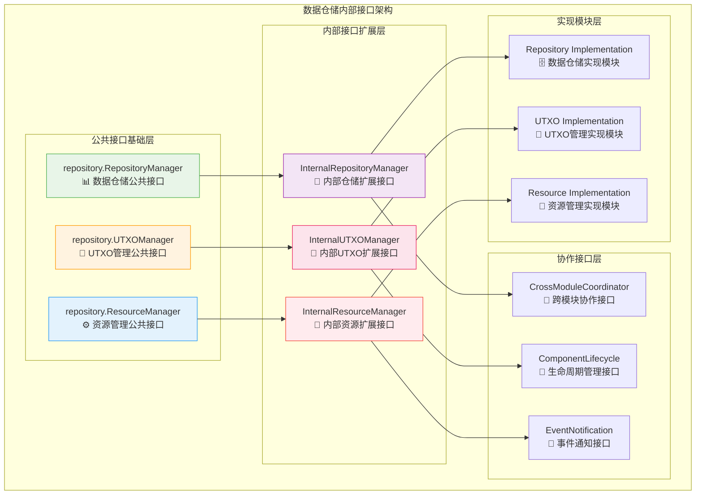
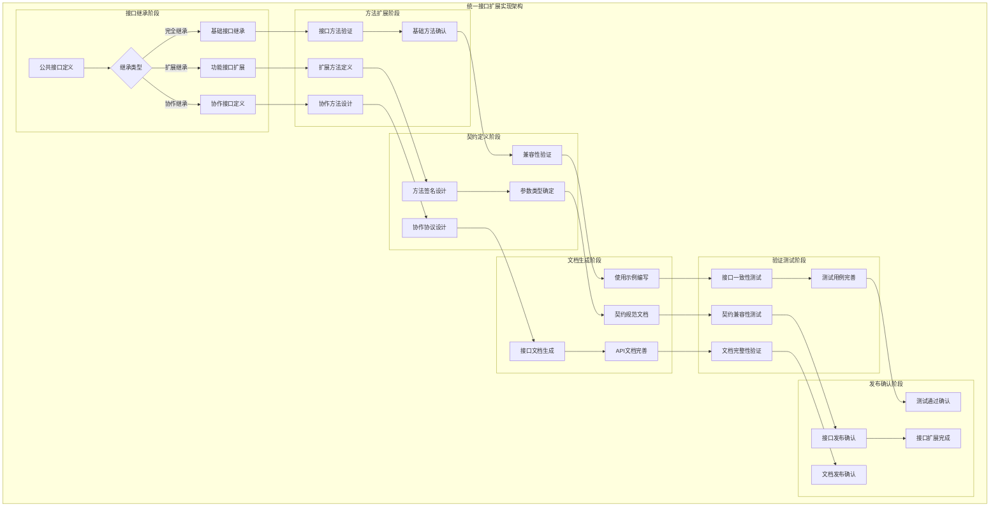
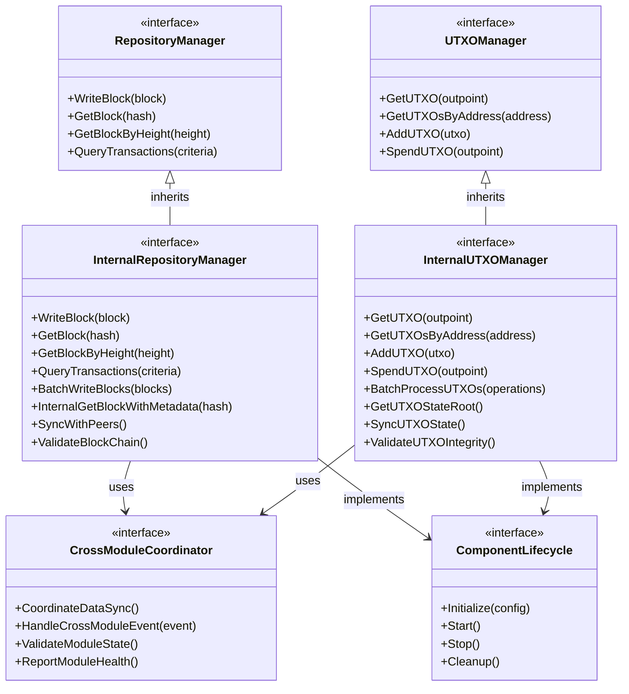

# 数据仓储内部接口定义（internal/core/repositories/interfaces）

【模块定位】
　　本模块是WES数据仓储层的内部接口定义中心，负责扩展公共接口并定义内部协作规范。通过**简单继承原则**的设计，在保持与公共接口一致性的同时，为内部实现提供必要的功能扩展，确保数据仓储层各子模块间的标准化协作。

【设计原则】
- **继承优先原则**：优先继承公共接口，避免重复定义和接口分歧
- **最小扩展原则**：只在确实需要时添加内部专用方法，保持接口简洁
- **架构一致性原则**：与其他内部接口模块保持相同的设计模式
- **职责分离原则**：明确区分公共接口和内部协作接口的职责边界
- **向后兼容原则**：确保接口扩展不影响公共接口的稳定性

【核心职责】
1. **公共接口继承**：继承并扩展pkg/interfaces/repository中的标准接口
2. **内部方法扩展**：为内部协作需求添加专门的接口方法
3. **跨模块协作**：定义数据仓储子模块间的标准化交互接口
4. **接口规范统一**：确保所有内部实现遵循统一的接口规范
5. **生命周期管理**：定义组件初始化、运行和销毁的接口契约
6. **错误处理规范**：统一内部接口的错误处理和异常传播机制

## 🏗️ **实现架构**

　　采用**接口继承扩展**的二层架构模式，确保内部接口与公共接口的有机结合和功能扩展。



**架构层次说明：**

1. **公共接口基础层**：标准化的对外接口定义
   - 数据仓储、UTXO和资源管理的标准接口
   - 对外提供统一的服务契约
   - 保证接口稳定性和向后兼容

2. **内部接口扩展层**：内部协作的接口扩展
   - 继承公共接口并添加内部方法
   - 支持模块间的高级协作功能
   - 提供内部优化和控制能力

3. **协作接口层**：跨模块协作的接口规范
   - 定义模块间的标准化交互协议
   - 支持生命周期管理和事件通知
   - 确保系统整体的协调运行

---

## 📁 **模块组织结构**

【接口定义模块架构】

```
internal/core/repositories/interfaces/
├── 📋 repository.go                    # 内部仓储接口扩展定义
├── 💎 utxo.go                          # 内部UTXO接口扩展定义
├── ⚙️ resource.go                      # 内部资源接口扩展定义
├── 🤝 coordination.go                  # 跨模块协作接口定义
├── 🔄 lifecycle.go                     # 生命周期管理接口定义
├── 📡 events.go                        # 事件通知接口定义
├── 🛡️ validation.go                    # 数据验证接口定义
├── 📊 metrics.go                       # 性能监控接口定义
├── 📝 README.md                        # 本文档
└── 🧪 examples/                        # 接口使用示例
    ├── repository_example.go           # 仓储接口使用示例
    ├── utxo_example.go                 # UTXO接口使用示例
    ├── resource_example.go             # 资源接口使用示例
    └── coordination_example.go         # 协作接口使用示例
```

### **🎯 接口文件职责分工**

| **接口文件** | **核心职责** | **继承来源** | **扩展功能** | **复杂度** |
|-------------|-------------|-------------|-------------|-----------|
| `repository.go` | 内部仓储接口扩展定义 | `repository.RepositoryManager` | 批量操作、内部查询、事务控制 | 高 |
| `utxo.go` | 内部UTXO接口扩展定义 | `repository.UTXOManager` | 状态同步、引用管理、批量更新 | 高 |
| `resource.go` | 内部资源接口扩展定义 | `repository.ResourceManager` | 内容协调、索引管理、生命周期 | 中 |
| `coordination.go` | 跨模块协作接口定义 | 原创接口 | 模块通信、数据同步、状态协调 | 中 |
| `lifecycle.go` | 生命周期管理接口定义 | 原创接口 | 初始化、启动、停止、清理 | 低 |
| `events.go` | 事件通知接口定义 | 原创接口 | 事件发布、订阅、处理 | 低 |
| `validation.go` | 数据验证接口定义 | 原创接口 | 数据校验、完整性检查 | 中 |
| `metrics.go` | 性能监控接口定义 | 原创接口 | 指标收集、性能监控 | 低 |
| `examples/` | 接口使用示例集合 | 示例代码 | 最佳实践、使用指南 | 低 |

---

## 🔄 **统一接口扩展实现**

【扩展策略】

　　所有内部接口扩展均严格遵循**继承优先原则**和**最小扩展原则**，确保与公共接口的完美兼容和功能增强。



**关键扩展要点：**

1. **继承优先策略**：
   - 严格继承公共接口的所有方法和语义
   - 保持方法签名和返回值的完全一致性
   - 确保公共接口的行为契约不被破坏

2. **最小扩展策略**：
   - 仅在内部协作确实需要时添加新方法
   - 扩展方法必须有明确的业务价值和技术必要性
   - 避免为了扩展而扩展，保持接口的简洁性

3. **兼容性保证策略**：
   - 新增方法不得影响现有方法的行为
   - 扩展接口必须向后兼容公共接口
   - 提供完整的接口迁移和升级指南

---

## 🏗️ **依赖注入架构**

【fx框架集成】

　　全面采用fx依赖注入框架，实现内部接口的统一管理和生命周期自动控制。

**依赖注入设计**：
- **接口定义管理**：统一管理所有内部接口定义和扩展
- **实现绑定管理**：自动绑定接口与具体实现的映射关系
- **生命周期控制**：自动管理接口实现的初始化和清理
- **依赖关系解析**：自动解析接口间的复杂依赖关系

**核心接口依赖关系**：
- InternalRepositoryManager依赖InternalUTXOManager、InternalResourceManager
- 所有内部接口依赖ComponentLifecycle、EventNotification、DataValidation
- 跨模块协作接口依赖所有具体业务接口
- 监控接口被所有其他接口依赖，提供统一的性能监控能力

---

## 📊 **性能与监控**

【接口性能指标】

| **接口类型** | **调用延迟目标** | **并发能力目标** | **成功率目标** | **监控方式** |
|-------------|----------------|-----------------|--------------|------------|
| 仓储接口调用 | < 1ms | > 10000 RPS | > 99.9% | 实时监控 |
| UTXO接口调用 | < 0.5ms | > 20000 RPS | > 99.9% | 高频监控 |
| 资源接口调用 | < 2ms | > 5000 RPS | > 99.5% | 批量统计 |
| 协作接口调用 | < 5ms | > 2000 RPS | > 99% | 异步监控 |
| 生命周期接口 | < 100ms | > 100 OPS | > 98% | 关键路径监控 |

**性能优化策略**：
- **接口优化**：方法签名优化、参数传递优化、返回值缓存
- **调用优化**：批量调用支持、异步调用机制、并发控制优化
- **内存优化**：接口对象池化、参数复用、垃圾回收优化
- **通信优化**：内部通信协议优化、序列化性能优化

---

## 🔗 **与公共接口的映射关系**

【接口继承映射】



**映射实现要点**：
- **完全继承**：内部接口完全继承公共接口的所有方法和行为契约
- **功能扩展**：在继承基础上添加内部协作所需的专用方法
- **协作支持**：通过协作接口实现跨模块的标准化通信
- **生命周期管理**：统一的组件生命周期管理接口

---

## 🚀 **后续扩展规划**

【接口演进方向】

1. **接口能力增强**
   - 支持更多业务场景的接口扩展
   - 实现接口版本管理和平滑升级
   - 添加接口性能监控和优化建议

2. **协作机制完善**
   - 实现更强的跨模块协作能力
   - 添加分布式系统的接口协调
   - 增强异步操作的接口支持

3. **兼容性保证增强**
   - 实现接口版本兼容性检查
   - 添加接口迁移工具和指南
   - 增强接口文档的自动生成

4. **开发体验优化**
   - 提供接口代码生成工具
   - 实现接口使用的智能提示
   - 添加接口调用的调试支持

---

## 📋 **开发指南**

【接口扩展开发规范】

1. **新接口定义步骤**：
   - 确认是否需要新接口或扩展现有接口
   - 设计接口方法签名和行为契约
   - 编写接口文档和使用示例
   - 添加接口测试用例和验证逻辑

2. **接口扩展质量要求**：
   - 严格遵循继承优先和最小扩展原则
   - 确保接口方法的语义清晰和行为一致
   - 提供完整的接口文档和代码注释
   - 保证接口的向后兼容性和稳定性

3. **协作接口设计要求**：
   - 明确定义跨模块协作的责任边界
   - 设计合理的异步操作和错误处理机制
   - 实现高效的数据传递和状态同步
   - 支持模块的独立测试和集成验证

【参考文档】
- [数据仓储主模块](../README.md)
- [公共接口规范](../../../pkg/interfaces/repository/)
- [WES架构设计文档](../../../../docs/architecture/)

---

> 📝 **模板说明**：本README模板基于WES v0.0.1统一文档规范设计，专门用于内部接口定义模块的标准化文档。所有接口扩展必须严格遵循继承优先原则，确保与公共接口的完美兼容。

> 🔄 **维护指南**：本文档应与接口定义保持严格同步，每次接口变更后必须立即更新相应的文档内容。建议在接口扩展前先更新文档设计，确保接口扩展的合理性和必要性。
