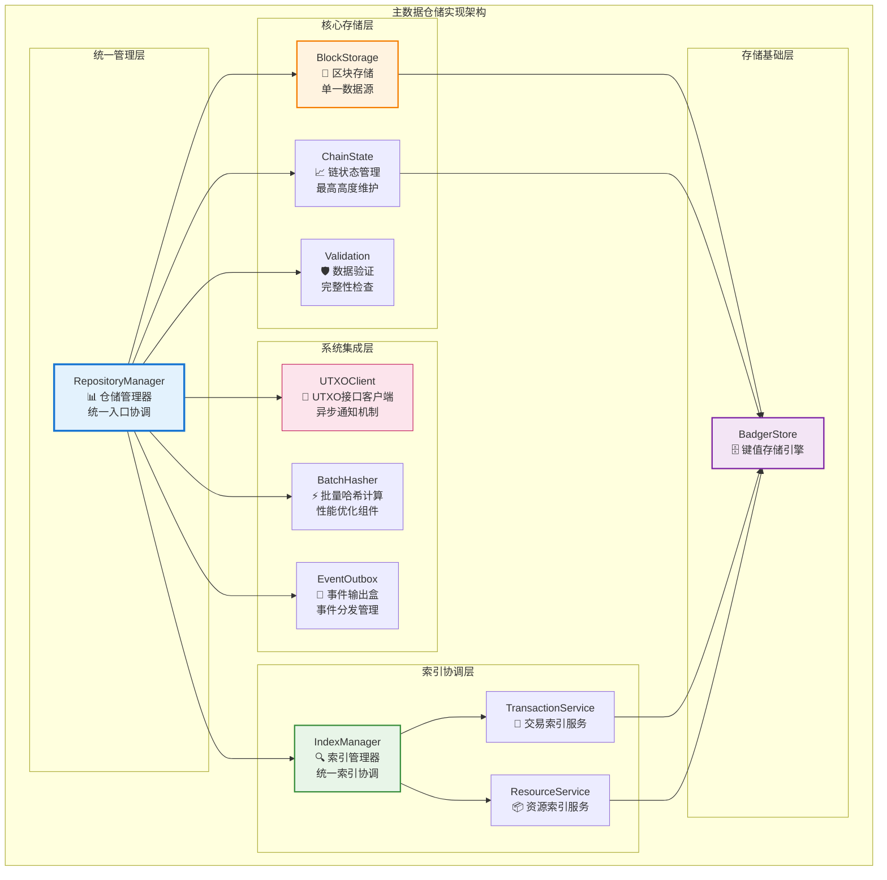
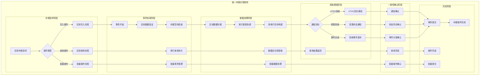
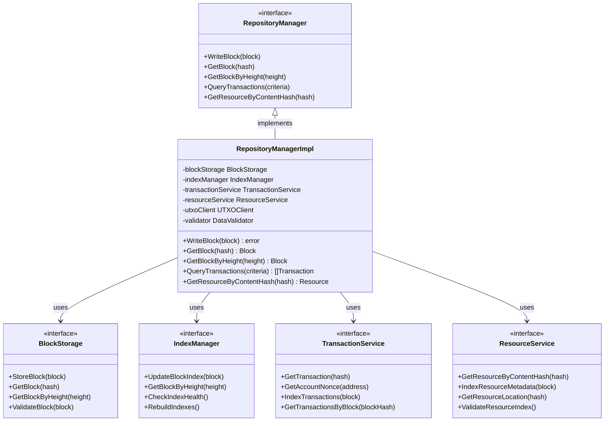

# 主数据仓储实现（internal/core/repositories/repository）

【模块定位】
　　本模块是WES区块链的主数据仓储实现核心，作为三个独立存储实体中的Repository实体，负责区块存储、索引管理和跨系统协调。严格遵循**区块单一数据源原则**，提供轻量级索引和实时数据提取服务，确保整个系统的数据一致性和高性能访问能力。

【设计原则】
- **区块单一数据源**：区块作为系统唯一数据写入点，所有其他数据实时提取
- **轻量级索引原则**：索引只存储位置信息，不重复存储业务数据
- **原子性事务原则**：区块存储与索引更新在同一事务中完成
- **接口隔离原则**：通过标准化内部接口与UTXO、资源系统协作
- **高性能查询原则**：基于位置索引实现O(1)时间复杂度查询
- **实时计算原则**：所有业务数据从区块实时计算和提取

【核心职责】
1. **区块存储管理**：提供区块数据的安全存储和高效查询服务
2. **统一索引协调**：管理交易、资源、高度等多类型索引的统一构建
3. **跨系统接口调用**：异步通知UTXO系统和资源系统的数据变更
4. **区块链状态维护**：维护最高区块高度和区块链完整性状态
5. **数据一致性保证**：确保存储操作的原子性和数据完整性
6. **性能优化管理**：提供批量操作和查询优化支持

## 🏗️ **实现架构**

　　采用**分层协调管理**的四层实现架构，确保主数据仓储的高效性、可靠性和扩展性。



**架构层次说明：**

1. **统一管理层**：提供统一的数据仓储服务入口
   - 协调各子模块的协作和数据流转
   - 实现标准化的接口契约和错误处理
   - 管理整体的生命周期和配置

2. **核心存储层**：负责核心数据的存储和管理
   - 区块数据的安全存储和快速查询
   - 区块链状态的实时维护和监控
   - 数据完整性验证和异常检测

3. **索引协调层**：管理多类型索引的统一构建
   - 协调交易索引和资源索引的同步构建
   - 提供高性能的位置查询和数据定位
   - 支持索引健康检查和自动修复

4. **系统集成层**：处理跨系统协作和性能优化
   - 异步通知外部系统的数据变更
   - 批量操作优化和性能提升组件
   - 事件分发和系统间通信管理

---

## 📁 **模块组织结构**

【主仓储模块架构】

```
internal/core/repositories/repository/
├── 📊 manager.go                       # 仓储管理器主入口
├── 🎯 block.go                         # 区块存储核心实现
├── 📈 chain.go                         # 区块链状态管理
├── ⚡ batch_hash.go                     # 批量哈希计算服务
├── 📡 outbox.go                        # 事件输出盒管理
├── 🛡️ validation.go                    # 数据验证服务
├── 🔍 index/                           # 统一索引管理子模块
│   ├── manager.go                       # 索引管理器协调中心
│   ├── hash.go                          # 哈希索引实现
│   ├── height.go                        # 高度索引实现
│   └── README.md                        # 索引管理文档
├── 📄 transaction/                      # 交易位置索引子模块
│   ├── service.go                       # 交易查询服务门面
│   ├── index.go                         # 交易索引核心实现
│   ├── query.go                         # 交易查询操作实现
│   └── README.md                        # 交易索引文档
├── 📦 resource/                         # 资源元数据索引子模块
│   ├── service.go                       # 资源查询服务门面
│   ├── index.go                         # 资源索引核心实现
│   ├── query.go                         # 资源查询操作实现
│   └── README.md                        # 资源索引文档
├── 🔗 utxo/                             # UTXO系统接口客户端
│   ├── service.go                       # UTXO接口客户端服务
│   └── README.md                        # UTXO客户端文档
├── 📝 README.md                         # 本文档
└── 🧪 tests/                            # 测试文件目录
    ├── manager_test.go                  # 仓储管理器测试
    ├── block_storage_test.go            # 区块存储测试
    ├── index_coordination_test.go       # 索引协调测试
    ├── integration_test.go              # 系统集成测试
    └── performance_test.go              # 性能基准测试
```

### **🎯 子模块职责分工**

| **子模块** | **核心职责** | **对外接口** | **内部组件** | **复杂度** |
|-----------|-------------|-------------|-------------|-----------|
| `manager.go` | 仓储管理器主入口和协调 | RepositoryManager | 接口实现、依赖注入、生命周期管理 | 高 |
| `block.go` | 区块存储核心实现 | BlockStorage | 存储引擎、查询优化、缓存管理 | 高 |
| `chain.go` | 区块链状态管理 | ChainState | 最高高度、状态监控、完整性检查 | 中 |
| `batch_hash.go` | 批量哈希计算服务 | BatchHasher | 并行计算、性能优化、结果缓存 | 中 |
| `outbox.go` | 事件输出盒管理 | EventOutbox | 事件队列、异步分发、重试机制 | 中 |
| `validation.go` | 数据验证服务 | DataValidator | 完整性检查、格式验证、异常检测 | 中 |
| `index/` | 统一索引管理协调 | IndexManager | 多索引协调、健康检查、自动修复 | 高 |
| `transaction/` | 交易位置索引与查询 | TransactionService | 交易索引、位置查询、nonce计算 | 高 |
| `resource/` | 资源元数据索引与查询 | ResourceService | 资源索引、内容寻址、元数据查询 | 高 |
| `utxo/` | UTXO系统接口客户端 | UTXOClient | 异步通知、接口调用、重试机制 | 中 |
| `tests/` | 主仓储功能测试验证 | 测试工具和框架 | 单元测试、集成测试、性能测试 | 中 |

---

## 🔄 **统一存储实现**

【存储策略】

　　所有存储操作均严格遵循**区块单一数据源原则**和**原子性事务机制**，确保数据的一致性、完整性和高性能访问。



**关键存储要点：**

1. **单一数据源保证**：
   - 区块作为系统唯一的数据写入点，确保数据来源的一致性
   - 所有业务数据从区块实时计算，避免数据冗余和不一致
   - 轻量级索引只存储位置信息，不重复存储业务数据

2. **原子性事务机制**：
   - 区块存储与索引更新在同一事务中完成，保证操作原子性
   - 支持复杂的多步操作回滚，确保数据完整性
   - 提供事务级别的错误处理和恢复机制

3. **异步协调优化**：
   - 跨系统通知采用异步机制，避免阻塞主存储流程
   - 智能的重试和恢复策略，确保分布式操作的可靠性
   - 高效的事件分发和状态同步机制

---

## 🏗️ **依赖注入架构**

【fx框架集成】

　　全面采用fx依赖注入框架，实现主仓储模块的统一管理和自动化生命周期控制。

**依赖注入设计**：
- **核心组件装配**：自动装配仓储管理器、区块存储、索引管理器等核心组件
- **子服务集成**：统一注入交易服务、资源服务、UTXO客户端等专业服务
- **基础设施依赖**：自动注入存储引擎、哈希服务、验证服务等基础设施
- **生命周期管理**：自动管理所有组件的初始化、启动、运行和优雅关闭

**核心组件依赖关系**：
- RepositoryManager依赖BlockStorage、IndexManager、ValidationService
- IndexManager依赖TransactionService、ResourceService、UTXOClient
- 所有服务组件依赖BadgerStore、BatchHasher、EventOutbox
- 跨系统组件依赖InternalUTXOManager、Logger、Config、MetricsCollector

---

## 📊 **性能与监控**

【性能指标】

| **操作类型** | **目标延迟** | **吞吐量目标** | **成功率** | **监控方式** |
|-------------|-------------|---------------|-----------|------------|
| 区块存储操作 | < 100ms | > 1000 BPS | > 99.9% | 实时监控 |
| 区块查询操作 | < 10ms | > 5000 QPS | > 99.9% | 高频监控 |
| 交易查询操作 | < 5ms | > 10000 QPS | > 99.5% | 批量统计 |
| 资源查询操作 | < 3ms | > 8000 QPS | > 99.5% | 异步监控 |
| 索引构建操作 | < 50ms | > 2000 IPS | > 99% | 关键路径监控 |
| 跨系统通知 | < 200ms | > 5000 NPS | > 98% | 异步监控 |

**性能优化策略**：
- **存储优化**：分层存储、智能缓存、批量写入、压缩存储
- **查询优化**：索引优化、查询计划、并行查询、结果缓存
- **并发优化**：读写分离、连接池、异步处理、锁粒度优化
- **系统优化**：内存管理、垃圾回收、资源池化、负载均衡

---

## 🔗 **与公共接口的映射关系**

【接口实现映射】



**实现要点**：
- **接口契约**：严格遵循公共接口的方法签名和语义约定
- **错误处理**：统一的错误类型定义和异常处理机制
- **日志记录**：完整的操作日志和性能指标记录
- **测试覆盖**：全面的接口方法测试和集成验证

---

## 🚀 **后续扩展规划**

【模块演进方向】

1. **存储能力增强**
   - 支持分布式存储和数据分片策略
   - 实现更智能的数据压缩和归档机制
   - 添加多种存储后端的适配支持

2. **查询性能优化**
   - 实现更高效的查询优化器和执行引擎
   - 添加智能缓存策略和预加载机制
   - 优化并行查询和批量操作性能

3. **系统集成增强**
   - 实现更强的跨系统协调和数据同步能力
   - 添加分布式事务的支持和管理
   - 增强异步操作的可靠性和性能

4. **运维监控完善**
   - 提供更详细的存储和查询监控指标
   - 实现自动化的故障检测和恢复机制
   - 添加智能的性能调优建议系统

---

## 📋 **开发指南**

【主仓储开发规范】

1. **新功能开发步骤**：
   - 确定功能需求和技术实现方案
   - 设计接口契约和数据结构定义
   - 实现核心逻辑和异常处理机制
   - 添加完整的单元测试和集成测试

2. **代码质量要求**：
   - 严格遵循Go语言最佳实践和项目编码规范
   - 实现生产级的错误处理和异常恢复机制
   - 提供详细的代码注释和技术文档
   - 保证核心功能100%的测试覆盖率

3. **性能要求**：
   - 关键路径延迟指标必须达到或超越设计目标
   - 实现合理的内存使用和资源管理策略
   - 支持高并发操作和大规模数据处理
   - 提供完整的性能监控和调优机制

4. **集成要求**：
   - 模块必须通过fx依赖注入框架集成
   - 与其他模块的交互仅通过定义的接口进行
   - 支持模块的独立测试和系统集成验证
   - 提供完整的跨系统协调和状态管理

【参考文档】
- [数据仓储主模块](../README.md)
- [统一索引管理](index/README.md)
- [交易索引服务](transaction/README.md)
- [资源索引服务](resource/README.md)
- [UTXO接口客户端](utxo/README.md)
- [WES架构设计文档](../../../../docs/architecture/)

---

> 📝 **模板说明**：本README模板基于WES v0.0.1统一文档规范设计，使用时请根据具体模块需求替换相应的占位符内容，并确保所有章节都有实质性的技术内容。

> 🔄 **维护指南**：本文档应随着模块功能的演进及时更新，确保文档与代码实现的一致性。建议在每次重大功能变更后更新相应章节。