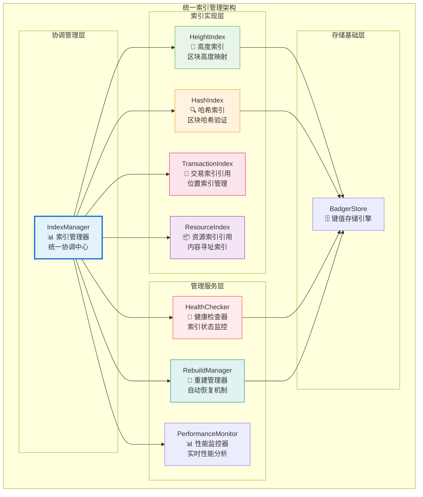
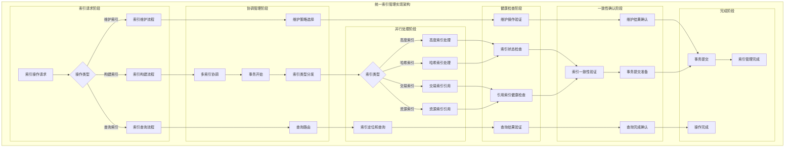
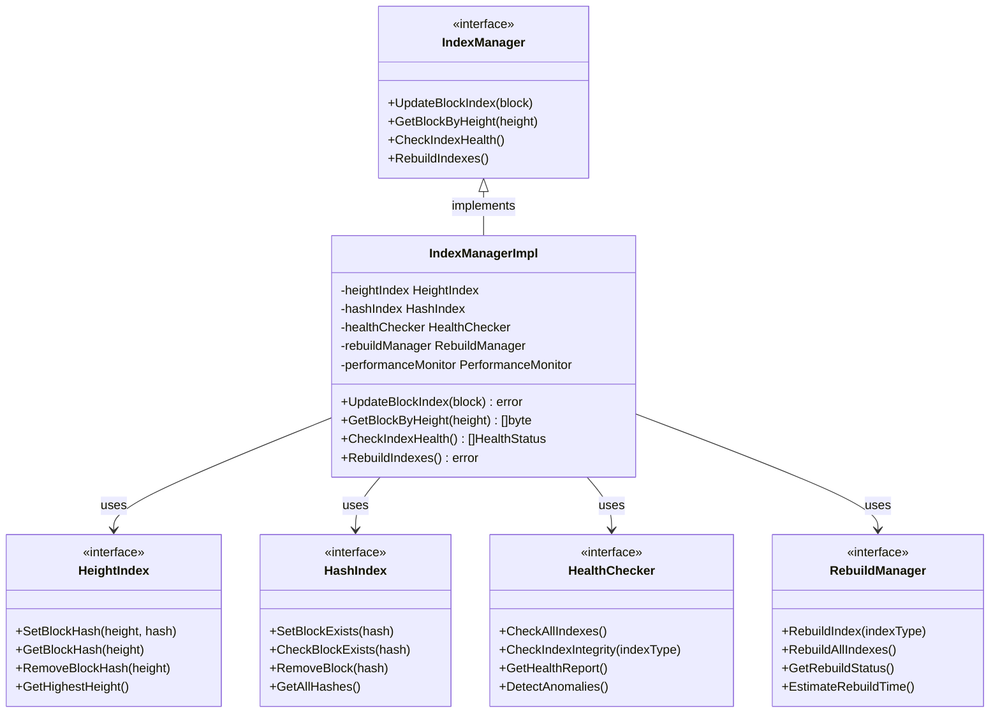

# 统一索引管理模块（internal/core/repositories/repository/index）

【模块定位】
　　本模块是主数据仓储中的统一索引管理协调中心，负责区块索引、交易索引、资源索引等多类型索引的统一构建、维护和协调。通过**统一管理原则**的设计，确保所有索引操作的事务一致性和高效性，为整个数据仓储系统提供可靠的索引基础设施。

【设计原则】
- **统一管理原则**：所有索引操作通过IndexManager统一协调和管理
- **原子性保证原则**：多类型索引更新在同一事务中完成，确保一致性
- **并行构建原则**：支持多索引类型的并行构建和批量操作优化
- **自动恢复原则**：提供索引损坏检测和自动重建的完整机制
- **性能优化原则**：实时监控索引构建和查询性能，持续优化
- **健康监控原则**：全面的索引健康检查和状态监控能力

【核心职责】
1. **多索引协调管理**：统一管理区块、交易、资源等各类型索引的构建
2. **事务一致性保证**：确保多类型索引更新的原子性和一致性
3. **索引健康监控**：持续监控索引状态，及时发现和处理异常
4. **自动恢复机制**：提供索引损坏检测和自动重建的完整解决方案
5. **性能优化管理**：监控和优化索引构建、查询的性能表现
6. **并行构建协调**：支持高效的并行索引构建和批量操作

## 🏗️ **实现架构**

　　采用**协调管理中心**的三层架构模式，确保多类型索引的统一管理和高效协调。



**架构层次说明：**

1. **协调管理层**：统一的索引管理协调中心
   - 索引操作的统一入口和协调控制
   - 多类型索引的事务管理和一致性保证
   - 索引构建策略的制定和执行

2. **索引实现层**：各类型索引的具体实现
   - 高度索引和哈希索引的直接管理
   - 交易索引和资源索引的引用协调
   - 支持索引类型的灵活扩展和定制

3. **管理服务层**：索引管理的辅助服务
   - 索引健康状态的持续监控
   - 自动恢复机制的完整实现
   - 性能监控和优化建议服务

---

## 📁 **模块组织结构**

【索引管理模块架构】

```
internal/core/repositories/repository/index/
├── 📊 manager.go                       # 索引管理器协调中心
├── 📏 height.go                        # 高度索引实现
├── 🔍 hash.go                          # 哈希索引实现
├── 🏥 health.go                        # 索引健康检查器
├── 🔧 rebuild.go                       # 索引重建管理器
├── 📊 performance.go                   # 性能监控和分析
├── ⚙️ config.go                        # 索引配置管理
├── 📊 metrics.go                       # 监控指标收集
├── 📝 README.md                        # 本文档
└── 🧪 tests/                           # 测试文件目录
    ├── manager_test.go                  # 索引管理器测试
    ├── coordination_test.go             # 索引协调测试
    ├── health_check_test.go             # 健康检查测试
    ├── rebuild_test.go                  # 重建机制测试
    ├── performance_test.go              # 性能测试
    └── integration_test.go              # 集成测试
```

### **🎯 组件职责分工**

| **组件** | **核心职责** | **对外接口** | **内部组件** | **复杂度** |
|---------|-------------|-------------|-------------|-----------|
| `manager.go` | 索引管理器协调中心 | IndexManager | 协调逻辑、事务管理、接口实现 | 高 |
| `height.go` | 高度索引实现 | HeightIndex | 高度映射、区块定位、查询优化 | 中 |
| `hash.go` | 哈希索引实现 | HashIndex | 哈希验证、存在检查、完整性验证 | 中 |
| `health.go` | 索引健康检查器 | HealthChecker | 状态检查、异常检测、报告生成 | 中 |
| `rebuild.go` | 索引重建管理器 | RebuildManager | 重建策略、恢复机制、进度管理 | 高 |
| `performance.go` | 性能监控和分析 | PerformanceMonitor | 指标收集、性能分析、优化建议 | 中 |
| `config.go` | 索引配置管理 | ConfigManager | 配置加载、参数管理、动态调整 | 低 |
| `metrics.go` | 监控指标收集 | MetricsCollector | 指标定义、数据收集、报告导出 | 低 |
| `tests/` | 索引管理功能测试 | 测试工具和框架 | 单元测试、集成测试、性能测试 | 中 |

---

## 🔄 **统一索引管理实现**

【管理策略】

　　所有索引管理操作均严格遵循**统一管理原则**和**事务一致性原则**，确保多类型索引的协调构建和可靠维护。



**关键管理要点：**

1. **统一协调机制**：
   - 所有索引操作通过IndexManager统一协调和管理
   - 多类型索引的事务级别同步更新和一致性保证
   - 智能的索引构建策略和性能优化机制

2. **并行处理优化**：
   - 支持多索引类型的并行构建和批量操作
   - 高效的资源利用和负载均衡策略
   - 动态的性能调优和资源分配机制

3. **健康监控保障**：
   - 全面的索引健康状态监控和异常检测
   - 自动化的故障恢复和索引重建机制
   - 完整的监控指标收集和报告生成

---

## 🏗️ **依赖注入架构**

【fx框架集成】

　　全面采用fx依赖注入框架，实现索引管理模块的统一装配和生命周期管理。

**依赖注入设计**：
- **核心管理器注入**：统一注入IndexManager作为索引管理的协调中心
- **索引实现注入**：自动注入HeightIndex、HashIndex等具体索引实现
- **辅助服务注入**：集成HealthChecker、RebuildManager、PerformanceMonitor等服务
- **基础设施注入**：统一注入BadgerStore、Logger、Config等基础设施依赖

**核心组件依赖关系**：
- IndexManager依赖所有具体索引实现和辅助服务组件
- 所有索引实现依赖BadgerStore、MetricsCollector、Logger
- HealthChecker依赖所有索引实现，提供统一健康检查
- RebuildManager依赖所有索引实现和数据源，支持自动重建

---

## 📊 **性能与监控**

【性能指标】

| **操作类型** | **目标延迟** | **吞吐量目标** | **成功率** | **监控方式** |
|-------------|-------------|---------------|-----------|------------|
| 索引构建操作 | < 50ms | > 2000 IPS | > 99.5% | 实时监控 |
| 多索引协调 | < 20ms | > 5000 CPS | > 99.8% | 高频监控 |
| 索引查询操作 | < 2ms | > 10000 QPS | > 99.9% | 批量统计 |
| 健康检查操作 | < 100ms | > 500 HPS | > 99% | 异步监控 |
| 索引重建操作 | < 5000ms | > 100 RPS | > 95% | 关键路径监控 |
| 性能监控采集 | < 10ms | > 1000 MPS | > 99% | 异步监控 |

**性能优化策略**：
- **索引优化**：智能索引策略、批量构建、增量更新、并行处理
- **协调优化**：事务优化、锁粒度控制、异步处理、负载均衡
- **监控优化**：采样监控、异步收集、数据压缩、智能告警
- **存储优化**：数据压缩、缓存策略、连接池、写入优化

---

## 🔗 **与公共接口的映射关系**

【接口实现映射】



**映射实现要点**：
- **接口契约**：严格遵循索引管理的接口规范和语义约定
- **功能完整性**：完整实现索引构建、查询、健康检查、重建等功能
- **性能保证**：满足各种操作的性能指标和响应时间要求
- **可靠性保证**：提供完整的错误处理和异常恢复机制

---

## 🚀 **后续扩展规划**

【模块演进方向】

1. **索引能力增强**
   - 支持更多索引类型的动态注册和管理
   - 实现智能索引策略和自适应优化
   - 添加分布式索引和跨节点协调能力

2. **性能优化升级**
   - 实现更高效的并行索引构建算法
   - 添加智能缓存和预加载机制
   - 优化大规模数据的索引构建性能

3. **监控运维增强**
   - 实现更智能的异常检测和预警机制
   - 添加自动化的性能调优和容量规划
   - 增强可视化监控和运维管理界面

4. **扩展性提升**
   - 支持插件化的索引类型扩展机制
   - 实现索引的热切换和在线升级能力
   - 添加多租户和资源隔离支持

---

## 📋 **开发指南**

【索引管理开发规范】

1. **新索引类型开发步骤**：
   - 设计索引接口和数据结构定义
   - 实现索引构建、查询、维护的核心逻辑
   - 集成到IndexManager的统一协调机制
   - 添加健康检查和重建支持

2. **代码质量要求**：
   - 严格遵循Go语言编程规范和项目代码标准
   - 实现完整的错误处理和异常恢复机制
   - 提供详细的代码注释和技术文档
   - 保证核心功能的100%测试覆盖率

3. **性能要求**：
   - 索引操作必须满足既定的性能指标要求
   - 实现高效的内存使用和资源管理策略
   - 支持大规模数据和高并发场景的处理
   - 提供完整的性能监控和调优机制

4. **集成要求**：
   - 必须通过fx依赖注入框架完成集成
   - 严格遵循索引管理的接口规范和协议
   - 支持与其他索引类型的协调和配合
   - 提供完整的健康检查和自动恢复能力

【参考文档】
- [主数据仓储实现](../README.md)
- [交易索引服务](../transaction/README.md)
- [资源索引服务](../resource/README.md)
- [WES架构设计文档](../../../../../docs/architecture/)

---

> 📝 **模板说明**：本README模板基于WES v0.0.1统一文档规范设计，使用时请根据具体模块需求替换相应的占位符内容，并确保所有章节都有实质性的技术内容。

> 🔄 **维护指南**：本文档应随着模块功能的演进及时更新，确保文档与代码实现的一致性。建议在每次重大功能变更后更新相应章节。