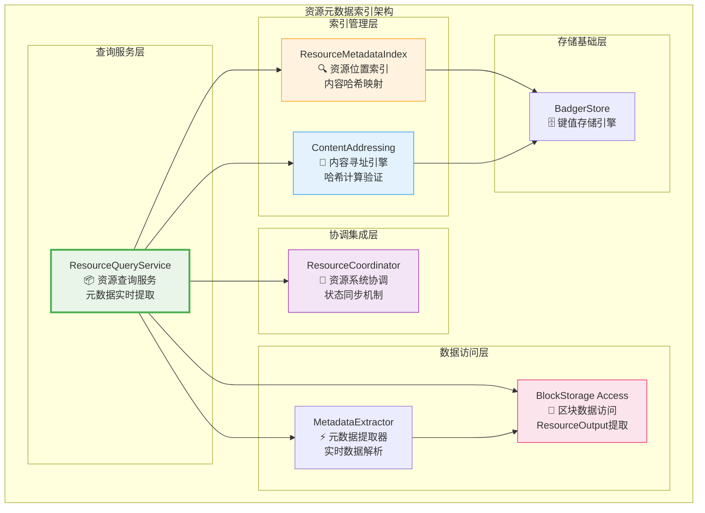
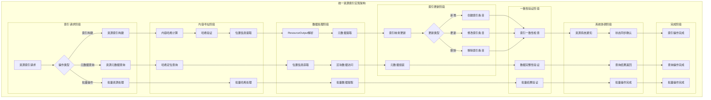
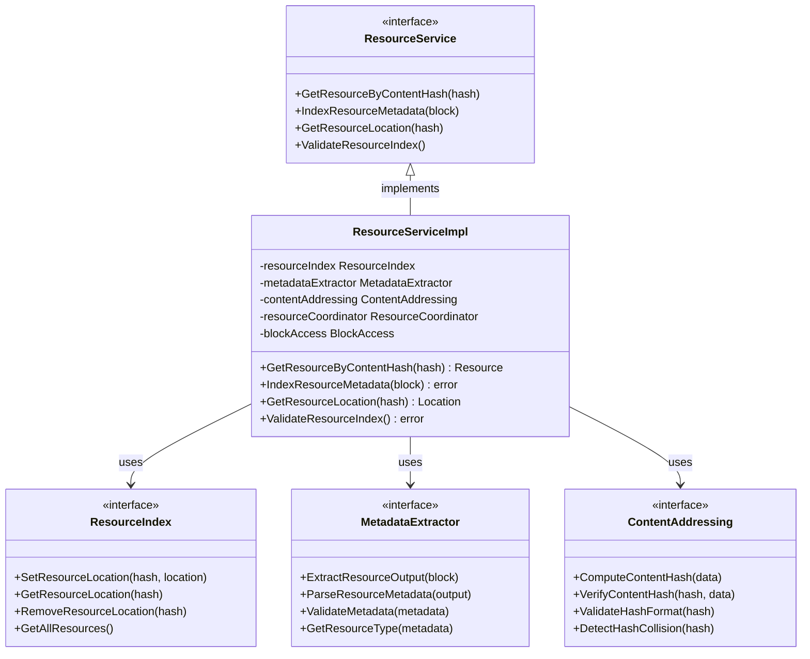

# 资源元数据索引服务（internal/core/repositories/repository/resource）

【模块定位】
　　本模块是主数据仓储中的资源元数据索引管理服务，专门负责资源内容哈希到位置信息的映射管理和快速查询。严格遵循**轻量级索引原则**，只存储资源元数据的位置信息，通过内容寻址机制提供高性能的资源定位和实时数据提取服务。

【设计原则】
- **轻量级索引原则**：只存储contentHash → (blockHash, txIndex, outputIndex)映射关系
- **内容寻址原则**：基于SHA-256内容哈希实现全局唯一的资源标识
- **实时提取原则**：所有资源元数据从区块中的ResourceOutput实时提取
- **高性能查询原则**：支持O(1)时间复杂度的内容哈希查询
- **一致性保证原则**：索引更新与区块存储在同一事务中完成
- **分离协调原则**：与Resource文件系统保持清晰的职责边界

【核心职责】
1. **资源位置索引管理**：维护内容哈希到区块位置的精确映射关系
2. **内容寻址查询服务**：提供基于内容哈希的高性能资源定位服务
3. **元数据实时提取**：从区块中实时提取和解析ResourceOutput数据
4. **索引一致性维护**：确保资源索引与区块数据的强一致性
5. **查询性能优化**：提供高并发的资源查询和批量操作支持
6. **跨系统协调**：与Resource文件系统进行元数据协调和状态同步

## 🏗️ **实现架构**

　　采用**内容寻址查询**的三层架构模式，确保资源元数据的高效索引和快速查询。



**架构层次说明：**

1. **查询服务层**：资源查询的统一服务入口
   - 基于内容哈希的资源元数据查询服务
   - 实时数据提取和结果组装
   - 查询性能优化和缓存管理

2. **索引管理层**：资源位置索引的核心管理
   - 内容哈希到区块位置的映射维护
   - 内容寻址引擎和哈希验证
   - 索引构建和一致性保证

3. **数据访问层**：区块数据的访问和处理
   - 区块存储的高效访问接口
   - ResourceOutput的实时提取和解析
   - 元数据格式转换和验证

4. **协调集成层**：与外部系统的协调
   - 与Resource文件系统的状态协调
   - 元数据一致性验证和同步
   - 跨系统事件通知和处理

---

## 📁 **模块组织结构**

【资源索引模块架构】

```
internal/core/repositories/repository/resource/
├── 📦 service.go                       # 资源查询服务门面
├── 🔍 index.go                         # 资源位置索引核心实现
├── 📄 query.go                         # 资源查询操作实现
├── ⚡ extractor.go                     # 元数据提取器实现
├── 🎯 addressing.go                    # 内容寻址引擎实现
├── 🤝 coordinator.go                   # 资源系统协调器
├── ✅ validator.go                     # 资源索引验证器
├── 📊 metrics.go                       # 性能监控指标收集
├── ⚙️ config.go                        # 资源索引配置管理
├── 📝 README.md                        # 本文档
└── 🧪 tests/                           # 测试文件目录
    ├── service_test.go                  # 查询服务测试
    ├── index_test.go                    # 索引实现测试
    ├── query_test.go                    # 查询操作测试
    ├── extractor_test.go                # 元数据提取测试
    ├── addressing_test.go               # 内容寻址测试
    ├── integration_test.go              # 集成测试
    └── performance_test.go              # 性能测试
```

### **🎯 组件职责分工**

| **组件** | **核心职责** | **对外接口** | **内部组件** | **复杂度** |
|---------|-------------|-------------|-------------|-----------|
| `service.go` | 资源查询服务门面 | ResourceService | 服务协调、接口实现、生命周期管理 | 高 |
| `index.go` | 资源位置索引核心实现 | ResourceIndex | 索引管理、位置映射、一致性保证 | 高 |
| `query.go` | 资源查询操作实现 | QueryOperations | 查询优化、结果组装、缓存管理 | 中 |
| `extractor.go` | 元数据提取器实现 | MetadataExtractor | 数据解析、格式转换、验证处理 | 中 |
| `addressing.go` | 内容寻址引擎实现 | ContentAddressing | 哈希计算、寻址验证、完整性检查 | 中 |
| `coordinator.go` | 资源系统协调器 | ResourceCoordinator | 跨系统协调、状态同步、事件处理 | 中 |
| `validator.go` | 资源索引验证器 | IndexValidator | 索引验证、完整性检查、异常检测 | 中 |
| `metrics.go` | 性能监控指标收集 | MetricsCollector | 指标定义、数据收集、报告生成 | 低 |
| `config.go` | 资源索引配置管理 | ConfigManager | 配置加载、参数管理、动态调整 | 低 |
| `tests/` | 资源索引功能测试 | 测试工具和框架 | 单元测试、集成测试、性能测试 | 中 |

---

## 🔄 **统一资源索引实现**

【索引策略】

　　所有资源索引操作均严格遵循**内容寻址原则**和**轻量级索引原则**，确保资源元数据的高效索引和可靠查询。



**关键索引要点：**

1. **内容寻址机制**：
   - 基于SHA-256内容哈希实现全局唯一的资源标识
   - 支持内容哈希的快速计算、验证和查询定位
   - 提供完整的哈希碰撞检测和处理机制

2. **轻量级索引设计**：
   - 只存储内容哈希到区块位置的映射关系
   - 避免重复存储资源元数据，确保数据的单一来源
   - 实现高效的索引存储空间利用和查询性能

3. **实时数据提取**：
   - 所有资源元数据从区块中的ResourceOutput实时提取
   - 支持多种资源类型的统一解析和格式转换
   - 提供完整的数据验证和错误处理机制

---

## 🏗️ **依赖注入架构**

【fx框架集成】

　　全面采用fx依赖注入框架，实现资源索引模块的统一装配和生命周期管理。

**依赖注入设计**：
- **服务门面注入**：统一注入ResourceService作为资源查询的对外接口
- **核心组件注入**：自动注入ResourceIndex、MetadataExtractor、ContentAddressing等核心组件
- **协调服务注入**：集成ResourceCoordinator、IndexValidator、MetricsCollector等辅助服务
- **基础设施注入**：统一注入BadgerStore、BlockStorage、Logger等基础设施依赖

**核心组件依赖关系**：
- ResourceService依赖ResourceIndex、MetadataExtractor、ContentAddressing
- ResourceIndex依赖BadgerStore、IndexValidator、MetricsCollector
- MetadataExtractor依赖BlockStorage、ResourceCoordinator、Logger
- ContentAddressing依赖哈希计算服务、完整性验证服务

---

## 📊 **性能与监控**

【性能指标】

| **操作类型** | **目标延迟** | **吞吐量目标** | **成功率** | **监控方式** |
|-------------|-------------|---------------|-----------|------------|
| 资源查询操作 | < 3ms | > 15000 QPS | > 99.9% | 实时监控 |
| 元数据提取 | < 2ms | > 20000 EPS | > 99.8% | 高频监控 |
| 索引构建操作 | < 0.5ms | > 50000 IPS | > 99.5% | 批量统计 |
| 内容哈希计算 | < 1ms | > 30000 HPS | > 99.9% | 异步监控 |
| 批量资源查询 | < 10ms | > 5000 BPS | > 99% | 关键路径监控 |
| 跨系统协调 | < 50ms | > 2000 CPS | > 98% | 异步监控 |

**性能优化策略**：
- **查询优化**：哈希索引优化、查询缓存、预加载机制、并发查询
- **索引优化**：批量索引构建、增量更新、索引压缩、智能缓存
- **提取优化**：流式数据处理、并行解析、结果缓存、内存优化
- **协调优化**：异步通信、批量同步、状态缓存、负载均衡

---

## 🔗 **与公共接口的映射关系**

【接口实现映射】



**映射实现要点**：
- **接口契约**：严格遵循资源索引的接口规范和语义约定
- **功能完整性**：完整实现资源查询、索引构建、元数据提取等功能
- **性能保证**：满足各种操作的性能指标和响应时间要求
- **可靠性保证**：提供完整的错误处理和异常恢复机制

---

## 🚀 **后续扩展规划**

【模块演进方向】

1. **查询能力增强**
   - 支持更复杂的资源查询条件和过滤机制
   - 实现资源类型、标签、创建者等多维查询
   - 添加资源关系查询和依赖分析功能

2. **索引性能优化**
   - 实现更高效的内容哈希计算和验证算法
   - 添加智能缓存策略和预加载机制
   - 优化大规模资源的索引构建和查询性能

3. **跨系统集成增强**
   - 实现与Resource文件系统的更深度集成
   - 添加资源状态的实时同步和一致性检查
   - 增强跨系统的事件通知和协调机制

4. **扩展性提升**
   - 支持新资源类型的动态注册和扩展
   - 实现资源索引的分片和分布式管理
   - 添加资源版本管理和历史查询支持

---

## 📋 **开发指南**

【资源索引开发规范】

1. **新功能开发步骤**：
   - 设计资源查询或索引的接口和数据结构
   - 实现核心的查询逻辑和索引管理功能
   - 集成到ResourceService的统一服务接口
   - 添加完整的测试用例和性能验证

2. **代码质量要求**：
   - 严格遵循Go语言编程规范和项目代码标准
   - 实现完整的错误处理和异常恢复机制
   - 提供详细的代码注释和技术文档
   - 保证核心功能的100%测试覆盖率

3. **性能要求**：
   - 查询操作必须满足毫秒级的响应时间要求
   - 实现高效的内存使用和资源管理策略
   - 支持高并发查询和大规模数据处理
   - 提供完整的性能监控和调优机制

4. **集成要求**：
   - 必须通过fx依赖注入框架完成集成
   - 严格遵循资源索引的接口规范和协议
   - 支持与其他模块的协调和配合
   - 提供完整的跨系统协调和状态管理

【参考文档】
- [主数据仓储实现](../README.md)
- [统一索引管理](../index/README.md)
- [交易索引服务](../transaction/README.md)
- [资源文件管理](../../resource/README.md)
- [WES架构设计文档](../../../../../docs/architecture/)

---

> 📝 **模板说明**：本README模板基于WES v0.0.1统一文档规范设计，使用时请根据具体模块需求替换相应的占位符内容，并确保所有章节都有实质性的技术内容。

> 🔄 **维护指南**：本文档应随着模块功能的演进及时更新，确保文档与代码实现的一致性。建议在每次重大功能变更后更新相应章节。