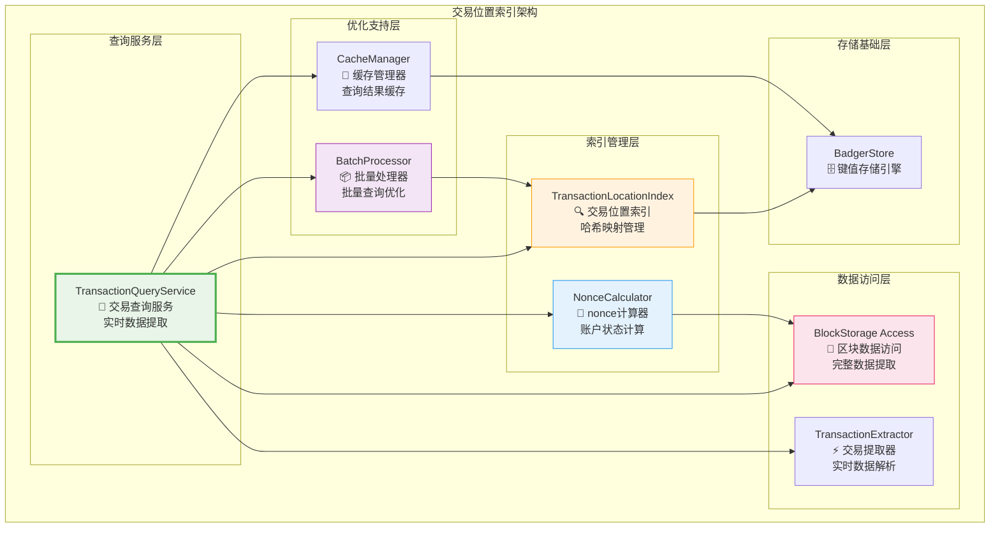
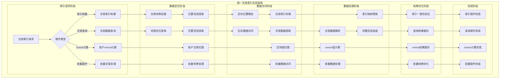
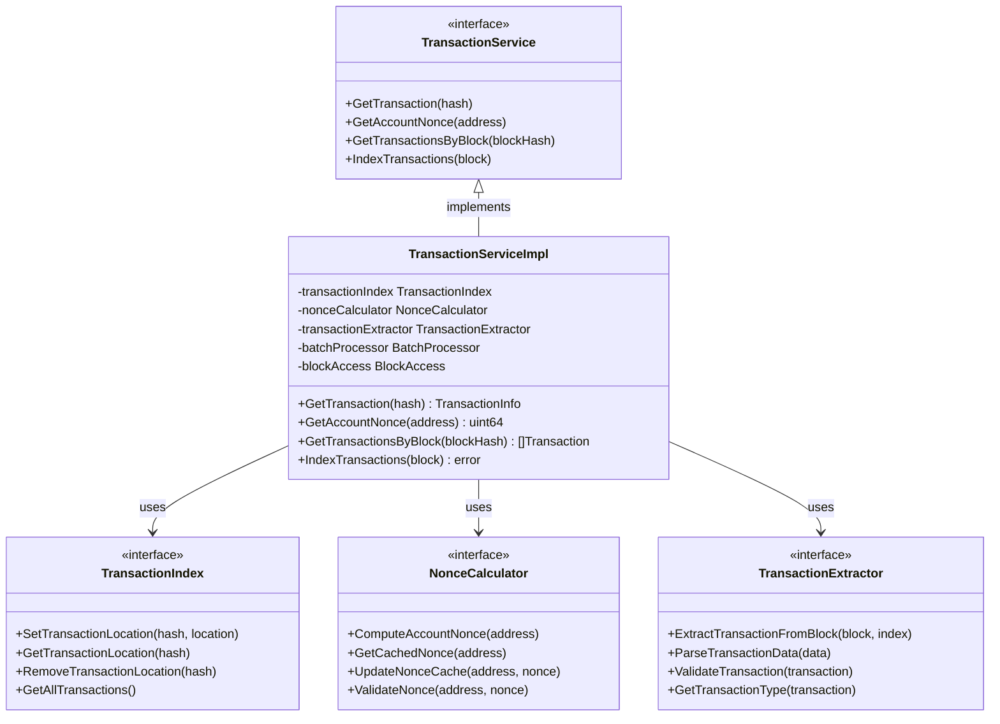

# 交易位置索引服务（internal/core/repositories/repository/transaction）

【模块定位】
　　本模块是主数据仓储中的交易位置索引管理服务，专门负责交易哈希到区块位置的映射管理和高性能查询。严格遵循**轻量级索引原则**，只存储交易的位置信息，通过实时数据提取机制提供完整的交易数据查询和账户nonce计算服务。

【设计原则】
- **轻量级索引原则**：只存储txHash → (blockHash, txIndex)映射关系
- **实时提取原则**：所有交易数据从区块实时提取，确保数据一致性
- **高性能查询原则**：基于哈希索引实现O(1)时间复杂度查询
- **强一致性原则**：索引更新与区块存储在同一事务中完成
- **账户服务支持原则**：为账户nonce计算和余额查询提供数据基础
- **批量优化原则**：支持批量查询和操作的性能优化

【核心职责】
1. **交易位置索引管理**：维护交易哈希到区块位置的精确映射关系
2. **交易数据查询服务**：提供基于交易哈希的完整交易数据查询
3. **账户nonce计算**：基于区块链数据实时计算账户当前nonce值
4. **区块交易列表查询**：提供指定区块内所有交易的查询服务
5. **索引一致性维护**：确保交易索引与区块数据的强一致性
6. **查询性能优化**：提供高并发的交易查询和批量操作支持

## 🏗️ **实现架构**

　　采用**位置索引查询**的三层架构模式，确保交易位置的高效索引和快速查询。



**架构层次说明：**

1. **查询服务层**：交易查询的统一服务入口
   - 基于交易哈希的完整交易数据查询服务
   - 账户nonce计算和区块交易列表查询
   - 查询性能优化和结果缓存管理

2. **索引管理层**：交易位置索引的核心管理
   - 交易哈希到区块位置的映射维护
   - 账户nonce的实时计算和缓存
   - 索引构建和一致性保证

3. **数据访问层**：区块数据的访问和处理
   - 区块存储的高效访问接口
   - 交易数据的实时提取和解析
   - 完整交易信息的组装和验证

4. **优化支持层**：查询性能的优化支持
   - 批量查询和操作的性能优化
   - 查询结果的智能缓存管理
   - 高并发场景的性能保障

---

## 📁 **模块组织结构**

【交易索引模块架构】

```
internal/core/repositories/repository/transaction/
├── 📄 service.go                       # 交易查询服务门面
├── 🔍 index.go                         # 交易位置索引核心实现
├── 📊 query.go                         # 交易查询操作实现
├── 🧮 nonce.go                         # 账户nonce计算实现
├── ⚡ extractor.go                     # 交易数据提取器
├── 📦 batch.go                         # 批量处理器实现
├── 🧠 cache.go                         # 查询缓存管理器
├── ✅ validator.go                     # 交易索引验证器
├── 📊 metrics.go                       # 性能监控指标收集
├── ⚙️ config.go                        # 交易索引配置管理
├── 📝 README.md                        # 本文档
└── 🧪 tests/                           # 测试文件目录
    ├── service_test.go                  # 查询服务测试
    ├── index_test.go                    # 索引实现测试
    ├── query_test.go                    # 查询操作测试
    ├── nonce_test.go                    # nonce计算测试
    ├── extractor_test.go                # 数据提取测试
    ├── batch_test.go                    # 批量处理测试
    ├── integration_test.go              # 集成测试
    └── performance_test.go              # 性能测试
```

### **🎯 组件职责分工**

| **组件** | **核心职责** | **对外接口** | **内部组件** | **复杂度** |
|---------|-------------|-------------|-------------|-----------|
| `service.go` | 交易查询服务门面 | TransactionService | 服务协调、接口实现、生命周期管理 | 高 |
| `index.go` | 交易位置索引核心实现 | TransactionIndex | 索引管理、位置映射、一致性保证 | 高 |
| `query.go` | 交易查询操作实现 | QueryOperations | 查询优化、结果组装、错误处理 | 中 |
| `nonce.go` | 账户nonce计算实现 | NonceCalculator | nonce计算、状态缓存、实时更新 | 中 |
| `extractor.go` | 交易数据提取器 | TransactionExtractor | 数据解析、格式转换、验证处理 | 中 |
| `batch.go` | 批量处理器实现 | BatchProcessor | 批量查询、操作优化、并发控制 | 中 |
| `cache.go` | 查询缓存管理器 | CacheManager | 缓存策略、数据管理、失效控制 | 中 |
| `validator.go` | 交易索引验证器 | IndexValidator | 索引验证、完整性检查、异常检测 | 中 |
| `metrics.go` | 性能监控指标收集 | MetricsCollector | 指标定义、数据收集、报告生成 | 低 |
| `config.go` | 交易索引配置管理 | ConfigManager | 配置加载、参数管理、动态调整 | 低 |
| `tests/` | 交易索引功能测试 | 测试工具和框架 | 单元测试、集成测试、性能测试 | 中 |

---

## 🔄 **统一交易索引实现**

【索引策略】

　　所有交易索引操作均严格遵循**轻量级索引原则**和**实时提取原则**，确保交易数据的高效索引和可靠查询。



**关键索引要点：**

1. **轻量级索引设计**：
   - 只存储交易哈希到区块位置的映射关系
   - 避免重复存储交易数据，确保数据的单一来源
   - 实现高效的索引存储空间利用和查询性能

2. **实时数据提取**：
   - 所有交易数据从区块实时提取和解析
   - 支持完整交易信息的动态组装和验证
   - 提供实时的交易状态和执行结果查询

3. **账户状态计算**：
   - 基于区块链历史数据实时计算账户nonce值
   - 支持账户交易历史的快速扫描和分析
   - 提供高效的防重放攻击验证机制

---

## 🏗️ **依赖注入架构**

【fx框架集成】

　　全面采用fx依赖注入框架，实现交易索引模块的统一装配和生命周期管理。

**依赖注入设计**：
- **服务门面注入**：统一注入TransactionService作为交易查询的对外接口
- **核心组件注入**：自动注入TransactionIndex、NonceCalculator、TransactionExtractor等核心组件
- **优化服务注入**：集成BatchProcessor、CacheManager、IndexValidator等优化服务
- **基础设施注入**：统一注入BadgerStore、BlockStorage、Logger等基础设施依赖

**核心组件依赖关系**：
- TransactionService依赖TransactionIndex、NonceCalculator、TransactionExtractor
- TransactionIndex依赖BadgerStore、IndexValidator、MetricsCollector
- NonceCalculator依赖BlockStorage、CacheManager、Logger
- BatchProcessor依赖TransactionIndex、CacheManager、并发控制组件

---

## 📊 **性能与监控**

【性能指标】

| **操作类型** | **目标延迟** | **吞吐量目标** | **成功率** | **监控方式** |
|-------------|-------------|---------------|-----------|------------|
| 交易查询操作 | < 5ms | > 10000 QPS | > 99.9% | 实时监控 |
| nonce计算 | < 10ms | > 5000 NPS | > 99.8% | 高频监控 |
| 索引构建操作 | < 1ms | > 50000 IPS | > 99.5% | 批量统计 |
| 批量查询操作 | < 20ms | > 2000 BPS | > 99% | 异步监控 |
| 区块交易列表 | < 15ms | > 3000 BPS | > 99.5% | 关键路径监控 |
| 缓存命中率 | > 90% | N/A | N/A | 异步监控 |

**性能优化策略**：
- **查询优化**：哈希索引优化、查询缓存、预加载机制、并发查询
- **索引优化**：批量索引构建、增量更新、索引压缩、智能分片
- **计算优化**：nonce缓存、增量计算、并行扫描、结果复用
- **缓存优化**：多级缓存、智能失效、预热机制、负载均衡

---

## 🔗 **与公共接口的映射关系**

【接口实现映射】



**映射实现要点**：
- **接口契约**：严格遵循交易索引的接口规范和语义约定
- **功能完整性**：完整实现交易查询、索引构建、nonce计算等功能
- **性能保证**：满足各种操作的性能指标和响应时间要求
- **可靠性保证**：提供完整的错误处理和异常恢复机制

---

## 🚀 **后续扩展规划**

【模块演进方向】

1. **查询能力增强**
   - 支持更复杂的交易查询条件和过滤机制
   - 实现交易历史、状态变更等高级查询功能
   - 添加交易关系分析和依赖查询支持

2. **性能优化升级**
   - 实现更高效的索引算法和数据结构
   - 添加智能预测和预加载机制
   - 优化大规模并发查询的性能表现

3. **账户服务增强**
   - 实现更精确和高效的nonce计算算法
   - 添加账户状态的实时监控和预警
   - 增强账户交易历史的分析能力

4. **扩展性提升**
   - 支持新交易类型的动态注册和扩展
   - 实现交易索引的分片和分布式管理
   - 添加交易数据的归档和历史查询支持

---

## 📋 **开发指南**

【交易索引开发规范】

1. **新功能开发步骤**：
   - 设计交易查询或索引的接口和数据结构
   - 实现核心的查询逻辑和索引管理功能
   - 集成到TransactionService的统一服务接口
   - 添加完整的测试用例和性能验证

2. **代码质量要求**：
   - 严格遵循Go语言编程规范和项目代码标准
   - 实现完整的错误处理和异常恢复机制
   - 提供详细的代码注释和技术文档
   - 保证核心功能的100%测试覆盖率

3. **性能要求**：
   - 查询操作必须满足毫秒级的响应时间要求
   - 实现高效的内存使用和资源管理策略
   - 支持高并发查询和大规模数据处理
   - 提供完整的性能监控和调优机制

4. **集成要求**：
   - 必须通过fx依赖注入框架完成集成
   - 严格遵循交易索引的接口规范和协议
   - 支持与其他模块的协调和配合
   - 提供完整的缓存管理和性能优化

【参考文档】
- [主数据仓储实现](../README.md)
- [统一索引管理](../index/README.md)
- [资源元数据索引](../resource/README.md)
- [UTXO接口客户端](../utxo/README.md)
- [WES架构设计文档](../../../../../docs/architecture/)

---

> 📝 **模板说明**：本README模板基于WES v0.0.1统一文档规范设计，使用时请根据具体模块需求替换相应的占位符内容，并确保所有章节都有实质性的技术内容。

> 🔄 **维护指南**：本文档应随着模块功能的演进及时更新，确保文档与代码实现的一致性。建议在每次重大功能变更后更新相应章节。