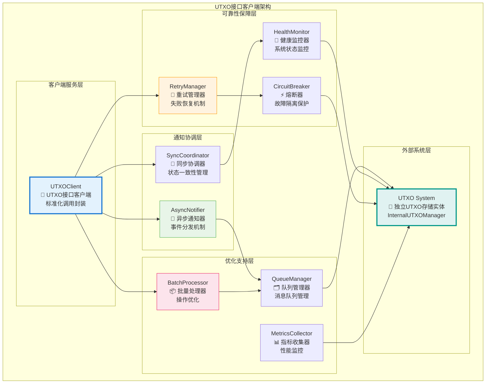
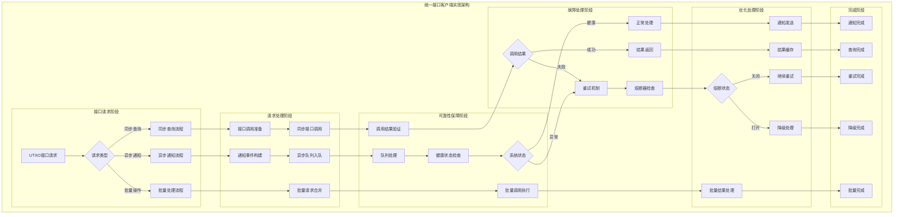
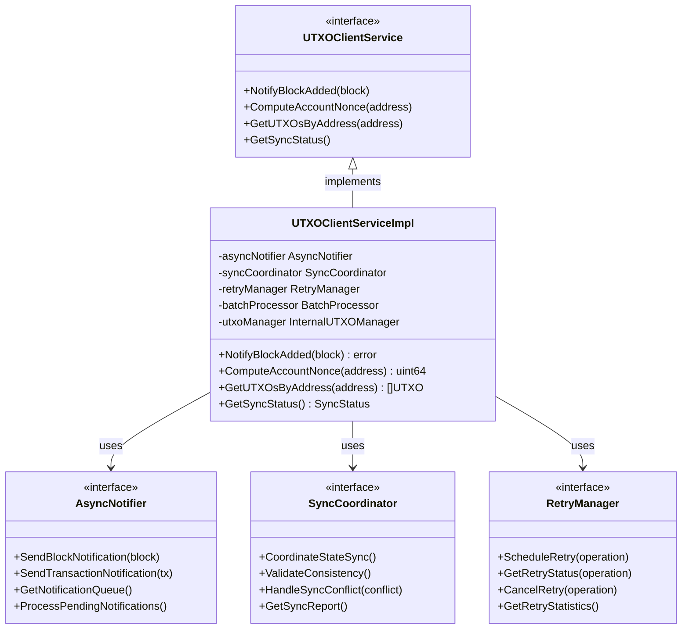

# UTXO系统接口客户端（internal/core/repositories/repository/utxo）

【模块定位】
　　本模块是主数据仓储中的UTXO系统接口调用客户端，作为Repository存储实体与独立UTXO存储实体之间的标准化接口桥梁。通过**异步通知机制**和**接口隔离原则**，实现三个独立存储实体间的松耦合协调，确保UTXO状态与区块链数据的一致性同步。

【设计原则】
- **接口隔离原则**：通过InternalUTXOManager接口与UTXO系统标准化交互
- **异步通知原则**：区块存储完成后异步通知UTXO系统，避免阻塞主流程
- **松耦合设计原则**：Repository与UTXO系统保持独立，只通过接口交互
- **高可用性原则**：支持UTXO系统临时不可用时的重试和恢复机制
- **性能优化原则**：批量操作优化，减少接口调用开销
- **可靠性保证原则**：确保跨系统通知的可靠传递和处理

【核心职责】
1. **跨系统接口调用**：封装和管理与UTXO系统的标准化接口调用
2. **异步通知机制**：实现区块变更的异步通知和可靠传递
3. **重试和恢复管理**：提供接口调用失败的自动重试和恢复机制
4. **批量操作优化**：支持批量UTXO操作的性能优化和协调
5. **状态同步协调**：维护Repository与UTXO系统间的状态一致性
6. **健康监控管理**：监控UTXO系统的健康状态和接口可用性

## 🏗️ **实现架构**

　　采用**接口客户端代理**的四层架构模式，确保跨系统接口调用的可靠性和高性能。



**架构层次说明：**

1. **客户端服务层**：跨系统接口调用的统一入口
   - UTXO系统接口的标准化封装和调用
   - 接口协议的转换和适配处理
   - 调用结果的统一处理和返回

2. **通知协调层**：异步通知和状态协调
   - 区块变更事件的异步通知机制
   - Repository与UTXO系统的状态同步
   - 跨系统数据一致性的协调管理

3. **可靠性保障层**：系统可靠性和容错机制
   - 接口调用失败的重试和恢复管理
   - 熔断器机制防止系统雪崩效应
   - UTXO系统健康状态的持续监控

4. **优化支持层**：性能优化和监控支持
   - 批量操作的性能优化和协调
   - 消息队列的管理和优化
   - 性能指标的收集和分析

---

## 📁 **模块组织结构**

【UTXO客户端模块架构】

```
internal/core/repositories/repository/utxo/
├── 🔗 service.go                       # UTXO接口客户端服务门面
├── 📡 notifier.go                      # 异步通知器实现
├── 🔄 coordinator.go                   # 同步协调器实现
├── 🔁 retry.go                         # 重试管理器实现
├── ⚡ circuit_breaker.go               # 熔断器实现
├── 🏥 health.go                        # 健康监控器实现
├── 📦 batch.go                         # 批量处理器实现
├── 🗂️ queue.go                        # 队列管理器实现
├── 📊 metrics.go                       # 指标收集器实现
├── ⚙️ config.go                        # 客户端配置管理
├── 📝 README.md                        # 本文档
└── 🧪 tests/                           # 测试文件目录
    ├── service_test.go                  # 客户端服务测试
    ├── notifier_test.go                 # 异步通知测试
    ├── coordinator_test.go              # 同步协调测试
    ├── retry_test.go                    # 重试机制测试
    ├── circuit_breaker_test.go          # 熔断器测试
    ├── health_test.go                   # 健康监控测试
    ├── batch_test.go                    # 批量处理测试
    ├── integration_test.go              # 集成测试
    └── performance_test.go              # 性能测试
```

### **🎯 组件职责分工**

| **组件** | **核心职责** | **对外接口** | **内部组件** | **复杂度** |
|---------|-------------|-------------|-------------|-----------|
| `service.go` | UTXO接口客户端服务门面 | UTXOClientService | 服务协调、接口实现、生命周期管理 | 高 |
| `notifier.go` | 异步通知器实现 | AsyncNotifier | 事件发布、异步处理、通知分发 | 高 |
| `coordinator.go` | 同步协调器实现 | SyncCoordinator | 状态同步、一致性保证、协调管理 | 中 |
| `retry.go` | 重试管理器实现 | RetryManager | 重试策略、失败处理、恢复机制 | 中 |
| `circuit_breaker.go` | 熔断器实现 | CircuitBreaker | 故障检测、熔断保护、自动恢复 | 中 |
| `health.go` | 健康监控器实现 | HealthMonitor | 状态监控、健康检查、异常告警 | 中 |
| `batch.go` | 批量处理器实现 | BatchProcessor | 批量优化、操作合并、性能提升 | 中 |
| `queue.go` | 队列管理器实现 | QueueManager | 消息队列、缓冲管理、流量控制 | 中 |
| `metrics.go` | 指标收集器实现 | MetricsCollector | 指标定义、数据收集、报告生成 | 低 |
| `config.go` | 客户端配置管理 | ConfigManager | 配置加载、参数管理、动态调整 | 低 |
| `tests/` | UTXO客户端功能测试 | 测试工具和框架 | 单元测试、集成测试、性能测试 | 中 |

---

## 🔄 **统一接口客户端实现**

【客户端策略】

　　所有UTXO接口客户端操作均严格遵循**异步通知原则**和**可靠性保证原则**，确保跨系统接口调用的高效性和可靠性。



**关键客户端要点：**

1. **异步通知机制**：
   - 区块变更事件的异步通知和可靠传递
   - 消息队列的管理和优化，避免阻塞主流程
   - 支持通知失败的重试和恢复机制

2. **可靠性保障机制**：
   - 接口调用失败的自动重试和指数退避策略
   - 熔断器机制防止系统雪崩和级联故障
   - 健康监控和状态检查，及时发现和处理异常

3. **性能优化机制**：
   - 批量操作的合并和优化，减少接口调用开销
   - 智能的队列管理和流量控制机制
   - 完整的性能监控和调优建议

---

## 🏗️ **依赖注入架构**

【fx框架集成】

　　全面采用fx依赖注入框架，实现UTXO客户端模块的统一装配和生命周期管理。

**依赖注入设计**：
- **客户端服务注入**：统一注入UTXOClientService作为跨系统接口的对外门面
- **核心组件注入**：自动注入AsyncNotifier、SyncCoordinator、RetryManager等核心组件
- **保障服务注入**：集成CircuitBreaker、HealthMonitor、BatchProcessor等保障服务
- **基础设施注入**：统一注入QueueManager、MetricsCollector、Logger等基础设施依赖

**核心组件依赖关系**：
- UTXOClientService依赖AsyncNotifier、SyncCoordinator、RetryManager
- AsyncNotifier依赖QueueManager、MetricsCollector、Logger
- RetryManager依赖CircuitBreaker、HealthMonitor、ConfigManager
- 所有组件依赖InternalUTXOManager接口进行实际的UTXO系统交互

---

## 📊 **性能与监控**

【性能指标】

| **操作类型** | **目标延迟** | **吞吐量目标** | **成功率** | **监控方式** |
|-------------|-------------|---------------|-----------|------------|
| 异步通知操作 | < 100ms | > 5000 NPS | > 99.9% | 实时监控 |
| 同步查询操作 | < 20ms | > 10000 QPS | > 99.8% | 高频监控 |
| 批量操作处理 | < 500ms | > 1000 BPS | > 99% | 批量统计 |
| 重试机制处理 | < 2000ms | > 500 RPS | > 95% | 异步监控 |
| 健康检查操作 | < 50ms | > 1000 HPS | > 99.5% | 关键路径监控 |
| 队列处理吞吐 | < 10ms | > 20000 MPS | > 99.9% | 异步监控 |

**性能优化策略**：
- **通知优化**：异步队列优化、批量通知、智能合并、流量控制
- **调用优化**：连接池、请求合并、结果缓存、并发控制
- **重试优化**：智能重试策略、指数退避、最大重试限制
- **监控优化**：采样监控、异步收集、数据压缩、智能告警

---

## 🔗 **与公共接口的映射关系**

【接口实现映射】



**映射实现要点**：
- **接口契约**：严格遵循UTXO客户端的接口规范和语义约定
- **功能完整性**：完整实现异步通知、同步查询、状态协调等功能
- **性能保证**：满足各种操作的性能指标和响应时间要求
- **可靠性保证**：提供完整的错误处理和异常恢复机制

---

## 🚀 **后续扩展规划**

【模块演进方向】

1. **接口能力增强**
   - 支持更多UTXO操作的接口调用和封装
   - 实现更智能的接口调用策略和优化
   - 添加接口版本管理和平滑升级能力

2. **可靠性机制增强**
   - 实现更强的故障检测和自动恢复能力
   - 添加多重备份和故障转移机制
   - 增强分布式环境下的一致性保证

3. **性能优化升级**
   - 实现更高效的批量操作和请求合并
   - 添加智能的负载均衡和流量控制
   - 优化高并发场景下的性能表现

4. **监控运维增强**
   - 提供更详细的跨系统调用监控指标
   - 实现智能的异常预警和故障诊断
   - 添加可视化的系统状态和性能监控

---

## 📋 **开发指南**

【UTXO客户端开发规范】

1. **新功能开发步骤**：
   - 设计UTXO接口调用的功能和协议
   - 实现核心的客户端逻辑和异常处理
   - 集成到UTXOClientService的统一服务接口
   - 添加完整的测试用例和性能验证

2. **代码质量要求**：
   - 严格遵循Go语言编程规范和项目代码标准
   - 实现完整的错误处理和异常恢复机制
   - 提供详细的代码注释和技术文档
   - 保证核心功能的100%测试覆盖率

3. **可靠性要求**：
   - 接口调用必须具备完整的重试和恢复机制
   - 实现高效的故障检测和熔断保护
   - 支持系统异常时的优雅降级处理
   - 提供完整的监控和告警机制

4. **性能要求**：
   - 异步通知必须满足毫秒级的处理延迟
   - 实现高效的批量操作和请求优化
   - 支持高并发调用和大规模数据处理
   - 提供完整的性能监控和调优机制

【参考文档】
- [主数据仓储实现](../README.md)
- [UTXO管理实现](../../utxo/README.md)
- [数据仓储内部接口](../../interfaces/README.md)
- [WES架构设计文档](../../../../../docs/architecture/)

---

> 📝 **模板说明**：本README模板基于WES v0.0.1统一文档规范设计，使用时请根据具体模块需求替换相应的占位符内容，并确保所有章节都有实质性的技术内容。

> 🔄 **维护指南**：本文档应随着模块功能的演进及时更新，确保文档与代码实现的一致性。建议在每次重大功能变更后更新相应章节。