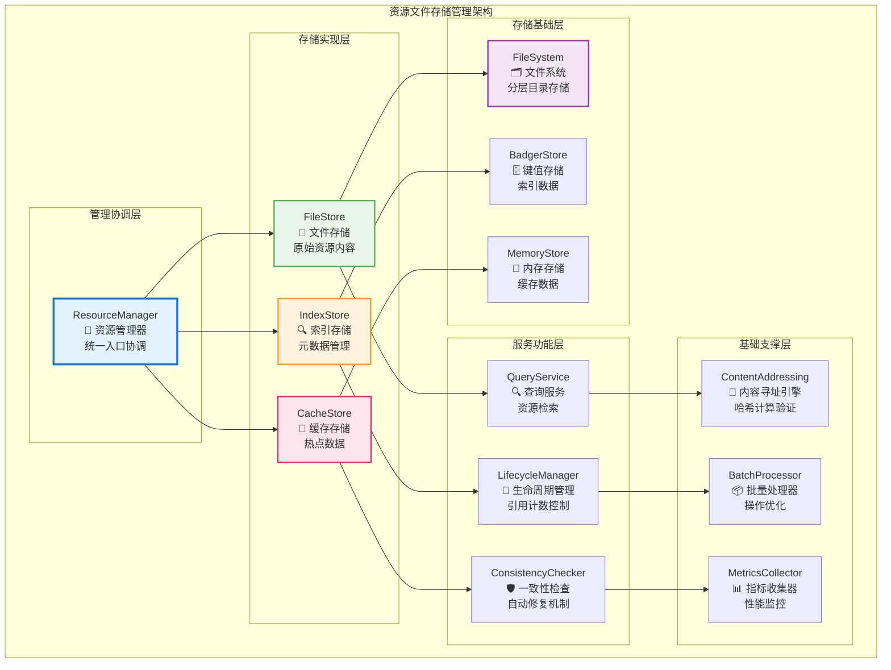

# 资源文件存储管理（internal/core/repositories/resource）

【模块定位】
　　本模块是WES区块链的资源文件存储管理核心，作为三个独立存储实体中的Resource实体，负责资源文件的混合存储、索引管理和生命周期控制。通过**内容寻址原则**和**混合存储架构**，提供高性能、高可用的资源存储服务，确保资源文件与元数据索引的一致性和完整性。

【设计原则】
- **内容寻址原则**：基于SHA-256内容哈希实现全局唯一的资源标识和去重存储
- **混合存储原则**：FileStore存储文件内容，BadgerStore管理索引，MemoryStore提供缓存
- **事务一致性原则**：文件存储与元数据索引在同一事务中完成，保证原子性
- **引用管理原则**：支持ResourceUTXO的并发引用计数和生命周期控制
- **自动修复原则**：具备存储不一致状态的自动检测和修复能力
- **性能优化原则**：针对大文件存储和高并发访问进行专门优化

【核心职责】
1. **资源文件存储管理**：提供高性能的资源文件存储和检索服务
2. **混合存储架构实现**：协调文件存储、索引存储和缓存层的统一管理
3. **内容寻址服务**：基于内容哈希实现资源的去重存储和快速定位
4. **资源索引管理**：维护资源元数据、路径映射、分类和所有权索引
5. **引用计数控制**：管理ResourceUTXO的并发引用和生命周期状态
6. **一致性保证**：确保文件存储与索引数据的强一致性和完整性

## 🏗️ **实现架构**

　　采用**混合存储管理**的四层架构模式，确保资源文件的高效存储、快速检索和可靠管理。



**架构层次说明：**

1. **管理协调层**：资源存储的统一管理入口
   - 协调各存储层的操作和数据流转
   - 实现统一的资源管理接口和服务
   - 管理整体的生命周期和配置

2. **存储实现层**：多层次的存储实现
   - 文件存储层负责原始资源内容的物理存储
   - 索引存储层管理资源元数据和快速检索
   - 缓存存储层提供热点数据的高速访问

3. **服务功能层**：专业化的功能服务
   - 查询服务提供灵活的资源检索能力
   - 生命周期管理控制资源的引用和回收
   - 一致性检查确保存储的可靠性和完整性

4. **基础支撑层**：底层的技术支撑
   - 内容寻址引擎实现哈希计算和验证
   - 批量处理器优化大规模操作性能
   - 指标收集器提供全面的监控数据

---

## 📁 **模块组织结构**

【资源管理模块架构】

```
internal/core/repositories/resource/
├── 📁 manager.go                       # 资源管理器主入口
├── 📄 store.go                         # 核心存储实现（文件+索引双写）
├── 🔍 index.go                         # BadgerDB索引管理
├── 🔍 query.go                         # 资源查询操作实现
├── 🔄 lifecycle.go                     # 引用计数和生命周期管理
├── 🛡️ consistency.go                   # 一致性检查和自动修复
├── 🎯 addressing.go                    # 内容寻址引擎实现
├── 📦 batch.go                         # 批量处理器实现
├── 🧠 cache.go                         # 缓存管理器实现
├── ⚙️ config.go                        # 资源存储配置管理
├── 📊 metrics.go                       # 性能监控指标收集
├── 📝 README.md                        # 本文档
└── 🧪 tests/                           # 测试文件目录
    ├── manager_test.go                  # 资源管理器测试
    ├── store_test.go                    # 存储实现测试
    ├── index_test.go                    # 索引管理测试
    ├── query_test.go                    # 查询操作测试
    ├── lifecycle_test.go                # 生命周期测试
    ├── consistency_test.go              # 一致性检查测试
    ├── addressing_test.go               # 内容寻址测试
    ├── batch_test.go                    # 批量处理测试
    ├── integration_test.go              # 集成测试
    └── performance_test.go              # 性能测试
```

### **🎯 组件职责分工**

| **组件** | **核心职责** | **对外接口** | **内部组件** | **复杂度** |
|---------|-------------|-------------|-------------|-----------|
| `manager.go` | 资源管理器主入口 | ResourceManager | 服务协调、接口实现、生命周期管理 | 高 |
| `store.go` | 核心存储实现 | StorageEngine | 混合存储、事务管理、原子操作 | 高 |
| `index.go` | BadgerDB索引管理 | IndexManager | 元数据索引、快速检索、分类管理 | 高 |
| `query.go` | 资源查询操作实现 | QueryService | 查询优化、结果组装、过滤排序 | 中 |
| `lifecycle.go` | 引用计数和生命周期管理 | LifecycleManager | 引用控制、状态管理、自动回收 | 中 |
| `consistency.go` | 一致性检查和自动修复 | ConsistencyChecker | 完整性验证、故障检测、自动修复 | 中 |
| `addressing.go` | 内容寻址引擎实现 | ContentAddressing | 哈希计算、去重检测、验证机制 | 中 |
| `batch.go` | 批量处理器实现 | BatchProcessor | 批量优化、并发控制、性能提升 | 中 |
| `cache.go` | 缓存管理器实现 | CacheManager | 缓存策略、数据管理、失效控制 | 中 |
| `config.go` | 资源存储配置管理 | ConfigManager | 配置加载、参数管理、动态调整 | 低 |
| `metrics.go` | 性能监控指标收集 | MetricsCollector | 指标定义、数据收集、报告生成 | 低 |
| `tests/` | 资源管理功能测试 | 测试工具和框架 | 单元测试、集成测试、性能测试 | 中 |

---

## 🔄 **统一资源存储实现**

【存储策略】

　　所有资源存储操作均严格遵循**混合存储架构原则**和**事务一致性原则**，确保资源文件与元数据的统一管理和可靠存储。

**关键存储要点：**

1. **混合存储协调**：
   - FileStore负责原始资源文件的物理存储和管理
   - BadgerStore管理资源元数据索引和快速检索
   - MemoryStore提供热点数据的高速缓存和访问

2. **内容寻址机制**：
   - 基于SHA-256内容哈希实现全局唯一的资源标识
   - 自动去重存储，相同内容只存储一份
   - 支持内容完整性验证和一致性检查

3. **事务一致性保证**：
   - 文件存储与元数据索引在同一事务中完成
   - 支持复杂操作的原子性和回滚机制
   - 提供故障恢复和自动修复能力

---

## 🏗️ **依赖注入架构**

【fx框架集成】

　　全面采用fx依赖注入框架，实现资源管理模块的统一装配和生命周期管理。

**依赖注入设计**：
- **管理器注入**：统一注入ResourceManager作为资源管理的对外接口
- **存储引擎注入**：自动注入StorageEngine、IndexManager、QueryService等核心组件
- **服务组件注入**：集成LifecycleManager、ConsistencyChecker、ContentAddressing等服务
- **基础设施注入**：统一注入FileSystem、BadgerStore、MemoryStore等基础设施依赖

**核心组件依赖关系**：
- ResourceManager依赖StorageEngine、IndexManager、QueryService
- StorageEngine依赖FileSystem、BadgerStore、ConsistencyChecker
- QueryService依赖IndexManager、CacheManager、MetricsCollector
- 所有组件依赖Logger、Config、EventBus等基础设施组件

---

## 📊 **性能与监控**

【性能指标】

| **操作类型** | **目标延迟** | **吞吐量目标** | **成功率** | **监控方式** |
|-------------|-------------|---------------|-----------|------------|
| 文件存储操作 | < 200ms | > 1000 FPS | > 99.9% | 实时监控 |
| 资源查询操作 | < 10ms | > 8000 QPS | > 99.9% | 高频监控 |
| 内容哈希计算 | < 50ms | > 2000 HPS | > 99.5% | 批量统计 |
| 引用计数管理 | < 5ms | > 10000 RPS | > 99.8% | 异步监控 |
| 一致性检查 | < 1000ms | > 100 CPS | > 99% | 关键路径监控 |
| 批量操作处理 | < 2000ms | > 500 BPS | > 98% | 异步监控 |

**性能优化策略**：
- **存储优化**：分层目录存储、流式文件处理、智能缓存、并行读写
- **索引优化**：复合索引、分区索引、批量更新、查询缓存
- **计算优化**：哈希计算优化、分块处理、结果缓存、并行计算
- **并发优化**：分片锁、读写锁、无锁算法、连接池

---

## 🔗 **与公共接口的映射关系**

【接口实现映射】

**映射实现要点**：
- **接口契约**：严格遵循资源管理的接口规范和语义约定
- **功能完整性**：完整实现资源存储、查询、管理等所有功能
- **性能保证**：满足各种操作的性能指标和响应时间要求
- **可靠性保证**：提供完整的错误处理和异常恢复机制

---

## 🚀 **后续扩展规划**

【模块演进方向】

1. **存储能力增强**
   - 支持更多文件存储后端和分布式存储
   - 实现智能的数据分层和自动归档机制
   - 添加资源版本管理和历史追踪功能

2. **查询性能优化**
   - 实现更高效的全文搜索和内容匹配
   - 添加智能的查询优化和执行计划
   - 优化大规模资源集合的查询性能

3. **生命周期管理增强**
   - 实现更智能的资源回收和清理策略
   - 添加资源使用分析和优化建议
   - 增强资源依赖关系的管理和追踪

4. **运维监控完善**
   - 提供更详细的存储空间和性能监控
   - 实现自动化的存储优化和容量规划
   - 添加可视化的资源管理和监控界面

---

## 📋 **开发指南**

【资源管理开发规范】

1. **新功能开发步骤**：
   - 设计资源存储或查询的功能需求
   - 实现核心的存储逻辑和索引管理
   - 集成到ResourceManager的统一服务接口
   - 添加完整的测试用例和性能验证

2. **代码质量要求**：
   - 严格遵循Go语言编程规范和项目代码标准
   - 实现完整的错误处理和异常恢复机制
   - 提供详细的代码注释和技术文档
   - 保证核心功能的100%测试覆盖率

3. **性能要求**：
   - 文件存储操作必须满足毫秒级的响应时间
   - 实现高效的内存使用和资源管理策略
   - 支持大文件存储和高并发访问场景
   - 提供完整的性能监控和调优机制

4. **可靠性要求**：
   - 存储操作必须具备完整的事务一致性保证
   - 实现高效的故障检测和自动恢复机制
   - 支持数据完整性验证和一致性检查
   - 提供完整的备份和恢复机制

【参考文档】
- [数据仓储主模块](../README.md)
- [资源元数据索引](../repository/resource/README.md)
- [数据仓储内部接口](../interfaces/README.md)
- [WES架构设计文档](../../../../docs/architecture/)

---

> 📝 **模板说明**：本README模板基于WES v0.0.1统一文档规范设计，使用时请根据具体模块需求替换相应的占位符内容，并确保所有章节都有实质性的技术内容。

> 🔄 **维护指南**：本文档应随着模块功能的演进及时更新，确保文档与代码实现的一致性。建议在每次重大功能变更后更新相应章节。
