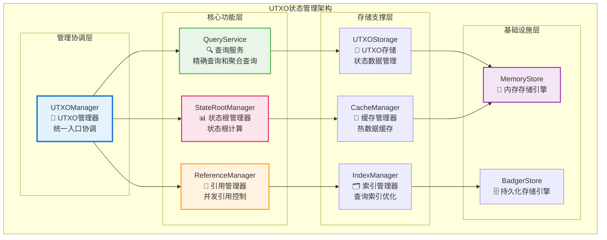
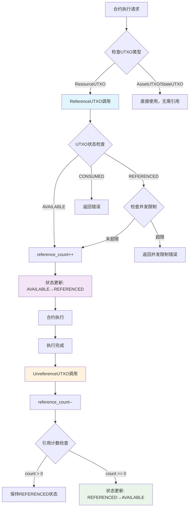
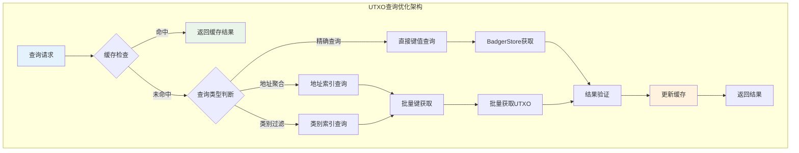
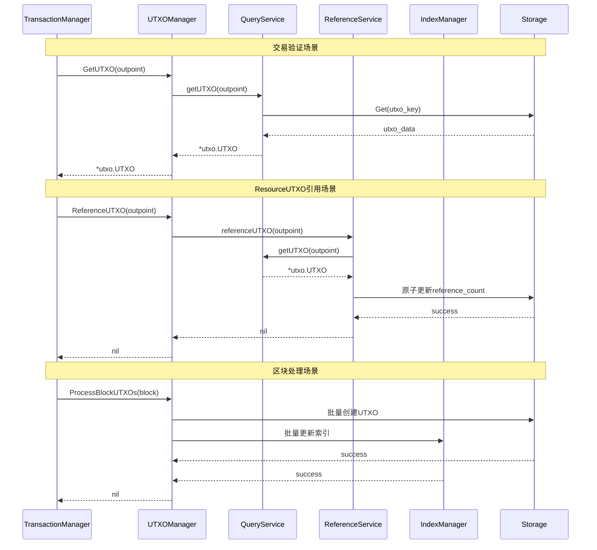

# UTXO状态管理实现（internal/core/repositories/utxo）

【模块定位】
　　本模块是WES区块链的UTXO状态管理核心，作为三个独立存储实体中的UTXO实体，专注于UTXO数据的高效存储、查询和状态管理。通过**数据源头约束原则**和**极简设计原则**，提供精确的UTXO查询、引用管理和状态根计算服务，确保UTXO状态的一致性和可靠性。

【设计原则】
- **数据源头约束原则**：所有UTXO数据来源于TxOutput，通过区块处理统一写入
- **极简设计原则**：遵循WES UTXO架构的极简设计，避免过度设计和复杂策略
- **业务导向原则**：基于实际业务需求精简设计，专注核心应用场景
- **并发安全原则**：支持ResourceUTXO的并发引用计数管理和访问控制
- **高效查询原则**：提供按OutPoint精确查询和按地址聚合查询的优化支持
- **状态一致性原则**：确保UTXO状态转换和生命周期管理的强一致性

【核心职责】
1. **UTXO精确查询**：根据OutPoint提供高性能的UTXO精确查询服务
2. **地址聚合查询**：提供按地址聚合的UTXO列表查询和余额计算基础
3. **引用计数管理**：管理ResourceUTXO的并发引用计数和访问控制
4. **状态根计算**：维护UTXO状态根，支持状态验证和同步
5. **生命周期管理**：管理UTXO的创建、引用、消费等状态转换
6. **存储策略优化**：实现热数据缓存与冷数据索引的智能存储管理

## 🏗️ **实现架构**

　　采用**极简功能分离**的三层架构模式，确保UTXO状态管理的高效性和可靠性。



**架构层次说明：**

1. **管理协调层**：UTXO管理的统一入口
   - 实现公共UTXO接口和业务协调
   - 管理整体的生命周期和配置
   - 协调各功能层的操作和数据流转

2. **核心功能层**：专业化的UTXO功能服务
   - 查询服务提供精确查询和聚合查询能力
   - 引用管理器控制ResourceUTXO的并发访问
   - 状态根管理器维护UTXO状态根和验证

3. **存储支撑层**：UTXO数据的存储和索引
   - UTXO存储管理状态数据的持久化
   - 索引管理器优化查询性能和索引策略
   - 缓存管理器提供热数据的高速访问

4. **基础设施层**：底层的存储引擎
   - 内存存储引擎提供高速的临时数据访问
   - 持久化存储引擎保证数据的可靠持久化

---

## 📁 **模块组织结构**

【UTXO管理模块架构】

```
internal/core/repositories/utxo/
├── 💎 manager.go                       # UTXO管理器主入口
├── 🔍 query.go                         # UTXO查询操作实现
├── 🔄 reference.go                     # UTXO引用管理实现
├── 📊 state_root.go                    # UTXO状态根管理
├── 💾 storage.go                       # UTXO存储策略
├── 🗂️ index.go                         # 查询索引管理
├── 🧠 cache.go                         # UTXO缓存管理
├── ⚙️ config.go                        # UTXO配置管理
├── 📊 metrics.go                       # 性能监控指标收集
├── 📝 README.md                        # 本文档
└── 🧪 tests/                           # 测试文件目录
    ├── manager_test.go                  # UTXO管理器测试
    ├── query_test.go                    # 查询操作测试
    ├── reference_test.go                # 引用管理测试
    ├── state_root_test.go               # 状态根测试
    ├── storage_test.go                  # 存储策略测试
    ├── integration_test.go              # 集成测试
    └── performance_test.go              # 性能测试
```

### **🎯 组件职责分工**

| **组件** | **核心职责** | **对外接口** | **内部组件** | **复杂度** |
|---------|-------------|-------------|-------------|-----------|
| `manager.go` | UTXO管理器主入口 | UTXOManager | 服务协调、接口实现、生命周期管理 | 高 |
| `query.go` | UTXO查询操作实现 | QueryService | 精确查询、聚合查询、查询优化 | 高 |
| `reference.go` | UTXO引用管理实现 | ReferenceManager | 引用计数、并发控制、状态管理 | 中 |
| `state_root.go` | UTXO状态根管理 | StateRootManager | 状态根计算、验证、同步 | 中 |
| `storage.go` | UTXO存储策略 | StorageStrategy | 存储优化、数据管理、持久化 | 中 |
| `index.go` | 查询索引管理 | IndexManager | 索引构建、查询优化、性能提升 | 中 |
| `cache.go` | UTXO缓存管理 | CacheManager | 缓存策略、数据管理、失效控制 | 中 |
| `config.go` | UTXO配置管理 | ConfigManager | 配置加载、参数管理、动态调整 | 低 |
| `metrics.go` | 性能监控指标收集 | MetricsCollector | 指标定义、数据收集、报告生成 | 低 |
| `tests/` | UTXO管理功能测试 | 测试工具和框架 | 单元测试、集成测试、性能测试 | 中 |

---

## 🔄 **统一UTXO状态实现**

【状态策略】

　　所有UTXO状态操作均严格遵循**极简设计原则**和**数据源头约束原则**，确保UTXO状态的一致性、高效性和可靠性。

### **UTXO引用管理流程图**



### **UTXO查询优化架构图**



**关键状态要点：**

1. **极简设计机制**：
   - 遵循WES UTXO架构的极简设计，避免复杂的策略模式
   - 使用简单的首次适应算法，避免过度设计
   - 拒绝无实际使用场景的功能，专注核心业务需求

2. **数据源头约束**：
   - 所有UTXO数据来源于TxOutput，通过区块处理统一写入
   - 存储层只负责数据存取，不处理业务逻辑
   - 支持高效的OutPoint精确查询和地址聚合查询

3. **并发安全控制**：
   - ResourceUTXO的并发引用计数管理，防止并发消费冲突
   - 支持引用、解引用等状态转换的原子性操作
   - 提供线程安全的UTXO状态查询和更新

### **系统集成交互图**



---

## 🏗️ **依赖注入架构**

【fx框架集成】

　　全面采用fx依赖注入框架，实现UTXO管理模块的统一装配和生命周期管理。

**依赖注入设计**：
- **管理器注入**：统一注入UTXOManager作为UTXO管理的对外接口
- **核心服务注入**：自动注入QueryService、ReferenceManager、StateRootManager等核心组件
- **存储支撑注入**：集成UTXOStorage、IndexManager、CacheManager等存储服务
- **基础设施注入**：统一注入MemoryStore、BadgerStore、Logger等基础设施依赖

**核心组件依赖关系**：
- UTXOManager依赖QueryService、ReferenceManager、StateRootManager
- QueryService依赖UTXOStorage、IndexManager、CacheManager
- ReferenceManager依赖UTXOStorage、MetricsCollector、Logger
- 所有组件依赖Config、EventBus、HashService等基础设施组件

---

## 📊 **性能与监控**

【性能指标】

| **操作类型** | **目标延迟** | **吞吐量目标** | **成功率** | **监控方式** |
|-------------|-------------|---------------|-----------|------------|
| UTXO精确查询 | < 1ms | > 20000 QPS | > 99.9% | 实时监控 |
| 地址聚合查询 | < 10ms | > 5000 QPS | > 99.5% | 高频监控 |
| 引用计数操作 | < 2ms | > 15000 RPS | > 99.8% | 批量统计 |
| 状态根计算 | < 50ms | > 1000 SPS | > 99% | 异步监控 |
| UTXO状态更新 | < 5ms | > 10000 UPS | > 99.5% | 关键路径监控 |
| 缓存命中率 | > 95% | N/A | N/A | 异步监控 |

**性能优化策略**：
- **查询优化**：智能索引、查询缓存、预加载机制、并发查询
- **存储优化**：热数据缓存、冷数据归档、内存池化、批量操作
- **计算优化**：状态根增量计算、结果缓存、并行处理
- **并发优化**：分片锁、无锁算法、读写分离、连接池

---

## 🔗 **与公共接口的映射关系**

【接口实现映射】

**映射实现要点**：
- **接口契约**：严格遵循UTXO管理的接口规范和语义约定
- **功能完整性**：完整实现UTXO查询、引用管理、状态计算等功能
- **性能保证**：满足各种操作的性能指标和响应时间要求
- **可靠性保证**：提供完整的错误处理和异常恢复机制

**核心业务场景**：
1. **交易验证** - TransactionValidator验证交易输入的UTXO存在性
2. **余额计算** - AccountService计算用户余额的数据基础  
3. **并发控制** - ContractEngine管理资源的并发访问安全

---

## 🚀 **后续扩展规划**

【模块演进方向】

1. **查询能力增强**
   - 支持更复杂的UTXO查询条件和过滤机制
   - 实现UTXO历史状态查询和变更追踪
   - 添加跨地址的UTXO关系分析功能

2. **状态管理优化**
   - 实现更高效的状态根计算算法
   - 添加状态同步和验证的优化机制
   - 优化大规模UTXO集合的状态管理

3. **存储性能提升**
   - 实现更智能的缓存策略和预加载机制
   - 添加分布式存储和数据分片支持
   - 优化存储空间利用和访问性能

4. **监控运维增强**
   - 提供更详细的UTXO状态监控指标
   - 实现自动化的性能调优和容量规划
   - 添加可视化的UTXO状态监控界面

---

## 📋 **开发指南**

【UTXO管理开发规范】

1. **新功能开发步骤**：
   - 设计UTXO查询或状态管理的功能需求
   - 实现核心的查询逻辑和状态管理功能
   - 集成到UTXOManager的统一服务接口
   - 添加完整的测试用例和性能验证

2. **代码质量要求**：
   - 严格遵循Go语言编程规范和项目代码标准
   - 实现完整的错误处理和异常恢复机制
   - 提供详细的代码注释和技术文档
   - 保证核心功能的100%测试覆盖率

3. **性能要求**：
   - UTXO查询操作必须满足毫秒级的响应时间
   - 实现高效的内存使用和资源管理策略
   - 支持高并发访问和大规模UTXO处理
   - 提供完整的性能监控和调优机制

4. **极简设计要求**：
   - 严格遵循WES UTXO架构的极简设计原则
   - 避免过度设计和复杂的策略模式
   - 专注于实际业务需求，拒绝无价值功能
   - 保持代码简洁和维护的容易性

【参考文档】
- [数据仓储主模块](../README.md)
- [UTXO接口客户端](../repository/utxo/README.md)
- [数据仓储内部接口](../interfaces/README.md)
- [WES架构设计文档](../../../../docs/architecture/)

---

> 📝 **模板说明**：本README模板基于WES v0.0.1统一文档规范设计，使用时请根据具体模块需求替换相应的占位符内容，并确保所有章节都有实质性的技术内容。

> 🔄 **维护指南**：本文档应随着模块功能的演进及时更新，确保文档与代码实现的一致性。建议在每次重大功能变更后更新相应章节。

