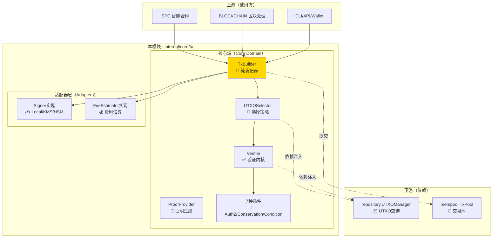
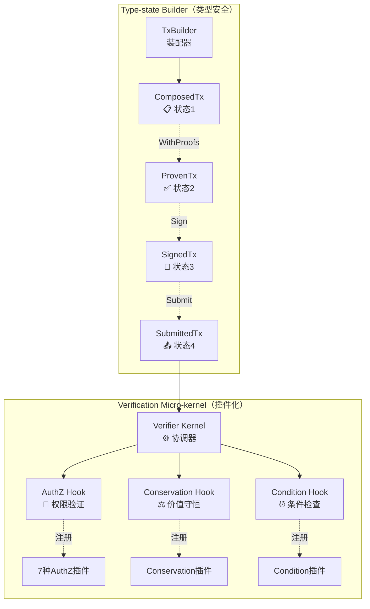
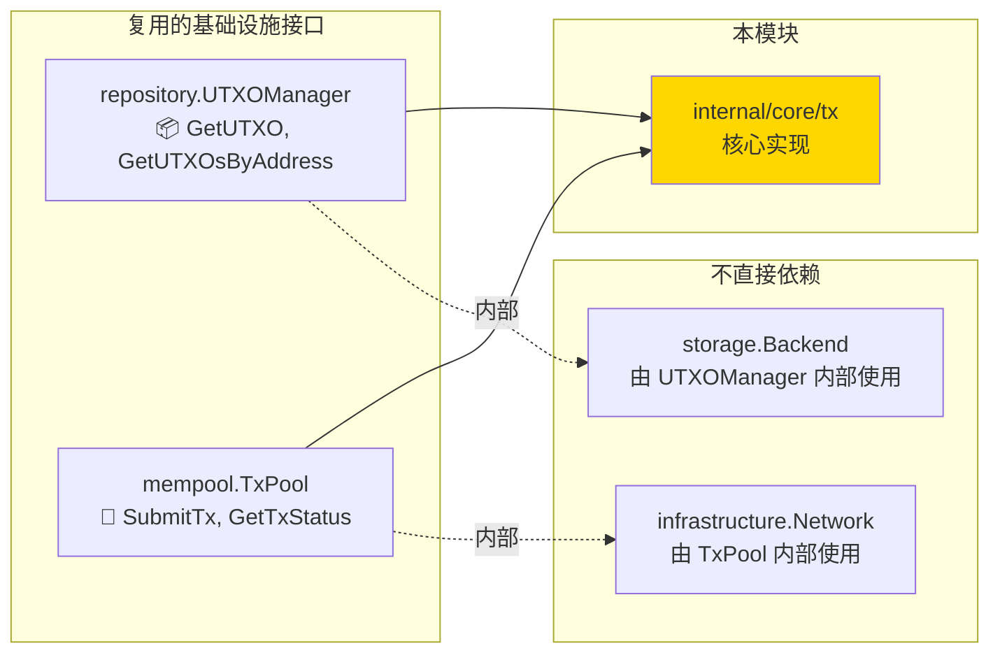
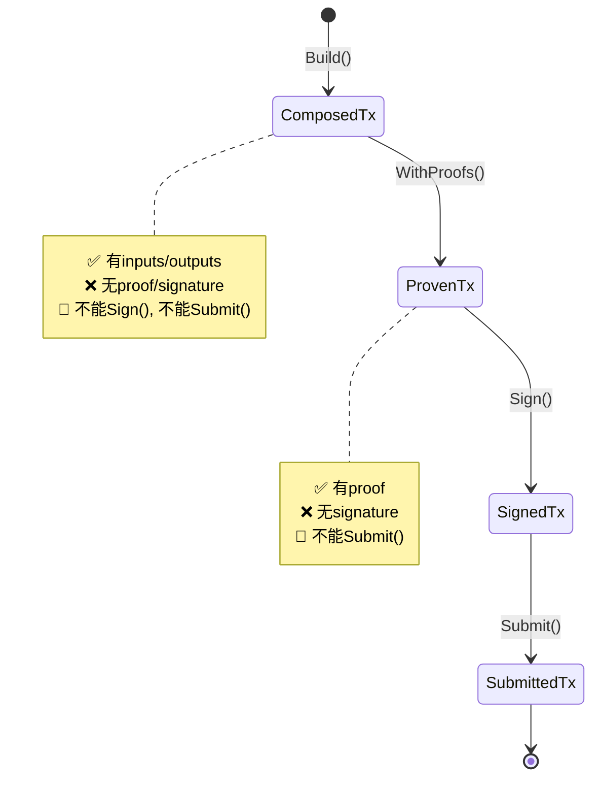
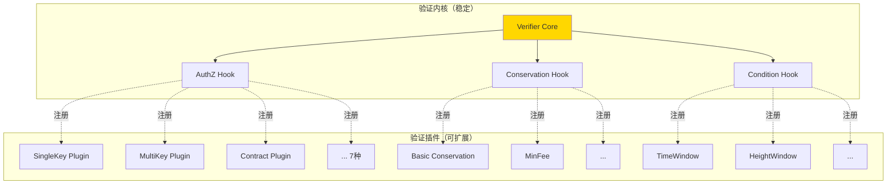
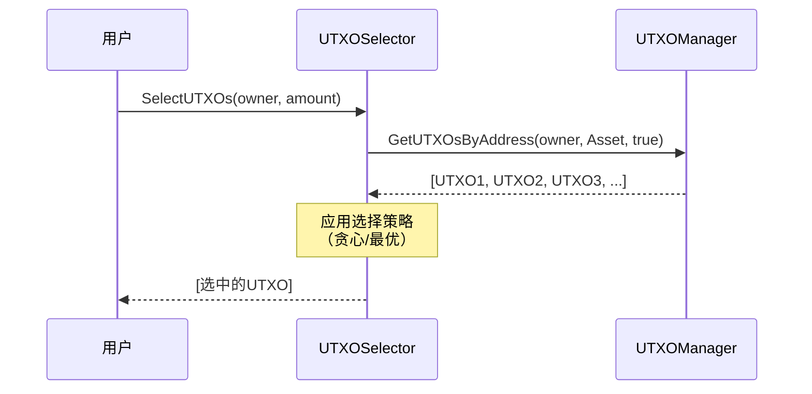
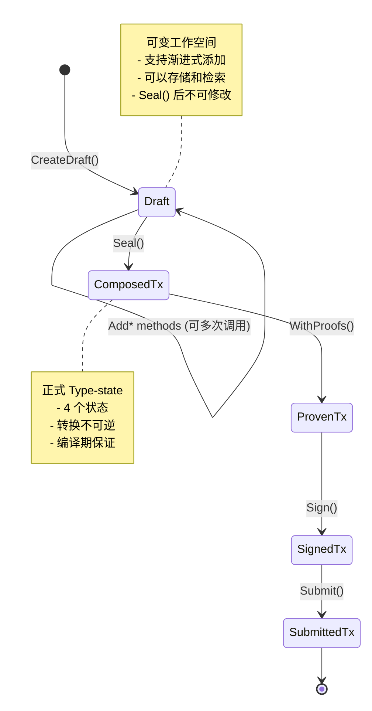
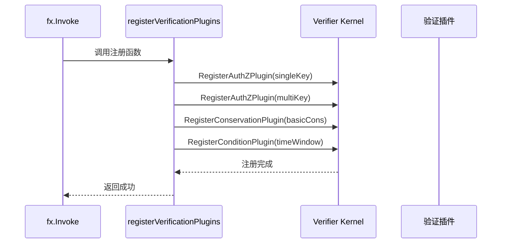
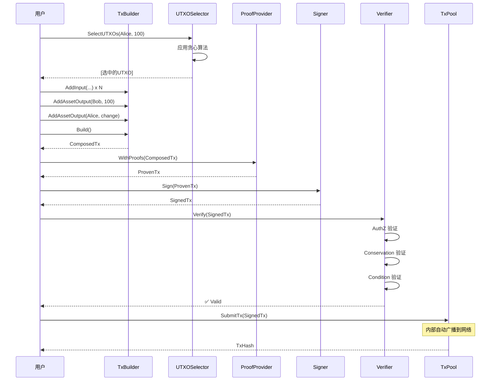
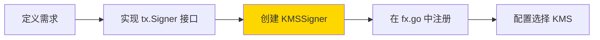

# TX 核心实现层（internal/core/tx）

---

## 📌 版本信息

- **版本**：1.0
- **状态**：stable
- **最后更新**：2025-11-30
- **最后审核**：2025-11-30
- **所有者**：WES TX 开发组
- **适用范围**：WES TX 模块核心实现层

---

## 🎯 **实现定位**

**路径**：`internal/core/tx/`

**目的**：提供 TX 组件的具体实现，实现内部接口，并通过 `module.go` 配置依赖注入。

**核心原则**：
- ✅ 实现内部接口（而不是直接实现公共接口）
- ✅ 通过 `module.go` 统一管理依赖注入
- ✅ 保持实现与接口分离
- ✅ 遵循 SOLID 原则

　　本模块是 WES 系统中**交易处理域**的**核心实现层**，通过 **Type-state + Verification Micro-kernel + Hexagonal Architecture 融合架构**实现类型安全的交易构建和插件化验证，确保 **TX = 权限验证 + 状态转换** 的顶层设计理念。

**解决什么问题**：

- **编译期防错**：通过 Type-state 在编译期防止未授权签名/提交
- **验证扩展**：通过 Micro-kernel + Plugins 实现 7 种权限验证的灵活扩展
- **依赖解耦**：通过 Hexagonal Architecture 实现核心域与基础设施的解耦

**不解决什么问题**（边界）：

- ❌ 不定义协议层数据结构（由 `pb/blockchain/block/transaction/*.proto` 定义）
- ❌ 不实现 UTXO 存储（复用 `repository.UTXOManager`）
- ❌ 不实现网络传输（通过 `mempool.TxPool` 间接使用）
- ❌ 不实现区块处理逻辑（由 BLOCKCHAIN 模块负责）

---

## 🎯 **设计原则与核心约束**

### **设计原则**

| 原则 | 说明 | 价值 |
|------|------|------|
| **Type-state Pattern** | 用类型系统强制构建顺序 | 编译期防错，零运行时成本 |
| **Micro-kernel** | 验证内核 + 插件系统 | 内核稳定，验证逻辑可扩展 |
| **Hexagonal Architecture** | 核心域 + 端口 + 适配器 | 依赖反转，可测试，可替换 |
| **单一职责（SRP）** | Builder 只装配，Verifier 只验证 | 职责清晰，易于维护 |

### **核心约束** ⭐

**严格遵守**：

- ✅ **Type-state 转换不可逆**：ComposedTx → ProvenTx → SignedTx → SubmittedTx，禁止回退
- ✅ **Builder 无业务逻辑**：TxBuilder 只做装配，不做UTXO选择、费用计算等业务逻辑
- ✅ **Verifier 无副作用**：验证过程不能修改交易、不能修改UTXO状态
- ✅ **复用基础设施接口**：直接使用 `repository.UTXOManager` 和 `mempool.TxPool`

**严格禁止**：

- ❌ **跳过类型状态**：ComposedTx 不能直接签名，ProvenTx 不能直接提交
- ❌ **Builder 做业务逻辑**：禁止在 Builder 中实现 UTXO 选择、费用估算等
- ❌ **Verifier 有副作用**：禁止验证时消费 UTXO、修改状态
- ❌ **定义中间层接口**：禁止定义 UTXOStore、Broadcaster 等中间层接口

---

## 🏗️ **架构设计**

### **整体架构**



### **内部结构**



**层次说明**：

| 组件 | 核心职责 | 关键机制 | 约束 |
|-----|---------|---------|------|
| **TxBuilder** | 纯装配器 | 流式 API，链式调用 | 只装配，不做业务逻辑 |
| **UTXOSelector** | UTXO 选择 | 贪心/最优算法 | TX 内部实现，不暴露接口 |
| **ProofProvider** | 证明生成 | 7 种证明生成器 | 证明必须匹配锁定条件 |
| **Verifier** | 验证微内核 | 3 类钩子 + 插件注册 | 验证无副作用，插件无状态 |
| **Signer** | 签名适配器 | 支持 Local/KMS/HSM | 实现 `tx.Signer` 接口 |

---

## 🔗 **依赖与协作**

### **依赖关系图**



### **依赖说明**

| 依赖模块 | 依赖接口 | 用途 | 约束条件 |
|---------|---------|------|---------|
| **repository** | `UTXOManager` | 查询 UTXO，验证时引用计数管理 | 不能直接消费 UTXO |
| **mempool** | `TxPool` | 验证后提交交易，TxPool 内部广播 | 必须先验证后提交 |
| **无** | （TX 内部实现） | UTXO 选择逻辑 | 基于 GetUTXOsByAddress 实现 |
| **无** | （TX 内部实现） | 费用估算逻辑 | 支持多种策略 |

---

## 📊 **核心机制**

### **机制 1：Type-state Builder（类型状态机）**

**为什么需要**：

交易构建有严格的顺序要求：必须先组合输入输出，再添加证明，然后签名，最后提交。如果允许跳过步骤或颠倒顺序，会导致安全问题（如未授权的交易被提交）。

**核心思路**：

通过类型系统将构建阶段编码为不同的类型，每个类型只暴露下一步允许的操作。



**关键约束**：

- ComposedTx 结构体不暴露 `Sign()` 和 `Submit()` 方法
- ProvenTx 结构体不暴露 `Submit()` 方法
- 转换不可逆：不能从 SignedTx 回退到 ProvenTx

**设计权衡**：

| 方案 | 优势 | 劣势 | 为什么选择 |
|------|------|------|-----------|
| **Type-state** | 编译期防错，零成本 | API 略复杂 | ✅ 安全性价值远大于复杂度代价 |
| 运行时检查 | API 简单 | 运行时错误，有性能开销 | ❌ 无法在编译期发现错误 |

---

### **机制 2：Verification Micro-kernel（验证微内核）**

**为什么需要**：

交易验证包含多种不同的规则：权限验证（7 种）、价值守恒（多种费用模式）、条件检查（时间/高度/nonce）。如果所有逻辑都写在一个大函数中，会导致代码难以维护和扩展。

**核心思路**：

内核只保留三大验证钩子（AuthZ、Conservation、Condition），具体的验证逻辑作为插件注册到钩子上。



**关键约束**：

- 插件必须无状态（不能存储验证结果）
- 插件必须可并行（AuthZ 插件之间可以并行验证）
- 插件不能修改交易（只能读取，不能写入）

**设计权衡**：

| 方案 | 优势 | 劣势 | 为什么选择 |
|------|------|------|-----------|
| **Micro-kernel + Plugins** | 内核稳定，扩展灵活 | 需要插件接口设计 | ✅ 支持新验证方式无需修改内核 |
| 单一验证函数 | 实现简单 | 难以扩展和维护 | ❌ 无法应对未来的验证需求 |

---

### **机制 3：UTXO 选择策略（TX 内部实现）**

**为什么需要**：

交易构建时需要选择合适的 UTXO 来满足金额要求。`repository.UTXOManager` 只提供查询能力，明确指出"UTXO 选择逻辑应内嵌在使用方内部"。

**核心思路**：

TX 模块内部实现 UTXO 选择逻辑，基于 `GetUTXOsByAddress` 查询后应用选择算法。



**关键约束**：

- 选择逻辑不暴露为公共接口（是 TX 内部实现细节）
- 必须检查余额是否充足
- 必须只选择 Available 状态的 UTXO

**设计权衡**：

| 方案 | 优势 | 劣势 | 为什么选择 |
|------|------|------|-----------|
| **TX 内部实现** | 符合 Repository 设计原则 | TX 模块略复杂 | ✅ Repository 明确指出不提供选择逻辑 |
| Repository 提供 | TX 模块简单 | 违背 Repository 职责边界 | ❌ Repository 是数据层，不做业务逻辑 |

---

### **机制 4：Draft 辅助工具（渐进式构建）**

**为什么需要**：

在 ISPC 场景中，合约执行过程中需要渐进式添加交易输出；在 Off-chain 场景中，用户需要交互式构建交易并延迟签名。Type-state Builder 的一次性构建模式无法满足这两个需求。

**核心思路**：

Draft 是 Builder 的辅助工具（映射到架构文档中的 "Compose/Plan 隐式辅助工具"），**不是正式 Type-state 的一部分**。Draft 提供可变的工作空间，支持多次调用 Add* 方法，最后通过 `Seal()` 转换为 ComposedTx（进入正式状态机）。



**关键约束**：

- Draft 可变，可以多次调用 `AddInput()`、`AddAssetOutput()` 等方法
- Draft 有唯一 ID，可以通过 `DraftStore` 存储和检索
- `Seal()` 后转换为 ComposedTx，Draft 不可再修改
- Draft 不是正式 Type-state，而是辅助工具（工作空间）

**使用场景**：

**场景 1：ISPC 渐进式构建**

```go
// ISPC 合约执行中渐进式添加输出
draft := builder.CreateDraft(ctx)
draft.AddInput(feeUTXO, false)                  // 第 1 次调用

// ... 合约执行 ...
draft.AddAssetOutput(recipient1, 100)           // 第 2 次调用

// ... 合约执行 ...
draft.AddAssetOutput(recipient2, 200)           // 第 3 次调用

// ... 合约执行 ...
draft.AddStateOutput(stateOutput)               // 第 4 次调用

// 封闭草稿，进入 Type-state
composed := draft.Seal()
proven := composed.WithProofs(zkProofProvider)
signed := proven.Sign(signer)
submitted := signed.Submit(processor)
```

**场景 2：Off-chain 延迟签名**

```go
// CLI/API 用户交互式构建
draft := builder.CreateDraft(ctx)
draft.AddInput(utxo1, false).AddAssetOutput(bob, 100)

// 保存草稿
draftID := draft.GetDraftID()
draftStore.Save(ctx, draft)

// ... 用户确认 ...

// 检索草稿
draft, _ = draftStore.Get(ctx, draftID)
draft.AddOutput(...)  // 继续修改

// 封闭并签名
composed := draft.Seal()
proven := composed.WithProofs(proofProvider)
signed := proven.Sign(signer)
submitted := signed.Submit(processor)
```

**设计权衡**：

| 方案 | 优势 | 劣势 | 为什么选择 |
|------|------|------|-----------|
| **Draft 作为辅助工具** | 职责清晰，不破坏 Type-state | Draft 需要额外存储 | ✅ 符合架构文档 "Draft/Plan 隐式辅助工具" |
| Draft 作为 Type-state 0 | 类型系统一致 | Draft 的可变性与 Type-state 的不可变性冲突 | ❌ 破坏 Type-state 的不可变性原则 |
| Builder 支持渐进式 | 无需额外类型 | Builder 职责过重，违背单一职责原则 | ❌ Builder 应该是纯装配器 |

**实现组件**：

- `pkg/types/tx_draft.go`：DraftTx 类型定义（可变工作空间）
- `pkg/interfaces/tx/builder.go`：CreateDraft()/LoadDraft() 接口
- `pkg/interfaces/tx/ports.go`：DraftStore 端口接口
- `internal/core/tx/draft/service.go`：Draft Service 实现
- `internal/core/tx/ports/draftstore/`：DraftStore 端口适配器实现
  - `memory/`：内存存储（ISPC 场景）
  - `redis/`：Redis 存储（Off-chain 场景，可选）

---

## ⚙️ **依赖注入配置（module.go）** ⭐

**文件**：`module.go`

**职责**：
- 将具体实现绑定到公共接口
- 配置组件的依赖关系
- 管理组件生命周期

**关键配置**：

```go
// Module 构建并返回交易模块的 fx 配置
func Module() fx.Option {
    return fx.Module("tx",
        fx.Provide(
            // 核心组件：Builder、Draft、Verifier、Processor
            builder.NewService,
            draft.NewService,
            verifier.NewKernel,
            processor.NewService,
            
            // 验证插件：7种 AuthZ、4种 Conservation、4种 Condition
            authz.NewSingleKeyPlugin,
            authz.NewMultiKeyPlugin,
            // ... 其他插件
            
            // 端口实现：Signer、FeeEstimator、ProofProvider、DraftStore
            signer.NewLocalSigner,
            fee.NewManager,
            proof.NewSimpleProofProvider,
            draftstore.NewMemoryStore,
        ),
        
        // 自动注册验证插件
        fx.Invoke(registerVerificationPlugins),
        
        // 注册网络与事件集成
        fx.Invoke(registerNetworkAndEventHandlers),
    )
}
```

**配置说明**：

| 配置项 | 说明 | 备注 |
|-------|------|-----|
| `fx.Provide` | 提供实现实例 | 绑定到公共接口 |
| `fx.As` | 类型转换 | 从实现类型转换为接口类型 |
| `fx.Invoke` | 调用初始化函数 | 组件启动时执行 |
| `fx.ParamTags` | 命名依赖 | 使用 `name:"xxx"` 指定依赖名称 |

**依赖注入示意图**：

```
module.go 配置
    ↓ fx.Provide
NewService 构造函数
    ↓ 注入依赖
Service 实例
    ↓ fx.As 类型转换
interfaces.XXX 公共接口
    ↓ 供其他组件使用
调用方获得接口实例
```

**关键依赖**：

| 依赖类型 | 接口 | 用途 | 注入方式 |
|---------|------|------|---------|
| **UTXO 查询** | `persistence.UTXOQuery` | 查询 UTXO，验证时引用计数管理 | `name:"utxo_query"` |
| **交易池** | `mempool.TxPool` | 验证后提交交易 | `name:"tx_pool"` |
| **签名服务** | `crypto.SignatureManager` | 签名验证 | 直接注入 |
| **哈希服务** | `crypto.HashManager` | 哈希计算 | 直接注入 |
| **配置服务** | `config.Provider` | 读取配置 | 直接注入 |
| **日志服务** | `log.Logger` | 日志记录 | `optional:"true"` |

**插件注册流程**：



---

## 📁 **目录结构**

```text
internal/core/tx/
├── interfaces/             # 内部接口定义 | 聚合公共接口 + 集成接口
│   ├── builder.go          # Builder 内部接口
│   ├── draft.go            # Draft 内部接口
│   ├── verifier.go         # Verifier 内部接口
│   ├── processor.go        # Processor 内部接口（继承网络/事件接口）
│   └── ports.go            # Ports 端口接口定义
├── integration/            # 集成层 | 网络协议 + 事件订阅接口
│   ├── event/              # 事件订阅接口
│   │   └── subscribe_handlers.go  # TransactionEventSubscriber 接口
│   └── network/            # 网络协议接口
│       ├── stream_handlers.go     # TxProtocolRouter 接口（流式协议）
│       └── subscribe_handlers.go  # TxAnnounceRouter 接口（订阅协议）
├── builder/                # Type-state Builder 实现 | 编译期类型安全
│   ├── service.go          # TxBuilder 实现（待实现）
│   ├── state_composed.go   # ComposedTx 类型状态（待实现）
│   ├── state_proven.go     # ProvenTx 类型状态（待实现）
│   ├── state_signed.go     # SignedTx 类型状态（待实现）
│   └── state_submitted.go  # SubmittedTx 类型状态（待实现）
├── draft/                  # 渐进式草稿服务 | 交易构建工作流
│   └── service.go          # Draft Service 实现（待实现）
├── verifier/               # Verification Micro-kernel | 插件化验证
│   ├── kernel.go           # Verifier 核心协调器（待实现）
│   ├── authz_hook.go       # 权限验证钩子（待实现）
│   ├── conservation_hook.go # 价值守恒钩子（待实现）
│   ├── condition_hook.go   # 条件检查钩子（待实现）
│   └── plugins/            # 验证插件实现
│       ├── authz/          # 7 种权限验证插件（待实现）
│       ├── conservation/   # 4 种价值守恒插件（待实现）
│       └── condition/      # 4 种条件检查插件（待实现）
├── processor/              # TxProcessor 实现 | 协调验证 + 提交
│   ├── service.go          # Processor 主服务
│   ├── network_handler/    # 网络协议处理器
│   │   └── handler.go      # TxProtocolRouter + TxAnnounceRouter 实现
│   └── event_handler/      # 事件订阅处理器
│       └── handler.go      # TransactionEventSubscriber 实现
├── ports/                  # Hexagonal 端口适配器 | 可替换实现
│   ├── signer/             # 签名适配器（3 种实现）
│   │   ├── local/          # 本地私钥签名（待实现）
│   │   ├── kms/            # 云端 KMS 签名（待实现）
│   │   └── hsm/            # 硬件 HSM 签名（待实现）
│   ├── fee/                # 费用估算适配器
│   │   ├── estimator_static.go  # 静态费率估算（待实现）
│   │   └── estimator_dynamic.go # 动态费率估算（待实现）
│   ├── proof/              # 证明生成适配器
│   │   ├── provider_simple.go   # 简单证明生成器（待实现）
│   │   └── provider_multi.go    # 复杂证明生成器（待实现）
│   └── draftstore/         # 草稿存储适配器
│       ├── memory/         # 内存存储（待实现）
│       └── redis/          # Redis 存储（待实现）
├── module.go               # fx 依赖注入模块定义
└── README.md               # 本文档
```

### **组织原则**

| 目录 | 职责 | 为什么这样组织 |
|-----|------|---------------|
| `interfaces/` | 内部接口定义 | 聚合公共接口 + 继承集成接口，清晰的依赖边界 |
| `integration/` | 集成层接口 | 网络协议 + 事件订阅，遵循 CONSENSUS/BLOCKCHAIN 模式 |
| `builder/` | Type-state 构建器 | 类型状态紧密相关，独立目录 |
| `draft/` | 渐进式草稿服务 | 支持分步构建，独立工作流 |
| `verifier/` | 验证微内核 + 插件 | 内核稳定，插件可扩展，独立目录 |
| `processor/` | 交易处理协调器 | 统一入口，协调验证 + 提交 + 网络 + 事件 |
| `ports/` | 六边形端口适配器 | 可替换实现（Signer/Fee/Proof/DraftStore） |
| `module.go` | Fx 模块定义 | 依赖注入，统一初始化 |

---

## 🔄 **核心流程**

### **流程 1：用户转账（完整流程）**



### **关键点**

| 阶段 | 核心逻辑 | 为什么这样做 | 约束条件 |
|------|---------|------------|---------|
| **UTXO 选择** | 贪心算法选择 UTXO | 满足金额要求，最小化找零 | 必须只选可用状态 |
| **构建** | 纯装配，不做验证 | Builder 只负责装配 | 不做业务逻辑 |
| **验证** | 三阶段插件化验证 | 模块化，可扩展 | 验证无副作用 |
| **提交** | 通过 TxPool 提交 | TxPool 内部处理广播 | 必须先验证 |

---

## 🎓 **使用指南**

### **典型场景：实现新的签名源（KMS）**



**关键点**：

- 输入要满足：实现 `Sign(ctx, tx) (SignatureData, error)` 方法
- 输出保证：返回的签名可以通过 Verifier 验证
- 注意事项：不要在 Sign 方法中做验证逻辑

### **典型场景：添加新的验证插件**


**关键点**：

- 插件必须无状态（不能存储验证结果）
- 插件必须可并行（AuthZ 插件之间可以并行）
- 插件不能修改交易（只读，不写入）

### **常见误用**

| 误用方式 | 为什么错误 | 正确做法 |
|---------|-----------|---------|
| 在 Builder 中实现 UTXO 选择 | Builder 是纯装配器 | 在 Selector 中实现 |
| 在 Verifier 中消费 UTXO | 验证不能有副作用 | UTXO 消费由区块确认后处理 |
| 定义 UTXOStore 接口 | 重复定义基础设施接口 | 直接使用 repository.UTXOManager |
| 跳过验证直接提交 | TxPool 不负责验证 | 必须先 Verify 后 Submit |

---

## ⚠️ **已知限制**

| 限制 | 影响 | 规避方法 | 未来计划 |
|------|------|---------|---------|
| **Type-state API 略复杂** | 新用户理解成本高 | 提供 SDK Helper 封装 | 增加更多示例代码 |
| **插件注册需要手动** | 新增插件需要修改 fx.go | 无（必要的显式注册） | 无计划改变 |
| **UTXO 选择策略固定** | 只支持贪心算法 | 实现更多策略并注册 | 计划支持最优算法 |

---

## 🔍 **设计权衡记录**

### **权衡 1：UTXO 选择在 TX 内部 vs 暴露为接口**

**背景**：需要实现 UTXO 选择逻辑，但不确定是否应该暴露为公共接口

**备选方案**：

1. **TX 内部实现**：不暴露接口 - 优势：符合 Repository 设计原则 - 劣势：TX 模块略复杂
2. **暴露为公共接口**：定义 UTXOSelector 接口 - 优势：TX 模块简单 - 劣势：接口泛滥

**选择**：选择了 **TX 内部实现**

**理由**：

- Repository 明确指出"UTXO 选择逻辑应内嵌在使用方内部"
- 避免接口泛滥，保持架构清晰
- UTXO 选择是 TX 的实现细节，不应暴露

**代价**：

- TX 模块需要自己维护选择逻辑
- 其他模块如果需要选择逻辑，需要自己实现

---

### **权衡 2：验证微内核 vs 单一验证函数**

**背景**：交易验证包含多种规则，如何组织这些验证逻辑

**备选方案**：

1. **Micro-kernel + Plugins**：内核 + 插件系统 - 优势：可扩展 - 劣势：实现复杂
2. **单一验证函数**：所有逻辑写在一起 - 优势：简单 - 劣势：难以扩展

**选择**：选择了 **Micro-kernel + Plugins**

**理由**：

- 7 种权限验证 + 多种费用模式 + 条件检查，逻辑复杂
- 插件化设计支持未来新增验证方式
- 内核稳定，验证逻辑灵活扩展

**代价**：

- 实现复杂度增加
- 需要设计插件接口

---

### **权衡 3：是否删除六阶段流水线**

**背景**：旧架构使用六阶段流水线，新架构使用 Type-state

**备选方案**：

1. **保留兼容层**：新旧架构并存 - 优势：渐进迁移 - 劣势：维护成本高
2. **直接替换**：删除旧架构 - 优势：代码简洁 - 劣势：迁移成本高

**选择**：选择了 **保留兼容层（临时）**

**理由**：

- 渐进迁移，降低风险
- 给使用方时间适配新架构
- 验证新架构稳定性后再删除

**代价**：

- 临时维护两套代码
- 需要在适当时机删除兼容层

---

## 📚 **相关文档**

- **架构设计**：[TX 状态机架构](_docs/architecture/TX_STATE_MACHINE_ARCHITECTURE.md) - 顶层架构设计理念
- **接口规范**：`pkg/interfaces/tx/README.md` - TX 公共接口定义
- **协议定义**：`pb/blockchain/block/transaction/transaction.proto` - Transaction 数据结构
- **UTXO 接口**：`pkg/interfaces/repository/utxo.go` - UTXO 管理接口
- **TxPool 接口**：`pkg/interfaces/mempool/txpool.go` - 交易池接口

---

## 📋 **文档变更记录**

| 日期 | 变更内容 | 原因 |
|------|---------|------|
| 2025-11-30 | 根据新模板重构文档 | 聚焦核心机制和设计权衡，删除虚假内容 |
| 2025-11-30 | 添加 module.go 依赖注入配置章节 | 符合 implementation-readme.md 模板要求 |
| 2025-11-30 | 调整章节标题和顺序 | 符合模板规范 |
| 2025-11-30 | 统一日期格式 | 符合文档规范 |

---

> 📝 **文档说明**
>
> 本文档描述 WES TX 系统的核心实现，强调"为什么这样实现"而非实现细节。
> 核心机制：Type-state（编译期防错）、Micro-kernel（插件化验证）、Hexagonal（依赖解耦）。
>
> 🔄 **维护指南**
>
> 核心域代码应保持稳定，新增功能优先通过插件扩展。
> Type-state 转换逻辑不应修改。适配器实现应遵循端口接口契约。
> 不要定义重复的基础设施接口，直接复用已有接口。
