# TX Builder（internal/core/tx/builder）

---

## 📌 版本信息

- **版本**：1.0
- **状态**：stable
- **最后更新**：2025-11-30
- **最后审核**：2025-11-30
- **所有者**：TX模块团队
- **适用范围**：internal/core/tx/builder 模块

---

## 🎯 **子域定位**

**路径**：`internal/core/tx/builder/`

**所属组件**：`tx`

**核心职责**：提供类型安全的交易构建能力，通过 Type-state Pattern 实现编译期防错。

**在组件中的角色**：
- Type-state 构建器实现，提供类型安全的交易构建
- 防止构建顺序错误（Compose → Prove → Sign → Submit）
- 纯装配逻辑，不涉及业务决策
- 支持流式 API 和渐进式构建（Draft 模式）

**解决什么问题**：
- 类型安全的交易构建（编译期防错）
- 防止构建顺序错误（Compose → Prove → Sign → Submit）
- 纯装配逻辑，不涉及业务决策
- 支持流式 API 和渐进式构建（Draft 模式）

**不解决什么问题**（边界）：
- 不做 UTXO 选择（由应用层或 Planner 负责）
- 不做费用估算（由 FeeEstimator 端口负责）
- 不做签名（由 Signer 端口负责）
- 不做证明生成（由 ProofProvider 端口负责）
- 不做验证（由 Verifier 负责）

---

## 🎯 **设计原则与核心约束**

### **设计原则**

| 原则 | 说明 | 价值 | 实现策略 |
|------|------|------|---------|
| **Type-state Pattern** | 使用类型系统保证构建顺序 | 编译期防错，运行时无错 | 每个状态是独立类型，方法返回下一状态 |
| **纯装配器** | 只做数据组装，不做业务逻辑 | 简单、可测试、无副作用 | 所有方法只操作 protobuf 结构 |
| **不可变性** | 每个状态返回新对象，不修改原对象 | 线程安全、易于调试 | Composing 阶段用 builder pattern，Sealed 后完全不可变 |
| **流式 API** | 支持链式调用 | 代码简洁、易读 | 每个 Add* 方法返回 *Service |
| **双模式支持** | 同时支持直接构建和 Draft 模式 | 满足不同场景需求 | CreateDraft() 返回可变草稿，Build() 直接封闭 |

### **核心约束** ⭐

**严格遵守**：
- ✅ 必须按顺序构建：Compose → Prove → Sign → Submit（Type-state 强制）
- ✅ 每个状态不可回退：只能前进，不能后退（类型系统保证）
- ✅ Sealed 后不可修改：ComposedTx 创建后完全不可变（protobuf 深拷贝）
- ✅ 线程安全：Service 实例可被并发调用（无状态设计）
- ✅ 零副作用：不修改传入的参数，不访问外部状态

**严格禁止**：
- ❌ 跳过任何状态：不能直接从 Composed 到 Signed（类型系统防止）
- ❌ 包含业务逻辑：不做 UTXO 选择、费用计算、验证等（单一职责）
- ❌ 修改已创建的对象：每次操作返回新对象（不可变性）
- ❌ 隐式默认值：所有参数必须显式提供（防止歧义）
- ❌ 有状态设计：Service 不存储构建中的交易（每次调用独立）

---

### **在组件中的位置**

> **说明**：展示此子域在组件内部的位置和协作关系

```mermaid
graph TB
    subgraph "组件 internal/core/tx"
        subgraph "本子域 builder"
            THIS["TX Builder<br/>Type-state 构建器"]
            
            SERVICE["Service<br/>构建器主服务"]
            STATE_COMPOSED["state_composed.go<br/>ComposedTx状态"]
            STATE_PROVEN["state_proven.go<br/>ProvenTx状态"]
            STATE_SIGNED["state_signed.go<br/>SignedTx状态"]
            STATE_SUBMITTED["state_submitted.go<br/>SubmittedTx状态"]
            
            THIS --> SERVICE
            SERVICE --> STATE_COMPOSED
            STATE_COMPOSED --> STATE_PROVEN
            STATE_PROVEN --> STATE_SIGNED
            STATE_SIGNED --> STATE_SUBMITTED
        end
        
        subgraph "协作的子域"
            INTERFACES["interfaces/<br/>内部接口定义"]
            DRAFT["draft/<br/>渐进式草稿服务"]
            PROCESSOR["processor/<br/>交易处理协调器"]
        end
        
        subgraph "依赖端口"
            PROOF["ports/proof/<br/>ProofProvider"]
            SIGNER["ports/signer/<br/>Signer"]
        end
    end
    
    INTERFACES --> THIS
    THIS --> DRAFT
    THIS --> PROCESSOR
    
    THIS -.依赖.-> PROOF
    THIS -.依赖.-> SIGNER
    
    style THIS fill:#FFD700
```



**位置说明**：

| 关系类型 | 目标 | 关系说明 |
|---------|------|---------|
| **协作** | interfaces/ | 实现 interfaces.Builder 接口 |
| **协作** | draft/ | 通过 CreateDraft() 创建草稿 |
| **协作** | processor/ | 构建的交易通过 processor 提交 |
| **依赖** | ports/proof | 使用 ProofProvider 生成证明 |
| **依赖** | ports/signer | 使用 Signer 生成签名 |

### **整体架构**

```mermaid
graph TB
    subgraph "调用方"
        ISPC["ISPC<br/>智能合约执行"]
        CLI["CLI/API<br/>用户钱包"]
        BLOCKCHAIN["Blockchain<br/>Coinbase等"]
    end
    
    subgraph "Builder 模块"
        SERVICE["Service<br/>🎯 构建器主服务<br/>流式API"]
        
        subgraph "Type-state 链"
            COMPOSING["Composing状态<br/>可变阶段"]
            COMPOSED["ComposedTx<br/>已封闭"]
            PROVEN["ProvenTx<br/>已授权"]
            SIGNED["SignedTx<br/>已签名"]
            SUBMITTED["SubmittedTx<br/>已提交"]
        end
        
        DRAFT["Draft模式<br/>渐进式构建"]
    end
    
    subgraph "依赖端口"
        PROOF["ProofProvider<br/>证明生成"]
        SIGNER["Signer<br/>签名服务"]
        PROCESSOR["Processor<br/>交易处理"]
    end
    
    ISPC --> SERVICE
    CLI --> SERVICE
    BLOCKCHAIN --> SERVICE
    
    SERVICE --> COMPOSING
    COMPOSING --> COMPOSED
    COMPOSED --> PROVEN
    PROVEN --> SIGNED
    SIGNED --> SUBMITTED
    
    SERVICE --> DRAFT
    DRAFT --> COMPOSED
    
    COMPOSED --> PROOF
    PROVEN --> SIGNER
    SIGNED --> PROCESSOR
    
    style SERVICE fill:#FFD700
    style COMPOSED fill:#90EE90
```



### **Type-state 状态机**

```mermaid
stateDiagram-v2
    [*] --> Composing: NewBuilder()
    Composing --> Composing: AddInput()<br/>AddOutput()
    Composing --> ComposedTx: Build()
    ComposedTx --> ProvenTx: WithProofs(ProofProvider)
    ProvenTx --> SignedTx: Sign(Signer)
    SignedTx --> SubmittedTx: Submit(Processor)
    SubmittedTx --> [*]
    
    note right of Composing
        **可变阶段**
        - 可多次调用Add*
        - Service实例无状态
        - 每次调用返回新Service
    end note
    
    note right of ComposedTx
        **不可变阶段**
        - Sealed=true
        - Tx已深拷贝
        - 无法再修改
    end note
    
    note right of ProvenTx
        **已授权状态**
        - UnlockingProof已添加
        - 可验证UTXO解锁权限
    end note
    
    note right of SignedTx
        **已签名状态**
        - Signature已添加
        - 可提交到网络
    end note
```



### **Draft 模式流程**

```mermaid
sequenceDiagram
    participant A as ISPC/用户
    participant S as Service
    participant D as DraftTx
    participant STORE as DraftStore
    participant C as ComposedTx
    
    A->>S: CreateDraft(ctx)
    S->>D: 创建Draft实例
    S->>STORE: Save(draft)
    S-->>A: DraftTx
    
    A->>D: AddInput(...)
    D->>D: 追加Input
    A->>D: AddOutput(...)
    D->>D: 追加Output
    
    opt 可选：保存草稿
        A->>STORE: Save(draft)
    end
    
    A->>D: Seal()
    D->>C: 转换为ComposedTx
    D->>D: 设置Sealed=true
    D-->>A: ComposedTx
    
    note over D: Draft封闭后不可再修改
```



### **内部实现结构**

```mermaid
graph TB
    subgraph "service.go - 构建器主服务"
        NEW["NewService()<br/>创建实例"]
        ADD_INPUT["AddInput()<br/>添加输入"]
        ADD_OUTPUT["AddOutput*()<br/>添加各类输出"]
        BUILD["Build()<br/>封闭为ComposedTx"]
        CREATE_DRAFT["CreateDraft()<br/>创建Draft"]
    end
    
    subgraph "state_composed.go - ComposedTx状态"
        WITH_PROOFS["WithProofs()<br/>添加证明"]
        VALIDATE_COMPOSE["validateComposed()<br/>验证完整性"]
    end
    
    subgraph "state_proven.go - ProvenTx状态"
        SIGN["Sign()<br/>签名"]
        VALIDATE_PROVEN["validateProven()<br/>验证证明"]
    end
    
    subgraph "state_signed.go - SignedTx状态"
        SUBMIT["Submit()<br/>提交"]
        VALIDATE_SIGNED["validateSigned()<br/>验证签名"]
    end
    
    subgraph "state_submitted.go - SubmittedTx状态"
        GET_HASH["GetTxHash()<br/>获取哈希"]
        GET_STATUS["GetStatus()<br/>查询状态"]
    end
    
    NEW --> ADD_INPUT
    ADD_INPUT --> ADD_OUTPUT
    ADD_OUTPUT --> BUILD
    NEW --> CREATE_DRAFT
    
    BUILD --> WITH_PROOFS
    WITH_PROOFS --> SIGN
    SIGN --> SUBMIT
    SUBMIT --> GET_HASH
```



---

## 📊 **核心机制**

### **机制1：Type-state Pattern 实现**

**为什么需要**：防止构建顺序错误，编译期保证正确性

**核心思路**：
1. 每个状态是独立的 Go 类型（ComposedTx, ProvenTx, SignedTx）
2. 状态转换方法返回下一个状态类型
3. 类型系统强制按顺序调用

**实现策略**：

```go
// service.go
type Service struct {
    tx *transaction.Transaction  // 正在构建的交易
}

func (s *Service) AddInput(ref *types.OutpointRef, isCoinbase bool) *Service {
    // 返回新的Service实例（链式调用）
    newTx := proto.Clone(s.tx).(*transaction.Transaction)
    newTx.Inputs = append(newTx.Inputs, &transaction.Input{
        OutpointRef: ref,
        // ...
    })
    return &Service{tx: newTx}
}

func (s *Service) Build() *types.ComposedTx {
    // 封闭交易，进入Type-state
    return &types.ComposedTx{
        Tx:     proto.Clone(s.tx).(*transaction.Transaction),
        Sealed: true,
    }
}

// state_composed.go
func (c *types.ComposedTx) WithProofs(ctx context.Context, provider ProofProvider) (*types.ProvenTx, error) {
    // 只有ComposedTx才能调用此方法（类型系统保证）
    proofs, err := provider.GenerateProofs(ctx, c.Tx)
    if err != nil {
        return nil, err
    }
    
    txWithProofs := proto.Clone(c.Tx).(*transaction.Transaction)
    // 添加proofs...
    
    return &types.ProvenTx{
        Tx:     txWithProofs,
        Sealed: true,
    }, nil
}
```

**关键约束**：
- Service 实例无状态，每次调用返回新实例
- ComposedTx 只能调用 WithProofs()
- ProvenTx 只能调用 Sign()
- 类型系统防止跳过状态

**设计权衡**：

| 方案 | 优势 | 劣势 | 为什么选择Type-state |
|------|------|------|-------------------|
| **Type-state** | 编译期防错、零运行时开销 | 类型较多 | ✅ 交易构建是关键路径，编译期保证最安全 |
| 单类型+状态字段 | 类型简单 | 运行时检查、易出错 | ❌ 无法利用类型系统 |
| Interface-based | 灵活 | 无法防止跳过状态 | ❌ 类型安全不足 |

### **机制2：不可变性保证**

**为什么需要**：线程安全、防止意外修改、便于调试

**核心思路**：
1. Composing 阶段：每次 Add* 返回新 Service 实例（protobuf 深拷贝）
2. Sealed 阶段：所有状态对象 Sealed=true，Tx 字段只读

**实现策略**：

```go
// 深拷贝protobuf
func (s *Service) AddOutput(...) *Service {
    newTx := proto.Clone(s.tx).(*transaction.Transaction)  // 深拷贝
    // 修改newTx...
    return &Service{tx: newTx}  // 返回新实例
}

// Sealed后不可修改
type ComposedTx struct {
    Tx     *transaction.Transaction  // 只读
    Sealed bool                       // 标记封闭
}

// 防止修改
func (c *ComposedTx) GetTx() *transaction.Transaction {
    return proto.Clone(c.Tx).(*transaction.Transaction)  // 返回副本
}
```

**关键约束**：
- 所有 Add* 方法必须深拷贝
- Sealed 状态不提供修改方法
- Get* 方法返回副本，不返回内部引用

### **机制3：Draft 模式支持**

**为什么需要**：ISPC 渐进式构建、用户交互式构建

**核心思路**：
1. Draft 是可变的工作空间
2. Draft.Seal() 转换为不可变 ComposedTx
3. Draft 可选持久化（通过 DraftStore）

**实现策略**：

```go
// Draft结构（可变）
type DraftTx struct {
    ID      string
    Tx      *transaction.Transaction  // 可修改
    Sealed  bool
}

func (d *DraftTx) AddInput(...) error {
    if d.Sealed {
        return errors.New("draft已封闭")
    }
    d.Tx.Inputs = append(d.Tx.Inputs, ...)  // 直接修改
    return nil
}

func (d *DraftTx) Seal() *ComposedTx {
    d.Sealed = true
    return &ComposedTx{
        Tx:     proto.Clone(d.Tx).(*transaction.Transaction),
        Sealed: true,
    }
}
```

**关键约束**：
- Draft 可修改，但 Seal 后不可逆
- Draft 持久化可选（由 DraftStore 决定）
- Seal 必须深拷贝，防止 Draft 修改影响 ComposedTx

---

## 📁 **目录结构**

```
internal/core/tx/builder/
├── service.go              # Builder 主服务 | NewService, Add*, Build, CreateDraft
├── state_composed.go       # ComposedTx 状态方法 | WithProofs, 验证
├── state_proven.go         # ProvenTx 状态方法 | Sign, 验证
├── state_signed.go         # SignedTx 状态方法 | Submit, 序列化
├── state_submitted.go      # SubmittedTx 状态方法 | GetTxHash, GetStatus
└── README.md               # 本文档
```

### **文件职责**

| 文件 | 核心职责 | 关键方法 | 为什么独立 |
|------|---------|---------|----------|
| **service.go** | 构建器入口、流式API | NewService, AddInput, AddOutput*, Build, CreateDraft | Composing阶段的所有操作 |
| **state_composed.go** | ComposedTx状态逻辑 | WithProofs, validateComposed | Type-state第一阶段，授权前验证 |
| **state_proven.go** | ProvenTx状态逻辑 | Sign, validateProven | Type-state第二阶段，签名前验证 |
| **state_signed.go** | SignedTx状态逻辑 | Submit, GetBytes | Type-state第三阶段，提交准备 |
| **state_submitted.go** | SubmittedTx状态逻辑 | GetTxHash, GetStatus | Type-state最终阶段，状态查询 |

### **组织原则**

**为什么按状态分文件**：
1. **职责清晰**：每个文件只处理一个状态的逻辑
2. **易于维护**：修改某个状态不影响其他状态
3. **类型安全**：每个文件的方法只能被对应状态调用
4. **测试隔离**：每个状态可以独立测试

---

## 🔗 **依赖与协作**

### **依赖关系图**

```mermaid
graph LR
    subgraph "Builder 模块"
        THIS[Builder Service]
    end
    
    subgraph "数据类型"
        TYPES["pkg/types<br/>ComposedTx/ProvenTx/etc"]
        PROTO["pb/blockchain/block/transaction<br/>Transaction protobuf"]
    end
    
    subgraph "端口接口"
        PROOF["interfaces.ProofProvider<br/>证明生成"]
        SIGNER["interfaces.Signer<br/>签名服务"]
    end
    
    subgraph "核心接口"
        PROCESSOR["interfaces.Processor<br/>交易处理"]
    end
    
    TYPES --> THIS
    PROTO --> THIS
    THIS --> PROOF
    THIS --> SIGNER
    THIS --> PROCESSOR
    
    style THIS fill:#FFD700
```



### **依赖说明**

| 依赖模块 | 依赖接口/类型 | 用途 | 约束条件 | 注入方式 |
|---------|--------------|------|---------|---------|
| `pkg/types` | ComposedTx, ProvenTx, SignedTx, SubmittedTx, DraftTx | Type-state 数据结构 | 不可变对象（Sealed后） | 直接创建 |
| `pb/blockchain/block/transaction` | Transaction, Input, Output | Protobuf 交易结构 | 使用proto.Clone深拷贝 | 直接使用 |
| `interfaces.ProofProvider` | GenerateProofs() | WithProofs阶段生成解锁证明 | 外部注入，可选多种实现 | 方法参数 |
| `interfaces.Signer` | Sign() | Sign阶段生成签名 | 外部注入，支持Local/KMS/HSM | 方法参数 |
| `interfaces.Processor` | SubmitTx() | Submit阶段提交交易 | 外部注入，处理验证+入池 | 方法参数 |

### **调用方协作**

| 调用方 | 使用接口 | 典型场景 | 构建模式 |
|-------|---------|---------|---------|
| **ISPC** | CreateDraft, Draft.Add*, Draft.Seal | 合约执行中渐进式添加输出 | Draft模式 |
| **CLI/API** | NewService, Add*, Build | 用户构建转账交易 | 流式API |
| **Blockchain** | NewService, Build | 构建Coinbase等特殊交易 | 流式API |

---

## 🔄 **核心流程**

### **流式构建流程**

```mermaid
sequenceDiagram
    participant U as 用户/ISPC
    participant S as Service
    participant C as ComposedTx
    participant PP as ProofProvider
    participant SG as Signer
    participant PR as Processor
    
    U->>S: NewService()
    S-->>U: *Service
    
    U->>S: AddInput(utxo1)
    S->>S: 深拷贝Tx
    S-->>U: *Service
    
    U->>S: AddAssetOutput(bob, 100)
    S->>S: 深拷贝Tx
    S-->>U: *Service
    
    U->>S: Build()
    S->>C: 创建ComposedTx
    S->>C: 设置Sealed=true
    S-->>U: *ComposedTx
    
    U->>C: WithProofs(ctx, proofProvider)
    C->>PP: GenerateProofs(tx)
    PP-->>C: proofs
    C->>C: 添加proofs到Tx
    C-->>U: *ProvenTx
    
    U->>U: proven.Sign(ctx, signer)
    U->>SG: Sign(txBytes)
    SG-->>U: signature
    U-->>U: *SignedTx
    
    U->>U: signed.Submit(ctx, processor)
    U->>PR: SubmitTx(signedTx)
    PR->>PR: 验证交易
    PR->>PR: 提交到TxPool
    PR-->>U: *SubmittedTx
```



### **关键点**

| 阶段 | 核心逻辑 | 为什么这样做 | 约束条件 |
|------|---------|------------|---------|
| **Composing** | 链式调用Add*方法 | 流式API，代码简洁 | 每次返回新Service实例（深拷贝） |
| **Build** | 封闭为ComposedTx | 进入Type-state，不可再修改 | 设置Sealed=true，深拷贝Tx |
| **WithProofs** | 调用ProofProvider生成证明 | 解锁UTXO需要证明 | ProofProvider外部注入 |
| **Sign** | 调用Signer生成签名 | 交易需要签名才能提交 | Signer外部注入，支持多种实现 |
| **Submit** | 调用Processor提交 | 验证+入池+广播 | Processor验证后入池 |

---

## 🎓 **使用指南**

### **场景1：CLI构建转账交易（流式API）**

```go
// 1. 创建Builder
builder := builder.NewService()

// 2. 链式添加输入输出
composed := builder.
    AddInput(utxoRef1, false).                                    // 输入UTXO
    AddAssetOutput(bobAddr, 100, assetID, lockScript).            // 转给Bob 100
    AddAssetOutput(aliceAddr, 45, assetID, changeLockScript).     // 找零 45
    Build()                                                       // 封闭

// 3. 添加证明
proven, err := composed.WithProofs(ctx, proofProvider)
if err != nil {
    return err
}

// 4. 签名
signed, err := proven.Sign(ctx, signer)
if err != nil {
    return err
}

// 5. 提交
submitted, err := signed.Submit(ctx, processor)
if err != nil {
    return err
}

// 6. 获取交易哈希
txHash := submitted.GetTxHash()
```

### **场景2：ISPC渐进式构建（Draft模式）**

```go
// 1. 创建Draft
draft, err := builder.CreateDraft(ctx)
if err != nil {
    return err
}

// 2. 第一次添加（ISPC初始化）
err = draft.AddInput(feeUTXO, false)

// 3. 合约执行过程中逐步添加
// ... 执行合约 ...
err = draft.AddAssetOutput(recipient, 100, assetID, lock)

// ... 继续执行合约 ...
err = draft.AddStateOutput(stateOutput)

// 4. 封闭Draft
composed := draft.Seal()

// 5. 后续流程同场景1
proven, _ := composed.WithProofs(ctx, proofProvider)
// ...
```

### **场景3：构建Coinbase交易（Blockchain）**

```go
// Coinbase交易没有输入
composed := builder.NewService().
    AddCoinbaseOutput(minerAddr, reward, lockScript).    // 挖矿奖励
    AddCoinbaseOutput(treasuryAddr, devFee, lockScript).  // 开发基金
    Build()

// Coinbase不需要证明和签名，直接提交
// （特殊处理，由Blockchain模块决定）
```

### **常见误用**

| 误用方式 | 为什么错误 | 正确做法 |
|---------|-----------|---------|
| 跳过WithProofs直接Sign | 类型系统不允许 | 必须按顺序：Composed→Proven→Signed |
| 重用Service实例 | Service是不可变的 | 每次Add*返回新实例，用链式调用 |
| Composed后继续Add* | ComposedTx已封闭 | Build()前完成所有Add* |
| 不深拷贝protobuf | 导致意外修改 | 使用proto.Clone() |

---

## ⚠️ **已知限制**

| 限制 | 影响 | 规避方法 | 未来计划 |
|------|------|---------|---------|
| protobuf深拷贝性能开销 | Composing阶段每次Add*都深拷贝 | 建议批量Add*后Build | 考虑引入Copy-on-Write优化 |
| Draft持久化可选 | Draft丢失需要重建 | 使用DraftStore持久化 | 提供Redis等实现 |
| 类型数量较多 | 增加代码复杂度 | Type-state带来的编译期安全值得 | 保持现状 |
| 不支持交易修改 | Build后无法修改 | 重新构建 | 不计划支持（违反不可变性） |
| `SponsorAuditService.GetSponsorClaimHistory` 返回空列表 | 无法查询赞助UTXO的领取历史 | 当前实现为基础框架 | 需要扩展 `TxQuery` 接口添加 `GetTransactionsByInputUTXO` 方法 |

**关于 `GetSponsorClaimHistory` 的限制说明**：

`SponsorAuditService.GetSponsorClaimHistory` 方法当前返回空列表，这是因为：

1. **接口限制**：`persistence.TxQuery` 接口当前不支持"查询引用特定UTXO的交易"功能
2. **实现状态**：当前实现为基础框架，保留了方法签名和数据结构，但查询逻辑待实现
3. **未来扩展**：需要在 `TxQuery` 接口中添加 `GetTransactionsByInputUTXO(ctx, outpoint) ([]*Transaction, error)` 方法
4. **影响范围**：主要影响 `GetMinerClaimHistory` 和 `GetSponsorStatistics` 中依赖领取历史的功能

完整实现需要：
- 扩展 `TxQuery` 接口支持按输入UTXO查询交易
- 过滤出赞助领取交易（有DelegationProof，且DelegateAddress匹配）
- 解析DelegationProof获取领取信息
- 从区块信息获取BlockHeight和ClaimTime

---

## 🔍 **设计权衡记录**

### **权衡1：Type-state vs 单类型+状态字段**

**背景**：需要保证构建顺序正确

**备选方案**：
1. **Type-state**：每个状态独立类型 - 优势：编译期防错 - 劣势：类型较多
2. **单类型+状态字段**：一个类型+State字段 - 优势：简单 - 劣势：运行时检查

**选择**：Type-state

**理由**：
- 交易构建是关键路径，顺序错误会导致严重问题
- 编译期防错零运行时开销
- 类型数量增加可接受（Go支持类型系统）

**代价**：需要维护5个状态类型及其方法

### **权衡2：每次Add*深拷贝 vs Copy-on-Write**

**背景**：Composing阶段的不可变性实现

**备选方案**：
1. **深拷贝**：每次proto.Clone() - 优势：简单、安全 - 劣势：性能开销
2. **Copy-on-Write**：延迟拷贝 - 优势：性能好 - 劣势：复杂、易出错

**选择**：深拷贝

**理由**：
- Composing阶段通常Add*次数有限（<20次）
- protobuf深拷贝性能可接受（<1ms）
- 简单实现降低bug风险

**代价**：Composing阶段有一定性能开销（可接受）

### **权衡3：Draft持久化策略**

**背景**：ISPC场景需要Draft跨调用持久化

**备选方案**：
1. **内存+可选持久化**：默认内存，可选DraftStore - 优势：灵活 - 劣势：需要配置
2. **强制持久化**：所有Draft必须持久化 - 优势：数据安全 - 劣势：性能开销

**选择**：内存+可选持久化

**理由**：
- 大多数场景Draft生命周期短（无需持久化）
- ISPC场景可选择Redis等持久化
- 通过DraftStore接口抽象，灵活替换

**代价**：需要维护DraftStore接口和多种实现

---

## 📚 **相关文档**

- **架构设计**：[TX_STATE_MACHINE_ARCHITECTURE.md](../../_docs/architecture/TX_STATE_MACHINE_ARCHITECTURE.md) - Type-state 模式详解
- **接口定义**：[interfaces/builder.go](../interfaces/builder.go) - Builder 接口规范
- **类型定义**：`pkg/types/tx.go` - Type-state 数据结构定义
- **公共接口**：`pkg/interfaces/tx/builder.go` - TxBuilder 公共接口
- **端口接口**：`pkg/interfaces/tx/signer.go`, `pkg/interfaces/tx/proof.go` - 依赖端口定义

---

## 📋 **文档变更记录**

| 日期 | 变更内容 | 原因 |
|------|---------|------|
| 2025-11-30 | 统一日期格式 | 符合文档规范 |
| 2025-11-30 | 添加"在组件中的位置"图 | 符合 subdirectory-readme.md 模板要求 |
| 2025-11-30 | 调整章节标题 | 符合模板规范 |
| 2025-10-23 | 创建完整架构文档 | 提供真实的实现规划 |
| 2025-10-23 | 补齐设计权衡和核心机制 | 完善架构决策记录 |

---

> 📝 **实现指导**
>
> 本文档提供完整的架构规划，包括：
> 1. **Type-state Pattern实现策略**：每个状态独立类型，类型系统保证顺序
> 2. **不可变性保证机制**：protobuf深拷贝，Sealed标记
> 3. **Draft模式设计**：可变工作空间，Seal转换为不可变
> 4. **依赖注入策略**：ProofProvider和Signer通过方法参数注入
> 5. **性能权衡**：深拷贝vs性能，选择安全优先
>
> 实现时严格遵循上述设计原则和约束。
