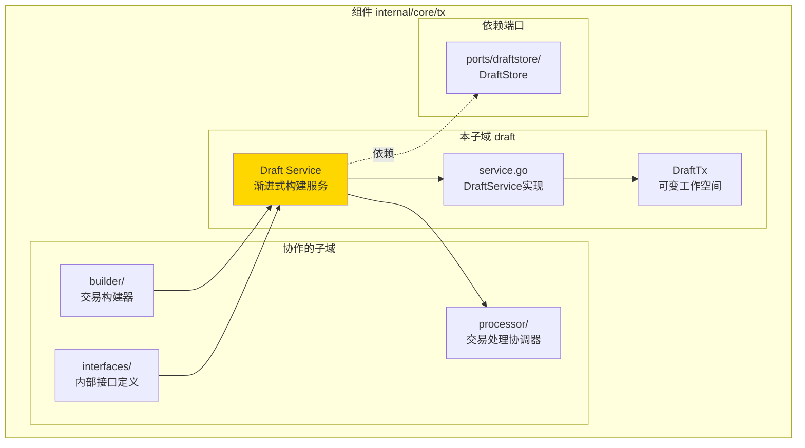
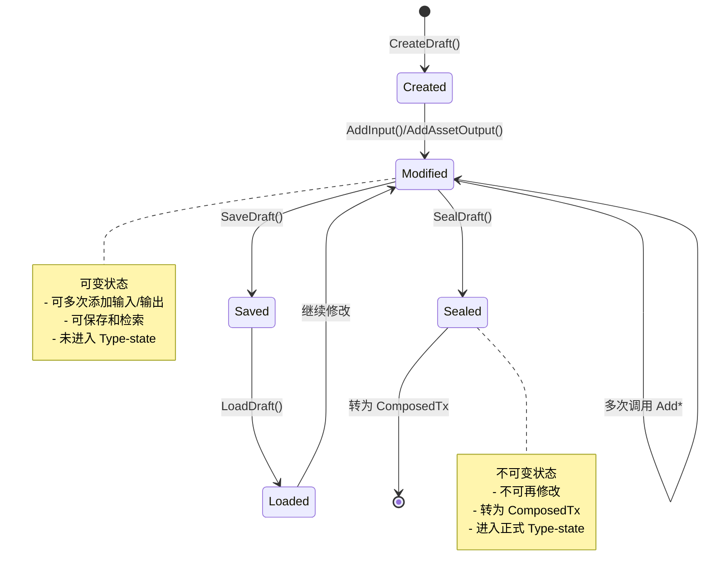
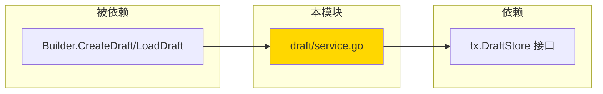

# Draft 渐进式交易构建服务（internal/core/tx/draft）

---

## 📌 版本信息

- **版本**：1.0
- **状态**：stable
- **最后更新**：2025-11-30
- **最后审核**：2025-11-30
- **所有者**：TX模块团队
- **适用范围**：internal/core/tx/draft 模块

---

## 🎯 **子域定位**

**路径**：`internal/core/tx/draft/`

**所属组件**：`tx`

**核心职责**：提供可变的交易草稿工作空间，支持多次调用添加输入/输出的渐进式构建模式。

**在组件中的角色**：
- 渐进式构建辅助工具，支持 ISPC 场景和 CLI/API 场景
- Draft 生命周期管理：创建 → 修改 → 保存 → 检索 → 封闭 → ComposedTx
- 作为 Builder 的辅助工具，最终通过 `Seal()` 进入 Type-state

**解决什么问题**：

- **ISPC 场景**：合约执行中渐进式添加交易输出
- **CLI/API 场景**：用户交互式构建交易，延迟签名
- **Draft 生命周期**：创建 → 修改 → 保存 → 检索 → 封闭 → ComposedTx

**不解决什么问题**（边界）：

- ❌ 不是正式 Type-state 的一部分（Draft 不可直接签名/提交）
- ❌ 不做验证逻辑（验证由 Verifier 负责）
- ❌ 不做 UTXO 选择（由 UTXOSelector 负责）
- ✅ Draft 是 Builder 的辅助工具，最终通过 `Seal()` 进入 Type-state

---

## 🎯 **设计原则与核心约束**

### **设计原则**

| 原则 | 说明 | 价值 |
|------|------|------|
| **辅助工具定位** | Draft 不是正式 Type-state，而是工作空间 | 保持 Type-state 清晰 |
| **渐进式构建** | 支持多次调用 Add* 方法 | 满足 ISPC 和交互式需求 |
| **Seal 转换** | Seal() 后转为 ComposedTx，进入正式状态机 | 统一入口，类型安全 |
| **存储可选** | DraftStore 端口支持内存/Redis 等实现 | 灵活适应不同场景 |

### **核心约束** ⭐

**严格遵守**：

- ✅ **Draft 可变**：可以多次调用 AddInput/AddAssetOutput 等方法
- ✅ **Seal 不可逆**：一旦 `Seal()`，Draft 不可再修改
- ✅ **唯一 DraftID**：每个 Draft 有全局唯一的 ID
- ✅ **无验证逻辑**：Draft Service 只做装配，不做验证

**严格禁止**：

- ❌ **跳过 Seal**：Draft 不能直接进入 ProvenTx/SignedTx
- ❌ **修改已封闭的 Draft**：Seal() 后不可再调用 Add* 方法
- ❌ **在 Draft 中做验证**：验证逻辑由 Verifier 负责

---

### **在组件中的位置**

> **说明**：展示此子域在组件内部的位置和协作关系



**位置说明**：

| 关系类型 | 目标 | 关系说明 |
|---------|------|---------|
| **协作** | builder/ | builder 通过 CreateDraft() 创建草稿 |
| **协作** | interfaces/ | 实现 interfaces.DraftService 接口 |
| **协作** | processor/ | Draft Seal() 后通过 processor 提交 |
| **依赖** | ports/draftstore | 使用 DraftStore 持久化草稿 |

### **整体架构**

```mermaid
graph TB
    subgraph "调用方"
        ISPC[ISPC 合约]
        CLI[CLI/API]
    end
    
    subgraph "Draft 模块"
        SERVICE[DraftService<br/>渐进式构建]
        DRAFT[DraftTx<br/>可变工作空间]
    end
    
    subgraph "Type-state 状态机"
        COMPOSED[ComposedTx]
        PROVEN[ProvenTx]
        SIGNED[SignedTx]
    end
    
    subgraph "存储端口"
        MEMORY[DraftStore(memory)]
        REDIS[DraftStore(redis)]
    end
    
    ISPC --> SERVICE
    CLI --> SERVICE
    
    SERVICE --> DRAFT
    SERVICE --> MEMORY
    SERVICE --> REDIS
    
    DRAFT -.Seal\(\).-> COMPOSED
    COMPOSED --> PROVEN
    PROVEN --> SIGNED
    
    style SERVICE fill:#FFD700
    style DRAFT fill:#90EE90
```

### **Draft 生命周期**



---

## 🔗 **依赖与协作**

### **依赖关系图**



### **依赖说明**

| 依赖模块 | 依赖接口 | 用途 | 约束条件 |
|---------|---------|------|---------|
| **无** | （内部实现） | Draft 内部管理草稿 | 当前实现使用内存存储 |
| **将来** | `tx.DraftStore` | 外部存储接口 | P3 使用内存，P7 支持 Redis |

---

## 📊 **核心机制**

### **机制 1：渐进式构建**

**为什么需要**：

在 ISPC 场景中，合约执行过程中需要多次调用添加输出；在 CLI 场景中，用户需要交互式构建交易。Type-state Builder 的一次性构建模式无法满足这两个需求。

**核心思路**：

Draft 提供可变的工作空间，支持多次调用 `AddInput()`、`AddAssetOutput()` 等方法，最后通过 `Seal()` 转换为 ComposedTx。

#### **使用场景 1：ISPC 渐进式构建**

```go
// ISPC 合约执行中渐进式添加输出
draft, _ := draftService.CreateDraft(ctx)

// 第 1 次调用：添加费用输入
draftService.AddInput(ctx, draft, feeUTXO, false, nil)

// ... 合约执行 ...

// 第 2 次调用：添加资产输出
draftService.AddAssetOutput(ctx, draft, recipient1, "100", nil, locks)

// ... 合约执行 ...

// 第 3 次调用：添加状态输出
draftService.AddStateOutput(ctx, draft, stateID, version, resultHash, inputs, parent)

// 封闭草稿，进入 Type-state
composed, _ := draftService.SealDraft(ctx, draft)
proven := composed.WithProofs(ctx, proofProvider)
signed := proven.Sign(ctx, signer)
```

#### **使用场景 2：CLI 交互式构建**

```go
// CLI/API 用户交互式构建
draft, _ := draftService.CreateDraft(ctx)

// 用户输入：添加输入和输出
draftService.AddInput(ctx, draft, utxo1, false, nil)
draftService.AddAssetOutput(ctx, draft, bob, "100", nil, lock)

// 保存草稿
draftService.SaveDraft(ctx, draft)
draftID := draft.DraftID

// ... 用户确认 ...

// 检索草稿
draft, _ = draftService.LoadDraft(ctx, draftID)

// 继续修改
draftService.AddAssetOutput(ctx, draft, alice, "45", nil, lock)  // 找零

// 封闭并签名
composed, _ := draftService.SealDraft(ctx, draft)
proven := composed.WithProofs(ctx, proofProvider)
signed := proven.Sign(ctx, signer)
```

**关键约束**：

- Draft 可变，可以多次调用 `Add*` 方法
- Draft 有唯一 ID，可以通过 `DraftStore` 存储和检索
- `Seal()` 后转换为 ComposedTx，Draft 不可再修改
- Draft 不是正式 Type-state，而是辅助工具（工作空间）

---

### **机制 2：DraftStore 端口（P3：内存版，P7：Redis 版）**

**为什么需要**：

CLI 场景需要保存草稿以支持延迟签名，ISPC 场景需要临时存储。不同场景对存储的要求不同（内存 vs 持久化）。

**核心思路**：

通过 DraftStore 端口接口，支持多种存储实现：

- **内存版（P3）**：适用于 ISPC 和单机 CLI
- **Redis 版（P7）**：适用于分布式/多节点场景

**接口定义**：

```go
type DraftStore interface {
    Save(ctx context.Context, draft *types.DraftTx) (string, error)
    Get(ctx context.Context, draftID string) (*types.DraftTx, error)
    Delete(ctx context.Context, draftID string) error
    List(ctx context.Context, ownerAddress []byte, limit, offset int) ([]*types.DraftTx, error)
    SetTTL(ctx context.Context, draftID string, ttlSeconds int) error
}
```

**P3 内存实现**：

- 使用 `map[string]*types.DraftTx` 存储
- 进程重启后数据丢失
- 适合短期/临时存储

**P7 Redis 实现**：

- 使用 Redis 存储，支持 TTL
- 支持跨进程/跨节点共享
- 适合长期/分布式场景

---

## 📁 **目录结构**

```text
internal/core/tx/draft/
├── service.go          # DraftService 实现 | 渐进式构建服务
└── README.md           # 本文档
```

### **组织原则**

| 文件 | 职责 | 为什么这样组织 |
|------|------|---------------|
| **service.go** | DraftService 实现 | 提供渐进式构建能力，包含 CreateDraft, LoadDraft, AddInput, AddAssetOutput, AddResourceOutput, AddStateOutput, SealDraft 等方法 |
| **README.md** | 模块文档 | 说明 Draft 定位、使用场景、设计权衡 |

---

## 🎓 **使用指南**

### **典型场景：ISPC 渐进式构建**

#### **步骤 1：创建草稿**

```go
draft, err := draftService.CreateDraft(ctx)
if err != nil {
    return err
}
```

#### **步骤 2：渐进式添加输入和输出**

```go
// 添加输入
inputIndex, err := draftService.AddInput(ctx, draft, outpoint, false, nil)

// 添加资产输出
outputIndex, err := draftService.AddAssetOutput(ctx, draft, owner, "100", nil, locks)

// 添加资源输出
resourceIndex, err := draftService.AddResourceOutput(ctx, draft, contentHash, "wasm", owner, locks, metadata)

// 添加状态输出
stateIndex, err := draftService.AddStateOutput(ctx, draft, stateID, version, resultHash, inputs, parent)
```

#### **步骤 3：封闭草稿，进入 Type-state**

```go
composed, err := draftService.SealDraft(ctx, draft)
if err != nil {
    return err
}

// 后续按正常流程
proven := composed.WithProofs(ctx, proofProvider)
signed := proven.Sign(ctx, signer)
submitted := signed.Submit(ctx, processor)
```

### **典型场景：CLI 交互式构建**

#### **步骤 1：创建并保存草稿**

```go
draft, _ := draftService.CreateDraft(ctx)
draftService.AddInput(ctx, draft, utxo1, false, nil)
draftService.AddAssetOutput(ctx, draft, bob, "100", nil, lock)

// 保存草稿
draftService.SaveDraft(ctx, draft)
fmt.Println("草稿 ID:", draft.DraftID)
```

#### **步骤 2：用户确认后检索草稿**

```go
draft, _ = draftService.LoadDraft(ctx, draftID)

// 继续修改
draftService.AddAssetOutput(ctx, draft, alice, "45", nil, lock)  // 找零
```

#### **步骤 3：封闭并签名**

```go
composed, _ := draftService.SealDraft(ctx, draft)
proven := composed.WithProofs(ctx, proofProvider)
signed := proven.Sign(ctx, signer)
```

### **常见误用**

| 误用方式 | 为什么错误 | 正确做法 |
|---------|-----------|---------|
| 在 Draft 中做验证 | Draft 只做装配，验证由 Verifier 负责 | Seal 后由 Verifier 验证 |
| 修改已封闭的 Draft | Seal() 后 Draft 不可修改 | Seal 前完成所有修改 |
| Draft 直接签名 | Draft 不是 Type-state，不能直接签名 | 必须先 Seal() 转为 ComposedTx |
| 不保存 DraftID | CLI 场景需要 DraftID 才能检索草稿 | 保存 Draft 后记录 DraftID |

---

## ⚠️ **已知限制**

| 限制 | 影响 | 规避方法 | 未来计划 |
|------|------|---------|---------|
| **P3 内存存储** | 进程重启后草稿丢失 | CLI 场景避免长时间保存草稿 | P7 实现 Redis 存储 |
| **无并发保护** | 多个 goroutine 同时修改同一草稿可能冲突 | 通过 DraftID 隔离不同草稿 | 添加乐观锁机制 |
| **无 Owner 过滤** | List() 暂不支持按 owner 过滤 | 客户端自行过滤 | 完善 owner 过滤逻辑 |
| **RollbackDraft 功能不完整** | 无法真正回滚草稿内容，只清理操作历史 | 当前实现为基础框架，不依赖回滚功能 | 需要实现逆操作机制（如 RemoveInput）才能完整回滚 |

**关于 `RollbackDraft` 的限制说明**：

`Service.RollbackDraft` 方法当前实现不完整，具体表现为：

1. **当前行为**：只清理操作历史记录，不实际回滚草稿内容
2. **原因**：缺少逆操作机制（如 `AddInput` 的逆操作 `RemoveInput`）
3. **影响范围**：回滚功能不可用，但 Draft 的其他功能不受影响
4. **未来实现**：需要为每个操作保存逆操作信息，才能实现完整的回滚功能

**完整实现需要**：

- 为每个操作记录逆操作（如 `AddInput` → `RemoveInput`）
- 根据操作历史重建草稿状态
- 支持部分回滚（回滚到指定操作索引之前的状态）

---

## 🔍 **设计权衡记录**

### **权衡 1：Draft 是否作为 Type-state 0**

**背景**：Draft 是辅助工具还是正式 Type-state 的一部分？

**备选方案**：

1. **Draft 作为辅助工具** - 优势：职责清晰，不破坏 Type-state - 劣势：Draft 需要额外存储
2. **Draft 作为 Type-state 0** - 优势：类型系统一致 - 劣势：Draft 的可变性与 Type-state 的不可变性冲突

**选择**：选择了 **Draft 作为辅助工具**

**理由**：

- 符合架构文档 "Draft/Plan 隐式辅助工具"
- Type-state 应保持不可变性，Draft 的可变性不适合
- Draft 是工作空间，不是正式状态

**代价**：需要额外的 DraftStore 实现

---

### **权衡 2：P3 使用内存存储 vs Redis**

**背景**：P3 阶段应该使用哪种存储实现？

**备选方案**：

1. **内存存储** - 优势：简单，无外部依赖 - 劣势：进程重启后丢失
2. **Redis 存储** - 优势：持久化，支持分布式 - 劣势：引入外部依赖

**选择**：P3 使用 **内存存储**，P7 再实现 Redis

**理由**：

- P3 目标是快速验证 Draft 能力
- ISPC 场景主要使用内存存储（短期）
- CLI 单机模式内存存储已足够
- 延迟引入外部依赖，降低复杂度

**代价**：CLI 场景不支持长时间保存草稿

---

### **权衡 3：Draft vs Builder 职责边界**

**背景**：Draft 是否应该支持 `AddResourceOutput` 和 `AddStateOutput`？

#### **🎯 职责定位对比**

| 维度 | Builder | Draft | 结论 |
|------|---------|-------|------|
| **核心职责** | 类型安全的交易构建器 | 渐进式交易组装服务 | **不同关注点** |
| **Type-State** | 强制 Type-State 流程 | 不强制，支持部分字段 | **Builder 更严格** |
| **输出支持** | 支持 Asset/Resource/State 三种输出 | **只需持久化 Builder 状态** | **Builder 是唯一入口** |
| **使用场景** | 交易构建的主要入口 | 临时保存/恢复工作区 | **Builder 为主，Draft 为辅** |

#### **设计决策**

##### **方案 A：Draft 也支持 AddResourceOutput/AddStateOutput**

```go
// ❌ 与 Builder 重复
draftService.AddResourceOutput(...)
draftService.AddStateOutput(...)
builder.AddResourceOutput(...)
builder.AddStateOutput(...)
```

**问题**：

- ❌ 功能重复，维护成本高
- ❌ 职责不清晰：Draft 到底是什么？
- ❌ 容易混淆：用户不知道该用哪个

##### **方案 B：只在 Builder 支持，Draft 只持久化（✅ 最终选择）**

```go
// ✅ Builder 是唯一的交易构建入口
builder.AddAssetOutput(...)
builder.AddResourceOutput(...)   // ✅ P1.5 已实现
builder.AddStateOutput(...)      // ✅ P1.5 已实现

// ✅ Draft 只负责持久化 Builder 的中间状态
draft := draftService.SaveDraft(builder.GetTransaction())
resumedTx, _ := draftService.LoadDraft(draftID)
builder := tx.NewBuilderFromTransaction(resumedTx)  // 恢复构建
```

**优势**：

- ✅ 职责清晰：Builder 构建，Draft 持久化
- ✅ 避免重复：单一入口，易于维护
- ✅ 符合架构：Draft 是"辅助工具"，不是"构建器"

#### **📋 职责边界清单**

| 能力 | Builder | Draft | 说明 |
|------|---------|-------|------|
| **添加输入** | ✅ `AddInput(utxo, proof)` | ❌ | Builder 独占 |
| **添加资产输出** | ✅ `AddAssetOutput(...)` | ❌ | Builder 独占 |
| **添加资源输出** | ✅ `AddResourceOutput(...)` | ❌ | Builder 独占 |
| **添加状态输出** | ✅ `AddStateOutput(...)` | ❌ | Builder 独占 |
| **Type-State 流程** | ✅ Composed → Proven → Signed → Submitted | ❌ | Builder 独占 |
| **保存中间状态** | ❌ | ✅ `SaveDraft(tx)` | Draft 独占 |
| **加载中间状态** | ❌ | ✅ `LoadDraft(id)` | Draft 独占 |
| **列出草稿** | ❌ | ✅ `ListDrafts()` | Draft 独占 |
| **删除草稿** | ❌ | ✅ `DeleteDraft(id)` | Draft 独占 |

#### **✅ 总结**

**核心原则**：

- ✅ **Builder 是唯一的交易构建入口**：所有输出类型（Asset/Resource/State）都通过 Builder 添加
- ✅ **Draft 是辅助持久化工具**：只负责保存和恢复 Builder 的中间状态
- ✅ **避免功能重复**：保持架构简洁，降低维护成本

**使用模式**：

```go
// 1. 创建交易（使用 Builder）
builder := tx.NewBuilder()
builder.AddInput(utxo, proof)
builder.AddAssetOutput(owner, amount, lock)
builder.AddResourceOutput(owner, resource, lock)  // ✅ P1.5 支持
builder.AddStateOutput(owner, stateID, zkProof, lock)  // ✅ P1.5 支持

// 2. 临时保存（使用 Draft）
draft := draftService.SaveDraft(builder.GetTransaction())

// 3. 稍后恢复（使用 Draft + Builder）
resumedTx, _ := draftService.LoadDraft(draft.ID)
builder = tx.NewBuilderFromTransaction(resumedTx)

// 4. 继续构建（使用 Builder）
builder.AddAssetOutput(...)
signedTx := builder.Build().WithProofs(...).Sign(...)
```

**为什么不在 Draft 中添加 AddResourceOutput/AddStateOutput？**

1. **职责纯粹**：Draft 是持久化工具，不是构建器
2. **避免重复**：Builder 已支持，不需要再实现一遍
3. **简化架构**：减少组件间的功能重叠

---

## 📚 **相关文档**

- **架构设计**：[TX_STATE_MACHINE_ARCHITECTURE.md](../../../_docs/architecture/TX_STATE_MACHINE_ARCHITECTURE.md) - TX 模块整体架构
- **公共接口**：`pkg/interfaces/tx/draft.go` - TransactionDraftService 接口定义
- **内部接口**：`internal/core/tx/interfaces/draft.go` - DraftService 内部接口
- **DraftStore**：`pkg/interfaces/tx/ports.go` - DraftStore 端口接口
- **内存实现**：`internal/core/tx/ports/draftstore/memory/` - 内存版 DraftStore

---

## 📋 **文档变更记录**

| 日期 | 变更内容 | 原因 |
|------|---------|------|
| 2025-11-30 | 统一日期格式 | 符合文档规范 |
| 2025-11-30 | 添加"在组件中的位置"图 | 符合 subdirectory-readme.md 模板要求 |
| 2025-11-30 | 调整章节标题 | 符合模板规范 |
| 2025-10-23 | 初始版本 | P3 阶段实现完成 |

---

> 📝 **文档说明**
>
> 本文档聚焦于 Draft 模块的**职责**、**使用场景**、**设计权衡**和**已知限制**，
> 而非实现细节（详见 service.go 代码注释）。
