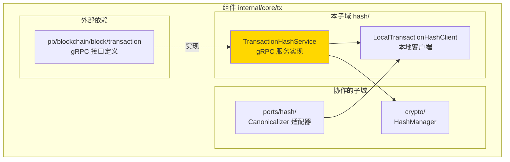

# Transaction Hash Service（internal/core/tx/hash）

---

## 📌 版本信息

- **版本**：1.0
- **状态**：stable
- **最后更新**：2025-11-01
- **适用范围**：交易哈希计算服务实现

---

## 🎯 概述

`internal/core/tx/hash` 提供交易哈希计算服务的 gRPC 实现，负责确定性的交易哈希和签名哈希计算。

**核心职责**：
- ✅ 实现 gRPC `TransactionHashService` 接口
- ✅ 提供确定性的交易哈希计算（排除签名字段）
- ✅ 提供签名哈希计算（支持 SIGHASH 类型）
- ✅ 确保跨平台哈希计算一致性

---

## 🏗️ 架构设计

### 在组件中的位置



**位置说明**：

| 关系类型 | 目标 | 关系说明 |
|---------|------|---------|
| **被使用** | ports/hash/ | Canonicalizer 通过 LocalTransactionHashClient 调用服务 |
| **依赖** | crypto/ | 使用 HashManager 进行实际的哈希计算 |
| **实现** | pb/blockchain/block/transaction | 实现 TransactionHashService gRPC 接口 |

---

## 📁 目录结构

```
internal/core/tx/hash/
├── README.md          # 本文档
├── service.go         # TransactionHashService 实现
└── client.go          # LocalTransactionHashClient 实现
```

### 文件职责

| 文件 | 核心职责 | 关键类型/函数 |
|------|---------|-------------|
| **service.go** | gRPC 服务实现 | `TransactionHashService`, `ComputeHash`, `ComputeSignatureHash` |
| **client.go** | 本地客户端实现 | `LocalTransactionHashClient` |

---

## 🔗 依赖与协作

### 依赖关系

| 依赖模块 | 依赖接口/类型 | 用途 | 约束条件 |
|---------|--------------|------|---------|
| `pkg/interfaces/infrastructure/crypto` | `crypto.HashManager` | 实际的哈希计算 | 必须提供 |
| `pb/blockchain/block/transaction` | `TransactionHashServiceServer` | gRPC 接口定义 | 必须实现 |

### 被使用关系

| 使用方 | 使用方式 | 用途 |
|--------|---------|------|
| `internal/core/tx/ports/hash` | 通过 `LocalTransactionHashClient` | Canonicalizer 调用哈希服务 |
| `internal/core/infrastructure/crypto` | 通过依赖注入 | 提供 TransactionHashServiceClient |

---

## 📊 核心机制

### 机制1：确定性交易哈希计算

**为什么需要**：交易哈希必须排除签名字段，否则会导致签名验证失败（循环依赖）

**核心思路**：
1. 创建交易副本
2. 清空所有输入的 `UnlockingProof`（包含签名）
3. 序列化交易（已排除签名）
4. 使用 SHA-256 计算哈希

**实现策略**：

```go
// 创建交易副本，排除签名字段
txCopy := proto.Clone(req.Transaction).(*transaction.Transaction)
// 清空所有输入的解锁证明（包含签名）
for _, input := range txCopy.Inputs {
    input.UnlockingProof = nil
}

// 序列化交易（已排除签名）进行哈希计算
txBytes, err := proto.Marshal(txCopy)
hash := s.hashManager.SHA256(txBytes)
```

### 机制2：签名哈希计算

**为什么需要**：签名时需要计算特定输入的哈希，支持不同的 SIGHASH 类型

**核心思路**：
1. 创建交易副本，排除签名字段
2. 根据 SIGHASH 类型处理交易结构（当前简化实现）
3. 添加输入索引和 SIGHASH 类型到哈希计算
4. 使用 SHA-256 计算哈希

**实现策略**：

```go
// 创建交易副本，排除签名字段
txCopy := proto.Clone(req.Transaction).(*transaction.Transaction)
for _, input := range txCopy.Inputs {
    input.UnlockingProof = nil
}

// 序列化交易
txBytes, err := proto.Marshal(txCopy)

// 添加输入索引和 SIGHASH 类型到哈希计算
hasher := s.hashManager.NewSHA256Hasher()
hasher.Write(txBytes)
hasher.Write([]byte{byte(req.InputIndex), byte(req.SighashType)})
hash := hasher.Sum(nil)
```

### 机制3：本地客户端优化

**为什么需要**：避免 gRPC 网络开销，直接调用本地服务

**核心思路**：
- `LocalTransactionHashClient` 直接调用 `TransactionHashService`
- 无需网络通信，性能更好
- 保持 gRPC 接口一致性

---

## 🎓 使用指南

### 场景1：创建服务实例

```go
import (
    txhash "github.com/weisyn/v1/internal/core/tx/hash"
    "github.com/weisyn/v1/pkg/interfaces/infrastructure/crypto"
    "github.com/weisyn/v1/pkg/interfaces/infrastructure/log"
)

// 创建服务
hashService := txhash.NewTransactionHashService(hashManager, logger)

// 创建本地客户端
txHashClient := txhash.NewLocalTransactionHashClient(hashService)
```

### 场景2：在依赖注入中使用

```go
// 在 crypto 模块中提供
transactionHashService := txhash.NewTransactionHashService(hashService, logger)
transactionHashClient := txhash.NewLocalTransactionHashClient(transactionHashService)

// 导出为 TransactionHashServiceClient
return CryptoOutput{
    TransactionHashServiceClient: transactionHashClient,
    // ...
}
```

### 场景3：计算交易哈希

```go
req := &transaction.ComputeHashRequest{
    Transaction:      tx,
    IncludeDebugInfo: false,
}
resp, err := txHashClient.ComputeHash(ctx, req)
if err != nil {
    return err
}
txHash := resp.Hash
```

### 场景4：计算签名哈希

```go
req := &transaction.ComputeSignatureHashRequest{
    Transaction:      tx,
    InputIndex:       uint32(inputIndex),
    SighashType:      transaction.SignatureHashType_SIGHASH_ALL,
    IncludeDebugInfo: false,
}
resp, err := txHashClient.ComputeSignatureHash(ctx, req)
if err != nil {
    return err
}
sigHash := resp.Hash
```

---

## ⚠️ 已知限制

| 限制 | 影响 | 规避方法 | 未来计划 |
|------|------|---------|---------|
| SIGHASH 类型支持不完整 | 当前只支持 SIGHASH_ALL | 使用 SIGHASH_ALL | 实现完整的 SIGHASH 类型支持 |

---

## 🔍 设计权衡记录

### 权衡1：服务实现位置

**背景**：TransactionHashService 应该放在哪里？

**备选方案**：
1. **放在 `internal/core/tx/hash`**：优势：与 tx 模块相关 - 劣势：需要从 crypto 模块导入
2. **放在 `internal/core/infrastructure/crypto`**：优势：与 BlockHashService 一致 - 劣势：tx 模块依赖 crypto 模块

**选择**：放在 `internal/core/tx/hash`

**理由**：
- 交易哈希是交易模块的核心功能
- 虽然由 crypto 模块提供，但实现属于 tx 模块
- 保持模块职责清晰

**代价**：需要在 crypto 模块中导入 tx 模块

---

## 📚 相关文档

- **端口适配器**：[ports/hash/README.md](../ports/hash/README.md) - Canonicalizer 实现
- **区块哈希服务**：[internal/core/block/hash/README.md](../../block/hash/README.md) - 区块哈希服务实现
- **gRPC 接口定义**：`pb/blockchain/block/transaction` - TransactionHashService 接口定义

---

## 📋 文档变更记录

| 日期 | 变更内容 | 原因 |
|------|---------|------|
| 2025-11-01 | 创建文档 | 补充缺失的 README 文档 |

---

