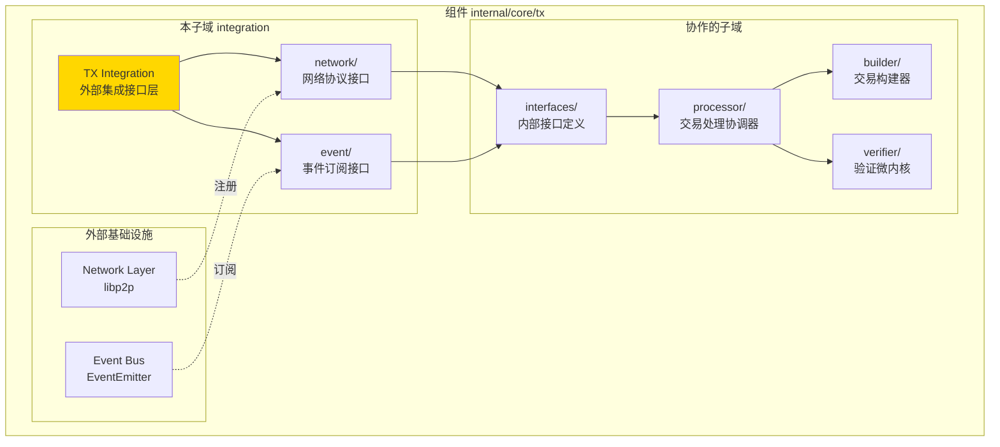
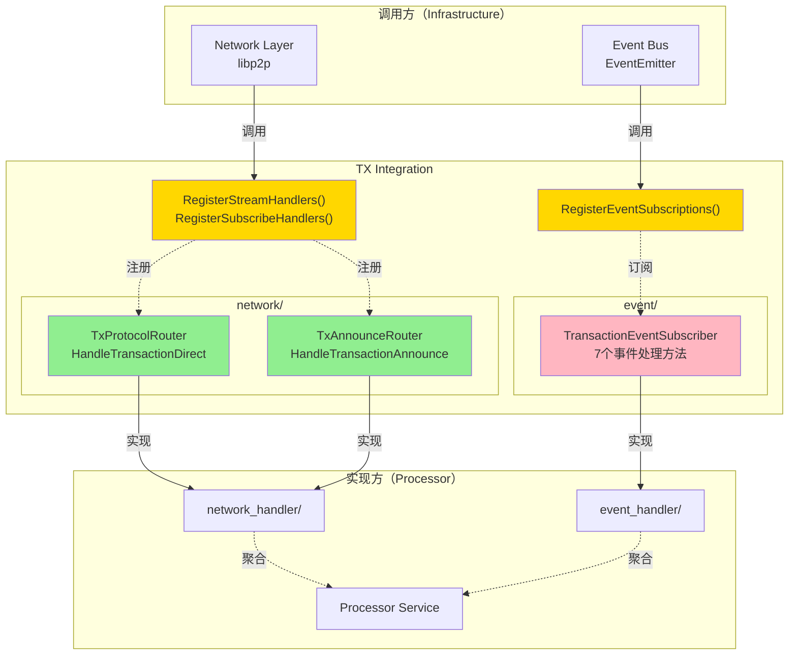
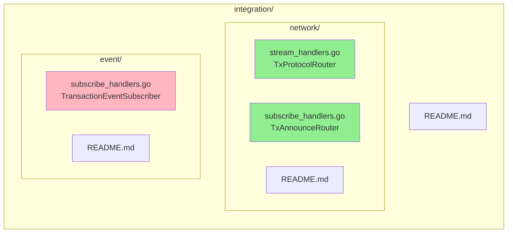
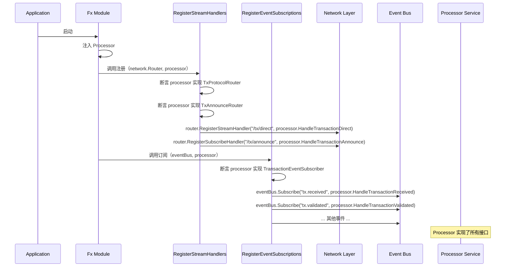
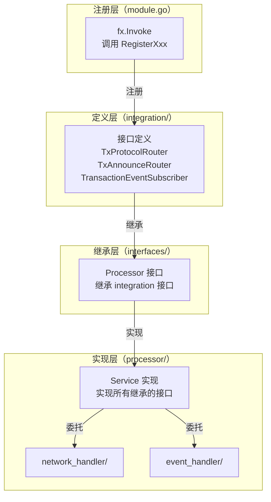

# TX Integration（internal/core/tx/integration）

---

## 📌 版本信息

- **版本**：1.0
- **状态**：stable
- **最后更新**：2025-11-30
- **最后审核**：2025-11-30
- **所有者**：TX模块团队
- **适用范围**：internal/core/tx/integration 模块

---

## 🎯 **子域定位**

**路径**：`internal/core/tx/integration/`

**所属组件**：`tx`

**核心职责**：定义 TX 模块与外部基础设施（网络协议和事件系统）的集成接口，作为 internal/core/tx 与外部基础设施的边界。

**在组件中的角色**：
- 定义网络协议处理接口（TxProtocolRouter、TxAnnounceRouter）
- 定义事件订阅接口（TransactionEventSubscriber）
- 提供统一的注册函数（RegisterStreamHandlers、RegisterEventSubscriptions）
- 作为 internal/core/tx 与外部基础设施（network、event）的边界

本模块是WES系统中**交易处理域**的**外部集成接口层**，定义与网络协议和事件系统的集成接口。

**解决什么问题**：
- 定义网络协议处理接口（TxProtocolRouter、TxAnnounceRouter）
- 定义事件订阅接口（TransactionEventSubscriber）
- 提供统一的注册函数（RegisterStreamHandlers、RegisterEventSubscriptions）
- 作为 internal/core/tx 与外部基础设施（network、event）的边界

**不解决什么问题**（边界）：
- 不实现具体的处理逻辑（由 processor/network_handler 实现）
- 不定义业务接口（由 pkg/interfaces/tx 定义）
- 不做协议解析（由 pb/network/protocol 定义）
- 不做事件发布（由 infrastructure/event 定义）

---

## 🎯 **设计原则与核心约束**

### **设计原则**

| 原则 | 说明 | 价值 | 实现策略 |
|------|------|------|---------|
| **接口继承** | 避免重复定义，通过继承复用 | 一致性 | interfaces/ 只继承，不创建 integration.go |
| **单一职责** | 网络接口只管网络，事件接口只管事件 | 清晰性 | event/ 和 network/ 独立子目录 |
| **统一注册** | 提供注册函数避免模块耦合 | 可维护性 | RegisterXxx() 函数 |
| **协议分离** | Stream（直连）和Subscribe（广播）分开 | 灵活性 | TxProtocolRouter 和 TxAnnounceRouter |
| **纯接口层** | 不包含任何实现逻辑 | 可测试性 | 接口定义 + 注册函数 |

### **核心约束** ⭐

**严格遵守**：
- ✅ 只定义接口，不提供实现
- ✅ 注册函数统一入口：RegisterStreamHandlers、RegisterEventSubscriptions
- ✅ 接口方法参数规范：context.Context、peer.ID、[]byte
- ✅ 错误处理规范：返回 error，不 panic
- ✅ 与 consensus、blockchain 保持一致的架构

**严格禁止**：
- ❌ 在 integration/ 中实现业务逻辑
- ❌ 直接依赖 processor/ 或其他实现模块
- ❌ 在接口中定义配置或状态
- ❌ 混合网络和事件接口

---

## 🏗️ **架构设计**

### **在组件中的位置**

> **说明**：展示此子域在组件内部的位置和协作关系



**位置说明**：

| 关系类型 | 目标 | 关系说明 |
|---------|------|---------|
| **协作** | interfaces/ | integration 定义的接口被 interfaces/ 继承 |
| **协作** | processor/ | processor 实现 integration 定义的接口 |
| **边界** | Network Layer | 定义网络协议接口，供 Network Layer 注册 |
| **边界** | Event Bus | 定义事件订阅接口，供 Event Bus 订阅 |

### **整体架构**



### **接口组织**



### **注册流程**



---

## 📊 **核心机制**

### **机制1：接口继承模式**

**为什么需要**：避免在 internal 接口中重复定义网络和事件接口

**核心思路**：
1. integration/ 定义接口
2. interfaces/ 继承接口
3. 实现模块实现接口

**实现策略**：

```go
// internal/core/tx/integration/network/stream_handlers.go
package network

import (
    "context"
    peer "github.com/libp2p/go-libp2p/core/peer"
)

type TxProtocolRouter interface {
    HandleTransactionDirect(ctx context.Context, from peer.ID, reqBytes []byte) ([]byte, error)
}

// internal/core/tx/interfaces/processor.go
package interfaces

import (
    txnet "github.com/weisyn/v1/internal/core/tx/integration/network"
)

type Processor interface {
    // 继承网络协议接口
    txnet.TxProtocolRouter
    txnet.TxAnnounceRouter
    
    // 继承事件订阅接口
    txevent.TransactionEventSubscriber
    
    // 业务接口
    tx.TxProcessor
}
```

**关键约束**：
- interfaces/ 不能重新创建 integration.go
- 必须使用接口嵌入（embedding）
- 导入时使用别名避免冲突（txnet、txevent）

### **机制2：统一注册函数**

**为什么需要**：避免模块间直接耦合，提供统一入口

**核心思路**：
1. 定义注册函数
2. fx.Invoke 调用注册函数
3. 注册函数负责断言接口和注册回调

**实现策略**：

```go
// integration/network/stream_handlers.go
func RegisterStreamHandlers(
    router network.StreamRouter,
    handler TxProtocolRouter,
    logger log.Logger,
) error {
    // 断言接口实现
    if handler == nil {
        return errors.New("TxProtocolRouter 不能为空")
    }
    
    // 注册流式协议
    router.RegisterStreamHandler("/tx/v1/direct", func(ctx context.Context, from peer.ID, data []byte) ([]byte, error) {
        return handler.HandleTransactionDirect(ctx, from, data)
    })
    
    logger.Infof("✅ 已注册 TX 流式协议")
    return nil
}

// integration/event/subscribe_handlers.go
func RegisterEventSubscriptions(
    eventBus event.EventBus,
    subscriber TransactionEventSubscriber,
    logger log.Logger,
) error {
    // 订阅事件
    eventBus.Subscribe(eventconstants.TopicTxReceived, subscriber.HandleTransactionReceived)
    eventBus.Subscribe(eventconstants.TopicTxValidated, subscriber.HandleTransactionValidated)
    // ... 其他事件 ...
    
    logger.Infof("✅ 已订阅 TX 事件（7个）")
    return nil
}
```

**调用方式**：

```go
// module.go
fx.Invoke(func(
    router network.StreamRouter,
    eventBus event.EventBus,
    processor interfaces.Processor,
    logger log.Logger,
) {
    // 注册网络协议
    txnet.RegisterStreamHandlers(router, processor, logger)
    txnet.RegisterSubscribeHandlers(router, processor, logger)
    
    // 订阅事件
    txevent.RegisterEventSubscriptions(eventBus, processor, logger)
}),
```

### **机制3：协议分离**

**为什么需要**：Stream（直连）和 Subscribe（广播）是不同的通信模式

**核心思路**：
1. TxProtocolRouter：处理点对点直连请求（有响应）
2. TxAnnounceRouter：处理订阅广播消息（无响应）

**对比**：

| 接口 | 通信模式 | 协议路径 | 响应 | 使用场景 |
|------|---------|---------|------|---------|
| **TxProtocolRouter** | Stream（点对点） | `/tx/v1/direct` | ✅ 返回 []byte | 节点直接发送交易 |
| **TxAnnounceRouter** | Subscribe（广播） | `/tx/announce` | ❌ 无响应 | 节点广播交易哈希 |

**实现策略**：

```go
// stream_handlers.go - 直连协议
type TxProtocolRouter interface {
    // 处理直连交易请求
    HandleTransactionDirect(ctx context.Context, from peer.ID, reqBytes []byte) ([]byte, error)
}

// subscribe_handlers.go - 订阅协议
type TxAnnounceRouter interface {
    // 处理交易广播
    HandleTransactionAnnounce(ctx context.Context, from peer.ID, topic string, data []byte) error
}
```

---

## 📁 **目录结构**

```
internal/core/tx/integration/
├── README.md                      # 本文档
├── network/
│   ├── stream_handlers.go         # TxProtocolRouter 接口 | HandleTransactionDirect
│   ├── subscribe_handlers.go      # TxAnnounceRouter 接口 | HandleTransactionAnnounce
│   └── README.md                  # 网络协议详细说明
└── event/
    ├── subscribe_handlers.go      # TransactionEventSubscriber 接口 | 7个事件处理方法
    └── README.md                  # 事件订阅详细说明
```

### **文件职责**

| 文件 | 核心职责 | 关键接口 | 为什么独立 |
|------|---------|---------|----------|
| **network/stream_handlers.go** | 定义流式协议接口 | TxProtocolRouter | Stream 和 Subscribe 分离 |
| **network/subscribe_handlers.go** | 定义订阅协议接口 | TxAnnounceRouter | Subscribe 和 Stream 分离 |
| **event/subscribe_handlers.go** | 定义事件订阅接口 | TransactionEventSubscriber | 网络和事件分离 |

---

## 🔗 **依赖与协作**

### **依赖关系**

| 依赖模块 | 依赖接口/类型 | 用途 | 约束条件 |
|---------|--------------|------|---------|
| `libp2p` | peer.ID, context.Context | 网络协议参数 | 标准 libp2p 接口 |
| `pkg/types` | TransactionReceivedEventData 等 | 事件数据结构 | 只定义结构，不实现逻辑 |
| `pkg/constants/events` | TopicTxReceived 等 | 事件主题常量 | 统一事件命名 |
| `pkg/interfaces/infrastructure/log` | Logger | 日志记录 | 注册函数记录日志 |

### **协作流程**



---

## 🎓 **使用指南**

### **场景1：在 interfaces/ 中继承**

```go
// internal/core/tx/interfaces/processor.go
package interfaces

import (
    "github.com/weisyn/v1/pkg/interfaces/tx"
    txevent "github.com/weisyn/v1/internal/core/tx/integration/event"
    txnet "github.com/weisyn/v1/internal/core/tx/integration/network"
)

type Processor interface {
    // ==================== 继承公共接口 ====================
    tx.TxProcessor

    // ==================== 继承网络协议接口 ====================
    txnet.TxProtocolRouter
    txnet.TxAnnounceRouter

    // ==================== 继承事件订阅接口 ====================
    txevent.TransactionEventSubscriber
}
```

### **场景2：在 module.go 中注册**

```go
// internal/core/tx/module.go
func Module() fx.Option {
    return fx.Module("tx",
        fx.Provide(
            processor.NewService,
        ),
        
        fx.Invoke(func(
            router network.StreamRouter,
            eventBus event.EventBus,
            processor interfaces.Processor,
            logger log.Logger,
        ) {
            // 注册网络协议
            if err := txnet.RegisterStreamHandlers(router, processor, logger); err != nil {
                logger.Errorf("注册 TX 流式协议失败: %v", err)
            }
            
            if err := txnet.RegisterSubscribeHandlers(router, processor, logger); err != nil {
                logger.Errorf("注册 TX 订阅协议失败: %v", err)
            }
            
            // 订阅事件
            if err := txevent.RegisterEventSubscriptions(eventBus, processor, logger); err != nil {
                logger.Errorf("订阅 TX 事件失败: %v", err)
            }
        }),
    )
}
```

---

## ⚠️ **已知限制**

| 限制 | 影响 | 规避方法 | 未来计划 |
|------|------|---------|---------|
| 接口方法参数固定 | 无法扩展参数 | 使用 context.Context 传递额外信息 | 暂不支持 |
| 注册函数不返回错误 | 注册失败静默 | 在注册函数内部记录日志 | 已改为返回 error |
| 事件订阅无优先级 | 无法控制处理顺序 | 事件处理应该幂等 | 由 EventBus 决定 |

---

## 🔍 **设计权衡记录**

### **权衡1：接口在 integration/ vs interfaces/ 定义**

**背景**：网络和事件接口应该在哪里定义

**备选方案**：
1. **integration/ 定义**：清晰的集成边界 - 优势：职责清晰 - 劣势：需要继承
2. **interfaces/ 直接定义**：简单直接 - 优势：无需继承 - 劣势：混淆业务和集成

**选择**：integration/ 定义

**理由**：
- 与 consensus、blockchain 保持一致
- 清晰的分层边界
- 便于模块间复用

**代价**：需要在 interfaces/ 中继承

### **权衡2：Stream 和 Subscribe 分开 vs 合并**

**背景**：是否需要两个独立接口

**备选方案**：
1. **分开**：TxProtocolRouter + TxAnnounceRouter - 优势：职责清晰 - 劣势：多个接口
2. **合并**：TxNetworkHandler - 优势：简单 - 劣势：混淆概念

**选择**：分开

**理由**：
- Stream（直连）和 Subscribe（广播）是不同的通信模式
- 可能有实现只支持其中一种
- 与 consensus 保持一致

**代价**：interfaces/ 需要继承两个接口

---

## 📚 **相关文档**

- **网络协议**：[network/README.md](./network/README.md) - TxProtocolRouter 和 TxAnnounceRouter 详细说明
- **事件订阅**：[event/README.md](./event/README.md) - TransactionEventSubscriber 详细说明
- **实现模块**：[processor/README.md](../processor/README.md) - Processor 如何实现这些接口
- **参考架构**：[blockchain/integration/README.md](../../blockchain/integration/README.md) - Blockchain 模块的类似设计

---

## 📋 **文档变更记录**

| 日期 | 变更内容 | 原因 |
|------|---------|------|
| 2025-11-30 | 添加版本信息章节 | 符合文档规范 |
| 2025-11-30 | 添加"在组件中的位置"图 | 符合 subdirectory-readme.md 模板要求 |
| 2025-11-30 | 调整章节标题和顺序 | 符合模板规范 |
| 2025-11-30 | 统一日期格式 | 符合文档规范 |
| 2025-10-23 | 创建完整架构文档 | 提供 Integration 层设计说明 |
| 2025-10-23 | 补齐注册流程和协作关系 | 完善设计细节 |

---

> 📝 **实现指导**
>
> 本文档定义了 TX 模块与外部基础设施的集成接口，包括：
> 1. **网络协议接口**：TxProtocolRouter（直连）、TxAnnounceRouter（广播）
> 2. **事件订阅接口**：TransactionEventSubscriber（7个事件）
> 3. **统一注册函数**：RegisterStreamHandlers、RegisterEventSubscriptions
> 4. **接口继承模式**：interfaces/ 继承 integration/ 的接口
> 5. **与 consensus、blockchain 一致**：保持架构统一性
>
> 实现时严格分离接口定义和实现逻辑，遵循 DIP（依赖倒置原则）。
