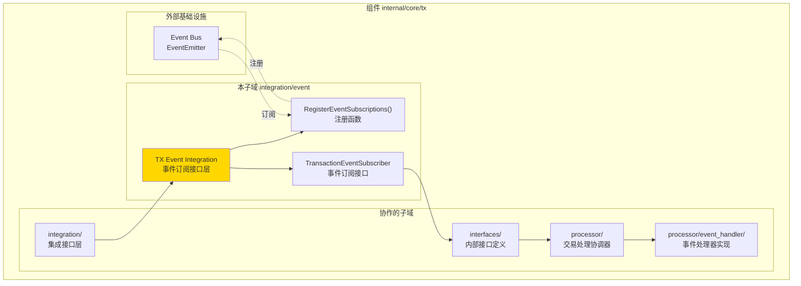
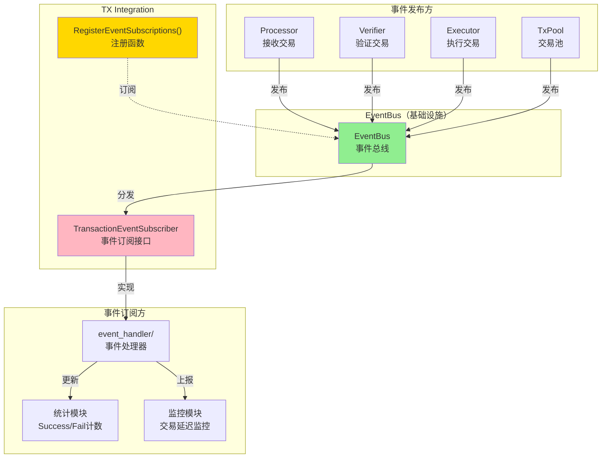
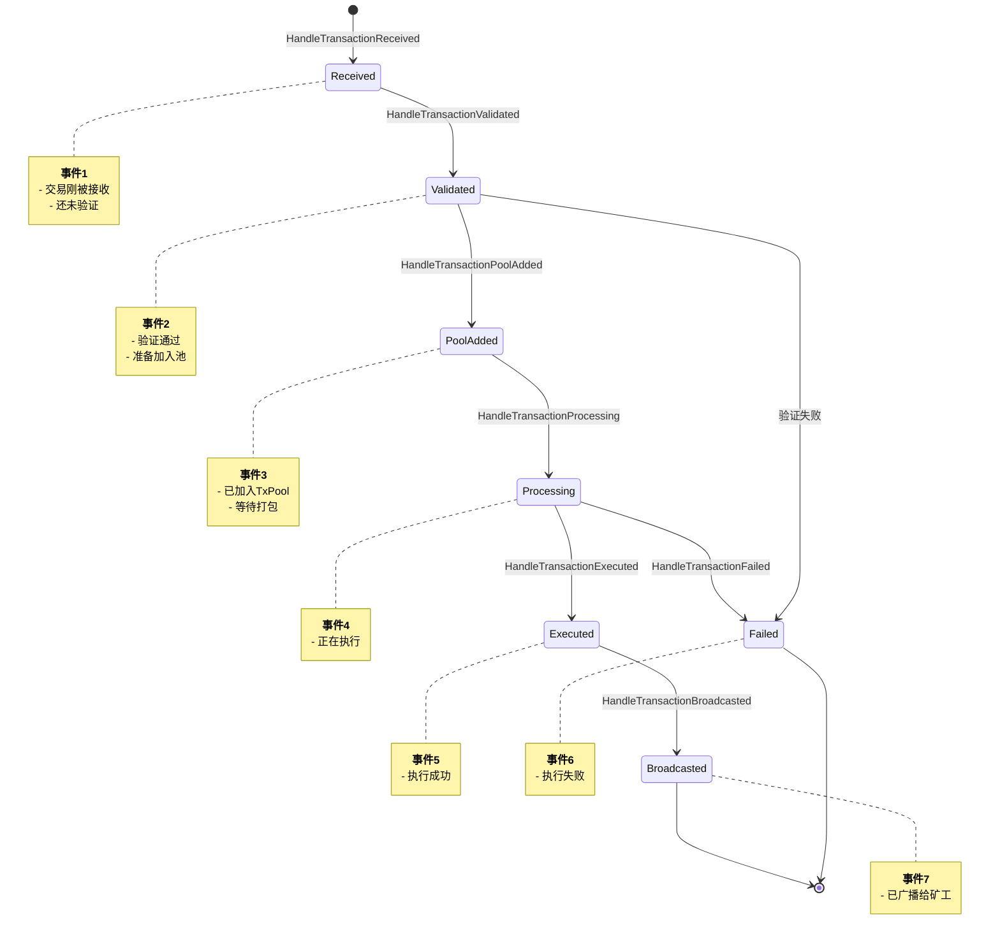
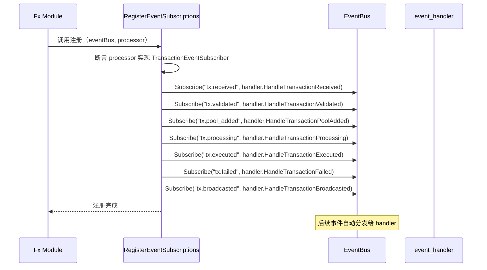
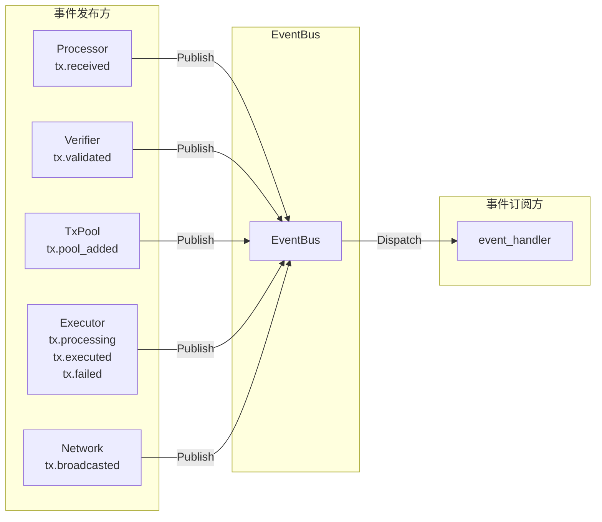

# TX Event Integration（internal/core/tx/integration/event）

---

## 📌 版本信息

- **版本**：1.0
- **状态**：stable
- **最后更新**：2025-11-30
- **最后审核**：2025-11-30
- **所有者**：TX模块团队
- **适用范围**：internal/core/tx/integration/event 模块

---

## 🎯 **子域定位**

**路径**：`internal/core/tx/integration/event/`

**所属组件**：`tx`

**核心职责**：定义 TX 模块与事件总线的集成接口，定义交易生命周期事件的订阅接口。

**在组件中的角色**：
- 定义统一的事件处理接口（TransactionEventSubscriber）
- 覆盖交易完整生命周期（7个事件）
- 提供事件订阅注册函数（RegisterEventSubscriptions）
- 作为 TX 模块与事件总线的桥接

**解决什么问题**：
- 定义统一的事件处理接口（TransactionEventSubscriber）
- 覆盖交易完整生命周期（7个事件）
- 提供事件订阅注册函数（RegisterEventSubscriptions）
- 作为 TX 模块与事件总线的桥接

**不解决什么问题**（边界）：
- 不实现事件处理逻辑（由 processor/event_handler 实现）
- 不定义事件数据结构（由 pkg/types 定义）
- 不发布事件（由业务模块负责）
- 不管理订阅生命周期（由 EventBus 管理）

---

## 🎯 **设计原则与核心约束**

### **设计原则**

| 原则 | 说明 | 价值 | 实现策略 |
|------|------|------|---------|
| **生命周期完整性** | 覆盖交易从接收到执行的全流程 | 可观测性 | 7个事件方法 |
| **幂等性** | 相同事件多次处理结果一致 | 可靠性 | 事件处理器去重 |
| **非阻塞** | 事件处理不阻塞发布方 | 性能 | EventBus 异步分发 |
| **错误隔离** | 单个处理器错误不影响其他 | 健壮性 | EventBus 捕获异常 |
| **统一规范** | 所有事件方法签名一致 | 一致性 | 统一返回 error |

### **核心约束** ⭐

**严格遵守**：
- ✅ 只定义接口，不提供实现
- ✅ 所有事件方法返回 error
- ✅ 使用 pkg/types 中定义的事件数据结构
- ✅ 事件处理必须幂等（可重复执行）
- ✅ 注册函数负责订阅所有7个事件

**严格禁止**：
- ❌ 在接口中定义业务逻辑
- ❌ 事件处理器中修改事件数据（只读）
- ❌ 事件处理器中阻塞操作（应异步处理）
- ❌ 订阅部分事件（必须全部订阅）

---

## 🏗️ **架构设计**

### **在组件中的位置**

> **说明**：展示此子域在组件内部的位置和协作关系



**位置说明**：

| 关系类型 | 目标 | 关系说明 |
|---------|------|---------|
| **协作** | integration/ | event 是 integration 的子目录 |
| **协作** | interfaces/ | interfaces/Processor 继承 TransactionEventSubscriber |
| **协作** | processor/ | processor 实现 TransactionEventSubscriber |
| **边界** | Event Bus | 定义事件订阅接口，供 Event Bus 订阅 |

### **整体架构**



### **事件生命周期**



### **订阅流程**



---

## 📊 **核心机制**

### **机制1：7个生命周期事件**

**为什么需要**：覆盖交易从接收到执行的完整流程

**事件定义**：

| 事件 | 常量 | 触发时机 | 数据结构 | 用途 |
|------|------|---------|---------|------|
| **Received** | `tx.received` | 交易刚被接收 | TransactionReceivedEventData | 统计接收量 |
| **Validated** | `tx.validated` | 验证通过 | TransactionValidatedEventData | 统计验证通过率 |
| **PoolAdded** | `tx.pool_added` | 加入TxPool | TransactionPoolAddedEventData | 监控池大小 |
| **Processing** | `tx.processing` | 开始执行 | TransactionProcessingEventData | 记录执行开始时间 |
| **Executed** | `tx.executed` | 执行成功 | TransactionExecutedEventData | 统计成功率 |
| **Failed** | `tx.failed` | 执行失败 | TransactionFailedEventData | 统计失败率、错误类型 |
| **Broadcasted** | `tx.broadcasted` | 广播给矿工 | TransactionBroadcastedEventData | 监控广播延迟 |

**接口定义**：

```go
// subscribe_handlers.go
type TransactionEventSubscriber interface {
    // HandleTransactionReceived 处理交易接收事件
    HandleTransactionReceived(eventData *types.TransactionReceivedEventData) error
    
    // HandleTransactionValidated 处理交易验证通过事件
    HandleTransactionValidated(eventData *types.TransactionValidatedEventData) error
    
    // HandleTransactionPoolAdded 处理交易加入池事件
    HandleTransactionPoolAdded(eventData *types.TransactionPoolAddedEventData) error
    
    // HandleTransactionProcessing 处理交易执行中事件
    HandleTransactionProcessing(eventData *types.TransactionProcessingEventData) error
    
    // HandleTransactionExecuted 处理交易执行成功事件
    HandleTransactionExecuted(eventData *types.TransactionExecutedEventData) error
    
    // HandleTransactionFailed 处理交易执行失败事件
    HandleTransactionFailed(eventData *types.TransactionFailedEventData) error
    
    // HandleTransactionBroadcasted 处理交易广播事件
    HandleTransactionBroadcasted(eventData *types.TransactionBroadcastedEventData) error
}
```

### **机制2：统一注册函数**

**为什么需要**：避免模块间耦合，提供统一订阅入口

**实现策略**：

```go
// subscribe_handlers.go
func RegisterEventSubscriptions(
    eventBus eventIf.EventBus,
    subscriber TransactionEventSubscriber,
    logger log.Logger,
) error {
    if subscriber == nil {
        return errors.New("TransactionEventSubscriber 不能为空")
    }
    
    // 订阅7个生命周期事件
    eventBus.Subscribe(eventconstants.TopicTxReceived, subscriber.HandleTransactionReceived)
    eventBus.Subscribe(eventconstants.TopicTxValidated, subscriber.HandleTransactionValidated)
    eventBus.Subscribe(eventconstants.TopicTxPoolAdded, subscriber.HandleTransactionPoolAdded)
    eventBus.Subscribe(eventconstants.TopicTxProcessing, subscriber.HandleTransactionProcessing)
    eventBus.Subscribe(eventconstants.TopicTxExecuted, subscriber.HandleTransactionExecuted)
    eventBus.Subscribe(eventconstants.TopicTxFailed, subscriber.HandleTransactionFailed)
    eventBus.Subscribe(eventconstants.TopicTxBroadcasted, subscriber.HandleTransactionBroadcasted)
    
    logger.Infof("✅ 已订阅 TX 生命周期事件（7个）")
    return nil
}
```

**使用方式**：

```go
// module.go
fx.Invoke(func(
    eventBus eventIf.EventBus,
    processor interfaces.Processor,
    logger log.Logger,
) {
    if err := txevent.RegisterEventSubscriptions(eventBus, processor, logger); err != nil {
        logger.Errorf("订阅 TX 事件失败: %v", err)
    }
}),
```

### **机制3：事件数据结构**

**为什么需要**：提供类型安全的事件数据

**关键字段**：

```go
// pkg/types/events.go（示例）

// TransactionReceivedEventData 交易接收事件
type TransactionReceivedEventData struct {
    TxHash      []byte
    ReceivedAt  time.Time
    FromPeer    peer.ID  // 来源节点
}

// TransactionValidatedEventData 交易验证通过事件
type TransactionValidatedEventData struct {
    TxHash     []byte
    ValidatedAt time.Time
    IsValid    bool
}

// TransactionFailedEventData 交易失败事件
type TransactionFailedEventData struct {
    TxHash    []byte
    FailedAt  time.Time
    Error     string
    ErrorCode string  // 如 "INSUFFICIENT_FEE"
}

// ... 其他事件数据结构 ...
```

---

## 📁 **目录结构**

```
internal/core/tx/integration/event/
├── subscribe_handlers.go    # TransactionEventSubscriber 接口 | RegisterEventSubscriptions
└── README.md                # 本文档
```

---

## 🔗 **依赖与协作**

### **依赖关系**

| 依赖模块 | 依赖接口/类型 | 用途 | 约束条件 |
|---------|--------------|------|---------|
| `pkg/types` | TransactionXxxEventData | 事件数据结构 | 只读，不可修改 |
| `pkg/constants/events` | TopicTxXxx | 事件主题常量 | 统一命名规范 |
| `pkg/interfaces/infrastructure/event` | EventBus | 事件总线接口 | 标准 Subscribe 接口 |
| `pkg/interfaces/infrastructure/log` | Logger | 日志记录 | 注册函数记录日志 |

### **事件发布方**



---

## 🎓 **使用指南**

### **场景1：实现事件处理器**

```go
// processor/event_handler/handler.go
type EventHandler struct {
    logger log.Logger
    
    // 统计字段
    totalReceived  int64
    totalValidated int64
    totalExecuted  int64
    totalFailed    int64
}

func (h *EventHandler) HandleTransactionReceived(eventData *types.TransactionReceivedEventData) error {
    atomic.AddInt64(&h.totalReceived, 1)
    
    h.logger.Debugf("交易已接收: %x, 来源: %s",
        eventData.TxHash[:8],
        eventData.FromPeer,
    )
    
    return nil
}

func (h *EventHandler) HandleTransactionValidated(eventData *types.TransactionValidatedEventData) error {
    if eventData.IsValid {
        atomic.AddInt64(&h.totalValidated, 1)
        h.logger.Infof("交易验证通过: %x", eventData.TxHash[:8])
    } else {
        h.logger.Warnf("交易验证失败: %x", eventData.TxHash[:8])
    }
    
    return nil
}

func (h *EventHandler) HandleTransactionFailed(eventData *types.TransactionFailedEventData) error {
    atomic.AddInt64(&h.totalFailed, 1)
    
    h.logger.Errorf("交易执行失败: %x, 错误: %s [%s]",
        eventData.TxHash[:8],
        eventData.Error,
        eventData.ErrorCode,
    )
    
    return nil
}
```

### **场景2：在 Processor 中聚合**

```go
// processor/service.go
type Service struct {
    eventHandler *event_handler.EventHandler
}

// 实现接口（委托给 eventHandler）
func (s *Service) HandleTransactionReceived(eventData *types.TransactionReceivedEventData) error {
    return s.eventHandler.HandleTransactionReceived(eventData)
}

func (s *Service) HandleTransactionValidated(eventData *types.TransactionValidatedEventData) error {
    return s.eventHandler.HandleTransactionValidated(eventData)
}

// ... 其他方法委托 ...
```

---

## ⚠️ **已知限制**

| 限制 | 影响 | 规避方法 | 未来计划 |
|------|------|---------|---------|
| 事件处理无优先级 | 无法控制处理顺序 | 事件处理应幂等 | 由 EventBus 决定 |
| 单个处理器错误影响订阅 | 错误导致订阅中断 | EventBus 捕获异常 | 已由 EventBus 处理 |
| 无事件重放机制 | 处理失败无法重试 | 事件处理应幂等 | 暂不支持 |
| 事件数据不可扩展 | 无法动态添加字段 | 使用 context.Context | 考虑使用 Metadata |

---

## 🔍 **设计权衡记录**

### **权衡1：7个独立方法 vs 单一Handle方法**

**背景**：事件处理器方法数量设计

**备选方案**：
1. **7个独立方法**：每个事件一个方法 - 优势：类型安全 - 劣势：接口较大
2. **单一Handle方法**：`Handle(eventType, data)` - 优势：接口简洁 - 劣势：类型不安全

**选择**：7个独立方法

**理由**：
- 类型安全，编译时检查
- 便于IDE自动补全
- 便于Mock和测试
- 与 consensus、blockchain 保持一致

**代价**：接口较大，实现类需要7个方法

### **权衡2：必须全部订阅 vs 可选订阅**

**背景**：是否允许只订阅部分事件

**备选方案**：
1. **必须全部订阅**：注册函数订阅所有7个 - 优势：统一 - 劣势：不灵活
2. **可选订阅**：实现者选择订阅哪些 - 优势：灵活 - 劣势：容易遗漏

**选择**：必须全部订阅

**理由**：
- 保证生命周期完整性
- 避免遗漏重要事件
- 如不需要，实现为空方法即可

**代价**：实现类必须实现所有方法（即使为空）

---

## 📚 **相关文档**

- **事件数据结构**：[pkg/types/events.go](../../../../pkg/types/events.go) - 事件数据定义
- **事件常量**：[pkg/constants/events/tx.go](../../../../pkg/constants/events/tx.go) - 事件主题常量
- **实现模块**：[processor/event_handler/README.md](../../processor/event_handler/README.md) - 事件处理器实现
- **参考架构**：[consensus/integration/event/README.md](../../../consensus/integration/event/README.md) - Consensus 模块的类似设计

---

## 📋 **文档变更记录**

| 日期 | 变更内容 | 原因 |
|------|---------|------|
| 2025-11-30 | 添加版本信息章节 | 符合文档规范 |
| 2025-11-30 | 添加"在组件中的位置"图 | 符合 subdirectory-readme.md 模板要求 |
| 2025-11-30 | 调整章节标题和顺序 | 符合模板规范 |
| 2025-11-30 | 统一日期格式 | 符合文档规范 |
| 2025-10-23 | 创建完整事件订阅接口文档 | 提供事件订阅设计说明 |
| 2025-10-23 | 补齐生命周期图和事件数据结构 | 完善设计细节 |

---

> 📝 **实现指导**
>
> 本文档定义了 TX 模块的事件订阅接口，包括：
> 1. **7个生命周期事件**：从接收到广播的完整流程
> 2. **统一注册函数**：RegisterEventSubscriptions 一次性订阅所有事件
> 3. **类型安全的事件数据**：使用 pkg/types 中定义的结构
> 4. **幂等性要求**：事件处理可重复执行
> 5. **错误隔离**：单个处理器错误不影响其他订阅者
>
> 实现时严格遵循接口定义，确保事件处理的幂等性和非阻塞性。
