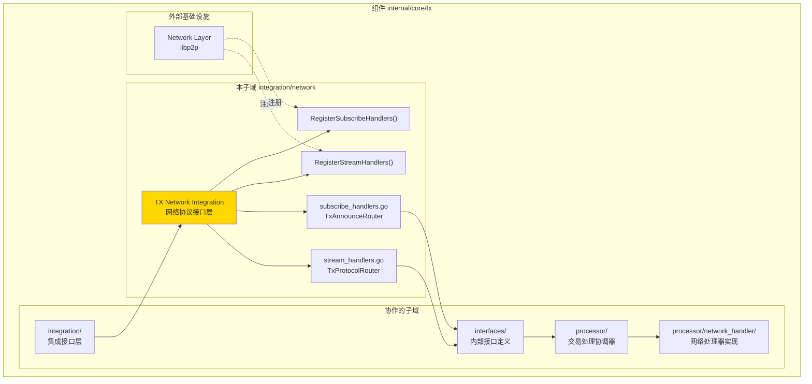
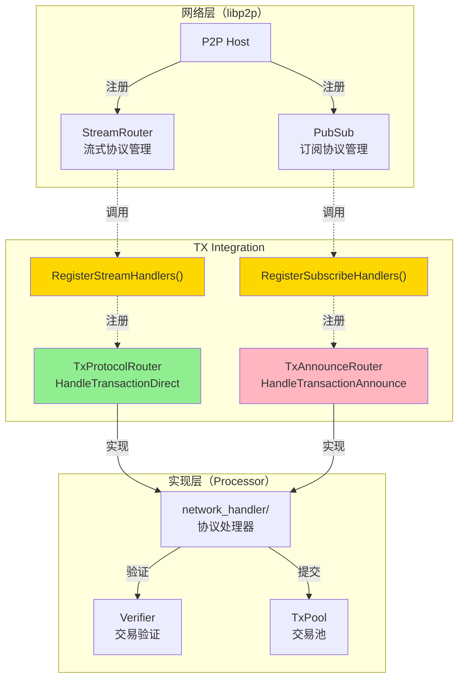
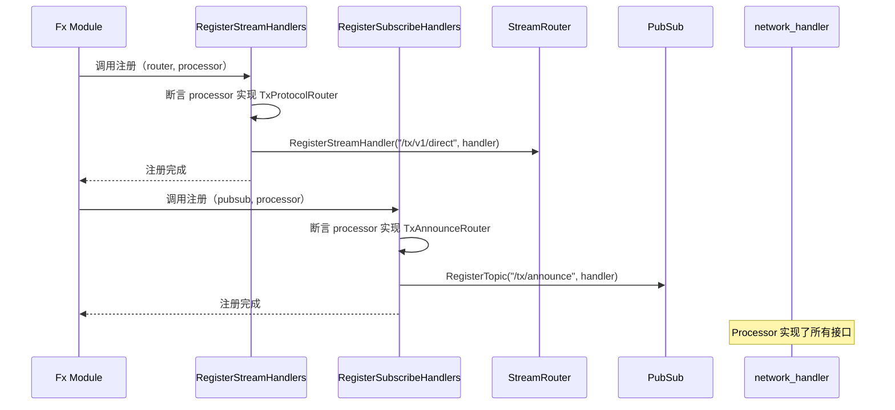
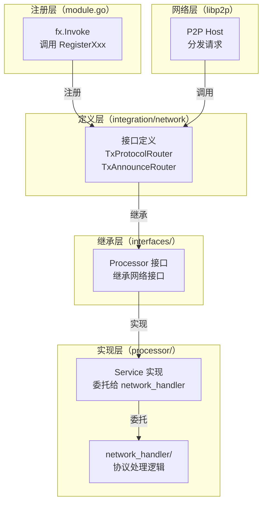

# TX Network Integration（internal/core/tx/integration/network）

---

## 📌 版本信息

- **版本**：1.0
- **状态**：stable
- **最后更新**：2025-11-30
- **最后审核**：2025-11-30
- **所有者**：TX模块团队
- **适用范围**：internal/core/tx/integration/network 模块

---

## 🎯 **子域定位**

**路径**：`internal/core/tx/integration/network/`

**所属组件**：`tx`

**核心职责**：定义 TX 模块与 P2P 网络的集成接口，定义网络协议处理接口。

**在组件中的角色**：
- 定义流式协议接口（TxProtocolRouter，点对点直连）
- 定义订阅协议接口（TxAnnounceRouter，广播模式）
- 提供统一的注册函数（RegisterStreamHandlers、RegisterSubscribeHandlers）
- 作为 TX 模块与网络层的桥接

**解决什么问题**：
- 定义流式协议接口（TxProtocolRouter，点对点直连）
- 定义订阅协议接口（TxAnnounceRouter，广播模式）
- 提供统一的注册函数（RegisterStreamHandlers、RegisterSubscribeHandlers）
- 作为 TX 模块与网络层的桥接

**不解决什么问题**（边界）：
- 不实现协议处理逻辑（由 processor/network_handler 实现）
- 不定义网络传输协议（由 libp2p 定义）
- 不管理连接池（由 network 模块管理）
- 不做协议序列化（由 pb/network/protocol 定义）

---

## 🎯 **设计原则与核心约束**

### **设计原则**

| 原则 | 说明 | 价值 | 实现策略 |
|------|------|------|---------|
| **协议分离** | Stream（直连）和Subscribe（广播）分开 | 灵活性 | 两个独立接口 |
| **请求响应** | Stream 协议支持双向通信 | 可靠性 | HandleXxx 返回 []byte |
| **单向广播** | Subscribe 协议无响应 | 性能 | HandleXxx 返回 error |
| **标准化参数** | 统一使用 context.Context, peer.ID, []byte | 一致性 | 与 libp2p 对齐 |
| **错误处理** | 明确的错误返回 | 可调试性 | 返回 error，不 panic |

### **核心约束** ⭐

**严格遵守**：
- ✅ 只定义接口，不提供实现
- ✅ Stream 协议必须返回响应（[]byte）
- ✅ Subscribe 协议不返回响应（error only）
- ✅ 注册函数负责协议路径注册
- ✅ 协议路径遵循规范：`/tx/v1/direct`、`/tx/announce`

**严格禁止**：
- ❌ 在接口中定义业务逻辑
- ❌ 混合 Stream 和 Subscribe 协议
- ❌ 直接依赖 processor/ 或其他实现模块
- ❌ 在接口方法中阻塞（应异步处理）

---

## 🏗️ **架构设计**

### **在组件中的位置**

> **说明**：展示此子域在组件内部的位置和协作关系



**位置说明**：

| 关系类型 | 目标 | 关系说明 |
|---------|------|---------|
| **协作** | integration/ | network 是 integration 的子目录 |
| **协作** | interfaces/ | interfaces/Processor 继承 TxProtocolRouter 和 TxAnnounceRouter |
| **协作** | processor/ | processor 实现网络协议接口 |
| **边界** | Network Layer | 定义网络协议接口，供 Network Layer 注册 |

### **整体架构**



### **协议类型对比**

```mermaid
graph LR
    subgraph "Stream 协议（点对点）"
        STREAM_PEER["发送节点"]
        STREAM_HANDLER["TxProtocolRouter"]
        STREAM_RESP["响应数据"]
        
        STREAM_PEER -->|发送 SignedTx| STREAM_HANDLER
        STREAM_HANDLER -->|返回 Result| STREAM_RESP
        STREAM_RESP -->|回传| STREAM_PEER
    end
    
    subgraph "Subscribe 协议（广播）"
        SUB_PEER["发送节点"]
        SUB_HANDLER["TxAnnounceRouter"]
        
        SUB_PEER -->|广播 TxHash| SUB_HANDLER
        note right of SUB_HANDLER: 无响应
    end
    
    style STREAM_HANDLER fill:#90EE90
    style SUB_HANDLER fill:#FFB6C1
```

### **注册流程**



---

## 📊 **核心机制**

### **机制1：Stream 协议（点对点直连）**

**为什么需要**：支持节点间直接发送交易并获取响应

**协议特点**：
- 双向通信：发送方等待响应
- 可靠性高：网络错误可重试
- 同步模式：阻塞等待结果
- 典型场景：CLI 直接提交交易、节点间转发

**接口定义**：

```go
// stream_handlers.go
type TxProtocolRouter interface {
    // HandleTransactionDirect 处理直连交易请求
    //
    // 参数:
    //   - ctx: 请求上下文（超时控制）
    //   - from: 发送方 peer ID
    //   - reqBytes: 请求数据（protobuf 序列化的 SignedTx）
    //
    // 返回:
    //   - []byte: 响应数据（protobuf 序列化的 Result）
    //   - error: 处理错误
    //
    // 典型流程:
    //   1. 解析 reqBytes -> SignedTx
    //   2. 验证交易（Verifier）
    //   3. 提交到池（TxPool）
    //   4. 序列化响应 -> []byte
    HandleTransactionDirect(ctx context.Context, from peer.ID, reqBytes []byte) ([]byte, error)
}
```

**协议路径**：`/tx/v1/direct`

**请求格式**（pb/network/protocol）：

```proto
// TransactionRequest 交易请求
message TransactionRequest {
    bytes signed_tx = 1;      // 签名后的交易
    uint64 timestamp = 2;     // 请求时间戳
    string request_id = 3;    // 请求唯一ID
}
```

**响应格式**：

```proto
// TransactionResponse 交易响应
message TransactionResponse {
    bool success = 1;         // 是否成功
    bytes tx_hash = 2;        // 交易哈希
    string error_message = 3; // 错误信息
}
```

### **机制2：Subscribe 协议（广播模式）**

**为什么需要**：支持节点间交易哈希的高效广播

**协议特点**：
- 单向广播：无响应
- 高吞吐：适合大量交易
- 异步模式：不阻塞发送方
- 典型场景：节点间交易通告、Gossip 协议

**接口定义**：

```go
// subscribe_handlers.go
type TxAnnounceRouter interface {
    // HandleTransactionAnnounce 处理交易广播
    //
    // 参数:
    //   - ctx: 请求上下文
    //   - from: 发送方 peer ID
    //   - topic: 订阅主题（如 "/tx/announce"）
    //   - data: 广播数据（protobuf 序列化的 TxAnnounce）
    //
    // 返回:
    //   - error: 处理错误（不返回响应）
    //
    // 典型流程:
    //   1. 解析 data -> TxAnnounce
    //   2. 检查本地是否已有（去重）
    //   3. 如无，向发送方请求完整交易（Stream 协议）
    HandleTransactionAnnounce(ctx context.Context, from peer.ID, topic string, data []byte) error
}
```

**协议路径**：`/tx/announce`

**消息格式**：

```proto
// TxAnnounce 交易通告
message TxAnnounce {
    repeated bytes tx_hashes = 1; // 交易哈希列表（批量）
    uint64 timestamp = 2;          // 广播时间戳
}
```

### **机制3：统一注册函数**

**为什么需要**：避免模块间耦合，提供统一注册入口

**Stream 注册**：

```go
// stream_handlers.go
func RegisterStreamHandlers(
    router network.StreamRouter,
    handler TxProtocolRouter,
    logger log.Logger,
) error {
    if handler == nil {
        return errors.New("TxProtocolRouter 不能为空")
    }
    
    // 注册流式协议
    router.RegisterStreamHandler("/tx/v1/direct", func(ctx context.Context, from peer.ID, data []byte) ([]byte, error) {
        return handler.HandleTransactionDirect(ctx, from, data)
    })
    
    logger.Infof("✅ 已注册 TX 流式协议: /tx/v1/direct")
    return nil
}
```

**Subscribe 注册**：

```go
// subscribe_handlers.go
func RegisterSubscribeHandlers(
    pubsub network.PubSub,
    handler TxAnnounceRouter,
    logger log.Logger,
) error {
    if handler == nil {
        return errors.New("TxAnnounceRouter 不能为空")
    }
    
    // 注册订阅协议
    pubsub.RegisterTopic("/tx/announce", func(ctx context.Context, from peer.ID, topic string, data []byte) error {
        return handler.HandleTransactionAnnounce(ctx, from, topic, data)
    })
    
    logger.Infof("✅ 已订阅 TX 广播协议: /tx/announce")
    return nil
}
```

---

## 📁 **目录结构**

```
internal/core/tx/integration/network/
├── stream_handlers.go         # TxProtocolRouter 接口 | RegisterStreamHandlers
├── subscribe_handlers.go      # TxAnnounceRouter 接口 | RegisterSubscribeHandlers
└── README.md                  # 本文档
```

### **文件职责**

| 文件 | 核心职责 | 关键接口 | 为什么独立 |
|------|---------|---------|----------|
| **stream_handlers.go** | 定义流式协议接口 | TxProtocolRouter, RegisterStreamHandlers | Stream 和 Subscribe 分离 |
| **subscribe_handlers.go** | 定义订阅协议接口 | TxAnnounceRouter, RegisterSubscribeHandlers | Subscribe 和 Stream 分离 |

---

## 🔗 **依赖与协作**

### **依赖关系**

| 依赖模块 | 依赖接口/类型 | 用途 | 约束条件 |
|---------|--------------|------|---------|
| `libp2p` | peer.ID, context.Context | 网络协议参数 | 标准 libp2p 接口 |
| `pb/network/protocol` | TransactionRequest, TxAnnounce | 协议数据结构 | Protobuf 序列化 |
| `pkg/interfaces/infrastructure/network` | StreamRouter, PubSub | 网络路由接口 | 标准网络接口 |
| `pkg/interfaces/infrastructure/log` | Logger | 日志记录 | 注册函数记录日志 |

### **协作流程**



---

## 🎓 **使用指南**

### **场景1：在 interfaces/ 中继承**

```go
// internal/core/tx/interfaces/processor.go
package interfaces

import (
    txnet "github.com/weisyn/v1/internal/core/tx/integration/network"
)

type Processor interface {
    // 继承网络协议接口
    txnet.TxProtocolRouter
    txnet.TxAnnounceRouter
    
    // 业务接口
    // ...
}
```

### **场景2：在 module.go 中注册**

```go
// internal/core/tx/module.go
func Module() fx.Option {
    return fx.Module("tx",
        fx.Provide(
            processor.NewService,
        ),
        
        fx.Invoke(func(
            router network.StreamRouter,
            pubsub network.PubSub,
            processor interfaces.Processor,
            logger log.Logger,
        ) {
            // 注册流式协议
            if err := txnet.RegisterStreamHandlers(router, processor, logger); err != nil {
                logger.Errorf("注册 TX 流式协议失败: %v", err)
            }
            
            // 注册订阅协议
            if err := txnet.RegisterSubscribeHandlers(pubsub, processor, logger); err != nil {
                logger.Errorf("注册 TX 订阅协议失败: %v", err)
            }
        }),
    )
}
```

### **场景3：实现协议处理器**

```go
// processor/network_handler/handler.go
type NetworkHandler struct {
    txPool    mempool.TxPool
    verifier  interfaces.Verifier
    logger    log.Logger
}

func (h *NetworkHandler) HandleTransactionDirect(ctx context.Context, from peer.ID, reqBytes []byte) ([]byte, error) {
    // 1. 解析请求
    var req txProtocol.TransactionRequest
    if err := proto.Unmarshal(reqBytes, &req); err != nil {
        return nil, fmt.Errorf("解析请求失败: %w", err)
    }
    
    // 2. 验证交易
    if err := h.verifier.Verify(ctx, req.SignedTx); err != nil {
        return h.buildErrorResponse(err)
    }
    
    // 3. 提交到池
    txHash, err := h.txPool.Submit(ctx, req.SignedTx)
    if err != nil {
        return h.buildErrorResponse(err)
    }
    
    // 4. 返回响应
    resp := &txProtocol.TransactionResponse{
        Success: true,
        TxHash:  txHash,
    }
    
    return proto.Marshal(resp)
}

func (h *NetworkHandler) HandleTransactionAnnounce(ctx context.Context, from peer.ID, topic string, data []byte) error {
    // 1. 解析广播
    var announce txProtocol.TxAnnounce
    if err := proto.Unmarshal(data, &announce); err != nil {
        return fmt.Errorf("解析广播失败: %w", err)
    }
    
    // 2. 去重检查
    for _, txHash := range announce.TxHashes {
        if !h.txPool.Has(txHash) {
            // 3. 请求完整交易（通过 Stream 协议）
            h.requestFullTx(ctx, from, txHash)
        }
    }
    
    return nil
}
```

---

## ⚠️ **已知限制**

| 限制 | 影响 | 规避方法 | 未来计划 |
|------|------|---------|---------|
| Stream 协议同步阻塞 | 高延迟场景性能差 | 设置合理的 context 超时 | 考虑异步响应 |
| Subscribe 无响应 | 无法确认接收 | 通过事件日志监控 | 暂不支持 |
| 协议路径固定 | 无法版本演进 | 使用 /tx/v1/direct | 支持多版本 |
| 无协议加密 | 依赖 libp2p 加密 | 确保 libp2p 启用 TLS | 暂不独立加密 |

---

## 🔍 **设计权衡记录**

### **权衡1：Stream vs Subscribe**

**背景**：如何设计交易网络传播协议

**备选方案**：
1. **仅 Stream**：所有交易都直连 - 优势：可靠 - 劣势：性能差
2. **仅 Subscribe**：所有交易都广播 - 优势：高效 - 劣势：无响应
3. **混合模式**：Stream + Subscribe - 优势：兼顾可靠性和性能 - 劣势：复杂度增加

**选择**：混合模式

**理由**：
- Stream 用于直接提交（CLI、API），需要响应
- Subscribe 用于节点间广播，提高吞吐
- 两者互补，覆盖不同场景

**代价**：需要维护两套协议

### **权衡2：同步 vs 异步响应**

**背景**：Stream 协议是否应该同步等待响应

**备选方案**：
1. **同步模式**：阻塞等待响应 - 优势：简单 - 劣势：延迟高
2. **异步模式**：返回 JobID，稍后查询 - 优势：非阻塞 - 劣势：复杂

**选择**：同步模式

**理由**：
- CLI 场景需要立即反馈
- libp2p Stream 本身就是同步的
- 通过 context 超时控制延迟

**代价**：高延迟场景性能差，需设置合理超时

### **权衡3：批量 vs 单笔通告**

**背景**：Subscribe 协议是否支持批量

**备选方案**：
1. **单笔**：一次一个 TxHash - 优势：简单 - 劣势：频繁广播
2. **批量**：一次多个 TxHash - 优势：高效 - 劣势：延迟增加

**选择**：批量

**理由**：
- 大量交易场景（如打包时），批量广播更高效
- 减少网络开销
- 接收方可并行处理

**代价**：需要攒批逻辑，可能增加延迟

---

## 📚 **相关文档**

- **协议数据结构**：[pb/network/protocol/transaction.proto](../../../../pb/network/protocol/transaction.proto) - Protobuf 定义
- **实现模块**：[processor/network_handler/README.md](../../processor/network_handler/README.md) - 协议处理器实现
- **参考架构**：[consensus/integration/network/README.md](../../../consensus/integration/network/README.md) - Consensus 模块的类似设计

---

## 📋 **文档变更记录**

| 日期 | 变更内容 | 原因 |
|------|---------|------|
| 2025-11-30 | 添加版本信息章节 | 符合文档规范 |
| 2025-11-30 | 添加"在组件中的位置"图 | 符合 subdirectory-readme.md 模板要求 |
| 2025-11-30 | 调整章节标题和顺序 | 符合模板规范 |
| 2025-11-30 | 统一日期格式 | 符合文档规范 |
| 2025-10-23 | 创建完整网络协议接口文档 | 提供网络协议设计说明 |
| 2025-10-23 | 补齐协议对比和注册流程 | 完善设计细节 |

---

> 📝 **实现指导**
>
> 本文档定义了 TX 模块的网络协议接口，包括：
> 1. **Stream 协议**：TxProtocolRouter，点对点直连，有响应
> 2. **Subscribe 协议**：TxAnnounceRouter，广播模式，无响应
> 3. **统一注册函数**：RegisterStreamHandlers、RegisterSubscribeHandlers
> 4. **协议路径规范**：`/tx/v1/direct`、`/tx/announce`
> 5. **混合模式**：兼顾可靠性（Stream）和性能（Subscribe）
>
> 实现时严格区分两种协议的使用场景，确保协议处理的非阻塞性。
