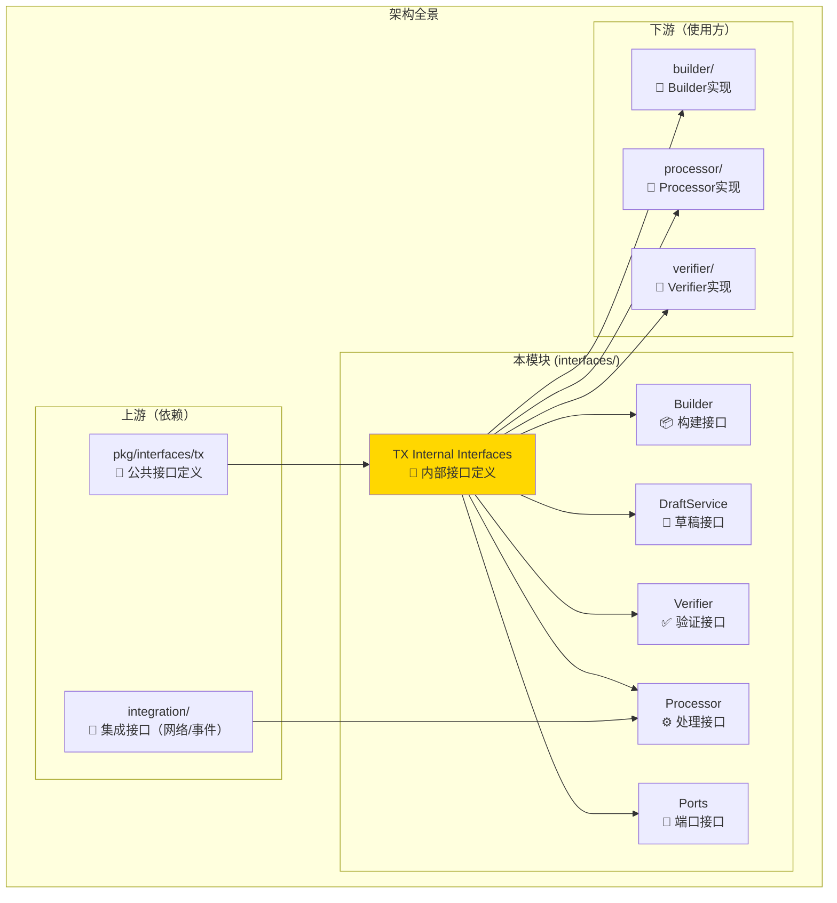
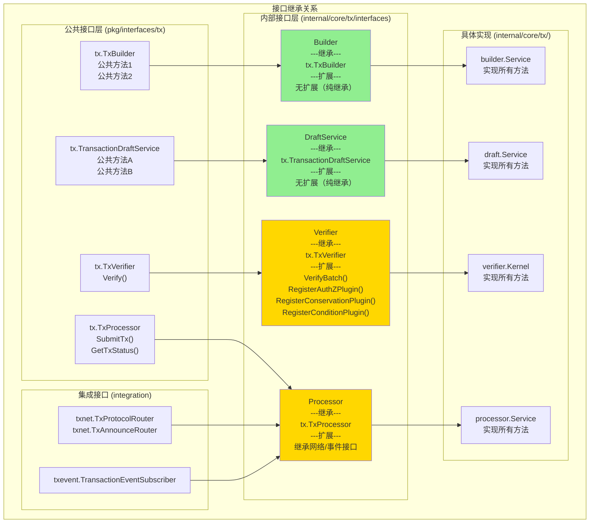
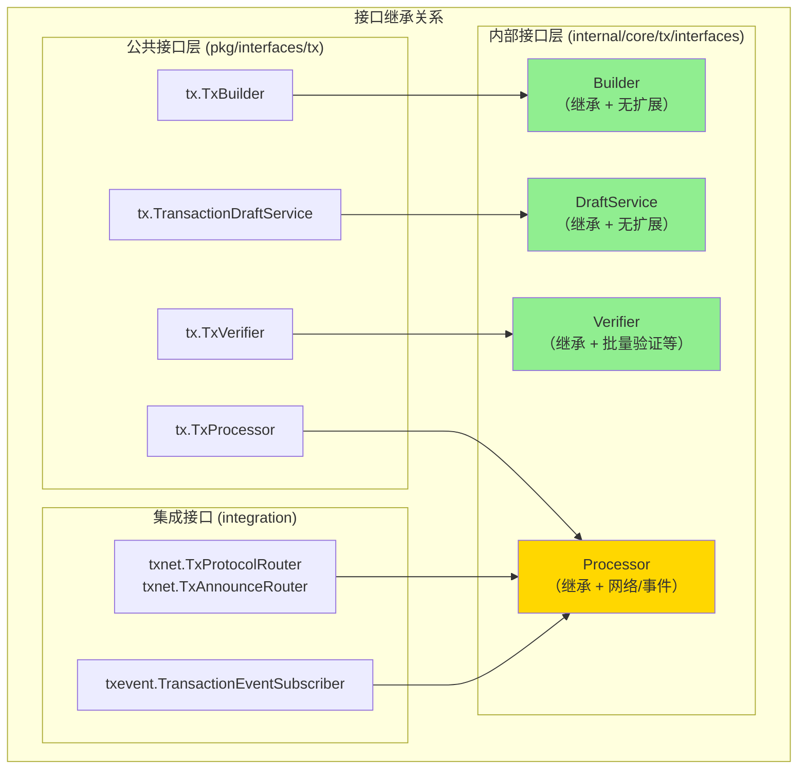

# TX Internal Interfaces（internal/core/tx/interfaces）

---

## 📌 版本信息

- **版本**：1.0
- **状态**：stable
- **最后更新**：2025-11-30
- **最后审核**：2025-11-30
- **所有者**：TX模块团队
- **适用范围**：internal/core/tx/interfaces 模块

---

## 🎯 **接口定位**

**路径**：`internal/core/tx/interfaces/`

**目的**：继承公共接口，扩展组件内部运行所需的方法，作为具体实现与公共接口的桥梁。

**核心原则**：
- ✅ 必须继承（嵌入）对应的公共接口
- ✅ 只添加必要的内部方法
- ✅ 内部方法通常为小写（包内可见）
- ✅ 作为实现层实现的接口类型

**关键约束** ⭐：
- ✅ **强制继承**：内部接口必须嵌入对应的公共接口
- ✅ **节制扩展**：只添加必要的内部方法，避免过度扩展
- ❌ **禁止跳过**：具体实现不得直接实现公共接口，必须实现内部接口

本模块是WES系统中**交易处理域**的**内部接口层**，为TX模块内部组件提供统一的接口定义。

**解决什么问题**：
- 统一TX域内部组件之间的协作接口
- 继承公共接口并扩展内部专用方法
- 避免内部实现直接依赖具体实现，保持松耦合

**不解决什么问题**（边界）：
- 不定义对外公共接口（由 `pkg/interfaces/tx` 定义）
- 不包含任何实现逻辑（由各子模块实现）
- 不定义数据结构（由 `pkg/types` 定义）

---

## 🎯 **设计原则与核心约束**

### **设计原则**

| 原则 | 说明 | 价值 |
|------|------|------|
| **继承优先** | 优先继承公共接口，避免重复定义 | 确保与公共接口一致，降低维护成本 |
| **最小扩展** | 只在确有内部需求时扩展方法 | 避免接口膨胀，保持简洁 |
| **职责单一** | 每个接口只负责一个核心能力 | 提高可测试性和可替换性 |

### **核心约束** ⭐

**严格遵守**：
- ✅ 所有内部接口必须继承对应的公共接口：确保对外能力统一
- ✅ 扩展方法必须是内部专用：不能包含对外暴露的能力
- ✅ 接口定义必须注释完整：说明职责、继承关系、实现目录

**严格禁止**：
- ❌ 在接口中定义数据结构：数据结构统一在 `pkg/types` 定义
- ❌ 在接口中包含实现逻辑：接口只定义契约，不包含实现
- ❌ 接口之间循环依赖：保持单向依赖关系

---

## 🏗️ **架构设计**

### **整体架构**



### **接口层次（继承关系）**

> **说明**：展示每个内部接口如何继承公共接口、扩展了哪些方法



**继承类型说明**：
- 🟢 **纯继承**（如 Builder、DraftService）：只嵌入公共接口，不添加任何方法
  - 适用场景：实现简单，无需内部协作
- 🟡 **继承+扩展**（如 Verifier、Processor）：嵌入公共接口 + 添加内部方法
  - 适用场景：需要组件内部模块间协作

### **接口层次**



## 🔗 **与公共接口的继承关系**

### **公共接口**

**路径**：`pkg/interfaces/tx/`

**接口列表**：
- `tx.TxBuilder` - 交易构建器接口
- `tx.TransactionDraftService` - 交易草稿服务接口
- `tx.TxVerifier` - 交易验证器接口
- `tx.TxProcessor` - 交易处理器接口

### **继承方式**

**强制约束**：内部接口必须嵌入对应的公共接口

```go
// 示例1：纯继承（Builder、DraftService）
type Builder interface {
    tx.TxBuilder  // 嵌入公共接口
    // 无扩展方法
}

// 示例2：继承+扩展（Verifier）
type Verifier interface {
    tx.TxVerifier  // 嵌入公共接口
    
    // 扩展内部方法
    VerifyBatch(ctx context.Context, txs []*transaction.Transaction) ([]*VerificationResult, error)
    RegisterAuthZPlugin(plugin AuthZPlugin)
    RegisterConservationPlugin(plugin ConservationPlugin)
    RegisterConditionPlugin(plugin ConditionPlugin)
}

// 示例3：继承+集成接口（Processor）
type Processor interface {
    tx.TxProcessor  // 嵌入公共接口
    
    // 继承集成接口
    txnet.TxProtocolRouter
    txnet.TxAnnounceRouter
    txevent.TransactionEventSubscriber
}
```

**继承关系表**：

| 内部接口 | 继承的公共接口 | 继承的集成接口 | 扩展的内部方法 | 继承类型 |
|---------|--------------|--------------|--------------|---------|
| **Builder** | `tx.TxBuilder` | 无 | 无 | 🟢 纯继承 |
| **DraftService** | `tx.TransactionDraftService` | 无 | 无 | 🟢 纯继承 |
| **Verifier** | `tx.TxVerifier` | 无 | `VerifyBatch`, `Register*Plugin` | 🟡 继承+扩展 |
| **Processor** | `tx.TxProcessor` | `TxProtocolRouter`, `TxAnnounceRouter`, `TransactionEventSubscriber` | 无 | 🟡 继承+集成 |

---

## 🔌 **接口设计**

### **接口全景**

| 接口 | 继承自 | 扩展方法 | 实现位置 |
|------|--------|---------|---------|
| **Builder** | `tx.TxBuilder` | 无 | `builder/` |
| **DraftService** | `tx.TransactionDraftService` | 无 | `draft/` |
| **Verifier** | `tx.TxVerifier` | `VerifyBatch`, `Register*Plugin` | `verifier/` |
| **Processor** | `tx.TxProcessor` + 网络/事件接口 | 无 | `processor/` |
| **Ports** | 独立定义 | - | `ports/` |

### **接口说明**

#### 1. **Builder 接口**

**核心职责**: 交易构建（纯装配器）

**设计考虑**:
- 纯继承公共接口，无内部扩展
- Type-state 模式保证构建顺序
- 不做 UTXO 选择、费用估算等业务逻辑

**约束**:
- 必须使用 Type-state 进行类型安全的构建
- 不能跳过任何状态（Compose → Prove → Sign → Submit）

#### 2. **DraftService 接口**

**核心职责**: 交易草稿管理（渐进式构建）

**设计考虑**:
- 纯继承公共接口，无内部扩展
- 支持 ISPC 场景（合约执行中逐步添加输出）
- `Draft.Seal()` 后转换为 ComposedTx

**约束**:
- Draft 是可变的，Sealed 后不可再修改
- 必须通过 Seal 进入正式 Type-state 状态机

#### 3. **Verifier 接口**

**核心职责**: 三阶段验证 + 插件管理

**设计考虑**:
- 继承公共接口的 `Verify` 方法
- 扩展 `VerifyBatch` 支持批量验证
- 扩展插件注册方法（`RegisterAuthZPlugin` 等）
- 微内核 + 插件架构

**约束**:
- 验证无副作用（不修改交易、不消费 UTXO）
- 插件无状态（不存储验证结果）
- 验证顺序：AuthZ → Conservation → Condition

#### 4. **Processor 接口**

**核心职责**: 交易处理协调器 + 网络/事件集成

**设计考虑**:
- 继承 `tx.TxProcessor`（SubmitTx, GetTxStatus）
- 继承网络协议接口（HandleTransactionDirect, HandleTransactionAnnounce）
- 继承事件订阅接口（HandleTransaction* 事件）
- 作为对外统一入口

**约束**:
- 必须先验证后提交（不允许跳过验证）
- 验证失败不入池
- 网络处理只负责接收，不负责主动广播

#### 5. **Ports 接口**

**核心职责**: 端口适配器接口定义

**设计考虑**:
- 定义 Signer、FeeEstimator、ProofProvider、DraftStore 等端口
- 支持多种实现（Local、KMS、HSM 等）
- 遵循 Hexagonal Architecture

**约束**:
- 端口接口必须独立于具体实现
- 支持依赖注入和替换

---

## 📁 **目录结构**

```
internal/core/tx/interfaces/
├── builder.go           # Builder 接口定义 | 纯继承，无扩展
├── draft.go             # DraftService 接口定义 | 纯继承，无扩展
├── verifier.go          # Verifier 接口定义 | 继承 + 批量验证扩展
├── processor.go         # Processor 接口定义 | 继承 + 网络/事件扩展
├── ports.go             # Ports 接口定义 | 端口适配器
└── README.md            # 本文档
```

### **组织原则**

| 文件 | 职责 | 为什么这样组织 |
|------|------|---------------|
| **builder.go** | 构建器接口 | 独立文件，便于维护和查找 |
| **draft.go** | 草稿服务接口 | 独立文件，与 Builder 分离 |
| **verifier.go** | 验证器接口 | 独立文件，包含插件注册方法 |
| **processor.go** | 处理器接口 | 独立文件，聚合多个能力 |
| **ports.go** | 端口接口 | 独立文件，定义所有端口接口 |

---

## 🎓 **使用指南**

### **典型场景**

**场景1：实现组件依赖接口**


**关键点**：
- 实现模块通过 `var _ interfaces.Builder = (*Service)(nil)` 确保实现完整
- 通过依赖注入获取其他接口实例
- 不直接依赖具体实现

**场景2：fx 模块注册**

```go
fx.Provide(
    fx.Annotate(
        builder.NewService,
        fx.As(new(interfaces.Builder)),  // 绑定内部接口
        fx.As(new(tx.TxBuilder)),        // 绑定公共接口
    ),
)
```

**关键点**：
- 同时绑定内部接口和公共接口
- 内部使用 `interfaces.Builder`
- 对外暴露 `tx.TxBuilder`

### **常见误用**

| 误用方式 | 为什么错误 | 正确做法 |
|---------|-----------|---------|
| 在接口中定义结构体 | 违反接口定义原则 | 结构体统一在 `pkg/types` 定义 |
| 接口包含实现逻辑 | 接口只定义契约 | 实现逻辑放在对应实现模块 |
| 直接使用具体实现类型 | 破坏依赖倒置 | 使用接口类型，通过依赖注入获取 |

---

## 🔗 **依赖与协作**

### **依赖关系**

| 依赖模块 | 依赖接口 | 用途 | 约束条件 |
|---------|---------|------|---------|
| `pkg/interfaces/tx` | TxBuilder, TxProcessor 等 | 继承公共接口 | 必须保持一致 |
| `integration/network` | TxProtocolRouter, TxAnnounceRouter | Processor 网络能力 | 只在 Processor 使用 |
| `integration/event` | TransactionEventSubscriber | Processor 事件能力 | 只在 Processor 使用 |

### **被依赖关系**

| 使用方 | 用途 | 使用接口 |
|-------|------|---------|
| `builder/` | 实现构建器 | Builder |
| `draft/` | 实现草稿服务 | DraftService |
| `verifier/` | 实现验证器 | Verifier |
| `processor/` | 实现处理器 | Processor |
| `ports/` | 实现端口适配器 | Ports 相关接口 |

---

## 🔍 **设计权衡记录**

### **权衡1：是否在内部接口中扩展方法**

**背景**：公共接口已定义核心能力，内部是否需要扩展方法？

**备选方案**：
1. 完全继承，无扩展 - 优势：简单 - 劣势：缺乏内部专用能力
2. 适度扩展 - 优势：灵活 - 劣势：需要维护额外方法

**选择**：适度扩展（仅 Verifier 和 Processor）

**理由**：
- Builder 和 Draft 纯继承即可满足需求
- Verifier 需要批量验证和插件注册（内部专用）
- Processor 需要继承网络和事件接口（架构要求）

**代价**：需要维护扩展方法的文档和实现

### **权衡2：Processor 是否继承网络/事件接口**

**背景**：Processor 需要处理网络消息和事件订阅

**备选方案**：
1. 独立定义 NetworkHandler 和 EventHandler - 优势：职责分离 - 劣势：增加接口数量
2. 继承到 Processor - 优势：统一入口 - 劣势：接口方法较多

**选择**：继承到 Processor

**理由**：
- 参考 `consensus` 和 `blockchain` 模块的成熟模式
- Processor 本身就是协调器，统一入口更清晰
- 实现可以委托给子模块（network_handler, event_handler）

**代价**：Processor 接口方法较多，但实现清晰

---

## 📚 **相关文档**

- **架构设计**：[TX_STATE_MACHINE_ARCHITECTURE.md](../../_docs/architecture/TX_STATE_MACHINE_ARCHITECTURE.md) - TX模块整体架构
- **公共接口**：`pkg/interfaces/tx/` - 对外公共接口定义
- **实现模块**：`internal/core/tx/*/README.md` - 各实现模块文档

---

## 📋 **文档变更记录**

| 日期 | 变更内容 | 原因 |
|------|---------|------|
| 2025-11-30 | 添加版本信息章节 | 符合文档规范 |
| 2025-11-30 | 添加"与公共接口的继承关系"章节 | 符合 internal-interface-readme.md 模板要求 |
| 2025-11-30 | 优化接口层次图 | 更清晰地展示继承关系 |
| 2025-11-30 | 统一日期格式 | 符合文档规范 |
| 2025-10-23 | 初始版本 | 完成接口层文档 |
| 2025-10-23 | 补充 Processor 网络/事件集成 | 完成重构，继承网络和事件接口 |

---

> 📝 **文档说明**
>
> 本文档聚焦于接口定义的**职责**、**继承关系**、**设计考虑**和**约束条件**，
> 而非接口方法的详细签名（详见各接口文件的注释）。

