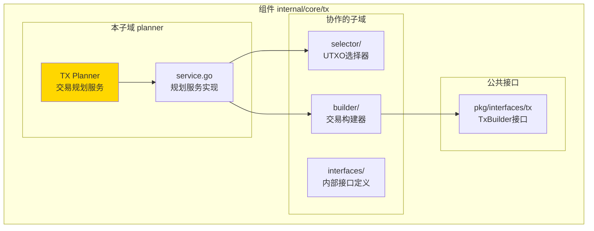
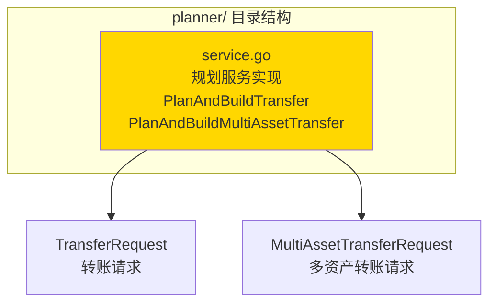
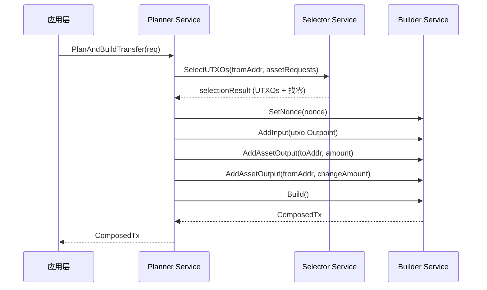

# TX Planner（internal/core/tx/planner）

---

## 📌 版本信息

- **版本**：1.0
- **状态**：stable
- **最后更新**：2025-11-30
- **最后审核**：2025-11-30
- **所有者**：TX模块团队
- **适用范围**：internal/core/tx/planner 模块

---

## 🎯 **子域定位**

**路径**：`internal/core/tx/planner/`

**所属组件**：`tx`

**核心职责**：提供交易规划服务，协调 UTXO 选择器和交易构建器，实现业务需求到交易构建的自动化流程。

**在组件中的角色**：
- 根据业务需求（如转账），自动选择 UTXO
- 生成找零输出
- 调用 Builder 构建 ComposedTx
- 保持 Builder 纯装配特性（Builder 不做业务逻辑）

---

## 🏗️ **架构设计**

### **在组件中的位置**

> **说明**：展示此子域在组件内部的位置和协作关系



**位置说明**：

| 关系类型 | 目标 | 关系说明 |
|---------|------|---------|
| **协作** | selector/ | 使用 Selector 选择 UTXO |
| **协作** | builder/ | 调用 Builder 构建交易 |
| **依赖** | pkg/interfaces/tx | 使用 TxBuilder 公共接口 |

### **内部组织**

> **说明**：展示此子域内部的文件组织和类型关系



---

## 📁 **目录结构**

```
internal/core/tx/planner/
├── README.md                    # 本文档
└── service.go                   # 规划服务实现
```

### **文件职责**

| 文件 | 核心职责 | 关键类型/函数 |
|------|---------|-------------|
| **service.go** | 交易规划服务实现 | `Service`, `PlanAndBuildTransfer`, `PlanAndBuildMultiAssetTransfer` |

---

## 🔗 **依赖与协作**

### **依赖关系**

| 依赖模块 | 依赖接口/类型 | 用途 | 约束条件 |
|---------|--------------|------|---------|
| `internal/core/tx/selector` | `selector.Service` | UTXO 选择 | 必须提供 |
| `pkg/interfaces/tx` | `tx.TxBuilder` | 交易构建 | 必须提供 |
| `pkg/interfaces/infrastructure/log` | `log.Logger` | 日志记录 | 可选 |

### **协作流程**



---

## 📊 **核心机制**

### **机制1：UTXO 选择与找零计算**

**为什么需要**：业务层只需要指定转账金额和目标地址，不需要手动选择 UTXO

**核心思路**：
1. 将业务需求转换为 `AssetRequest`
2. 调用 Selector 选择 UTXO
3. 计算找零金额
4. 自动生成找零输出

**实现策略**：

```go
// 1. 构建资产请求
assetRequests := []*selector.AssetRequest{
    {
        TokenID:         tokenID,
        Amount:          req.Amount,
        ContractAddress: req.ContractAddress,
        ClassID:         req.ClassID,
    },
}

// 2. 选择 UTXO
selectionResult, err := s.selector.SelectUTXOs(ctx, req.FromAddress, assetRequests)

// 3. 添加找零输出
if changeAmount, ok := selectionResult.ChangeAmounts[tokenID]; ok {
    s.builder.AddAssetOutput(req.FromAddress, changeAmount, ...)
}
```

### **机制2：多资产转账支持**

**为什么需要**：支持一次交易中转账多种资产

**核心思路**：
1. 按资产类型分组输出
2. 为每种资产选择 UTXO
3. 为每种资产生成找零输出

**实现策略**：

```go
// 按资产分组
assetRequests := make(map[string]*selector.AssetRequest)
for _, output := range req.Outputs {
    tokenID := getTokenID(output)
    // 累加同一资产的需求
    assetRequests[tokenID] = ...
}

// 为每种资产生成找零
for tokenID, changeAmount := range selectionResult.ChangeAmounts {
    s.builder.AddAssetOutput(req.FromAddress, changeAmount, ...)
}
```

---

## 🎓 **使用指南**

### **场景1：单资产转账**

```go
planner := planner.NewService(selector, builder, logger)

req := &planner.TransferRequest{
    FromAddress:        fromAddr,
    ToAddress:          toAddr,
    Amount:             "1000000",
    LockingCondition:   singleKeyLock,
    Nonce:              1,
}

composedTx, err := planner.PlanAndBuildTransfer(ctx, req)
if err != nil {
    return err
}

// 继续 Type-state 流程
provenTx := composedTx.WithProofs(...)
```

### **场景2：多资产转账**

```go
req := &planner.MultiAssetTransferRequest{
    FromAddress: fromAddr,
    Outputs: []*planner.TransferOutput{
        {ToAddress: addr1, Amount: "100", ContractAddress: contractAddr},
        {ToAddress: addr2, Amount: "200", ContractAddress: contractAddr},
    },
    DefaultLockingCondition: singleKeyLock,
    Nonce: 1,
}

composedTx, err := planner.PlanAndBuildMultiAssetTransfer(ctx, req)
```

---

## ⚠️ **已知限制**

| 限制 | 影响 | 规避方法 | 未来计划 |
|------|------|---------|---------|
| 不支持复杂锁定条件 | 功能受限 | 手动构建 | 扩展 TransferRequest |

**已修复的问题**：

- ✅ **多资产金额累加**：已使用 `big.Int` 进行精确累加（2025-11-30）
- ✅ **数组越界风险**：已添加 `safeSlicePrefix` 函数进行安全检查（2025-11-30）
- ✅ **空指针检查**：已添加空指针检查，避免 panic（2025-11-30）

---

## 🔍 **设计权衡记录**

### **权衡1：Planner vs Builder 职责划分**

**背景**：业务逻辑应该放在哪里？

**备选方案**：
1. **Planner 处理业务逻辑**：优势：Builder 保持纯装配 - 劣势：增加一层抽象
2. **Builder 处理业务逻辑**：优势：简单直接 - 劣势：破坏 Builder 的纯装配特性

**选择**：Planner 处理业务逻辑

**理由**：
- Builder 保持纯装配，只做数据组装
- Planner 作为辅助工具，处理 UTXO 选择和找零计算
- 符合单一职责原则

**代价**：需要维护 Planner 层

---

## 📚 **相关文档**

- **Builder 模块**：[builder/README.md](../builder/README.md) - 交易构建器实现
- **Selector 模块**：[selector/README.md](../selector/README.md) - UTXO 选择器实现
- **公共接口**：`pkg/interfaces/tx` - TxBuilder 接口定义

---

## 📋 **文档变更记录**

| 日期 | 变更内容 | 原因 |
|------|---------|------|
| 2025-11-30 | 创建文档 | 补充缺失的 README 文档 |

---

