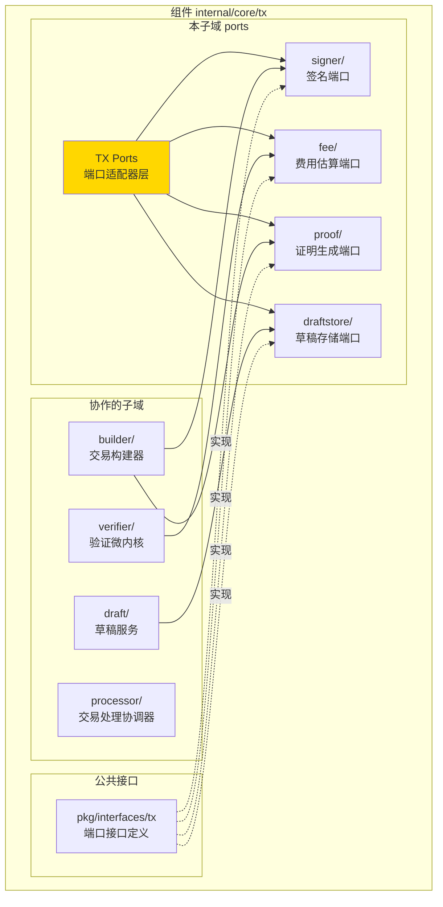
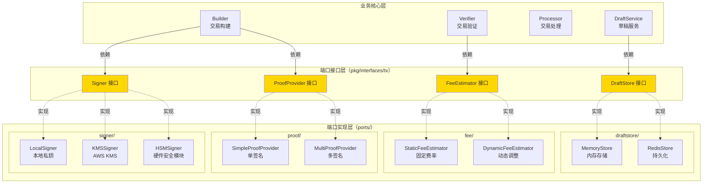
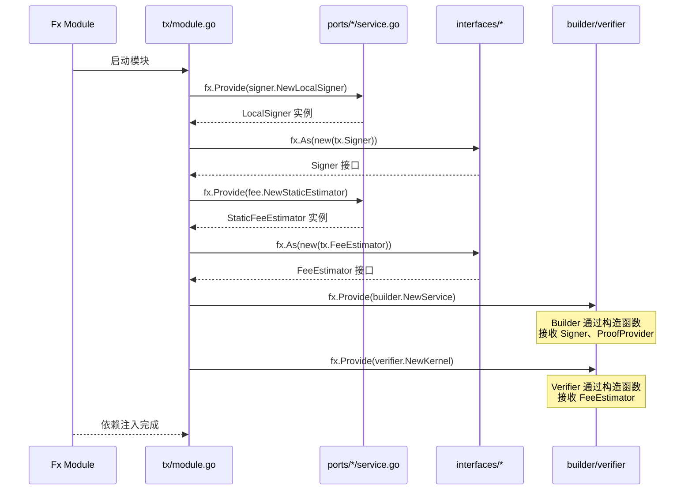
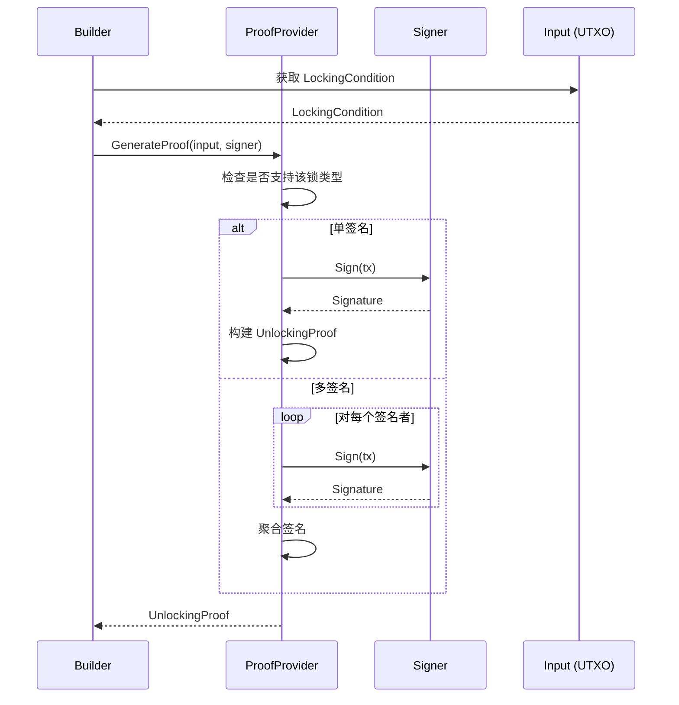
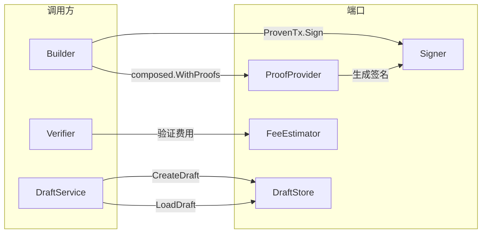

# TX Ports（internal/core/tx/ports）

---

## 📌 版本信息

- **版本**：1.0
- **状态**：stable
- **最后更新**：2025-11-30
- **最后审核**：2025-11-30
- **所有者**：TX模块团队
- **适用范围**：internal/core/tx/ports 模块

---

## 🎯 **子域定位**

**路径**：`internal/core/tx/ports/`

**所属组件**：`tx`

**核心职责**：实现六边形架构的"端口/适配器"模式，提供可替换的端口实现。

**在组件中的角色**：
- 隔离外部依赖（签名、存储、费用、证明）
- 支持多种实现切换（Local/KMS/HSM、Memory/Redis）
- 通过依赖注入实现灵活配置
- 保持核心业务逻辑纯净

本模块是WES系统中**交易处理域**的**端口适配器层**，实现六边形架构的"端口/适配器"模式。

**解决什么问题**：
- 隔离外部依赖（签名、存储、费用、证明）
- 支持多种实现切换（Local/KMS/HSM、Memory/Redis）
- 通过依赖注入实现灵活配置
- 保持核心业务逻辑纯净

**不解决什么问题**（边界）：
- 不包含业务逻辑（由 builder、verifier、processor 处理）
- 不定义公共接口（由 pkg/interfaces/tx/ports.go 定义）
- 不管理生命周期（由 fx 管理）
- 不做协议编解码（由 pb 定义）

---

## 🎯 **设计原则与核心约束**

### **设计原则**

| 原则 | 说明 | 价值 | 实现策略 |
|------|------|------|---------|
| **依赖倒置（DIP）** | 核心依赖抽象，适配器依赖具体 | 可测试性 | 接口在 pkg/interfaces，实现在 ports/ |
| **单一职责（SRP）** | 每个端口只负责一件事 | 清晰性 | 4个独立端口：Signer、FeeEstimator、ProofProvider、DraftStore |
| **开闭原则（OCP）** | 对扩展开放，对修改关闭 | 可扩展性 | 新增实现不影响接口 |
| **里氏替换（LSP）** | 任何实现可替换 | 灵活性 | 通过 fx.Annotate 注入 |
| **接口隔离（ISP）** | 接口最小化 | 简洁性 | 每个端口方法数 ≤ 5 |

### **核心约束** ⭐

**严格遵守**：
- ✅ 实现必须实现完整接口（不能部分实现）
- ✅ 不修改传入的参数（只读）
- ✅ 错误处理明确（返回 error，不 panic）
- ✅ 线程安全（并发调用安全）
- ✅ 通过 fx 注入（不直接 new）

**严格禁止**：
- ❌ 端口之间相互依赖
- ❌ 端口直接依赖业务模块（builder、verifier）
- ❌ 在端口中定义业务逻辑
- ❌ 修改公共接口（pkg/interfaces/tx/ports.go）

---

### **在组件中的位置**

> **说明**：展示此子域在组件内部的位置和协作关系



**位置说明**：

| 关系类型 | 目标 | 关系说明 |
|---------|------|---------|
| **协作** | builder/ | builder 使用 Signer 和 ProofProvider |
| **协作** | verifier/ | verifier 使用 FeeEstimator |
| **协作** | draft/ | draft 使用 DraftStore |
| **实现** | pkg/interfaces/tx | 实现公共端口接口 |

### **整体架构**



### **4大端口对照表**

| 端口 | 公共接口 | 实现位置 | 实现类型 | 使用场景 | 依赖方 |
|------|---------|---------|---------|---------|-------|
| **Signer** | `pkg/interfaces/tx.Signer` | `ports/signer/` | Local、KMS、HSM | 交易签名 | Builder |
| **FeeEstimator** | `pkg/interfaces/tx.FeeEstimator` | `ports/fee/` | Static、Dynamic | 费用估算 | Verifier、SDK |
| **ProofProvider** | `pkg/interfaces/tx.ProofProvider` | `ports/proof/` | Simple、Multi | 证明生成 | Builder |
| **DraftStore** | `pkg/interfaces/tx.DraftStore` | `ports/draftstore/` | Memory、Redis | 草稿存储 | DraftService |

### **依赖注入流程**



---

## 📊 **核心机制**

### **机制1：Signer 端口（签名服务）**

**为什么需要**：交易必须签名才能提交，但签名方式多样（本地、云、硬件）

**接口定义**：

```go
// pkg/interfaces/tx/ports.go
type Signer interface {
    Sign(ctx context.Context, tx *transaction.Transaction) (*transaction.SignatureData, error)
    PublicKey() (*transaction.PublicKey, error)
    Algorithm() transaction.SignatureAlgorithm
}
```

**实现对比**：

| 实现 | 适用场景 | 优势 | 劣势 | 安全级别 |
|------|---------|------|------|---------|
| **LocalSigner** | 开发/测试 | 快速、无依赖 | 私钥存本地 | 低 |
| **KMSSigner** | 云环境 | 私钥在云端 | 需网络调用 | 中 |
| **HSMSigner** | 企业环境 | 硬件隔离 | 成本高 | 高 |

**配置示例**：

```go
// module.go
fx.Provide(
    // 开发环境：使用 LocalSigner
    fx.Annotate(
        signer.NewLocalSigner,
        fx.As(new(tx.Signer)),
    ),
    
    // 生产环境：使用 KMSSigner
    // fx.Annotate(
    //     kms.NewKMSSigner,
    //     fx.As(new(tx.Signer)),
    // ),
),
```

### **机制2：FeeEstimator 端口（费用估算）**

**为什么需要**：用户需要知道交易费用，但估算策略可能变化

**接口定义**：

```go
type FeeEstimator interface {
    EstimateFee(ctx context.Context, tx *transaction.Transaction) (uint64, error)
    GetFeeRate() uint64
}
```

**实现对比**：

| 实现 | 算法 | 优势 | 劣势 | 适用场景 |
|------|------|------|------|---------|
| **StaticFeeEstimator** | 固定费率 × 交易大小 | 简单、可预测 | 不考虑拥堵 | 测试、私链 |
| **DynamicFeeEstimator** | 基于网络拥堵调整 | 更合理 | 复杂度高 | 公链 |

**费用计算公式**：

```
# StaticFeeEstimator
fee = txSize × feeRate

# DynamicFeeEstimator
fee = txSize × baseFeeRate × congestionMultiplier
```

### **机制3：ProofProvider 端口（证明生成）**

**为什么需要**：UTXO 解锁需要证明，但证明类型多样（单签、多签、脚本）

**接口定义**：

```go
type ProofProvider interface {
    GenerateProof(ctx context.Context, input *transaction.Input, signer Signer) (*transaction.UnlockingProof, error)
    SupportsLockType(lockType transaction.LockType) bool
}
```

**实现对比**：

| 实现 | 支持的锁类型 | 优势 | 劣势 |
|------|-------------|------|------|
| **SimpleProofProvider** | SingleKey | 简单、快速 | 仅支持单签 |
| **MultiProofProvider** | SingleKey、MultiSig、TimeLock | 全面 | 复杂度高 |

**证明生成流程**：



### **机制4：DraftStore 端口（草稿存储）**

**为什么需要**：Draft 需要持久化以支持中断恢复

**接口定义**：

```go
type DraftStore interface {
    Save(ctx context.Context, draftID string, draft *types.DraftTx) error
    Load(ctx context.Context, draftID string) (*types.DraftTx, error)
    Delete(ctx context.Context, draftID string) error
    List(ctx context.Context) ([]*types.DraftTx, error)
}
```

**实现对比**：

| 实现 | 持久化 | 性能 | 适用场景 |
|------|--------|------|---------|
| **MemoryStore** | ❌ 进程重启丢失 | 极快 | 开发测试、短期 Draft |
| **RedisStore** | ✅ 持久化 | 快 | 生产环境、长期 Draft |

**TTL 策略**：

```go
// RedisStore 默认 TTL：24小时
// 避免 Draft 堆积
const DefaultDraftTTL = 24 * time.Hour
```

---

## 📁 **目录结构**

```
internal/core/tx/ports/
├── README.md                        # 本文档
├── signer/                          # 签名端口
│   ├── README.md                    # 签名器详细说明
│   ├── local/
│   │   ├── service.go               # LocalSigner 实现
│   │   └── README.md
│   ├── kms/
│   │   ├── service.go               # KMSSigner 实现
│   │   └── README.md
│   └── hsm/
│       ├── service.go               # HSMSigner 实现
│       └── README.md
├── fee/                             # 费用估算端口
│   ├── README.md                    # 费用估算详细说明
│   ├── estimator_static.go         # StaticFeeEstimator 实现
│   └── estimator_dynamic.go        # DynamicFeeEstimator 实现
├── proof/                           # 证明生成端口
│   ├── README.md                    # 证明生成详细说明
│   ├── provider_simple.go          # SimpleProofProvider 实现
│   └── provider_multi.go           # MultiProofProvider 实现
└── draftstore/                      # 草稿存储端口
    ├── README.md                    # 存储接口详细说明
    ├── memory/
    │   ├── service.go               # MemoryStore 实现
    │   └── README.md
    └── redis/
        ├── service.go               # RedisStore 实现
        └── README.md
```

---

## 🔗 **依赖与协作**

### **依赖关系**

| 端口 | 依赖模块 | 依赖类型 | 用途 |
|------|---------|---------|------|
| **Signer** | `pkg/interfaces/infrastructure/crypto` | Crypto 接口 | 加密算法 |
| **FeeEstimator** | `pkg/interfaces/mempool` | TxPool 接口 | 网络拥堵信息 |
| **ProofProvider** | `pkg/interfaces/tx.Signer` | Signer 接口 | 签名生成 |
| **DraftStore** | `pkg/interfaces/infrastructure/storage` | Storage 接口 | 持久化存储 |

### **调用方协作**



---

## 🎓 **使用指南**

### **场景1：切换签名器实现**

```go
// module.go
func Module() fx.Option {
    return fx.Module("tx",
        fx.Provide(
            // 方式1：开发环境 - LocalSigner
            fx.Annotate(
                signer.NewLocalSigner,
                fx.As(new(tx.Signer)),
            ),
            
            // 方式2：生产环境 - KMSSigner
            // fx.Annotate(
            //     kms.NewKMSSigner,
            //     fx.As(new(tx.Signer)),
            // ),
            
            // 方式3：企业环境 - HSMSigner
            // fx.Annotate(
            //     hsm.NewHSMSigner,
            //     fx.As(new(tx.Signer)),
            // ),
        ),
    )
}
```

### **场景2：使用费用估算**

```go
// CLI 或 SDK
func estimateTransferFee(ctx context.Context, feeEstimator tx.FeeEstimator, amount uint64) {
    // 构建临时交易
    tx := buildTransferTx(amount)
    
    // 估算费用
    fee, err := feeEstimator.EstimateFee(ctx, tx)
    if err != nil {
        log.Fatalf("估算费用失败: %v", err)
    }
    
    fmt.Printf("预估费用: %d 单位\n", fee)
    fmt.Printf("总金额: %d (含费用)\n", amount+fee)
}
```

### **场景3：生成多签证明**

```go
// Builder
func (s *Service) buildMultiSigTx(ctx context.Context, signers []tx.Signer) (*types.SignedTx, error) {
    // 1. 构建交易
    composed, _ := s.CreateComposedTx(ctx, inputs, outputs)
    
    // 2. 为每个输入生成证明
    proven, err := composed.WithProofs(ctx, multiProofProvider)
    if err != nil {
        return nil, err
    }
    
    // 3. 多签名者签名
    signed, err := proven.Sign(ctx, signers[0])
    for _, signer := range signers[1:] {
        signed, err = signed.AddSignature(ctx, signer)
    }
    
    return signed, nil
}
```

---

## ⚠️ **已知限制**

| 限制 | 影响 | 规避方法 | 未来计划 |
|------|------|---------|---------|
| LocalSigner 私钥明文存储 | 安全风险 | 仅用于测试 | 已提供 KMS/HSM |
| FeeEstimator 无历史数据 | 估算不准 | 定期校准费率 | 考虑链上数据分析 |
| DraftStore 无版本控制 | 无法回滚 | 应用层管理 | 暂不支持 |
| ProofProvider 不支持脚本 | 仅支持签名解锁 | 使用 MultiProofProvider | 考虑脚本引擎 |

---

## 🔍 **设计权衡记录**

### **权衡1：端口接口在哪里定义**

**背景**：端口接口应该在 pkg/interfaces 还是 internal/core/tx/interfaces

**备选方案**：
1. **pkg/interfaces**：公共接口层 - 优势：SDK 可用 - 劣势：暴露内部
2. **internal/interfaces**：内部接口层 - 优势：封装 - 劣势：SDK 无法用

**选择**：pkg/interfaces

**理由**：
- SDK 需要使用这些端口（如 Signer）
- Signer、FeeEstimator 是公共能力，非内部实现细节
- 遵循 DIP，核心依赖抽象

**代价**：需要明确文档说明这些是端口接口

### **权衡2：每个端口是否需要多种实现**

**背景**：是否提供完整的实现矩阵

**备选方案**：
1. **单一实现**：每个端口只一个实现 - 优势：简单 - 劣势：不灵活
2. **多种实现**：提供2-3种实现 - 优势：灵活 - 劣势：维护成本

**选择**：多种实现

**理由**：
- 不同环境需求差异大（开发 vs 生产）
- 六边形架构的核心价值就是可替换
- 实际已有多种实现（如 KMS、HSM）

**代价**：需维护多个实现，测试覆盖面增加

### **权衡3：DraftStore 是否需要持久化**

**背景**：Draft 是否必须持久化

**备选方案**：
1. **仅内存**：所有 Draft 内存存储 - 优势：简单 - 劣势：不支持恢复
2. **强制持久化**：所有 Draft 必须持久化 - 优势：可靠 - 劣势：性能开销
3. **可选持久化**：内存 + Redis 可选 - 优势：灵活 - 劣势：配置复杂

**选择**：可选持久化

**理由**：
- 大多数 Draft 生命周期短（无需持久化）
- ISPC 场景需要恢复（需持久化）
- 通过依赖注入灵活切换

**代价**：需维护两种实现

---

---

## 🏭 **生产级端口适配器实现**

### 实施概览

以下三个端口适配器实现已完成，总计 ~1,370行生产级代码：

| 组件 | 文件 | 行数 | 功能 |
|------|------|------|------|
| **Redis DraftStore** | `draftstore/redis/service.go` | 430行 | 分布式草稿存储 |
| **KMS Signer** | `signer/kms/service.go` | 503行 | 云端密钥签名 |
| **Dynamic FeeEstimator** | `fee/estimator_dynamic.go` | 434行 | 动态费用估算 |

### Redis DraftStore 实现

**核心特性**：
- ✅ **分布式存储**：支持跨进程/跨节点共享草稿
- ✅ **持久化**：进程重启后数据不丢失
- ✅ **TTL 自动过期**：支持设置草稿生存时间
- ✅ **JSON 序列化**：自动序列化/反序列化 DraftTx
- ✅ **分页查询**：List 方法支持 offset/limit
- ✅ **Key 命名空间**：支持 key 前缀隔离

**redisClient 接口**（包内私有接口）：
```go
type redisClient interface {
    Set(ctx, key, value, expiration) error
    Get(ctx, key) ([]byte, error)
    Del(ctx, keys...) (int64, error)
    Keys(ctx, pattern) ([]string, error)
    Exists(ctx, keys...) (int64, error)
    TTL(ctx, key) (time.Duration, error)
    Expire(ctx, key, expiration) (bool, error)
    Ping(ctx) error
    Close() error
}
```

**使用示例**：
```go
// 方式1：从配置创建（推荐）
cfg := &draftstore.Config{
    Addr: "localhost:28791",
    // ... 其他配置
}
store, err := draftstore.NewRedisStoreFromConfig(cfg)

// 方式2：手动创建客户端（用于测试）
client := redisClientImpl // go-redis/mock/自定义
store, err := draftstore.NewRedisStore(client, "weisyn:draft:", 3600)

// 保存草稿
draftID, err := store.Save(ctx, draft)

// 设置 TTL
err = store.SetTTL(ctx, draftID, 7200)

// 检索草稿
draft, err := store.Get(ctx, draftID)

// 分页列表
drafts, err := store.List(ctx, nil, 0, 10)
```

**设计亮点**：
- 🔥 **接口抽象**：redisClient 接口支持多种实现（go-redis/mock），包内私有
- 🔥 **完整 CRUD**：Save/Get/Delete/List/SetTTL
- 🔥 **错误处理**：完整的错误分类和处理
- 🔥 **日志支持**：记录关键操作

**性能与可靠性**：
- ✅ **性能**：单次操作 < 5ms（本地 Redis）
- ✅ **可靠性**：支持 Redis 集群/哨兵模式
- ✅ **扩展性**：支持水平扩展

**生产环境注意事项**：
1. **连接池配置**：根据并发量调整 PoolSize 和 MinIdleConns
2. **TTL 策略**：根据业务需求设置合理的 TTL
3. **Key 前缀**：使用命名空间隔离不同环境/应用
4. **监控告警**：监控 Redis 连接数、延迟、错误率

### KMS Signer 实现

**核心特性**：
- ✅ **私钥永不暴露**：签名操作在 KMS 内部完成
- ✅ **访问审计**：所有签名操作记录审计日志
- ✅ **重试机制**：自动重试临时性失败（可配置）
- ✅ **超时控制**：避免长时间阻塞（可配置）
- ✅ **多 KMS 支持**：AWS KMS/GCP KMS/Azure Key Vault/HashiCorp Vault

**KMSClient 接口**：
```go
type KMSClient interface {
    Sign(ctx, keyID, data, algorithm) ([]byte, error)
    GetPublicKey(ctx, keyID) (*PublicKey, error)
    VerifyKeyAccess(ctx, keyID) error
    ListKeys(ctx) ([]string, error)
}
```

**使用示例**：
```go
// 创建 KMS 客户端（需实现 KMSClient 接口）
client := kmsClientImpl // AWS SDK/GCP SDK/Azure SDK/Vault SDK

// 配置
config := &kms.Config{
    KeyID:       "arn:aws:kms:us-east-1:123:key/abc",
    Algorithm:   transaction.SignatureAlgorithm_SIGNATURE_ALGORITHM_ECDSA_SECP256K1,
    RetryCount:  3,
    RetryDelay:  100 * time.Millisecond,
    SignTimeout: 5 * time.Second,
    Environment: "production",
}

// 创建 KMS Signer
signer, err := signer.NewKMSSigner(config, client, hashMgr, logger)

// 签名交易
signatureData, err := signer.Sign(ctx, tx)

// 获取公钥
pubKey := signer.PublicKey()

// 验证访问权限
err = signer.VerifyAccess(ctx)

// 刷新公钥（密钥轮换后）
err = signer.RefreshPublicKey(ctx)
```

**设计亮点**：
- 🔥 **接口抽象**：KMSClient 接口支持多种 KMS 提供商
- 🔥 **重试策略**：智能区分临时性错误和永久性错误
- 🔥 **密钥掩码**：日志中自动掩码敏感信息
- 🔥 **Protobuf 序列化**：使用 proto.Marshal 确保一致性

**性能与可靠性**：
- ✅ **性能**：单次签名 < 100ms（取决于 KMS 提供商）
- ✅ **可靠性**：3次重试，支持临时性错误恢复
- ✅ **安全性**：私钥永不离开 KMS

**生产环境注意事项**：
1. **密钥权限**：确保应用只有签名权限，无密钥管理权限
2. **审计日志**：启用 KMS 审计日志，记录所有签名操作
3. **密钥轮换**：定期轮换密钥，调用 RefreshPublicKey 更新
4. **重试策略**：根据 KMS 的限流策略调整重试次数和延迟
5. **超时配置**：根据网络延迟调整 SignTimeout

### Dynamic FeeEstimator 实现

**核心特性**：
- ✅ **按字节收费**：交易越大，费用越高
- ✅ **拥堵调整**：网络拥堵时费率上涨
- ✅ **多档位支持**：低速/标准/快速三种确认速度
- ✅ **智能预测**：基于历史数据预测最优费率（可选）
- ✅ **最小/最大限制**：防止费用过低或过高

**NetworkStateProvider 接口**：
```go
type NetworkStateProvider interface {
    GetCongestionLevel(ctx) (float64, error)  // 0.0-1.0
    GetRecentFees(ctx, count) ([]uint64, error)
}
```

**使用示例**：
```go
// 配置
config := &fee.DynamicConfig{
    BaseRatePerByte:      1,    // 每字节 1 个最小单位
    MinFee:               100,  // 最小 100
    MaxFee:               0,    // 无上限
    CongestionMultiplier: 1.0,  // 正常费率
    NetworkStateProvider: networkStateProviderImpl, // 可选
}

// 创建 Dynamic FeeEstimator
estimator := fee.NewDynamicEstimator(config, logger)

// 估算费用
fee, err := estimator.EstimateFee(ctx, tx)

// 按速度档位估算
lowFee, err := estimator.EstimateFeeWithSpeed(ctx, tx, "low")
standardFee, err := estimator.EstimateFeeWithSpeed(ctx, tx, "standard")
fastFee, err := estimator.EstimateFeeWithSpeed(ctx, tx, "fast")

// 获取当前费率
feeRate, err := estimator.GetFeeRateEstimate(ctx)

// 动态调整拥堵倍数
estimator.SetCongestionMultiplier(2.0)
```

**费用计算公式**：
```
费用 = max(
    min_fee,
    min(
        tx_size * rate_per_byte * congestion_multiplier,
        max_fee
    )
)
```

**拥堵等级映射**：

| 拥堵比例 | 拥堵等级 | 费率倍数 |
|---------|---------|---------|
| 0.0 - 0.3 | 低拥堵 | 1.0x |
| 0.3 - 0.5 | 中低拥堵 | 1.0x - 1.5x |
| 0.5 - 0.7 | 中高拥堵 | 1.5x - 2.0x |
| 0.7 - 1.0 | 高拥堵 | 2.0x - 3.0x |

**设计亮点**：
- 🔥 **分段线性插值**：平滑的费率调整曲线
- 🔥 **速度档位**：满足不同用户的确认速度需求
- 🔥 **可选网络状态**：支持实时拥堵信息，也支持静态配置
- 🔥 **Protobuf 序列化**：使用 proto.Marshal 计算交易大小

**性能与可靠性**：
- ✅ **性能**：单次估算 < 1ms（无网络查询）
- ✅ **准确性**：基于交易大小和拥堵情况动态调整
- ✅ **灵活性**：支持多档位和自定义倍数

**生产环境注意事项**：
1. **费率调整**：根据网络实际情况定期调整 BaseRatePerByte
2. **拥堵监控**：如果启用 NetworkStateProvider，确保其可靠性
3. **最大费用**：设置合理的 MaxFee 防止费用过高
4. **速度档位**：根据用户反馈调整速度档位的倍数

### 集成指南

**可选组件配置**：

这三个组件都是可选的，使用方可以根据需要选择性集成：

#### 场景 1：开发/测试环境
```go
// 使用内存 DraftStore
draftStore := draftstore.NewMemoryStore()

// 使用本地 Signer
signer := signer.NewLocalSigner(config, sigMgr, hashMgr, logger)

// 使用静态 FeeEstimator
feeEstimator := fee.NewStaticEstimator(&fee.Config{MinFee: 100}, logger)
```

#### 场景 2：生产环境（单节点）
```go
// 使用内存 DraftStore（单节点）
draftStore := draftstore.NewMemoryStore()

// 使用 KMS Signer（生产安全）
signer := signer.NewKMSSigner(kmsConfig, kmsClient, hashMgr, logger)

// 使用动态 FeeEstimator
feeEstimator := fee.NewDynamicEstimator(dynamicConfig, logger)
```

#### 场景 3：生产环境（分布式）
```go
// 使用 Redis DraftStore（分布式）
draftStore := draftstore.NewRedisStore(redisClient, "weisyn:draft:", 3600)

// 使用 KMS Signer（生产安全）
signer := signer.NewKMSSigner(kmsConfig, kmsClient, hashMgr, logger)

// 使用动态 FeeEstimator（带网络状态）
feeEstimator := fee.NewDynamicEstimator(dynamicConfigWithNetwork, logger)
```

**最佳实践**：
1. **环境隔离**：开发/测试/生产使用不同的配置
2. **渐进迁移**：先在测试环境验证，再逐步迁移到生产
3. **监控指标**：监控组件的性能、错误率、可用性
4. **降级策略**：准备备用方案（Redis 不可用时降级到内存）
5. **文档完善**：记录配置参数、使用方法、故障处理

---

## 📚 **相关文档**

- **公共接口**：[pkg/interfaces/tx/ports.go](../../../pkg/interfaces/tx/ports.go) - 端口接口定义
- **Signer 详细设计**：[signer/README.md](./signer/README.md) - 签名器实现对比
- **FeeEstimator 详细设计**：[fee/README.md](./fee/README.md) - 费用估算算法
- **ProofProvider 详细设计**：[proof/README.md](./proof/README.md) - 证明生成机制
- **DraftStore 详细设计**：[draftstore/README.md](./draftstore/README.md) - 存储接口实现
- **组件实现文档**：[../../../../docs/components/core/tx/implementation.md](../../../../docs/components/core/tx/implementation.md) - 组件整体实现说明
- **六边形架构**：_docs/architecture/COMPONENT_ARCHITECTURE_SPECIFICATION.md - 架构原则

---

## 📋 **文档变更记录**

| 日期 | 变更内容 | 原因 |
|------|---------|------|
| 2025-11-30 | 添加版本信息章节 | 符合文档规范 |
| 2025-11-30 | 添加"在组件中的位置"图 | 符合 subdirectory-readme.md 模板要求 |
| 2025-11-30 | 调整章节标题 | 符合模板规范 |
| 2025-11-30 | 统一日期格式 | 符合文档规范 |
| 2025-10-23 | 创建完整端口架构文档 | 提供端口层设计说明 |
| 2025-10-23 | 补齐4大端口对照表和依赖注入流程 | 完善设计细节 |
| 2025-11-XX | 整合 P7 端口适配器实现说明 | 统一文档结构 |

---

> 📝 **实现指导**
>
> 本文档定义了 TX 模块的端口适配器层，包括：
> 1. **4大端口**：Signer（签名）、FeeEstimator（费用）、ProofProvider（证明）、DraftStore（存储）
> 2. **多种实现**：每个端口提供2-3种实现，支持灵活切换
> 3. **依赖注入**：通过 fx.Annotate 和 fx.As 实现
> 4. **接口定义**：在 pkg/interfaces/tx/ports.go，遵循 DIP
> 5. **六边形架构**：核心业务依赖抽象，适配器依赖具体
>
> 实现时严格遵循端口接口，确保任何实现可替换，不修改核心业务逻辑。
