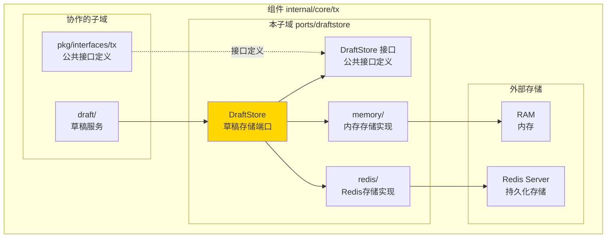
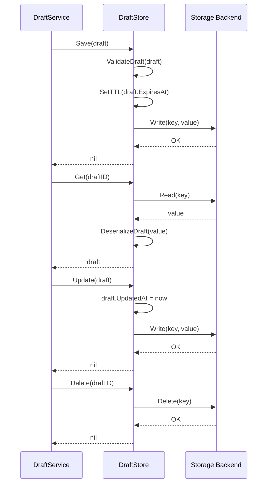
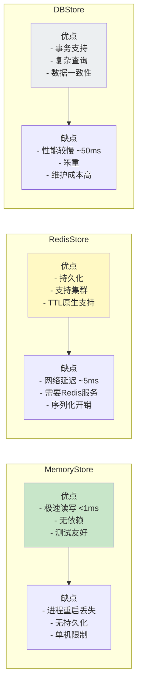

# DraftStore - 交易草稿存储接口

---

## 📌 版本信息

- **版本**：1.0
- **状态**：stable
- **最后更新**：2025-11-30
- **最后审核**：2025-11-30
- **所有者**：TX模块团队
- **适用范围**：internal/core/tx/ports/draftstore 模块

---

## 🎯 **子域定位**

**路径**：`internal/core/tx/ports/draftstore/`

**所属组件**：`tx`

**核心职责**：定义交易草稿持久化存储接口，支持多种存储后端实现（内存、Redis、数据库等）。

**在组件中的角色**：
- 草稿存储：持久化保存未完成的交易构建状态
- 草稿检索：根据 DraftID 快速查找草稿
- 生命周期管理：支持草稿的创建、更新、删除和过期
- 多后端支持：提供统一接口，适配不同存储引擎

**DraftStore** 是 `ports/draftstore` 端口的核心模块，定义了**交易草稿持久化存储接口**，支持多种存储后端实现（内存、Redis、数据库等）。

### 核心职责

1. **草稿存储**：持久化保存未完成的交易构建状态
2. **草稿检索**：根据 DraftID 快速查找草稿
3. **生命周期管理**：支持草稿的创建、更新、删除和过期
4. **多后端支持**：提供统一接口，适配不同存储引擎
5. **并发安全**：保证多线程/多进程环境下的数据一致性

### 在交易构建流程中的位置

```
DraftService.CreateDraft() 
    ↓
DraftStore.Save(draft)  ← 持久化
    ↓
DraftService.UpdateDraft()
    ↓
DraftStore.Update(draft)  ← 更新
    ↓
DraftService.FinalizeDraft()
    ↓
DraftStore.Delete(draftID)  ← 清理
```

---

## 🎯 设计原则与核心约束

### 1. 存储无关性原则

**原则**：定义统一接口，业务逻辑与存储实现解耦。

**约束**：
- ✅ `DraftService` 仅依赖 `DraftStore` 接口
- ❌ 禁止在业务代码中硬编码存储细节
- ✅ 通过 `fx` 依赖注入切换存储后端

### 2. 草稿隔离原则

**原则**：不同用户/会话的草稿相互隔离。

**约束**：
- ✅ DraftID 全局唯一（UUID）
- ✅ 存储时包含用户标识（UserID）
- ❌ 禁止跨用户访问草稿

### 3. 过期清理原则

**原则**：长时间未使用的草稿应自动过期清理。

**约束**：
- ✅ 支持设置 TTL（Time To Live）
- ✅ 后台定期清理过期草稿
- ✅ 默认 TTL 24 小时

### 4. 性能优先原则

**原则**：草稿读写操作应快速完成（< 10ms）。

**约束**：
- ✅ 内存实现：O(1) 查询
- ✅ Redis 实现：单次操作 < 5ms
- ❌ 避免使用慢速存储（如 S3、NFS）

---

### **在组件中的位置**

> **说明**：展示此子域在组件内部的位置和协作关系



**位置说明**：

| 关系类型 | 目标 | 关系说明 |
|---------|------|---------|
| **协作** | draft/ | draft 使用 DraftStore 持久化草稿 |
| **实现** | pkg/interfaces/tx | 实现公共 DraftStore 接口 |

### **核心接口**

```mermaid
graph TB
    subgraph "Public Interface"
        IF[tx.DraftStore<br/>公共接口]
    end
    
    subgraph "Implementation Layer"
        Memory[MemoryStore<br/>内存存储]
        Redis[RedisStore<br/>Redis存储]
        DB[DBStore<br/>数据库存储<br/>(未实现)]
    end
    
    subgraph "Storage Backend"
        RAM[RAM]
        RedisServer[Redis Server]
        Database[PostgreSQL]
    end
    
    IF --> Memory
    IF --> Redis
    IF --> DB
    
    Memory --> RAM
    Redis --> RedisServer
    DB --> Database
    
    style IF fill:#e1f5ff
    style Memory fill:#c8e6c9
    style Redis fill:#fff9c4
    style DB fill:#eceff1
```

### 接口定义

```go
// DraftStore 交易草稿存储接口
type DraftStore interface {
    // Save 保存新草稿
    Save(ctx context.Context, draft *Draft) error
    
    // Get 获取草稿
    Get(ctx context.Context, draftID string) (*Draft, error)
    
    // Update 更新草稿
    Update(ctx context.Context, draft *Draft) error
    
    // Delete 删除草稿
    Delete(ctx context.Context, draftID string) error
    
    // List 列出用户的所有草稿
    List(ctx context.Context, userID string, opts *ListOptions) ([]*Draft, error)
    
    // Close 关闭存储连接
    Close() error
}

// Draft 交易草稿
type Draft struct {
    ID          string                 // 草稿唯一标识
    UserID      string                 // 用户标识
    State       DraftState             // 草稿状态
    Inputs      []*types.TxInput       // 已添加的输入
    Outputs     []*types.TxOutput      // 已添加的输出
    Metadata    map[string]interface{} // 元数据（自定义字段）
    CreatedAt   time.Time              // 创建时间
    UpdatedAt   time.Time              // 更新时间
    ExpiresAt   time.Time              // 过期时间
}

// DraftState 草稿状态
type DraftState string

const (
    DraftStateCreated   DraftState = "created"   // 已创建
    DraftStateBuilding  DraftState = "building"  // 构建中
    DraftStateCompleted DraftState = "completed" // 已完成
    DraftStateAborted   DraftState = "aborted"   // 已中止
)

// ListOptions 列表查询选项
type ListOptions struct {
    Limit  int         // 限制数量
    Offset int         // 偏移量
    State  DraftState  // 按状态过滤
}
```

### 存储流程



### 实现对比



---

## 📊 核心机制

### 1. 通用工具函数

```go
// GenerateDraftKey 生成存储键
func GenerateDraftKey(draftID string) string {
    return fmt.Sprintf("draft:%s", draftID)
}

// GenerateUserDraftsKey 生成用户草稿列表键
func GenerateUserDraftsKey(userID string) string {
    return fmt.Sprintf("user:%s:drafts", userID)
}

// SerializeDraft 序列化草稿
func SerializeDraft(draft *Draft) ([]byte, error) {
    return json.Marshal(draft)
}

// DeserializeDraft 反序列化草稿
func DeserializeDraft(data []byte) (*Draft, error) {
    var draft Draft
    if err := json.Unmarshal(data, &draft); err != nil {
        return nil, err
    }
    return &draft, nil
}

// CalculateTTL 计算 TTL
func CalculateTTL(expiresAt time.Time) time.Duration {
    ttl := time.Until(expiresAt)
    if ttl < 0 {
        return 0
    }
    return ttl
}
```

### 2. 错误处理

```go
// DraftStore 错误类型
var (
    ErrDraftNotFound    = errors.New("draft not found")
    ErrDraftExpired     = errors.New("draft expired")
    ErrInvalidDraftID   = errors.New("invalid draft ID")
    ErrStoreClosed      = errors.New("store closed")
    ErrDuplicateDraftID = errors.New("duplicate draft ID")
)

// IsNotFoundError 检查是否为"未找到"错误
func IsNotFoundError(err error) bool {
    return errors.Is(err, ErrDraftNotFound)
}
```

### 3. 过期清理机制

```go
// CleanupManager 过期草稿清理管理器
type CleanupManager struct {
    store          DraftStore
    cleanupInterval time.Duration
    stopCh         chan struct{}
    logger         log.Logger
}

func NewCleanupManager(store DraftStore, interval time.Duration, logger log.Logger) *CleanupManager {
    return &CleanupManager{
        store:          store,
        cleanupInterval: interval,
        stopCh:         make(chan struct{}),
        logger:         logger,
    }
}

func (m *CleanupManager) Start() {
    go m.cleanupLoop()
}

func (m *CleanupManager) Stop() {
    close(m.stopCh)
}

func (m *CleanupManager) cleanupLoop() {
    ticker := time.NewTicker(m.cleanupInterval)
    defer ticker.Stop()
    
    for {
        select {
        case <-ticker.C:
            if err := m.cleanupExpiredDrafts(); err != nil {
                m.logger.Errorf("清理过期草稿失败: %v", err)
            }
        case <-m.stopCh:
            m.logger.Info("停止清理任务")
            return
        }
    }
}

func (m *CleanupManager) cleanupExpiredDrafts() error {
    // 具体实现依赖于存储后端
    // MemoryStore: 遍历 map，删除过期项
    // RedisStore: Redis 自动处理 TTL，无需清理
    
    m.logger.Debug("开始清理过期草稿...")
    // ... 清理逻辑 ...
    return nil
}
```

---

## 📁 目录结构

```
draftstore/
├── README.md                    # 本文档（架构总览）
├── interface.go                 # DraftStore 接口定义（待实现）
├── draft.go                     # Draft 数据结构（待实现）
├── errors.go                    # 错误定义（待实现）
├── utils.go                     # 工具函数（待实现）
├── memory/                      # 内存存储实现
│   ├── README.md               # MemoryStore 详细设计
│   └── service.go              # 实现文件（待实现）
└── redis/                       # Redis 存储实现
    ├── README.md               # RedisStore 详细设计
    └── service.go              # 实现文件（待实现）
```

---

## 🔗 依赖与协作

### 上游依赖

| 依赖模块 | 依赖内容 | 使用方式 |
|---------|---------|---------|
| `pkg/interfaces/tx.DraftStore` | 草稿存储公共接口 | 实现该接口 |
| `pkg/types` | Draft 数据结构 | 存储和检索 |

### 下游使用

- **Draft Service**：调用 `DraftStore` 持久化草稿状态
- **TxBuilder**：间接通过 Draft Service 使用

### 外部依赖

```go
// Redis 存储
"github.com/redis/go-redis/v9"

// 数据库存储（未实现）
"gorm.io/gorm"
```

---

## 🎓 使用指南

### 配置示例

```yaml
# config/tx.yaml
tx:
  draft:
    # 存储后端：memory 或 redis
    store_type: memory
    
    # 草稿 TTL（24 小时）
    ttl: 24h
    
    # 内存存储配置
    memory:
      cleanup_interval: 1h
    
    # Redis 存储配置
    redis:
      address: "localhost:28791"
      password: ""
      db: 0
      pool_size: 10
```

### 代码示例

```go
// 初始化 DraftStore
func initDraftStore(cfg config.Config, logger log.Logger) (tx.DraftStore, error) {
    storeType := cfg.GetString("tx.draft.store_type")
    
    switch storeType {
    case "memory":
        cleanupInterval := cfg.GetDuration("tx.draft.memory.cleanup_interval", 1*time.Hour)
        return draftstore.NewMemoryStore(cleanupInterval, logger), nil
    case "redis":
        redisAddr := cfg.GetString("tx.draft.redis.address")
        redisPassword := cfg.GetString("tx.draft.redis.password")
        redisDB := cfg.GetInt("tx.draft.redis.db", 0)
        
        return draftstore.NewRedisStore(redisAddr, redisPassword, redisDB, logger)
    default:
        return nil, fmt.Errorf("unsupported store type: %s", storeType)
    }
}

// 使用 DraftStore
func saveDraft(store tx.DraftStore, draft *tx.Draft) error {
    ctx, cancel := context.WithTimeout(context.Background(), 5*time.Second)
    defer cancel()
    
    if err := store.Save(ctx, draft); err != nil {
        return fmt.Errorf("保存草稿失败: %w", err)
    }
    
    log.Infof("草稿已保存，ID=%s", draft.ID)
    return nil
}

func getDraft(store tx.DraftStore, draftID string) (*tx.Draft, error) {
    ctx, cancel := context.WithTimeout(context.Background(), 5*time.Second)
    defer cancel()
    
    draft, err := store.Get(ctx, draftID)
    if err != nil {
        if draftstore.IsNotFoundError(err) {
            return nil, fmt.Errorf("草稿不存在: %s", draftID)
        }
        return nil, fmt.Errorf("获取草稿失败: %w", err)
    }
    
    return draft, nil
}
```

---

## ⚠️ 已知限制

### 1. 内存存储进程重启丢失

**限制**：MemoryStore 数据存储在进程内存，重启后丢失。

**影响**：不适合生产环境长期使用。

**缓解**：生产环境使用 RedisStore。

### 2. Redis 存储网络依赖

**限制**：RedisStore 依赖 Redis 服务可用性。

**影响**：Redis 故障导致草稿功能不可用。

**缓解**：
- Redis 高可用集群（Sentinel/Cluster）
- 监控 Redis 连接状态
- 降级到 MemoryStore

### 3. 并发更新冲突

**限制**：多个客户端同时更新同一草稿可能冲突。

**影响**：后写入覆盖先写入（Last Write Wins）。

**缓解**：
- 实现乐观锁（Version 字段）
- 使用 Redis WATCH/MULTI 事务

---

## 🔍 设计权衡记录

### 权衡 1：内存 vs Redis

**决策**：同时提供两种实现，通过配置切换。

**理由**：
- ✅ **灵活性**：不同场景选择不同后端
- ✅ **测试友好**：单元测试用 Memory，集成测试用 Redis
- ⚠️ **维护成本**：需要维护两套代码

**建议**：
- 开发/测试：MemoryStore
- 生产环境：RedisStore

### 权衡 2：JSON vs Protobuf 序列化

**决策**：使用 JSON 序列化。

**理由**：
- ✅ **可读性**：Redis 中数据可直接查看
- ✅ **灵活性**：支持动态字段（Metadata）
- ⚠️ **性能**：比 Protobuf 慢约 20%

**监控**：如果性能成为瓶颈，考虑切换到 Protobuf。

### 权衡 3：TTL 24h vs 永久保存

**决策**：默认 TTL 24 小时，可配置。

**理由**：
- ✅ **防止泄漏**：避免废弃草稿占用空间
- ✅ **合理性**：24 小时足够完成交易构建
- ⚠️ **用户体验**：长时间未操作的草稿会丢失

**实施**：提示用户"草稿将在 24 小时后过期"。

---

## 📚 相关文档

- **子模块**：`memory/README.md` - MemoryStore 详细设计
- **子模块**：`redis/README.md` - RedisStore 详细设计
- **上层设计**：`ports/README.md` - 端口架构总览
- **架构文档**：`_docs/architecture/TX_STATE_MACHINE_ARCHITECTURE.md`
- **公共接口**：`pkg/interfaces/tx/draft.go`

---

## 📋 **文档变更记录**

| 日期 | 变更内容 | 原因 |
|------|---------|------|
| 2025-11-30 | 添加版本信息章节 | 符合文档规范 |
| 2025-11-30 | 添加"在组件中的位置"图 | 符合 subdirectory-readme.md 模板要求 |
| 2025-11-30 | 调整章节标题和格式 | 符合模板规范 |
| 2025-10-23 | 初始版本 | 创建文档 |

---

## 🏷️ **模块状态**

- **当前状态**：⏳ **待实现**
- **设计完成度**：100%（本文档）
- **代码实现度**：0%（仅 `package` 声明）
- **测试覆盖率**：0%

**下一步**：
1. 实现接口定义和数据结构
2. 实现 MemoryStore
3. 实现 RedisStore
4. 编写单元测试
5. 添加性能基准测试

---

**最后更新**：2025-11-30
