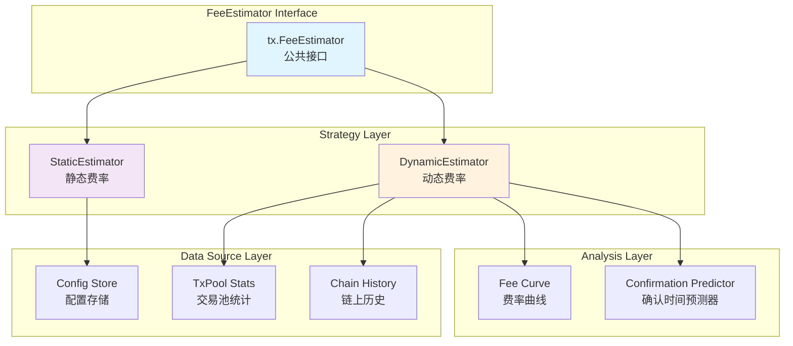
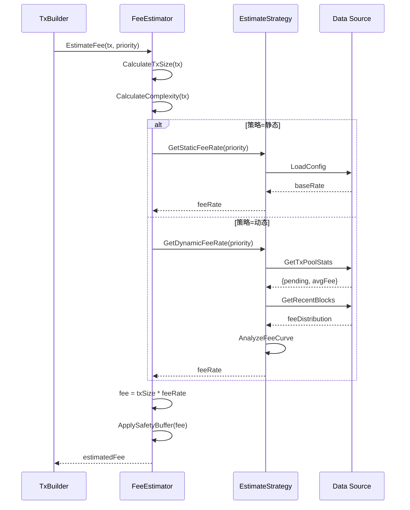
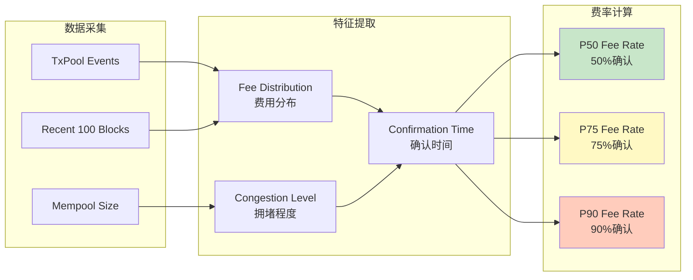

# Fee Estimator - 交易费用估算器

## 📍 模块定位

**Fee Estimator** 是 `ports/fee` 端口的核心模块，负责在交易构建阶段预估**所需的最小交易费用**，确保交易能被网络接受并及时打包。

### 核心职责

1. **费用预估**：根据交易特征（大小、复杂度、紧急度）预估所需费用
2. **策略支持**：提供静态费率（Static）和动态费率（Dynamic）两种估算策略
3. **网络适配**：根据当前网络拥堵情况自动调整费率
4. **用户控制**：支持用户指定费率倍数（Fast/Normal/Slow）
5. **费用验证**：验证交易费用是否满足最低要求（防欺诈）

### 在交易构建流程中的位置

```
TxBuilder.AddInputs()
    ↓
TxBuilder.AddOutputs()
    ↓
TxBuilder.EstimateFee() ← 调用 FeeEstimator
    ↓
TxBuilder.Build() → ProvenTx
```

---

## 🎯 设计原则与核心约束

### 1. 保守估算原则

**原则**：宁可高估费用，也不能低估导致交易被拒绝。

**约束**：
- ✅ 估算结果应略高于实际最低要求（+5% buffer）
- ❌ 禁止返回低于链上最小费用阈值的估算
- ✅ 动态估算失败时，回退到静态高费率

### 2. 用户可控性原则

**原则**：用户应能在安全范围内调整费率。

**约束**：
- ✅ 提供 Fast/Normal/Slow 三档费率
- ✅ 支持用户指定倍数（0.5x ~ 10x）
- ❌ 禁止用户设置低于最小阈值的费率

### 3. 网络感知原则

**原则**：动态估算器应实时感知网络拥堵状况。

**约束**：
- ✅ 订阅 TxPool 状态变化事件
- ✅ 分析最近 N 个区块的费率分布
- ✅ 根据目标确认时间调整费率

### 4. 计算效率原则

**原则**：费用估算应在 O(1) 时间内完成，不阻塞交易构建。

**约束**：
- ✅ 静态估算：查表 O(1)
- ✅ 动态估算：缓存费率曲线，定期异步更新
- ❌ 禁止在估算时同步查询区块链

---

## 🏗️ 架构设计

### 核心组件



### 费用估算流程



### 动态费率分析



---

## 📊 核心机制

### 1. 静态费率估算

```go
// StaticEstimator 静态费率估算器
type StaticEstimator struct {
    baseRate     uint64  // 基础费率（satoshi/byte）
    fastMultiplier float64  // Fast 倍数
    slowMultiplier float64  // Slow 倍数
    minFee       uint64  // 最小费用阈值
}

func NewStaticEstimator(cfg config.Config) *StaticEstimator {
    return &StaticEstimator{
        baseRate:       cfg.GetUint64("tx.fee.static.base_rate", 10),
        fastMultiplier: cfg.GetFloat64("tx.fee.static.fast_multiplier", 2.0),
        slowMultiplier: cfg.GetFloat64("tx.fee.static.slow_multiplier", 0.5),
        minFee:         cfg.GetUint64("tx.fee.static.min_fee", 1000),
    }
}

func (e *StaticEstimator) EstimateFee(ctx context.Context, req *EstimateRequest) (*EstimateResponse, error) {
    // 1. 计算交易大小（预估）
    txSize := e.estimateTxSize(req)
    
    // 2. 根据优先级选择费率
    var feeRate uint64
    switch req.Priority {
    case PriorityFast:
        feeRate = uint64(float64(e.baseRate) * e.fastMultiplier)
    case PriorityNormal:
        feeRate = e.baseRate
    case PrioritySlow:
        feeRate = uint64(float64(e.baseRate) * e.slowMultiplier)
    default:
        feeRate = e.baseRate
    }
    
    // 3. 计算费用
    fee := txSize * feeRate
    
    // 4. 应用最小阈值
    if fee < e.minFee {
        fee = e.minFee
    }
    
    // 5. 添加安全缓冲（+5%）
    fee = uint64(float64(fee) * 1.05)
    
    return &EstimateResponse{
        EstimatedFee:  fee,
        FeeRate:       feeRate,
        TxSize:        txSize,
        Priority:      req.Priority,
    }, nil
}

func (e *StaticEstimator) estimateTxSize(req *EstimateRequest) uint64 {
    // EUTXO 交易大小估算公式：
    // BaseTxSize + (InputCount * AvgInputSize) + (OutputCount * AvgOutputSize)
    
    const (
        baseTxSize      = 10   // 交易头部大小
        avgInputSize    = 150  // 平均 Input 大小（含签名）
        avgOutputSize   = 50   // 平均 Output 大小
    )
    
    size := baseTxSize
    size += req.InputCount * avgInputSize
    size += req.OutputCount * avgOutputSize
    
    return uint64(size)
}
```

### 2. 动态费率估算

```go
// DynamicEstimator 动态费率估算器
type DynamicEstimator struct {
    txPool          mempool.TxPool
    chainReader     repository.ChainReader
    feeCurve        *FeeCurve
    updateInterval  time.Duration
    logger          log.Logger
    
    mu              sync.RWMutex
    lastUpdate      time.Time
}

func NewDynamicEstimator(
    txPool mempool.TxPool,
    chainReader repository.ChainReader,
    cfg config.Config,
    logger log.Logger,
) *DynamicEstimator {
    e := &DynamicEstimator{
        txPool:         txPool,
        chainReader:    chainReader,
        feeCurve:       NewFeeCurve(),
        updateInterval: cfg.GetDuration("tx.fee.dynamic.update_interval", 30*time.Second),
        logger:         logger,
    }
    
    // 启动后台更新任务
    go e.updateFeeCurveLoop()
    
    return e
}

func (e *DynamicEstimator) EstimateFee(ctx context.Context, req *EstimateRequest) (*EstimateResponse, error) {
    // 1. 计算交易大小
    txSize := e.estimateTxSize(req)
    
    // 2. 获取当前费率曲线
    e.mu.RLock()
    feeCurve := e.feeCurve
    e.mu.RUnlock()
    
    // 3. 根据优先级选择目标确认概率
    var targetPercentile float64
    switch req.Priority {
    case PriorityFast:
        targetPercentile = 0.90  // 90% 确认概率（1-2 区块）
    case PriorityNormal:
        targetPercentile = 0.75  // 75% 确认概率（2-3 区块）
    case PrioritySlow:
        targetPercentile = 0.50  // 50% 确认概率（3-5 区块）
    default:
        targetPercentile = 0.75
    }
    
    // 4. 从费率曲线获取对应费率
    feeRate := feeCurve.GetFeeRate(targetPercentile)
    
    // 5. 计算费用
    fee := txSize * feeRate
    
    // 6. 添加安全缓冲
    fee = uint64(float64(fee) * 1.05)
    
    return &EstimateResponse{
        EstimatedFee:      fee,
        FeeRate:           feeRate,
        TxSize:            txSize,
        Priority:          req.Priority,
        ConfirmProbability: targetPercentile,
    }, nil
}

// updateFeeCurveLoop 后台更新费率曲线
func (e *DynamicEstimator) updateFeeCurveLoop() {
    ticker := time.NewTicker(e.updateInterval)
    defer ticker.Stop()
    
    for range ticker.C {
        if err := e.updateFeeCurve(); err != nil {
            e.logger.Errorf("更新费率曲线失败: %v", err)
        }
    }
}

func (e *DynamicEstimator) updateFeeCurve() error {
    ctx, cancel := context.WithTimeout(context.Background(), 10*time.Second)
    defer cancel()
    
    // 1. 获取最近 100 个区块的费率分布
    recentBlocks, err := e.chainReader.GetRecentBlocks(ctx, 100)
    if err != nil {
        return fmt.Errorf("获取区块失败: %w", err)
    }
    
    // 2. 提取所有交易的费率
    var feeRates []uint64
    for _, block := range recentBlocks {
        for _, tx := range block.Transactions {
            feeRate := e.calculateTxFeeRate(tx)
            feeRates = append(feeRates, feeRate)
        }
    }
    
    if len(feeRates) == 0 {
        return errors.New("无费率数据")
    }
    
    // 3. 构建费率曲线
    newFeeCurve := e.buildFeeCurve(feeRates)
    
    // 4. 更新缓存
    e.mu.Lock()
    e.feeCurve = newFeeCurve
    e.lastUpdate = time.Now()
    e.mu.Unlock()
    
    e.logger.Debugf("费率曲线已更新，样本数=%d", len(feeRates))
    return nil
}

func (e *DynamicEstimator) calculateTxFeeRate(tx *types.Transaction) uint64 {
    totalInput := sumInputs(tx.Inputs)
    totalOutput := sumOutputs(tx.Outputs)
    fee := totalInput - totalOutput
    
    txSize := calculateTxSize(tx)
    
    if txSize == 0 {
        return 0
    }
    
    return fee / txSize
}

func (e *DynamicEstimator) buildFeeCurve(feeRates []uint64) *FeeCurve {
    // 1. 排序
    sort.Slice(feeRates, func(i, j int) bool {
        return feeRates[i] < feeRates[j]
    })
    
    // 2. 计算百分位数
    p50 := percentile(feeRates, 0.50)
    p75 := percentile(feeRates, 0.75)
    p90 := percentile(feeRates, 0.90)
    p95 := percentile(feeRates, 0.95)
    
    return &FeeCurve{
        P50: p50,
        P75: p75,
        P90: p90,
        P95: p95,
        SampleSize: len(feeRates),
        UpdatedAt:  time.Now(),
    }
}

// percentile 计算百分位数
func percentile(sorted []uint64, p float64) uint64 {
    if len(sorted) == 0 {
        return 0
    }
    
    index := int(float64(len(sorted)-1) * p)
    return sorted[index]
}
```

### 3. 费率曲线

```go
// FeeCurve 费率曲线
type FeeCurve struct {
    P50        uint64    // 50% 分位（Slow）
    P75        uint64    // 75% 分位（Normal）
    P90        uint64    // 90% 分位（Fast）
    P95        uint64    // 95% 分位（Ultra Fast）
    SampleSize int       // 样本数量
    UpdatedAt  time.Time // 更新时间
}

func (c *FeeCurve) GetFeeRate(percentile float64) uint64 {
    switch {
    case percentile <= 0.50:
        return c.P50
    case percentile <= 0.75:
        // 线性插值
        return c.interpolate(c.P50, c.P75, (percentile-0.50)/0.25)
    case percentile <= 0.90:
        return c.interpolate(c.P75, c.P90, (percentile-0.75)/0.15)
    case percentile <= 0.95:
        return c.interpolate(c.P90, c.P95, (percentile-0.90)/0.05)
    default:
        return c.P95
    }
}

func (c *FeeCurve) interpolate(low, high uint64, ratio float64) uint64 {
    return low + uint64(float64(high-low)*ratio)
}
```

---

## 📁 目录结构

```
fee/
├── README.md                    # 本文档
├── estimator_static.go          # 静态费率估算器（待实现）
├── estimator_dynamic.go         # 动态费率估算器（待实现）
├── fee_curve.go                 # 费率曲线（待实现）
└── utils.go                     # 工具函数（待实现）
```

---

## 🔗 依赖与协作

### 上游依赖

| 依赖模块 | 依赖内容 | 使用方式 |
|---------|---------|---------|
| `pkg/interfaces/tx.FeeEstimator` | 费用估算器公共接口 | 实现该接口 |
| `pkg/interfaces/mempool.TxPool` | 交易池统计 | 获取待处理交易费率 |
| `pkg/interfaces/repository.ChainReader` | 链上数据 | 读取历史区块费率 |

### 下游使用

- **TxBuilder**：调用 `EstimateFee()` 预估费用
- **Draft Service**：为草稿交易估算费用

---

## 🎓 使用指南

### 配置示例

```yaml
# config/tx.yaml
tx:
  fee:
    # 估算策略：static 或 dynamic
    strategy: dynamic
    
    # 静态费率配置
    static:
      base_rate: 10           # satoshi/byte
      fast_multiplier: 2.0
      slow_multiplier: 0.5
      min_fee: 1000           # 最小费用（satoshi）
    
    # 动态费率配置
    dynamic:
      update_interval: 30s    # 费率曲线更新间隔
      sample_blocks: 100      # 采样区块数量
```

### 代码示例

```go
// 初始化费用估算器
func initFeeEstimator(
    cfg config.Config,
    txPool mempool.TxPool,
    chainReader repository.ChainReader,
    logger log.Logger,
) tx.FeeEstimator {
    strategy := cfg.GetString("tx.fee.strategy")
    
    switch strategy {
    case "static":
        return fee.NewStaticEstimator(cfg)
    case "dynamic":
        return fee.NewDynamicEstimator(txPool, chainReader, cfg, logger)
    default:
        logger.Warnf("未知费用策略 %s，使用静态", strategy)
        return fee.NewStaticEstimator(cfg)
    }
}

// 使用费用估算器
func estimateTransactionFee(
    estimator tx.FeeEstimator,
    inputCount, outputCount int,
    priority tx.Priority,
) (uint64, error) {
    req := &tx.EstimateRequest{
        InputCount:  inputCount,
        OutputCount: outputCount,
        Priority:    priority,
    }
    
    resp, err := estimator.EstimateFee(context.Background(), req)
    if err != nil {
        return 0, fmt.Errorf("费用估算失败: %w", err)
    }
    
    log.Infof("估算费用: %d satoshi (费率=%d sat/byte, 交易大小=%d bytes)",
        resp.EstimatedFee, resp.FeeRate, resp.TxSize)
    
    return resp.EstimatedFee, nil
}
```

---

## ⚠️ 已知限制

### 1. 动态估算依赖历史数据

**限制**：区块链启动初期或长时间无交易时，历史数据不足。

**影响**：动态估算可能不准确。

**缓解**：回退到静态估算，或使用默认费率曲线。

### 2. 费率波动风险

**限制**：网络突然拥堵时，费率曲线更新延迟（30秒）。

**影响**：估算费用可能低于实际需求。

**缓解**：添加 5% 安全缓冲，用户可手动调高。

### 3. 无法保证确认时间

**限制**：费用估算基于概率模型，无法 100% 保证确认。

**影响**：Fast 优先级交易仍可能延迟。

**缓解**：明确告知用户"预计"而非"保证"。

---

## 🔍 设计权衡记录

### 权衡 1：静态 vs 动态策略

**决策**：同时提供两种策略，通过配置切换。

**理由**：
- ✅ **灵活性**：不同场景选择不同策略
- ✅ **回退机制**：动态失败可回退静态
- ⚠️ **复杂性**：需要维护两套代码

**建议**：生产环境优先使用动态，测试环境使用静态。

### 权衡 2：同步查询 vs 异步缓存

**决策**：动态估算采用异步更新 + 缓存查询。

**理由**：
- ✅ **性能**：估算操作 O(1)，不阻塞交易构建
- ✅ **实时性**：后台 30 秒更新一次，足够新
- ⚠️ **陈旧风险**：最多延迟 30 秒

**监控**：记录费率曲线更新频率和缓存命中率。

### 权衡 3：安全缓冲 5% vs 10%

**决策**：采用 5% 安全缓冲。

**理由**：
- ✅ **保守性**：足以应对小幅波动
- ✅ **用户成本**：避免过度高估
- ⚠️ **极端场景**：网络暴涨时可能不足

**实施**：用户可通过倍数调整（如 Fast = 2x）。

---

## 📚 相关文档

- **上层设计**：`ports/README.md` - 端口架构总览
- **架构文档**：`_docs/architecture/TX_STATE_MACHINE_ARCHITECTURE.md`
- **公共接口**：`pkg/interfaces/tx/fee.go`

---

## 🏷️ 模块状态

- **当前状态**：⏳ **待实现**
- **设计完成度**：100%（本文档）
- **代码实现度**：0%（仅 `package` 声明）
- **测试覆盖率**：0%

**下一步**：
1. 实现静态费率估算器
2. 实现动态费率估算器
3. 实现费率曲线分析
4. 编写单元测试
5. 添加性能基准测试

---

**最后更新**：2025-10-23
