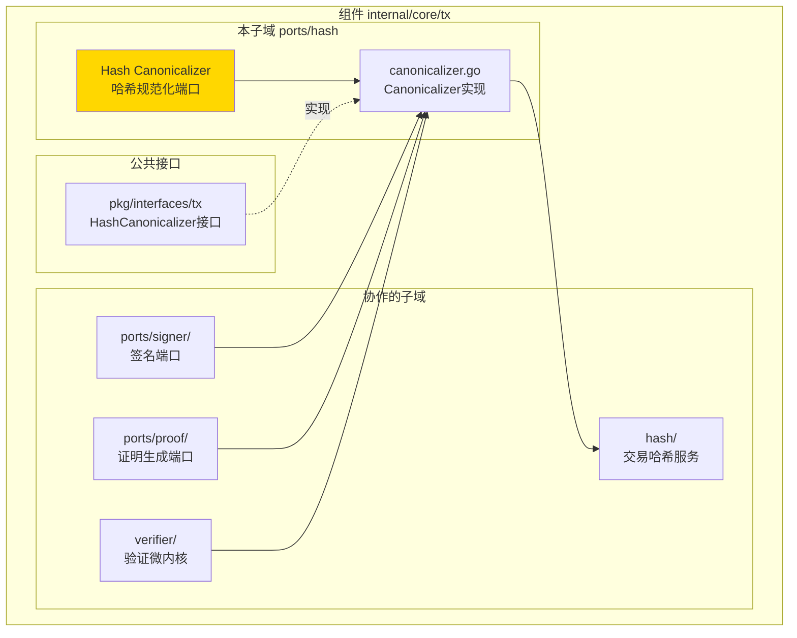
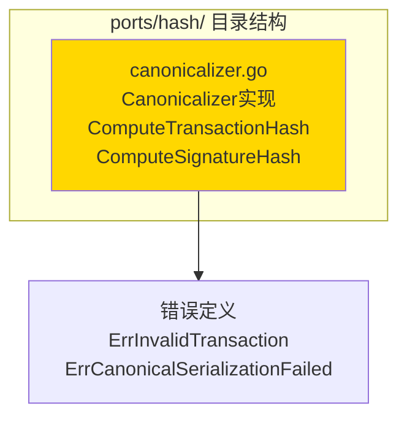
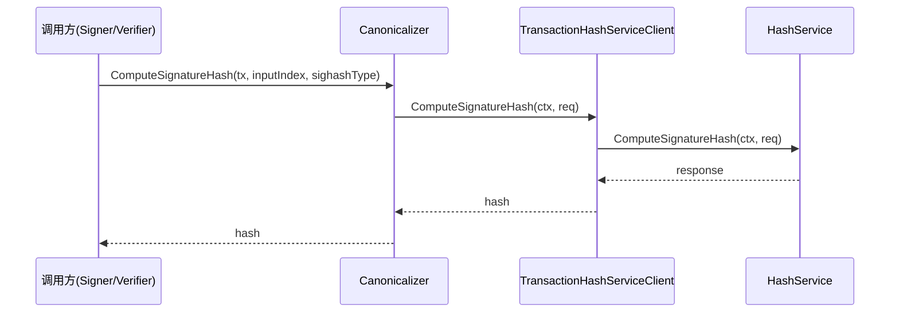

# Hash Canonicalizer（internal/core/tx/ports/hash）

---

## 📌 版本信息

- **版本**：1.0
- **状态**：stable
- **最后更新**：2025-11-30
- **最后审核**：2025-11-30
- **所有者**：TX模块团队
- **适用范围**：internal/core/tx/ports/hash 模块

---

## 🎯 **子域定位**

**路径**：`internal/core/tx/ports/hash/`

**所属组件**：`tx`

**核心职责**：实现规范化交易哈希计算端口，通过 gRPC TransactionHashService 确保哈希计算的一致性。

**在组件中的角色**：
- 实现 `tx.HashCanonicalizer` 公共接口
- 通过 gRPC 服务计算交易哈希和签名哈希
- 确保所有哈希计算统一通过 TransactionHashService
- 支持 SIGHASH 类型处理

---

## 🏗️ **架构设计**

### **在组件中的位置**

> **说明**：展示此子域在组件内部的位置和协作关系



**位置说明**：

| 关系类型 | 目标 | 关系说明 |
|---------|------|---------|
| **协作** | hash/ | 使用 TransactionHashService 计算哈希 |
| **协作** | ports/signer/ | Signer 使用 Canonicalizer 计算签名哈希 |
| **协作** | ports/proof/ | ProofProvider 使用 Canonicalizer 计算交易哈希 |
| **协作** | verifier/ | 验证器使用 Canonicalizer 验证签名 |
| **实现** | pkg/interfaces/tx | 实现公共 HashCanonicalizer 接口 |

### **内部组织**

> **说明**：展示此子域内部的文件组织和类型关系



---

## 📁 **目录结构**

```
internal/core/tx/ports/hash/
├── README.md                    # 本文档
└── canonicalizer.go            # Canonicalizer 实现
```

### **文件职责**

| 文件 | 核心职责 | 关键类型/函数 |
|------|---------|-------------|
| **canonicalizer.go** | 规范化哈希计算器实现 | `Canonicalizer`, `ComputeTransactionHash`, `ComputeSignatureHash` |

---

## 🔗 **依赖与协作**

### **依赖关系**

| 依赖模块 | 依赖接口/类型 | 用途 | 约束条件 |
|---------|--------------|------|---------|
| `internal/core/tx/hash` | `transaction.TransactionHashServiceClient` | 通过 gRPC 计算哈希 | 必须提供 |
| `pkg/interfaces/tx` | `tx.HashCanonicalizer` | 公共接口定义 | 必须实现 |

### **协作流程**



---

## 📊 **核心机制**

### **机制1：规范化哈希计算**

**为什么需要**：交易哈希必须排除签名字段，否则会导致签名验证失败（循环依赖）

**核心思路**：
1. 通过 gRPC TransactionHashService 计算哈希
2. 确保所有哈希计算统一通过 TransactionHashService
3. 支持 SIGHASH 类型处理

**实现策略**：

```go
// 计算交易哈希（用于交易ID）
req := &transaction.ComputeHashRequest{
    Transaction:      tx,
    IncludeDebugInfo: false,
}
resp, err := c.txHashClient.ComputeHash(ctx, req)
return resp.Hash, nil

// 计算签名哈希（用于签名和验证）
req := &transaction.ComputeSignatureHashRequest{
    Transaction:     tx,
    InputIndex:      uint32(inputIndex),
    SighashType:     sighashType,
    IncludeDebugInfo: false,
}
resp, err := c.txHashClient.ComputeSignatureHash(ctx, req)
return resp.Hash, nil
```

### **机制2：统一哈希计算入口**

**为什么需要**：确保所有哈希计算使用相同的算法和规则

**核心思路**：
- 所有哈希计算都通过 gRPC TransactionHashService
- 避免不同模块使用不同的哈希计算方法
- 保证跨平台一致性

---

## 🎓 **使用指南**

### **场景1：在 Signer 中使用**

```go
canonicalizer := hash.NewCanonicalizer(txHashClient)

// 计算签名哈希
sigHash, err := canonicalizer.ComputeSignatureHash(
    ctx, tx, inputIndex, transaction.SignatureHashType_SIGHASH_ALL)
if err != nil {
    return err
}

// 使用 sigHash 进行签名
signature := signer.Sign(sigHash)
```

### **场景2：在 Verifier 中使用**

```go
// 计算签名哈希用于验证
sigHash, err := canonicalizer.ComputeSignatureHashForVerification(
    ctx, tx, inputIndex, sighashType)
if err != nil {
    return err
}

// 验证签名
valid := sigManager.VerifyTransactionSignature(sigHash, signature, pubKey, ...)
```

### **场景3：计算交易ID**

```go
// 计算交易哈希（用于交易ID）
txHash, err := canonicalizer.ComputeTransactionHash(ctx, tx)
if err != nil {
    return err
}

txID := txHash
```

---

## ⚠️ **已知限制**

| 限制 | 影响 | 规避方法 | 未来计划 |
|------|------|---------|---------|
| 依赖 gRPC 服务 | 性能开销 | 使用本地客户端 | 已优化 |

---

## 🔍 **设计权衡记录**

### **权衡1：直接实现 vs 通过 gRPC 服务**

**背景**：哈希计算应该直接实现还是通过 gRPC 服务？

**备选方案**：
1. **直接实现**：优势：性能好 - 劣势：代码重复、不一致风险
2. **通过 gRPC 服务**：优势：统一接口、一致性 - 劣势：有性能开销

**选择**：通过 gRPC 服务

**理由**：
- 确保所有哈希计算使用相同的算法和规则
- 统一接口，便于维护和测试
- 本地客户端可以避免 gRPC 网络开销

**代价**：需要维护 gRPC 服务

---

## 📚 **相关文档**

- **哈希服务**：[hash/README.md](../../hash/README.md) - TransactionHashService 实现
- **公共接口**：`pkg/interfaces/tx` - HashCanonicalizer 接口定义

---

## 📋 **文档变更记录**

| 日期 | 变更内容 | 原因 |
|------|---------|------|
| 2025-11-30 | 创建文档 | 补充缺失的 README 文档 |

---

