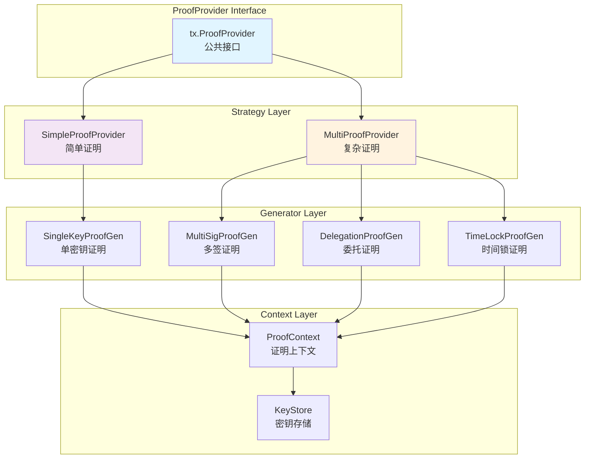
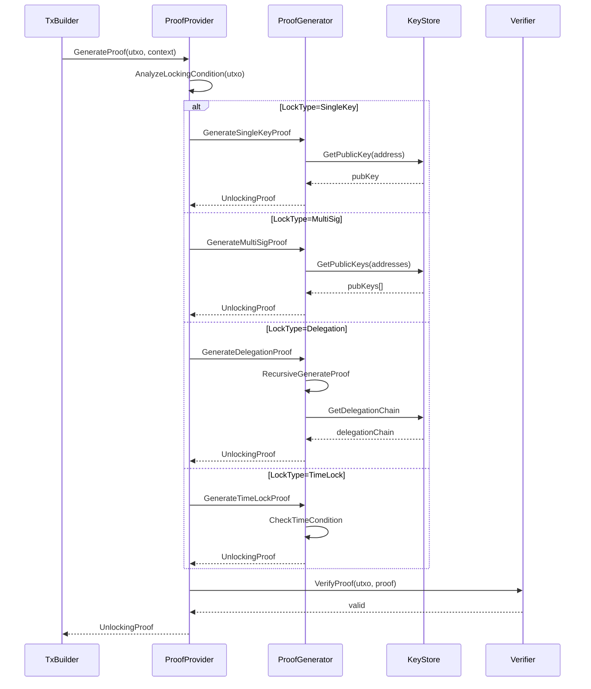
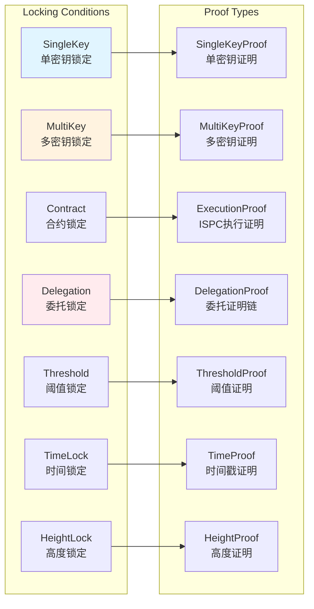

# Proof Provider - 交易证明生成器

## 📍 模块定位

**Proof Provider** 是 `ports/proof` 端口的核心模块，负责在交易构建阶段**生成解锁证明（Unlocking Proof）**，用于证明交易发起者有权消费 UTXO。

### 核心职责

1. **证明生成**：根据 UTXO 的锁定条件（Locking Condition）生成对应的解锁证明
2. **多策略支持**：提供简单证明（Simple）和复杂证明（Multi）两种生成策略
3. **递归证明**：支持嵌套锁定条件（如委托授权的委托）的递归证明生成
4. **证明验证**：生成后立即验证证明有效性（防止错误构造）
5. **上下文管理**：管理证明生成所需的上下文信息（时间戳、区块高度、Nonce 等）

### 在交易构建流程中的位置

```
TxBuilder.AddInputs()
    ↓
TxBuilder.AddProofs() ← 调用 ProofProvider
    ↓
TxBuilder.Build() → ProvenTx
    ↓
Signer.Sign(ProvenTx) → SignedTx
```

---

## 🎯 设计原则与核心约束

### 1. 证明完整性原则

**原则**：生成的证明必须包含验证所需的全部信息。

**约束**：
- ✅ 证明必须包含所有必要的公钥、时间戳、Nonce
- ❌ 禁止生成不完整证明（导致验证失败）
- ✅ 生成后立即调用 `Verifier` 验证

### 2. 隐私保护原则

**原则**：证明中不应暴露不必要的敏感信息。

**约束**：
- ❌ 禁止在证明中包含私钥
- ✅ 仅包含验证所需的公钥
- ✅ 委托证明使用委托链而非原始私钥

### 3. 递归安全原则

**原则**：递归生成委托证明时，必须防止无限递归。

**约束**：
- ✅ 设置最大递归深度（默认 10 层）
- ✅ 检测循环委托（A → B → A）
- ❌ 禁止构造不可验证的证明链

### 4. 策略可扩展原则

**原则**：支持通过配置切换不同的证明生成策略。

**约束**：
- ✅ 定义 `ProofProvider` 统一接口
- ✅ 实现 Simple 和 Multi 两种策略
- ✅ 支持用户自定义策略

---

## 🏗️ 架构设计

### 核心组件



### 证明生成流程



### 锁定条件类型映射



---

## 📊 核心机制

### 1. 简单证明生成器

```go
// SimpleProofProvider 简单证明生成器（仅支持单密钥）
type SimpleProofProvider struct {
    keyStore    crypto.KeyStore
    verifier    tx.TxVerifier
    logger      log.Logger
}

func NewSimpleProofProvider(
    keyStore crypto.KeyStore,
    verifier tx.TxVerifier,
    logger log.Logger,
) *SimpleProofProvider {
    return &SimpleProofProvider{
        keyStore: keyStore,
        verifier: verifier,
        logger:   logger,
    }
}

func (p *SimpleProofProvider) GenerateProof(ctx context.Context, req *ProofRequest) (*UnlockingProof, error) {
    utxo := req.UTXO
    lockingCondition := utxo.LockingCondition
    
    // 仅支持 SingleKey 类型
    if lockingCondition.Type != types.LockType_SingleKey {
        return nil, fmt.Errorf("SimpleProofProvider 仅支持 SingleKey，当前类型=%v", lockingCondition.Type)
    }
    
    // 1. 从锁定条件中提取目标地址
    targetAddress := lockingCondition.SingleKey.Address
    
    // 2. 从 KeyStore 获取公钥
    pubKey, err := p.keyStore.GetPublicKey(targetAddress)
    if err != nil {
        return nil, fmt.Errorf("获取公钥失败: %w", err)
    }
    
    // 3. 构造解锁证明
    proof := &types.UnlockingProof{
        Type: types.ProofType_SingleKey,
        SingleKeyProof: &types.SingleKeyProof{
            PubKey:    pubKey,
            Address:   targetAddress,
        },
    }
    
    // 4. 验证证明（可选，但推荐）
    if err := p.verifyProof(utxo, proof); err != nil {
        return nil, fmt.Errorf("证明验证失败: %w", err)
    }
    
    p.logger.Debugf("生成单密钥证明，地址=%s", targetAddress)
    return proof, nil
}

func (p *SimpleProofProvider) verifyProof(utxo *types.UTXO, proof *types.UnlockingProof) error {
    // 构造一个临时交易用于验证
    tempTx := &types.ComposedTx{
        Inputs: []*types.TxInput{
            {
                UTXO:            utxo,
                UnlockingScript: proof, // 证明作为解锁脚本
            },
        },
        Outputs: []*types.TxOutput{}, // 空输出
    }
    
    // 调用 Verifier 验证 AuthZ
    if err := p.verifier.VerifyAuthZ(context.Background(), tempTx); err != nil {
        return fmt.Errorf("AuthZ 验证失败: %w", err)
    }
    
    return nil
}
```

### 2. 复杂证明生成器

```go
// MultiProofProvider 复杂证明生成器（支持所有锁定类型）
type MultiProofProvider struct {
    keyStore       crypto.KeyStore
    verifier       tx.TxVerifier
    delegationRepo repository.DelegationRepository  // 委托记录仓库
    maxRecursion   int                              // 最大递归深度
    logger         log.Logger
}

func NewMultiProofProvider(
    keyStore crypto.KeyStore,
    verifier tx.TxVerifier,
    delegationRepo repository.DelegationRepository,
    cfg config.Config,
    logger log.Logger,
) *MultiProofProvider {
    return &MultiProofProvider{
        keyStore:       keyStore,
        verifier:       verifier,
        delegationRepo: delegationRepo,
        maxRecursion:   cfg.GetInt("tx.proof.max_recursion", 10),
        logger:         logger,
    }
}

func (p *MultiProofProvider) GenerateProof(ctx context.Context, req *ProofRequest) (*UnlockingProof, error) {
    utxo := req.UTXO
    lockingCondition := utxo.LockingCondition
    
    // 根据锁定类型分发生成逻辑
    switch lockingCondition.Type {
    case types.LockType_SingleKey:
        return p.generateSingleKeyProof(ctx, lockingCondition, req.ProofContext)
    case types.LockType_MultiKey:
        return p.generateMultiKeyProof(ctx, lockingCondition, req.ProofContext)
    case types.LockType_Delegation:
        return p.generateDelegationProof(ctx, lockingCondition, req.ProofContext, 0)
    case types.LockType_Threshold:
        return p.generateThresholdProof(ctx, lockingCondition, req.ProofContext)
    case types.LockType_TimeLock:
        return p.generateTimeLockProof(ctx, lockingCondition, req.ProofContext)
    case types.LockType_HeightLock:
        return p.generateHeightLockProof(ctx, lockingCondition, req.ProofContext)
    default:
        return nil, fmt.Errorf("不支持的锁定类型: %v", lockingCondition.Type)
    }
}

// generateDelegationProof 生成委托证明（支持递归）
func (p *MultiProofProvider) generateDelegationProof(
    ctx context.Context,
    condition *types.LockingCondition,
    proofCtx *ProofContext,
    depth int,
) (*UnlockingProof, error) {
    // 1. 检查递归深度
    if depth > p.maxRecursion {
        return nil, fmt.Errorf("委托证明递归深度超限: %d", depth)
    }
    
    delegationLock := condition.Delegation
    
    // 2. 获取委托记录
    delegation, err := p.delegationRepo.GetDelegation(ctx, delegationLock.DelegationID)
    if err != nil {
        return nil, fmt.Errorf("获取委托记录失败: %w", err)
    }
    
    // 3. 验证委托有效性（时间、撤销状态）
    if err := p.validateDelegation(delegation, proofCtx); err != nil {
        return nil, err
    }
    
    // 4. 获取委托人公钥
    delegatePubKey, err := p.keyStore.GetPublicKey(delegation.Delegate)
    if err != nil {
        return nil, fmt.Errorf("获取委托人公钥失败: %w", err)
    }
    
    // 5. 如果委托人也是委托授权，递归生成证明
    var subProof *types.UnlockingProof
    if delegation.DelegateIsAlsoDelegated {
        subLock := &types.LockingCondition{
            Type:       types.LockType_Delegation,
            Delegation: delegation.SubDelegation,
        }
        subProof, err = p.generateDelegationProof(ctx, subLock, proofCtx, depth+1)
        if err != nil {
            return nil, fmt.Errorf("递归生成子委托证明失败: %w", err)
        }
    }
    
    // 6. 构造委托证明
    proof := &types.UnlockingProof{
        Type: types.ProofType_Delegation,
        DelegationProof: &types.DelegationProof{
            DelegationID:   delegation.ID,
            DelegatePubKey: delegatePubKey,
            Delegator:      delegation.Delegator,
            SubProof:       subProof,  // 递归证明
        },
    }
    
    p.logger.Debugf("生成委托证明，深度=%d, 委托ID=%s", depth, delegation.ID)
    return proof, nil
}

// generateThresholdProof 生成阈值证明（M-of-N）
func (p *MultiProofProvider) generateThresholdProof(
    ctx context.Context,
    condition *types.LockingCondition,
    proofCtx *ProofContext,
) (*UnlockingProof, error) {
    thresholdLock := condition.Threshold
    
    // 1. 检查参数
    if thresholdLock.M > thresholdLock.N {
        return nil, fmt.Errorf("无效的阈值参数: M=%d > N=%d", thresholdLock.M, thresholdLock.N)
    }
    
    // 2. 从 KeyStore 获取所有候选公钥
    var availablePubKeys [][]byte
    for _, addr := range thresholdLock.Addresses {
        pubKey, err := p.keyStore.GetPublicKey(addr)
        if err != nil {
            p.logger.Warnf("跳过地址 %s，无法获取公钥: %v", addr, err)
            continue
        }
        availablePubKeys = append(availablePubKeys, pubKey)
    }
    
    // 3. 检查是否有足够的公钥
    if len(availablePubKeys) < int(thresholdLock.M) {
        return nil, fmt.Errorf("可用公钥不足: 需要 %d，实际 %d", thresholdLock.M, len(availablePubKeys))
    }
    
    // 4. 选择前 M 个公钥（或根据策略选择）
    selectedPubKeys := availablePubKeys[:thresholdLock.M]
    
    // 5. 构造阈值证明
    proof := &types.UnlockingProof{
        Type: types.ProofType_Threshold,
        ThresholdProof: &types.ThresholdProof{
            M:       thresholdLock.M,
            N:       thresholdLock.N,
            PubKeys: selectedPubKeys,
        },
    }
    
    p.logger.Debugf("生成阈值证明，M=%d, N=%d", thresholdLock.M, thresholdLock.N)
    return proof, nil
}

// generateTimeLockProof 生成时间锁证明
func (p *MultiProofProvider) generateTimeLockProof(
    ctx context.Context,
    condition *types.LockingCondition,
    proofCtx *ProofContext,
) (*UnlockingProof, error) {
    timeLock := condition.TimeLock
    
    // 1. 检查时间窗口
    now := proofCtx.Timestamp
    if now < timeLock.NotBefore {
        return nil, fmt.Errorf("时间锁未到期: 当前=%d, 要求>=%d", now, timeLock.NotBefore)
    }
    if timeLock.NotAfter > 0 && now > timeLock.NotAfter {
        return nil, fmt.Errorf("时间锁已过期: 当前=%d, 要求<=%d", now, timeLock.NotAfter)
    }
    
    // 2. 递归生成内部锁定条件的证明
    innerProof, err := p.GenerateProof(ctx, &ProofRequest{
        UTXO: &types.UTXO{
            LockingCondition: timeLock.InnerCondition,
        },
        ProofContext: proofCtx,
    })
    if err != nil {
        return nil, fmt.Errorf("生成内部证明失败: %w", err)
    }
    
    // 3. 构造时间锁证明
    proof := &types.UnlockingProof{
        Type: types.ProofType_TimeLock,
        TimeLockProof: &types.TimeLockProof{
            Timestamp:  now,
            InnerProof: innerProof,
        },
    }
    
    p.logger.Debugf("生成时间锁证明，时间=%d", now)
    return proof, nil
}

func (p *MultiProofProvider) validateDelegation(
    delegation *types.Delegation,
    proofCtx *ProofContext,
) error {
    // 1. 检查委托是否被撤销
    if delegation.Revoked {
        return errors.New("委托已被撤销")
    }
    
    // 2. 检查委托时间范围
    now := proofCtx.Timestamp
    if now < delegation.NotBefore {
        return fmt.Errorf("委托未生效: 当前=%d, 生效时间=%d", now, delegation.NotBefore)
    }
    if delegation.NotAfter > 0 && now > delegation.NotAfter {
        return fmt.Errorf("委托已过期: 当前=%d, 过期时间=%d", now, delegation.NotAfter)
    }
    
    return nil
}
```

### 3. 证明上下文

```go
// ProofContext 证明生成上下文
type ProofContext struct {
    Timestamp   int64   // 当前时间戳（用于 TimeLock）
    BlockHeight uint64  // 当前区块高度（用于 HeightLock）
    Nonce       []byte  // Nonce（用于防重放）
    ChainID     string  // 链 ID（用于跨链）
}

// ProofRequest 证明生成请求
type ProofRequest struct {
    UTXO         *types.UTXO
    ProofContext *ProofContext
}
```

---

## 📁 目录结构

```
proof/
├── README.md                    # 本文档
├── provider_simple.go           # 简单证明生成器（待实现）
├── provider_multi.go            # 复杂证明生成器（待实现）
├── context.go                   # 证明上下文（待实现）
└── utils.go                     # 工具函数（待实现）
```

---

## 🔗 依赖与协作

### 上游依赖

| 依赖模块 | 依赖内容 | 使用方式 |
|---------|---------|---------|
| `pkg/interfaces/tx.ProofProvider` | 证明生成器公共接口 | 实现该接口 |
| `pkg/interfaces/infrastructure/crypto.KeyStore` | 密钥存储 | 获取公钥 |
| `pkg/interfaces/tx.TxVerifier` | 交易验证器 | 验证生成的证明 |
| `pkg/interfaces/repository.DelegationRepository` | 委托记录仓库 | 查询委托记录 |

### 下游使用

- **TxBuilder**：调用 `GenerateProof()` 生成解锁证明
- **Draft Service**：为草稿交易生成证明

---

## 🎓 使用指南

### 配置示例

```yaml
# config/tx.yaml
tx:
  proof:
    # 证明策略：simple 或 multi
    strategy: multi
    
    # 递归深度限制
    max_recursion: 10
    
    # 是否在生成后验证证明
    verify_after_generation: true
```

### 代码示例

```go
// 初始化证明生成器
func initProofProvider(
    cfg config.Config,
    keyStore crypto.KeyStore,
    verifier tx.TxVerifier,
    delegationRepo repository.DelegationRepository,
    logger log.Logger,
) tx.ProofProvider {
    strategy := cfg.GetString("tx.proof.strategy")
    
    switch strategy {
    case "simple":
        return proof.NewSimpleProofProvider(keyStore, verifier, logger)
    case "multi":
        return proof.NewMultiProofProvider(keyStore, verifier, delegationRepo, cfg, logger)
    default:
        logger.Warnf("未知证明策略 %s，使用 multi", strategy)
        return proof.NewMultiProofProvider(keyStore, verifier, delegationRepo, cfg, logger)
    }
}

// 使用证明生成器
func generateUnlockingProof(
    provider tx.ProofProvider,
    utxo *types.UTXO,
    timestamp int64,
    blockHeight uint64,
) (*types.UnlockingProof, error) {
    req := &tx.ProofRequest{
        UTXO: utxo,
        ProofContext: &tx.ProofContext{
            Timestamp:   timestamp,
            BlockHeight: blockHeight,
        },
    }
    
    proof, err := provider.GenerateProof(context.Background(), req)
    if err != nil {
        return nil, fmt.Errorf("证明生成失败: %w", err)
    }
    
    log.Infof("成功生成证明，类型=%v", proof.Type)
    return proof, nil
}
```

---

## ⚠️ 已知限制

### 1. 递归证明深度限制

**限制**：委托证明最多支持 10 层递归（可配置）。

**影响**：超过限制的委托链无法生成证明。

**缓解**：建议链上限制委托深度，避免过深委托。

### 2. 密钥可用性依赖

**限制**：证明生成依赖 KeyStore 中存储的公钥。

**影响**：公钥丢失导致无法生成证明。

**缓解**：实现密钥备份和恢复机制。

### 3. 委托记录同步延迟

**限制**：委托记录从链上同步到本地有延迟（1-3 区块）。

**影响**：新创建的委托可能暂时无法使用。

**缓解**：提示用户等待确认。

---

## 🔍 设计权衡记录

### 权衡 1：Simple vs Multi 策略

**决策**：同时提供两种策略，通过配置切换。

**理由**：
- ✅ **灵活性**：简单场景用 Simple，复杂场景用 Multi
- ✅ **性能**：Simple 避免不必要的复杂逻辑
- ⚠️ **维护成本**：需要维护两套代码

**建议**：大多数场景使用 Multi，仅测试用 Simple。

### 权衡 2：生成后验证 vs 信任生成

**决策**：默认在生成后调用 Verifier 验证证明。

**理由**：
- ✅ **安全性**：及早发现错误证明
- ✅ **调试友好**：快速定位问题
- ⚠️ **性能开销**：额外的验证调用（约 5-10ms）

**实施**：可通过配置关闭验证（不推荐）。

### 权衡 3：递归深度 10 vs 无限制

**决策**：限制递归深度为 10 层。

**理由**：
- ✅ **防止滥用**：避免恶意构造超长委托链
- ✅ **性能保障**：递归调用开销可控
- ⚠️ **灵活性**：极少数场景可能需要更深

**监控**：记录实际递归深度分布。

---

## 📚 相关文档

- **上层设计**：`ports/README.md` - 端口架构总览
- **架构文档**：`_docs/architecture/TX_STATE_MACHINE_ARCHITECTURE.md`
- **公共接口**：`pkg/interfaces/tx/proof.go`

---

## 🏷️ 模块状态

- **当前状态**：⏳ **待实现**
- **设计完成度**：100%（本文档）
- **代码实现度**：0%（仅 `package` 声明）
- **测试覆盖率**：0%

**下一步**：
1. 实现简单证明生成器
2. 实现复杂证明生成器（含递归逻辑）
3. 实现证明上下文管理
4. 编写单元测试
5. 添加递归深度监控

---

**最后更新**：2025-10-23
