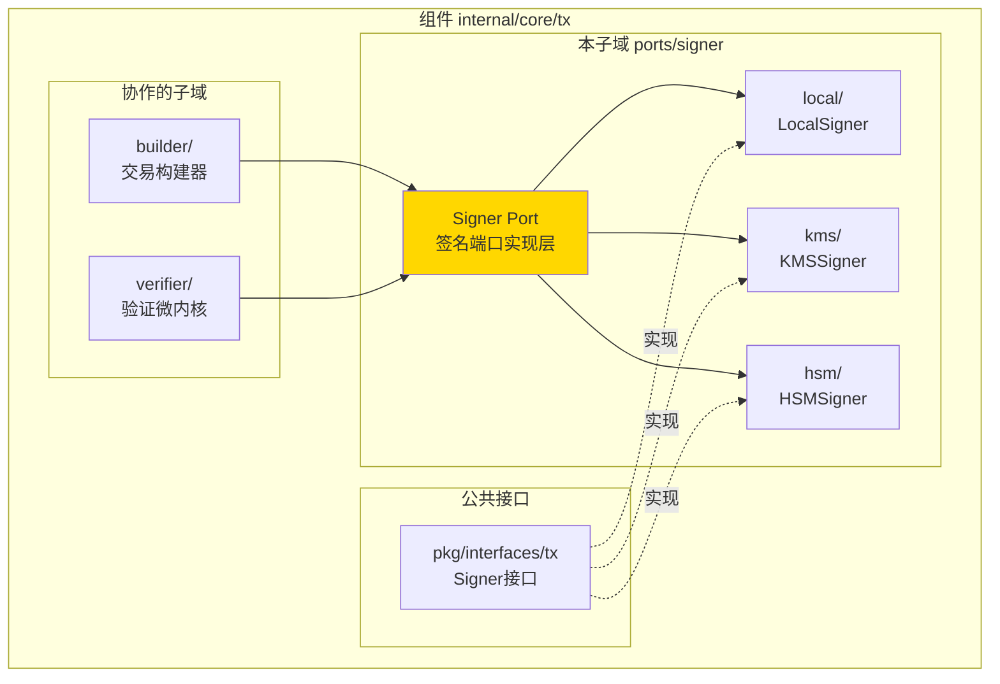
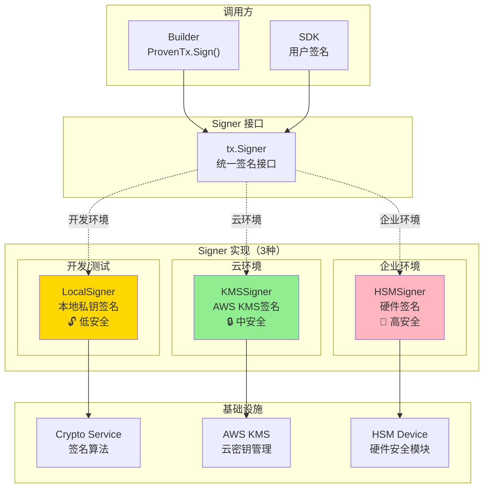
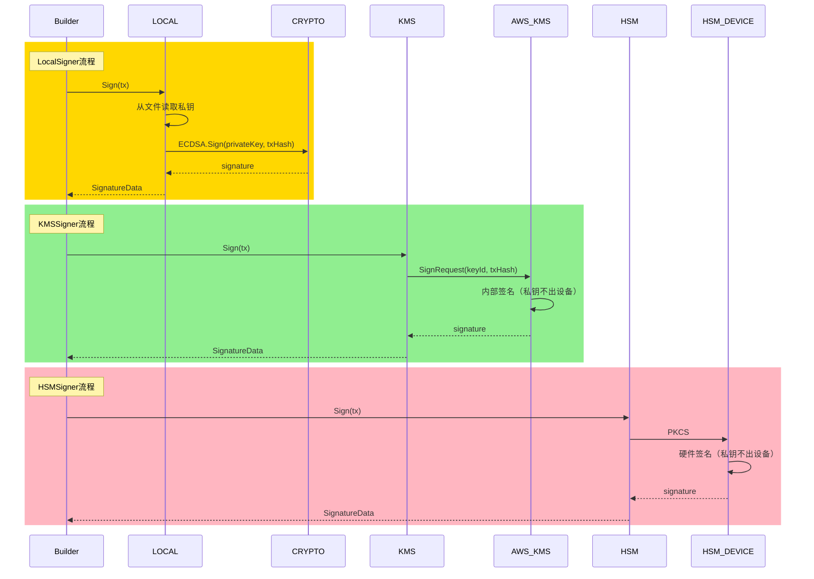
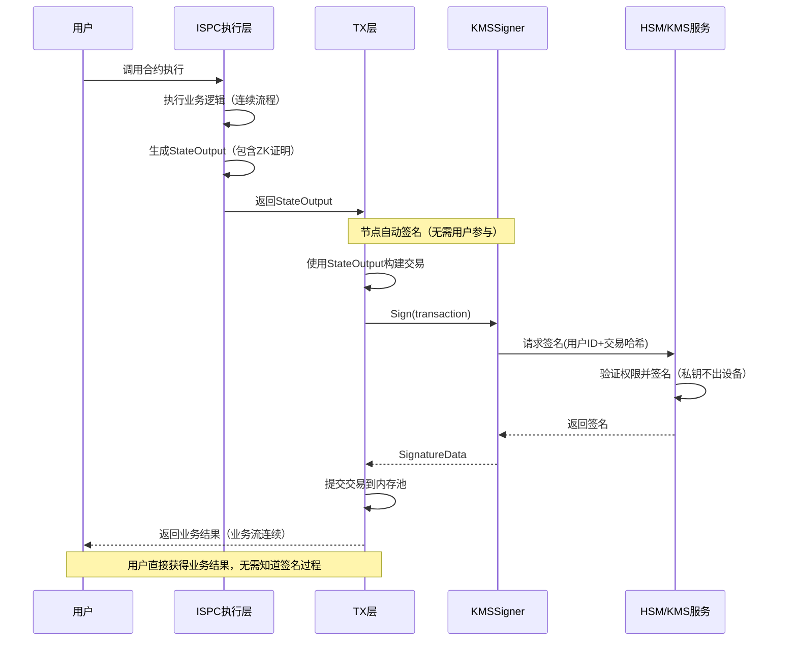

# Signer Port（internal/core/tx/ports/signer）

---

## 📌 版本信息

- **版本**：1.0
- **状态**：stable
- **最后更新**：2025-11-30
- **最后审核**：2025-11-30
- **所有者**：TX模块团队
- **适用范围**：internal/core/tx/ports/signer 模块

---

## 🎯 **子域定位**

**路径**：`internal/core/tx/ports/signer/`

**所属组件**：`tx`

**核心职责**：提供3种Signer实现（Local、KMS、HSM），支持多种签名算法和密钥管理方式。

**在组件中的角色**：
- 本地签名（LocalSigner）：开发/测试环境，私钥本地存储
- 云端签名（KMSSigner）：云环境，私钥托管在AWS KMS
- 硬件签名（HSMSigner）：企业环境，私钥存储在HSM设备

**解决什么问题**：
- 本地签名（LocalSigner）：开发/测试环境，私钥本地存储
- 云端签名（KMSSigner）：云环境，私钥托管在AWS KMS
- 硬件签名（HSMSigner）：企业环境，私钥存储在HSM设备

**不解决什么问题**（边界）：
- ❌ 不管理密钥生成（由外部工具生成）
- ❌ 不存储私钥明文（除LocalSigner测试场景）
- ❌ 不做签名验证（由Crypto接口负责）
- ❌ 不管理密钥权限（由KMS/HSM管理）

---

## 🏗️ **架构设计**

### **在组件中的位置**

> **说明**：展示此子域在组件内部的位置和协作关系



**位置说明**：

| 关系类型 | 目标 | 关系说明 |
|---------|------|---------|
| **协作** | builder/ | builder 使用 Signer 签名交易 |
| **协作** | verifier/ | verifier 使用 Signer 验证签名 |
| **实现** | pkg/interfaces/tx | 实现公共 Signer 接口 |

### **整体架构**



### **3种实现对照表**

| 实现 | 安全级别 | 性能 | 成本 | 私钥存储 | 典型场景 | 生产可用 |
|------|---------|------|------|---------|---------|---------|
| **LocalSigner** | 低 | 极快 | 免费 | 本地文件/内存 | 开发、测试 | ❌ |
| **KMSSigner** | 中 | 快 | 中 | AWS KMS | 云环境、中小企业 | ✅ |
| **HSMSigner** | 高 | 中 | 高 | HSM设备 | 企业、金融 | ✅ |

### **签名流程对比**



---

## 📊 **核心机制**

### **机制1：统一签名接口**

**为什么需要**：不同环境使用不同签名方式，但调用方无需感知

**接口定义**：

```go
// pkg/interfaces/tx/ports.go
type Signer interface {
    // Sign 对交易签名
    Sign(ctx context.Context, tx *transaction.Transaction) (*transaction.SignatureData, error)
    
    // PublicKey 获取对应的公钥
    PublicKey() (*transaction.PublicKey, error)
    
    // Algorithm 返回签名算法
    Algorithm() transaction.SignatureAlgorithm
}
```

**使用示例**：

```go
// Builder 调用签名（对实现透明）
func (s *Service) Sign(ctx context.Context, proven *types.ProvenTx, signer tx.Signer) (*types.SignedTx, error) {
    // 1. 计算交易哈希
    txHash := computeTxHash(proven.Tx)
    
    // 2. 调用Signer签名（不关心是Local、KMS还是HSM）
    signature, err := signer.Sign(ctx, proven.Tx)
    if err != nil {
        return nil, fmt.Errorf("签名失败: %w", err)
    }
    
    // 3. 构造SignedTx
    return &types.SignedTx{
        Tx:        proven.Tx,
        Signature: signature,
        PublicKey: signer.PublicKey(),
    }, nil
}
```

### **机制2：依赖注入切换实现**

**为什么需要**：不同环境使用不同签名器，通过配置切换

**切换方式**：

```go
// module.go
func Module() fx.Option {
    return fx.Module("tx",
        fx.Provide(
            // 方式1：开发环境 - LocalSigner
            fx.Annotate(
                signer.NewLocalSigner,
                fx.As(new(tx.Signer)),
            ),
            
            // 方式2：云环境 - KMSSigner
            // fx.Annotate(
            //     signer.NewKMSSigner,
            //     fx.As(new(tx.Signer)),
            // ),
            
            // 方式3：企业环境 - HSMSigner
            // fx.Annotate(
            //     hsm.NewHSMSigner,
            //     fx.As(new(tx.Signer)),
            // ),
        ),
    )
}
```

**配置文件切换**：

```json
// config/development/signer.json
{
  "signer": {
    "type": "local",
    "local": {
      "privateKeyPath": "./keys/dev.pem",
      "algorithm": "ECDSA_SECP256K1"
    }
  }
}

// config/production/signer.json
{
  "signer": {
    "type": "kms",
    "kms": {
      "keyId": "arn:aws:kms:us-east-1:123456789:key/abc-def",
      "region": "us-east-1",
      "algorithm": "ECDSA_SECP256K1"
    }
  }
}
```

### **机制3：Canonical序列化**

**为什么需要**：确保签名一致性，不同节点签名相同交易结果一致

**Canonical规则**：

```
1. 字段顺序固定（按Protobuf定义顺序）
2. 空字段省略（nil字段不序列化）
3. 数组/Map按确定性顺序（如字典序）
4. 浮点数规范化（避免精度问题）
```

**实现示例**：

```go
func computeTxHash(tx *transaction.Transaction) []byte {
    // 1. Canonical序列化
    canonical := &transaction.Transaction{
        Inputs:     sortInputs(tx.Inputs),       // 输入排序
        Outputs:    sortOutputs(tx.Outputs),     // 输出排序
        Nonce:      tx.Nonce,
        Timestamp:  tx.Timestamp,
        // 签名字段不参与哈希计算
    }
    
    // 2. Protobuf序列化
    bytes, _ := proto.Marshal(canonical)
    
    // 3. 计算哈希
    return sha256.Sum256(bytes)
}
```

### **机制4：签名算法支持**

**支持的算法**：

| 算法 | 曲线/方案 | 签名长度 | 性能 | 安全性 | 使用场景 |
|------|----------|---------|------|--------|---------|
| **ECDSA_SECP256K1** | secp256k1 | 64-72字节 | 快 | 高 | 比特币、以太坊兼容 |
| **ECDSA_P256** | NIST P-256 | 64-72字节 | 快 | 高 | 企业标准 |
| **ED25519** | Curve25519 | 64字节 | 极快 | 高 | 现代推荐 |

**算法选择示例**：

```go
type LocalSigner struct {
    privateKey crypto.PrivateKey
    algorithm  transaction.SignatureAlgorithm
}

func (s *LocalSigner) Algorithm() transaction.SignatureAlgorithm {
    return s.algorithm  // ECDSA_SECP256K1 / ED25519
}

func (s *LocalSigner) Sign(ctx context.Context, tx *transaction.Transaction) (*transaction.SignatureData, error) {
    txHash := computeTxHash(tx)
    
    switch s.algorithm {
    case transaction.SignatureAlgorithm_ECDSA_SECP256K1:
        return s.signECDSA(txHash)
    case transaction.SignatureAlgorithm_ED25519:
        return s.signED25519(txHash)
    default:
        return nil, fmt.Errorf("不支持的签名算法: %v", s.algorithm)
    }
}
```

---

## 📁 **目录结构**

```
internal/core/tx/ports/signer/
├── README.md                        # 本文档
├── local/
│   ├── service.go                   # LocalSigner 实现
│   └── README.md                    # Local详细说明
├── kms/
│   ├── service.go                   # KMSSigner 实现
│   └── README.md                    # KMS详细说明
└── hsm/
    ├── service.go                   # HSMSigner 实现
    └── README.md                    # HSM详细说明
```

---

## 🔗 **依赖与协作**

### **依赖关系**

| 实现 | 依赖接口/库 | 用途 |
|------|------------|------|
| **LocalSigner** | crypto.Crypto | 本地签名算法实现 |
| **KMSSigner** | AWS SDK for Go | 调用AWS KMS API |
| **HSMSigner** | PKCS#11 库 | 与HSM设备通信 |

### **调用流程**

```mermaid
graph LR
    subgraph "调用方"
        USER["用户/SDK"]
        BUILDER["Builder"]
    end
    
    subgraph "签名流程"
        PROVEN["ProvenTx"]
        SIGNER["Signer"]
        SIGNED["SignedTx"]
    end
    
    USER -->|1. 构建交易| PROVEN
    PROVEN -->|2. proven.Sign()| SIGNER
    SIGNER -->|3. 签名| SIGNER
    SIGNER -->|4. 返回| SIGNED
    SIGNED -->|5. 提交| PROCESSOR
```

---

## 🎓 **使用指南**

### **场景1：开发环境使用LocalSigner**

```go
// 1. 生成密钥对（外部工具）
// openssl ecparam -name secp256k1 -genkey -out dev.pem

// 2. 配置LocalSigner
config := &signer.LocalSignerConfig{
    PrivateKeyPath: "./keys/dev.pem",
    Algorithm:      transaction.SignatureAlgorithm_ECDSA_SECP256K1,
}

signer, err := signer.NewLocalSigner(config, cryptoService)

// 3. 使用签名
proven := builder.CreateProvenTx(ctx, composed, proofProvider)
signed, err := proven.Sign(ctx, signer)
```

### **场景2：生产环境使用KMSSigner（ISPC业务流不中断的核心方案）**

**🎯 核心价值**：KMS 签名器是实现 ISPC 业务流不中断的关键基础设施。

**工作原理**：
1. **用户预先授权（一次性）**：用户将私钥托管到 KMS，设置授权策略
2. **节点自动签名（无需用户参与）**：ISPC 执行完成后，节点自动使用 KMS 签名
3. **业务流连续**：整个过程无需用户提供私钥或手动签名

**ISPC 执行流程中的签名**：


**配置示例**：
```go
// 1. 在AWS KMS创建密钥（控制台/CLI）
// aws kms create-key --description "WES Production Signing Key"

// 2. 配置KMSSigner
config := &signer.KMSSignerConfig{
    KeyID:     "arn:aws:kms:us-east-1:123456789:key/abc-def",
    Algorithm: transaction.SignatureAlgorithm_ECDSA_SECP256K1,
    RetryCount: 3,
    SignTimeout: 5 * time.Second,
    Environment: "production",
}

// 3. 创建KMS客户端（需要实现KMSClient接口）
kmsClient := awskms.NewClient(config) // 示例：AWS KMS客户端

// 4. 创建KMSSigner
kmssigner, err := signer.NewKMSSigner(
    config,
    kmsClient,
    txHashClient,
    hashManager,
    logger,
)

// 5. 使用签名（与LocalSigner完全相同）
signed, err := proven.Sign(ctx, kmssigner)
```

**关键优势**：
- ✅ **业务流连续**：不需要中断等待用户签名
- ✅ **安全性高**：私钥永不离开 KMS/HSM，硬件级别保护
- ✅ **权限可控**：细粒度权限控制（金额、操作类型、时间窗口）
- ✅ **审计完整**：所有签名操作都有审计日志

### **场景3：多签名交易**

```go
// 使用不同Signer为同一交易签名
signer1 := signer.NewLocalSigner(config1)  // Alice
signer2 := signer.NewKMSSigner(config2)      // Bob

// 第一个签名
signed1, err := proven.Sign(ctx, signer1)

// 追加第二个签名
signed2, err := signed1.AddSignature(ctx, signer2)

// 验证：MultiKey锁需要2个签名
// Verifier会验证两个签名都有效
```

---

## ⚠️ **已知限制**

| 限制 | 影响 | 规避方法 | 未来计划 |
|------|------|---------|---------|
| LocalSigner不安全 | 生产环境风险 | 禁止生产使用 | 配置检查，生产环境报错 |
| KMS网络延迟 | 签名速度慢 | 批量签名优化 | 本地缓存公钥 |
| HSM设备单点 | 设备故障影响签名 | 多设备备份 | 高可用方案 |
| 算法固定 | 无法动态切换 | 配置文件指定 | 支持多算法并存 |

---

## 🔍 **设计权衡记录**

### **权衡1：LocalSigner是否支持生产**

**背景**：LocalSigner安全性低，是否完全禁用

**备选方案**：
1. **禁止生产**：配置检查，生产报错 - 优势：安全 - 劣势：不灵活
2. **允许但警告**：生产可用但记录警告 - 优势：灵活 - 劣势：存在风险

**选择**：禁止生产

**理由**：
- 私钥明文存储风险太大
- 生产环境应使用KMS/HSM
- 强制安全优先

**代价**：开发和生产配置不同

### **权衡2：签名算法如何选择**

**背景**：支持哪些签名算法

**备选方案**：
1. **仅ECDSA**：比特币/以太坊标准 - 优势：兼容性好 - 劣势：性能一般
2. **仅ED25519**：现代推荐 - 优势：性能好 - 劣势：兼容性差
3. **都支持**：灵活选择 - 优势：灵活 - 劣势：实现复杂

**选择**：都支持

**理由**：
- 不同场景需求不同
- ED25519性能更好，适合高频场景
- ECDSA兼容性好，适合对接外部系统

**代价**：需要维护多套签名实现

---

## 📚 **相关文档**

- **LocalSigner详细设计**：[local/README.md](./local/README.md) - 本地签名器实现
- **KMSSigner详细设计**：[kms/README.md](./kms/README.md) - AWS KMS签名器实现
- **HSMSigner详细设计**：[hsm/README.md](./hsm/README.md) - HSM签名器实现
- **Crypto接口**：[pkg/interfaces/infrastructure/crypto](../../../../pkg/interfaces/infrastructure/crypto) - 签名算法接口

---

## 📋 **文档变更记录**

| 日期 | 变更内容 | 原因 |
|------|---------|------|
| 2025-11-30 | 移除旧格式标记 | 符合文档规范 |
| 2025-11-30 | 添加"在组件中的位置"图 | 符合 subdirectory-readme.md 模板要求 |
| 2025-11-30 | 调整章节标题和顺序 | 符合模板规范 |
| 2025-10-23 | 创建完整Signer端口设计文档 | 提供签名器架构说明 |
| 2025-10-23 | 补齐3种实现对比、切换机制、代码示例 | 完善设计细节 |

---

> 📝 **实现指导**
>
> 本文档定义了 Signer 端口的完整架构，包括：
> 1. **3种实现**：LocalSigner（开发）、KMSSigner（云）、HSMSigner（企业）
> 2. **统一接口**：tx.Signer，3种实现可透明切换
> 3. **依赖注入切换**：通过配置文件和fx切换实现
> 4. **Canonical序列化**：确保签名一致性
> 5. **多算法支持**：ECDSA、ED25519
>
> 实现时严格区分开发和生产环境，禁止生产环境使用LocalSigner。
