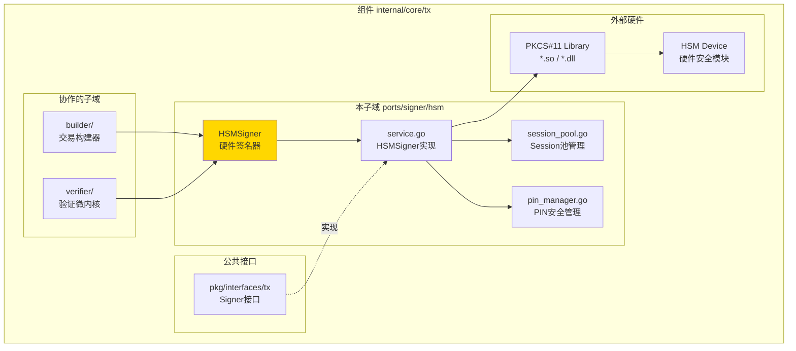
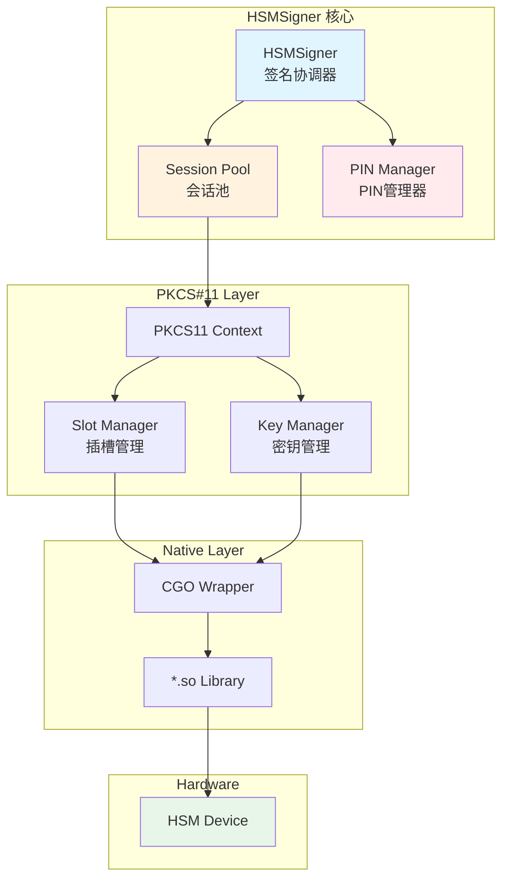
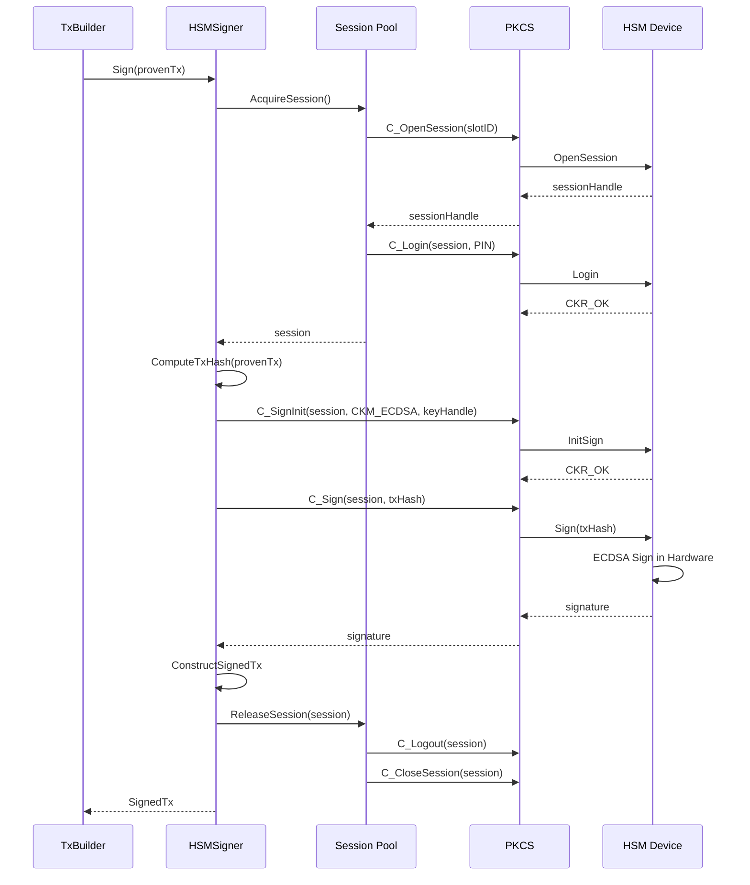
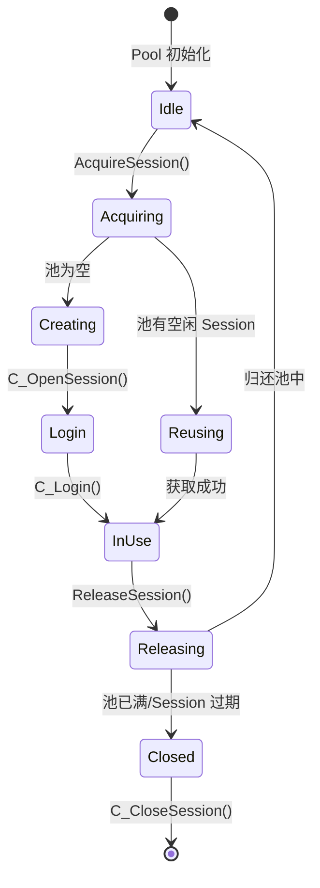

# HSMSigner - 硬件安全模块签名器（internal/core/tx/ports/signer/hsm）

---

## 📌 版本信息

- **版本**：1.0
- **状态**：stable
- **最后更新**：2025-11-30
- **最后审核**：2025-11-30
- **所有者**：TX模块团队
- **适用范围**：internal/core/tx/ports/signer/hsm 模块

---

## 🎯 **子域定位**

**路径**：`internal/core/tx/ports/signer/hsm/`

**所属组件**：`tx`

**核心职责**：通过集成符合 PKCS#11 标准的硬件安全模块（Hardware Security Module，HSM）实现交易签名。

**在组件中的角色**：
- 硬件级密钥保护：私钥存储在通过 FIPS 140-2 Level 3/4 认证的 HSM 设备中，物理防篡改
- PKCS#11 标准集成：通过标准 C API 与 HSM 设备通信，支持主流 HSM 厂商
- 本地化部署：HSM 设备与节点物理连接（PCIe/USB）或同网络部署，无云端依赖
- 金融级合规：满足银行、证券、保险等行业的最高安全要求
- 高性能签名：硬件加速的密码学运算，签名速度可达 10000+ TPS

**解决什么问题**：
- 硬件级密钥保护：私钥存储在通过 FIPS 140-2 Level 3/4 认证的 HSM 设备中，物理防篡改
- PKCS#11 标准集成：通过标准 C API 与 HSM 设备通信，支持主流 HSM 厂商
- 本地化部署：HSM 设备与节点物理连接（PCIe/USB）或同网络部署，无云端依赖
- 金融级合规：满足银行、证券、保险等行业的最高安全要求
- 高性能签名：硬件加速的密码学运算，签名速度可达 10000+ TPS

**不解决什么问题**（边界）：
- ❌ 不管理密钥生成（由HSM设备管理）
- ❌ 不存储私钥（私钥在HSM设备中）
- ❌ 不做签名验证（由Crypto接口负责）
- ❌ 不管理密钥权限（由HSM设备管理）

---

## 🎯 **设计原则与核心约束**

### **设计原则**

#### 1. 零私钥导出原则

**原则**：私钥在 HSM 设备内生成和使用，永不离开硬件边界。

**约束**：
- ❌ 禁止调用 `C_GetAttributeValue` 导出私钥
- ❌ 禁止使用 `CKA_EXTRACTABLE` 标志创建密钥
- ✅ 所有签名操作在 HSM 内部完成

#### 2. Session 生命周期管理原则

**原则**：PKCS#11 Session 是有限资源，必须高效管理和复用。

**约束**：
- ✅ 使用 Session 池（Pool）复用 Session
- ✅ 登录 Session 后自动登出（defer cleanup）
- ❌ 禁止泄漏 Session 句柄（resource leak）

#### 3. PIN 安全处理原则

**原则**：HSM PIN 码是最高敏感信息，必须安全存储和传输。

**约束**：
- ✅ PIN 从环境变量或加密配置中读取
- ❌ 禁止在日志中打印 PIN
- ✅ 内存中的 PIN 使用后立即清零（`memset(0)`）

#### 4. 厂商无关抽象原则

**原则**：通过 PKCS#11 标准接口实现，避免绑定特定 HSM 厂商。

**约束**：
- ✅ 仅使用 PKCS#11 v2.40 标准 API
- ❌ 避免使用厂商专有扩展（除非必要）
- ✅ 通过配置切换 PKCS#11 库路径

---

## 🏗️ **架构设计**

### **在组件中的位置**

> **说明**：展示此子域在组件内部的位置和协作关系



**位置说明**：

| 关系类型 | 目标 | 关系说明 |
|---------|------|---------|
| **协作** | builder/ | builder 使用 HSMSigner 签名交易 |
| **协作** | verifier/ | verifier 使用 HSMSigner 验证签名 |
| **实现** | pkg/interfaces/tx | 实现公共 Signer 接口 |
| **边界** | PKCS#11 Library | 通过标准API与HSM设备通信 |

### **核心组件**



### 签名流程



### Session 池设计



---

## 📊 核心机制

### 1. PKCS#11 初始化

```go
// HSMSigner PKCS#11 签名器
type HSMSigner struct {
    ctx         *pkcs11.Ctx
    slotID      uint
    keyLabel    string
    keyHandle   pkcs11.ObjectHandle
    sessionPool *SessionPool
    pinManager  *PINManager
    logger      log.Logger
}

func NewHSMSigner(cfg config.Config, logger log.Logger) (*HSMSigner, error) {
    // 1. 加载 PKCS#11 库
    libPath := cfg.GetString("tx.signer.hsm.library_path")
    ctx := pkcs11.New(libPath)
    if ctx == nil {
        return nil, fmt.Errorf("failed to load PKCS#11 library: %s", libPath)
    }
    
    // 2. 初始化库
    if err := ctx.Initialize(); err != nil {
        return nil, fmt.Errorf("C_Initialize failed: %w", err)
    }
    
    // 3. 获取 Slot 列表
    slots, err := ctx.GetSlotList(true) // 仅获取有 token 的 slot
    if err != nil {
        ctx.Finalize()
        return nil, fmt.Errorf("C_GetSlotList failed: %w", err)
    }
    
    if len(slots) == 0 {
        ctx.Finalize()
        return nil, errors.New("no HSM slot found")
    }
    
    slotID := slots[0] // 使用第一个 slot
    
    // 4. 初始化 PIN 管理器
    pinManager, err := NewPINManager(cfg, logger)
    if err != nil {
        ctx.Finalize()
        return nil, err
    }
    
    // 5. 初始化 Session 池
    poolSize := cfg.GetInt("tx.signer.hsm.session_pool_size", 10)
    sessionPool := NewSessionPool(ctx, slotID, pinManager, poolSize, logger)
    
    // 6. 查找签名密钥
    keyLabel := cfg.GetString("tx.signer.hsm.key_label")
    keyHandle, err := findKeyByLabel(ctx, slotID, keyLabel)
    if err != nil {
        sessionPool.Close()
        ctx.Finalize()
        return nil, fmt.Errorf("key not found: %w", err)
    }
    
    logger.Infof("HSMSigner 初始化成功，Slot=%d, Key=%s", slotID, keyLabel)
    
    return &HSMSigner{
        ctx:         ctx,
        slotID:      slotID,
        keyLabel:    keyLabel,
        keyHandle:   keyHandle,
        sessionPool: sessionPool,
        pinManager:  pinManager,
        logger:      logger,
    }, nil
}

// findKeyByLabel 通过标签查找私钥
func findKeyByLabel(ctx *pkcs11.Ctx, slotID uint, label string) (pkcs11.ObjectHandle, error) {
    session, err := ctx.OpenSession(slotID, pkcs11.CKF_SERIAL_SESSION)
    if err != nil {
        return 0, err
    }
    defer ctx.CloseSession(session)
    
    // 搜索模板：私钥 + 标签
    template := []*pkcs11.Attribute{
        pkcs11.NewAttribute(pkcs11.CKA_CLASS, pkcs11.CKO_PRIVATE_KEY),
        pkcs11.NewAttribute(pkcs11.CKA_LABEL, label),
    }
    
    if err := ctx.FindObjectsInit(session, template); err != nil {
        return 0, err
    }
    defer ctx.FindObjectsFinal(session)
    
    objects, _, err := ctx.FindObjects(session, 1)
    if err != nil {
        return 0, err
    }
    
    if len(objects) == 0 {
        return 0, fmt.Errorf("key with label '%s' not found", label)
    }
    
    return objects[0], nil
}
```

### 2. Session 池实现

```go
// SessionPool Session 会话池
type SessionPool struct {
    ctx        *pkcs11.Ctx
    slotID     uint
    pinManager *PINManager
    maxSize    int
    
    mu        sync.Mutex
    sessions  []pkcs11.SessionHandle
    inUse     map[pkcs11.SessionHandle]bool
    
    logger    log.Logger
}

func (p *SessionPool) AcquireSession(ctx context.Context) (pkcs11.SessionHandle, error) {
    p.mu.Lock()
    defer p.mu.Unlock()
    
    // 1. 尝试从池中获取空闲 Session
    for len(p.sessions) > 0 {
        session := p.sessions[len(p.sessions)-1]
        p.sessions = p.sessions[:len(p.sessions)-1]
        
        // 检查 Session 是否仍然有效
        if p.isSessionValid(session) {
            p.inUse[session] = true
            return session, nil
        }
        
        // Session 无效，关闭并继续
        p.ctx.CloseSession(session)
    }
    
    // 2. 池为空，创建新 Session
    if len(p.inUse) >= p.maxSize {
        return 0, errors.New("session pool exhausted")
    }
    
    session, err := p.createSession()
    if err != nil {
        return 0, err
    }
    
    p.inUse[session] = true
    return session, nil
}

func (p *SessionPool) ReleaseSession(session pkcs11.SessionHandle) {
    p.mu.Lock()
    defer p.mu.Unlock()
    
    delete(p.inUse, session)
    
    // 登出 Session
    p.ctx.Logout(session)
    
    // 归还池中（如果池未满）
    if len(p.sessions) < p.maxSize {
        p.sessions = append(p.sessions, session)
    } else {
        p.ctx.CloseSession(session)
    }
}

func (p *SessionPool) createSession() (pkcs11.SessionHandle, error) {
    // 1. 打开 Session
    session, err := p.ctx.OpenSession(p.slotID, pkcs11.CKF_SERIAL_SESSION|pkcs11.CKF_RW_SESSION)
    if err != nil {
        return 0, fmt.Errorf("C_OpenSession failed: %w", err)
    }
    
    // 2. 登录
    pin, err := p.pinManager.GetPIN()
    if err != nil {
        p.ctx.CloseSession(session)
        return 0, err
    }
    
    if err := p.ctx.Login(session, pkcs11.CKU_USER, pin); err != nil {
        p.ctx.CloseSession(session)
        return 0, fmt.Errorf("C_Login failed: %w", err)
    }
    
    // 3. 清零 PIN（安全）
    for i := range pin {
        pin[i] = 0
    }
    
    return session, nil
}

func (p *SessionPool) isSessionValid(session pkcs11.SessionHandle) bool {
    _, err := p.ctx.GetSessionInfo(session)
    return err == nil
}
```

### 3. PIN 安全管理

```go
// PINManager PIN 管理器
type PINManager struct {
    pin    []byte
    mu     sync.RWMutex
    logger log.Logger
}

func NewPINManager(cfg config.Config, logger log.Logger) (*PINManager, error) {
    // 方式1：从环境变量读取（生产推荐）
    if pin := os.Getenv("HSM_PIN"); pin != "" {
        logger.Info("从环境变量 HSM_PIN 加载 PIN")
        return &PINManager{
            pin:    []byte(pin),
            logger: logger,
        }, nil
    }
    
    // 方式2：从加密配置读取
    encryptedPIN := cfg.GetString("tx.signer.hsm.encrypted_pin")
    if encryptedPIN != "" {
        pin, err := decryptPIN(encryptedPIN, cfg)
        if err != nil {
            return nil, err
        }
        logger.Info("从加密配置加载 PIN")
        return &PINManager{
            pin:    pin,
            logger: logger,
        }, nil
    }
    
    return nil, errors.New("HSM PIN not configured")
}

func (m *PINManager) GetPIN() (string, error) {
    m.mu.RLock()
    defer m.mu.RUnlock()
    
    if len(m.pin) == 0 {
        return "", errors.New("PIN not available")
    }
    
    return string(m.pin), nil
}

func (m *PINManager) ClearPIN() {
    m.mu.Lock()
    defer m.mu.Unlock()
    
    for i := range m.pin {
        m.pin[i] = 0
    }
    m.pin = nil
}
```

### 4. 签名实现

```go
func (s *HSMSigner) Sign(ctx context.Context, provenTx *types.ProvenTx) (*types.SignedTx, error) {
    // 1. 计算交易哈希
    txHash := s.computeTxHash(provenTx)
    
    // 2. 获取 Session
    session, err := s.sessionPool.AcquireSession(ctx)
    if err != nil {
        return nil, fmt.Errorf("acquire session failed: %w", err)
    }
    defer s.sessionPool.ReleaseSession(session)
    
    // 3. 初始化签名操作
    mechanism := []*pkcs11.Mechanism{
        pkcs11.NewMechanism(pkcs11.CKM_ECDSA, nil),
    }
    
    if err := s.ctx.SignInit(session, mechanism, s.keyHandle); err != nil {
        return nil, fmt.Errorf("C_SignInit failed: %w", err)
    }
    
    // 4. 执行签名
    signature, err := s.ctx.Sign(session, txHash)
    if err != nil {
        return nil, fmt.Errorf("C_Sign failed: %w", err)
    }
    
    // 5. 转换 DER 编码签名为 (r, s) 格式
    r, s, err := parseDERSignature(signature)
    if err != nil {
        return nil, fmt.Errorf("parse signature failed: %w", err)
    }
    
    // 6. 构造 SignedTx
    signedTx := &types.SignedTx{
        ProvenTx: provenTx,
        Signatures: []types.Signature{
            {
                R: r,
                S: s,
                PubKey: provenTx.Inputs[0].UnlockingScript.PubKey, // 假设第一个输入
            },
        },
    }
    
    s.logger.Debugf("交易签名成功，TxHash=%x", txHash)
    return signedTx, nil
}
```

---

## 📁 目录结构

```
hsm/
├── README.md                    # 本文档
├── service.go                   # HSMSigner 实现（待实现）
├── session_pool.go              # Session 池管理（待实现）
├── pin_manager.go               # PIN 安全管理（待实现）
├── pkcs11_wrapper.go            # PKCS#11 CGO 封装（待实现）
└── errors.go                    # 错误类型定义（待实现）
```

---

## 🔗 依赖与协作

### 上游依赖

| 依赖模块 | 依赖内容 | 使用方式 |
|---------|---------|---------|
| `pkg/interfaces/tx.Signer` | 签名器公共接口 | 实现该接口 |
| `pkg/interfaces/infrastructure/crypto` | 哈希计算 | 计算交易哈希 |
| `pkg/interfaces/config` | 配置管理 | 读取 HSM 配置 |

### 外部依赖

```go
// PKCS#11 Go 绑定
"github.com/miekg/pkcs11"
```

### 下游使用

- **TxBuilder**：调用 `Sign()` 方法完成交易签名
- **Draft Service**：用于签名草稿交易

---

## 🎓 使用指南

### 配置示例

```yaml
# config/tx.yaml
tx:
  signer:
    type: hsm
    hsm:
      # PKCS#11 库路径
      library_path: /usr/lib/softhsm/libsofthsm2.so
      
      # 密钥标签
      key_label: tx-signing-key
      
      # PIN 配置（生产环境使用环境变量 HSM_PIN）
      encrypted_pin: "AES_ENCRYPTED_BASE64_STRING"
      
      # Session 池配置
      session_pool_size: 10
      session_timeout: 30s
```

### 环境变量

```bash
# 生产环境 PIN 配置
export HSM_PIN="YOUR_HSM_PIN"

# PKCS#11 库路径（可选，覆盖配置文件）
export PKCS11_LIBRARY="/opt/thales/libCryptoki2_64.so"
```

### 代码示例

```go
// 初始化 HSMSigner
func initHSMSigner(cfg config.Config, logger log.Logger) (tx.Signer, error) {
    signer, err := hsm.NewHSMSigner(cfg, logger)
    if err != nil {
        return nil, fmt.Errorf("初始化 HSMSigner 失败: %w", err)
    }
    
    return signer, nil
}

// 使用 HSMSigner 签名
func signTransaction(signer tx.Signer, provenTx *types.ProvenTx) (*types.SignedTx, error) {
    ctx, cancel := context.WithTimeout(context.Background(), 5*time.Second)
    defer cancel()
    
    signedTx, err := signer.Sign(ctx, provenTx)
    if err != nil {
        return nil, fmt.Errorf("签名失败: %w", err)
    }
    
    return signedTx, nil
}
```

---

## ⚠️ 已知限制

### 1. PKCS#11 库厂商差异

**限制**：不同 HSM 厂商的 PKCS#11 实现存在细微差异（特别是错误码和扩展功能）。

**影响**：可能需要厂商特定的适配代码。

**缓解**：优先使用 PKCS#11 v2.40 标准功能，避免专有扩展。

### 2. Session 资源限制

**限制**：HSM 设备的并发 Session 数有上限（通常 10-100）。

**影响**：高并发签名可能耗尽 Session 资源。

**缓解**：使用 Session 池 + 超时机制，监控 Session 使用率。

### 3. 硬件故障风险

**限制**：HSM 设备故障导致签名服务不可用。

**影响**：单点故障风险。

**缓解**：
- 使用 HSM 集群（主备模式）
- 监控 HSM 健康状态
- 准备降级方案

---

## 🔍 设计权衡记录

### 权衡 1：Session 池 vs 每次创建

**决策**：使用 Session 池复用 Session。

**理由**：
- ✅ **性能提升**：避免频繁创建/销毁 Session（耗时约 50ms）
- ✅ **资源节约**：HSM Session 数量有限
- ⚠️ **复杂性**：需要管理 Session 生命周期

**监控**：记录池的命中率和 Session 泄漏。

### 权衡 2：PIN 明文内存 vs 每次输入

**决策**：PIN 在内存中明文存储（进程生命周期）。

**理由**：
- ✅ **便利性**：避免每次签名都输入 PIN
- ✅ **性能**：减少交互延迟
- ⚠️ **安全风险**：内存转储可能泄漏 PIN

**缓解**：使用 `mlock()` 防止 PIN 被交换到磁盘。

### 权衡 3：单一 HSM vs 多 HSM

**决策**：当前仅支持单一 HSM 设备。

**理由**：
- ✅ **简单性**：大多数场景只需一个 HSM
- ⚠️ **可用性**：单点故障风险

**未来**：考虑支持多 HSM 主备模式。

---

## 📚 **相关文档**

- **上层设计**：`ports/signer/README.md` - 签名器架构总览
- **兄弟模块**：`ports/signer/local/README.md` - LocalSigner 设计
- **兄弟模块**：`ports/signer/kms/README.md` - KMSSigner 设计
- **架构文档**：`_docs/architecture/TX_STATE_MACHINE_ARCHITECTURE.md`
- **公共接口**：`pkg/interfaces/tx/signer.go`

---

## 📋 **文档变更记录**

| 日期 | 变更内容 | 原因 |
|------|---------|------|
| 2025-11-30 | 移除旧格式标记 | 符合文档规范 |
| 2025-11-30 | 添加"在组件中的位置"图 | 符合 subdirectory-readme.md 模板要求 |
| 2025-11-30 | 调整章节标题和顺序 | 符合模板规范 |
| 2025-10-23 | 创建完整HSMSigner设计文档 | 提供硬件签名器实现说明 |
| 2025-10-23 | 补齐PKCS#11集成、Session池、PIN管理、代码示例 | 完善设计细节 |

---

## 🏷️ **模块状态**

- **当前状态**：⏳ **待实现**
- **设计完成度**：100%（本文档）
- **代码实现度**：0%（仅 `package` 声明）
- **测试覆盖率**：0%

**下一步**：
1. 集成 `github.com/miekg/pkcs11` 库
2. 实现 Session 池
3. 实现 PIN 管理器
4. 编写单元测试（使用 SoftHSM 模拟）
5. 添加性能基准测试

---
