# TX Processor（internal/core/tx/processor）

---

## 📌 版本信息

- **版本**：1.0
- **状态**：stable
- **最后更新**：2025-11-30
- **最后审核**：2025-11-30
- **所有者**：TX模块团队
- **适用范围**：internal/core/tx/processor 模块

---

## 🎯 **实现定位**

**路径**：`internal/core/tx/processor/`

**目的**：提供交易处理的统一入口实现，实现内部接口，并通过 `module.go` 配置依赖注入。

**核心原则**：
- ✅ 实现内部接口（interfaces.Processor）
- ✅ 通过 `module.go` 统一管理依赖注入
- ✅ 保持实现与接口分离
- ✅ 遵循 SOLID 原则

**解决什么问题**：
- **统一入口**：为上层（ISPC、CLI、Blockchain）提供统一的交易处理接口
- **网络集成**：从 P2P 网络接收交易并处理（解析 → 去重 → 验证 → 入池）
- **状态跟踪**：监听交易生命周期事件，维护统计和性能指标
- **流程协调**：协调 Verifier + TxPool 完成交易的验证和提交

**不解决什么问题**（边界）：
- ❌ 不实现交易验证逻辑（委托给 TxPool，TxPool 内部调用 Verifier）
- ❌ 不实现交易构建逻辑（由 Builder 模块负责）
- ❌ 不实现交易广播逻辑（由 TxPool 内部处理）
- ❌ 不实现 UTXO 管理逻辑（复用 repository.UTXOManager）

---

## 🏗️ **架构设计**

### **整体架构**

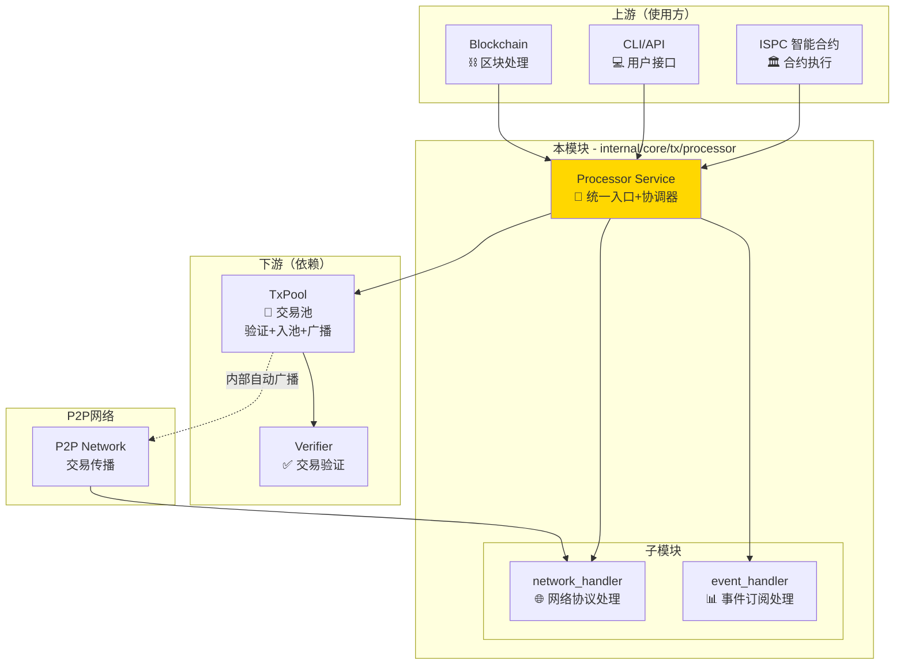

### **内部结构**

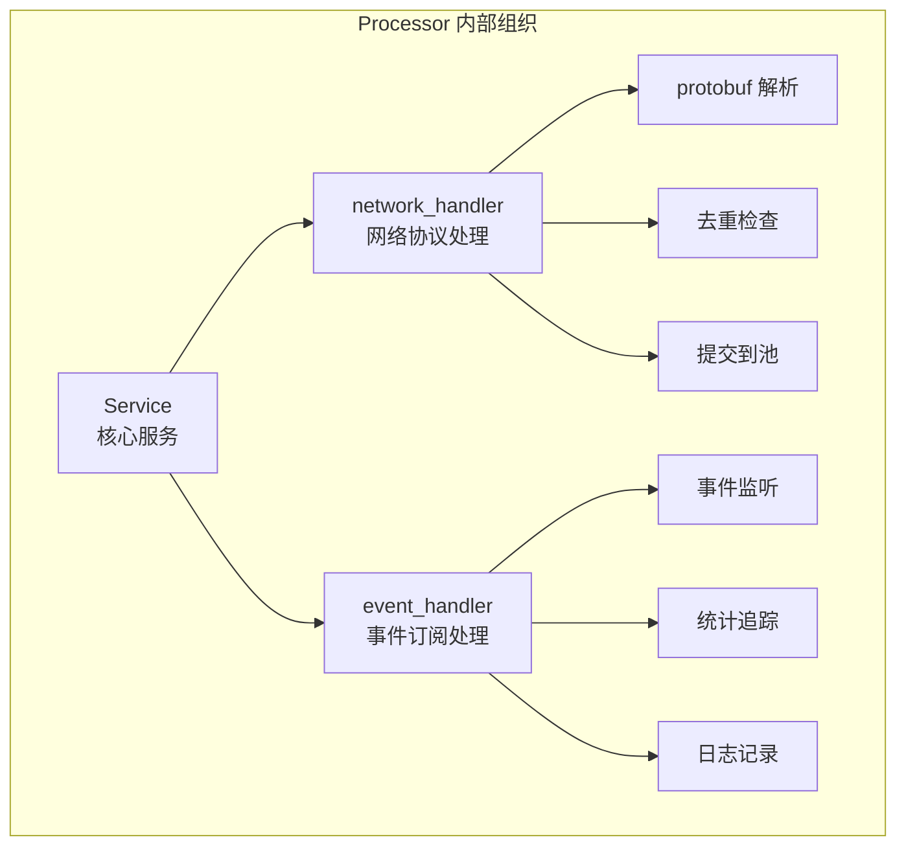

**子域说明**：

| 子域 | 核心组件 | 职责 | 协作关系 |
|-----|---------|------|---------|
| **network_handler** | NetworkHandler | 网络协议处理 | 实现 TxAnnounceRouter 和 TxProtocolRouter |
| **event_handler** | EventHandler | 事件订阅处理 | 实现 TransactionEventSubscriber |

### **依赖关系**

> **说明**：展示本组件依赖的外部组件接口

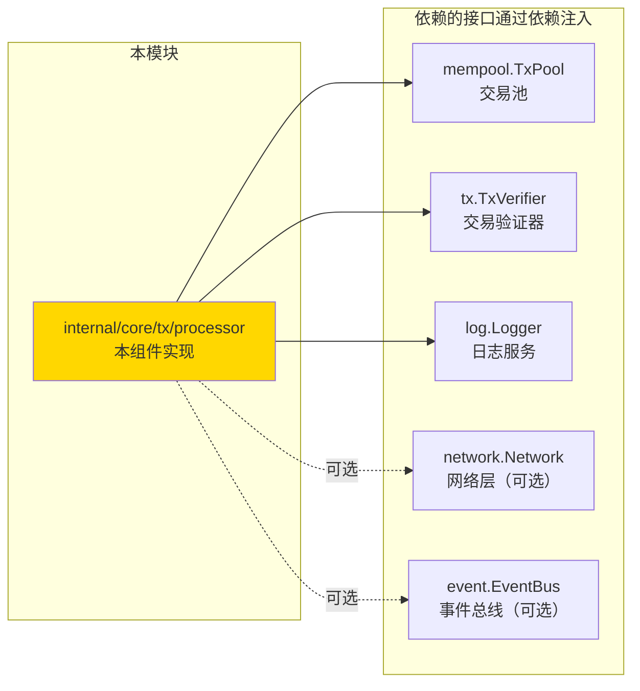

---

## ⚙️ **依赖注入配置（module.go）**

> **说明**：展示 Processor 在 `module.go` 中的依赖注入配置

### **配置说明**

Processor 通过 `module.go` 统一配置依赖注入，包括：
1. **核心服务提供**：Processor Service 实例创建
2. **接口绑定**：同时绑定内部接口和公共接口
3. **网络集成注册**：自动注册网络协议处理器
4. **事件集成注册**：自动注册事件订阅

### **依赖注入表**

| 依赖类型 | 依赖接口 | 注入方式 | 用途 |
|---------|---------|---------|------|
| **TxPool** | `mempool.TxPool` | 命名依赖 `name:"tx_pool"` | 交易验证、入池、广播 |
| **Verifier** | `tx.TxVerifier` | 未命名依赖 | 交易验证（通过 TxPool） |
| **Logger** | `log.Logger` | 未命名依赖 | 日志记录 |
| **Network** | `network.Network` | ModuleInput（可选） | 网络协议注册 |
| **EventBus** | `event.EventBus` | ModuleInput（可选） | 事件订阅注册 |

### **module.go 配置代码**

```go
// Processor Service 提供
fx.Provide(
    fx.Annotate(
        processorPkg.NewService,
        fx.ParamTags(
            ``,               // tx.TxVerifier
            `name:"tx_pool"`, // mempool.TxPool
            ``,               // log.Logger
        ),
    ),
    
    // 提供接口实现（从具体类型转换）
    func(svc *processorPkg.Service) interfaces.Processor {
        return svc
    },
    func(svc *processorPkg.Service) tx.TxProcessor {
        return svc
    },
),

// 网络与事件集成注册
fx.Invoke(func(
    inputs ModuleInput,
    processorSvc *processorPkg.Service
) error {
    // P9.1: 注册网络协议处理器
    if inputs.Network != nil {
        txNetworkIntegration.RegisterTxStreamHandlers(
            inputs.Network,
            processorSvc, // Processor 实现了 TxProtocolRouter
            logger,
        )
        txNetworkIntegration.RegisterSubscribeHandlers(
            inputs.Network,
            processorSvc, // Processor 实现了 TxAnnounceRouter
            logger,
        )
    }
    
    // P9.2: 注册事件订阅
    if inputs.EventBus != nil {
        eventRegistry := txEventIntegration.NewEventSubscriptionRegistry(
            inputs.EventBus,
            logger,
            processorSvc, // Processor 实现了 TransactionEventSubscriber
            nil,
        )
        eventRegistry.RegisterEventSubscriptions()
    }
    
    return nil
}),
```

### **注册流程图**

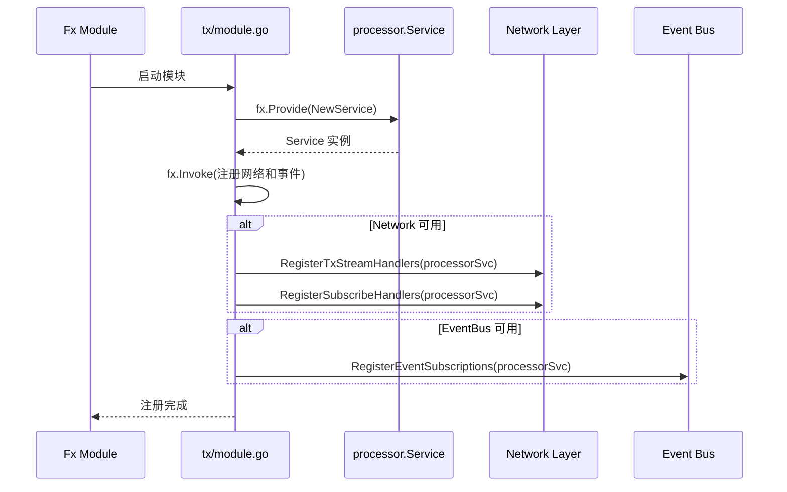

---

## 📊 **核心机制**

### **机制1：交易提交流程**

**为什么需要**：提供统一的交易提交入口，确保所有交易都经过正确的验证流程

**核心思路**：薄协调层，委托给 TxPool 处理

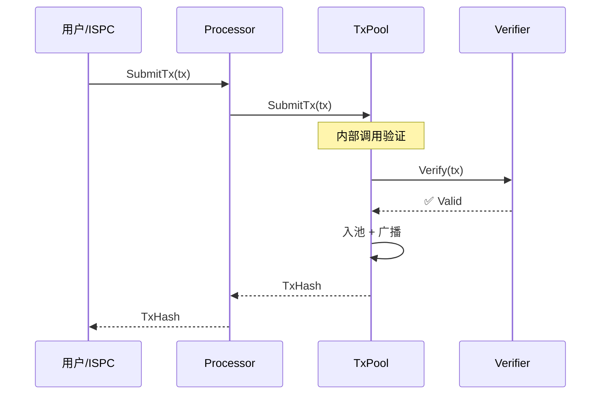

**关键约束**：
- Processor 不实现验证逻辑，委托给 TxPool
- TxPool 内部会自动调用 Verifier 进行验证
- 验证通过后 TxPool 自动广播到 P2P 网络

**设计权衡**：

| 方案 | 优势 | 劣势 | 为什么选择 |
|------|------|------|-----------|
| 当前方案：委托给 TxPool | 职责清晰，TxPool 统一处理 | Processor 依赖 TxPool | 保持 Processor 的简洁性 |
| 备选方案：Processor 直接验证 | Processor 独立性强 | 职责过重，重复代码 | 违反单一职责原则 |

### **机制2：网络交易接收（NetworkHandler）**

**为什么需要**：从 P2P 网络接收交易并集成到系统中

**核心思路**：network_handler 薄委托层，只做解析和转发

**核心特性**：
- ✅ **双重保障传播机制**：支持主要路径（GossipSub）和备份路径（Stream RPC）
- ✅ **交易公告处理**：处理来自 P2P 网络的交易广播
- ✅ **交易直连传播**：处理交易哈希列表请求和响应
- ✅ **去重检查**：避免重复处理同一交易
- ✅ **自动提交**：解析后自动提交到 TxPool

**实现的接口**：
```go
// integration/network.TxAnnounceRouter - 订阅协议（主要传播路径）
type TxAnnounceRouter interface {
    HandleTransactionAnnounce(ctx context.Context, from peer.ID, topic string, data []byte) error
}

// integration/network.TxProtocolRouter - 流式协议（备用传播路径）
type TxProtocolRouter interface {
    HandleTransactionDirect(ctx context.Context, from peer.ID, reqBytes []byte) ([]byte, error)
}
```

**交易公告处理流程（HandleTransactionAnnounce）**：
```
1. 解析 TransactionAnnouncement protobuf 消息
   ↓
2. 验证消息完整性
   - 交易哈希长度（32字节）
   - 完整交易数据存在
   - 时间戳有效
   ↓
3. 去重检查
   - 查询交易是否已在内存池中
   - 如果已存在，跳过处理
   ↓
4. 提交到内存池
   - TxPool.SubmitTx()
   - TxPool 内部执行验证
   ↓
5. 返回处理结果
```

**交易直连传播处理流程（HandleTransactionDirect）**：
```
1. 解析 TransactionPropagationRequest 请求
   ↓
2. 验证请求有效性
   - 交易哈希列表非空
   - RequestId 存在
   ↓
3. 处理交易哈希列表
   - 验证每个交易哈希格式（32字节）
   - 检查交易是否已在内存池中
   - 返回处理状态（ACCEPTED/DUPLICATE/REJECTED）
   ↓
4. 构造 TransactionPropagationResponse 响应
   - 统计接受/重复/拒绝数量
   - 序列化响应
   ↓
5. 返回响应字节
```

**使用场景**：

**场景 1：交易广播通告（主要传播路径）**
```go
// GossipSub 订阅模式，fire-and-forget 全网广播
announcement := &txProtocol.TransactionAnnouncement{
    TransactionHash: txHash,
    Transaction:     tx,
    Timestamp:       time.Now().Unix(),
    MessageId:       uuid.New().String(),
}

// 网络层自动调用 HandleTransactionAnnounce
// NetworkHandler 解析、验证、提交到内存池
```

**场景 2：交易直连传播（备用传播路径）**
```go
// Stream RPC 模式，请求-响应
request := &txProtocol.TransactionPropagationRequest{
    TxHashes:  [][]byte{txHash1, txHash2, txHash3},
    RequestId: uuid.New().String(),
}

// 网络层调用 HandleTransactionDirect
// NetworkHandler 返回每个交易的处理状态
response := &txProtocol.TransactionPropagationResponse{
    RequestId:    request.RequestId,
    Transactions: []*TransactionStatus{...},
    Success:      true,
}
```

**设计亮点**：
- 🔥 **双重保障**：GossipSub + Stream RPC，确保交易传播可靠性
- 🔥 **去重机制**：避免重复处理，节省资源
- 🔥 **薄委托层**：不实现业务逻辑，只做流程编排
- 🔥 **统一归口**：处理所有交易相关的网络消息

**关键约束**：
- 只负责接收，不负责主动广播
- 提交前必须去重检查
- 委托给 TxPool 进行验证

### **机制3：事件状态跟踪（EventHandler）**

**为什么需要**：提供交易处理的可观测性，维护统计信息

**核心思路**：event_handler 被动监听，只做统计不修改状态

**核心特性**：
- ✅ **交易生命周期跟踪**：从接收到确认的完整跟踪
- ✅ **内存池事件监听**：添加和移除事件
- ✅ **统计数据维护**：接收、验证、执行、确认、失败计数
- ✅ **性能指标**：平均验证时间、执行时间
- ✅ **事件转发**：发布内部事件通知

**实现的接口**：
```go
// integration/event.TransactionEventSubscriber
type TransactionEventSubscriber interface {
    // 交易生命周期事件
    HandleTransactionReceived(eventData *types.TransactionReceivedEventData) error
    HandleTransactionValidated(eventData *types.TransactionValidatedEventData) error
    HandleTransactionExecuted(eventData *types.TransactionExecutedEventData) error
    HandleTransactionFailed(eventData *types.TransactionFailedEventData) error
    HandleTransactionConfirmed(eventData *types.TransactionConfirmedEventData) error
    
    // 内存池事件
    HandleMempoolTransactionAdded(eventData *types.TransactionReceivedEventData) error
    HandleMempoolTransactionRemoved(eventData *types.TransactionRemovedEventData) error
}
```

**交易生命周期事件流**：
```
TransactionReceived (接收)
          ↓
TransactionValidated (验证)
          ↓
TransactionExecuted (执行)
          ↓
TransactionConfirmed (确认)
```

**失败路径**：
```
TransactionReceived → TransactionFailed
TransactionValidated → TransactionFailed
TransactionExecuted → TransactionFailed
```

**事件处理详情**：

**1. HandleTransactionReceived（交易接收）**
- 更新接收计数器
- 记录交易基本信息（发送者、接收者、金额）
- 发布交易接收确认事件

**2. HandleTransactionValidated（交易验证）**
- 检查验证结果，更新统计
- 对验证失败的交易记录错误原因
- 发布验证结果事件

**3. HandleTransactionExecuted（交易执行）**
- 记录执行结果和费用消耗
- 更新执行统计和性能指标
- 发布执行结果事件

**4. HandleTransactionConfirmed（交易确认）**
- 更新确认计数器
- 记录确认区块信息
- 发布确认事件

**5. HandleMempoolTransactionRemoved（内存池移除）**
- 更新移除统计
- 记录移除原因（确认/过期/拒绝）
- 发布移除事件

**统计信息获取**：
- `GetTransactionStats()` - 获取交易统计信息
- `GetPerformanceMetrics()` - 获取性能指标
- `GetLastProcessTime()` - 获取最后处理时间

**设计亮点**：
- 🔥 **完整生命周期**：覆盖从接收到确认的完整流程
- 🔥 **线程安全**：使用 mutex 保护统计数据
- 🔥 **事件转发**：支持发布内部事件通知
- 🔥 **性能监控**：记录平均验证和执行时间

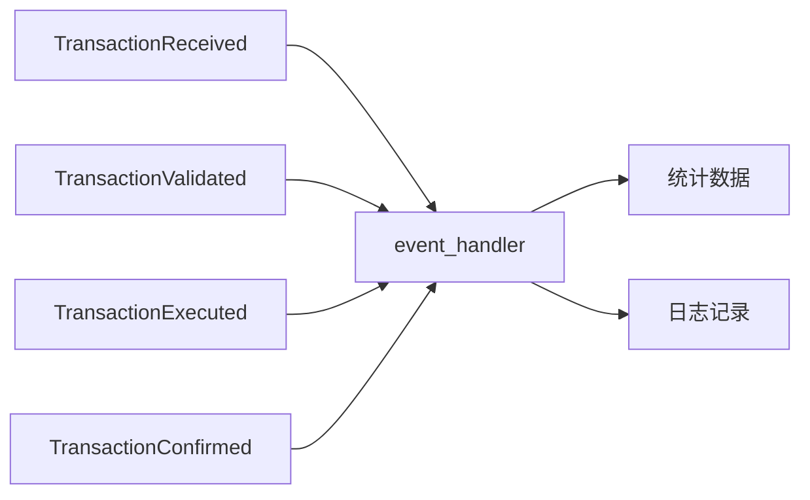

**关键约束**：
- 只监听不修改：不能修改交易状态
- 线程安全：所有统计数据必须线程安全
- 不阻塞流程：事件处理不能阻塞主流程

---

## 🔗 **依赖与协作**

### **依赖关系图**

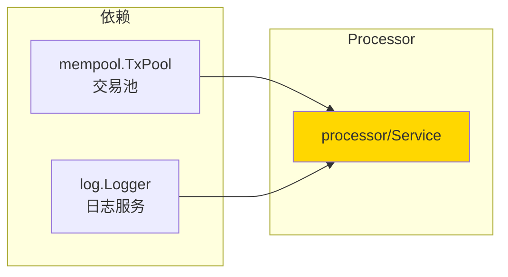

### **依赖说明**

| 依赖模块 | 依赖接口 | 用途 | 约束条件 |
|---------|---------|------|---------|
| **mempool** | `TxPool` | 交易验证、入池、广播 | TxPool 内部处理所有验证和广播逻辑 |
| **infrastructure** | `log.Logger` | 日志记录 | 可选依赖 |

---

## 📁 **目录结构**

```
processor/
├── service.go              # Service 核心实现 | 统一入口+协调器
├── network_handler/        # 网络协议处理子模块
│   ├── handler.go         # NetworkHandler 实现
│   └── README.md          # 网络处理器文档
├── event_handler/          # 事件订阅处理子模块
│   ├── handler.go         # EventHandler 实现
│   └── README.md          # 事件处理器文档
└── README.md               # 本文档 | 模块总览
```

### **组织原则**

| 文件/目录 | 职责 | 为什么这样组织 |
|----------|------|---------------|
| `service.go` | 核心服务实现 | 实现 Processor 接口，协调子模块 |
| `network_handler/` | 网络协议处理 | 独立子模块，职责单一 |
| `event_handler/` | 事件订阅处理 | 独立子模块，职责单一 |

---

## 🔄 **核心流程**

### **流程1：用户提交交易**

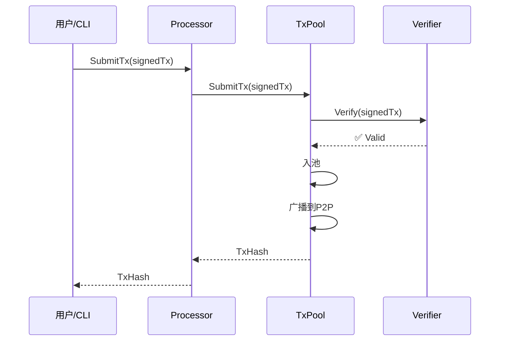

### **流程2：网络接收交易**

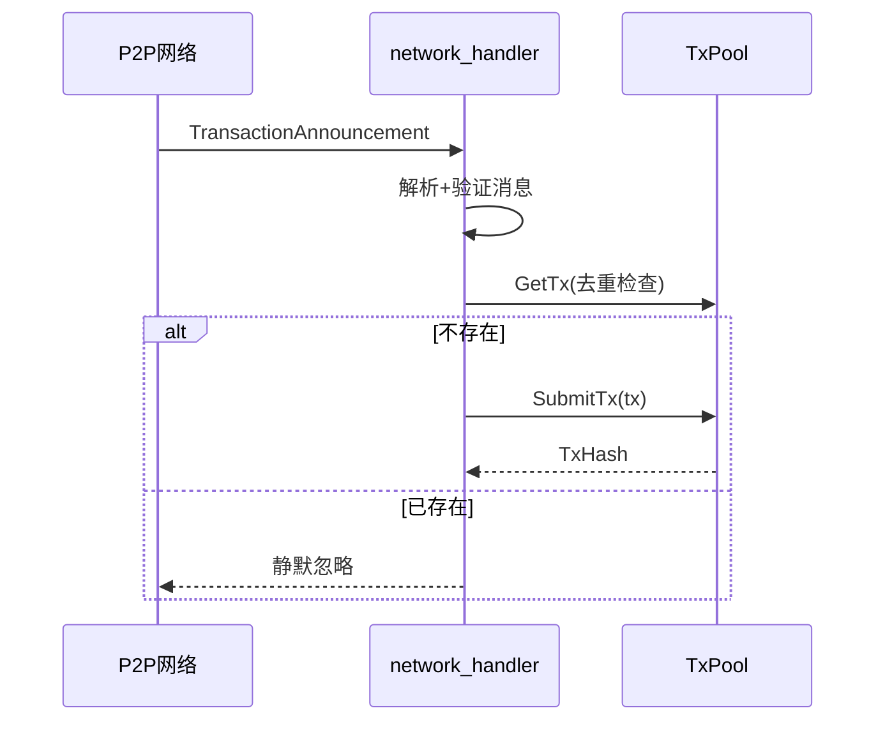

### **关键点**

| 阶段 | 核心逻辑 | 为什么这样做 | 约束条件 |
|------|---------|------------|---------|
| **提交** | 委托给 TxPool | 保持 Processor 简洁 | 不能跳过验证 |
| **网络接收** | 解析+去重+提交 | 避免重复交易 | 只接收不广播 |
| **事件监听** | 更新统计+记录日志 | 提供可观测性 | 不修改状态 |

---

## 🎓 **使用指南**

### **典型场景1：用户转账**

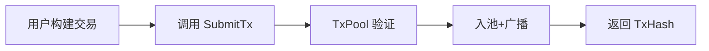

**关键点**：
- 输入要满足：SignedTransaction 必须有完整的 proof 和 signature
- 输出保证：验证通过后交易已在 TxPool 中，网络已自动广播
- 注意事项：不能跳过验证直接入池

### **典型场景2：合约调用**

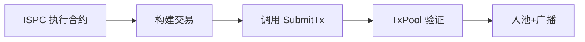

**关键点**：
- 输入要满足：合约生成的交易必须符合协议规范
- 输出保证：交易已提交到系统
- 注意事项：ISPC 不需要关心验证细节，Processor 统一处理

### **常见误用**

| 误用方式 | 为什么错误 | 正确做法 |
|---------|-----------|---------|
| 跳过验证直接入池 | TxPool 会拒绝未验证的交易 | 通过 SubmitTx 提交，TxPool 内部验证 |
| 在 Processor 中实现验证 | 违反单一职责原则 | 委托给 TxPool/Verifier |
| 主动广播交易 | 职责混乱 | TxPool 内部自动广播 |

---

## ⚠️ **已知限制**

| 限制 | 影响 | 规避方法 | 未来计划 |
|------|------|---------|---------|
| 依赖 TxPool 的验证逻辑 | Processor 无法独立工作 | 确保 TxPool 正确配置 | 保持现状（合理依赖） |
| 无批量提交接口 | 大量交易需要逐个提交 | 调用方循环调用 | 未来可考虑添加 |

---

## 🔍 **设计权衡记录**

### **权衡1：验证逻辑的归属**

**背景**：Processor 需要确保交易有效才能入池

**备选方案**：
1. **Processor 直接调用 Verifier**：Processor → Verifier → TxPool  
   - 优势：Processor 有更多控制权  
   - 劣势：职责过重，TxPool 和 Processor 都需要验证逻辑
2. **委托给 TxPool**：Processor → TxPool → Verifier（当前方案）  
   - 优势：职责清晰，TxPool 统一处理验证和入池  
   - 劣势：Processor 依赖 TxPool

**选择**：选择了方案2（委托给 TxPool）

**理由**：
- 保持 Processor 的简洁性
- TxPool 是交易的最终归宿，由它统一处理更合理
- 避免重复的验证逻辑

**代价**：Processor 必须依赖 TxPool

### **权衡2：网络和事件能力的位置**

**背景**：Processor 需要集成网络接收和事件监听能力

**备选方案**：
1. **在 service.go 中直接实现**：所有逻辑在一个文件  
   - 优势：简单直接  
   - 劣势：文件过大，职责混乱
2. **独立子目录**：network_handler/、event_handler/（当前方案）  
   - 优势：职责清晰，易于维护和测试  
   - 劣势：目录结构稍复杂

**选择**：选择了方案2（独立子目录）

**理由**：
- 职责分离，符合单一职责原则
- 易于维护和测试
- 参考 tx_legacy 的成熟模式

**代价**：目录结构略微复杂，但可维护性显著提升

---

## 📚 **相关文档**

- **架构设计**：[TX 状态机架构](_docs/architecture/TX_STATE_MACHINE_ARCHITECTURE.md) - 顶层架构设计理念
- **接口定义**：`internal/core/tx/interfaces/processor.go` - Processor 接口定义
- **TX 公共接口**：`pkg/interfaces/tx/README.md` - TX 模块公共接口说明
- **Integration 层**：`internal/core/tx/integration/` - 网络和事件集成接口
- **TxPool 接口**：`pkg/interfaces/mempool/txpool.go` - 交易池接口定义

---

## 🏭 **网络与事件集成实现**

### 实施概览

Processor 模块实现了与网络和事件系统的完整集成，总计 ~730行生产级代码：

| 组件 | 文件 | 行数 | 功能 |
|------|------|------|------|
| **NetworkHandler** | `processor/network_handler/handler.go` | 286行 | P2P 交易协议处理 |
| **EventHandler** | `processor/event_handler/handler.go` | 377行 | 交易事件订阅处理 |
| **Processor 集成** | `processor/service.go` | 264行 | 统一入口，委托子模块 |
| **module.go 注册** | `module.go` | +67行 | 网络和事件注册 |

### NetworkHandler 架构

```go
// NetworkHandler 交易网络协议处理器
type NetworkHandler struct {
    txPool mempool.TxPool // 交易池服务
    logger log.Logger     // 日志服务
}
```

**关键实现细节**：
- 双重保障传播机制：GossipSub（主要路径）+ Stream RPC（备用路径）
- 去重检查：避免重复处理同一交易
- 自动提交：解析后自动提交到 TxPool
- 错误处理：完整的错误分类和处理

### EventHandler 架构

```go
// EventHandler 交易事件处理器
type EventHandler struct {
    logger   log.Logger
    eventBus eventIf.EventBus
    
    mu sync.RWMutex // 保护统计数据
    
    // 交易状态统计
    receivedCount  uint64 // 接收交易总数
    validatedCount uint64 // 验证通过交易数
    executedCount  uint64 // 执行成功交易数
    confirmedCount uint64 // 确认交易数
    failedCount    uint64 // 失败交易数
    
    // 性能统计
    avgValidationTime time.Duration // 平均验证时间
    avgExecutionTime  time.Duration // 平均执行时间
    lastProcessTime   time.Time     // 最后处理时间
}
```

**关键实现细节**：
- 交易生命周期跟踪：从接收到确认的完整跟踪
- 统计数据维护：线程安全的计数器
- 性能指标：平均验证和执行时间
- 事件转发：发布内部事件通知

### Processor 集成

Processor Service 通过组合模式整合 NetworkHandler 和 EventHandler：

```go
type Service struct {
    txPool        mempool.TxPool
    networkHandler *network_handler.Handler
    eventHandler   *event_handler.Handler
    logger         log.Logger
}
```

**集成方式**：
- Service 实现 `TxAnnounceRouter` 和 `TxProtocolRouter` 接口，委托给 NetworkHandler
- Service 实现 `TransactionEventSubscriber` 接口，委托给 EventHandler
- 通过 fx 注册到网络和事件系统

详细实现说明请参考：[NetworkHandler 实现](./network_handler/README.md) 和 [EventHandler 实现](./event_handler/README.md)

---

## 📋 **文档变更记录**

| 日期 | 变更内容 | 原因 |
|------|---------|------|
| 2025-11-30 | 移除旧格式标记 | 符合文档规范 |
| 2025-11-30 | 添加"依赖注入配置（module.go）"章节 | 符合 implementation-readme.md 模板要求 |
| 2025-11-30 | 调整章节标题和顺序 | 符合模板规范 |
| 2025-11-XX | 整合 P9 网络与事件集成说明 | 统一文档结构 |
| 2025-11-XX | 根据新模板重构文档 | 明确设计理念和职责边界 |
| 2025-11-XX | 添加网络和事件能力说明 | 整合网络和事件处理功能 |
| 2025-11-XX | 新增设计权衡记录 | 记录关键设计决策的原因 |

---

> 📝 **文档说明**
>
> 本模块是 TX 系统的统一入口，提供交易提交、状态查询、网络接收、事件监听能力。
> 核心设计：薄协调层 + 组合模式 + 依赖注入。
>
> 🔄 **维护指南**
>
> 保持薄协调层的设计，不要在 Processor 中实现业务逻辑。
> 验证、广播等能力由 TxPool 统一处理，网络和事件能力委托给专门的 handler。

