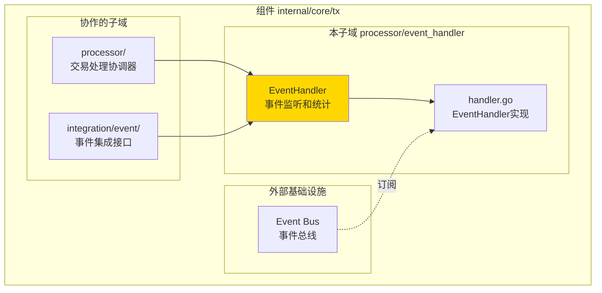
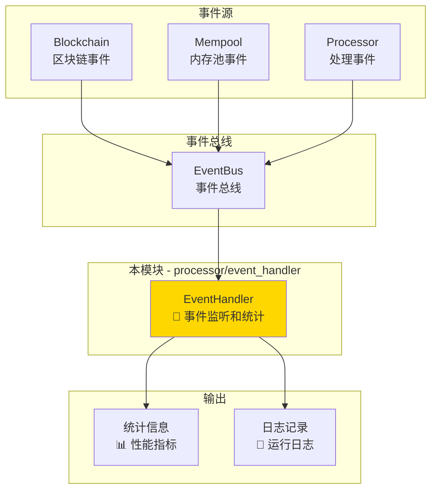
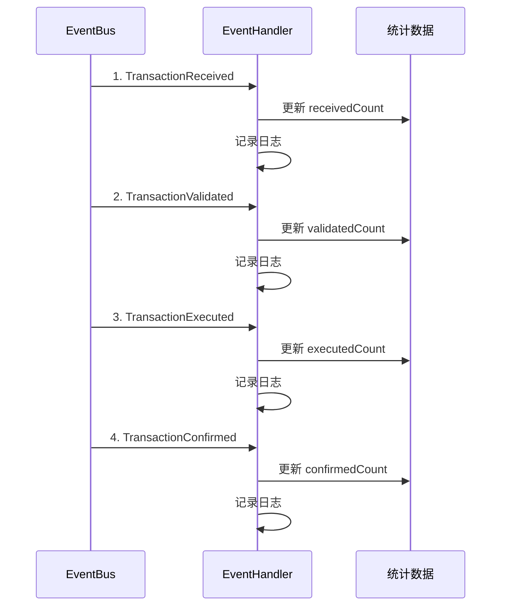

# 交易事件处理器（internal/core/tx/processor/event_handler）

---

## 📌 版本信息

- **版本**：1.0
- **状态**：stable
- **最后更新**：2025-11-30
- **最后审核**：2025-11-30
- **所有者**：TX模块团队
- **适用范围**：internal/core/tx/processor/event_handler 模块

---

## 🎯 **子域定位**

**路径**：`internal/core/tx/processor/event_handler/`

**所属组件**：`tx`

**核心职责**：监听交易生命周期事件并维护统计信息，提供交易处理的可观测性。

**在组件中的角色**：
- 监听交易从接收到确认的完整生命周期事件
- 响应内存池的交易状态变化通知
- 维护交易处理的性能指标和错误统计

**解决什么问题**：
- 监听交易从接收到确认的完整生命周期事件
- 响应内存池的交易状态变化通知
- 维护交易处理的性能指标和错误统计

**不解决什么问题**（边界）：
- ❌ 不修改交易状态（只做监听和记录）
- ❌ 不触发交易处理流程（被动响应事件）
- ❌ 不实现业务逻辑（只做统计追踪）

---

## 🎯 **设计原则与核心约束**

### **设计原则**

| 原则 | 说明 | 价值 |
|------|------|------|
| **被动监听** | 只响应事件，不主动发起 | 避免循环依赖和副作用 |
| **统计追踪** | 维护交易处理的统计和性能指标 | 提供系统运行状况的可观测性 |
| **无副作用** | 不修改交易状态，只做记录 | 保持系统状态的一致性 |

### **核心约束** ⭐

**严格遵守**：
- ✅ **只监听不修改**：不能修改交易状态或触发业务流程
- ✅ **统计一致性**：所有统计数据必须线程安全
- ✅ **日志记录**：记录关键事件，便于问题排查

**严格禁止**：
- ❌ **不能修改状态**：不能修改交易状态或触发验证
- ❌ **不能阻塞流程**：事件处理不能阻塞主流程
- ❌ **不能产生副作用**：不能影响系统的核心业务逻辑

---

## 🏗️ **架构设计**

### **在组件中的位置**

> **说明**：展示此子域在组件内部的位置和协作关系



**位置说明**：

| 关系类型 | 目标 | 关系说明 |
|---------|------|---------|
| **协作** | processor/ | processor 组合 EventHandler |
| **协作** | integration/event/ | 实现 TransactionEventSubscriber 接口 |
| **边界** | Event Bus | 订阅交易生命周期事件 |

### **整体架构**



### **事件流程**



---

## 📁 **目录结构**

```
processor/event_handler/
├── handler.go          # EventHandler 实现 | 事件订阅处理
└── README.md           # 本文档 | 模块说明
```

### **组织原则**

| 文件 | 职责 | 为什么这样组织 |
|------|------|---------------|
| `handler.go` | 事件订阅处理实现 | 实现 TransactionEventSubscriber 接口 |
| `README.md` | 模块文档 | 说明设计理念和使用方式 |

---

## 🔗 **依赖与协作**

### **依赖说明**

| 依赖模块 | 依赖接口 | 用途 | 约束条件 |
|---------|---------|------|---------|
| **infrastructure** | `event.EventBus` | 订阅事件 | 可选依赖 |
| **infrastructure** | `log.Logger` | 日志记录 | 可选依赖 |

---

## 📚 **相关文档**

- **接口定义**：`internal/core/tx/integration/event/` - 事件订阅接口定义
- **事件常量**：`pkg/constants/events/system_events.go` - 系统事件定义
- **Processor文档**：`internal/core/tx/processor/README.md` - 父模块文档

---

## 📋 **文档变更记录**

| 日期 | 变更内容 | 原因 |
|------|---------|------|
| 2025-11-30 | 移除旧格式标记 | 符合文档规范 |
| 2025-11-30 | 添加"在组件中的位置"图 | 符合 subdirectory-readme.md 模板要求 |
| 2025-11-30 | 调整章节标题和顺序 | 符合模板规范 |
| 2025-10-23 | 初始版本 | 创建文档 |

---
