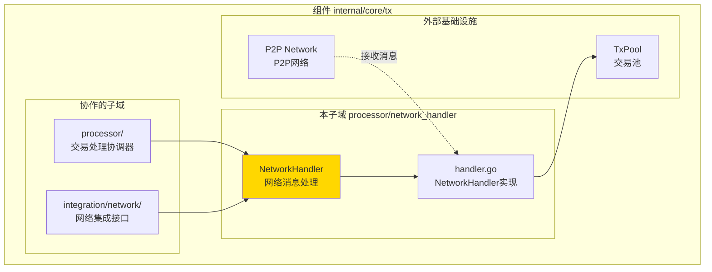
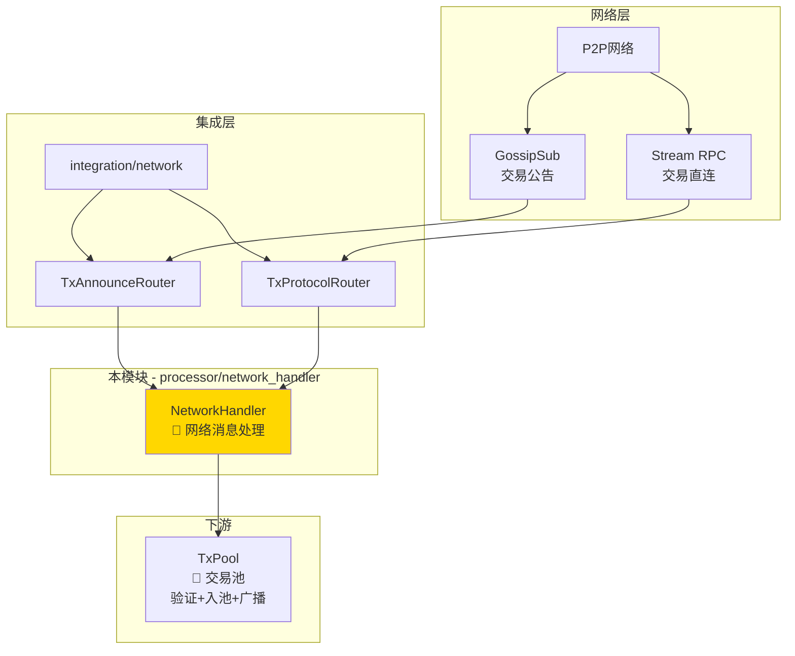
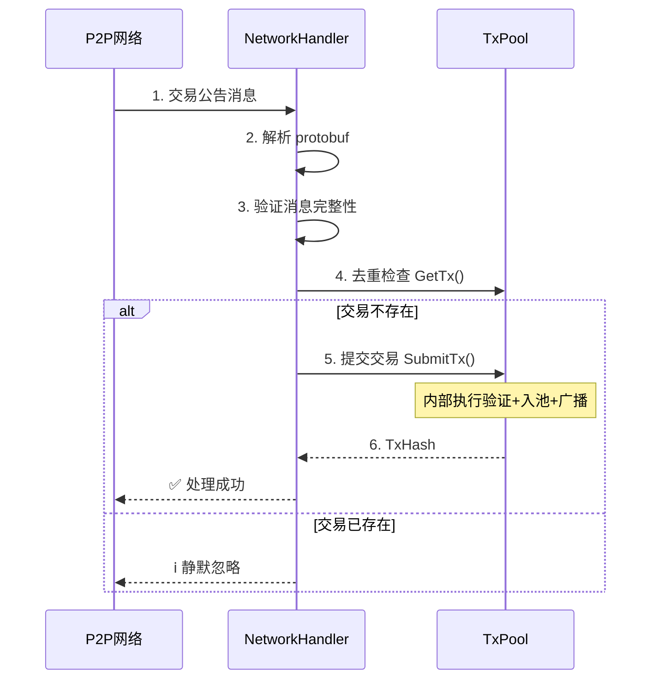

# 交易网络处理器（internal/core/tx/processor/network_handler）

---

## 📌 版本信息

- **版本**：1.0
- **状态**：stable
- **最后更新**：2025-11-30
- **最后审核**：2025-11-30
- **所有者**：TX模块团队
- **适用范围**：internal/core/tx/processor/network_handler 模块

---

## 🎯 **子域定位**

**路径**：`internal/core/tx/processor/network_handler/`

**所属组件**：`tx`

**核心职责**：从 P2P 网络接收交易消息并提交到系统中，提供统一的网络消息解析、去重和提交流程。

**在组件中的角色**：
- 接收来自 GossipSub 的交易公告（主要传播路径）
- 处理来自 Stream RPC 的交易直连请求（备用传播路径）
- 统一的网络消息解析、去重和提交流程

**解决什么问题**：
- 接收来自 GossipSub 的交易公告（主要传播路径）
- 处理来自 Stream RPC 的交易直连请求（备用传播路径）
- 统一的网络消息解析、去重和提交流程

**不解决什么问题**（边界）：
- ❌ 不实现交易验证逻辑（委托给 TxPool）
- ❌ 不负责交易广播（由 TxPool 内部处理）
- ❌ 不维护交易状态（只做接收和转发）

---

## 🎯 **设计原则与核心约束**

### **设计原则**

| 原则 | 说明 | 价值 |
|------|------|------|
| **薄委托层** | 只负责网络消息的接收和转发 | 保持 Processor 的简洁性 |
| **职责单一** | 解析 protobuf → 去重检查 → 提交到池 | 避免职责膨胀 |
| **无状态** | 不维护交易状态，只做流程编排 | 易于测试和扩展 |

### **核心约束** ⭐

**严格遵守**：
- ✅ **只负责接收**：不能主动广播交易
- ✅ **只做转发**：不实现验证逻辑，委托给 TxPool
- ✅ **去重检查**：提交前检查交易是否已存在

**严格禁止**：
- ❌ **不能实现验证**：验证逻辑由 TxPool 统一处理
- ❌ **不能维护状态**：不维护交易状态，保持无状态
- ❌ **不能主动广播**：广播由 TxPool 内部处理

---

## 🏗️ **架构设计**

### **在组件中的位置**

> **说明**：展示此子域在组件内部的位置和协作关系



**位置说明**：

| 关系类型 | 目标 | 关系说明 |
|---------|------|---------|
| **协作** | processor/ | processor 组合 NetworkHandler |
| **协作** | integration/network/ | 实现 TxAnnounceRouter 和 TxProtocolRouter 接口 |
| **边界** | P2P Network | 接收交易网络消息 |
| **依赖** | TxPool | 去重检查和交易提交 |

### **整体架构**



### **处理流程**



---

## 📁 **目录结构**

```
processor/network_handler/
├── handler.go          # NetworkHandler 实现 | 网络协议处理
└── README.md           # 本文档 | 模块说明
```

### **组织原则**

| 文件 | 职责 | 为什么这样组织 |
|------|------|---------------|
| `handler.go` | 网络协议处理实现 | 实现 TxAnnounceRouter 和 TxProtocolRouter 接口 |
| `README.md` | 模块文档 | 说明设计理念和使用方式 |

---

## 🔗 **依赖与协作**

### **依赖说明**

| 依赖模块 | 依赖接口 | 用途 | 约束条件 |
|---------|---------|------|---------|
| **mempool** | `TxPool` | 去重检查和交易提交 | TxPool 负责验证和广播 |
| **infrastructure** | `log.Logger` | 日志记录 | 可选依赖 |

---

## 📚 **相关文档**

- **接口定义**：`internal/core/tx/integration/network/` - 网络协议接口定义
- **协议定义**：`pb/network/protocol/transaction.proto` - 交易传播协议定义
- **Processor文档**：`internal/core/tx/processor/README.md` - 父模块文档

---

## 📋 **文档变更记录**

| 日期 | 变更内容 | 原因 |
|------|---------|------|
| 2025-11-30 | 移除旧格式标记 | 符合文档规范 |
| 2025-11-30 | 添加"在组件中的位置"图 | 符合 subdirectory-readme.md 模板要求 |
| 2025-11-30 | 调整章节标题和顺序 | 符合模板规范 |
| 2025-10-23 | 初始版本 | 创建文档 |

---
