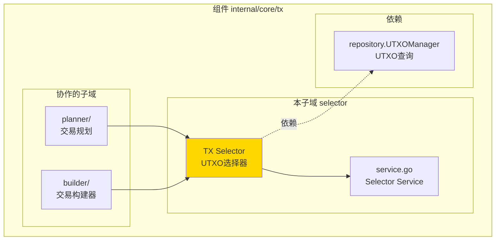
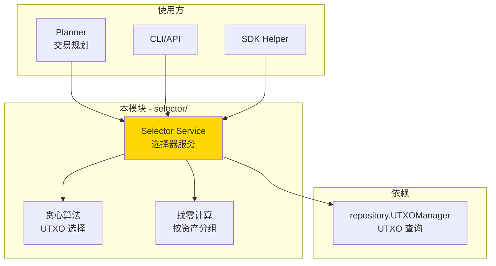
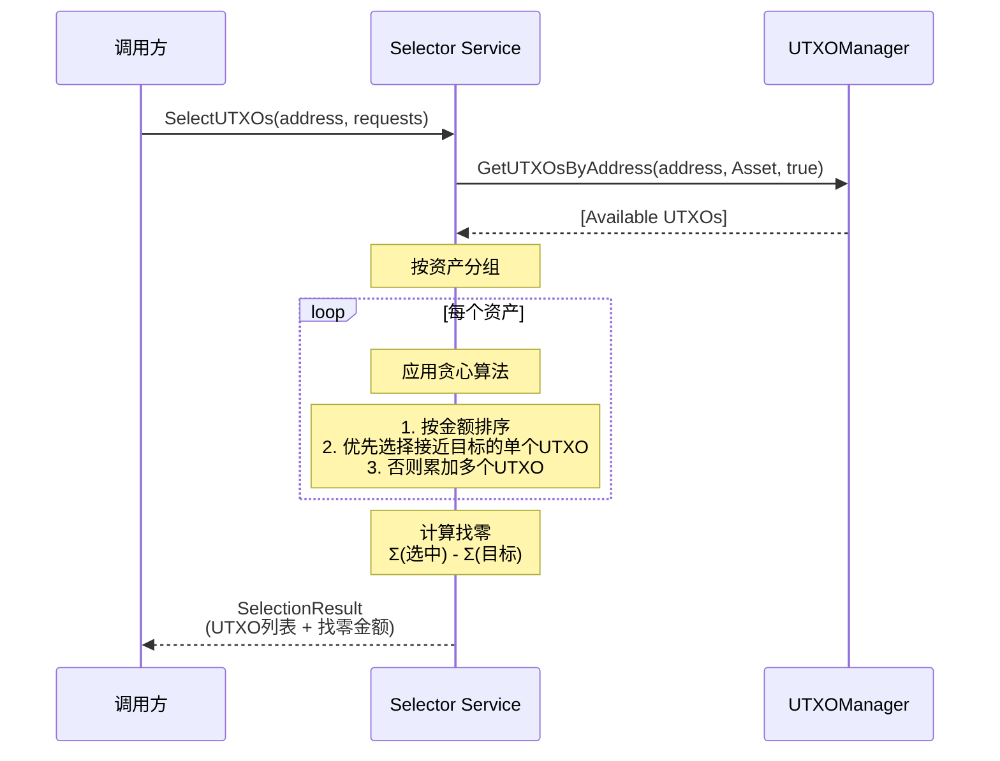

# TX Selector（internal/core/tx/selector）

---

## 📌 版本信息

- **版本**：1.0
- **状态**：stable
- **最后更新**：2025-11-30
- **最后审核**：2025-11-30
- **所有者**：TX模块团队
- **适用范围**：internal/core/tx/selector 模块

---

## 🎯 **子域定位**

**路径**：`internal/core/tx/selector/`

**所属组件**：`tx`

**核心职责**：根据业务需求（如转账金额）自动选择合适的 UTXO 集合，并计算找零。

**在组件中的角色**：
- 自动选择满足金额需求的 UTXO 集合
- 优化 UTXO 选择策略（贪心算法）
- 计算并生成找零输出
- 支持多资产选择（原生币 + 合约代币）

**解决什么问题**：
- 自动选择满足金额需求的 UTXO 集合
- 优化 UTXO 选择策略（贪心算法）
- 计算并生成找零输出
- 支持多资产选择（原生币 + 合约代币）

---

## 🎯 **设计原则与核心约束**

### **设计原则**

| 原则 | 说明 | 价值 |
|------|------|------|
| **TX 内部实现** | 不暴露为公共接口 | 符合架构设计，避免接口泛滥 |
| **贪心算法** | 优先选择最接近目标金额的 UTXO | 最小化 UTXO 使用数量和找零 |
| **多资产支持** | 同时支持原生币和合约代币 | 满足实际业务需求 |
| **只选可用 UTXO** | 只选择 Available 状态的 UTXO | 确保交易可以成功验证 |

### **核心约束** ⭐

**严格遵守**：
- ✅ 只选择 `UTXO_LIFECYCLE_AVAILABLE` 状态的 UTXO
- ✅ 只处理 `UTXO_CATEGORY_ASSET` 类型的 UTXO
- ✅ 不修改 UTXO 状态（只读查询）
- ✅ 按资产分别计算和验证（原生币和合约代币分开）

**严格禁止**：
- ❌ 暴露为公共接口
- ❌ 选择非 Available 状态的 UTXO
- ❌ 选择引用型输入（`is_reference_only=true`）
- ❌ 跨资产计算（不能用原生币抵扣合约代币）

---

**不解决什么问题**（边界）：
- ❌ 不暴露为公共接口（TX 内部实现细节）
- ❌ 不处理交易构建（由 Builder 负责）
- ❌ 不处理 UTXO 存储（由 repository.UTXOManager 负责）
- ❌ 不处理验证逻辑（由 Verifier 负责）

---

## 🏗️ **架构设计**

### **在组件中的位置**

> **说明**：展示此子域在组件内部的位置和协作关系



**位置说明**：

| 关系类型 | 目标 | 关系说明 |
|---------|------|---------|
| **协作** | planner/ | planner 使用 Selector 选择 UTXO |
| **协作** | builder/ | builder 通过 planner 间接使用 Selector |
| **依赖** | repository.UTXOManager | 查询可用 UTXO |

### **整体架构**



### **核心流程**



---

## 📊 **核心算法**

### **贪心算法：UTXO 选择**

**策略说明**：
1. 按金额从小到大排序所有可用 UTXO
2. 优先选择单个 UTXO 满足需求（最接近目标金额）
3. 如果没有单个满足，则累加多个 UTXO
4. 累加到第一次满足或超过目标金额时停止

**算法伪代码**：

```go
func GreedySelect(utxos []UTXO, targetAmount BigInt) ([]UTXO, BigInt) {
    // 1. 按金额排序
    sort(utxos, by: amount ASC)
    
    // 2. 优先找单个满足的 UTXO
    for _, utxo := range utxos {
        if utxo.amount >= targetAmount {
            return [utxo], utxo.amount
        }
    }
    
    // 3. 累加多个 UTXO
    selected := []
    total := 0
    for _, utxo := range utxos {
        selected.append(utxo)
        total += utxo.amount
        if total >= targetAmount {
            return selected, total
        }
    }
    
    // 4. 余额不足
    return error("insufficient balance")
}
```

**时间复杂度**：`O(n log n)`（排序） + `O(n)`（选择） = `O(n log n)`

**空间复杂度**：`O(n)`（存储 UTXO 列表）

### **找零计算**

**策略说明**：
- 按资产分别计算找零
- `找零 = Σ(选中的 UTXO) - Σ(目标金额)`
- 找零金额 > 0 时，生成找零输出

**示例**：

```
输入需求：
- 原生币: 100
- 合约代币A: 50

选中的 UTXO：
- 原生币 UTXO: [60, 70] = 130
- 合约代币A UTXO: [80] = 80

找零计算：
- 原生币找零: 130 - 100 = 30
- 合约代币A找零: 80 - 50 = 30
```

---

## 🔗 **依赖与协作**

### **依赖关系**

| 依赖模块 | 依赖接口 | 用途 | 约束条件 |
|---------|---------|------|---------|
| **repository** | `UTXOManager` | 查询可用 UTXO | 只查询，不修改 |
| **log** | `Logger` | 记录选择过程 | 可选依赖 |

### **被依赖关系**

| 使用方 | 用途 | 调用方式 |
|-------|------|---------|
| **planner** | 交易规划（选择 + 构建） | 内部调用 |
| **CLI/API** | 用户转账 | 通过 planner 间接调用 |
| **SDK** | 高级封装 | 通过 planner 间接调用 |

---

## 📁 **目录结构**

```
internal/core/tx/selector/
├── service.go          # Selector 服务实现
└── README.md           # 本文档
```

---

## 🎓 **使用指南**

### **典型场景：单资产转账**

```go
// 1. 创建 Selector
selector := selector.NewService(utxoMgr, logger)

// 2. 定义转账需求
requests := []*selector.AssetRequest{
    {
        TokenID: "native",  // 原生币
        Amount:  "100",     // 需要 100
    },
}

// 3. 选择 UTXO
result, err := selector.SelectUTXOs(ctx, aliceAddress, requests)
if err != nil {
    // 余额不足或查询失败
    return err
}

// 4. 使用选择结果
// result.SelectedUTXOs: 选中的 UTXO 列表
// result.ChangeAmounts: 找零金额（按 TokenID 分组）
// result.TotalSelected: 选中的总金额（按 TokenID 分组）
```

### **典型场景：多资产转账**

```go
// 1. 定义多资产需求
requests := []*selector.AssetRequest{
    {
        TokenID: "native",
        Amount:  "100",  // 原生币 100
    },
    {
        TokenID:         "contract_a:class_1",
        Amount:          "50",   // 合约代币 50
        ContractAddress: contractA,
        ClassID:         classID1,
    },
}

// 2. 选择 UTXO（自动处理多资产）
result, err := selector.SelectUTXOs(ctx, aliceAddress, requests)

// 3. 结果包含：
// - 原生币的选中 UTXO 和找零
// - 合约代币的选中 UTXO 和找零
```

### **常见误用**

| 误用方式 | 为什么错误 | 正确做法 |
|---------|-----------|---------|
| 选择非 Available 状态的 UTXO | 会导致验证失败 | GetUTXOsByAddress(..., true) 只查可用 |
| 跨资产计算 | 原生币不能抵扣合约代币 | 按资产分别选择和验证 |
| 暴露为公共接口 | 违背架构设计 | 保持内部实现，通过 planner 间接使用 |

---

## ⚠️ **已知限制**

| 限制 | 影响 | 规避方法 | 未来计划 |
|------|------|---------|---------|
| **只支持贪心算法** | 可能不是最优解 | 目前贪心算法已足够 | P3 考虑实现最优算法 |
| **不支持多签复杂场景** | 多签转账需要额外处理 | 由 planner 层处理 | P5 完善多签支持 |
| **不支持手续费优化** | 可能选择过多 UTXO | 当前不影响正确性 | P4 考虑手续费优化 |

---

## 🔍 **设计权衡记录**

### **权衡 1：贪心 vs 最优算法**

**背景**：需要选择 UTXO，但不确定使用哪种算法

**备选方案**：
1. **贪心算法** - 优势：简单高效 - 劣势：可能不是最优解
2. **动态规划最优算法** - 优势：找到最优解 - 劣势：复杂度高

**选择**：选择了 **贪心算法**

**理由**：
- P2 阶段优先快速实现
- 贪心算法在大多数情况下已足够
- 性能开销小，易于理解和维护

**代价**：
- 可能选择的 UTXO 数量不是最少
- 可能找零不是最优

---

### **权衡 2：内部实现 vs 公共接口**

**背景**：Selector 是否应该暴露为公共接口

**备选方案**：
1. **内部实现** - 优势：简化接口 - 劣势：灵活性降低
2. **公共接口** - 优势：灵活 - 劣势：接口泛滥

**选择**：选择了 **内部实现**

**理由**：
- 符合架构文档"UTXO 选择逻辑应内嵌在使用方内部"
- Repository 明确指出不提供选择逻辑
- 通过 planner 间接使用即可满足需求

**代价**：
- 外部模块不能直接使用 Selector
- 必须通过 planner 或 Builder 间接调用

---

## 📚 **相关文档**

- **架构设计**：[TX_STATE_MACHINE_ARCHITECTURE.md](_docs/architecture/TX_STATE_MACHINE_ARCHITECTURE.md) - TX 模块整体架构
- **UTXO 接口**：`pkg/interfaces/repository/utxo.go` - UTXO 管理接口
- **TX README**：`internal/core/tx/README.md` - TX 核心实现层说明
- **Builder README**：`internal/core/tx/builder/README.md` - Builder 实现说明

---

> 📝 **文档说明**
>
> 本文档描述 Selector 组件的设计和实现，强调"为什么这样实现"而非实现细节。
> 核心算法：贪心选择（优先单个 UTXO → 累加多个）+ 找零计算（按资产分组）。
>
> 🔄 **维护指南**
>
> Selector 是 TX 内部实现，不应暴露为公共接口。
> 优化算法时保持接口稳定。新增算法策略时保持可选可配置。

