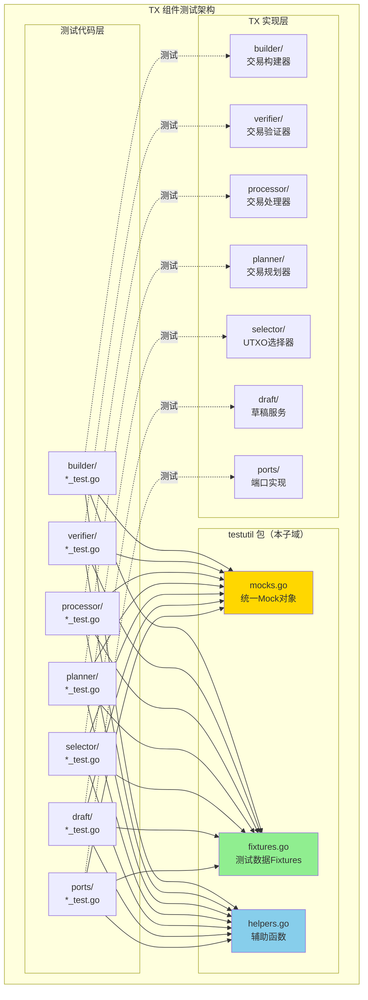
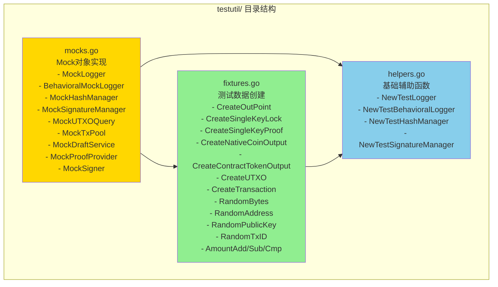
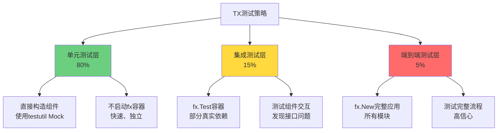

# TX 测试工具包 (testutil)

---

## 📌 版本信息

- **版本**：1.0
- **状态**：stable
- **最后更新**：2025-11-XX
- **最后审核**：2025-11-XX
- **所有者**：TX 开发团队
- **适用范围**：TX 组件内部的所有测试代码

---

## 🎯 子域定位

**路径**：`internal/core/tx/testutil/`

**所属组件**：`tx`

**核心职责**：为 TX 组件的测试提供统一的 Mock 对象、测试数据 Fixtures 和辅助函数，简化测试代码编写，避免重复定义 Mock 对象。

**在组件中的角色**：
- **测试基础设施层**：为所有 TX 子模块（builder、verifier、processor、planner、selector、draft、ports）提供统一的测试工具
- **Mock 对象统一管理**：集中管理所有 Mock 对象，避免每个测试文件重复定义
- **测试数据标准化**：提供标准化的测试数据创建函数，确保测试数据的一致性
- **依赖注入测试支持**：专门针对 fx 依赖注入框架的测试需求提供支持

---

## 🏗️ 架构设计

### 在组件中的位置

> **说明**：testutil 包为所有 TX 子模块的测试提供统一支持



**位置说明**：

| 关系类型 | 目标 | 关系说明 |
|---------|------|---------|
| **被依赖** | 所有 `*_test.go` 文件 | 测试文件导入 testutil 包，使用统一的 Mock 对象和 Fixtures |
| **不依赖** | TX 实现代码 | testutil 包不依赖任何 TX 实现代码，避免循环依赖 |

---

### 内部组织

> **说明**：testutil 包内部的文件组织和职责划分



**设计原则**：
- **mocks.go**：包含所有 Mock 对象的实现，不依赖任何 TX 实现代码
- **fixtures.go**：提供测试数据的创建函数，使用 mocks.go 中的 Mock 对象
- **helpers.go**：提供基础辅助函数，返回 mocks.go 中的 Mock 对象实例

---

## 📁 目录结构

```
internal/core/tx/testutil/
├── README.md          # 本文档
├── mocks.go           # Mock对象实现（统一管理）
├── fixtures.go        # 测试数据Fixtures
└── helpers.go         # 基础辅助函数
```

---

## 🔧 核心实现

### 实现文件：`mocks.go`

**核心职责**：提供统一的 Mock 对象实现，避免每个测试文件重复定义。

**设计原则**：
- ✅ **最小实现**：基础 Mock 对象提供最小实现，所有方法返回空值或默认值
- ✅ **分层设计**：提供基础 Mock、行为 Mock 两种类型
- ✅ **无循环依赖**：不依赖任何 TX 实现代码，只依赖 `pkg/interfaces`
- ✅ **真实算法**：MockHashManager 使用真实的 SHA256 算法，确保哈希计算正确

**关键 Mock 对象**：

| Mock 对象 | 实现的接口 | 使用场景 | 设计类型 |
|----------|-----------|---------|---------|
| `MockLogger` | `log.Logger` | 80%的测试用例 | 基础Mock（最小实现） |
| `BehavioralMockLogger` | `log.Logger` | 需要验证日志调用的测试（5%） | 行为Mock（记录调用） |
| `MockHashManager` | `crypto.HashManager` | 所有需要哈希计算的测试 | 基础Mock（使用真实SHA256） |
| `MockSignatureManager` | `crypto.SignatureManager` | 所有需要签名的测试 | 基础Mock（返回固定值） |
| `MockUTXOQuery` | `persistence.UTXOQuery` | 所有需要UTXO查询的测试 | 基础Mock（内存存储） |
| `MockTxPool` | `mempool.TxPool` | 所有需要交易池的测试 | 基础Mock（内存存储） |
| `MockDraftService` | `tx.TransactionDraftService` | 所有需要草稿服务的测试 | 基础Mock（内存存储） |
| `MockProofProvider` | `tx.ProofProvider` | 所有需要证明提供的测试 | 基础Mock（可配置证明） |
| `MockSigner` | `tx.Signer` | 所有需要签名的测试 | 基础Mock（返回固定签名） |

**示例代码**：

```go
// MockLogger - 基础Mock（最小实现）
type MockLogger struct{}

func (m *MockLogger) Debug(msg string) {}
func (m *MockLogger) Info(msg string) {}
// ... 其他方法都返回空值

// BehavioralMockLogger - 行为Mock（记录调用）
type BehavioralMockLogger struct {
    logs []string
    mutex sync.Mutex
}

func (m *BehavioralMockLogger) Info(msg string) {
    m.mutex.Lock()
    defer m.mutex.Unlock()
    m.logs = append(m.logs, "INFO: "+msg)
}

func (m *BehavioralMockLogger) GetLogs() []string {
    // 返回所有日志记录
}
```

---

### 实现文件：`fixtures.go`

**核心职责**：提供标准化的测试数据创建函数，确保测试数据的一致性。

**关键 Fixtures**：

| Fixture 函数 | 返回类型 | 用途 |
|-------------|---------|------|
| `CreateOutPoint(txid, index)` | `*transaction.OutPoint` | 创建交易输出点 |
| `CreateSingleKeyLock(publicKey)` | `*transaction.LockingCondition` | 创建单密钥锁定条件 |
| `CreateSingleKeyProof(publicKey, signature)` | `*transaction.UnlockingProof` | 创建单密钥解锁证明 |
| `CreateMultiKeyLock(publicKeys, requiredSignatures)` | `*transaction.LockingCondition` | 创建多密钥锁定条件 |
| `CreateNativeCoinOutput(owner, amount, lock)` | `*transaction.TxOutput` | 创建原生币输出 |
| `CreateContractTokenOutput(...)` | `*transaction.TxOutput` | 创建合约代币输出 |
| `CreateUTXO(outpoint, output, status)` | `*utxopb.UTXO` | 创建UTXO |
| `CreateTransaction(inputs, outputs)` | `*transaction.Transaction` | 创建交易 |
| `RandomBytes(size)` | `[]byte` | 生成随机字节数组 |
| `RandomAddress()` | `[]byte` | 生成随机地址（20字节） |
| `RandomPublicKey()` | `[]byte` | 生成随机公钥（33字节） |
| `RandomTxID()` | `[]byte` | 生成随机交易ID（32字节） |
| `RandomHash()` | `[]byte` | 生成随机哈希（32字节） |
| `AmountAdd(a, b)` | `string` | 金额相加（big.Int） |
| `AmountSub(a, b)` | `string` | 金额相减（big.Int） |
| `AmountCmp(a, b)` | `int` | 金额比较（big.Int） |

**示例代码**：

```go
// 创建标准的交易输入
outpoint := testutil.CreateOutPoint(nil, 0)
lock := testutil.CreateSingleKeyLock(nil)
output := testutil.CreateNativeCoinOutput(testutil.RandomAddress(), "1000", lock)
utxo := testutil.CreateUTXO(outpoint, output, utxopb.UTXOLifecycleStatus_UTXO_LIFECYCLE_AVAILABLE)

// 创建完整的交易
tx := testutil.CreateTransaction(
    []*transaction.TxInput{
        {PreviousOutput: outpoint, IsReferenceOnly: false},
    },
    []*transaction.TxOutput{output},
)
```

---

### 实现文件：`helpers.go`

**核心职责**：提供基础辅助函数，简化 Mock 对象的创建。

**⚠️ 重要约束**：为避免循环依赖，helpers.go **不包含**依赖具体 TX 组件的辅助函数（如 `NewTestTxBuilder`）。这些函数应该在各自的测试文件中定义，使用 testutil 中的 Mock 对象。

**关键辅助函数**：

| 辅助函数 | 返回类型 | 用途 |
|---------|---------|------|
| `NewTestLogger()` | `log.Logger` | 创建测试用的Logger（MockLogger） |
| `NewTestBehavioralLogger()` | `*BehavioralMockLogger` | 创建行为Logger（记录调用） |
| `NewTestHashManager()` | `crypto.HashManager` | 创建测试用的HashManager |
| `NewTestSignatureManager()` | `crypto.SignatureManager` | 创建测试用的SignatureManager |

**示例代码**：

```go
// 在测试文件中使用
import "github.com/weisyn/v1/internal/core/tx/testutil"

func TestExample(t *testing.T) {
    // 使用testutil中的辅助函数创建Mock对象
    logger := testutil.NewTestLogger()
    hashManager := testutil.NewTestHashManager()
    signatureManager := testutil.NewTestSignatureManager()
    
    // 创建被测试的组件（在测试文件中定义）
    verifier := NewVerifier(hashManager, signatureManager, logger)
    // ... 测试代码
}
```

---

## 🔗 协作关系

### 依赖的接口

| 接口 | 来源 | 用途 |
|-----|------|-----|
| `log.Logger` | `pkg/interfaces/infrastructure/log/` | MockLogger 实现日志接口 |
| `crypto.HashManager` | `pkg/interfaces/infrastructure/crypto/` | MockHashManager 实现哈希接口 |
| `crypto.SignatureManager` | `pkg/interfaces/infrastructure/crypto/` | MockSignatureManager 实现签名接口 |
| `persistence.UTXOQuery` | `pkg/interfaces/persistence/` | MockUTXOQuery 实现UTXO查询接口 |
| `mempool.TxPool` | `pkg/interfaces/mempool/` | MockTxPool 实现交易池接口 |
| `tx.TransactionDraftService` | `pkg/interfaces/tx/` | MockDraftService 实现草稿服务接口 |
| `tx.ProofProvider` | `pkg/interfaces/tx/` | MockProofProvider 实现证明提供接口 |
| `tx.Signer` | `pkg/interfaces/tx/` | MockSigner 实现签名器接口 |

---

### 被依赖关系

**被以下测试文件使用**：
- `builder/*_test.go` - 使用所有 Mock 对象和 Fixtures
- `verifier/*_test.go` - 使用 MockLogger, MockHashManager, MockSignatureManager, MockUTXOQuery
- `processor/*_test.go` - 使用 MockLogger, MockTxPool
- `planner/*_test.go` - 使用 MockUTXOQuery, MockLogger
- `selector/*_test.go` - 使用 MockUTXOQuery, MockLogger
- `draft/*_test.go` - 使用 MockDraftService, MockLogger
- `ports/*_test.go` - 使用所有 Mock 对象

**示例**：

```go
// 在 builder/service_test.go 中使用
package builder

import (
    "testing"
    "github.com/weisyn/v1/internal/core/tx/testutil"
)

func TestNewService(t *testing.T) {
    // Arrange - 使用testutil中的Mock对象
    draftService := testutil.NewMockDraftService()
    
    // Act
    builder := NewService(draftService)
    
    // Assert
    require.NotNil(t, builder)
}
```

---

## 🧪 测试指南

### TX 测试的特殊性

TX 组件广泛使用 **fx 依赖注入框架**，这给测试带来了特殊的挑战：

1. **依赖复杂**：每个组件依赖多个接口（Logger, HashManager, SignatureManager, UTXOQuery 等）
2. **Mock 对象管理**：如果每个测试文件都重复定义 Mock，会导致代码重复和维护困难
3. **运行时依赖注入**：TX 使用 `fx.Invoke` 进行运行时依赖注入，测试时需要特殊处理
4. **Type-state 模式**：Builder 使用 Type-state 模式，测试需要验证状态转换的正确性

### 测试策略

遵循 `docs/system/standards/principles/testing-standards.md` 规范，采用**分层测试策略**：



### 单元测试模式（推荐）

**原则**：不启动 fx 容器，直接调用构造函数，使用 testutil 中的 Mock 对象。

**优点**：
- ✅ 快速（毫秒级）
- ✅ 独立（完全隔离）
- ✅ 易于调试
- ✅ 高覆盖率

**示例**：

```go
// builder/service_test.go
package builder

import (
    "testing"
    "github.com/weisyn/v1/internal/core/tx/testutil"
)

func TestService_AddInput(t *testing.T) {
    // Arrange - 使用testutil中的Mock对象
    draftService := testutil.NewMockDraftService()
    builder := NewService(draftService)
    
    // Act
    outpoint := testutil.CreateOutPoint(nil, 0)
    builder.AddInput(outpoint, false)
    
    // Assert
    assert.Len(t, builder.tx.Inputs, 1)
}
```

### 集成测试模式（可选）

**原则**：使用 `fx.Test` 创建轻量级 fx 容器，部分使用真实依赖，部分使用 Mock。

**示例**：

```go
// integration_test.go
func TestService_WithFXContainer(t *testing.T) {
    app := fx.New(
        fx.Provide(
            // 提供Mock依赖
            func() log.Logger { return testutil.NewTestLogger() },
            func() persistence.UTXOQuery { return testutil.NewMockUTXOQuery() },
            
            // 提供被测试的组件
            builder.NewService,
        ),
        fx.Invoke(func(service *builder.Service) {
            // Act - 在fx容器中测试
            // ...
        }),
    )
    
    err := app.Err()
    assert.NoError(t, err)
}
```

### Mock 对象选择指南

| 测试场景 | 推荐的 Mock 类型 | 示例 |
|---------|----------------|------|
| 不需要验证日志调用 | `MockLogger`（基础Mock） | 80%的测试用例 |
| 需要验证日志调用 | `BehavioralMockLogger`（行为Mock） | 错误处理测试 |
| 需要真实哈希计算 | `MockHashManager`（使用真实SHA256） | 所有哈希相关测试 |
| 需要UTXO查询 | `MockUTXOQuery`（内存存储） | Verifier、Planner、Selector测试 |
| 需要交易池操作 | `MockTxPool`（内存存储） | Processor测试 |
| 需要草稿服务 | `MockDraftService`（内存存储） | Builder、Draft测试 |

---

## 📊 关键设计决策

### 决策 1：统一 Mock 对象管理

**问题**：TX 组件依赖多个接口（Logger, HashManager, SignatureManager, UTXOQuery 等），如果每个测试文件都重复定义 Mock 对象，会导致：
- ❌ 代码重复（相同的 Mock 定义出现在多个文件中）
- ❌ 维护困难（接口变更时需要更新多处）
- ❌ 不一致（不同文件的 Mock 实现略有差异）

**方案**：创建统一的 `testutil` 包，集中管理所有 Mock 对象。

**理由**：
- ✅ 符合 DRY 原则（Don't Repeat Yourself）
- ✅ 遵循测试规范文档的最佳实践
- ✅ 参考 `internal/core/ispc/testutil` 的成功模式
- ✅ 提高代码可维护性

**权衡**：
- ✅ 优点：代码复用、易于维护、统一标准
- ⚠️ 缺点：需要额外的包（但收益远大于成本）

---

### 决策 2：避免循环依赖

**问题**：testutil 包如果依赖 TX 实现代码（如 `builder.Service`），会导致循环依赖：
- `testutil` → `builder` → `testutil`（循环）

**方案**：testutil 包**只依赖 `pkg/interfaces`**，不依赖任何 TX 实现代码。

**具体措施**：
- ✅ `mocks.go`：只实现 `pkg/interfaces` 中定义的接口
- ✅ `fixtures.go`：只使用 protobuf 类型和基础类型
- ✅ `helpers.go`：不包含依赖具体组件的辅助函数（如 `NewTestTxBuilder`）

**组件特定的测试辅助函数**：
- 应该在各自的测试文件中定义
- 使用 testutil 中的 Mock 对象
- 示例：`builder/service_test.go` 中的 `createTestBuilder()` 函数

**权衡**：
- ✅ 优点：避免循环依赖、保持包独立性
- ⚠️ 缺点：需要在测试文件中定义组件特定的辅助函数（但这是合理的）

---

### 决策 3：分层 Mock 设计

**问题**：不同测试场景需要不同的 Mock 行为：
- 大多数测试只需要最小实现（返回空值）
- 少数测试需要验证调用（记录调用）

**方案**：提供两种类型的 Mock：
1. **基础 Mock**（80%的测试用例）：最小实现，所有方法返回空值或默认值
2. **行为 Mock**（5%的测试用例）：记录调用，用于验证交互

**示例**：

```go
// 基础Mock（最小实现）
type MockLogger struct{}
func (m *MockLogger) Info(msg string) {}

// 行为Mock（记录调用）
type BehavioralMockLogger struct {
    logs []string
}
func (m *BehavioralMockLogger) Info(msg string) {
    m.logs = append(m.logs, "INFO: "+msg)
}
```

**权衡**：
- ✅ 优点：灵活、满足不同测试需求
- ⚠️ 缺点：需要维护多种 Mock 类型（但数量可控）

---

### 决策 4：使用真实 SHA256 算法

**问题**：MockHashManager 应该使用真实的 SHA256 算法还是返回固定值？

**方案**：使用真实的 SHA256 算法（`crypto/sha256`）。

**理由**：
- ✅ 确保哈希计算的正确性
- ✅ 测试更接近真实场景
- ✅ SHA256 计算很快，不影响测试性能
- ✅ 避免因 Mock 实现错误导致的测试失败

**权衡**：
- ✅ 优点：测试更可靠、发现真实问题
- ⚠️ 缺点：依赖标准库（但这是合理的）

---

## 📚 使用示例

### 示例 1：基础单元测试

```go
// builder/service_test.go
package builder

import (
    "testing"
    "github.com/weisyn/v1/internal/core/tx/testutil"
)

func TestNewService(t *testing.T) {
    // Arrange - 使用testutil中的Mock对象
    draftService := testutil.NewMockDraftService()
    
    // Act
    builder := NewService(draftService)
    
    // Assert
    require.NotNil(t, builder)
    require.NotNil(t, builder.tx)
}
```

### 示例 2：使用测试数据 Fixtures

```go
// verifier/kernel_test.go
func TestKernel_VerifyTransaction(t *testing.T) {
    // Arrange
    utxoQuery := testutil.NewMockUTXOQuery()
    utxo := testutil.CreateUTXO(
        testutil.CreateOutPoint(nil, 0),
        testutil.CreateNativeCoinOutput(testutil.RandomAddress(), "1000", nil),
        utxopb.UTXOLifecycleStatus_UTXO_LIFECYCLE_AVAILABLE,
    )
    utxoQuery.AddUTXO(utxo)
    
    kernel := NewKernel(utxoQuery, ...)
    tx := testutil.CreateTransaction(
        []*transaction.TxInput{
            {PreviousOutput: utxo.Outpoint, IsReferenceOnly: false},
        },
        []*transaction.TxOutput{
            testutil.CreateNativeCoinOutput(testutil.RandomAddress(), "500", nil),
        },
    )
    
    // Act
    err := kernel.VerifyTransaction(context.Background(), tx)
    
    // Assert
    assert.NoError(t, err)
}
```

### 示例 3：使用行为 Mock 验证日志

```go
// processor/service_test.go
func TestProcessor_LogsError(t *testing.T) {
    // Arrange - 使用行为Mock记录日志调用
    logger := testutil.NewTestBehavioralLogger()
    verifier := &MockVerifier{shouldFail: true}
    txPool := testutil.NewMockTxPool()
    processor := NewService(verifier, txPool, logger)
    
    // Act
    _, err := processor.SubmitTx(context.Background(), invalidTx)
    
    // Assert
    require.Error(t, err)
    logs := logger.GetLogs()
    require.Contains(t, logs, "ERROR:") // 验证错误日志被记录
}
```

### 示例 4：组件特定的测试辅助函数

```go
// builder/service_test.go
package builder

import (
    "testing"
    "github.com/weisyn/v1/internal/core/tx/testutil"
)

// createTestBuilder 创建测试用的构建器
// ✅ 注意：这个函数在测试文件中定义，使用testutil中的Mock对象
func createTestBuilder(t *testing.T) *Service {
    draftService := testutil.NewMockDraftService()
    return NewService(draftService)
}
```

---

## 🚫 反模式

### 反模式 1：在 testutil 中定义组件特定的辅助函数

```go
❌ 错误做法（会导致循环依赖）：
// testutil/helpers.go
func NewTestTxBuilder(t *testing.T) *builder.Service {
    // ❌ testutil 依赖 builder，会导致循环依赖
    return builder.NewService(...)
}

✅ 正确做法（在测试文件中定义）：
// builder/service_test.go
func createTestBuilder(t *testing.T) *Service {
    // ✅ 使用 testutil 中的 Mock 对象
    draftService := testutil.NewMockDraftService()
    return NewService(draftService)
}
```

### 反模式 2：每个测试文件重复定义 Mock 对象

```go
❌ 错误做法（代码重复）：
// builder/service_test.go
type mockDraftService struct{ ... }
type mockLogger struct{ ... }

// verifier/kernel_test.go
type mockDraftService struct{ ... }  // ❌ 重复定义
type mockLogger struct{ ... }  // ❌ 重复定义

✅ 正确做法（使用 testutil）：
// 所有测试文件都使用
import "github.com/weisyn/v1/internal/core/tx/testutil"

draftService := testutil.NewMockDraftService()
logger := testutil.NewTestLogger()
```

### 反模式 3：在单元测试中启动完整的 fx 应用

```go
❌ 错误做法（太慢）：
func TestService_AddInput(t *testing.T) {
    // ❌ 启动完整的 fx 应用，太慢
    app := fx.New(
        crypto.Module(),
        storage.Module(),
        tx.Module(),
        // ... 所有模块
    )
}

✅ 正确做法（直接构造）：
func TestService_AddInput(t *testing.T) {
    // ✅ 直接构造，快速
    builder := createTestBuilder(t)
    // ...
}
```

---

## ✅ 检查清单

### 编写测试时

- [ ] 是否使用了 testutil 包中的 Mock 对象？
- [ ] 是否避免了重复定义 Mock 对象？
- [ ] 是否使用了 testutil 中的测试数据 Fixtures？
- [ ] 组件特定的辅助函数是否在测试文件中定义？
- [ ] 是否避免了在 testutil 中依赖 TX 实现代码？

### 添加新的 Mock 对象时

- [ ] 是否实现了 `pkg/interfaces` 中定义的接口？
- [ ] 是否避免了依赖 TX 实现代码？
- [ ] 是否提供了基础 Mock 和行为 Mock（如需要）？
- [ ] 是否在 `helpers.go` 中添加了创建函数？

### 添加新的 Fixture 时

- [ ] 是否使用了 testutil 中的 Mock 对象？
- [ ] 是否避免了依赖 TX 实现代码？
- [ ] 是否提供了清晰的函数命名和文档？

---

## 📚 相关文档

**测试规范**：
- [测试规范原则](../../../../docs/system/standards/principles/testing-standards.md) - 依赖注入测试指南、Mock 对象管理最佳实践

**参考实现**：
- [`internal/core/ispc/testutil/`](../../ispc/testutil/) - ISPC 模块的 testutil 实现示例

**TX 组件文档**：
- [TX 组件总览](../README.md)
- [TX 测试计划](../TEST_PLAN.md)

---

## 📝 变更历史

| 版本 | 日期 | 变更内容 | 作者 |
|-----|------|---------|------|
| 1.0 | 2025-11-XX | 初始版本，创建统一的 Mock 对象和 Fixtures | TX 开发团队 |

---

## 🚧 待办事项

- [ ] 添加更多 TX 特定的测试数据 Fixtures（如 `CreateDelegationLock`、`CreateThresholdLock`）
- [ ] 添加 MockClock 的完整实现（用于时间相关测试）
- [ ] 为其他 TX 子模块添加测试示例
- [ ] 创建集成测试示例文档

---

## 💡 最佳实践总结

1. **统一使用 testutil 包**：所有 TX 测试都应该使用 testutil 包中的 Mock 对象和 Fixtures
2. **避免循环依赖**：testutil 包不依赖任何 TX 实现代码
3. **组件特定的辅助函数**：在各自的测试文件中定义，使用 testutil 中的 Mock 对象
4. **分层测试策略**：80% 单元测试（直接构造），15% 集成测试（fx.Test），5% 端到端测试（fx.New）
5. **Mock 对象选择**：80% 使用基础 Mock，5% 使用行为 Mock

---

**testutil 包是 TX 测试的基础设施，统一管理 Mock 对象，简化测试代码编写，提高测试代码的可维护性。**

