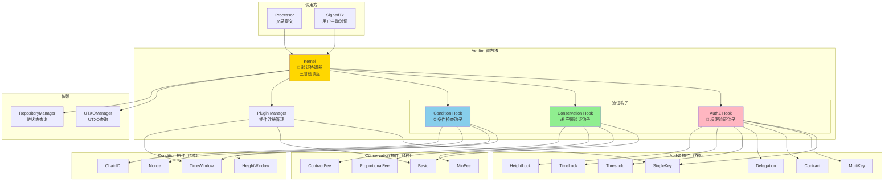
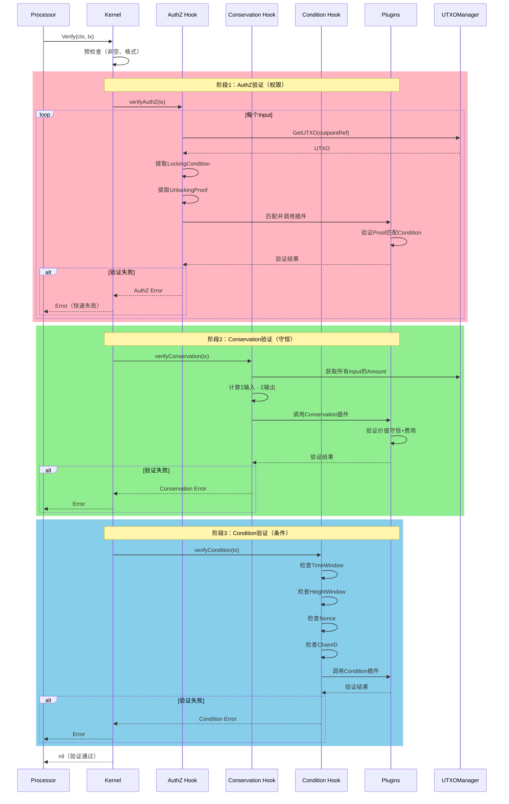
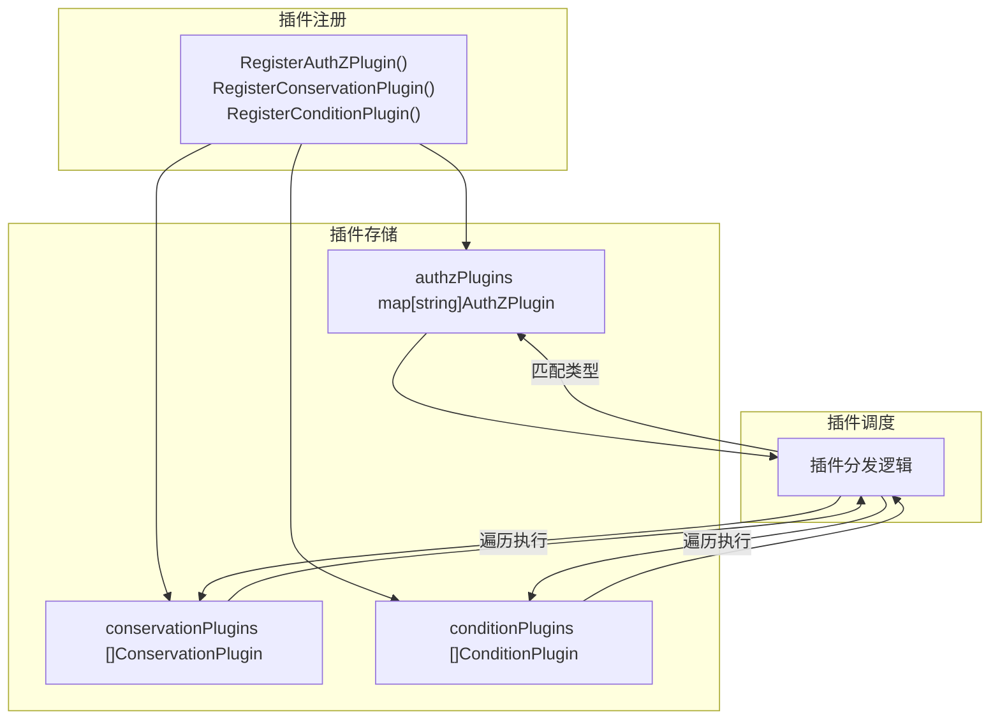

# TX Verifier（internal/core/tx/verifier）

> **📌 模块类型**：`[x] 实现模块` `[ ] 接口定义` `[ ] 数据结构` `[ ] 工具/其他`

---

## 📍 **模块定位**

本模块是WES系统中**交易处理域**的**验证微内核实现**，采用"微内核 + 插件"架构提供可扩展的三阶段验证。

**解决什么问题**：
- 三阶段验证（AuthZ权限 → Conservation守恒 → Condition条件）
- 可扩展的验证插件系统（7种AuthZ、4种Conservation、4种Condition）
- 批量验证优化（区块验证场景）
- 并发验证安全（无副作用、无状态）

**不解决什么问题**（边界）：
- 不执行交易（由 ISPC 负责）
- 不修改交易（验证无副作用）
- 不消费 UTXO（只检查，不修改状态）
- 不做签名验证（由插件负责，Verifier只协调）

---

## 🎯 **设计原则与核心约束**

### **设计原则**

| 原则 | 说明 | 价值 | 实现策略 |
|------|------|------|---------|
| **微内核架构** | 内核只做协调，逻辑在插件 | 高扩展性、易测试 | 内核提供钩子，插件实现逻辑 |
| **三阶段验证** | AuthZ→Conservation→Condition | 逐层过滤，快速失败 | 顺序执行钩子，任一失败立即返回 |
| **插件无状态** | 插件不存储验证结果 | 线程安全、可并行 | 插件只依赖输入参数 |
| **验证无副作用** | 不修改交易、不消费UTXO | 安全、可重复 | 只读取UTXO状态，不写入 |
| **快速失败** | 第一个错误立即返回 | 性能优化 | 遇到验证失败立即return error |

### **核心约束** ⭐

**严格遵守**：
- ✅ 必须按顺序验证：AuthZ → Conservation → Condition（逻辑依赖）
- ✅ 验证无副作用：只读取状态，不修改（幂等性）
- ✅ 插件无状态：不存储验证结果，只依赖输入（并发安全）
- ✅ 快速失败：任一input验证失败，整个交易失败（安全优先）
- ✅ UTXO引用：只增加引用计数，不消费（由区块确认后处理）

**严格禁止**：
- ❌ 跳过任何阶段：三阶段都必须执行（安全保证）
- ❌ 修改交易内容：验证过程不能改交易（只读）
- ❌ 消费UTXO：只检查可用性，不标记已用（状态一致性）
- ❌ 插件间通信：插件必须独立（避免耦合）
- ❌ 异步验证：当前版本串行执行（未来可优化）

---

## 🏗️ **架构设计**

### **整体架构**



### **验证流程**



### **插件系统架构**



---

## 📊 **核心机制**

### **机制1：三阶段验证顺序**

**为什么需要**：逻辑依赖 + 性能优化

**核心思路**：
1. **AuthZ 最先**：最严格，失败率最高，快速过滤无效交易
2. **Conservation 其次**：需要所有input合法才能计算总额
3. **Condition 最后**：最轻量，依赖交易基本合法

**实现策略**：

```go
// kernel.go
func (k *Kernel) Verify(ctx context.Context, tx *transaction.Transaction) error {
    // 阶段1：AuthZ验证（最严格）
    if err := k.authzHook.Verify(ctx, tx); err != nil {
        return fmt.Errorf("AuthZ验证失败: %w", err)  // 快速失败
    }
    
    // 阶段2：Conservation验证（依赖AuthZ通过）
    if err := k.conservationHook.Verify(ctx, tx); err != nil {
        return fmt.Errorf("Conservation验证失败: %w", err)
    }
    
    // 阶段3：Condition验证（最轻量）
    if err := k.conditionHook.Verify(ctx, tx); err != nil {
        return fmt.Errorf("Condition验证失败: %w", err)
    }
    
    return nil  // 所有阶段通过
}
```

**关键约束**：
- 不能并行执行（有依赖关系）
- 不能跳过任何阶段（安全保证）
- 任一阶段失败立即返回

**性能数据**（估算）：
- AuthZ: 80%失败在此（权限不足）
- Conservation: 15%失败在此（余额不足）
- Condition: 5%失败在此（时间/高度不满足）

### **机制2：插件匹配与调度**

**为什么需要**：不同LockingCondition需要不同的验证逻辑

**核心思路**：
1. AuthZ插件按类型匹配（SingleKey→SingleKeyPlugin）
2. Conservation插件全部执行（所有约束都要满足）
3. Condition插件按条件存在性执行

**实现策略**：

```go
// authz_hook.go
func (h *AuthZHook) Verify(ctx context.Context, tx *transaction.Transaction) error {
    for _, input := range tx.Inputs {
        // 获取UTXO
        utxo, err := h.utxoManager.GetUTXO(ctx, input.OutpointRef)
        if err != nil {
            return fmt.Errorf("UTXO不存在: %w", err)
        }
        
        // 提取LockingCondition类型
        conditionType := utxo.Output.LockingCondition.GetType()
        
        // 匹配插件
        plugin, ok := h.plugins[conditionType]
        if !ok {
            return fmt.Errorf("不支持的锁定条件类型: %s", conditionType)
        }
        
        // 调用插件验证
        if err := plugin.Verify(ctx, utxo.Output.LockingCondition, input.UnlockingProof); err != nil {
            return fmt.Errorf("input[%d]验证失败: %w", i, err)
        }
    }
    return nil
}

// conservation_hook.go
func (h *ConservationHook) Verify(ctx context.Context, tx *transaction.Transaction) error {
    // 所有Conservation插件都要执行
    for _, plugin := range h.plugins {
        if err := plugin.Verify(ctx, tx); err != nil {
            return fmt.Errorf("%s验证失败: %w", plugin.Name(), err)
        }
    }
    return nil
}
```

**关键约束**：
- AuthZ插件必须全部注册（缺少插件导致验证失败）
- Conservation插件必须全部通过（所有约束都要满足）
- Condition插件按需执行（没有条件则跳过）

### **机制3：UTXO引用计数管理**

**为什么需要**：防止UTXO被多次消费，但不在验证阶段消费

**核心思路**：
1. 验证阶段：只增加引用计数，不消费
2. 区块确认后：才真正消费UTXO
3. 区块回滚时：减少引用计数

**实现策略**：

```go
// kernel.go中的Verify
func (k *Kernel) Verify(ctx context.Context, tx *transaction.Transaction) error {
    // 增加UTXO引用计数（验证成功后）
    defer func() {
        if err == nil {
            for _, input := range tx.Inputs {
                if !input.IsReferenceOnly {
                    k.utxoManager.IncreaseRefCount(ctx, input.OutpointRef)
                }
            }
        }
    }()
    
    // 执行三阶段验证...
    if err := k.authzHook.Verify(ctx, tx); err != nil {
        return err
    }
    // ...
    
    return nil
}
```

**关键约束**：
- 验证通过才增加引用计数
- 引用计数≥1的UTXO不能被再次引用（防双花）
- 区块确认后才真正消费（设置spent=true）

---

## 📁 **目录结构**

```
internal/core/tx/verifier/
├── kernel.go                # 验证微内核 | Verify(), 注册管理
├── authz_hook.go            # AuthZ钩子 | 权限验证协调
├── conservation_hook.go     # Conservation钩子 | 守恒验证协调
├── condition_hook.go        # Condition钩子 | 条件检查协调
├── plugins/                 # 验证插件
│   ├── README.md           # 插件总览
│   ├── authz/              # AuthZ插件（7种）
│   │   ├── single_key.go   # 单密钥验证
│   │   ├── multi_key.go    # 多密钥验证
│   │   ├── contract.go     # 合约验证
│   │   ├── delegation.go   # 委托验证
│   │   ├── threshold.go    # 门限验证
│   │   ├── time_lock.go    # 时间锁验证
│   │   └── height_lock.go  # 高度锁验证
│   ├── conservation/       # Conservation插件（4种）
│   │   ├── basic.go        # 基础守恒
│   │   ├── min_fee.go      # 最小费用
│   │   ├── proportional_fee.go  # 比例费用
│   │   └── contract_fee.go # 合约费用
│   └── condition/          # Condition插件（4种）
│       ├── time_window.go  # 时间窗口
│       ├── height_window.go # 高度窗口
│       ├── nonce.go        # Nonce检查
│       └── chain_id.go     # ChainID检查
└── README.md                # 本文档
```

### **文件职责**

| 文件/目录 | 核心职责 | 关键方法/类型 | 为什么独立 |
|----------|---------|-------------|----------|
| **kernel.go** | 微内核协调器 | Verify(), Register*Plugin(), VerifyBatch() | 统一入口，插件管理 |
| **authz_hook.go** | AuthZ钩子实现 | Verify(), matchPlugin() | 权限验证逻辑独立 |
| **conservation_hook.go** | Conservation钩子实现 | Verify(), calculateBalance() | 守恒验证逻辑独立 |
| **condition_hook.go** | Condition钩子实现 | Verify(), checkTimeWindow() | 条件检查逻辑独立 |
| **plugins/authz/** | 7种权限验证插件 | 每种插件的Verify()实现 | 按类型分离，易扩展 |
| **plugins/conservation/** | 4种守恒验证插件 | 每种插件的Verify()实现 | 按策略分离，易扩展 |
| **plugins/condition/** | 4种条件检查插件 | 每种插件的Verify()实现 | 按条件分离，易扩展 |

---

## 🔗 **依赖与协作**

### **依赖关系**

| 依赖模块 | 依赖接口 | 用途 | 约束条件 |
|---------|---------|------|---------|
| `repository.UTXOManager` | GetUTXO(), IncreaseRefCount() | 查询UTXO、管理引用计数 | 只读+引用计数，不消费 |
| `repository.RepositoryManager` | GetCurrentHeight(), GetCurrentTime() | 查询链状态 | 只读，用于Condition验证 |
| `pkg/types` | Transaction, UTXO | 数据结构 | 只读，不修改 |
| `pb/blockchain/block/transaction` | Transaction protobuf | 交易协议 | 只解析，不修改 |

### **插件协作**

| 插件类型 | 数量 | 调度方式 | 失败策略 |
|---------|------|---------|---------|
| **AuthZ** | 7种 | 按类型匹配（一对一） | 任一input失败→整个交易失败 |
| **Conservation** | 4种 | 全部执行（全都要通过） | 任一插件失败→整个交易失败 |
| **Condition** | 4种 | 按条件存在性执行 | 任一条件不满足→整个交易失败 |

---

## 🎓 **使用指南**

### **场景1：启动时注册插件（module.go）**

```go
// module.go中的fx.Invoke
fx.Invoke(func(
    verifier interfaces.Verifier,
    authzPlugins []tx.AuthZPlugin,
    conservationPlugins []tx.ConservationPlugin,
    conditionPlugins []tx.ConditionPlugin,
) {
    // 注册AuthZ插件
    for _, plugin := range authzPlugins {
        verifier.RegisterAuthZPlugin(plugin)
    }
    
    // 注册Conservation插件
    for _, plugin := range conservationPlugins {
        verifier.RegisterConservationPlugin(plugin)
    }
    
    // 注册Condition插件
    for _, plugin := range conditionPlugins {
        verifier.RegisterConditionPlugin(plugin)
    }
})
```

### **场景2：Processor验证交易**

```go
// processor/service.go
func (s *Service) SubmitTx(ctx context.Context, tx *transaction.Transaction) error {
    // 验证交易
    if err := s.verifier.Verify(ctx, tx); err != nil {
        return fmt.Errorf("验证失败: %w", err)
    }
    
    // 验证通过，提交到TxPool
    return s.txPool.SubmitTx(tx)
}
```

### **场景3：批量验证（区块验证）**

```go
// blockchain验证区块中的所有交易
func (b *Blockchain) ValidateBlock(ctx context.Context, block *Block) error {
    // 批量验证所有交易
    errors := b.verifier.VerifyBatch(ctx, block.Transactions)
    
    for i, err := range errors {
        if err != nil {
            return fmt.Errorf("交易[%d]验证失败: %w", i, err)
        }
    }
    
    return nil
}
```

---

## ⚠️ **已知限制**

| 限制 | 影响 | 规避方法 | 未来计划 |
|------|------|---------|---------|
| 串行验证 | 批量验证性能有限 | 当前可接受 | 考虑AuthZ插件并行（无依赖） |
| 插件不可热更新 | 启动时注册，运行时不可变 | 重启系统 | 暂不支持（安全考虑） |
| UTXO引用计数内存占用 | 大量pending交易时占用内存 | 设置TxPool大小限制 | 考虑LRU缓存 |
| 无验证结果缓存 | 相同交易重复验证 | TxPool已去重 | 暂不需要（已被池去重） |

---

## 🔍 **设计权衡记录**

### **权衡1：微内核 vs 单体验证器**

**背景**：验证逻辑复杂且需要扩展

**备选方案**：
1. **微内核+插件**：内核协调，插件实现 - 优势：可扩展、易测试 - 劣势：复杂度高
2. **单体验证器**：所有逻辑在一起 - 优势：简单 - 劣势：难扩展、难测试

**选择**：微内核+插件

**理由**：
- 验证逻辑会持续增加（新的锁定条件）
- 不同部署可能需要不同插件组合
- 插件独立易于单元测试

**代价**：需要维护插件注册和调度机制

### **权衡2：串行验证 vs 并行验证**

**背景**：批量验证性能需求

**备选方案**：
1. **串行验证**：顺序执行 - 优势：简单、无并发问题 - 劣势：性能有限
2. **并行验证**：AuthZ插件并行 - 优势：性能高 - 劣势：复杂、需要同步

**选择**：串行验证（当前版本）

**理由**：
- 验证通常很快（<1ms per tx）
- 并行带来的复杂度不值得（UTXO查询仍是串行）
- 可以在未来版本优化

**代价**：批量验证性能有限（可接受）

### **权衡3：UTXO引用计数 vs 立即消费**

**背景**：防止双花

**备选方案**：
1. **引用计数**：验证时增加计数，确认时消费 - 优势：可回滚 - 劣势：需要管理计数
2. **立即消费**：验证时直接消费 - 优势：简单 - 劣势：难回滚

**选择**：引用计数

**理由**：
- 交易可能被mempool驱逐（未确认）
- 区块可能回滚（需要恢复UTXO）
- 引用计数提供灵活性

**代价**：需要维护引用计数，增加复杂度

---

## 📚 **相关文档**

- **架构设计**：[TX_STATE_MACHINE_ARCHITECTURE.md](../../_docs/architecture/TX_STATE_MACHINE_ARCHITECTURE.md) - 验证微内核架构
- **接口定义**：[interfaces/verifier.go](../interfaces/verifier.go) - Verifier 接口
- **公共接口**：`pkg/interfaces/tx/verifier.go` - TxVerifier 公共接口
- **插件文档**：[plugins/README.md](./plugins/README.md) - 插件系统详解

---

## 📋 **文档变更记录**

| 日期 | 变更内容 | 原因 |
|------|---------|------|
| 2025-10-23 | 创建完整架构文档 | 提供真实的微内核实现规划 |
| 2025-10-23 | 补齐三阶段验证机制 | 完善核心流程说明 |

---

> 📝 **实现指导**
>
> 本文档提供完整的微内核架构规划，包括：
> 1. **三阶段验证顺序**：AuthZ→Conservation→Condition，逻辑依赖+性能优化
> 2. **插件匹配调度**：AuthZ按类型、Conservation全执行、Condition按存在性
> 3. **UTXO引用计数**：验证增加计数、确认真正消费、回滚减少计数
> 4. **无副作用保证**：只读取状态、不修改交易、不消费UTXO
> 5. **可扩展设计**：插件注册、钩子机制、独立测试
>
> 实现时严格遵循微内核原则，确保内核只做协调，逻辑在插件。
