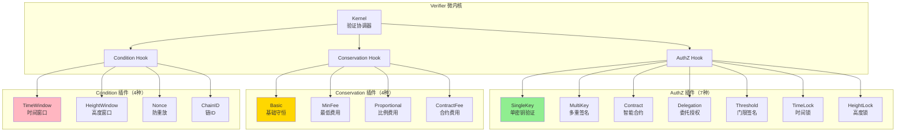
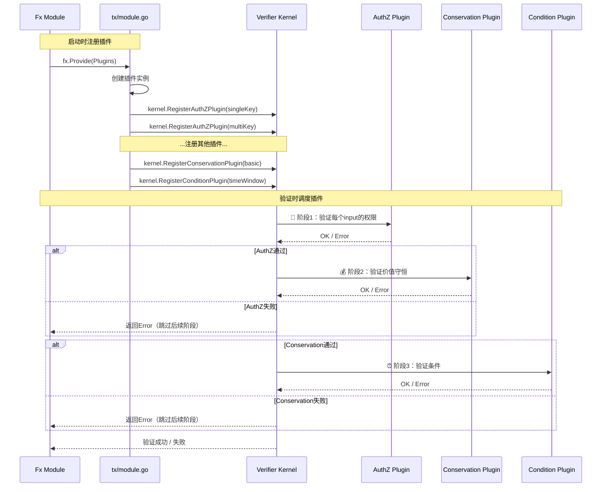
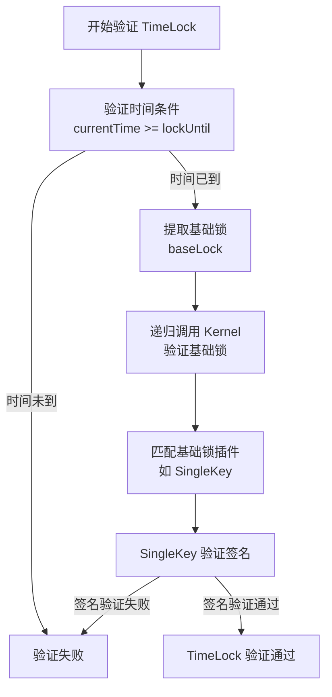
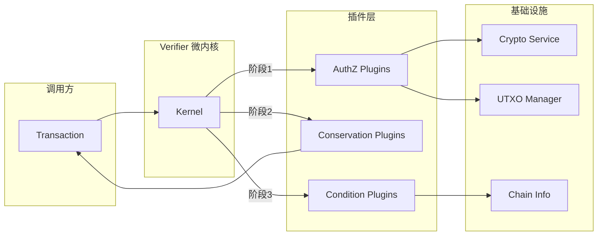

# TX Verifier Plugins（internal/core/tx/verifier/plugins）

> **📌 模块类型**：`[x] 实现模块` `[ ] 接口定义` `[ ] 数据结构` `[ ] 工具/其他`
> 
> ⚠️ **实现状态**：设计文档（代码待实现）

---

## 📍 **模块定位**

本模块是WES系统中**交易验证微内核**的**插件实现层**，提供15种验证插件（7种AuthZ + 4种Conservation + 4种Condition）。

**解决什么问题**：
- 实现具体的验证逻辑（权限、守恒、条件）
- 支持多种锁定机制（单签、多签、合约、委托、门限、时间锁、高度锁）
- 支持多种费用模式（基础守恒、最低费用、比例费用、合约费用）
- 支持多种条件检查（时间窗口、高度窗口、nonce、链ID）

**不解决什么问题**（边界）：
- 不负责插件调度（由 Verifier 微内核负责）
- 不管理插件注册（由 module.go 通过 fx 注册）
- 不修改交易内容（只读验证）
- 不做 UTXO 查询（通过 repository.UTXOManager 传入）

---

## 🎯 **设计原则与核心约束**

### **设计原则**

| 原则 | 说明 | 价值 | 实现策略 |
|------|------|------|---------|
| **插件无状态** | 不存储验证结果，只依赖输入 | 并发安全 | 插件不包含字段，只有方法 |
| **单一职责** | 每个插件只验证一种锁或条件 | 可维护性 | SingleKey 只验证单签，不做其他 |
| **可组合性** | 插件可灵活组合使用 | 灵活性 | 同时注册多个插件 |
| **快速失败** | 第一个验证失败立即返回 | 性能优化 | return error 而不是收集所有错误 |
| **递归验证** | 支持复合锁（如TimeLock包含基础锁） | 可扩展性 | TimeLock 插件递归调用其他插件 |

### **核心约束** ⭐

**严格遵守**：
- ✅ 插件必须无状态（并发安全）
- ✅ 插件必须只读（不修改交易、不修改UTXO）
- ✅ 插件必须幂等（多次验证结果一致）
- ✅ 插件必须独立（不依赖其他插件，除递归验证）
- ✅ 插件必须快速失败（验证失败立即返回error）

**严格禁止**：
- ❌ 插件存储状态（如缓存验证结果）
- ❌ 插件修改输入参数
- ❌ 插件调用外部服务（如HTTP请求）
- ❌ 插件阻塞（长时间运行）
- ❌ 插件间直接通信

---

## 🏗️ **架构设计**

### **整体架构**



### **插件分类与职责**

| 插件类型 | 插件数量 | 调用时机 | 核心职责 | 失败影响 |
|---------|---------|---------|---------|---------|
| **AuthZ 插件** | 7种 | 阶段1（第一阶段） | 验证 UnlockingProof 匹配 LockingCondition | 交易立即拒绝 |
| **Conservation 插件** | 4种 | 阶段2（权限验证通过后） | 验证 Σ输入 ≥ Σ输出 + Fee | 交易立即拒绝 |
| **Condition 插件** | 4种 | 阶段3（守恒验证通过后） | 验证时间锁、高度锁、nonce、链ID | 交易立即拒绝 |

### **插件注册与调度流程**



---

## 📊 **核心机制**

### **机制1：插件匹配机制**

**为什么需要**：一个交易可能有多个不同类型的 input，需要匹配正确的插件

**核心思路**：
1. 插件通过 `SupportsLockType(lockType)` 声明支持的锁类型
2. 微内核遍历注册的插件，找到第一个支持该锁类型的插件
3. 调用插件的 `VerifyAuthZ()` 方法进行验证

**实现策略**：

```go
// AuthZPlugin 接口
type AuthZPlugin interface {
    // SupportsLockType 判断是否支持该锁类型
    SupportsLockType(lockType transaction.LockType) bool
    
    // VerifyAuthZ 验证权限
    VerifyAuthZ(ctx context.Context, input *transaction.Input, utxo *types.UTXO) error
}

// 微内核调度逻辑
func (k *Kernel) verifyAuthZ(ctx context.Context, input *transaction.Input) error {
    // 1. 获取被引用的 UTXO
    utxo, err := k.utxoManager.Get(input.OutpointRef)
    if err != nil {
        return fmt.Errorf("UTXO不存在: %w", err)
    }
    
    // 2. 提取锁类型
    lockType := utxo.LockingCondition.LockType
    
    // 3. 遍历插件，找到支持该锁类型的插件
    for _, plugin := range k.authzPlugins {
        if plugin.SupportsLockType(lockType) {
            // 4. 调用插件验证
            return plugin.VerifyAuthZ(ctx, input, utxo)
        }
    }
    
    return fmt.Errorf("不支持的锁类型: %v", lockType)
}
```

**支持的锁类型映射**：

| 锁类型 | 对应插件 | 验证逻辑 |
|-------|---------|---------|
| `LOCK_TYPE_SINGLE_KEY` | SingleKeyPlugin | 验证签名与公钥匹配 |
| `LOCK_TYPE_MULTI_KEY` | MultiKeyPlugin | 验证多重签名（M of N） |
| `LOCK_TYPE_CONTRACT` | ContractPlugin | 调用合约验证方法 |
| `LOCK_TYPE_DELEGATION` | DelegationPlugin | 验证委托授权链 |
| `LOCK_TYPE_THRESHOLD` | ThresholdPlugin | 验证门限签名 |
| `LOCK_TYPE_TIME_LOCK` | TimeLockPlugin | 验证时间锁 + 递归验证基础锁 |
| `LOCK_TYPE_HEIGHT_LOCK` | HeightLockPlugin | 验证高度锁 + 递归验证基础锁 |

### **机制2：递归验证（复合锁）**

**为什么需要**：TimeLock 和 HeightLock 是复合锁，包含基础锁

**核心思路**：
1. TimeLock 插件先验证时间条件
2. 然后递归调用微内核验证基础锁（基础锁可能是 SingleKey、MultiKey 等）
3. 两者都通过，TimeLock 才通过

**实现策略**：

```go
// TimeLockPlugin 实现
type TimeLockPlugin struct {
    kernel *Kernel  // 持有微内核引用，用于递归验证
}

func (p *TimeLockPlugin) VerifyAuthZ(ctx context.Context, input *transaction.Input, utxo *types.UTXO) error {
    // 1. 提取 TimeLock 条件
    timeLock := utxo.LockingCondition.TimeLock
    if timeLock == nil {
        return errors.New("TimeLock 条件缺失")
    }
    
    // 2. 验证时间条件
    currentTime := time.Now().Unix()
    if currentTime < timeLock.LockUntil {
        return fmt.Errorf("时间锁未到期：当前 %d < 锁定到 %d", currentTime, timeLock.LockUntil)
    }
    
    // 3. 递归验证基础锁
    // 构造新的 UTXO，使用基础锁
    baseUTXO := &types.UTXO{
        LockingCondition: timeLock.BaseLock,  // 使用基础锁
        // ... 其他字段 ...
    }
    
    // 调用微内核验证基础锁
    return p.kernel.verifyAuthZ(ctx, input, baseUTXO)
}
```

**递归验证流程**：



### **机制3：插件无状态设计**

**为什么需要**：保证并发安全，支持批量验证

**核心思路**：
1. 插件不包含字段（无状态）
2. 所有数据通过参数传入
3. 插件方法是纯函数（相同输入 → 相同输出）

**实现策略**：

```go
// ✅ 正确的无状态设计
type SingleKeyPlugin struct {
    // 无字段！
}

func (p *SingleKeyPlugin) VerifyAuthZ(ctx context.Context, input *transaction.Input, utxo *types.UTXO) error {
    // 所有数据从参数获取
    lockingCondition := utxo.LockingCondition
    unlockingProof := input.UnlockingProof
    
    // 纯函数：只依赖输入，不依赖外部状态
    return verifySingleKeySignature(lockingCondition.PublicKey, unlockingProof.Signature, utxo.TxHash)
}

// ❌ 错误的有状态设计
type WrongPlugin struct {
    lastVerifiedTxHash []byte  // ❌ 存储状态
    verifyCount        int     // ❌ 存储状态
}
```

---

## 📁 **目录结构**

```
internal/core/tx/verifier/plugins/
├── README.md                        # 本文档
├── authz/                           # 权限验证插件（7种）
│   ├── README.md                    # AuthZ 插件详细说明
│   ├── single_key.go                # SingleKeyPlugin
│   ├── multi_key.go                 # MultiKeyPlugin
│   ├── contract.go                  # ContractPlugin
│   ├── delegation.go                # DelegationPlugin
│   ├── threshold.go                 # ThresholdPlugin
│   ├── time_lock.go                 # TimeLockPlugin
│   └── height_lock.go               # HeightLockPlugin
├── conservation/                    # 价值守恒插件（4种）
│   ├── README.md                    # Conservation 插件详细说明
│   ├── basic.go                     # BasicConservationPlugin
│   ├── min_fee.go                   # MinFeePlugin
│   ├── proportional_fee.go          # ProportionalFeePlugin
│   └── contract_fee.go              # ContractFeePlugin
└── condition/                       # 条件检查插件（4种）
    ├── README.md                    # Condition 插件详细说明
    ├── time_window.go               # TimeWindowPlugin
    ├── height_window.go             # HeightWindowPlugin
    ├── nonce.go                     # NoncePlugin
    └── chain_id.go                  # ChainIDPlugin
```

---

## 🔗 **依赖与协作**

### **依赖关系**

| 插件类型 | 依赖模块 | 依赖接口/类型 | 用途 |
|---------|---------|--------------|------|
| **AuthZ** | `pkg/interfaces/infrastructure/crypto` | Crypto 接口 | 签名验证 |
| **AuthZ** | `pkg/interfaces/repository` | UTXOManager | UTXO 查询 |
| **Conservation** | `pkg/types` | Transaction | 金额计算 |
| **Condition** | `pkg/interfaces/blockchain` | ChainInfo | 当前高度/时间 |

### **插件协作流程**



---

## 🎓 **使用指南**

### **场景1：启动时注册插件**

```go
// module.go
func Module() fx.Option {
    return fx.Module("tx",
        // ==================== 验证插件 ====================
        fx.Provide(
            // AuthZ 插件（7种）
            fx.Annotate(
                authz.NewSingleKeyPlugin,
                fx.As(new(tx.AuthZPlugin)),
                fx.ResultTags(`group:"authz_plugins"`),
            ),
            fx.Annotate(
                authz.NewMultiKeyPlugin,
                fx.As(new(tx.AuthZPlugin)),
                fx.ResultTags(`group:"authz_plugins"`),
            ),
            // ... 其他 AuthZ 插件 ...
            
            // Conservation 插件（4种）
            fx.Annotate(
                conservation.NewBasicPlugin,
                fx.As(new(tx.ConservationPlugin)),
                fx.ResultTags(`group:"conservation_plugins"`),
            ),
            // ... 其他 Conservation 插件 ...
            
            // Condition 插件（4种）
            fx.Annotate(
                condition.NewTimeWindowPlugin,
                fx.As(new(tx.ConditionPlugin)),
                fx.ResultTags(`group:"condition_plugins"`),
            ),
            // ... 其他 Condition 插件 ...
        ),
        
        // 插件注册（启动时自动注册到 Verifier）
        fx.Invoke(func(
            verifier interfaces.Verifier,
            authzPlugins []tx.AuthZPlugin `group:"authz_plugins"`,
            conservationPlugins []tx.ConservationPlugin `group:"conservation_plugins"`,
            conditionPlugins []tx.ConditionPlugin `group:"condition_plugins"`,
            logger log.Logger,
        ) {
            // 注册 AuthZ 插件
            for _, plugin := range authzPlugins {
                verifier.RegisterAuthZPlugin(plugin)
                logger.Infof("✅ 已注册 AuthZ 插件：%T", plugin)
            }
            
            // 注册 Conservation 插件
            for _, plugin := range conservationPlugins {
                verifier.RegisterConservationPlugin(plugin)
                logger.Infof("✅ 已注册 Conservation 插件：%T", plugin)
            }
            
            // 注册 Condition 插件
            for _, plugin := range conditionPlugins {
                verifier.RegisterConditionPlugin(plugin)
                logger.Infof("✅ 已注册 Condition 插件：%T", plugin)
            }
            
            logger.Infof("✅ 验证插件注册完成：AuthZ=%d, Conservation=%d, Condition=%d",
                len(authzPlugins), len(conservationPlugins), len(conditionPlugins))
        }),
    )
}
```

### **场景2：实现一个简单插件**

```go
// authz/single_key.go
package authz

import (
    "context"
    "fmt"
    
    transaction "github.com/weisyn/v1/pb/blockchain/block/transaction"
    "github.com/weisyn/v1/pkg/interfaces/infrastructure/crypto"
    "github.com/weisyn/v1/pkg/types"
)

type SingleKeyPlugin struct {
    crypto crypto.Crypto  // 签名验证服务
}

func NewSingleKeyPlugin(crypto crypto.Crypto) *SingleKeyPlugin {
    return &SingleKeyPlugin{crypto: crypto}
}

// SupportsLockType 判断是否支持该锁类型
func (p *SingleKeyPlugin) SupportsLockType(lockType transaction.LockType) bool {
    return lockType == transaction.LockType_LOCK_TYPE_SINGLE_KEY
}

// VerifyAuthZ 验证单密钥权限
func (p *SingleKeyPlugin) VerifyAuthZ(ctx context.Context, input *transaction.Input, utxo *types.UTXO) error {
    // 1. 提取锁定条件（公钥）
    lockingCondition := utxo.LockingCondition
    if lockingCondition.PublicKey == nil {
        return fmt.Errorf("SingleKey 锁定条件缺失公钥")
    }
    
    // 2. 提取解锁证明（签名）
    unlockingProof := input.UnlockingProof
    if unlockingProof.Signature == nil {
        return fmt.Errorf("SingleKey 解锁证明缺失签名")
    }
    
    // 3. 计算交易哈希（签名目标）
    txHash := computeTxHash(utxo.Tx)
    
    // 4. 验证签名
    isValid := p.crypto.VerifySignature(
        lockingCondition.PublicKey.Value,
        txHash,
        unlockingProof.Signature.Value,
    )
    
    if !isValid {
        return fmt.Errorf("SingleKey 签名验证失败")
    }
    
    return nil
}
```

---

## ⚠️ **已知限制**

| 限制 | 影响 | 规避方法 | 未来计划 |
|------|------|---------|---------|
| 插件串行验证 | 批量验证性能差 | 单笔交易影响不大 | v2.0 考虑并行验证 |
| 不支持插件优先级 | 无法控制执行顺序 | 按注册顺序执行 | 暂不支持 |
| 递归验证深度无限制 | 可能栈溢出 | 业务上限制锁嵌套层数 | 添加深度检查 |
| 插件错误信息不详细 | 调试困难 | 插件内部记录详细日志 | 改进错误上下文 |

---

## 🔍 **设计权衡记录**

### **权衡1：插件接口设计**

**背景**：插件接口应该包含哪些方法

**备选方案**：
1. **最小接口**：只有 `VerifyAuthZ()` - 优势：简单 - 劣势：无法优化
2. **完整接口**：包含 `SupportsLockType()`, `Name()`, `Priority()` 等 - 优势：灵活 - 劣势：复杂

**选择**：最小接口 + `SupportsLockType()`

**理由**：
- `SupportsLockType()` 是必须的（插件匹配）
- 其他方法（如 `Name()`）可通过反射获取
- 保持接口简洁，降低实现成本

**代价**：无法通过接口获取插件名称，需要反射

### **权衡2：递归验证 vs 平铺验证**

**背景**：复合锁（TimeLock）如何验证

**备选方案**：
1. **递归验证**：TimeLock 插件调用微内核验证基础锁 - 优势：逻辑清晰 - 劣势：性能开销
2. **平铺验证**：TimeLock 插件直接验证所有条件 - 优势：性能好 - 劣势：代码重复

**选择**：递归验证

**理由**：
- 代码复用：避免在 TimeLock 中重复实现 SingleKey 验证逻辑
- 可扩展性：支持任意复合锁（TimeLock + MultiKey + Delegation）
- 性能开销可接受（递归层数通常 ≤ 3）

**代价**：递归调用有性能开销，需限制递归深度

### **权衡3：插件注册方式**

**背景**：插件如何注册到微内核

**备选方案**：
1. **手动注册**：`kernel.RegisterAuthZPlugin(plugin)` - 优势：灵活 - 劣势：易遗漏
2. **自动扫描**：扫描 plugins 目录自动注册 - 优势：方便 - 劣势：不可控
3. **fx 注入**：通过 fx.Provide 和 group 标签注册 - 优势：统一管理 - 劣势：配置复杂

**选择**：fx 注入

**理由**：
- 与项目整体架构一致（使用 fx 管理依赖）
- 支持条件注册（如生产环境禁用某些插件）
- 便于测试（Mock 插件）

**代价**：module.go 配置较复杂，需正确使用 group 标签

---

## 📚 **相关文档**

- **AuthZ 插件详细设计**：[authz/README.md](./authz/README.md) - 7种权限验证插件
- **Conservation 插件详细设计**：[conservation/README.md](./conservation/README.md) - 4种价值守恒插件
- **Condition 插件详细设计**：[condition/README.md](./condition/README.md) - 4种条件检查插件
- **Verifier 微内核**：[../README.md](../README.md) - 验证微内核架构
- **插件接口定义**：[pkg/interfaces/tx/verifier.go](../../../../pkg/interfaces/tx/verifier.go) - 插件接口

---

---

## 🏭 **插件实现详情**

### P5: 企业功能扩展（MultiKey + 费用机制）

**实施状态**: ✅ 已完成（P5.1 - P5.5）

**已实现组件**：

| 组件 | 类型 | 文件 | 状态 |
|------|------|------|------|
| **MultiKeyPlugin** | AuthZ插件 | `authz/multi_key.go` | ✅ 完成 |
| **MinFeePlugin** | Conservation插件 | `conservation/min_fee.go` | ✅ 完成 |
| **ProportionalFeePlugin** | Conservation插件 | `conservation/proportional_fee.go` | ✅ 完成 |

**MultiKeyPlugin（M-of-N 多签验证）**：
- **M-of-N 签名验证**：N 个授权公钥中任意 M 个签名即可
- **索引有效性验证**：key_index 必须在 [0, N-1] 范围内
- **索引唯一性验证**：不允许重复使用相同的 key_index
- **密码学验证**：每个签名对应正确的公钥
- **算法一致性验证**：所有签名算法一致且符合要求

**MinFeePlugin（最低费用验证）**：
- **最低费用检查**：actual_fee >= minimum_amount
- **费用计算**：Σ(输入) - Σ(输出)
- **可选验证**：未设置 minimum_fee 时直接通过

**ProportionalFeePlugin（按比例收费验证）**：
- **比例费用计算**：fee = 转账金额 × (rate / 10000)
- **最大费用限制**：actual_fee <= max_fee_amount（可选）
- **可选验证**：未设置 proportional_fee 时直接通过

### P6: 输入级锁定条件（TimeLock + HeightLock）

**实施状态**: ✅ 已完成框架（P6.1 - P6.2），P6.3 递归验证待完整实现

**已实现组件**：

| 组件 | 类型 | 文件 | 状态 |
|------|------|------|------|
| **TimeLockPlugin** | AuthZ插件 | `authz/time_lock.go` | ✅ 完成框架 |
| **HeightLockPlugin** | AuthZ插件 | `authz/height_lock.go` | ✅ 完成框架 |
| **递归验证框架** | 验证逻辑 | 插件内标注 | ⚠️ 待P6.3完整实现 |

**TimeLockPlugin（输入级时间锁）**：
- **时间条件验证**：current_timestamp >= unlock_timestamp
- **基础锁递归验证**：验证 base_lock 与 base_proof 是否匹配
- **多种时间来源**：区块时间戳 / 中位数时间 / 预言机

**HeightLockPlugin（输入级高度锁）**：
- **高度条件验证**：current_height >= unlock_height + confirmation_blocks
- **确认区块数验证**：确保足够的确认数
- **基础锁递归验证**：验证 base_lock 与 base_proof 是否匹配
- **轻客户端支持**：验证区块头证明

**递归验证框架**：
- TimeLock 和 HeightLock 都包含 `base_lock` 字段
- 验证时间/高度条件满足后，递归调用其他 AuthZ 插件验证 `base_lock`
- 当前实现提供完整框架，标注接口适配点供后续完善

### P8: 复杂授权插件（Delegation + Threshold + Contract）

**实施状态**: ✅ 已完成

**已实现组件**：

| 组件 | 文件 | 行数 | 功能 |
|------|------|------|------|
| **DelegationPlugin** | `authz/delegation.go` | 208行 | 委托授权验证 |
| **ThresholdPlugin** | `authz/threshold.go` | 214行 | 门限签名验证 |
| **ContractPlugin** | `authz/contract.go` | 218行 | 合约锁定验证 |

**总计**: ~640行生产级代码

**DelegationPlugin（委托授权验证）**：
- **委托授权**：允许 UTXO 所有者授权第三方代为操作
- **时限控制**：委托有效期检查（expiry_duration_blocks）
- **操作限制**：授权操作类型白名单（authorized_operations）
- **价值限额**：单次操作最大价值限制（max_value_per_operation）
- **白名单机制**：允许的被委托者列表（allowed_delegates）
- **签名验证**：被委托方签名有效性检查

**ThresholdPlugin（门限签名验证）**：
- **门限签名**：使用门限密码学的高级多签方案
- **份额验证**：验证至少 threshold 个有效的签名份额
- **唯一性检查**：每个份额对应不同的参与方（party_id 不重复）
- **密钥验证**：每个份额的验证密钥在预定义集合中
- **组合签名**：验证组合签名的有效性
- **方案一致性**：签名方案符合锁定条件的要求

**ContractPlugin（合约锁定验证）**：
- **合约地址匹配**：验证合约地址一致性
- **方法名匹配**：验证调用的方法名
- **执行时间限制**：验证执行时间在允许范围内
- **结果哈希验证**：验证执行结果哈希存在且非空
- **状态转换证明**：验证状态转换证明存在
- **参数完整性**：验证输入参数存在

详细实现说明请参考各插件源码注释。

---

## 📋 **文档变更记录**

| 日期 | 变更内容 | 原因 |
|------|---------|------|
| 2025-11-XX | 整合 P5/P6/P8 插件实现说明 | 统一文档结构 |
| 2025-10-23 | 创建完整插件架构文档 | 提供插件系统设计说明 |
| 2025-10-23 | 补齐插件匹配机制、递归验证、无状态设计 | 完善核心机制 |

---

> 📝 **实现指导**
>
> 本文档定义了 Verifier 插件系统的完整架构，包括：
> 1. **15种插件**：7种AuthZ + 4种Conservation + 4种Condition
> 2. **插件匹配机制**：通过 `SupportsLockType()` 匹配正确的插件
> 3. **递归验证**：支持复合锁（TimeLock + 基础锁）
> 4. **无状态设计**：保证并发安全，支持批量验证
> 5. **fx 注入注册**：通过 group 标签统一管理插件
>
> 实现插件时严格遵守无状态原则，确保验证逻辑的幂等性和并发安全性。
