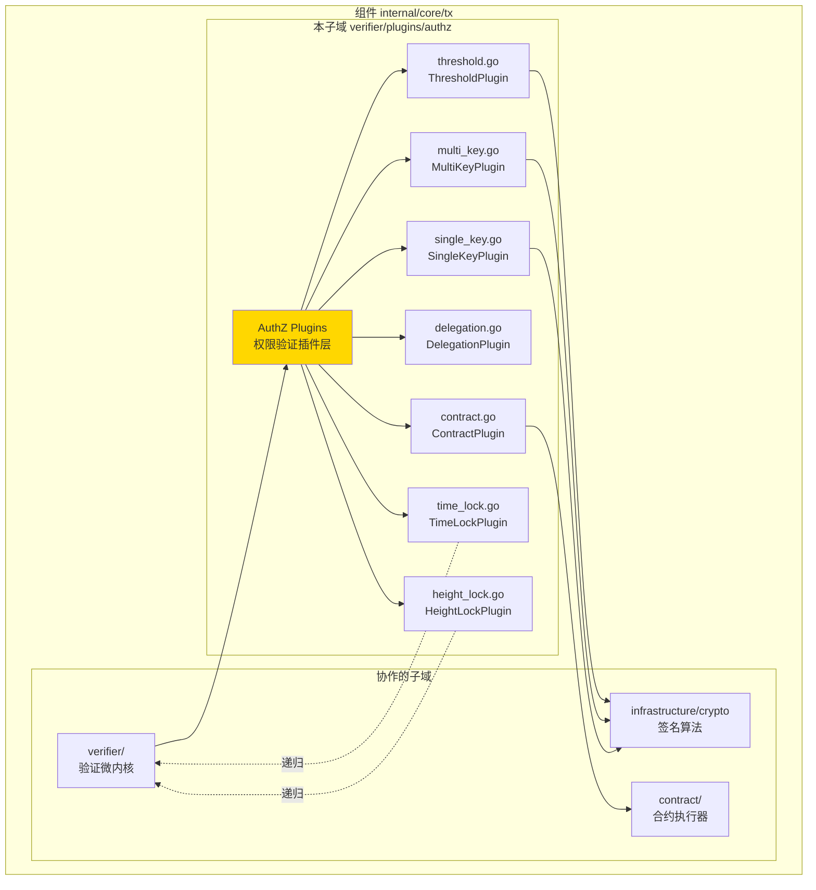
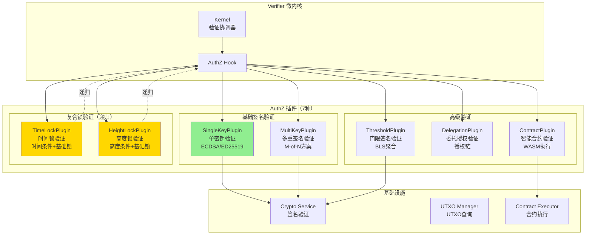
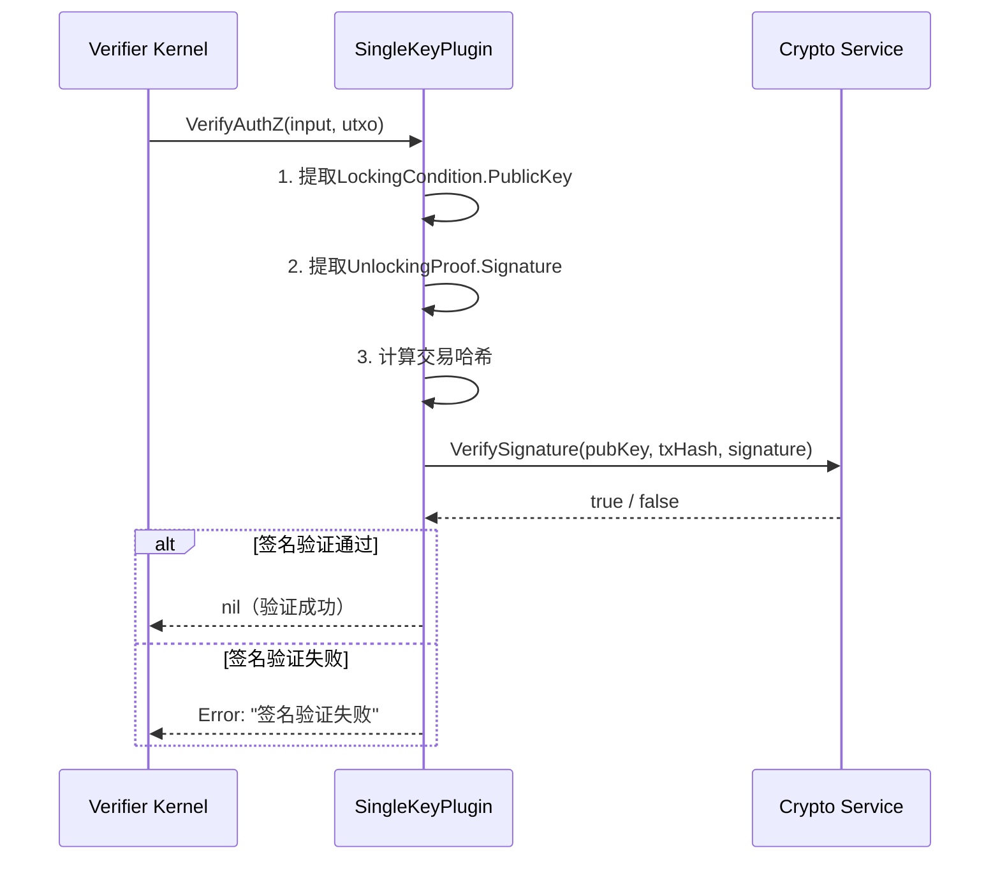
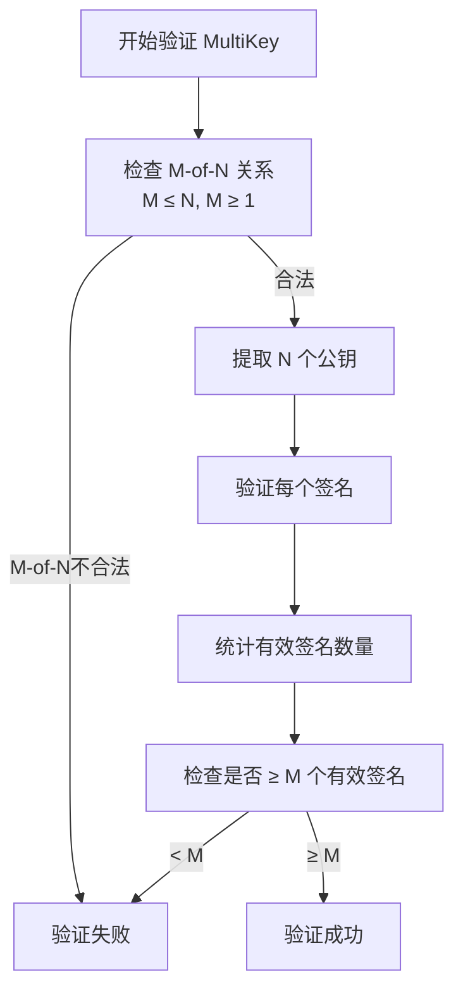
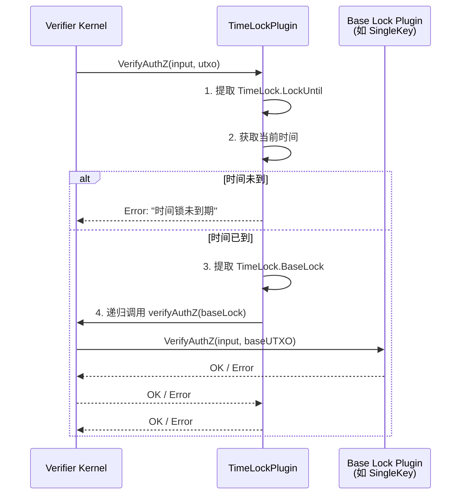
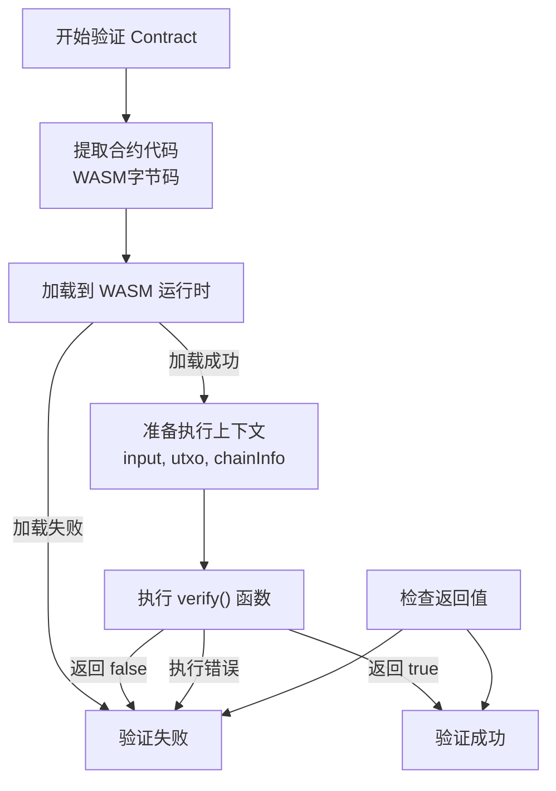

# AuthZ Plugins（internal/core/tx/verifier/plugins/authz）

---

## 📌 版本信息

- **版本**：1.0
- **状态**：stable
- **最后更新**：2025-11-30
- **最后审核**：2025-11-30
- **所有者**：TX模块团队
- **适用范围**：internal/core/tx/verifier/plugins/authz 模块

> ⚠️ **实现状态**：设计文档（代码待实现）

---

## 🎯 **子域定位**

**路径**：`internal/core/tx/verifier/plugins/authz/`

**所属组件**：`tx`

**核心职责**：提供7种AuthZ插件实现，覆盖所有锁定机制的权限验证。

**在组件中的角色**：
- 单密钥验证（SingleKey）：最常见的签名验证
- 多重签名验证（MultiKey）：M-of-N多签方案
- 智能合约验证（Contract）：合约逻辑控制解锁
- 委托授权验证（Delegation）：授权链验证
- 门限签名验证（Threshold）：门限密码学方案
- 时间锁验证（TimeLock）：时间条件 + 基础锁
- 高度锁验证（HeightLock）：区块高度条件 + 基础锁

**解决什么问题**：
- 单密钥验证（SingleKey）：最常见的签名验证
- 多重签名验证（MultiKey）：M-of-N多签方案
- 智能合约验证（Contract）：合约逻辑控制解锁
- 委托授权验证（Delegation）：授权链验证
- 门限签名验证（Threshold）：门限密码学方案
- 时间锁验证（TimeLock）：时间条件 + 基础锁
- 高度锁验证（HeightLock）：区块高度条件 + 基础锁

**不解决什么问题**（边界）：
- 不负责价值守恒检查（由 Conservation 插件负责）
- 不负责条件检查（由 Condition 插件负责）
- 不负责插件调度（由 Verifier 微内核负责）
- 不做 UTXO 查询（通过参数传入）

---

## 🎯 **设计原则与核心约束**

### **设计原则**

| 原则 | 说明 | 价值 | 实现策略 |
|------|------|------|---------|
| **一个插件一种锁** | 每个插件只验证一种 LockType | 清晰性 | SingleKey 只验证 LOCK_TYPE_SINGLE_KEY |
| **递归验证支持** | 复合锁递归调用微内核 | 可扩展性 | TimeLock 递归验证基础锁 |
| **签名算法解耦** | 通过 Crypto 接口验证签名 | 灵活性 | 支持 ECDSA、ED25519 等 |
| **无状态设计** | 插件不存储验证结果 | 并发安全 | 只依赖输入参数 |
| **快速失败** | 验证失败立即返回 | 性能优化 | 第一个错误立即 return |

### **核心约束** ⭐

**严格遵守**：
- ✅ 签名验证必须用 Crypto 接口（不自己实现签名算法）
- ✅ 递归验证深度必须有限制（防止栈溢出）
- ✅ 插件必须验证所有必要字段（如 PublicKey、Signature 非空）
- ✅ 错误信息必须明确（便于调试）
- ✅ 多签验证必须严格验证 M-of-N 关系

**严格禁止**：
- ❌ 跳过签名验证（安全风险）
- ❌ 缓存验证结果（并发问题）
- ❌ 修改输入参数（只读）
- ❌ 信任未验证的签名
- ❌ 使用弱签名算法

---

## 🏗️ **架构设计**

### **在组件中的位置**

> **说明**：展示此子域在组件内部的位置和协作关系



**位置说明**：

| 关系类型 | 目标 | 关系说明 |
|---------|------|---------|
| **协作** | verifier/ | 作为验证插件注册到验证微内核 |
| **依赖** | infrastructure/crypto | 使用签名算法验证签名 |
| **依赖** | contract/ | ContractPlugin 使用合约执行器 |

### **整体架构**



### **7种插件对照表**

| 插件 | 锁类型 | 复杂度 | 性能 | 典型场景 | 递归验证 |
|------|--------|--------|------|---------|---------|
| **SingleKey** | SINGLE_KEY | 低 | 极快 | 个人钱包、普通转账 | ❌ |
| **MultiKey** | MULTI_KEY | 中 | 快 | 多签钱包、联合账户 | ❌ |
| **Contract** | CONTRACT | 高 | 慢 | 智能合约、复杂逻辑 | ❌ |
| **Delegation** | DELEGATION | 中 | 中 | 授权代理、子账户 | ❌ |
| **Threshold** | THRESHOLD | 高 | 中 | 门限签名、隐私保护 | ❌ |
| **TimeLock** | TIME_LOCK | 中 | 中 | 定时解锁、遗嘱 | ✅ |
| **HeightLock** | HEIGHT_LOCK | 中 | 中 | 高度解锁、延迟支付 | ✅ |

---

## 📊 **核心机制**

### **机制1：SingleKeyPlugin - 单密钥验证**

**为什么需要**：最常见的锁定方式，验证签名与公钥匹配

**验证流程**：



**实现示例**：

```go
package authz

import (
    "context"
    "fmt"
    
    transaction "github.com/weisyn/v1/pb/blockchain/block/transaction"
    "github.com/weisyn/v1/pkg/interfaces/infrastructure/crypto"
    "github.com/weisyn/v1/pkg/types"
)

type SingleKeyPlugin struct {
    crypto crypto.Crypto
}

func NewSingleKeyPlugin(crypto crypto.Crypto) *SingleKeyPlugin {
    return &SingleKeyPlugin{crypto: crypto}
}

func (p *SingleKeyPlugin) SupportsLockType(lockType transaction.LockType) bool {
    return lockType == transaction.LockType_LOCK_TYPE_SINGLE_KEY
}

func (p *SingleKeyPlugin) VerifyAuthZ(ctx context.Context, input *transaction.Input, utxo *types.UTXO) error {
    // 1. 提取锁定条件（公钥）
    lockingCondition := utxo.LockingCondition
    if lockingCondition.PublicKey == nil {
        return fmt.Errorf("SingleKey 锁定条件缺失公钥")
    }
    
    // 2. 提取解锁证明（签名）
    unlockingProof := input.UnlockingProof
    if unlockingProof.Signature == nil {
        return fmt.Errorf("SingleKey 解锁证明缺失签名")
    }
    
    // 3. 计算交易哈希
    txHash := computeTxHash(utxo.Tx)
    
    // 4. 验证签名
    isValid := p.crypto.VerifySignature(
        lockingCondition.PublicKey.Value,
        txHash,
        unlockingProof.Signature.Value,
    )
    
    if !isValid {
        return fmt.Errorf("SingleKey 签名验证失败")
    }
    
    return nil
}
```

### **机制2：MultiKeyPlugin - 多重签名验证**

**为什么需要**：多方共同控制资产，需要 M-of-N 签名方案

**验证流程**：



**实现示例**：

```go
type MultiKeyPlugin struct {
    crypto crypto.Crypto
}

func (p *MultiKeyPlugin) VerifyAuthZ(ctx context.Context, input *transaction.Input, utxo *types.UTXO) error {
    // 1. 提取 M-of-N 配置
    multiKey := utxo.LockingCondition.MultiKey
    if multiKey == nil {
        return fmt.Errorf("MultiKey 锁定条件缺失")
    }
    
    M := multiKey.RequiredSignatures  // 需要的签名数
    N := len(multiKey.PublicKeys)     // 总公钥数
    
    // 2. 验证 M-of-N 关系
    if M > uint32(N) || M < 1 {
        return fmt.Errorf("MultiKey M-of-N 关系不合法: M=%d, N=%d", M, N)
    }
    
    // 3. 提取签名
    signatures := input.UnlockingProof.Signatures
    if len(signatures) < int(M) {
        return fmt.Errorf("MultiKey 签名数量不足: 需要%d, 提供%d", M, len(signatures))
    }
    
    // 4. 验证每个签名
    txHash := computeTxHash(utxo.Tx)
    validCount := 0
    
    for i, pubKey := range multiKey.PublicKeys {
        if i >= len(signatures) {
            break
        }
        
        signature := signatures[i]
        if p.crypto.VerifySignature(pubKey.Value, txHash, signature.Value) {
            validCount++
        }
    }
    
    // 5. 检查是否达到阈值
    if validCount < int(M) {
        return fmt.Errorf("MultiKey 有效签名数量不足: 需要%d, 有效%d", M, validCount)
    }
    
    return nil
}
```

### **机制3：TimeLockPlugin - 时间锁验证（递归）**

**为什么需要**：支持定时解锁（如遗嘱、延迟支付）

**验证流程**：



**实现示例**：

```go
type TimeLockPlugin struct {
    kernel *Kernel  // 持有微内核引用
}

func (p *TimeLockPlugin) VerifyAuthZ(ctx context.Context, input *transaction.Input, utxo *types.UTXO) error {
    // 1. 提取 TimeLock 条件
    timeLock := utxo.LockingCondition.TimeLock
    if timeLock == nil {
        return fmt.Errorf("TimeLock 条件缺失")
    }
    
    // 2. 验证时间条件
    currentTime := time.Now().Unix()
    if currentTime < timeLock.LockUntil {
        return fmt.Errorf("时间锁未到期：当前 %d < 锁定到 %d", currentTime, timeLock.LockUntil)
    }
    
    // 3. 递归验证基础锁
    baseUTXO := &types.UTXO{
        LockingCondition: timeLock.BaseLock,
        Tx:               utxo.Tx,
    }
    
    // 调用微内核验证基础锁（会匹配对应的插件）
    return p.kernel.verifyAuthZ(ctx, input, baseUTXO)
}
```

### **机制4：ContractPlugin - 智能合约验证**

**为什么需要**：支持复杂的解锁逻辑（如条件转账、DAO治理）

**验证流程**：



**实现示例**：

```go
type ContractPlugin struct {
    contractExecutor contract.Executor
}

func (p *ContractPlugin) VerifyAuthZ(ctx context.Context, input *transaction.Input, utxo *types.UTXO) error {
    // 1. 提取合约代码
    contractLock := utxo.LockingCondition.Contract
    if contractLock == nil || contractLock.Code == nil {
        return fmt.Errorf("Contract 锁定条件缺失合约代码")
    }
    
    // 2. 准备执行上下文
    execCtx := &contract.ExecutionContext{
        Input:     input,
        UTXO:      utxo,
        ChainInfo: getCurrentChainInfo(ctx),
    }
    
    // 3. 执行合约的 verify() 函数
    result, err := p.contractExecutor.Execute(
        ctx,
        contractLock.Code,
        "verify",  // 调用合约的 verify 函数
        execCtx,
    )
    
    if err != nil {
        return fmt.Errorf("Contract 执行失败: %w", err)
    }
    
    // 4. 检查返回值
    if !result.Success {
        return fmt.Errorf("Contract 验证失败: %s", result.Message)
    }
    
    return nil
}
```

---

## 📁 **目录结构**

```
internal/core/tx/verifier/plugins/authz/
├── README.md                        # 本文档
├── single_key.go                    # SingleKeyPlugin 实现
├── multi_key.go                     # MultiKeyPlugin 实现
├── contract.go                      # ContractPlugin 实现
├── delegation.go                    # DelegationPlugin 实现
├── threshold.go                     # ThresholdPlugin 实现
├── time_lock.go                     # TimeLockPlugin 实现
└── height_lock.go                   # HeightLockPlugin 实现
```

---

## 🔗 **依赖与协作**

### **依赖关系**

| 插件 | 依赖接口 | 用途 |
|------|---------|------|
| **SingleKey** | crypto.Crypto | 签名验证（ECDSA/ED25519） |
| **MultiKey** | crypto.Crypto | 多重签名验证 |
| **Contract** | contract.Executor | WASM 合约执行 |
| **Delegation** | crypto.Crypto | 授权链签名验证 |
| **Threshold** | crypto.Crypto | 门限签名聚合验证 |
| **TimeLock** | Verifier Kernel | 递归验证基础锁 |
| **HeightLock** | Verifier Kernel, blockchain.ChainInfo | 递归验证 + 高度查询 |

---

## 🎓 **使用指南**

### **场景1：注册所有 AuthZ 插件**

```go
// module.go
fx.Provide(
    // SingleKey 插件
    fx.Annotate(
        authz.NewSingleKeyPlugin,
        fx.As(new(tx.AuthZPlugin)),
        fx.ResultTags(`group:"authz_plugins"`),
    ),
    
    // MultiKey 插件
    fx.Annotate(
        authz.NewMultiKeyPlugin,
        fx.As(new(tx.AuthZPlugin)),
        fx.ResultTags(`group:"authz_plugins"`),
    ),
    
    // Contract 插件
    fx.Annotate(
        authz.NewContractPlugin,
        fx.As(new(tx.AuthZPlugin)),
        fx.ResultTags(`group:"authz_plugins"`),
    ),
    
    // ... 其他插件 ...
),
```

### **场景2：验证多重签名交易**

```go
// 用户构建 2-of-3 多签交易
composed := builder.CreateComposedTx(ctx, inputs, outputs)

// 设置 MultiKey 锁定条件
lockingCondition := &transaction.LockingCondition{
    LockType: transaction.LockType_LOCK_TYPE_MULTI_KEY,
    MultiKey: &transaction.MultiKeyLock{
        RequiredSignatures: 2,  // M = 2
        PublicKeys: []*transaction.PublicKey{
            alice_pubkey,
            bob_pubkey,
            charlie_pubkey,  // N = 3
        },
    },
}

// 提供 2 个签名
unlockingProof := &transaction.UnlockingProof{
    Signatures: []*transaction.Signature{
        alice_signature,
        bob_signature,
    },
}

// Verifier 会自动匹配 MultiKeyPlugin 进行验证
err := verifier.Verify(ctx, tx)
```

---

## ⚠️ **已知限制**

| 限制 | 影响 | 规避方法 | 未来计划 |
|------|------|---------|---------|
| TimeLock 递归深度无限制 | 可能栈溢出 | 业务上限制嵌套层数 | 添加深度检查（最大3层） |
| Contract 执行时间无限制 | 可能长时间阻塞 | WASM 设置超时 | 添加 Gas 机制 |
| MultiKey 签名顺序固定 | 不够灵活 | 按公钥顺序提供签名 | 支持无序签名 |
| Delegation 授权链长度无限制 | 可能性能问题 | 业务上限制链长度 | 最大5层授权 |

---

## 🔍 **设计权衡记录**

### **权衡1：递归验证 vs 平铺验证**

**背景**：TimeLock 如何验证基础锁

**备选方案**：
1. **递归验证**：调用微内核 - 优势：代码复用 - 劣势：性能开销
2. **平铺验证**：直接实现所有逻辑 - 优势：性能好 - 劣势：代码重复

**选择**：递归验证

**理由**：
- 避免代码重复（TimeLock 不需要重新实现 SingleKey 验证）
- 支持任意组合（TimeLock + MultiKey + Delegation）
- 性能开销可接受（递归深度通常 ≤ 3）

**代价**：递归调用有一定性能开销

### **权衡2：MultiKey 签名顺序**

**背景**：MultiKey 签名是否必须按公钥顺序

**备选方案**：
1. **固定顺序**：签名必须与公钥顺序一致 - 优势：简单 - 劣势：不灵活
2. **无序签名**：签名可任意顺序 - 优势：灵活 - 劣势：复杂（需要匹配）

**选择**：固定顺序（v1.0）

**理由**：
- 实现简单，性能好
- 大多数场景可接受
- 未来可扩展为无序模式

**代价**：签名方需按顺序签名

---

## 📚 **相关文档**

- **插件总览**：[../README.md](../README.md) - 插件架构总览
- **Verifier 微内核**：[../../README.md](../../README.md) - 验证微内核架构
- **Crypto 接口**：[pkg/interfaces/infrastructure/crypto](../../../../../pkg/interfaces/infrastructure/crypto) - 签名验证接口

---

## 📋 **文档变更记录**

| 日期 | 变更内容 | 原因 |
|------|---------|------|
| 2025-11-30 | 移除旧格式标记 | 符合文档规范 |
| 2025-11-30 | 添加"在组件中的位置"图 | 符合 subdirectory-readme.md 模板要求 |
| 2025-11-30 | 调整章节标题和顺序 | 符合模板规范 |
| 2025-10-23 | 创建完整 AuthZ 插件设计文档 | 提供7种插件详细设计 |
| 2025-10-23 | 补齐验证流程图、代码示例、设计权衡 | 完善设计细节 |

---

> 📝 **实现指导**
>
> 本文档定义了 7 种 AuthZ 插件的完整设计，包括：
> 1. **基础签名验证**：SingleKey、MultiKey
> 2. **高级验证**：Contract、Delegation、Threshold
> 3. **复合锁验证**：TimeLock、HeightLock（递归）
> 4. **完整验证流程**：签名验证、M-of-N验证、合约执行、递归验证
> 5. **代码示例**：每个插件的完整实现示例
>
> 实现时严格遵守无状态原则，确保签名验证的正确性和安全性。
