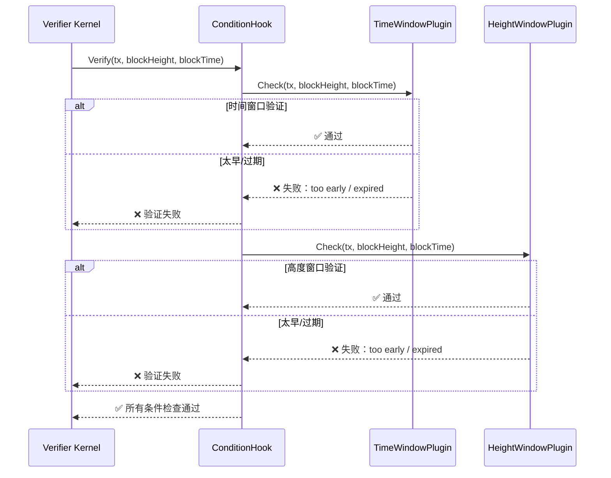

# Condition 条件检查验证插件（internal/core/tx/verifier/plugins/condition）

> **📌 模块类型**：`[x] 实现模块` `[ ] 接口定义` `[ ] 数据结构` `[ ] 工具/其他`

---

## 📍 **模块定位**

本模块是WES系统中**交易验证域**的**条件检查插件集**，负责验证交易的各种条件约束（时间窗口、高度窗口、nonce等）。

**解决什么问题**：

- **交易级有效期**：验证交易的 validity_window（时间窗口/高度窗口）
- **防重放**：验证 nonce 是否连续且未被使用
- **防跨链**：验证 chain_id 是否匹配当前链
- **可扩展验证**：通过插件机制支持新的条件检查

**不解决什么问题**（边界）：

- ❌ 不负责输入级时间锁/高度锁验证（由 AuthZ Hook 的 TimeLock/HeightLock 插件负责，P6 实现）
- ❌ 不负责权限验证（由 AuthZ Hook 负责）
- ❌ 不负责价值守恒验证（由 Conservation Hook 负责）
- ✅ 只负责交易级条件检查（时间窗口、高度窗口、nonce、chain_id 等）

---

## 🎯 **设计原则与核心约束**

### **设计原则**

| 原则 | 说明 | 价值 |
|------|------|------|
| **插件化扩展** | 新的条件检查作为独立插件实现 | 内核稳定，条件可扩展 |
| **无状态设计** | 插件不存储验证结果 | 并发安全，可并行 |
| **只读验证** | 插件不修改交易 | 验证无副作用 |
| **可叠加验证** | 多个插件可同时注册，都要通过 | 灵活组合条件 |

### **核心约束** ⭐

**严格遵守**：

- ✅ **插件无状态**：不能存储验证结果
- ✅ **插件只读**：不能修改交易
- ✅ **所有插件必须通过**：任何一个插件失败，整个验证失败
- ✅ **按注册顺序执行**：插件按注册顺序依次执行

**严格禁止**：

- ❌ **跳过插件**：所有已注册的插件都必须执行
- ❌ **修改交易**：插件不能修改交易内容
- ❌ **存储状态**：插件不能存储验证中间结果

---

## 🏗️ **架构设计**

### **整体架构**

```mermaid
graph TB
    subgraph "Condition Hook"
        HOOK[ConditionHook]
    end
    
    subgraph "Condition Plugins (P1+P4)"
        P1[PassthroughPlugin<br/>占位]
        P2[TimeWindowPlugin<br/>时间窗口]
        P3[HeightWindowPlugin<br/>高度窗口]
        P4[NoncePlugin<br/>防重放 (P5+)]
        P5[ChainIDPlugin<br/>防跨链 (P5+)]
    end
    
    HOOK --> P1
    HOOK --> P2
    HOOK --> P3
    HOOK --> P4
    HOOK --> P5
    
    style P2 fill:#FFD700
    style P3 fill:#FFD700
    style P4 fill:#90EE90
    style P5 fill:#90EE90
```

### **插件验证流程**



---

## 📊 **核心插件**

### **1. PassthroughPlugin（P1 占位插件）**

**核心职责**：P1 阶段的占位插件，直接通过所有交易

**实现逻辑**：
- 直接返回 `nil`，不做任何检查
- 确保 P1 阶段交易流程可以正常运行

**使用场景**：
- P1 MVP 阶段暂不实现复杂的条件检查
- 后续阶段将逐步替换为真正的条件验证插件

---

### **2. TimeWindowPlugin（P4 时间窗口验证）**

**核心职责**：验证交易的 `validity_window.time_window` 条件

**验证规则**：
1. 如果 `not_before_timestamp` 设置：`blockTime >= not_before_timestamp`
2. 如果 `not_after_timestamp` 设置：`blockTime <= not_after_timestamp`
3. 如果两者都设置：`not_before <= blockTime <= not_after`
4. 如果都不设置：直接通过（无时间限制）

**使用场景**：

**场景 1：定期存款（30 天后才能解锁）**
```protobuf
time_window {
    not_before_timestamp: now + 30*24*3600  // 30 天后
}
```

**场景 2：限时交易（24 小时内执行）**
```protobuf
time_window {
    not_after_timestamp: now + 24*3600  // 24 小时内
}
```

**场景 3：指定时间段内执行**
```protobuf
time_window {
    not_before_timestamp: 2025-11-01 00:00:00
    not_after_timestamp: 2025-12-31 23:59:59
}
```

---

### **3. HeightWindowPlugin（P4 高度窗口验证）**

**核心职责**：验证交易的 `validity_window.height_window` 条件

**验证规则**：
1. 如果 `not_before_height` 设置：`blockHeight >= not_before_height`
2. 如果 `not_after_height` 设置：`blockHeight <= not_after_height`
3. 如果两者都设置：`not_before <= blockHeight <= not_after`
4. 如果都不设置：直接通过（无高度限制）

**使用场景**：

**场景 1：锁仓释放（1000 个区块后才能解锁）**
```protobuf
height_window {
    not_before_height: current_height + 1000
}
```

**场景 2：限时交易（100 个区块内执行）**
```protobuf
height_window {
    not_after_height: current_height + 100
}
```

**场景 3：指定高度段内执行**
```protobuf
height_window {
    not_before_height: 1000000
    not_after_height: 2000000
}
```

---

## 🔗 **依赖与协作**

### **依赖关系**

| 依赖模块 | 依赖接口 | 用途 | 约束条件 |
|---------|---------|------|---------|
| **无** | `tx.ConditionPlugin` | 实现条件验证插件接口 | 插件必须无状态、只读 |

### **被依赖关系**

| 使用方 | 用途 | 使用接口 |
|-------|------|---------|
| **ConditionHook** | 调用插件验证交易条件 | `plugin.Check(ctx, tx, blockHeight, blockTime)` |
| **Verifier Kernel** | 通过 ConditionHook 间接调用 | Hook.Verify() |

---

## 📁 **目录结构**

```text
internal/core/tx/verifier/plugins/condition/
├── passthrough.go      # P1: 占位插件
├── time_window.go      # P4: 时间窗口验证插件
├── height_window.go    # P4: 高度窗口验证插件
└── README.md           # 本文档
```

### **组织原则**

| 文件 | 职责 | 为什么这样组织 |
|------|------|---------------|
| **passthrough.go** | P1 占位插件 | 确保 P1 阶段流程可用，后续逐步替换 |
| **time_window.go** | 时间窗口验证 | 交易级时间窗口条件检查 |
| **height_window.go** | 高度窗口验证 | 交易级高度窗口条件检查 |

---

## 🎓 **使用指南**

### **典型场景：定期存款（30 天后解锁）**

**步骤 1：构建交易时设置时间窗口**

```go
// 计算 30 天后的时间戳
notBefore := uint64(time.Now().Unix() + 30*24*3600)

// 构建交易
tx := &transaction.Transaction{
    // ... 其他字段 ...
    ValidityWindow: &transaction.Transaction_TimeWindow{
        TimeWindow: &transaction.TimeBasedWindow{
            NotBeforeTimestamp: &notBefore,
        },
    },
}
```

**步骤 2：验证时自动检查时间窗口**

```go
// Verifier 自动调用 TimeWindowPlugin 验证
err := verifier.Verify(ctx, tx, blockHeight, blockTime)
if err != nil {
    // 如果当前时间 < notBefore，验证失败
    // 错误信息：transaction too early: current_time=..., not_before=..., diff=... seconds
}
```

### **典型场景：锁仓释放（1000 个区块后解锁）**

**步骤 1：构建交易时设置高度窗口**

```go
// 计算 1000 个区块后的高度
notBefore := currentHeight + 1000

// 构建交易
tx := &transaction.Transaction{
    // ... 其他字段 ...
    ValidityWindow: &transaction.Transaction_HeightWindow{
        HeightWindow: &transaction.HeightBasedWindow{
            NotBeforeHeight: &notBefore,
        },
    },
}
```

**步骤 2：验证时自动检查高度窗口**

```go
// Verifier 自动调用 HeightWindowPlugin 验证
err := verifier.Verify(ctx, tx, blockHeight, blockTime)
if err != nil {
    // 如果当前高度 < notBefore，验证失败
    // 错误信息：transaction too early: current_height=..., not_before=..., diff=... blocks
}
```

### **常见误用**

| 误用方式 | 为什么错误 | 正确做法 |
|---------|-----------|---------|
| 同时设置 time_window 和 height_window | validity_window 是 oneof，只能设置一个 | 选择时间窗口或高度窗口之一 |
| 设置 not_before > not_after | 窗口无效，验证失败 | 确保 not_before <= not_after |
| 在插件中修改交易 | 验证不能有副作用 | 插件只读，不修改交易 |

---

## ⚠️ **已知限制**

| 限制 | 影响 | 规避方法 | 未来计划 |
|------|------|---------|---------|
| **P4 只支持交易级窗口** | 输入级锁定条件由 P6 实现 | 使用交易级窗口或等待 P6 | P6 实现输入级锁定 |
| **插件按顺序执行** | 无法并行验证多个条件 | 保持插件逻辑简单 | 考虑并行执行优化 |
| **PassthroughPlugin 共存** | P1 占位插件仍在注册列表 | 不影响功能，可忽略 | 考虑移除 Passthrough |

---

## 🔍 **设计权衡记录**

### **权衡 1：交易级窗口 vs 输入级锁定**

**背景**：时间/高度限制可以在交易级或输入级实现

**备选方案**：

1. **交易级窗口（P4）** - 优势：简单，风险小 - 劣势：灵活性较低
2. **输入级锁定（P6）** - 优势：灵活，支持递归 - 劣势：复杂度高

**选择**：P4 先实现交易级窗口，P6 再实现输入级锁定

**理由**：

- 分阶段实现，降低一次性复杂度
- 交易级窗口易于理解和测试
- 输入级锁定需要递归验证链路，P6 实现更合适

**代价**：P4 阶段灵活性较低，部分场景需要等待 P6

---

### **权衡 2：PassthroughPlugin 是否保留**

**背景**：P4 实现了真正的条件验证插件，是否还需要 PassthroughPlugin？

**备选方案**：

1. **保留 Passthrough** - 优势：向后兼容 - 劣势：冗余
2. **移除 Passthrough** - 优势：简洁 - 劣势：破坏 P1 兼容性

**选择**：暂时保留 Passthrough

**理由**：

- P1 代码可能依赖 Passthrough
- 不影响功能，冗余成本低
- 后续可以逐步移除

**代价**：插件列表中存在冗余插件

---

## 📚 **相关文档**

- **架构设计**：[TX_STATE_MACHINE_ARCHITECTURE.md](../../../../_docs/architecture/TX_STATE_MACHINE_ARCHITECTURE.md) - TX 模块整体架构
- **ConditionHook**：`internal/core/tx/verifier/condition_hook.go` - 条件钩子实现
- **ConditionPlugin 接口**：`pkg/interfaces/tx/plugins.go` - 插件接口定义
- **transaction.proto**：`pb/blockchain/block/transaction/transaction.proto` - validity_window 定义

---

## 📋 **文档变更记录**

| 日期 | 变更内容 | 原因 |
|------|---------|------|
| 2025-10-23 | 初始版本 | P4 阶段实现完成 |

---

> 📝 **文档说明**
>
> 本文档聚焦于条件验证插件的**职责**、**使用场景**、**设计权衡**和**已知限制**，
> 而非实现细节（详见各插件文件的代码注释）。
