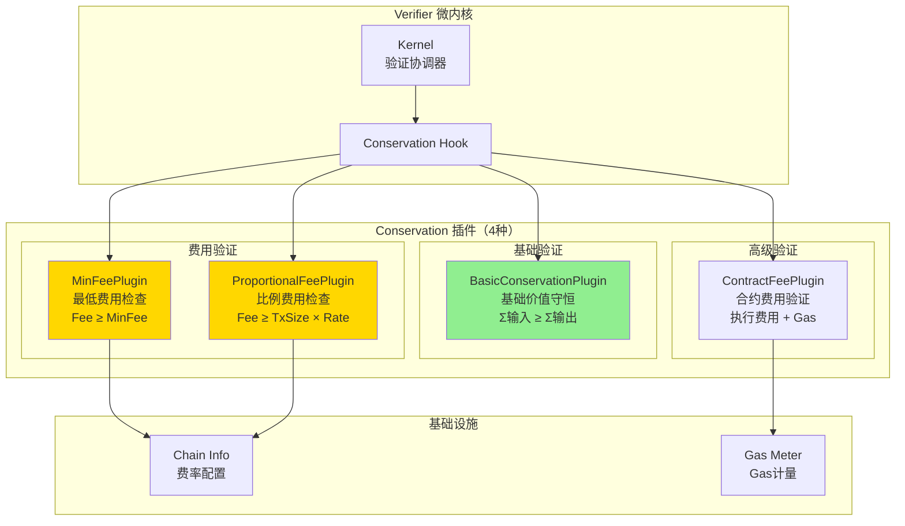
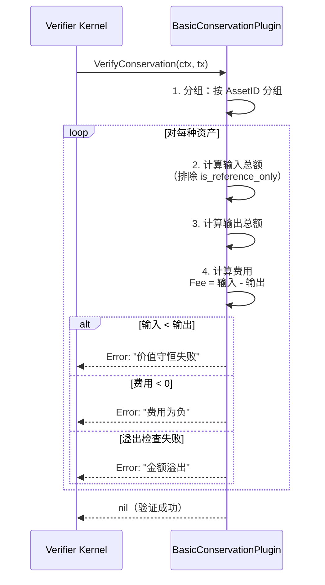
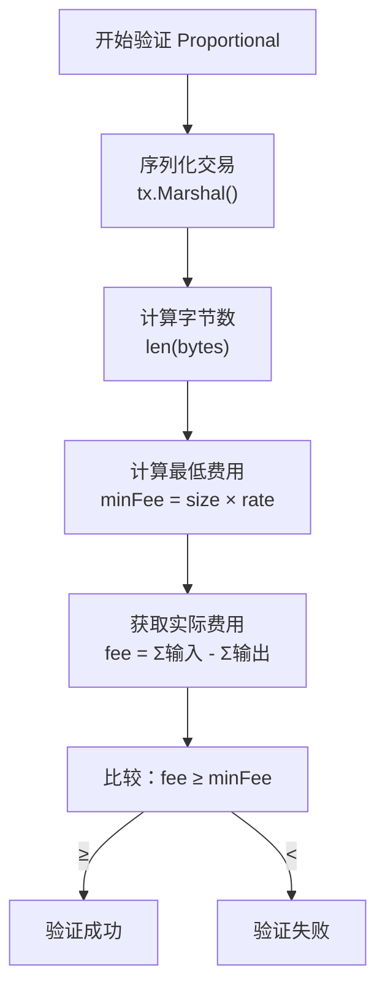
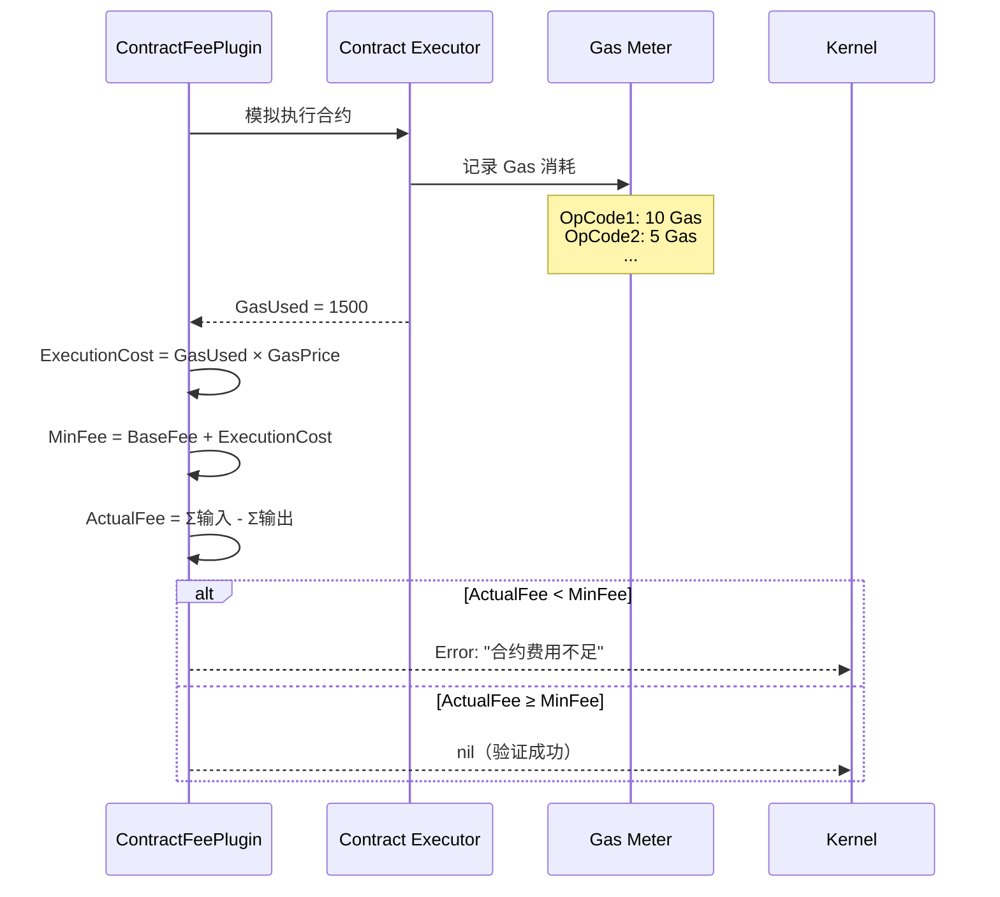
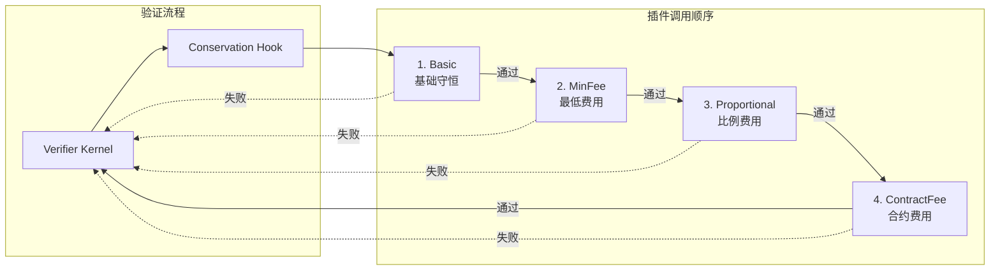

# Conservation Plugins（internal/core/tx/verifier/plugins/conservation）

> **📌 模块类型**：`[x] 实现模块` `[ ] 接口定义` `[ ] 数据结构` `[ ] 工具/其他`
> 
> ⚠️ **实现状态**：设计文档（代码待实现）

---

## 📍 **模块定位**

本模块是WES系统中**交易验证微内核**的**价值守恒插件层**，提供4种Conservation插件实现，确保交易的价值守恒和费用合规。

**解决什么问题**：
- 基础守恒验证（Basic）：Σ输入 ≥ Σ输出 + Fee
- 最低费用验证（MinFee）：费用 ≥ 最低要求
- 比例费用验证（Proportional）：费用 ≥ 交易大小 × 费率
- 合约费用验证（ContractFee）：合约执行费用验证

**不解决什么问题**（边界）：
- 不负责权限验证（由 AuthZ 插件负责）
- 不负责条件检查（由 Condition 插件负责）
- 不负责费用估算（由 FeeEstimator 端口负责）
- 不负责费用收取（由区块确认后处理）

---

## 🎯 **设计原则与核心约束**

### **设计原则**

| 原则 | 说明 | 价值 | 实现策略 |
|------|------|------|---------|
| **守恒优先** | 价值守恒是核心约束 | 安全性 | Σ输入 ≥ Σ输出 必须成立 |
| **费用灵活** | 支持多种费用模式 | 可扩展性 | 插件化费用验证 |
| **精度安全** | 金额计算避免溢出 | 正确性 | 使用 uint64，检查溢出 |
| **引用输入排除** | is_reference_only 不计入价值 | 正确性 | 过滤引用输入 |
| **快速失败** | 守恒失败立即返回 | 性能优化 | 第一个错误立即 return |

### **核心约束** ⭐

**严格遵守**：
- ✅ Σ输入 ≥ Σ输出 + Fee（价值守恒）
- ✅ 引用输入（is_reference_only=true）不计入价值
- ✅ 金额计算必须检查溢出
- ✅ 费用必须 > 0（除非特殊场景如 Coinbase）
- ✅ 不同资产分别验证守恒

**严格禁止**：
- ❌ 输出总额 > 输入总额（凭空创造资产）
- ❌ 费用为负数
- ❌ 忽略金额溢出（安全风险）
- ❌ 混合不同资产验证
- ❌ 引用输入参与价值计算

---

## 🏗️ **架构设计**

### **整体架构**



### **4种插件对照表**

| 插件 | 验证公式 | 复杂度 | 典型场景 | 优先级 |
|------|---------|--------|---------|--------|
| **Basic** | Σ输入 ≥ Σ输出 | 低 | 所有交易 | 必须 |
| **MinFee** | Fee ≥ MinFee | 低 | 防止垃圾交易 | 推荐 |
| **Proportional** | Fee ≥ TxSize × Rate | 中 | 公平收费 | 推荐 |
| **ContractFee** | Fee ≥ ExecutionCost + Gas | 高 | 合约调用 | 可选 |

---

## 📊 **核心机制**

### **机制1：BasicConservationPlugin - 基础价值守恒**

**为什么需要**：最核心的验证，防止凭空创造资产

**验证公式**：

```
对于每种资产 AssetID：
    Σ(输入金额) ≥ Σ(输出金额) + Fee
    
其中：
    输入金额 = input.amount (排除 is_reference_only 的 input)
    输出金额 = output.amount
    Fee = 输入总额 - 输出总额（UTXO 差额）
```

**验证流程**：



**实现示例**：

```go
package conservation

import (
    "context"
    "fmt"
    "math"
    
    transaction "github.com/weisyn/v1/pb/blockchain/block/transaction"
    "github.com/weisyn/v1/pkg/types"
)

type BasicConservationPlugin struct{}

func NewBasicConservationPlugin() *BasicConservationPlugin {
    return &BasicConservationPlugin{}
}

func (p *BasicConservationPlugin) VerifyConservation(ctx context.Context, tx *transaction.Transaction) error {
    // 1. 按资产分组
    assetMap := make(map[string]*AssetBalance)
    
    // 2. 计算输入总额（排除引用输入）
    for _, input := range tx.Inputs {
        if input.IsReferenceOnly {
            continue  // 引用输入不参与价值计算
        }
        
        assetID := input.AssetId
        if assetMap[assetID] == nil {
            assetMap[assetID] = &AssetBalance{}
        }
        
        // 检查溢出
        if assetMap[assetID].InputSum > math.MaxUint64-input.Amount {
            return fmt.Errorf("输入金额溢出: AssetID=%s", assetID)
        }
        
        assetMap[assetID].InputSum += input.Amount
    }
    
    // 3. 计算输出总额
    for _, output := range tx.Outputs {
        assetID := output.AssetId
        if assetMap[assetID] == nil {
            assetMap[assetID] = &AssetBalance{}
        }
        
        // 检查溢出
        if assetMap[assetID].OutputSum > math.MaxUint64-output.Amount {
            return fmt.Errorf("输出金额溢出: AssetID=%s", assetID)
        }
        
        assetMap[assetID].OutputSum += output.Amount
    }
    
    // 4. 验证每种资产的守恒
    for assetID, balance := range assetMap {
        if balance.InputSum < balance.OutputSum {
            return fmt.Errorf(
                "价值守恒失败: AssetID=%s, 输入=%d < 输出=%d",
                assetID, balance.InputSum, balance.OutputSum,
            )
        }
        
        // 计算费用
        fee := balance.InputSum - balance.OutputSum
        if fee < 0 {
            return fmt.Errorf("费用为负: AssetID=%s, Fee=%d", assetID, fee)
        }
    }
    
    return nil
}

type AssetBalance struct {
    InputSum  uint64
    OutputSum uint64
}
```

### **机制2：MinFeePlugin - 最低费用验证**

**为什么需要**：防止垃圾交易（spam），确保网络费用覆盖

**验证公式**：

```
Fee ≥ MinFee

其中：
    Fee = Σ输入 - Σ输出（基础插件已计算）
    MinFee = 系统配置的最低费用（如 1000 单位）
```

**实现示例**：

```go
type MinFeePlugin struct {
    minFee uint64  // 系统配置的最低费用
}

func NewMinFeePlugin(config *types.ChainConfig) *MinFeePlugin {
    return &MinFeePlugin{
        minFee: config.MinTransactionFee,
    }
}

func (p *MinFeePlugin) VerifyConservation(ctx context.Context, tx *transaction.Transaction) error {
    // 1. 计算实际费用
    fee := calculateFee(tx)
    
    // 2. 验证最低费用
    if fee < p.minFee {
        return fmt.Errorf(
            "费用不足: 最低要求=%d, 实际=%d",
            p.minFee, fee,
        )
    }
    
    return nil
}

func calculateFee(tx *transaction.Transaction) uint64 {
    inputSum := uint64(0)
    outputSum := uint64(0)
    
    for _, input := range tx.Inputs {
        if !input.IsReferenceOnly {
            inputSum += input.Amount
        }
    }
    
    for _, output := range tx.Outputs {
        outputSum += output.Amount
    }
    
    return inputSum - outputSum
}
```

### **机制3：ProportionalFeePlugin - 比例费用验证**

**为什么需要**：基于交易大小公平收费，防止大交易支付低费用

**验证公式**：

```
Fee ≥ TxSize × FeeRate

其中：
    TxSize = Proto 序列化后的字节数
    FeeRate = 每字节费率（如 10 单位/字节）
```

**费用计算流程**：



**实现示例**：

```go
type ProportionalFeePlugin struct {
    feeRate uint64  // 每字节费率（单位/字节）
}

func NewProportionalFeePlugin(config *types.ChainConfig) *ProportionalFeePlugin {
    return &ProportionalFeePlugin{
        feeRate: config.FeeRatePerByte,
    }
}

func (p *ProportionalFeePlugin) VerifyConservation(ctx context.Context, tx *transaction.Transaction) error {
    // 1. 计算交易大小
    txBytes, err := proto.Marshal(tx)
    if err != nil {
        return fmt.Errorf("序列化交易失败: %w", err)
    }
    txSize := uint64(len(txBytes))
    
    // 2. 计算最低费用
    minFee := txSize * p.feeRate
    
    // 3. 计算实际费用
    actualFee := calculateFee(tx)
    
    // 4. 验证
    if actualFee < minFee {
        return fmt.Errorf(
            "比例费用不足: 交易大小=%d字节, 费率=%d单位/字节, 最低要求=%d, 实际=%d",
            txSize, p.feeRate, minFee, actualFee,
        )
    }
    
    return nil
}
```

### **机制4：ContractFeePlugin - 合约费用验证**

**为什么需要**：合约执行消耗计算资源，需要额外的 Gas 费用

**验证公式**：

```
Fee ≥ BaseFee + ExecutionCost

其中：
    BaseFee = 基础交易费用
    ExecutionCost = GasUsed × GasPrice
```

**Gas 计量流程**：



**实现示例**：

```go
type ContractFeePlugin struct {
    contractExecutor contract.Executor
    gasPrice         uint64
    baseFee          uint64
}

func (p *ContractFeePlugin) VerifyConservation(ctx context.Context, tx *transaction.Transaction) error {
    // 1. 检查是否包含合约调用
    if !hasContractCall(tx) {
        return nil  // 非合约交易，跳过
    }
    
    // 2. 模拟执行合约，计量 Gas
    gasMeter := gas.NewMeter()
    _, err := p.contractExecutor.SimulateExecution(ctx, tx, gasMeter)
    if err != nil {
        return fmt.Errorf("合约模拟执行失败: %w", err)
    }
    
    gasUsed := gasMeter.GasConsumed()
    
    // 3. 计算执行费用
    executionCost := gasUsed * p.gasPrice
    
    // 4. 计算最低费用
    minFee := p.baseFee + executionCost
    
    // 5. 计算实际费用
    actualFee := calculateFee(tx)
    
    // 6. 验证
    if actualFee < minFee {
        return fmt.Errorf(
            "合约费用不足: Gas消耗=%d, Gas价格=%d, 执行费用=%d, 基础费用=%d, 最低要求=%d, 实际=%d",
            gasUsed, p.gasPrice, executionCost, p.baseFee, minFee, actualFee,
        )
    }
    
    return nil
}
```

---

## 📁 **目录结构**

```
internal/core/tx/verifier/plugins/conservation/
├── README.md                        # 本文档
├── basic.go                         # BasicConservationPlugin 实现
├── min_fee.go                       # MinFeePlugin 实现
├── proportional_fee.go              # ProportionalFeePlugin 实现
└── contract_fee.go                  # ContractFeePlugin 实现
```

---

## 🔗 **依赖与协作**

### **依赖关系**

| 插件 | 依赖接口 | 用途 |
|------|---------|------|
| **Basic** | 无 | 纯算术计算 |
| **MinFee** | config.ChainConfig | 获取最低费用配置 |
| **Proportional** | config.ChainConfig | 获取费率配置 |
| **ContractFee** | contract.Executor, gas.Meter | 合约模拟执行 + Gas 计量 |

### **插件协作流程**



---

## 🎓 **使用指南**

### **场景1：注册所有 Conservation 插件**

```go
// module.go
fx.Provide(
    // Basic 插件（必须）
    fx.Annotate(
        conservation.NewBasicConservationPlugin,
        fx.As(new(tx.ConservationPlugin)),
        fx.ResultTags(`group:"conservation_plugins"`),
    ),
    
    // MinFee 插件（推荐）
    fx.Annotate(
        conservation.NewMinFeePlugin,
        fx.As(new(tx.ConservationPlugin)),
        fx.ResultTags(`group:"conservation_plugins"`),
    ),
    
    // Proportional 插件（推荐）
    fx.Annotate(
        conservation.NewProportionalFeePlugin,
        fx.As(new(tx.ConservationPlugin)),
        fx.ResultTags(`group:"conservation_plugins"`),
    ),
    
    // ContractFee 插件（可选，仅合约场景）
    fx.Annotate(
        conservation.NewContractFeePlugin,
        fx.As(new(tx.ConservationPlugin)),
        fx.ResultTags(`group:"conservation_plugins"`),
    ),
),
```

### **场景2：配置费用参数**

```json
// config/production/chain.json
{
  "chain": {
    "minTransactionFee": 1000,
    "feeRatePerByte": 10,
    "contractGasPrice": 1,
    "contractBaseFee": 5000
  }
}
```

### **场景3：验证多资产交易**

```go
// 用户构建多资产交易
tx := &transaction.Transaction{
    Inputs: []*transaction.Input{
        {AssetId: "BTC", Amount: 100000},  // 0.001 BTC
        {AssetId: "ETH", Amount: 500000},  // 0.5 ETH
    },
    Outputs: []*transaction.Output{
        {AssetId: "BTC", Amount: 90000},   // 0.0009 BTC (Fee: 10000)
        {AssetId: "ETH", Amount: 490000},  // 0.49 ETH (Fee: 10000)
    },
}

// BasicConservationPlugin 会分别验证：
// BTC: 100000 ≥ 90000 + 10000 ✅
// ETH: 500000 ≥ 490000 + 10000 ✅
```

---

## ⚠️ **已知限制**

| 限制 | 影响 | 规避方法 | 未来计划 |
|------|------|---------|---------|
| 不支持动态费率 | 网络拥堵时费率固定 | 管理员手动调整配置 | v2.0 支持动态费率 |
| Gas 计量不精确 | 合约费用可能偏差 | 保守估算（略高） | 改进 Gas 计量 |
| 多资产交易费用复杂 | 不同资产费用如何支付 | 当前强制用主链币 | 支持任意资产支付 |
| 溢出检查有性能开销 | 每次加法都检查 | 必要的安全开销 | 使用安全数学库 |

---

## 🔍 **设计权衡记录**

### **权衡1：固定费率 vs 动态费率**

**背景**：费率是否应该根据网络拥堵调整

**备选方案**：
1. **固定费率**：配置文件指定 - 优势：简单、可预测 - 劣势：不灵活
2. **动态费率**：根据网络拥堵调整 - 优势：公平、高效 - 劣势：复杂、不可预测

**选择**：固定费率（v1.0）

**理由**：
- 实现简单，便于理解
- 企业级私链不需要动态费率
- 管理员可手动调整配置

**代价**：网络拥堵时无法自动调整费率

### **权衡2：模拟执行 vs 事后计费**

**背景**：合约费用如何计算

**备选方案**：
1. **模拟执行**：验证时模拟执行，预估 Gas - 优势：事前验证 - 劣势：性能开销
2. **事后计费**：执行后计算实际 Gas，扣费 - 优势：精确 - 劣势：可能余额不足

**选择**：模拟执行

**理由**：
- 防止余额不足（验证时确保费用充足）
- 符合 EUTXO 模型（事前确定所有费用）
- 用户体验好（事前知道费用）

**代价**：验证时需模拟执行，有性能开销

### **权衡3：溢出检查 vs 性能**

**背景**：金额加法是否检查溢出

**备选方案**：
1. **检查溢出**：每次加法都检查 - 优势：安全 - 劣势：性能开销
2. **不检查**：直接加法 - 优势：性能好 - 劣势：溢出风险

**选择**：检查溢出

**理由**：
- 安全优先（金额溢出会导致严重问题）
- 性能开销可接受（交易数量有限）
- Go 语言溢出不会 panic，需手动检查

**代价**：每次加法都有性能开销

---

## 📚 **相关文档**

- **插件总览**：[../README.md](../README.md) - 插件架构总览
- **Verifier 微内核**：[../../README.md](../../README.md) - 验证微内核架构
- **ChainConfig**：[pkg/types/config.go](../../../../../pkg/types/config.go) - 费用配置

---

## 📋 **文档变更记录**

| 日期 | 变更内容 | 原因 |
|------|---------|------|
| 2025-10-23 | 创建完整 Conservation 插件设计文档 | 提供4种插件详细设计 |
| 2025-10-23 | 补齐验证流程图、费用计算公式、代码示例 | 完善设计细节 |

---

> 📝 **实现指导**
>
> 本文档定义了 4 种 Conservation 插件的完整设计，包括：
> 1. **基础守恒**：BasicConservationPlugin（必须）
> 2. **费用验证**：MinFeePlugin、ProportionalFeePlugin（推荐）
> 3. **合约费用**：ContractFeePlugin（可选）
> 4. **完整验证流程**：金额计算、溢出检查、费用验证
> 5. **费用计算公式**：固定费用、比例费用、Gas 费用
>
> 实现时必须严格验证价值守恒，确保金额计算的正确性和安全性。
