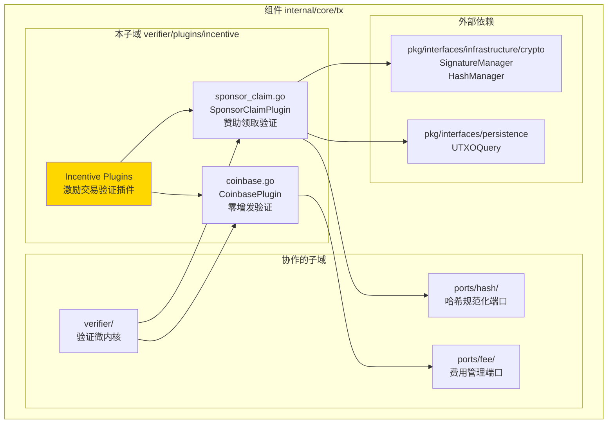
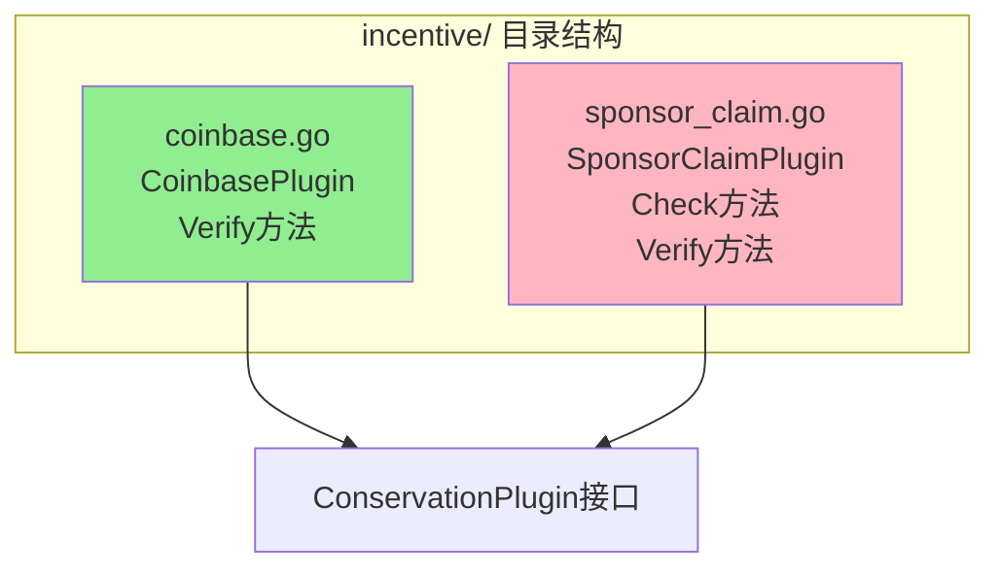
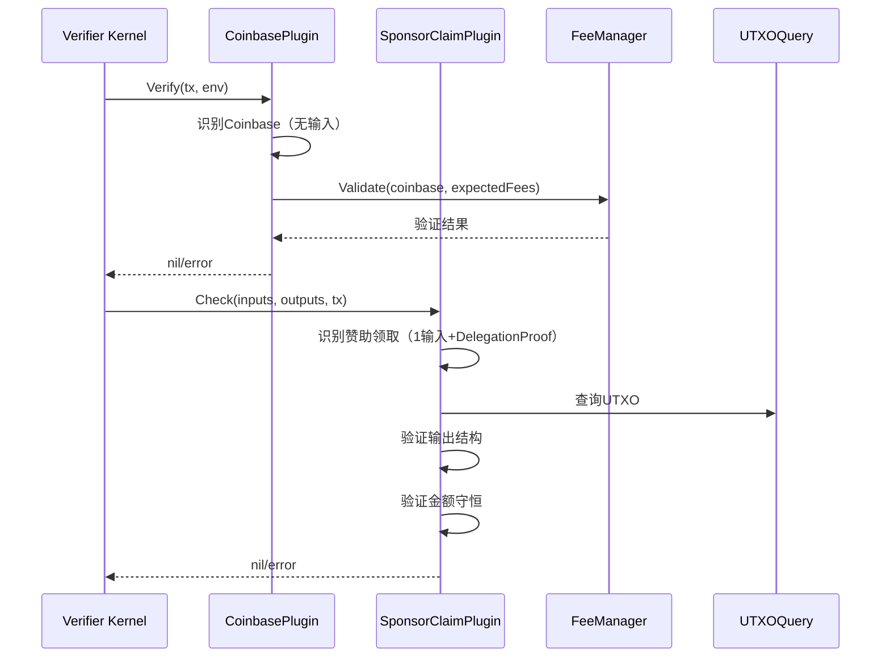

# Incentive Verification Plugins（internal/core/tx/verifier/plugins/incentive）

---

## 📌 版本信息

- **版本**：1.0
- **状态**：stable
- **最后更新**：2025-11-30
- **最后审核**：2025-11-30
- **所有者**：TX模块团队
- **适用范围**：internal/core/tx/verifier/plugins/incentive 模块

---

## 🎯 **子域定位**

**路径**：`internal/core/tx/verifier/plugins/incentive/`

**所属组件**：`tx`

**核心职责**：提供激励交易验证插件，包括 Coinbase 和赞助领取交易的验证逻辑，集成到 TX State Machine 的验证流程中。

**在组件中的角色**：
- Coinbase 交易验证（零增发验证）
- 赞助领取交易验证（DelegationProof 验证）
- 集成到验证微内核的插件系统
- 确保激励机制的合规性

---

## 🏗️ **架构设计**

### **在组件中的位置**

> **说明**：展示此子域在组件内部的位置和协作关系



**位置说明**：

| 关系类型 | 目标 | 关系说明 |
|---------|------|---------|
| **协作** | verifier/ | 作为验证插件注册到验证微内核 |
| **协作** | ports/fee/ | CoinbasePlugin 使用费用管理器验证费用守恒 |
| **协作** | ports/hash/ | SponsorClaimPlugin 使用哈希规范化器计算签名哈希 |
| **依赖** | pkg/interfaces/persistence | SponsorClaimPlugin 查询 UTXO |
| **依赖** | pkg/interfaces/infrastructure/crypto | SponsorClaimPlugin 验证签名 |

### **内部组织**

> **说明**：展示此子域内部的文件组织和类型关系



---

## 📁 **目录结构**

```
internal/core/tx/verifier/plugins/incentive/
├── README.md                    # 本文档
├── coinbase.go                  # Coinbase 验证插件
└── sponsor_claim.go             # 赞助领取验证插件
```

### **文件职责**

| 文件 | 核心职责 | 关键类型/函数 |
|------|---------|-------------|
| **coinbase.go** | Coinbase 交易验证 | `CoinbasePlugin`, `Verify` |
| **sponsor_claim.go** | 赞助领取交易验证 | `SponsorClaimPlugin`, `Check`, `Verify` |

---

## 🔗 **依赖与协作**

### **依赖关系**

| 依赖模块 | 依赖接口/类型 | 用途 | 约束条件 |
|---------|--------------|------|---------|
| `internal/core/tx/ports/fee` | `fee.CoinbaseValidator` | Coinbase 费用验证 | CoinbasePlugin 需要 |
| `internal/core/tx/ports/hash` | `hash.Canonicalizer` | 签名哈希计算 | SponsorClaimPlugin 需要 |
| `pkg/interfaces/persistence` | `persistence.UTXOQuery` | UTXO 查询 | SponsorClaimPlugin 需要 |
| `pkg/interfaces/infrastructure/crypto` | `crypto.SignatureManager`, `crypto.HashManager` | 签名和哈希管理 | SponsorClaimPlugin 需要 |
| `pkg/interfaces/tx` | `tx.FeeManager`, `tx.VerifierEnvironment` | 费用管理和验证环境 | 必须提供 |

### **协作流程**



---

## 📊 **核心机制**

### **机制1：Coinbase 零增发验证**

**为什么需要**：确保 Coinbase 交易只包含手续费，不增发新币

**核心思路**：
1. 识别 Coinbase 交易（无输入）
2. 验证所有输出 Owner = minerAddr
3. 验证费用守恒（Coinbase输出 == 期望费用）
4. 验证无增发（无额外Token）

**实现策略**：

```go
// 1. 识别Coinbase（无输入）
if len(tx.Inputs) != 0 {
    return nil // 非Coinbase，跳过
}

// 2. 获取期望费用和矿工地址
expectedFees := verifierEnv.GetExpectedFees()
minerAddr := verifierEnv.GetMinerAddress()

// 3. 验证费用守恒
err := p.coinbaseValidator.Validate(ctx, tx, expectedFees, minerAddr)
```

### **机制2：赞助领取交易验证**

**为什么需要**：确保赞助领取交易符合业务规则和安全约束

**核心思路**：
1. 识别赞助领取交易（1输入+DelegationProof）
2. 验证 Input 引用的 UTXO Owner = SponsorPoolOwner
3. 验证 DelegationProof 有效性
4. 验证输出结构（矿工领取+找零回池）
5. 验证金额守恒

**实现策略**：

```go
// 1. 识别赞助领取交易特征
if len(tx.Inputs) != 1 {
    return nil // 不是赞助领取交易，跳过
}

delegationProof := tx.Inputs[0].GetDelegationProof()
if delegationProof == nil {
    return nil // 不是赞助领取交易，跳过
}

// 2. 验证UTXO Owner = SponsorPoolOwner
if !bytes.Equal(sponsorUTXO.GetCachedOutput().Owner, constants.SponsorPoolOwner[:]) {
    return nil // 不是赞助池UTXO，跳过
}

// 3. 验证输出结构
p.validateOutputs(tx, sponsorUTXO, minerAddr)

// 4. 验证金额守恒
p.validateConservation(tx, sponsorUTXO, delegationProof)
```

### **机制3：可选签名验证**

**为什么需要**：保持"任意矿工可领取"的灵活性，同时支持审计追踪

**核心思路**：
- 如果提供了 DelegateSignature，则进行验证（可选功能）
- 如果未提供，不影响交易验证（保持灵活性）
- 签名主要用于审计追踪，不是必须的验证项

**实现策略**：

```go
if proof.DelegateSignature != nil && len(proof.DelegateSignature.Value) > 0 {
    // 计算签名哈希
    txHash, err := p.hashCanonicalizer.ComputeSignatureHashForVerification(...)
    
    // 获取矿工公钥
    minerPubKey, err := env.GetPublicKey(ctx, proof.DelegateAddress)
    
    // 验证签名
    valid := p.sigManager.VerifyTransactionSignature(...)
    if !valid {
        return fmt.Errorf("DelegateSignature 验证失败")
    }
}
// 如果未提供签名，跳过验证（允许任意矿工无签名领取）
```

---

## 🎓 **使用指南**

### **场景1：注册 Coinbase 插件**

```go
coinbasePlugin := incentive.NewCoinbasePlugin(feeManager)
verifier.RegisterConservationPlugin(coinbasePlugin)
```

### **场景2：注册赞助领取插件**

```go
sponsorPlugin := incentive.NewSponsorClaimPlugin(
    eutxoQuery,
    sigManager,
    hashManager,
    hashCanonicalizer,
)
verifier.RegisterConservationPlugin(sponsorPlugin)
```

### **场景3：验证流程**

```go
// 验证器会自动调用插件
result := verifier.Verify(ctx, tx, env)

// CoinbasePlugin 和 SponsorClaimPlugin 会自动识别并验证对应的交易
```

---

## ⚠️ **已知限制**

| 限制 | 影响 | 规避方法 | 未来计划 |
|------|------|---------|---------|
| DelegateSignature 验证可选 | 无法强制签名验证 | 通过配置控制 | 支持配置强制签名验证 |

---

## 🔍 **设计权衡记录**

### **权衡1：签名验证是否强制**

**背景**：赞助领取交易的 DelegateSignature 是否必须验证？

**备选方案**：
1. **强制验证**：优势：安全性高 - 劣势：限制灵活性
2. **可选验证**：优势：保持灵活性 - 劣势：安全性降低

**选择**：可选验证

**理由**：
- DelegationLock 已经授权任意矿工可以 consume
- DelegateAddress 已经指定了矿工地址
- DelegateSignature 主要用于审计追踪，不是必须的验证项
- 保持"任意矿工可领取"的灵活性

**代价**：无法强制签名验证

---

## 📚 **相关文档**

- **验证微内核**：[verifier/README.md](../../README.md) - 验证微内核实现
- **费用管理**：[ports/fee/README.md](../../../ports/fee/README.md) - 费用管理端口
- **哈希规范化**：[ports/hash/README.md](../../../ports/hash/README.md) - 哈希规范化端口

---

## 📋 **文档变更记录**

| 日期 | 变更内容 | 原因 |
|------|---------|------|
| 2025-11-30 | 创建文档 | 补充缺失的 README 文档 |

---

