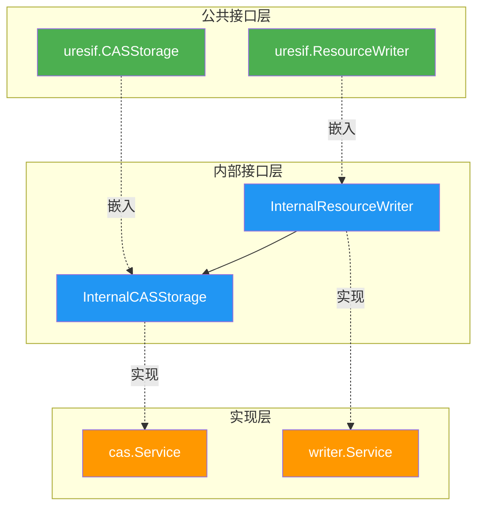

# URES 内部接口

---

## 📌 概述

本目录定义 URES 模块的内部接口，遵循三层架构设计：

```
公共接口层 (pkg/interfaces/ures)
    ↓ 嵌入继承
内部接口层 (internal/core/ures/interfaces) ← 本目录
    ↓ 实现
实现层 (internal/core/ures/{cas,writer})
```

---

## 🎯 设计原则

### 1. 接口继承

**所有内部接口都嵌入公共接口**：

```go
type InternalCASStorage interface {
    uresif.CASStorage // 嵌入公共接口
    
    // 扩展内部方法
    GetMetrics() *CASMetrics
}
```

**优势**：
- ✅ 实现内部接口自动实现公共接口
- ✅ 避免重复定义
- ✅ 保持接口一致性

---

### 2. 内部扩展

**内部接口扩展内部使用的方法**：

| 扩展类型 | 示例方法 | 用途 |
|---------|---------|------|
| 性能指标 | `GetMetrics()` | 监控和告警 |
| 内部验证 | `ValidateResource()` | 内部使用、测试 |
| 调试支持 | （未来扩展） | 调试和排查 |

---

### 3. 易于测试

**支持 Mock 和测试**：

```go
// Mock 内部接口
type MockCASStorage struct {
    mock.Mock
}

func (m *MockCASStorage) BuildFilePath(hash []byte) string {
    args := m.Called(hash)
    return args.String(0)
}

// ... 实现其他方法
```

---

## 📐 接口清单

### InternalCASStorage 接口

**文件**：`interfaces/cas.go`

**继承**：`uresif.CASStorage`

**公共方法**（继承自公共接口）：
- `BuildFilePath(contentHash []byte) string`
- `StoreFile(ctx, contentHash, data) error`
- `ReadFile(ctx, contentHash) ([]byte, error)`
- `FileExists(contentHash) bool`

**内部方法**（扩展）：
- `GetMetrics() *CASMetrics` - 获取性能指标

**性能指标**：
```go
type CASMetrics struct {
    StoreCount uint64 // 存储次数
    ReadCount  uint64 // 读取次数
    ErrorCount uint64 // 错误次数
    TotalBytes uint64 // 总字节数
}
```

---

### InternalResourceWriter 接口

**文件**：`interfaces/writer.go`

**继承**：`uresif.ResourceWriter`

**公共方法**（继承自公共接口）：
- `StoreResourceFile(ctx, sourceFilePath) ([]byte, error)`
- `LinkResourceToTransaction(ctx, contentHash, txHash, blockHash) error`

**内部方法**（扩展）：
- `GetMetrics() *WriterMetrics` - 获取性能指标
- `ValidateResource(ctx, contentHash) error` - 验证资源有效性

**性能指标**：
```go
type WriterMetrics struct {
    StoreCount uint64 // 存储次数
    LinkCount  uint64 // 关联次数
    ErrorCount uint64 // 错误次数
    TotalBytes uint64 // 总字节数
}
```

---

## 🔗 依赖关系



---

## 📚 使用示例

### 实现内部接口

```go
package cas

import (
    "github.com/weisyn/v1/internal/core/ures/interfaces"
)

// Service 实现 InternalCASStorage 接口
type Service struct {
    // ... 字段
    metrics *interfaces.CASMetrics
}

// 实现公共接口方法（继承自 uresif.CASStorage）
func (s *Service) BuildFilePath(contentHash []byte) string {
    // ... 实现
}

func (s *Service) StoreFile(ctx context.Context, contentHash []byte, data []byte) error {
    // ... 实现
}

// ... 其他公共接口方法

// 实现内部接口方法（扩展）
func (s *Service) GetMetrics() *interfaces.CASMetrics {
    return s.metrics
}

// 编译时检查接口实现
var _ interfaces.InternalCASStorage = (*Service)(nil)
```

---

### Mock 内部接口

```go
package writer_test

import (
    "testing"
    "github.com/stretchr/testify/mock"
    "github.com/weisyn/v1/internal/core/ures/interfaces"
)

// MockCASStorage Mock CASStorage 接口
type MockCASStorage struct {
    mock.Mock
}

func (m *MockCASStorage) BuildFilePath(hash []byte) string {
    args := m.Called(hash)
    return args.String(0)
}

func (m *MockCASStorage) StoreFile(ctx context.Context, hash []byte, data []byte) error {
    args := m.Called(ctx, hash, data)
    return args.Error(0)
}

// ... 其他方法

func (m *MockCASStorage) GetMetrics() *interfaces.CASMetrics {
    args := m.Called()
    return args.Get(0).(*interfaces.CASMetrics)
}

// 测试使用
func TestWriterWithMockCAS(t *testing.T) {
    mockCAS := new(MockCASStorage)
    mockCAS.On("StoreFile", mock.Anything, mock.Anything, mock.Anything).Return(nil)
    
    // ... 测试逻辑
}
```

---

## 🎯 设计优势

| 优势 | 说明 | 示例 |
|-----|------|------|
| **接口一致性** | 内部接口继承公共接口，保证一致性 | InternalCASStorage 嵌入 CASStorage |
| **易于实现** | 实现内部接口自动实现公共接口 | cas.Service 只需实现一次 |
| **易于测试** | 可以 Mock 内部接口进行测试 | MockCASStorage |
| **内部扩展** | 可以添加内部使用的方法 | GetMetrics、ValidateResource |
| **职责清晰** | 公共方法对外，内部方法对内 | 公共接口 vs 内部接口 |

---

## 📋 实现清单

- [x] **InternalCASStorage 接口** ✅
- [x] **InternalResourceWriter 接口** ✅
- [x] **CASMetrics 结构** ✅
- [x] **WriterMetrics 结构** ✅
- [ ] **cas.Service 实现** ⏳（阶段2）
- [ ] **writer.Service 实现** ⏳（阶段3）

---

## 📚 参考资料

- [公共接口设计规范](../../../../docs/system/designs/interfaces/public-interface-design.md)
- [URES 组件文档](../../../../docs/components/core/ures/README.md)
- [URES 模块评估](../MODULE_ASSESSMENT.md)
- [URES 实施计划](../IMPLEMENTATION_PLAN.md)
- [URES 技术设计](../TECHNICAL_DESIGN.md)

---

## 🎊 结论

**URES 内部接口设计完成！** ✅

- ✅ 遵循三层架构原则
- ✅ 嵌入公共接口
- ✅ 扩展内部方法
- ✅ 支持测试和 Mock
- ✅ 职责清晰，易于维护

**准备进入阶段2：实现 CASStorage 服务！** 🚀

