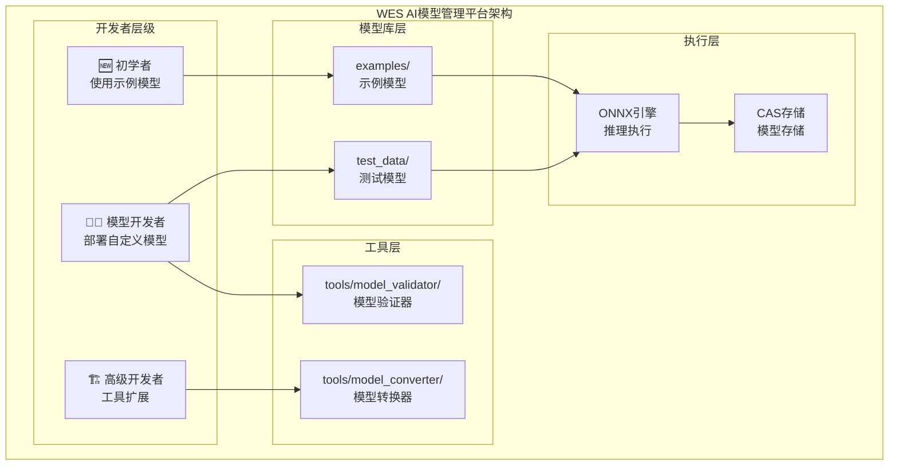

# WES AI模型管理平台（models）

---

## 📌 版本信息

- **版本**：1.0
- **状态**：stable
- **最后更新**：2025-11-12
- **最后审核**：2025-11-12
- **所有者**：AI模型管理组
- **适用范围**：WES 项目中 AI 模型管理相关功能

---

## 📍 组件定位

**AI模型管理平台** - 为AI模型开发者提供完整的模型管理基础设施。本目录专注于提供测试模型、示例模型、开发工具和文档，确保开发者能够高效、安全地使用ONNX模型进行推理。

---

## 🎯 设计原则
- 模型驱动：提供标准化的模型格式和测试用例
- 工具链完整：从验证、转换、测试到部署的完整工具支持
- 兼容性优先：确保与ONNX Runtime和公开模型库兼容
- 高性能：基于onnxruntime_go的高效推理执行
- 易用性：简化模型使用流程，降低AI模型使用门槛

## 📋 核心职责

1. **📋 测试模型库** (`test_data/`) - 提供用于测试和验证的模型
2. **🧰 资源级模型示例库** (`examples/`) - 提供固定行为的 ONNX 模型可执行资源（结构与 `contracts/examples/` 对齐）
3. **🔧 开发工具** (`tools/`) - 提供模型验证、转换等开发工具
4. **📚 文档库** (`docs/`) - 提供模型格式规范、测试指南、部署指南

---

## 🧱 资源级 vs 场景级（与 contracts/examples 的关系）

- **资源级模型示例**（本目录 `models/examples/`）：
  - 每个子目录对应一个 ONNX 模型作为「可执行资源」，包含：
    - 模型文件（`.onnx`）
    - `README.md`（行为说明）
    - `testcases/default.json`（标准测试用例）
  - 用于单个模型的功能验证与回归测试。

- **资源级合约示例**（`contracts/examples/`）：
  - 结构与 `models/examples/` 对齐，但对象是 WASM 合约：
    - 合约源码（`src/`）
    - `README.md`（导出函数、参数、状态/事件）
    - `testcases/default.json`（合约调用与预期结果）

- **场景级应用示例**（仓库根 `examples/`）：
  - 组合使用模型和合约这两类可执行资源（以及客户端等），展示完整业务场景。
  - 例如：「AI 推理 + 结算合约」、「RWA 资产 + 治理合约」等。

## 🏗️ 模型架构



## 📁 文件结构

### 目录概览

| 目录 | 类型 | 功能描述 | 模型数量 | 维护状态 |
|------|------|----------|----------|----------|
| **[test_data/](test_data/)** | 测试模型 | 用于测试和验证的模型 | 0 | 🟡 规划中 |
| **[examples/](examples/)** | 示例模型 | 实际应用场景示例 | 9 | ✅ 已就绪 |
| **[tools/](tools/)** | 工具 | 模型开发工具链 | - | 🟡 部分就绪 |
| **[docs/](docs/)** | 文档 | 模型文档库 | - | ✅ 已就绪 |

### 示例模型详情

#### 基本功能测试 (`examples/basic/`) - 3 个模型

| 模型目录 | 模型文件 | 描述 | 状态 |
|---------|---------|------|------|
| [sklearn_randomforest/](examples/basic/sklearn_randomforest/) | `sklearn_randomforest.onnx` | 随机森林分类器（Iris 数据集） | ✅ 已就绪 |
| [several_inputs_outputs/](examples/basic/several_inputs_outputs/) | `example_several_inputs_and_outputs.onnx` | 多输入多输出示例 | ✅ 已就绪 |
| [multitype/](examples/basic/multitype/) | `example_multitype.onnx` | 多数据类型示例 | ✅ 已就绪 |

#### 边缘情况测试 (`examples/edge_cases/`) - 6 个模型

| 模型目录 | 模型文件 | 描述 | 状态 |
|---------|---------|------|------|
| [big_fanout/](examples/edge_cases/big_fanout/) | `example_big_fanout.onnx` | 大扇出网络（100个并行矩阵乘法） | ✅ 已就绪 |
| [big_compute/](examples/edge_cases/big_compute/) | `example_big_compute.onnx` | 大计算量网络（52M元素，40次运算） | ✅ 已就绪 |
| [zero_dim_output/](examples/edge_cases/zero_dim_output/) | `example_0_dim_output.onnx` | 零维输出（标量输出处理） | ✅ 已就绪 |
| [dynamic_axes/](examples/edge_cases/dynamic_axes/) | `example_dynamic_axes.onnx` | 动态轴（可变批次大小） | ✅ 已就绪 |
| [float16/](examples/edge_cases/float16/) | `example_float16.onnx` | Float16 精度（半精度浮点） | ✅ 已就绪 |
| [odd_name/](examples/edge_cases/odd_name/) | `example ż 大 김.onnx` | 特殊字符文件名（Unicode 支持） | ✅ 已就绪 |

### 工具和文档

| 路径 | 类型 | 描述 | 状态 |
|------|------|------|------|
| [tools/restore_models.sh](tools/restore_models.sh) | 脚本 | 模型恢复脚本 | ✅ 已就绪 |
| [docs/model_format.md](docs/model_format.md) | 文档 | 模型格式规范 | ✅ 已就绪 |
| [docs/testing_guide.md](docs/testing_guide.md) | 文档 | 测试指南 | ✅ 已就绪 |
| [docs/deployment_guide.md](docs/deployment_guide.md) | 文档 | 部署指南 | ✅ 已就绪 |

## 📊 模型分类

| 模型类型 | 应用场景 | 输入形状 | 输入类型 | 复杂度 | 兼容性 |
|---------|----------|---------|---------|--------|--------|
| **简单回归** | 数值预测 | `[batch, features]` | float32 | 🟢 简单 | ✅ 完全支持 |
| **简单分类** | 二分类 | `[batch, features]` | float32 | 🟢 简单 | ✅ 完全支持 |
| **图像分类** | 图像识别 | `[batch, channels, H, W]` | float32 | 🟡 中等 | ✅ 完全支持 |
| **文本分类** | NLP任务 | `[batch, seq_len]` | int64 | 🟡 中等 | ✅ 完全支持 |

## 🚀 快速开始

### 环境准备

**⚠️ 版本要求**：
- **Go**: 1.24 或更高版本
- **ONNX Runtime**: 1.18.0 或更高版本（动态库）

```bash
# macOS
brew install onnxruntime

# Linux (Ubuntu/Debian)
wget https://github.com/microsoft/onnxruntime/releases/download/v1.18.0/onnxruntime-linux-x64-1.18.0.tgz
tar -xzf onnxruntime-linux-x64-1.18.0.tgz
export LD_LIBRARY_PATH=$LD_LIBRARY_PATH:/path/to/onnxruntime/lib
```

### 📦 使用示例模型

```bash
# 1. 查看可用的示例模型
ls models/examples/basic/
ls models/examples/edge_cases/

# 2. 部署模型到CAS存储
wes ai deploy models/examples/basic/sklearn_randomforest/sklearn_randomforest.onnx \
    --name "Random Forest Classifier" \
    --description "Iris classification model"

# 3. 调用模型进行推理
wes ai call <model-hash> --inputs '[[5.1, 3.5, 1.4, 0.2]]'
```

### 🧪 开发流程

```bash
# 1. 使用 Python 重新生成模型（如需要）
cd models/examples/basic/sklearn_randomforest
python generate_sklearn_network.py

# 2. 测试模型推理
go test ./internal/core/ispc/engines/onnx/... -v

# 3. 恢复模型文件（如需要）
cd models/tools
./restore_models.sh
```

## 🔧 兼容性说明

### 当前实现能力

**✅ 完全支持的模型类型**：
- ✅ **简单回归/分类模型**：`[batch, features]` 输入，float32类型
- ✅ **图像分类模型**：`[batch, channels, H, W]` 输入，float32类型
  - 支持 MNIST：`[1, 1, 28, 28]`
  - 支持 ResNet：`[1, 3, 224, 224]`
  - 支持 MobileNet：`[1, 3, 224, 224]`
- ✅ **文本分类模型**：`[batch, seq_len]` 输入，int64类型
  - 支持 BERT：`[1, 128]` int64
  - 支持 DistilBERT：`[1, 512]` int64
- ✅ **多维张量输入**：支持任意维度的张量输入
- ✅ **多种数据类型**：支持 float32、int64、uint8

**兼容性统计**：
- ✅ **完全兼容**：~100%（支持所有常见 ONNX 模型类型）
- ⚠️ **部分限制**：动态形状（-1维度）暂不支持

**详细兼容性分析**：
- 历史分析报告：`docs/analysis/ONNX_COMPATIBILITY_ANALYSIS.md`（改进前状态）
- 当前状态审查：`docs/analysis/MODELS_COMPATIBILITY_REVIEW_REPORT.md`
- 实施总结：`docs/analysis/ONNX_P0_IMPLEMENTATION_SUMMARY.md`、`ONNX_P1_IMPLEMENTATION_SUMMARY.md`、`ONNX_P2_API_CLI_IMPLEMENTATION_SUMMARY.md`

### 模型获取建议

1. **当前阶段**：使用 `examples/basic/` 中的基本功能测试模型
   - `sklearn_randomforest` - 随机森林分类器（Iris 数据集）
   - `several_inputs_outputs` - 多输入多输出示例
   - `multitype` - 多数据类型示例
2. **边缘情况测试**：使用 `examples/edge_cases/` 中的模型测试特殊场景
   - `big_fanout` - 大扇出网络（100个并行矩阵乘法）
   - `dynamic_axes` - 动态批次大小
   - `float16` - 半精度浮点数
3. **外部模型来源**：
   - ONNX Model Zoo：https://github.com/onnx/models
   - Hugging Face：https://huggingface.co/models?library=onnx
   - onnxruntime_go示例库：https://github.com/yalue/onnxruntime_go_examples

## 💡 最佳实践

### 模型选择原则
- ✅ 优先选择简单、轻量的模型用于测试
- ✅ 确保模型大小合理（测试模型 < 100KB）
- ✅ 验证模型输入输出格式与WES兼容

### 模型部署原则
- ✅ 使用CAS存储进行内容寻址
- ✅ 记录模型元数据（输入输出形状、类型）
- ✅ 提供模型使用文档和示例

### 性能优化技巧
- ⚡ 使用模型缓存减少重复加载
- ⚡ 合理设置并发控制（会话池）
- ⚡ 监控推理性能指标

## 📊 监控和运维

### 推理性能监控
```go
// 获取推理指标
metrics := engine.GetMetrics()
stats := metrics.Stats()
log.Printf("推理次数: %d, 平均延迟: %dms", 
    stats["total_inferences"], stats["avg_latency_ms"])
```

### 模型缓存监控
```go
// 获取缓存统计
cacheStats := modelCache.Stats()
log.Printf("缓存模型数: %d, 命中率: %.2f%%",
    cacheStats["cached_models"], cacheStats["hit_rate"])
```

---

## 📚 相关文档

### 平台文档（高层次视图）

- [AI 模型平台文档](../docs/system/platforms/models/README.md) - AI 模型平台的综合文档
  - [市场价值](../docs/system/platforms/models/market-value.md) - 市场价值和商业潜力
  - [产品设计](../docs/system/platforms/models/product-design.md) - 产品特性和用户体验（包含模型格式规范、部署流程）
  - [技术架构](../docs/system/platforms/models/technical-architecture.md) - 技术实现架构
  - [应用场景](../docs/system/platforms/models/use-cases.md) - 实际应用案例
  - [快速开始](../docs/system/platforms/models/getting-started.md) - 开发者快速入门（包含模型部署和调用）

### 技术实现文档

- [ISPC 组件文档](../docs/components/core/ispc/README.md) - ISPC 核心范式和实现细节
- [ONNX 引擎文档](../docs/components/core/ispc/capabilities/unified-engines.md) - ONNX 执行引擎架构
- [ONNX 引擎实现](../internal/core/ispc/engines/onnx/README.md) - ONNX 引擎代码实现

### 开发实践文档

- [模型格式规范](docs/model_format.md) - ONNX 格式规范
- [部署指南](docs/deployment_guide.md) - 模型部署流程
- [测试指南](docs/testing_guide.md) - 模型测试方法
- [模型示例库](examples/README.md) - 示例模型和使用说明

### 分析文档

- [兼容性分析](../docs/analysis/ONNX_COMPATIBILITY_ANALYSIS.md) - ONNX 兼容性分析
- [P0 实施总结](../docs/analysis/ONNX_P0_IMPLEMENTATION_SUMMARY.md) - P0 改进总结
- [P1 实施总结](../docs/analysis/ONNX_P1_IMPLEMENTATION_SUMMARY.md) - P1 改进总结
- [P2 实施总结](../docs/analysis/ONNX_P2_API_CLI_IMPLEMENTATION_SUMMARY.md) - P2 改进总结

---

