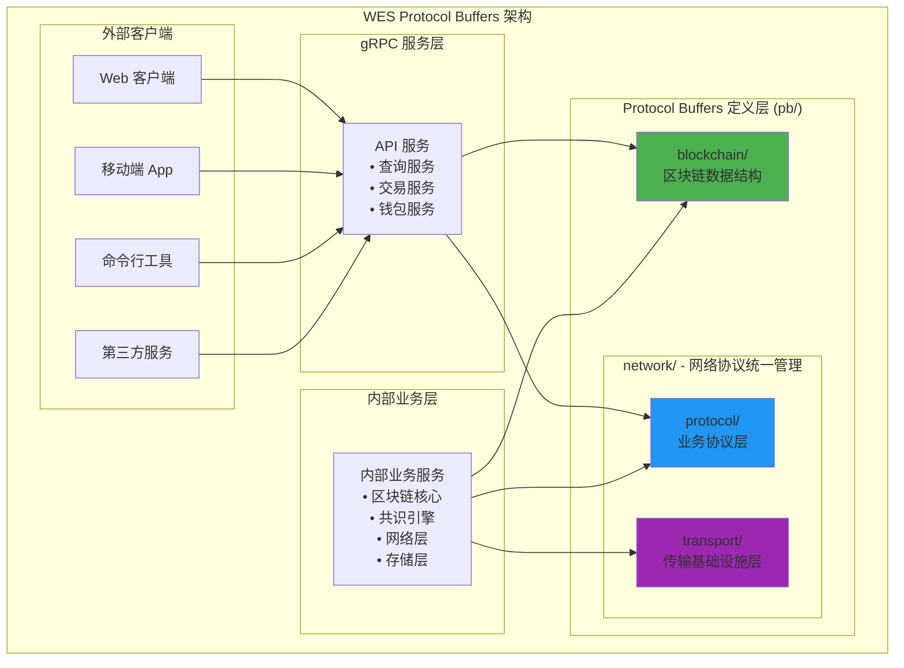
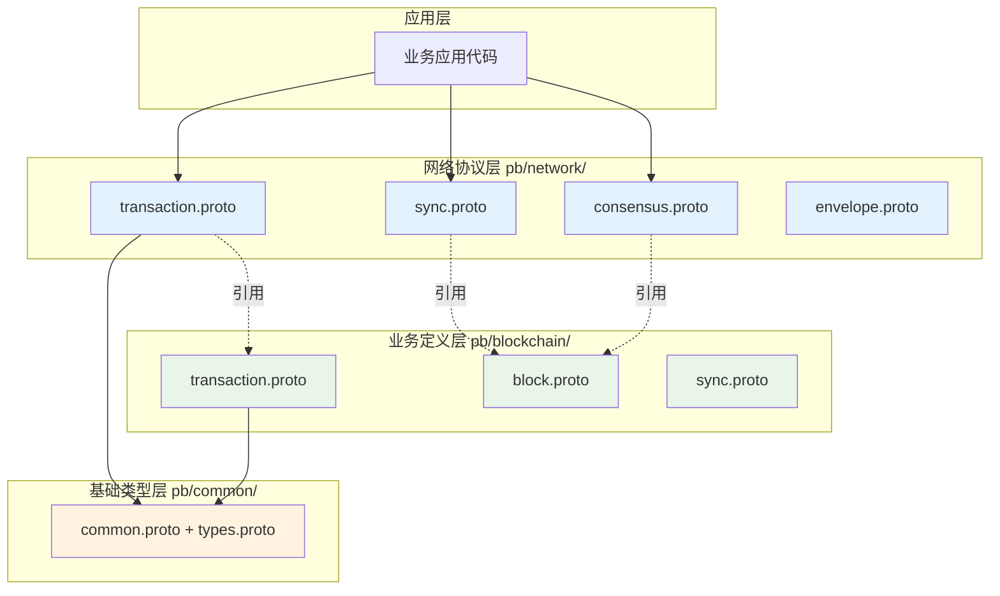

# WES Protocol Buffers 定义（pb/）

【模块定位】
　　本目录定义了WES区块链系统的协议缓冲区（Protocol Buffers）数据结构，作为系统内部和外部通信的标准化数据格式。通过 .proto 文件定义消息结构，自动生成 Go 语言绑定代码，为跨模块数据交换、网络通信、持久化存储提供高效、类型安全的序列化方案。

【设计原则】
- 版本兼容：支持向前和向后兼容的消息演进
- 高效序列化：比 JSON/XML 更紧凑的二进制格式
- 类型安全：编译时类型检查和强类型定义
- 跨语言支持：为多语言客户端提供统一接口
- 模块化组织：按功能域分层组织 .proto 文件

【核心职责】
1. **数据结构标准化**：定义系统内所有核心数据结构的权威定义
2. **通信协议规范**：为gRPC服务和网络通信提供接口定义
3. **序列化优化**：提供高效的二进制序列化和反序列化
4. **版本管理**：支持协议版本演进和向后兼容
5. **跨模块契约**：作为不同模块间的数据交换契约
6. **外部接口**：为外部客户端和工具提供标准数据格式

【协议结构】

## Protocol Buffers 架构设计



## 目录结构详解

```
pb/
├── blockchain/               # 📦 区块链核心数据结构（纯业务定义）
│   ├── block/                # 区块相关数据结构
│   │   ├── block.proto       # 区块结构定义
│   │   └── transaction/      # 交易相关数据结构
│   │       ├── transaction.proto    # 交易/UTXO/资源核心定义（纯业务定义）
│   │       └── resource/
│   │           └── resource.proto   # 资源类型定义
│   ├── execution/            # 执行层数据结构
│   │   ├── contract_execution.proto # 合约执行类型
│   │   └── core_execution.proto     # 核心执行类型
│   └── utxo/                 # UTXO模型数据结构
│       └── utxo.proto        # UTXO类型定义
└── network/                  # 🌐 网络协议统一归口管理（二级分层）
    ├── protocol/             # 📡 业务协议层（What to transmit）
    │   ├── transaction.proto # 交易网络传播协议
    │   ├── sync.proto        # 区块同步网络协议
    │   └── consensus.proto   # 共识网络协议
    └── transport/            # 🔧 传输基础设施层（How to transmit）
        ├── envelope.proto    # 通用网络消息封装
        ├── message.proto     # P2P消息传输
        └── node.proto        # 节点信息管理
```

### 🔄 **重构架构总结**

#### **已删除冗余目录**
- ❌ `pb/blockchain/sync/` - 网络行为不应在业务数据层定义
- ❌ `pb/common/` - 基础类型统一到`pkg/types`管理  
- ❌ `pb/p2p/` - P2P协议已移至`pb/network/transport/`

#### **新增分层架构**
- ✅ `pb/network/protocol/` - 业务协议层，关注传输什么业务数据
- ✅ `pb/network/transport/` - 传输基础设施层，关注如何高效传输

## 核心协议分类

### 📦 区块链数据层 (blockchain/) - 纯业务定义

| 子目录 | 协议文件 | 核心消息 | 主要用途 | 重构状态 |
|--------|----------|----------|----------|----------|
| **block/** | `block.proto` | `Block`, `BlockHeader` | 区块结构定义 | ✅ 保持不变 |
| **block/transaction/** | `transaction.proto` | `Transaction`, `TxInput`, `TxOutput`, `ResourceUTXO` | 交易/UTXO/资源核心定义 | ✅ 纯业务定义 |
| **execution/** | `contract_execution.proto`, `core_execution.proto` | `ExecutionRequest`, `ExecutionResult` | 智能合约执行 | ✅ 保持不变 |
| **utxo/** | `utxo.proto` | `UTXO`, `UTXOSet` | UTXO模型数据 | ✅ 保持不变 |

### 🌐 网络协议层 (network/) - 二级分层架构

#### 📡 业务协议层 (network/protocol/) - What to transmit

| 协议文件 | Package | 核心消息 | 协议类型 | 主要用途 | 重构状态 |
|----------|---------|----------|----------|----------|----------|
| **transaction.proto** | `pb.network.protocol` | `TransactionAnnouncement`, `TransactionPropagationRequest` | GossipSub + Stream RPC | 交易双重保障传播 | ⭐ 新增 |
| **sync.proto** | `pb.network.protocol` | `KBucketSyncRequest`, `IntelligentPaginationResponse` | Stream RPC | K-bucket智能同步 | ⭐ 新增 |
| **consensus.proto** | `pb.network.protocol` | `MinerBlockSubmission`, `ConsensusResultBroadcast` | Stream RPC + GossipSub | 矿工-聚合器共识 | ⭐ 重构移入 |

#### 🔧 传输基础设施层 (network/transport/) - How to transmit

| 协议文件 | Package | 核心消息 | 协议类型 | 主要用途 | 重构状态 |
|----------|---------|----------|----------|----------|----------|
| **envelope.proto** | `pb.network.transport` | `Envelope`, `RpcRequest`, `RpcResponse` | Stream RPC容器 | 通用网络消息封装 | ✅ 重构归入 |
| **message.proto** | `pb.network.transport` | `P2PMessage` | P2P基础消息 | P2P网络基础消息包装 | ⭐ 重构移入 |
| **node.proto** | `pb.network.transport` | `NodeInfo`, `NodeStatus` | 节点管理 | 节点信息和状态管理 | ⭐ 重构移入 |

### 🗑️ 已删除冗余层 - 职责重构

| 原目录 | 删除原因 | 迁移去向 | 重构状态 |
|-------|----------|----------|----------|
| **pb/blockchain/sync/** | 网络行为不应在业务数据层定义 | `pb/network/protocol/sync.proto` | ✅ 已删除 |
| **pb/common/** | 基础类型重复定义，与`pkg/types`冗余 | `pkg/types/` | ✅ 已删除 |
| **pb/p2p/** | P2P协议应归属传输基础设施层 | `pb/network/transport/` | ✅ 已删除 |

## 🔄 **重构架构总结**

### **重构成果**
✅ **职责清晰分离**：业务定义与网络协议完全解耦  
✅ **统一归口管理**：所有网络协议集中在pb/network/目录  
✅ **版本独立演进**：业务结构与网络协议可独立升级  
✅ **类型安全保障**：强类型protobuf定义，编译时检查  

### **架构对比**

| **重构前** | **重构后** | **收益** |
|------------|------------|----------|
| 网络协议分散在各业务模块中 | 网络协议统一归口到pb/network/ | 统一管理，版本控制简化 |
| pb/blockchain/transaction.proto 2171行 | 拆分为业务定义+网络协议 | 职责单一，维护简便 |
| pb/consensus/network.proto 独立存在 | 移动到pb/network/consensus.proto | 架构统一，查找方便 |
| 业务与网络协议混合定义 | 清晰的三层架构分离 | 依赖关系明确，重用性高 |

### **新架构三层结构**


## 主要数据结构示例

### 区块结构 (blockchain/core/block.proto)
```protobuf
message Block {
  BlockHeader header = 1;           // 区块头信息
  repeated Transaction transactions = 2;  // 交易列表
  bytes signature = 3;              // 区块签名
}

message BlockHeader {
  uint32 version = 1;               // 区块版本
  bytes previous_hash = 2;          // 前一区块哈希
  uint64 height = 3;                // 区块高度
  uint64 timestamp = 4;             // 时间戳
  bytes merkle_root = 5;            // 交易Merkle根
  bytes state_root = 6;             // 状态根
  uint64 nonce = 7;                 // 挖矿随机数
  uint64 difficulty = 8;            // 挖矿难度
}
```

### 交易结构 (blockchain/core/transaction.proto)  
```protobuf
message Transaction {
  TransactionType type = 1;         // 交易类型
  repeated TransactionInput inputs = 2;   // 输入UTXO
  repeated TransactionOutput outputs = 3; // 输出UTXO
  uint64 fee = 4;                   // 交易费
  uint64 timestamp = 5;             // 交易时间戳
  bytes signature = 6;              // 交易签名
  bytes data = 7;                   // 附加数据
}
```

### P2P消息结构 (p2p/message.proto)
```protobuf
message P2PMessage {
  MessageType type = 1;             // 消息类型
  bytes sender_id = 2;              // 发送者ID
  bytes payload = 3;                // 消息负载
  uint64 timestamp = 4;             // 时间戳
  bytes signature = 5;              // 消息签名
}
```

## Protocol Buffers 代码生成

### 自动生成流程

WES使用脚本自动从 .proto 文件生成 Go 代码：

```bash
# 生成所有 proto 文件
./scripts/protoc/generate_proto.sh

# 生成特定目录的 proto 文件
protoc --go_out=. --go-grpc_out=. pb/blockchain/core/*.proto
protoc --go_out=. --go-grpc_out=. pb/common/*.proto
```

### 文件生成规则

| .proto 文件 | 生成的 .pb.go 文件 | 包含内容 |
|-------------|-------------------|----------|
| `block.proto` | `block.pb.go` | Block, BlockHeader 等消息类型 |
| `transaction.proto` | `transaction.pb.go` | Transaction, TxInput, TxOutput 等 |
| `message.proto` | `message.pb.go` | P2PMessage 等网络消息 |

### 生成代码特点

- **类型安全**：编译时检查消息字段类型
- **内存优化**：使用对象池减少GC压力
- **序列化高效**：比JSON快3-10倍
- **版本兼容**：支持字段增减的向后兼容

## 使用示例

### 基础序列化操作
```go
import (
    "github.com/weisyn/v1/pb/blockchain/core"
    "google.golang.org/protobuf/proto"
)

// 创建区块
block := &core.Block{
    Header: &core.BlockHeader{
        Version:      1,
        Height:       100,
        PreviousHash: []byte("prev_hash"),
        Timestamp:    uint64(time.Now().Unix()),
    },
    Transactions: []*core.Transaction{...},
}

// 序列化为二进制
data, err := proto.Marshal(block)
if err != nil {
    log.Fatal(err)
}

// 反序列化
var newBlock core.Block
err = proto.Unmarshal(data, &newBlock)
if err != nil {
    log.Fatal(err)
}
```

### 网络消息处理
```go
import (
    "github.com/weisyn/v1/pb/p2p"
    "github.com/weisyn/v1/pb/common"
)

// 创建P2P消息
msg := &p2p.P2PMessage{
    Type:      p2p.MessageType_BLOCK_ANNOUNCEMENT,
    SenderId:  []byte("node123"),
    Payload:   blockData,
    Timestamp: uint64(time.Now().Unix()),
}

// 发送到网络
network.SendMessage(peerID, msg)
```

### UTXO操作示例
```go
import "github.com/weisyn/v1/pb/blockchain/utxo"

// 创建UTXO
utxo := &utxo.UTXO{
    TxHash:      []byte("tx_hash"),
    OutputIndex: 0,
    Amount:      10000,
    Address:     []byte("recipient_addr"),
    ScriptPubKey: []byte("script"),
}

// 创建UTXO集合
utxoSet := &utxo.UTXOSet{
    Utxos: []*utxo.UTXO{utxo},
    TotalValue: 10000,
}
```

## 版本管理与兼容性

### 协议演进原则

Protocol Buffers 支持安全的协议演进，遵循以下规则：

| 操作 | 兼容性 | 规则 | 示例 |
|------|--------|------|------|
| **添加字段** | ✅ 向前兼容 | 使用新的字段编号 | `optional string new_field = 10;` |
| **删除字段** | ✅ 向后兼容 | 标记为 reserved | `reserved 5; reserved "old_field";` |
| **重命名字段** | ✅ 兼容 | 不影响序列化 | `string address = 3; // 原名: recipient` |
| **修改字段编号** | ❌ 不兼容 | 永远不要做 | ~~`string name = 2; // 原为 = 1`~~ |
| **修改字段类型** | ⚠️ 部分兼容 | 仅限兼容类型 | `uint64 → uint32`（数据丢失） |

### 版本演进示例

```protobuf
// 版本 1.0
message Transaction {
  bytes from = 1;
  bytes to = 2;
  uint64 amount = 3;
}

// 版本 1.1 - 添加新字段
message Transaction {
  bytes from = 1;
  bytes to = 2;
  uint64 amount = 3;
  uint64 fee = 4;           // 新增字段
  uint64 timestamp = 5;     // 新增字段
}

// 版本 1.2 - 删除字段和重构
message Transaction {
  bytes from = 1;
  // 删除 to 字段
  reserved 2;
  reserved "to";
  uint64 amount = 3;
  uint64 fee = 4;
  uint64 timestamp = 5;
  bytes recipient = 6;      // 新的接收方字段
}
```

### 字段编号规划

```protobuf
message Block {
  // 1-15: 核心字段（单字节编码）
  BlockHeader header = 1;
  repeated Transaction transactions = 2;
  bytes signature = 3;
  
  // 16-2047: 扩展字段（双字节编码）
  uint32 version = 16;
  
  // 19000-19999: 实验性字段（预留）
  // 20000-29999: 第三方扩展（预留）
  // 50000+: 内部测试（预留）
}
```

## 最佳实践指南

### 🎯 协议设计原则

#### 1. 字段编号策略
```protobuf
message MyMessage {
  // 1-15: 高频字段（单字节varint编码）
  string id = 1;
  string name = 2;
  
  // 16-2047: 中频字段（双字节varint编码）
  repeated string tags = 16;
  map<string, string> metadata = 17;
  
  // 19000+: 预留字段
}
```

#### 2. 枚举值设计
```protobuf
enum TransactionType {
  // 保留0值作为默认值
  TRANSACTION_TYPE_UNSPECIFIED = 0;
  TRANSACTION_TYPE_TRANSFER = 1;
  TRANSACTION_TYPE_CONTRACT = 2;
  TRANSACTION_TYPE_STAKE = 3;
}
```

#### 3. 消息嵌套原则
```protobuf
// ✅ 好的设计：逻辑分组
message Block {
  BlockHeader header = 1;
  BlockBody body = 2;
}

message BlockHeader {
  uint64 height = 1;
  bytes previous_hash = 2;
  uint64 timestamp = 3;
}

// ❌ 避免：平铺字段
message FlatBlock {
  uint64 height = 1;
  bytes previous_hash = 2;
  uint64 timestamp = 3;
  repeated Transaction transactions = 4;
  bytes signature = 5;
}
```

### ⚡ 性能优化技巧

#### 1. 对象重用
```go
// 使用对象池避免频繁分配
var blockPool = sync.Pool{
    New: func() interface{} {
        return &core.Block{}
    },
}

func ProcessBlock(data []byte) error {
    block := blockPool.Get().(*core.Block)
    defer func() {
        block.Reset()  // 重置对象状态
        blockPool.Put(block)
    }()
    
    return proto.Unmarshal(data, block)
}
```

#### 2. 流式处理
```go
// 处理大量消息时使用流式读取
func ProcessTransactionStream(reader io.Reader) error {
    decoder := protojson.NewDecoder(reader)
    for {
        var tx core.Transaction
        if err := decoder.Decode(&tx); err == io.EOF {
            break
        } else if err != nil {
            return err
        }
        
        // 处理交易
        ProcessTransaction(&tx)
    }
    return nil
}
```

### 🔒 安全考虑

#### 1. 输入验证
```go
func (tx *Transaction) Validate() error {
    if len(tx.Inputs) == 0 {
        return errors.New("transaction must have inputs")
    }
    
    if tx.Fee < MinTransactionFee {
        return errors.New("transaction fee too low")
    }
    
    // 验证地址格式
    for _, input := range tx.Inputs {
        if !IsValidAddress(input.Address) {
            return errors.New("invalid input address")
        }
    }
    
    return nil
}
```

#### 2. 大小限制
```go
const (
    MaxBlockSize = 1 << 20  // 1MB
    MaxTxSize    = 1 << 16  // 64KB
)

func ValidateBlockSize(block *core.Block) error {
    data, _ := proto.Marshal(block)
    if len(data) > MaxBlockSize {
        return errors.New("block too large")
    }
    return nil
}
```

### 📚 文档和维护

#### 1. 注释规范
```protobuf
// Block represents a block in the blockchain
// It contains a header with metadata and a list of transactions
message Block {
  // Block header containing metadata
  BlockHeader header = 1;
  
  // List of transactions in this block
  // Maximum 1000 transactions per block
  repeated Transaction transactions = 2;
  
  // Block signature from the miner
  bytes signature = 3;
}
```

#### 2. 版本标记
```protobuf
syntax = "proto3";
package pb.blockchain.core.v1;  // 包含版本号

option go_package = "github.com/weisyn/v1/pb/blockchain/core";
```

### 🛠️ 开发工具

#### 1. 代码生成脚本
```bash
#!/bin/bash
# scripts/protoc/generate_proto.sh

# 设置protoc路径
PROTOC_VERSION="3.21.0"
PROTOC_GEN_GO_VERSION="1.28.0"

# 生成Go代码
find pb -name "*.proto" -exec protoc \
  --go_out=. \
  --go_opt=paths=source_relative \
  --go-grpc_out=. \
  --go-grpc_opt=paths=source_relative \
  {} \;

echo "Protocol buffers generated successfully"
```

#### 2. 验证脚本
```bash
#!/bin/bash
# 验证所有proto文件语法
find pb -name "*.proto" -exec protoc --proto_path=. --dry-run {} \;
```

---

## 🔗 相关文档

- **上层设计**：`pkg/README.md` - 包结构设计说明
- **接口定义**：`pkg/interfaces/README.md` - 公共接口层设计
- **类型定义**：`pkg/types/README.md` - Go数据类型定义
- **API服务**：`api/README.md` - gRPC服务定义
- **区块链协议**：`pb/blockchain/README.md` - 区块链数据结构
- **网络协议**：查看各子目录的README了解具体协议

---

**注意**：本目录的所有 .pb.go 文件都是从 .proto 文件自动生成的，请勿手动修改。如需修改数据结构，请编辑对应的 .proto 文件并重新生成代码。 