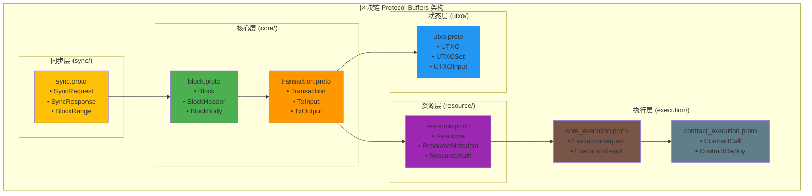

# 区块链数据结构 Protocol Buffers（pb/blockchain/）

【模块定位】
　　本目录定义了WES区块链系统的核心数据结构协议，涵盖区块、交易、UTXO、资源管理和执行层的所有数据类型。通过分层的 Protocol Buffers 定义，为区块链的核心功能提供类型安全、高效序列化的数据格式标准。

【设计原则】
- 分层架构：按功能域组织，层次清晰、职责单一
- 向前兼容：支持协议演进和版本升级
- 高效序列化：优化网络传输和存储性能
- 类型安全：编译时类型检查，防止数据错误
- 模块化设计：支持独立升级和扩展

【核心职责】
1. **核心数据定义**：区块、交易等基础区块链数据结构
2. **状态管理**：UTXO模型和状态转换的数据表示
3. **资源抽象**：统一的资源管理和文件存储协议
4. **执行接口**：智能合约和AI模型执行的数据接口
5. **同步协议**：区块链数据同步和网络通信协议

【协议架构】

## 区块链协议分层设计



## 目录结构说明

```
pb/blockchain/
├── core/                     # 核心区块链数据
│   ├── block.proto          # 区块结构定义
│   ├── block.pb.go          # 生成的Go代码
│   ├── transaction.proto    # 交易结构定义
│   ├── transaction.pb.go    # 生成的Go代码
│   └── README.md           # 核心层说明文档
├── execution/              # 执行层数据结构
│   ├── contract_execution.proto  # 智能合约执行
│   ├── core_execution.proto      # 核心执行框架
│   └── README.md                 # 执行层说明文档
├── resource/               # 资源管理数据
│   ├── resource.proto      # 资源定义和管理
│   └── README.md          # 资源层说明文档
├── sync/                   # 同步协议数据
│   ├── sync.proto         # 区块同步协议
│   └── README.md          # 同步层说明文档
├── utxo/                   # UTXO模型数据
│   ├── utxo.proto         # UTXO数据结构
│   └── README.md          # UTXO层说明文档
└── README.md              # 本文档
```

## 协议分层详解

### 📦 核心层 (core/)

**职责**：定义区块链的基础数据结构
**包含**：区块、交易、区块头等核心概念
**特点**：最底层协议，被其他层广泛依赖

| 协议文件 | 核心消息 | 主要用途 | 依赖关系 |
|----------|----------|----------|----------|
| `block.proto` | `Block`, `BlockHeader` | 区块结构和元数据 | 被所有层引用 |
| `transaction.proto` | `Transaction`, `TxInput`, `TxOutput` | 交易数据和输入输出 | 核心数据结构 |

### 🔄 状态层 (utxo/)

**职责**：管理区块链状态和UTXO模型
**包含**：UTXO集合、状态转换、余额管理
**特点**：实现扩展UTXO模型，支持智能合约状态

| 协议文件 | 核心消息 | 主要用途 | 设计特点 |
|----------|----------|----------|----------|
| `utxo.proto` | `UTXO`, `UTXOSet`, `UTXOInput` | UTXO模型和状态管理 | 支持资源引用和状态链 |

### 🗂️ 资源层 (resource/)

**职责**：统一的资源管理和文件存储抽象
**包含**：文件资源、权限管理、元数据
**特点**：支持WASM合约、ONNX模型、媒体文件等多种资源

| 协议文件 | 核心消息 | 主要用途 | 应用场景 |
|----------|----------|----------|----------|
| `resource.proto` | `Resource`, `ResourceMetadata` | 资源管理和访问控制 | 智能合约、AI模型、NFT |

### ⚙️ 执行层 (execution/)

**职责**：定义智能合约和AI模型的执行接口
**包含**：执行请求、执行结果、环境参数
**特点**：支持多种执行引擎，环境无关的执行抽象

| 协议文件 | 核心消息 | 主要用途 | 执行类型 |
|----------|----------|----------|----------|
| `core_execution.proto` | `ExecutionRequest`, `ExecutionResult` | 通用执行框架 | 所有执行引擎 |
| `contract_execution.proto` | `ContractCall`, `ContractDeploy` | 智能合约执行 | WASM合约 |

### 🔄 同步层 (sync/)

**职责**：区块链数据同步和网络协议
**包含**：同步请求、数据范围、网络消息
**特点**：支持增量同步和分片传输

| 协议文件 | 核心消息 | 主要用途 | 网络功能 |
|----------|----------|----------|----------|
| `sync.proto` | `SyncRequest`, `SyncResponse` | 区块同步协议 | 节点间数据同步 |

## 使用示例

### 区块和交易操作
```go
import (
    "github.com/weisyn/v1/pb/blockchain/core"
    "google.golang.org/protobuf/proto"
)

// 创建区块
block := &core.Block{
    Header: &core.BlockHeader{
        Version:      1,
        Height:       1000,
        PreviousHash: []byte("prev_hash"),
        Timestamp:    uint64(time.Now().Unix()),
        MerkleRoot:   []byte("merkle_root"),
    },
    Transactions: []*core.Transaction{
        {
            Type: core.TransactionType_TRANSFER,
            Inputs: []*core.TransactionInput{...},
            Outputs: []*core.TransactionOutput{...},
            Fee: 1000,
        },
    },
}

// 序列化
data, _ := proto.Marshal(block)
```

### UTXO状态管理
```go
import "github.com/weisyn/v1/pb/blockchain/utxo"

// 创建UTXO
utxo := &utxo.UTXO{
    TxHash:      []byte("transaction_hash"),
    OutputIndex: 0,
    Amount:      10000,
    Address:     []byte("owner_address"),
    ScriptPubKey: []byte("script"),
}

// 创建UTXO集合
utxoSet := &utxo.UTXOSet{
    Utxos: []*utxo.UTXO{utxo},
    TotalValue: 10000,
    Height: 1000,
}
```

### 资源管理
```go
import "github.com/weisyn/v1/pb/blockchain/resource"

// 创建资源
resource := &resource.Resource{
    ResourceId: []byte("resource_id"),
    Type: resource.ResourceType_WASM_CONTRACT,
    Metadata: &resource.ResourceMetadata{
        Name: "MyContract",
        Version: "1.0.0",
        ContentType: "application/wasm",
        Size: 1024,
    },
    Content: wasmBytes,
}
```

### 智能合约执行
```go
import "github.com/weisyn/v1/pb/blockchain/execution"

// 创建执行请求
request := &execution.ExecutionRequest{
    ContractId: []byte("contract_id"),
    Method: "transfer",
    Parameters: []byte(`{"to": "address", "amount": 100}`),
    执行费用: 21000,
    执行费用Price: 1000000000,
}

// 执行结果
result := &execution.ExecutionResult{
    Success: true,
    执行费用Used: 15000,
    Result: []byte(`{"success": true}`),
    Logs: []*execution.Log{...},
}
```

## 版本管理

### 协议演进策略

各子协议独立版本管理，支持渐进式升级：

```protobuf
// 版本标识示例
syntax = "proto3";
package pb.blockchain.core.v1;

option go_package = "github.com/weisyn/v1/pb/blockchain/core";

// 版本信息
message ProtocolVersion {
  uint32 major = 1;    // 主版本号（不兼容变更）
  uint32 minor = 2;    // 次版本号（兼容性增强）
  uint32 patch = 3;    // 补丁版本（问题修复）
}
```

### 兼容性保证

- **向前兼容**：新字段使用新的字段编号
- **向后兼容**：删除字段标记为 reserved
- **版本检测**：通过版本号进行兼容性检查

## 扩展指南

### 添加新协议

1. **确定分层**：选择合适的功能层
2. **定义接口**：设计清晰的消息结构
3. **版本规划**：预留字段编号空间
4. **文档完善**：创建对应的README文档

### 协议优化

1. **字段编号优化**：高频字段使用1-15编号
2. **消息大小控制**：避免过大的单个消息
3. **嵌套结构合理化**：平衡可读性和性能
4. **枚举值规范**：保留0值作为默认值

---

## 📚 相关文档

- **上级文档**：`pb/README.md` - Protocol Buffers 总体架构
- **核心层详解**：`core/README.md` - 区块和交易协议详解  
- **执行层详解**：`execution/README.md` - 执行引擎协议详解
- **资源层详解**：`resource/README.md` - 资源管理协议详解
- **UTXO层详解**：`utxo/README.md` - UTXO模型协议详解
- **同步层详解**：`sync/README.md` - 同步协议详解

---

**注意**：本目录中的所有 .pb.go 文件都是从 .proto 文件自动生成的，请勿手动修改。修改数据结构请编辑对应的 .proto 文件并重新生成代码。