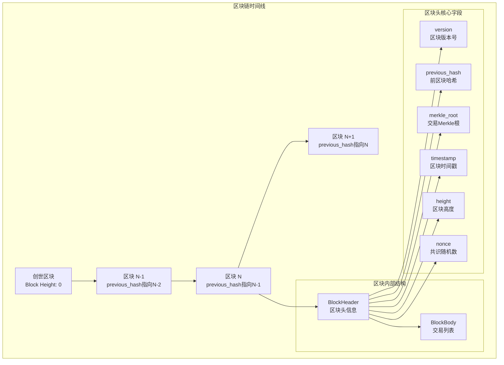
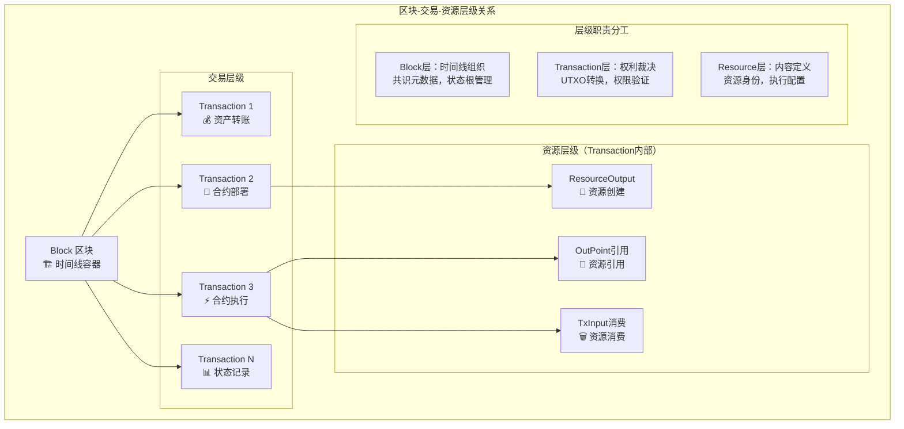
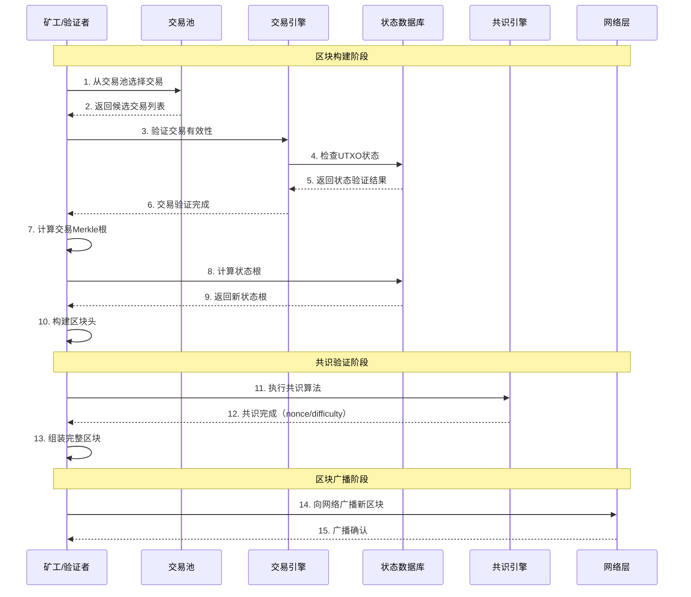
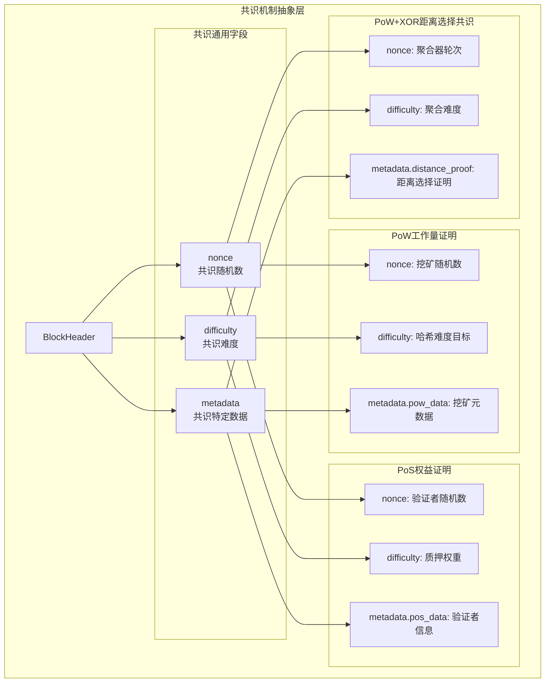
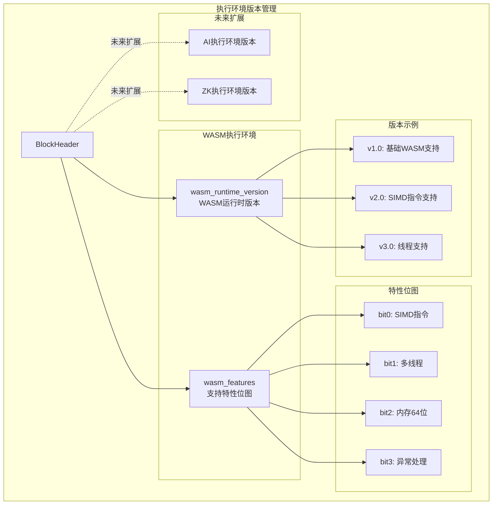
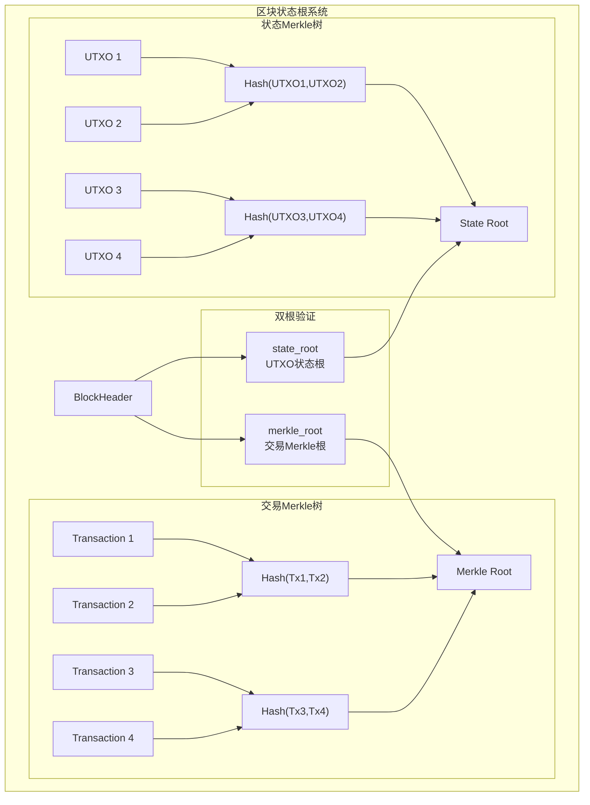
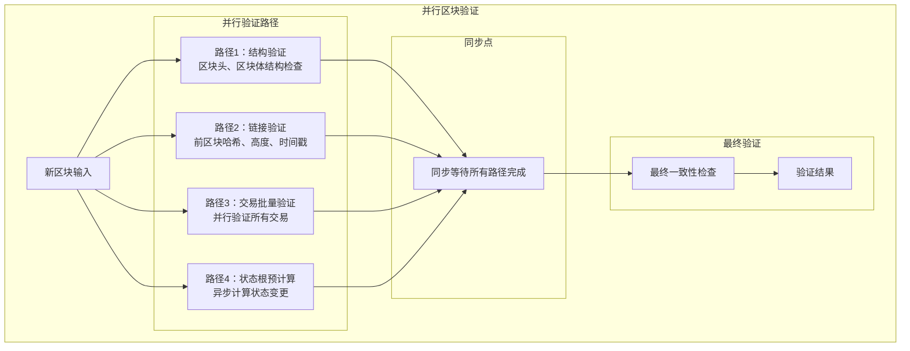

# 区块系统 - 区块链时间线容器（pb/blockchain/block/）

【模块定位】
　　本目录定义了WES区块链系统的核心区块结构，作为区块链时间线的基础容器，负责组织和持久化交易数据，维护共识状态和执行环境信息。区块是区块链系统中最高层的数据结构，将分散的交易组织成有序的、不可篡改的历史记录。

【设计原则】
- 时间线完整性：确保区块链时间序列的完整性和一致性
- 共识中立性：支持多种共识机制的扩展和切换
- 执行环境隔离：为不同执行引擎提供版本隔离和兼容性管理
- 状态根验证：通过Merkle根实现快速状态验证和轻客户端支持
- 向前兼容性：为未来协议升级和功能扩展预留空间

【核心职责】
1. **交易容器管理**：将多个交易打包成有序的区块结构
2. **共识信息维护**：记录共识过程所需的元数据和验证信息
3. **状态根计算**：维护UTXO状态和交易状态的Merkle根
4. **执行环境版本管理**：记录WASM、ONNX等执行环境的版本信息
5. **时间线完整性保障**：通过区块链接确保历史记录的不可篡改性

## 区块架构设计

### 区块层次结构


### 区块与交易关系


## 区块结构设计

### BlockHeader区块头详解
```protobuf
message BlockHeader {
  // ========== 区块链接字段 ==========
  uint64 version = 1;                      // 区块版本号
  bytes previous_hash = 2;                 // 前区块哈希（32字节SHA-256）
  uint64 height = 5;                       // 区块高度（从0开始递增）
  uint64 timestamp = 4;                    // 区块生成时间戳（Unix秒）
  
  // ========== 交易组织字段 ==========  
  bytes merkle_root = 3;                   // 交易Merkle树根
  
  // ========== EUTXO状态字段 ==========
  optional bytes state_root = 7;          // UTXO状态Merkle根
  optional uint64 执行费用_used_total = 8;     // 区块内执行费用总消耗
  optional uint64 执行费用_limit = 9;          // 区块执行费用上限
  
  // ========== 执行环境版本 ==========
  optional string wasm_runtime_version = 10;  // WASM运行时版本
  optional uint32 wasm_features = 11;         // WASM特性支持位图
  
  // ========== 共识相关字段 ==========
  bytes nonce = 6;                         // 共识随机数
  uint64 difficulty = 14;                  // 挖矿难度/共识难度
  
  // ========== 扩展元数据 ==========
  map<string, bytes> metadata = 16;       // 扩展元数据字段
}
```

### BlockBody区块体详解
```protobuf
message BlockBody {
  repeated Transaction transactions = 1;    // 交易列表（有序排列）
}
```

## 区块生成流程

### 区块构建过程


### 区块验证流程

```mermaid
graph TB
    subgraph "区块验证引擎"
        NEW_BLOCK["新区块接收"]
        
        subgraph "第一层：结构验证"
            STRUCTURE_CHECK["区块结构检查"]
            HEADER_VALIDATION["区块头字段验证"]
            BODY_VALIDATION["区块体完整性验证"]
        end
        
        subgraph "第二层：链接验证"
            PREV_HASH_CHECK["前区块哈希验证"]
            HEIGHT_CHECK["区块高度连续性验证"]
            TIMESTAMP_CHECK["时间戳合理性检查"]
        end
        
        subgraph "第三层：交易验证"
            TX_STRUCTURE["交易结构验证"]
            TX_SIGNATURE["交易签名验证"]
            TX_VALUE_CONSERVATION["价值守恒验证"]
        end
        
        subgraph "第四层：状态验证"
            MERKLE_VERIFY["交易Merkle根验证"]
            STATE_ROOT_VERIFY["状态根验证"]
            GAS_VERIFY["执行费用消耗验证"]
        end
        
        subgraph "第五层：共识验证"
            CONSENSUS_VERIFY["共识算法验证"]
            DIFFICULTY_CHECK["难度目标检查"]
            NONCE_VERIFY["随机数验证"]
        end
        
        NEW_BLOCK --> STRUCTURE_CHECK
        STRUCTURE_CHECK --> HEADER_VALIDATION
        HEADER_VALIDATION --> BODY_VALIDATION
        
        BODY_VALIDATION --> PREV_HASH_CHECK
        PREV_HASH_CHECK --> HEIGHT_CHECK
        HEIGHT_CHECK --> TIMESTAMP_CHECK
        
        TIMESTAMP_CHECK --> TX_STRUCTURE
        TX_STRUCTURE --> TX_SIGNATURE
        TX_SIGNATURE --> TX_VALUE_CONSERVATION
        
        TX_VALUE_CONSERVATION --> MERKLE_VERIFY
        MERKLE_VERIFY --> STATE_ROOT_VERIFY
        STATE_ROOT_VERIFY --> GAS_VERIFY
        
        GAS_VERIFY --> CONSENSUS_VERIFY
        CONSENSUS_VERIFY --> DIFFICULTY_CHECK
        DIFFICULTY_CHECK --> NONCE_VERIFY
        
        NONCE_VERIFY --> ACCEPT["✅ 区块接受"]
        
        subgraph "验证失败路径"
            REJECT["❌ 区块拒绝"]
            ERROR_LOG["记录错误详情"]
        end
        
        STRUCTURE_CHECK -.-> REJECT
        PREV_HASH_CHECK -.-> REJECT
        TX_SIGNATURE -.-> REJECT
        MERKLE_VERIFY -.-> REJECT
        CONSENSUS_VERIFY -.-> REJECT
        
        REJECT --> ERROR_LOG
    end
```


## 共识机制支持

### 多共识算法架构


### 共识数据存储示例
```go
// PoW+XOR 共识数据（WES 统一共识算法）
powBlock := &BlockHeader{
    Nonce: binary.BigEndian.Uint64(powNonce),
    Difficulty: powTarget,
    Metadata: map[string][]byte{
        "consensus_type": []byte("pow-xor"),
        "distance_selection_proof": distanceProof,
        "aggregator_signature": aggregatorSig,
        "selected_distance": selectedDistance,
    },
}
```

## 执行环境管理

### 多引擎版本支持


### 执行环境兼容性
```go
type ExecutionEnvironment struct {
    WasmVersion  string
    WasmFeatures uint32
    // 未来可扩展其他执行环境
}

func ValidateExecutionCompatibility(blockEnv, nodeEnv *ExecutionEnvironment) error {
    // 检查WASM版本兼容性
    if !IsVersionCompatible(blockEnv.WasmVersion, nodeEnv.WasmVersion) {
        return fmt.Errorf("WASM版本不兼容: block=%s, node=%s", 
            blockEnv.WasmVersion, nodeEnv.WasmVersion)
    }
    
    // 检查特性支持
    if (blockEnv.WasmFeatures & nodeEnv.WasmFeatures) != blockEnv.WasmFeatures {
        return fmt.Errorf("WASM特性不支持: block=0x%x, node=0x%x", 
            blockEnv.WasmFeatures, nodeEnv.WasmFeatures)
    }
    
    return nil
}
```

## 状态根管理

### Merkle树结构


### 轻客户端验证支持
```go
type MerkleProof struct {
    LeafIndex  uint64   // 叶子节点索引
    Siblings   [][]byte // 兄弟节点哈希列表
    Root       []byte   // Merkle根
}

func VerifyMerkleProof(proof *MerkleProof, leafData []byte) bool {
    hash := SHA256(leafData)
    index := proof.LeafIndex
    
    for _, sibling := range proof.Siblings {
        if index%2 == 0 {
            hash = SHA256(append(hash, sibling...))
        } else {
            hash = SHA256(append(sibling, hash...))
        }
        index /= 2
    }
    
    return bytes.Equal(hash, proof.Root)
}
```

## 使用示例

### 创建区块
```go
import (
    "crypto/sha256"
    "time"
    "github.com/weisyn/v1/pb/blockchain/block"
    "github.com/weisyn/v1/pb/blockchain/block/transaction"
)

// 创建区块头
func CreateBlockHeader(prevBlock *block.Block, transactions []*transaction.Transaction) *block.BlockHeader {
    // 计算交易Merkle根
    merkleRoot := ComputeMerkleRoot(transactions)
    
    // 计算状态根（执行所有交易后的UTXO状态）
    stateRoot := ComputeStateRoot(transactions)
    
    // 计算执行费用消耗
    var total执行费用Used uint64 = 0
    for _, tx := range transactions {
        total执行费用Used += Estimate执行费用Usage(tx)
    }
    
    header := &block.BlockHeader{
        Version:      1,
        PreviousHash: ComputeBlockHash(prevBlock),
        Height:       prevBlock.Header.Height + 1,
        Timestamp:    uint64(time.Now().Unix()),
        MerkleRoot:   merkleRoot,
        StateRoot:    &stateRoot,
        执行费用UsedTotal: &total执行费用Used,
        执行费用Limit:     &default执行费用Limit,
        
        // WASM执行环境信息
        WasmRuntimeVersion: strPtr("wasmtime-v1.0.0"),
        WasmFeatures:       uint32Ptr(0x0F), // 支持SIMD、多线程等特性
        
        // 共识字段（将由共识模块填充）
        Nonce:      make([]byte, 8),
        Difficulty: 1000000,
        
        Metadata: map[string][]byte{
            "consensus_type": []byte("pow"),
            "mining_reward":  []byte("50000000000"), // 500 WES
        },
    }
    
    return header
}

// 创建完整区块
func CreateBlock(prevBlock *block.Block, transactions []*transaction.Transaction) *block.Block {
    header := CreateBlockHeader(prevBlock, transactions)
    
    return &block.Block{
        Header: header,
        Body: &block.BlockBody{
            Transactions: transactions,
        },
    }
}
```

### 区块验证
```go
func ValidateBlock(newBlock *block.Block, prevBlock *block.Block, utxoSet UTXOSet) error {
    header := newBlock.Header
    body := newBlock.Body
    
    // 1. 基础结构验证
    if header == nil || body == nil {
        return errors.New("区块结构不完整")
    }
    
    // 2. 区块链接验证
    expectedHash := ComputeBlockHash(prevBlock)
    if !bytes.Equal(header.PreviousHash, expectedHash) {
        return errors.New("前区块哈希不匹配")
    }
    
    if header.Height != prevBlock.Header.Height + 1 {
        return errors.New("区块高度不连续")
    }
    
    // 3. 时间戳验证
    if header.Timestamp <= prevBlock.Header.Timestamp {
        return errors.New("区块时间戳无效")
    }
    
    // 4. 交易验证
    if len(body.Transactions) == 0 {
        return errors.New("区块不能为空")
    }
    
    var total执行费用Used uint64 = 0
    for _, tx := range body.Transactions {
        if err := ValidateTransaction(tx, utxoSet); err != nil {
            return fmt.Errorf("交易验证失败: %w", err)
        }
        total执行费用Used += Estimate执行费用Usage(tx)
    }
    
    // 5. Merkle根验证
    computedMerkleRoot := ComputeMerkleRoot(body.Transactions)
    if !bytes.Equal(header.MerkleRoot, computedMerkleRoot) {
        return errors.New("交易Merkle根验证失败")
    }
    
    // 6. 状态根验证
    if header.StateRoot != nil {
        computedStateRoot := ComputeStateRootAfterTransactions(body.Transactions, utxoSet)
        if !bytes.Equal(*header.StateRoot, computedStateRoot) {
            return errors.New("状态根验证失败")
        }
    }
    
    // 7. 执行费用验证
    if header.执行费用UsedTotal != nil && *header.执行费用UsedTotal != total执行费用Used {
        return errors.New("执行费用消耗计算错误")
    }
    
    if header.执行费用Limit != nil && total执行费用Used > *header.执行费用Limit {
        return errors.New("超出区块执行费用限制")
    }
    
    // 8. 共识验证（由具体共识模块实现）
    if err := ValidateConsensus(header); err != nil {
        return fmt.Errorf("共识验证失败: %w", err)
    }
    
    return nil
}
```

### 区块序列化和反序列化
```go
import (
    "google.golang.org/protobuf/proto"
    "compress/gzip"
)

func SerializeBlock(block *block.Block) ([]byte, error) {
    // 序列化为Protobuf
    data, err := proto.Marshal(block)
    if err != nil {
        return nil, fmt.Errorf("区块序列化失败: %w", err)
    }
    
    // 可选：压缩以节省存储空间
    var buf bytes.Buffer
    writer := gzip.NewWriter(&buf)
    if _, err := writer.Write(data); err != nil {
        return nil, fmt.Errorf("区块压缩失败: %w", err)
    }
    writer.Close()
    
    return buf.Bytes(), nil
}

func DeserializeBlock(data []byte) (*block.Block, error) {
    // 解压缩
    reader, err := gzip.NewReader(bytes.NewReader(data))
    if err != nil {
        return nil, fmt.Errorf("区块解压缩失败: %w", err)
    }
    defer reader.Close()
    
    decompressed, err := io.ReadAll(reader)
    if err != nil {
        return nil, fmt.Errorf("读取解压缩数据失败: %w", err)
    }
    
    // 反序列化
    var blockData block.Block
    if err := proto.Unmarshal(decompressed, &blockData); err != nil {
        return nil, fmt.Errorf("区块反序列化失败: %w", err)
    }
    
    return &blockData, nil
}
```

### 区块哈希计算
```go
func ComputeBlockHash(block *block.Block) []byte {
    // 只对区块头进行哈希计算，确保确定性
    headerBytes, err := proto.Marshal(block.Header)
    if err != nil {
        panic(fmt.Sprintf("区块头序列化失败: %v", err))
    }
    
    hash := sha256.Sum256(headerBytes)
    return hash[:]
}

func ComputeMerkleRoot(transactions []*transaction.Transaction) []byte {
    if len(transactions) == 0 {
        return make([]byte, 32) // 空区块的零哈希
    }
    
    // 计算每个交易的哈希
    var hashes [][]byte
    for _, tx := range transactions {
        txHash := ComputeTransactionHash(tx)
        hashes = append(hashes, txHash)
    }
    
    // 构建Merkle树
    for len(hashes) > 1 {
        var nextLevel [][]byte
        for i := 0; i < len(hashes); i += 2 {
            if i+1 < len(hashes) {
                // 合并两个相邻哈希
                combined := append(hashes[i], hashes[i+1]...)
                hash := sha256.Sum256(combined)
                nextLevel = append(nextLevel, hash[:])
            } else {
                // 奇数个哈希，最后一个与自己合并
                combined := append(hashes[i], hashes[i]...)
                hash := sha256.Sum256(combined)
                nextLevel = append(nextLevel, hash[:])
            }
        }
        hashes = nextLevel
    }
    
    return hashes[0]
}
```

## 性能优化

### 区块验证并行化


### 存储优化
```go
type BlockStorage interface {
    StoreBlock(block *Block) error
    GetBlock(hash []byte) (*Block, error)
    GetBlockByHeight(height uint64) (*Block, error)
}

type OptimizedBlockStorage struct {
    headerDB  KeyValueDB  // 区块头快速访问
    bodyDB    KeyValueDB  // 区块体存储
    indexDB   KeyValueDB  // 高度索引
    cacheSize int
    cache     LRUCache
}

func (s *OptimizedBlockStorage) StoreBlock(block *Block) error {
    blockHash := ComputeBlockHash(block)
    
    // 分离存储区块头和区块体
    headerData, _ := proto.Marshal(block.Header)
    bodyData, _ := proto.Marshal(block.Body)
    
    // 存储区块头（高频访问）
    if err := s.headerDB.Put(blockHash, headerData); err != nil {
        return err
    }
    
    // 存储区块体（低频访问，可压缩）
    compressedBody := compress(bodyData)
    if err := s.bodyDB.Put(blockHash, compressedBody); err != nil {
        return err
    }
    
    // 建立高度索引
    heightKey := make([]byte, 8)
    binary.BigEndian.PutUint64(heightKey, block.Header.Height)
    if err := s.indexDB.Put(heightKey, blockHash); err != nil {
        return err
    }
    
    // 更新缓存
    s.cache.Put(string(blockHash), block)
    
    return nil
}
```

## 扩展指南

### 添加新的共识字段
```protobuf
message BlockHeader {
  // 现有字段...
  
  // 为新共识算法预留字段编号
  optional bytes consensus_data_1 = 20;
  optional bytes consensus_data_2 = 21;
  optional uint64 consensus_param_1 = 22;
  optional uint64 consensus_param_2 = 23;
  
  // 通用扩展通过metadata实现
  map<string, bytes> metadata = 16;
}
```

### 添加新的执行环境版本
```protobuf
message BlockHeader {
  // 现有WASM字段
  optional string wasm_runtime_version = 10;
  optional uint32 wasm_features = 11;
  
  // 新执行环境版本字段
  optional string zk_runtime_version = 17;    // ZK执行环境版本
  optional uint32 zk_features = 18;           // ZK支持特性
  optional string ai_runtime_version = 19;    // AI执行环境版本
  optional uint32 ai_features = 20;           // AI支持特性
}
```

### 区块升级兼容性
```go
type BlockVersionManager struct {
    currentVersion uint64
    upgradeRules   map[uint64]UpgradeRule
}

type UpgradeRule struct {
    ActivationHeight uint64
    RequiredFeatures []string
    MigrationFunc    func(*Block) (*Block, error)
}

func (bvm *BlockVersionManager) ValidateBlockVersion(block *Block) error {
    if block.Header.Version > bvm.currentVersion {
        return errors.New("不支持的区块版本")
    }
    
    if rule, exists := bvm.upgradeRules[block.Header.Version]; exists {
        if block.Header.Height >= rule.ActivationHeight {
            // 检查必需特性
            for _, feature := range rule.RequiredFeatures {
                if !bvm.hasFeature(feature) {
                    return fmt.Errorf("缺少必需特性: %s", feature)
                }
            }
        }
    }
    
    return nil
}
```

## 监控和调试

### 区块统计信息
```go
type BlockStats struct {
    Height           uint64        `json:"height"`
    Hash             string        `json:"hash"`
    Timestamp        time.Time     `json:"timestamp"`
    TransactionCount int           `json:"transaction_count"`
    Size             int           `json:"size_bytes"`
    执行费用Used          uint64        `json:"执行费用_used"`
    执行费用Limit         uint64        `json:"执行费用_limit"`
    Difficulty       uint64        `json:"difficulty"`
    ExecutionTime    time.Duration `json:"execution_time"`
}

func CollectBlockStats(block *Block) *BlockStats {
    blockData, _ := proto.Marshal(block)
    
    return &BlockStats{
        Height:           block.Header.Height,
        Hash:             hex.EncodeToString(ComputeBlockHash(block)),
        Timestamp:        time.Unix(int64(block.Header.Timestamp), 0),
        TransactionCount: len(block.Body.Transactions),
        Size:             len(blockData),
        执行费用Used:          *block.Header.执行费用UsedTotal,
        执行费用Limit:         *block.Header.执行费用Limit,
        Difficulty:       block.Header.Difficulty,
    }
}
```

---

## 📚 相关文档

- **下级文档**：`transaction/README.md` - 交易层EUTXO权利载体引擎
- **底层文档**：`transaction/resource/README.md` - 资源层内容载体定义
- **技术规范**：`docs/specs/eutxo/EUTXO_SPEC.md` - EUTXO模型规范
- **共识文档**：`docs/specs/consensus/POW_XOR_CONSENSUS_SPEC.md` - PoW+XOR共识机制规范
- **实现指南**：`internal/core/blockchain/domains/block/README.md` - 区块处理实现

---

**注意**：区块层作为区块链时间线的最高层容器，专注于交易组织、共识维护和状态根管理。通过分层设计实现了**区块→交易→资源**的清晰层级关系，确保系统的可维护性和可扩展性。
