# 交易系统 - EUTXO权利载体引擎（pb/blockchain/block/transaction/）

【模块定位】
　　本目录定义了WES区块链系统的核心交易协议，实现统一权利载体理论的交易层。作为EUTXO权利具现化的核心引擎，负责所有权利的裁决、转换和生命周期管理，支持价值载体、能力载体、证据载体的统一权利处理框架。

【设计原则】
- 内容无关性：Transaction层专注于UTXO引用与创建，不感知具体内容类型
- 纯粹转换逻辑：实现 inputs → outputs 的确定性状态转换  
- 三层UTXO架构：分离资产处理、资源创建和状态记录三种权利载体
- 引用不拥有原则：通过OutPoint精确引用，避免数据冗余
- 类型安全设计：使用强类型定义，消除模糊性，提高系统可靠性
- 异构网络友好：支持不同执行能力节点的协同工作

【核心职责】
1. **权利载体创建**：通过三层输出系统创建不同类型的权利载体UTXO
2. **权利转换裁决**：实现UTXO引用、消费、转移的权利状态转换
3. **统一解锁系统**：提供7种标准解锁方式的企业级安全控制
4. **价值守恒验证**：确保交易前后的价值平衡和一致性约束  
5. **生命周期管理**：管理UTXO的创建、引用、消费全生命周期

---

## 🔑 TX 的本质：权限验证 + 状态转换

### 核心定义

> **Transaction 的本质 = 经过授权的 UTXO 状态转换函数**
> 
> 或更直白地说：**TX = 证明你有权使用某些 UTXO + 定义如何创建新的 UTXO**

### 三层递进理解

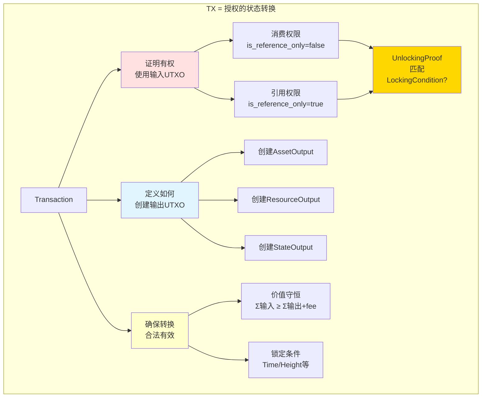
```mermaid
graph TB
    subgraph "TX = 授权的状态转换"
        TX[Transaction]
        
        TX --> INPUT_AUTH[证明有权<br/>使用输入UTXO]
        TX --> OUTPUT_DEF[定义如何<br/>创建输出UTXO]
        TX --> VALID[确保转换<br/>合法有效]
        
        INPUT_AUTH --> AUTH1[消费权限<br/>is_reference_only=false]
        INPUT_AUTH --> AUTH2[引用权限<br/>is_reference_only=true]
        
        AUTH1 --> PROOF[UnlockingProof<br/>匹配<br/>LockingCondition?]
        AUTH2 --> PROOF
        
        OUTPUT_DEF --> CREATE1[创建AssetOutput]
        OUTPUT_DEF --> CREATE2[创建ResourceOutput]
        OUTPUT_DEF --> CREATE3[创建StateOutput]
        
        VALID --> V1[价值守恒<br/>Σ输入 ≥ Σ输出+fee]
        VALID --> V2[锁定条件<br/>Time/Height等]
    end
    
    style INPUT_AUTH fill:#ffe1e1
    style OUTPUT_DEF fill:#e1f5ff
    style VALID fill:#ffffcc
    style PROOF fill:#ffd700
```

#### 第1层 - 最核心：证明有权**使用**输入 UTXO

这是 TX 的安全基石，没有权限就不能执行任何操作。

```text
✅ 对于每个输入，必须回答：
   "你有什么权利使用这个UTXO？"

证明方式：
- UnlockingProof 匹配 LockingCondition
- 7种证明方式对应7种锁定条件
- 这是最核心的验证，没有权限就不能使用

使用方式：
- 消费型（Consume）：UTXO被花费，从集合中移除
- 引用型（Reference）：UTXO被引用，保持在集合中
```

**权限验证的核心地位**：

```text
❌ 如果没有权限验证：
- 任何人都可以花费别人的UTXO
- 区块链将毫无安全性
- 资产将没有所有权保护

✅ 有了权限验证：
- 只有持有正确密钥/证明的人才能使用UTXO
- 资产所有权得到密码学保护
- 这是区块链安全的基石
```

#### 第2层 - 功能层：定义如何**创建**输出 UTXO

这是状态转换的实现，从旧状态到新状态。

```text
✅ 对于每个输出，定义：
   "创建什么类型的UTXO？给谁？什么权限？"

定义内容：
- 输出类型：Asset / Resource / State
- 所有者：Owner地址
- 锁定条件：谁可以使用这个新创建的UTXO

关键点：
- 创建输出本身不需要权限验证
- 但必须有足够的输入来支付（价值守恒）
```

#### 第3层 - 约束层：确保转换的**合法性**

这是系统一致性的保证。

```text
✅ 必须满足的约束：
- 价值守恒：Σ(输入) ≥ Σ(输出) + Fee
- 输入有效：所有输入的UTXO必须存在且未被消费
- 权限验证：所有UnlockingProof必须有效
- 条件满足：时间锁、高度锁等条件必须满足
```

### TX 验证的核心逻辑

```go
// 伪代码：TX验证的核心逻辑

func ValidateTransaction(tx *Transaction) error {
    // 1. 最核心：验证每个输入的权限
    for _, input := range tx.Inputs {
        // 获取被引用的UTXO
        utxo := GetUTXO(input.PreviousOutput)
        
        // 核心验证：UnlockingProof 是否匹配 LockingCondition？
        if !VerifyUnlockingProof(input.UnlockingProof, utxo.LockingConditions) {
            return errors.New("❌ 无权使用此UTXO")
        }
    }
    
    // 2. 验证价值守恒
    if !VerifyValueConservation(tx) {
        return errors.New("❌ 价值不守恒")
    }
    
    // 3. 验证其他条件（时间锁、高度锁等）
    if !VerifyConditions(tx) {
        return errors.New("❌ 条件不满足")
    }
    
    return nil // ✅ 交易有效
}
```

### 执行型交易的额外约束（统一可执行资源语义）

```text
✅ 对于携带 ZKStateProof 的执行型交易（如合约调用 / 模型推理），必须额外满足：
   - 至少包含 1 个输入（排除 0-input 的非法普通交易）
   - 至少包含 1 个 is_reference_only = true 的引用型输入：
       • previous_output 指向部署该可执行资源的 ResourceOutput UTXO
       • 该 UTXO 的 OutputContent 必须为 ResourceOutput
   - StateOutput.zk_proof 证明本次执行结果的正确性，与 ExecutionProof/ExecutionContext 保持一致

对应实现：
   - TX 层：统一的执行资源调用构建器，负责追加 ResourceInput（引用不消费）+ StateOutput（带 ZKStateProof）
   - 验证层：ExecResourceInvariantPlugin（Condition Hook）在验证阶段强制上述结构性约束
```

### 完整的权限矩阵

| 场景 | 需要证明什么权限？ | 如何证明？ | 验证什么？ |
|------|------------------|-----------|----------|
| **转账** | 有权消费发送方的资产UTXO | SingleKeyProof（签名） | 签名是否匹配公钥？ |
| **质押** | 有权消费资产UTXO | SingleKeyProof | 签名验证 + 创建带ContractLock的输出 |
| **合约调用** | 有权引用合约UTXO | SingleKeyProof（支付费用）<br/>+ ExecutionProof（访问权限） | 签名验证 + ISPC执行权限验证 |
| **合约升级** | 有权消费旧合约UTXO | SingleKeyProof（所有者签名） | 必须是合约所有者 |
| **多签转账** | M-of-N个授权者同意 | MultiKeyProof（M个签名） | 至少M个签名有效？ |
| **委托操作** | 被委托方有权代理操作 | DelegationProof | 委托是否有效？未过期？ |
| **NFT转账** | 有权转移NFT所有权 | SingleKeyProof | NFT当前所有者签名？ |

### 类比理解

#### 类比1：银行转账

```text
传统银行：
1. 证明身份（密码/指纹） → TX中的UnlockingProof
2. 检查余额是否足够      → TX中的价值守恒验证
3. 执行转账              → TX中的状态转换
4. 创建新的账户记录      → TX中的创建输出

核心都是：证明有权操作，然后执行操作
```

#### 类比2：房屋交易

```text
房屋买卖：
1. 卖方证明房屋所有权（房产证） → UnlockingProof
2. 买方支付购房款              → 输入UTXO（资金）
3. 房屋所有权转移              → 状态转换
4. 办理新房产证（买方名字）    → 创建新UTXO（新的LockingCondition）

核心都是：证明有权处置，然后转移权利
```

### 核心结论

这就是为什么我们的架构设计是正确的：

1. **协议层 (transaction.proto)**: 
   - 定义固化的权限系统（7种锁定条件和解锁证明）
   - 不包含任何业务语义
   - 永不改变，向后兼容

2. **基础设施层**: 
   - 提供纯粹的输入输出操作
   - 不理解业务含义
   - 只验证权限和价值守恒

3. **应用层 (SDK/Host ABI)**: 
   - 赋予业务语义
   - 将用户意图翻译为输入输出组合
   - 自由演进，不影响底层

**TX = 经过授权的 UTXO 状态转换函数** 🎯

---

## 交易架构设计

### EUTXO权利载体核心架构
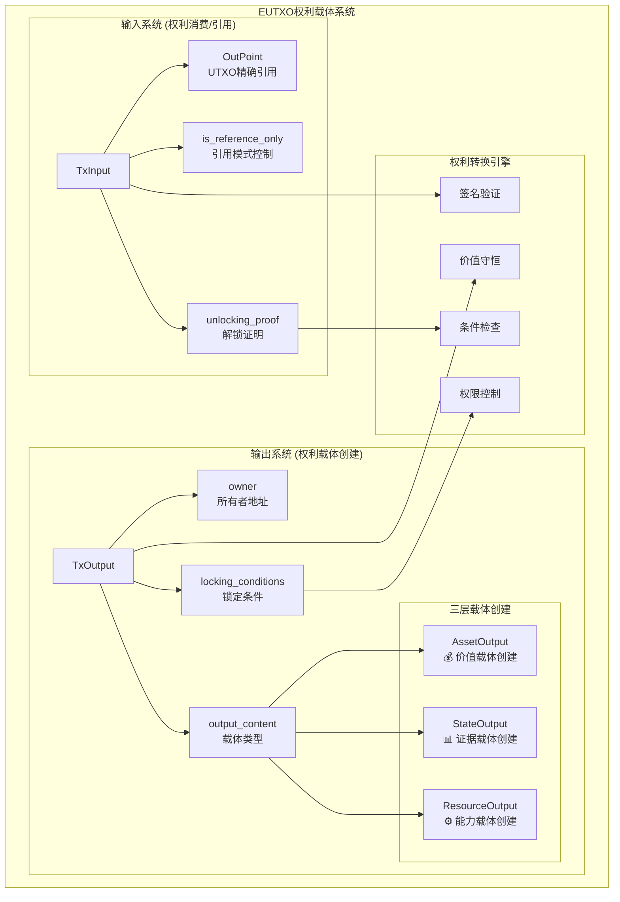
```mermaid
graph TB
    subgraph "EUTXO权利载体系统"
        subgraph "输入系统 (权利消费/引用)"
            TX_INPUT["TxInput"]
            OUTPOINT["OutPoint<br/>UTXO精确引用"]
            REF_MODE["is_reference_only<br/>引用模式控制"]
            UNLOCK_PROOF["unlocking_proof<br/>解锁证明"]
            
            TX_INPUT --> OUTPOINT
            TX_INPUT --> REF_MODE
            TX_INPUT --> UNLOCK_PROOF
        end
        
        subgraph "输出系统 (权利载体创建)"
            TX_OUTPUT["TxOutput"]
            OWNER["owner<br/>所有者地址"]
            LOCKING["locking_conditions<br/>锁定条件"]
            OUTPUT_CONTENT["output_content<br/>载体类型"]
            
            TX_OUTPUT --> OWNER
            TX_OUTPUT --> LOCKING
            TX_OUTPUT --> OUTPUT_CONTENT
            
            subgraph "三层载体创建"
                ASSET["AssetOutput<br/>💰 价值载体创建"]
                STATE["StateOutput<br/>📊 证据载体创建"]  
                RESOURCE["ResourceOutput<br/>⚙️ 能力载体创建"]
            end
            
            OUTPUT_CONTENT --> ASSET
            OUTPUT_CONTENT --> STATE
            OUTPUT_CONTENT --> RESOURCE
        end
        
        subgraph "权利转换引擎"
            VALIDATION["签名验证"]
            VALUE_CONSERVATION["价值守恒"]
            CONDITION_CHECK["条件检查"]
            PERMISSION_CONTROL["权限控制"]
        end
        
        TX_INPUT --> VALIDATION
        TX_OUTPUT --> VALUE_CONSERVATION
        UNLOCK_PROOF --> CONDITION_CHECK
        LOCKING --> PERMISSION_CONTROL
    end
```

### 交易状态转换模型
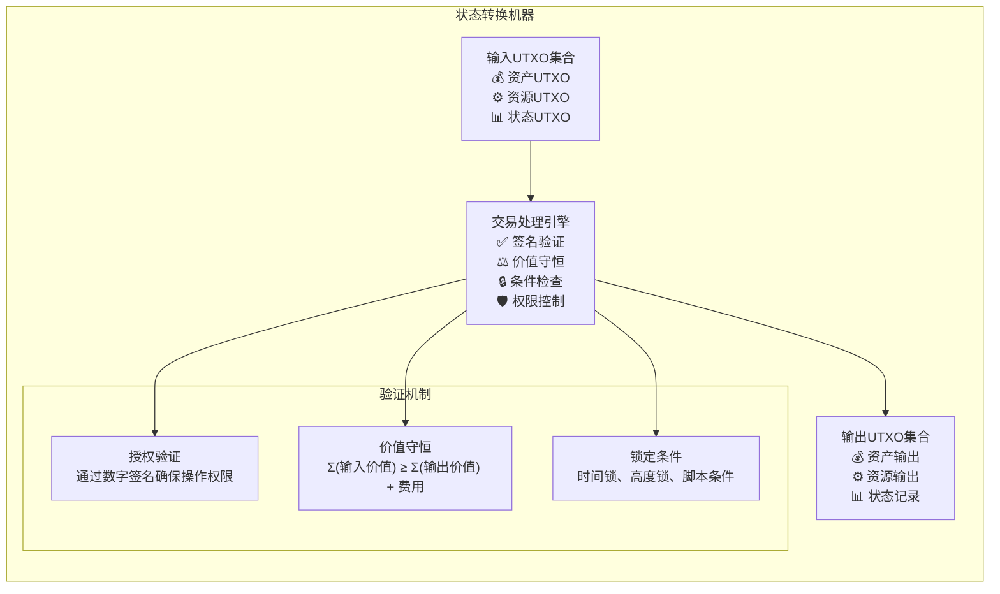
```mermaid
graph LR
    subgraph "状态转换机器"
        INPUT_UTXOS["输入UTXO集合<br/>💰 资产UTXO<br/>⚙️ 资源UTXO<br/>📊 状态UTXO"]
        
        TRANSACTION["交易处理引擎<br/>✅ 签名验证<br/>⚖️ 价值守恒<br/>🔒 条件检查<br/>🛡️ 权限控制"]
        
        OUTPUT_UTXOS["输出UTXO集合<br/>💰 资产输出<br/>⚙️ 资源输出<br/>📊 状态记录"]
        
        INPUT_UTXOS --> TRANSACTION
        TRANSACTION --> OUTPUT_UTXOS
        
        subgraph "验证机制"
            AUTH_VERIFY["授权验证<br/>通过数字签名确保操作权限"]
            VALUE_VERIFY["价值守恒<br/>Σ(输入价值) ≥ Σ(输出价值) + 费用"]
            LOCK_VERIFY["锁定条件<br/>时间锁、高度锁、脚本条件"]
        end
        
        TRANSACTION --> AUTH_VERIFY
        TRANSACTION --> VALUE_VERIFY
        TRANSACTION --> LOCK_VERIFY
    end
```

## 交易结构设计

### 核心Transaction消息
```protobuf
message Transaction {
  // ========== 核心字段 ==========
  uint32 version = 1;                      // 交易版本
  repeated TxInput inputs = 2;             // 输入列表（UTXO引用+解锁）
  repeated TxOutput outputs = 3;           // 输出列表（新UTXO创建）
  
  // ========== 安全保护 ==========
  uint64 nonce = 20;                       // 防重放序列号
  uint64 creation_timestamp = 21;          // 创建时间戳
  bytes chain_id = 24;                     // 链ID（防跨链重放）
  
  // ========== 有效期控制 ==========
  oneof validity_window {
    TimeBasedWindow time_window = 22;      // 时间窗口
    HeightBasedWindow height_window = 23;  // 高度窗口  
  }
  
  // ========== 统一交易费用机制（可选）==========
  // 如果未设置，使用默认UTXO差额：费用 = Σ(输入) - Σ(输出)
  oneof fee_mechanism {
    MinimumFee minimum_fee = 30;           // 最低费用保证
    ProportionalFee proportional_fee = 31; // 比例费用
    ContractExecutionFee contract_fee = 32; // 合约执行费用
    PriorityFee priority_fee = 33;         // 优先级费用
  }
}
```

### TxInput输入系统
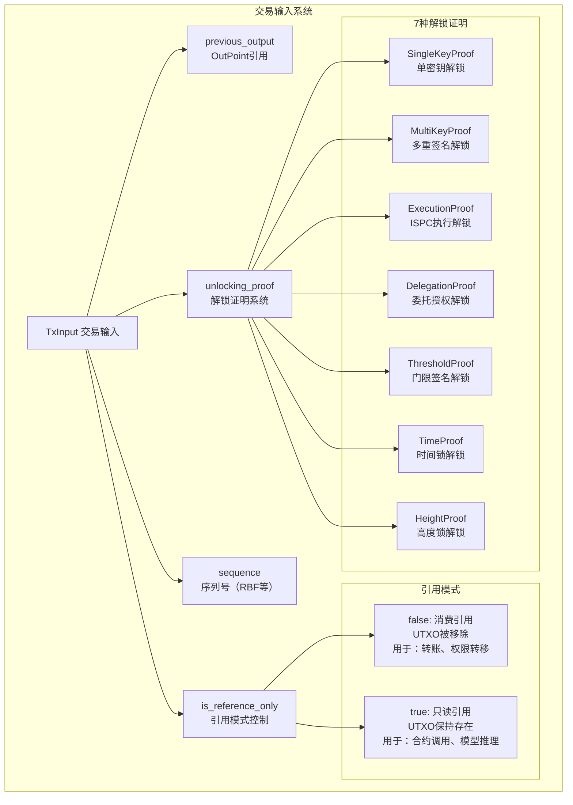
```mermaid
graph TB
    subgraph "交易输入系统"
        TX_INPUT["TxInput 交易输入"]
        PREV_OUTPUT["previous_output<br/>OutPoint引用"]
        IS_REF["is_reference_only<br/>引用模式控制"]
        SEQUENCE["sequence<br/>序列号（RBF等）"]
        UNLOCK_PROOF["unlocking_proof<br/>解锁证明系统"]
        
        TX_INPUT --> PREV_OUTPUT
        TX_INPUT --> IS_REF
        TX_INPUT --> SEQUENCE  
        TX_INPUT --> UNLOCK_PROOF
        
        subgraph "引用模式"
            CONSUME["false: 消费引用<br/>UTXO被移除<br/>用于：转账、权限转移"]
            REFERENCE["true: 只读引用<br/>UTXO保持存在<br/>用于：合约调用、模型推理"]
        end
        
        IS_REF --> CONSUME
        IS_REF --> REFERENCE
        
        subgraph "7种解锁证明"
            SINGLE["SingleKeyProof<br/>单密钥解锁"]
            MULTI["MultiKeyProof<br/>多重签名解锁"]
            CONTRACT["ExecutionProof<br/>ISPC执行解锁"]
            DELEGATION["DelegationProof<br/>委托授权解锁"]
            THRESHOLD["ThresholdProof<br/>门限签名解锁"]
            TIME["TimeProof<br/>时间锁解锁"]
            HEIGHT["HeightProof<br/>高度锁解锁"]
        end
        
        UNLOCK_PROOF --> SINGLE
        UNLOCK_PROOF --> MULTI
        UNLOCK_PROOF --> CONTRACT
        UNLOCK_PROOF --> DELEGATION
        UNLOCK_PROOF --> THRESHOLD
        UNLOCK_PROOF --> TIME
        UNLOCK_PROOF --> HEIGHT
    end
```

### TxOutput输出系统  
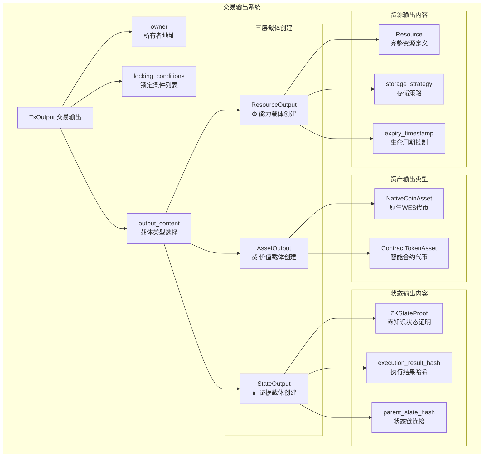
```mermaid
graph TB
    subgraph "交易输出系统"
        TX_OUTPUT["TxOutput 交易输出"]
        OWNER_ADDR["owner<br/>所有者地址"]
        LOCKING_CONDITIONS["locking_conditions<br/>锁定条件列表"]
        OUTPUT_CONTENT["output_content<br/>载体类型选择"]
        
        TX_OUTPUT --> OWNER_ADDR
        TX_OUTPUT --> LOCKING_CONDITIONS
        TX_OUTPUT --> OUTPUT_CONTENT
        
        subgraph "三层载体创建"
            ASSET_OUTPUT["AssetOutput<br/>💰 价值载体创建"]
            STATE_OUTPUT["StateOutput<br/>📊 证据载体创建"]
            RESOURCE_OUTPUT["ResourceOutput<br/>⚙️ 能力载体创建"]
        end
        
        OUTPUT_CONTENT --> ASSET_OUTPUT
        OUTPUT_CONTENT --> STATE_OUTPUT
        OUTPUT_CONTENT --> RESOURCE_OUTPUT
        
        subgraph "资产输出类型"
            NATIVE_COIN["NativeCoinAsset<br/>原生WES代币"]
            CONTRACT_TOKEN["ContractTokenAsset<br/>智能合约代币"]
        end
        
        ASSET_OUTPUT --> NATIVE_COIN
        ASSET_OUTPUT --> CONTRACT_TOKEN
        
        subgraph "状态输出内容"
            ZK_PROOF["ZKStateProof<br/>零知识状态证明"]
            EXEC_RESULT["execution_result_hash<br/>执行结果哈希"]
            STATE_CHAIN["parent_state_hash<br/>状态链连接"]
        end
        
        STATE_OUTPUT --> ZK_PROOF
        STATE_OUTPUT --> EXEC_RESULT
        STATE_OUTPUT --> STATE_CHAIN
        
        subgraph "资源输出内容"
            RESOURCE_DEF["Resource<br/>完整资源定义"]
            STORAGE_STRATEGY["storage_strategy<br/>存储策略"]
            LIFECYCLE["expiry_timestamp<br/>生命周期控制"]
        end
        
        RESOURCE_OUTPUT --> RESOURCE_DEF
        RESOURCE_OUTPUT --> STORAGE_STRATEGY
        RESOURCE_OUTPUT --> LIFECYCLE
    end
```

## 🎯 统一交易费用系统

### 费用设计理念

WES采用**UTXO天然差额机制**作为费用系统的核心，这是区块链最自然的费用设计：

```
默认费用机制：交易费用 = Σ(交易输入金额) - Σ(交易输出金额)
```

**核心优势**：
- 🎯 **透明直观**：用户明确看到输入输出差额就是手续费
- ⚡ **无需计算**：系统自动获得费用金额，矿工直接受益
- 🪙 **多代币天然支持**：每种代币的差额独立计算
- 🚀 **适用95%场景**：普通转账交易无需复杂配置

### 费用机制架构

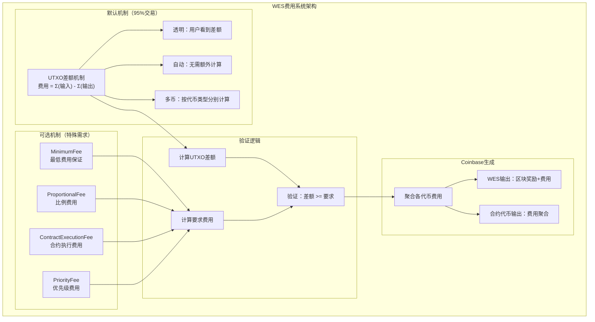
```mermaid
graph TB
    subgraph "WES费用系统架构"
        subgraph "默认机制（95%交易）"
            DEFAULT["UTXO差额机制<br/>费用 = Σ(输入) - Σ(输出)"]
            TRANSPARENT["透明：用户看到差额"]
            AUTOMATIC["自动：无需额外计算"]
            MULTITOKEN["多币：按代币类型分别计算"]
        end
        
        DEFAULT --> TRANSPARENT
        DEFAULT --> AUTOMATIC  
        DEFAULT --> MULTITOKEN
        
        subgraph "可选机制（特殊需求）"
            MINIMUM["MinimumFee<br/>最低费用保证"]
            PROPORTIONAL["ProportionalFee<br/>比例费用"]
            CONTRACT["ContractExecutionFee<br/>合约执行费用"]
            PRIORITY["PriorityFee<br/>优先级费用"]
        end
        
        subgraph "验证逻辑"
            CALCULATE["计算UTXO差额"]
            REQUIRED["计算要求费用"]
            VALIDATE["验证：差额 >= 要求"]
        end
        
        DEFAULT --> CALCULATE
        MINIMUM --> REQUIRED
        PROPORTIONAL --> REQUIRED
        CONTRACT --> REQUIRED
        PRIORITY --> REQUIRED
        
        CALCULATE --> VALIDATE
        REQUIRED --> VALIDATE
        
        subgraph "Coinbase生成"
            AGGREGATE["聚合各代币费用"]
            NATIVE_OUTPUT["WES输出：区块奖励+费用"]
            CONTRACT_OUTPUT["合约代币输出：费用聚合"]
        end
        
        VALIDATE --> AGGREGATE
        AGGREGATE --> NATIVE_OUTPUT
        AGGREGATE --> CONTRACT_OUTPUT
    end
```

### 四种费用机制详解

#### 1. 默认机制：UTXO差额（95%交易）
```
无需设置fee_mechanism，系统自动使用：
费用 = Σ(输入) - Σ(输出)
实际费用 = 100 - 80 - 19.5 = 0.5 WES
```

#### 2. 最低费用：防垃圾交易
```protobuf
minimum_fee: {
  minimum_amount: "1000000000000000000",  // 1 WES最低
  fee_token: {native_token: true}
}
// 验证：实际差额 >= 1 WES
```

#### 3. 比例费用：按转账金额收费
```protobuf
proportional_fee: {
  rate_basis_points: 3,                   // 万分之三
  max_fee_amount: "10000000000000000000", // 最大10 WES
  fee_token: {native_token: true}
}
// 转账1000 WES → 费用 = 1000 × 0.0003 = 0.3 WES
```

#### 4. 合约执行：基础费用+执行费用
```protobuf
contract_fee: {
  base_fee: "1000000000000000000",        // 1 WES基础费
  执行费用_limit: 50000,                       // 50k 执行费用
  执行费用_price: "20000000000000",            // 0.00002 WES/执行费用
  fee_token: {native_token: true}
}
// 总费用 = 1 + 50000 × 0.00002 = 2 WES
```

#### 5. 优先级费用：快速确认
```protobuf
priority_fee: {
  base_fee: "1000000000000000000",        // 1 WES基础
  priority_rate: "2.5",                   // 2.5倍优先级
  fee_token: {native_token: true}
}
// 总费用 = 1 × 2.5 = 2.5 WES
```

### 多代币费用支持

WES支持使用任意代币支付手续费：

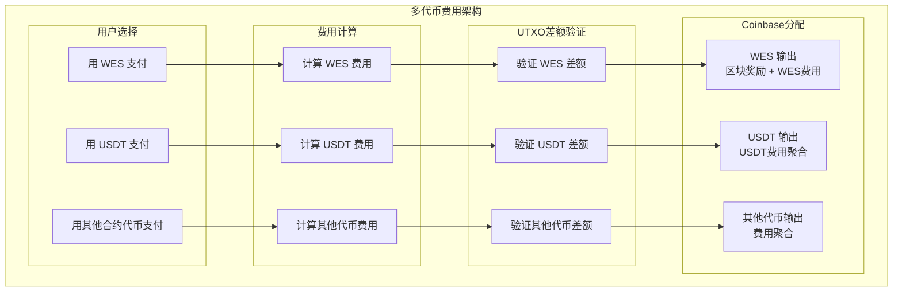
```mermaid
graph TB
    subgraph "多代币费用架构"
        subgraph "用户选择"
            NATIVE_CHOICE["用 WES 支付"]
            USDT_CHOICE["用 USDT 支付"]
            CUSTOM_CHOICE["用其他合约代币支付"]
        end
        
        subgraph "费用计算"
            CALC_NATIVE["计算 WES 费用"]
            CALC_USDT["计算 USDT 费用"]
            CALC_CUSTOM["计算其他代币费用"]
        end
        
        subgraph "UTXO差额验证"
            VERIFY_NATIVE["验证 WES 差额"]
            VERIFY_USDT["验证 USDT 差额"]
            VERIFY_CUSTOM["验证其他代币差额"]
        end
        
        subgraph "Coinbase分配"
            COINBASE_WES["WES 输出<br/>区块奖励 + WES费用"]
            COINBASE_USDT["USDT 输出<br/>USDT费用聚合"]
            COINBASE_OTHER["其他代币输出<br/>费用聚合"]
        end
        
        NATIVE_CHOICE --> CALC_NATIVE --> VERIFY_NATIVE --> COINBASE_WES
        USDT_CHOICE --> CALC_USDT --> VERIFY_USDT --> COINBASE_USDT
        CUSTOM_CHOICE --> CALC_CUSTOM --> VERIFY_CUSTOM --> COINBASE_OTHER
    end
```

### 实际使用示例

#### 示例1：简单转账（默认模式）
```go
// Alice 向 Bob 转账 80 WES
tx := &Transaction{
    Inputs: []*TxInput{
        {PreviousOutput: &OutPoint{...}}, // Alice的100 WES
    },
    Outputs: []*TxOutput{
        {Asset: &AssetOutput{...}},       // Bob收到80 WES
        {Asset: &AssetOutput{...}},       // Alice找零19.5 WES
    },
    // 无fee_mechanism，使用默认UTXO差额
    // 实际费用 = 100 - 80 - 19.5 = 0.5 WES
}
```

#### 示例2：合约调用（执行费用模式）
```go
tx := &Transaction{
    Inputs: []*TxInput{
        {PreviousOutput: &OutPoint{...}}, // Alice的5 WES
        {PreviousOutput: &OutPoint{...}}, // 合约UTXO引用
    },
    Outputs: []*TxOutput{
        {Asset: &AssetOutput{...}},       // 执行结果
        {Asset: &AssetOutput{...}},       // Alice找零3 WES
    },
    FeeMechanism: &Transaction_ContractFee{
        ContractFee: &ContractExecutionFee{
            BaseFee:   "1000000000000000000", // 1 WES
            执行费用Limit:  50000,
            执行费用Price:  "20000000000000",      // 0.00002 WES/执行费用
            FeeToken:  &TokenReference{NativeToken: true},
        },
    },
    // 要求费用 = 1 + 50000 × 0.00002 = 2 WES
    // 实际差额 = 5 - 3 = 2 WES ✅
}
```

#### 示例3：多代币费用（用USDT支付）
```go
tx := &Transaction{
    Inputs: []*TxInput{
        {PreviousOutput: &OutPoint{...}}, // Alice的100 WES
        {PreviousOutput: &OutPoint{...}}, // Alice的10 USDT
    },
    Outputs: []*TxOutput{
        {Asset: &AssetOutput{...}},       // Bob收到100 WES
        {Asset: &AssetOutput{...}},       // Alice找零9 USDT
    },
    FeeMechanism: &Transaction_MinimumFee{
        MinimumFee: &MinimumFee{
            MinimumAmount: "1000000",       // 1 USDT最低费用
            FeeToken: &TokenReference{
                ContractAddress: []byte("usdt_contract"),
            },
        },
    },
    // WES差额 = 100 - 100 = 0（无WES费用）
    // USDT差额 = 10 - 9 = 1 USDT ✅（符合最低要求）
}
```

### Coinbase交易生成

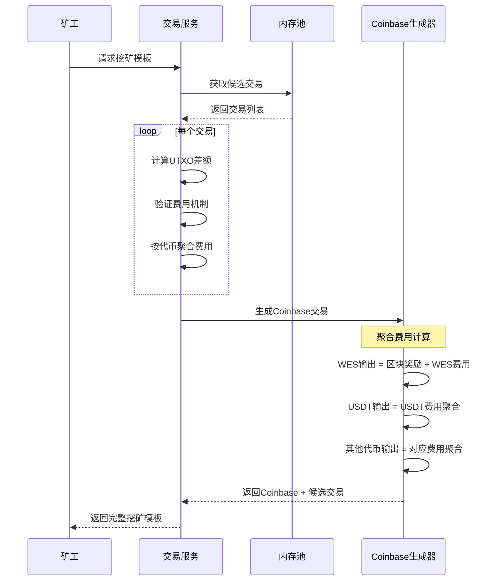
```mermaid
sequenceDiagram
    participant M as 矿工
    participant T as 交易服务
    participant P as 内存池
    participant C as Coinbase生成器
    
    M->>T: 请求挖矿模板
    T->>P: 获取候选交易
    P-->>T: 返回交易列表
    
    loop 每个交易
        T->>T: 计算UTXO差额
        T->>T: 验证费用机制
        T->>T: 按代币聚合费用
    end
    
    T->>C: 生成Coinbase交易
    Note over C: 聚合费用计算
    
    C->>C: WES输出 = 区块奖励 + WES费用
    C->>C: USDT输出 = USDT费用聚合  
    C->>C: 其他代币输出 = 对应费用聚合
    
    C-->>T: 返回Coinbase + 候选交易
    T-->>M: 返回完整挖矿模板
```

#### 多代币Coinbase示例
```protobuf
// 假设区块包含：
// - 交易1：0.1 WES费用
// - 交易2：0.2 WES费用  
// - 交易3：5 USDT费用
// - 交易4：10 USDT费用

Transaction { // Coinbase交易
  inputs: [],   // 无输入
  outputs: [
    // 输出1：WES 区块奖励 + 费用
    TxOutput {
      owner: miner_address,
      output_content: {
        asset: {
          native_coin: {
            amount: "5300000000000000000" // 5 WES奖励 + 0.3 WES费用
          }
        }
      }
    },
    
    // 输出2：USDT 费用聚合
    TxOutput {
      owner: miner_address,
      output_content: {
        asset: {
          contract_token: {
            contract_address: usdt_contract,
            amount: "15000000" // 15 USDT费用聚合
          }
        }
      }
    }
  ]
}
```

### 费用验证流程

```go
// 伪代码：费用验证逻辑
func ValidateTransactionFee(tx *Transaction) error {
    // 1. 计算各代币的UTXO差额
    feesByToken := CalculateUTXODifference(tx)
    
    // 2. 计算要求费用
    requiredFees := CalculateRequiredFees(tx.FeeMechanism, tx)
    
    // 3. 验证每种代币的费用充足
    for tokenType, actualFee := range feesByToken {
        requiredFee := requiredFees[tokenType]
        if actualFee < requiredFee {
            return fmt.Errorf("insufficient fee for %s: actual=%v, required=%v", 
                tokenType, actualFee, requiredFee)
        }
    }
    
    return nil
}
```

### 性能与安全特性

#### 性能优势
- ✅ **计算简单**：UTXO差额计算是O(n)线性复杂度
- ✅ **验证高效**：费用验证与签名验证并行进行
- ✅ **缓存友好**：费用计算结果可缓存复用
- ✅ **网络优化**：费用信息紧凑，传输开销小

#### 安全保障
- 🛡️ **防垃圾交易**：最低费用机制防止网络攻击
- 🛡️ **费用上限**：最大费用限制防止意外高额支付
- 🛡️ **多代币安全**：每种代币独立验证，避免跨币种攻击
- 🛡️ **原子性**：费用验证与交易验证原子进行

---

## 统一锁定系统

### 7种锁定条件架构
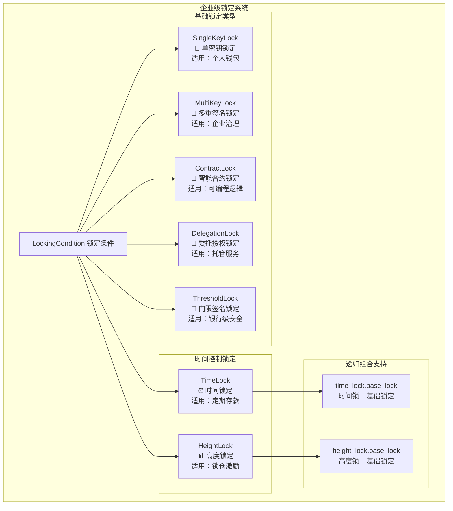
```mermaid
graph TB
    subgraph "企业级锁定系统"
        LOCKING_CONDITION["LockingCondition 锁定条件"]
        
        subgraph "基础锁定类型"
            SINGLE_KEY["SingleKeyLock<br/>🔑 单密钥锁定<br/>适用：个人钱包"]
            MULTI_KEY["MultiKeyLock<br/>🔐 多重签名锁定<br/>适用：企业治理"]
            CONTRACT_LOCK["ContractLock<br/>📜 智能合约锁定<br/>适用：可编程逻辑"]
            DELEGATION_LOCK["DelegationLock<br/>👥 委托授权锁定<br/>适用：托管服务"]
            THRESHOLD_LOCK["ThresholdLock<br/>🏦 门限签名锁定<br/>适用：银行级安全"]
        end
        
        subgraph "时间控制锁定"
            TIME_LOCK["TimeLock<br/>⏰ 时间锁定<br/>适用：定期存款"]
            HEIGHT_LOCK["HeightLock<br/>📊 高度锁定<br/>适用：锁仓激励"]
        end
        
        LOCKING_CONDITION --> SINGLE_KEY
        LOCKING_CONDITION --> MULTI_KEY
        LOCKING_CONDITION --> CONTRACT_LOCK
        LOCKING_CONDITION --> DELEGATION_LOCK
        LOCKING_CONDITION --> THRESHOLD_LOCK
        LOCKING_CONDITION --> TIME_LOCK
        LOCKING_CONDITION --> HEIGHT_LOCK
        
        subgraph "递归组合支持"
            TIME_BASE["time_lock.base_lock<br/>时间锁 + 基础锁定"]
            HEIGHT_BASE["height_lock.base_lock<br/>高度锁 + 基础锁定"]
        end
        
        TIME_LOCK --> TIME_BASE
        HEIGHT_LOCK --> HEIGHT_BASE
    end
```

### 锁定与解锁对应关系
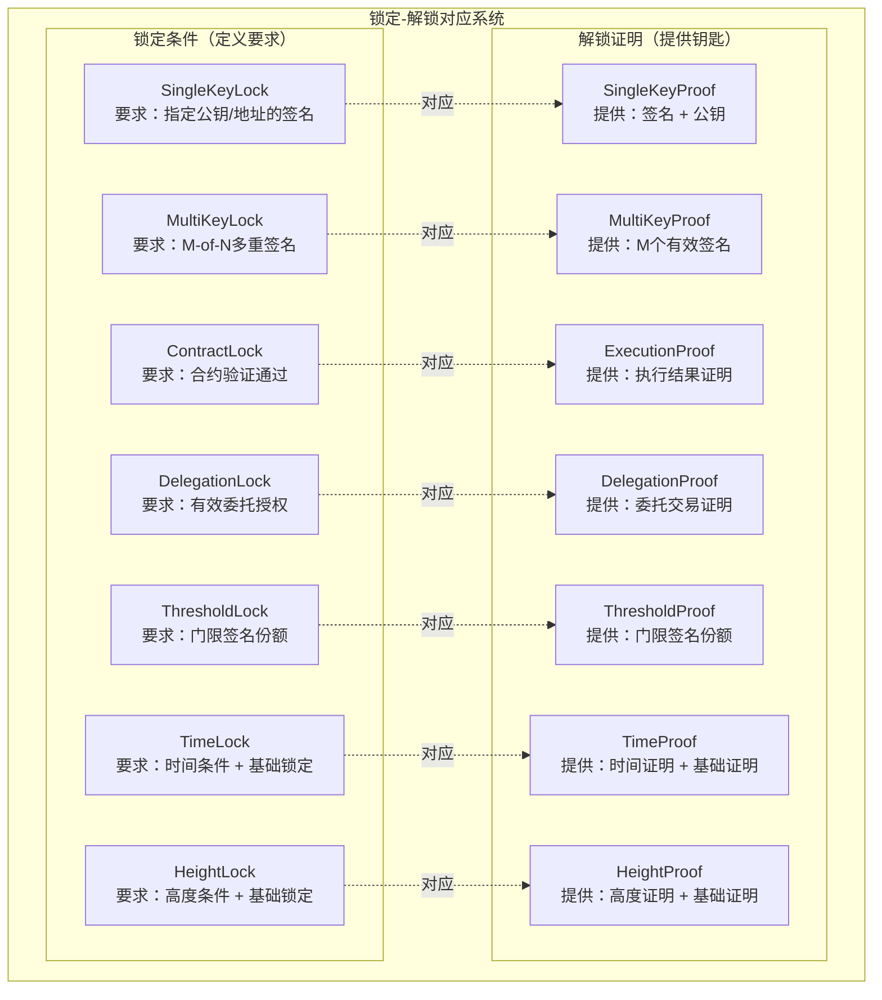
```mermaid
graph TD
    subgraph "锁定-解锁对应系统"
        subgraph "锁定条件（定义要求）"
            L_SINGLE["SingleKeyLock<br/>要求：指定公钥/地址的签名"]
            L_MULTI["MultiKeyLock<br/>要求：M-of-N多重签名"]
            L_CONTRACT["ContractLock<br/>要求：合约验证通过"]
            L_DELEGATION["DelegationLock<br/>要求：有效委托授权"]
            L_THRESHOLD["ThresholdLock<br/>要求：门限签名份额"]
            L_TIME["TimeLock<br/>要求：时间条件 + 基础锁定"]
            L_HEIGHT["HeightLock<br/>要求：高度条件 + 基础锁定"]
        end
        
        subgraph "解锁证明（提供钥匙）"
            P_SINGLE["SingleKeyProof<br/>提供：签名 + 公钥"]
            P_MULTI["MultiKeyProof<br/>提供：M个有效签名"]
            P_CONTRACT["ExecutionProof<br/>提供：执行结果证明"]
            P_DELEGATION["DelegationProof<br/>提供：委托交易证明"]
            P_THRESHOLD["ThresholdProof<br/>提供：门限签名份额"]
            P_TIME["TimeProof<br/>提供：时间证明 + 基础证明"]
            P_HEIGHT["HeightProof<br/>提供：高度证明 + 基础证明"]
        end
        
        L_SINGLE -.->|对应| P_SINGLE
        L_MULTI -.->|对应| P_MULTI
        L_CONTRACT -.->|对应| P_CONTRACT
        L_DELEGATION -.->|对应| P_DELEGATION
        L_THRESHOLD -.->|对应| P_THRESHOLD
        L_TIME -.->|对应| P_TIME
        L_HEIGHT -.->|对应| P_HEIGHT
    end
```

---

## 🔐 7种锁定/解锁模式详细验证流程

### 1. SingleKeyProof（单密钥解锁）

**适用场景**：个人钱包、简单转账、NFT转移

**锁定条件**：
```protobuf
message SingleKeyLock {
  oneof key_requirement {
    bytes required_address_hash = 1;  // 要求地址哈希匹配
    bytes required_public_key = 2;   // 要求公钥匹配
  }
  SignatureAlgorithm required_algorithm = 3;  // 要求的签名算法
  SignatureHashType sighash_type = 4;        // 签名哈希类型
}
```

**解锁证明**：
```protobuf
message SingleKeyProof {
  SignatureData signature = 1;      // 数字签名
  PublicKey public_key = 2;          // 对应公钥
  SignatureAlgorithm algorithm = 3;   // 签名算法
  SignatureHashType sighash_type = 4; // 签名哈希类型
}
```

**验证流程**：
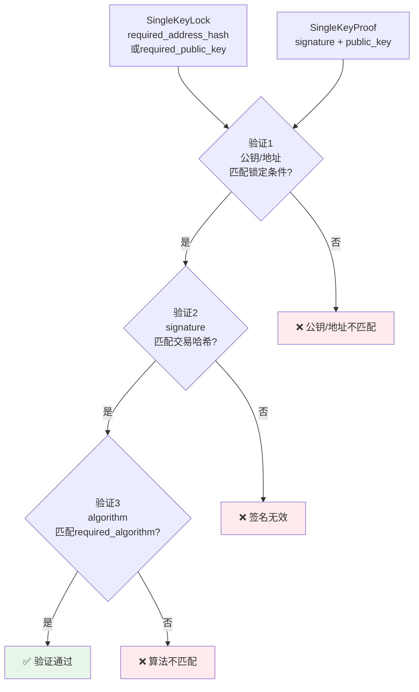
```mermaid
graph TB
    Lock[SingleKeyLock<br/>required_address_hash<br/>或required_public_key] --> Verify1{验证1<br/>公钥/地址<br/>匹配锁定条件?}
    Proof[SingleKeyProof<br/>signature + public_key] --> Verify1
    Verify1 -->|是| Verify2{验证2<br/>signature<br/>匹配交易哈希?}
    Verify2 -->|是| Verify3{验证3<br/>algorithm<br/>匹配required_algorithm?}
    Verify3 -->|是| Success[✅ 验证通过]
    Verify1 -->|否| Fail1[❌ 公钥/地址不匹配]
    Verify2 -->|否| Fail2[❌ 签名无效]
    Verify3 -->|否| Fail3[❌ 算法不匹配]
    
    style Success fill:#e8f5e9
    style Fail1 fill:#ffebee
    style Fail2 fill:#ffebee
    style Fail3 fill:#ffebee
```

**验证步骤**：
1. 验证公钥/地址是否匹配锁定条件
2. 验证签名是否匹配交易哈希
3. 验证签名算法是否匹配要求

---

### 2. MultiKeyProof（多重签名解锁）

**适用场景**：企业治理、多签钱包、联合账户

**锁定条件**：
```protobuf
message MultiKeyLock {
  uint32 required_signatures = 1;    // 要求M个签名
  repeated bytes authorized_keys = 2; // N个授权公钥
  bool require_ordered_signatures = 3; // 是否要求有序签名
}
```

**解锁证明**：
```protobuf
message MultiKeyProof {
  repeated SignatureEntry signatures = 1;
  
  message SignatureEntry {
    uint32 key_index = 1;           // 对应authorized_keys的索引
    SignatureData signature = 2;    // 签名数据
    SignatureAlgorithm algorithm = 3; // 签名算法
    SignatureHashType sighash_type = 4; // 签名哈希类型
  }
}
```

**验证流程**：
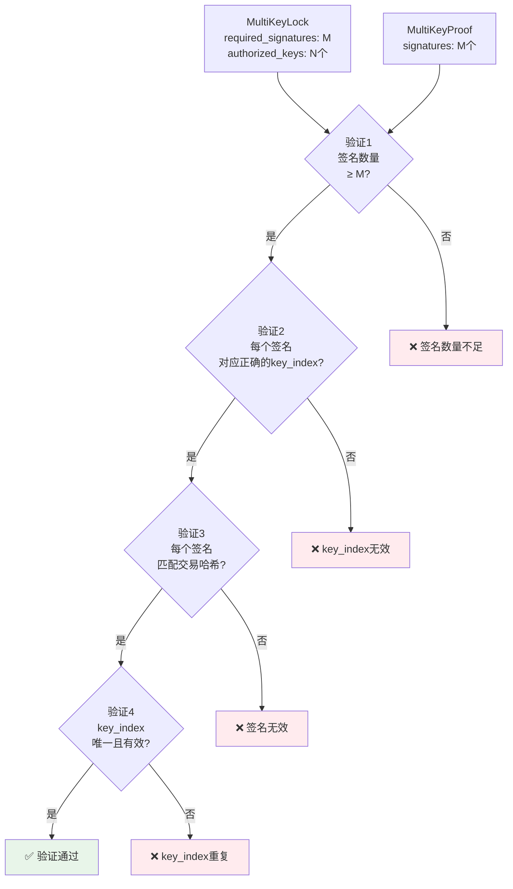
```mermaid
graph TB
    Lock[MultiKeyLock<br/>required_signatures: M<br/>authorized_keys: N个] --> Verify1{验证1<br/>签名数量<br/>≥ M?}
    Proof[MultiKeyProof<br/>signatures: M个] --> Verify1
    Verify1 -->|是| Verify2{验证2<br/>每个签名<br/>对应正确的key_index?}
    Verify2 -->|是| Verify3{验证3<br/>每个签名<br/>匹配交易哈希?}
    Verify3 -->|是| Verify4{验证4<br/>key_index<br/>唯一且有效?}
    Verify4 -->|是| Success[✅ 验证通过]
    Verify1 -->|否| Fail1[❌ 签名数量不足]
    Verify2 -->|否| Fail2[❌ key_index无效]
    Verify3 -->|否| Fail3[❌ 签名无效]
    Verify4 -->|否| Fail4[❌ key_index重复]
    
    style Success fill:#e8f5e9
    style Fail1 fill:#ffebee
    style Fail2 fill:#ffebee
    style Fail3 fill:#ffebee
    style Fail4 fill:#ffebee
```

**验证步骤**：
1. 验证签名数量是否 ≥ M
2. 验证每个签名的 key_index 是否对应正确的 authorized_keys
3. 验证每个签名是否匹配交易哈希
4. 验证 key_index 的唯一性（防止重复使用）

---

### 3. ExecutionProof（ISPC执行解锁）

**适用场景**：智能合约调用、AI模型推理、可编程资源访问

**锁定条件**：
```protobuf
message ContractLock {
  bytes contract_address = 1;              // 合约地址（现为resource_address）
  repeated bytes allowed_callers = 2;       // 允许的调用者地址列表
  uint64 max_execution_time_ms = 3;        // 最大执行时间（毫秒）
  optional uint64 deadline_duration_seconds = 4; // 调用截止时间（相对秒数）
}
```

**解锁证明**：
```protobuf
message ExecutionProof {
  bytes execution_result_hash = 1;         // 执行结果哈希（32字节SHA-256）
  bytes state_transition_proof = 2;        // 状态转换证明（Merkle证明）
  uint64 execution_time_ms = 3;           // 实际执行时间（毫秒）
  ExecutionContext context = 4;           // 执行上下文（通用）
  
  message ExecutionContext {
    IdentityProof caller_identity = 10;    // ✅ 调用者身份证明（必需）
    bytes resource_address = 14;           // ✅ 资源地址（通用：合约/模型/其他，20字节）
    ExecutionType execution_type = 15;     // ✅ 执行类型（通用）
    bytes input_data_hash = 1;             // ✅ 输入数据哈希（32字节SHA-256，保护隐私）
    bytes output_data_hash = 2;            // ✅ 输出数据哈希（32字节SHA-256，保护隐私）
    map<string, bytes> metadata = 40;      // ✅ 扩展元数据（通用，不包含敏感原始数据）
  }
}
```

**验证流程**：
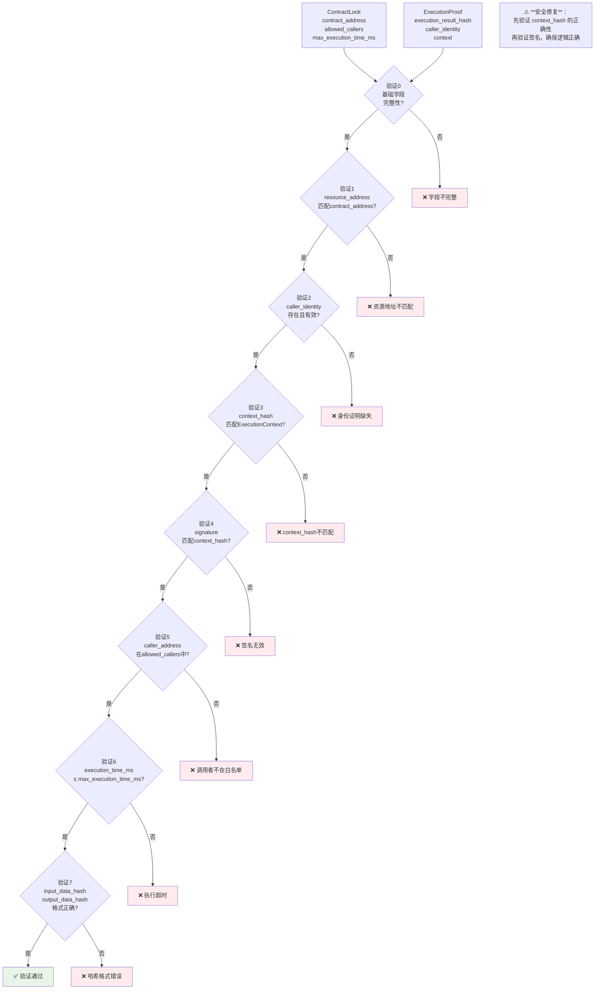
```mermaid
graph TB
    Lock[ContractLock<br/>contract_address<br/>allowed_callers<br/>max_execution_time_ms] --> Verify0{验证0<br/>基础字段<br/>完整性?}
    Proof[ExecutionProof<br/>execution_result_hash<br/>caller_identity<br/>context] --> Verify0
    Verify0 -->|是| Verify1{验证1<br/>resource_address<br/>匹配contract_address?}
    Verify1 -->|是| Verify2{验证2<br/>caller_identity<br/>存在且有效?}
    Verify2 -->|是| Verify3{验证3<br/>context_hash<br/>匹配ExecutionContext?}
    Verify3 -->|是| Verify4{验证4<br/>signature<br/>匹配context_hash?}
    Verify4 -->|是| Verify5{验证5<br/>caller_address<br/>在allowed_callers中?}
    Verify5 -->|是| Verify6{验证6<br/>execution_time_ms<br/>≤ max_execution_time_ms?}
    Verify6 -->|是| Verify7{验证7<br/>input_data_hash<br/>output_data_hash<br/>格式正确?}
    Verify7 -->|是| Success[✅ 验证通过]
    Verify0 -->|否| Fail0[❌ 字段不完整]
    Verify1 -->|否| Fail1[❌ 资源地址不匹配]
    Verify2 -->|否| Fail2[❌ 身份证明缺失]
    Verify3 -->|否| Fail3[❌ context_hash不匹配]
    Verify4 -->|否| Fail4[❌ 签名无效]
    Verify5 -->|否| Fail5[❌ 调用者不在白名单]
    Verify6 -->|否| Fail6[❌ 执行超时]
    Verify7 -->|否| Fail7[❌ 哈希格式错误]
    
    style Success fill:#e8f5e9
    style Fail0 fill:#ffebee
    style Fail1 fill:#ffebee
    style Fail2 fill:#ffebee
    style Fail3 fill:#ffebee
    style Fail4 fill:#ffebee
    style Fail5 fill:#ffebee
    style Fail6 fill:#ffebee
    style Fail7 fill:#ffebee
    
    Note[⚠️ **安全修复**：<br/>先验证 context_hash 的正确性<br/>再验证签名，确保逻辑正确]
```

**IdentityProof 详细验证流程**：
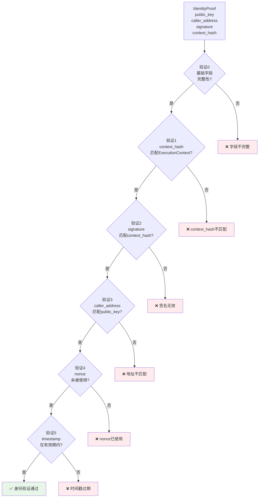
```mermaid
graph TB
    Identity[IdentityProof<br/>public_key<br/>caller_address<br/>signature<br/>context_hash] --> Verify0{验证0<br/>基础字段<br/>完整性?}
    Verify0 -->|是| Verify1{验证1<br/>context_hash<br/>匹配ExecutionContext?}
    Verify1 -->|是| Verify2{验证2<br/>signature<br/>匹配context_hash?}
    Verify2 -->|是| Verify3{验证3<br/>caller_address<br/>匹配public_key?}
    Verify3 -->|是| Verify4{验证4<br/>nonce<br/>未被使用?}
    Verify4 -->|是| Verify5{验证5<br/>timestamp<br/>在有效期内?}
    Verify5 -->|是| Success[✅ 身份验证通过]
    Verify0 -->|否| Fail0[❌ 字段不完整]
    Verify1 -->|否| Fail1[❌ context_hash不匹配]
    Verify2 -->|否| Fail2[❌ 签名无效]
    Verify3 -->|否| Fail3[❌ 地址不匹配]
    Verify4 -->|否| Fail4[❌ nonce已使用]
    Verify5 -->|否| Fail5[❌ 时间戳过期]
    
    style Success fill:#e8f5e9
    style Fail0 fill:#ffebee
    style Fail1 fill:#ffebee
    style Fail2 fill:#ffebee
    style Fail3 fill:#ffebee
    style Fail4 fill:#ffebee
    style Fail5 fill:#ffebee
```

**验证步骤**：
1. 验证基础字段完整性（public_key、caller_address、signature、context_hash、nonce）
2. ⚠️ **安全修复**：先验证 context_hash 是否匹配实际的 ExecutionContext
3. 验证 signature 是否匹配 context_hash（使用 public_key）
4. 验证 caller_address 是否从 public_key 推导
5. 验证 caller_address 是否在 allowed_callers 中（如果设置）
6. 验证 execution_time_ms 是否 ≤ max_execution_time_ms
7. 验证 input_data_hash 和 output_data_hash 格式（32字节）

**隐私保护设计**：
- ✅ 输入/输出数据使用哈希（保护隐私）
- ✅ 原始数据不在链上（避免泄露）
- ✅ 通过哈希验证数据完整性
- ✅ ZK证明验证执行正确性（不需要原始数据）

---

### 4. DelegationProof（委托授权解锁）

**适用场景**：托管服务、代理交易、临时授权

**锁定条件**：
```protobuf
message DelegationLock {
  bytes original_owner = 1;              // 原始所有者地址
  repeated bytes allowed_delegates = 2;   // 允许的被委托方地址列表
  optional uint64 expiry_duration_blocks = 3; // 委托过期区块数
}
```

**解锁证明**：
```protobuf
message DelegationProof {
  bytes delegation_transaction_id = 1;   // 委托交易ID
  uint32 delegation_output_index = 2;    // 委托输出索引
  SignatureData delegate_signature = 3;  // 被委托方签名
  string operation_type = 4;             // 操作类型
  uint64 value_amount = 5;               // 价值金额
  bytes delegate_address = 6;            // 被委托方地址
}
```

**验证流程**：
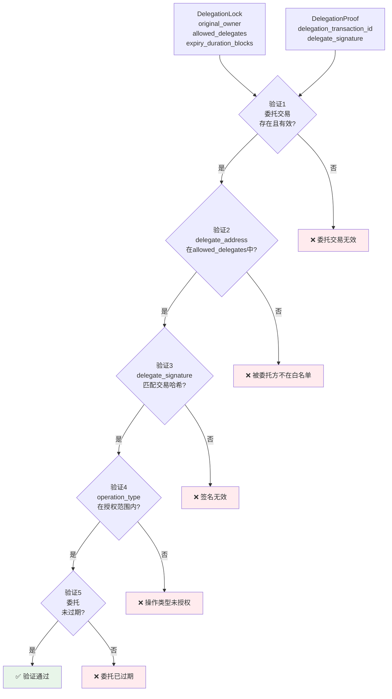
```mermaid
graph TB
    Lock[DelegationLock<br/>original_owner<br/>allowed_delegates<br/>expiry_duration_blocks] --> Verify1{验证1<br/>委托交易<br/>存在且有效?}
    Proof[DelegationProof<br/>delegation_transaction_id<br/>delegate_signature] --> Verify1
    Verify1 -->|是| Verify2{验证2<br/>delegate_address<br/>在allowed_delegates中?}
    Verify2 -->|是| Verify3{验证3<br/>delegate_signature<br/>匹配交易哈希?}
    Verify3 -->|是| Verify4{验证4<br/>operation_type<br/>在授权范围内?}
    Verify4 -->|是| Verify5{验证5<br/>委托<br/>未过期?}
    Verify5 -->|是| Success[✅ 验证通过]
    Verify1 -->|否| Fail1[❌ 委托交易无效]
    Verify2 -->|否| Fail2[❌ 被委托方不在白名单]
    Verify3 -->|否| Fail3[❌ 签名无效]
    Verify4 -->|否| Fail4[❌ 操作类型未授权]
    Verify5 -->|否| Fail5[❌ 委托已过期]
    
    style Success fill:#e8f5e9
    style Fail1 fill:#ffebee
    style Fail2 fill:#ffebee
    style Fail3 fill:#ffebee
    style Fail4 fill:#ffebee
    style Fail5 fill:#ffebee
```

**验证步骤**：
1. 验证委托交易是否存在且有效（查询链上交易）
2. 验证 delegate_address 是否在 allowed_delegates 中
3. 验证 delegate_signature 是否匹配当前交易哈希
4. 验证 operation_type 是否在授权范围内
5. 验证委托是否未过期（如果设置了 expiry_duration_blocks）

---

### 5. ThresholdProof（门限签名解锁）

**适用场景**：银行级安全、央行数字货币、高安全要求场景

**锁定条件**：
```protobuf
message ThresholdLock {
  uint32 threshold = 1;                  // 门限值M
  uint32 total_parties = 2;              // 总参与方数N
  string signature_scheme = 3;           // 签名方案
}
```

**解锁证明**：
```protobuf
message ThresholdProof {
  repeated ThresholdSignatureShare shares = 1; // M个签名份额
  bytes combined_signature = 2;          // 组合签名
  string signature_scheme = 3;         // 签名方案
  
  message ThresholdSignatureShare {
    uint32 party_id = 1;                // 参与方ID
    bytes signature_share = 2;          // 签名份额
    bytes verification_key = 3;         // 验证密钥
  }
}
```

**验证流程**：
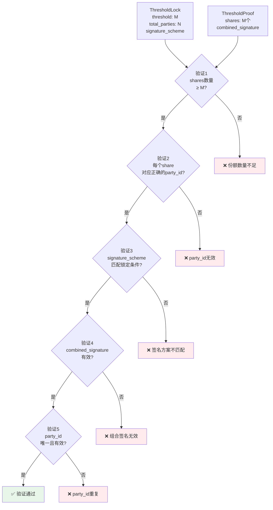
```mermaid
graph TB
    Lock[ThresholdLock<br/>threshold: M<br/>total_parties: N<br/>signature_scheme] --> Verify1{验证1<br/>shares数量<br/>≥ M?}
    Proof[ThresholdProof<br/>shares: M个<br/>combined_signature] --> Verify1
    Verify1 -->|是| Verify2{验证2<br/>每个share<br/>对应正确的party_id?}
    Verify2 -->|是| Verify3{验证3<br/>signature_scheme<br/>匹配锁定条件?}
    Verify3 -->|是| Verify4{验证4<br/>combined_signature<br/>有效?}
    Verify4 -->|是| Verify5{验证5<br/>party_id<br/>唯一且有效?}
    Verify5 -->|是| Success[✅ 验证通过]
    Verify1 -->|否| Fail1[❌ 份额数量不足]
    Verify2 -->|否| Fail2[❌ party_id无效]
    Verify3 -->|否| Fail3[❌ 签名方案不匹配]
    Verify4 -->|否| Fail4[❌ 组合签名无效]
    Verify5 -->|否| Fail5[❌ party_id重复]
    
    style Success fill:#e8f5e9
    style Fail1 fill:#ffebee
    style Fail2 fill:#ffebee
    style Fail3 fill:#ffebee
    style Fail4 fill:#ffebee
    style Fail5 fill:#ffebee
```

**验证步骤**：
1. 验证签名份额数量是否 ≥ M
2. 验证每个 share 的 party_id 是否对应正确的参与方
3. 验证 signature_scheme 是否匹配锁定条件
4. 验证 combined_signature 是否有效
5. 验证 party_id 的唯一性（防止重复使用）

---

### 6. TimeProof（时间锁解锁）

**适用场景**：定期存款、时间锁定资产、定时释放

**锁定条件**：
```protobuf
message TimeLock {
  uint64 unlock_timestamp = 1;          // 解锁时间戳（Unix秒）
  LockingCondition base_lock = 2;       // 基础锁定条件（递归）
  TimeSource time_source = 3;           // 时间源
}
```

**解锁证明**：
```protobuf
message TimeProof {
  uint64 current_timestamp = 1;         // 当前时间戳
  bytes timestamp_proof = 2;            // 时间戳证明
  UnlockingProof base_proof = 3;        // ✅ 递归包含基础证明
  TimeSource time_source = 4;           // 时间源
}
```

**验证流程**：
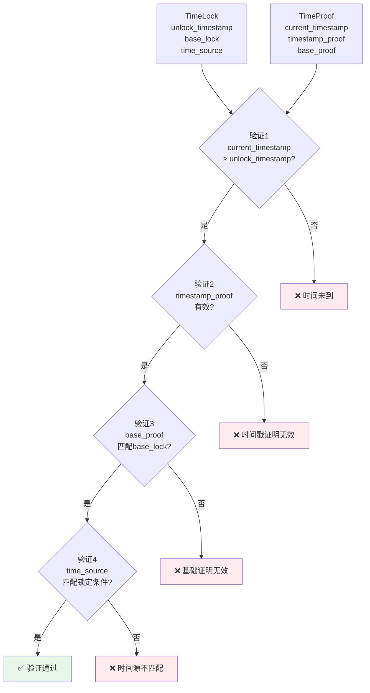
```mermaid
graph TB
    Lock[TimeLock<br/>unlock_timestamp<br/>base_lock<br/>time_source] --> Verify1{验证1<br/>current_timestamp<br/>≥ unlock_timestamp?}
    Proof[TimeProof<br/>current_timestamp<br/>timestamp_proof<br/>base_proof] --> Verify1
    Verify1 -->|是| Verify2{验证2<br/>timestamp_proof<br/>有效?}
    Verify2 -->|是| Verify3{验证3<br/>base_proof<br/>匹配base_lock?}
    Verify3 -->|是| Verify4{验证4<br/>time_source<br/>匹配锁定条件?}
    Verify4 -->|是| Success[✅ 验证通过]
    Verify1 -->|否| Fail1[❌ 时间未到]
    Verify2 -->|否| Fail2[❌ 时间戳证明无效]
    Verify3 -->|否| Fail3[❌ 基础证明无效]
    Verify4 -->|否| Fail4[❌ 时间源不匹配]
    
    style Success fill:#e8f5e9
    style Fail1 fill:#ffebee
    style Fail2 fill:#ffebee
    style Fail3 fill:#ffebee
    style Fail4 fill:#ffebee
```

**验证步骤**：
1. 验证 current_timestamp 是否 ≥ unlock_timestamp
2. 验证 timestamp_proof 是否有效（根据 time_source）
3. 验证 base_proof 是否匹配 base_lock（递归验证）
4. 验证 time_source 是否匹配锁定条件

**递归验证说明**：
- TimeLock 可以包含任何基础锁定条件（SingleKeyLock、MultiKeyLock等）
- base_proof 必须匹配 base_lock 的类型和参数
- 验证时先验证时间条件，再验证基础锁定条件

---

### 7. HeightProof（高度锁解锁）

**适用场景**：锁仓激励、区块高度控制、阶段性释放

**锁定条件**：
```protobuf
message HeightLock {
  uint64 unlock_height = 1;             // 解锁区块高度
  LockingCondition base_lock = 2;       // 基础锁定条件（递归）
  uint32 confirmation_blocks = 3;       // 确认区块数
}
```

**解锁证明**：
```protobuf
message HeightProof {
  uint64 current_height = 1;           // 当前区块高度
  bytes block_header_proof = 2;        // 区块头证明
  UnlockingProof base_proof = 3;        // ✅ 递归包含基础证明
  uint32 confirmation_blocks = 4;       // 确认区块数
}
```

**验证流程**：
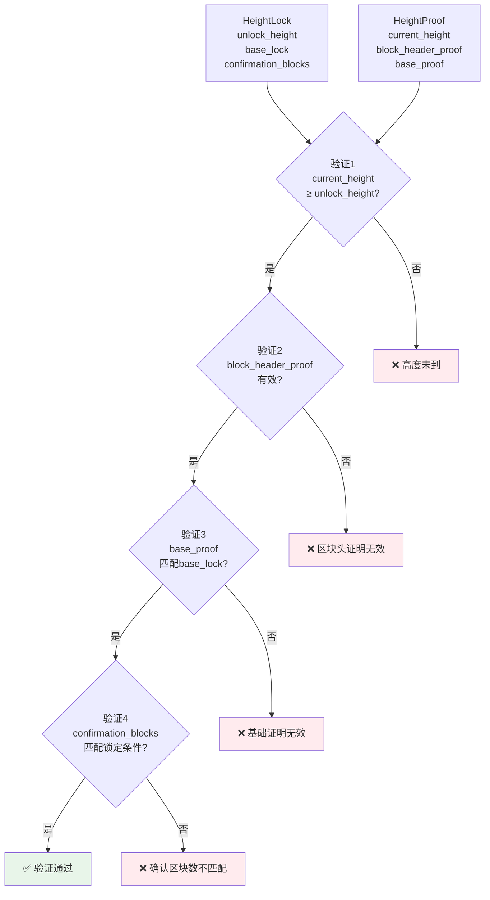
```mermaid
graph TB
    Lock[HeightLock<br/>unlock_height<br/>base_lock<br/>confirmation_blocks] --> Verify1{验证1<br/>current_height<br/>≥ unlock_height?}
    Proof[HeightProof<br/>current_height<br/>block_header_proof<br/>base_proof] --> Verify1
    Verify1 -->|是| Verify2{验证2<br/>block_header_proof<br/>有效?}
    Verify2 -->|是| Verify3{验证3<br/>base_proof<br/>匹配base_lock?}
    Verify3 -->|是| Verify4{验证4<br/>confirmation_blocks<br/>匹配锁定条件?}
    Verify4 -->|是| Success[✅ 验证通过]
    Verify1 -->|否| Fail1[❌ 高度未到]
    Verify2 -->|否| Fail2[❌ 区块头证明无效]
    Verify3 -->|否| Fail3[❌ 基础证明无效]
    Verify4 -->|否| Fail4[❌ 确认区块数不匹配]
    
    style Success fill:#e8f5e9
    style Fail1 fill:#ffebee
    style Fail2 fill:#ffebee
    style Fail3 fill:#ffebee
    style Fail4 fill:#ffebee
```

**验证步骤**：
1. 验证 current_height 是否 ≥ unlock_height
2. 验证 block_header_proof 是否有效（Merkle证明）
3. 验证 base_proof 是否匹配 base_lock（递归验证）
4. 验证 confirmation_blocks 是否匹配锁定条件

**递归验证说明**：
- HeightLock 可以包含任何基础锁定条件（SingleKeyLock、MultiKeyLock等）
- base_proof 必须匹配 base_lock 的类型和参数
- 验证时先验证高度条件，再验证基础锁定条件

---

### 验证流程总结

**通用验证原则**：
1. ✅ **先验证基础条件**：时间/高度条件必须先满足
2. ✅ **再验证权限证明**：基础锁定条件的解锁证明必须有效
3. ✅ **递归验证支持**：TimeLock 和 HeightLock 支持递归组合
4. ✅ **密码学保证**：所有验证基于密码学，不可伪造

**验证顺序**：
```
1. 结构验证（字段完整性）
   ↓
2. 条件验证（时间/高度等）
   ↓
3. 权限验证（签名/证明等）
   ↓
4. 业务验证（白名单/约束等）
   ↓
5. ✅ 验证通过
```

---

## 企业级使用场景

### 典型交易场景矩阵
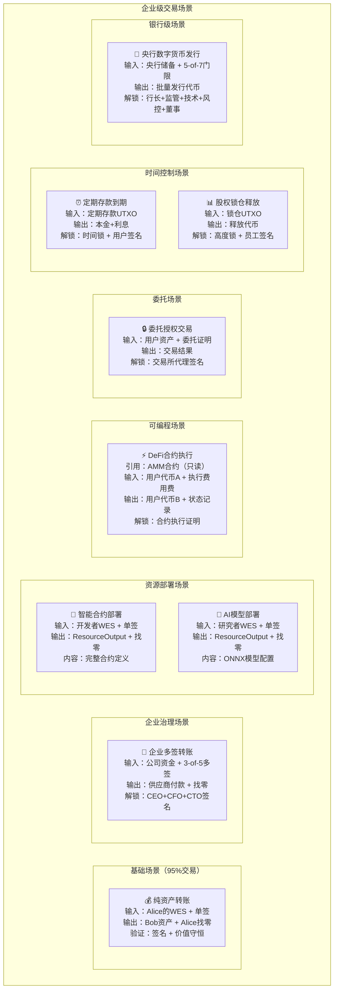
```mermaid
graph TB
    subgraph "企业级交易场景"
        subgraph "基础场景（95%交易）"
            BASIC_TRANSFER["💰 纯资产转账<br/>输入：Alice的WES + 单签<br/>输出：Bob资产 + Alice找零<br/>验证：签名 + 价值守恒"]
        end
        
        subgraph "企业治理场景"
            MULTI_SIG["🏢 企业多签转账<br/>输入：公司资金 + 3-of-5多签<br/>输出：供应商付款 + 找零<br/>解锁：CEO+CFO+CTO签名"]
        end
        
        subgraph "资源部署场景"
            CONTRACT_DEPLOY["🚀 智能合约部署<br/>输入：开发者WES + 单签<br/>输出：ResourceOutput + 找零<br/>内容：完整合约定义"]
            
            AI_DEPLOY["🧠 AI模型部署<br/>输入：研究者WES + 单签<br/>输出：ResourceOutput + 找零<br/>内容：ONNX模型配置"]
        end
        
        subgraph "可编程场景"
            DEFI_SWAP["⚡ DeFi合约执行<br/>引用：AMM合约（只读）<br/>输入：用户代币A + 执行费用费<br/>输出：用户代币B + 状态记录<br/>解锁：合约执行证明"]
        end
        
        subgraph "委托场景"
            CUSTODIAL["🔒 委托授权交易<br/>输入：用户资产 + 委托证明<br/>输出：交易结果<br/>解锁：交易所代理签名"]
        end
        
        subgraph "时间控制场景"
            TIME_DEPOSIT["⏰ 定期存款到期<br/>输入：定期存款UTXO<br/>输出：本金+利息<br/>解锁：时间锁 + 用户签名"]
            
            VESTING["📊 股权锁仓释放<br/>输入：锁仓UTXO<br/>输出：释放代币<br/>解锁：高度锁 + 员工签名"]
        end
        
        subgraph "银行级场景"
            CBDC_ISSUE["🏦 央行数字货币发行<br/>输入：央行储备 + 5-of-7门限<br/>输出：批量发行代币<br/>解锁：行长+监管+技术+风控+董事"]
        end
    end
```

### Transaction-UTXO协同工作机制
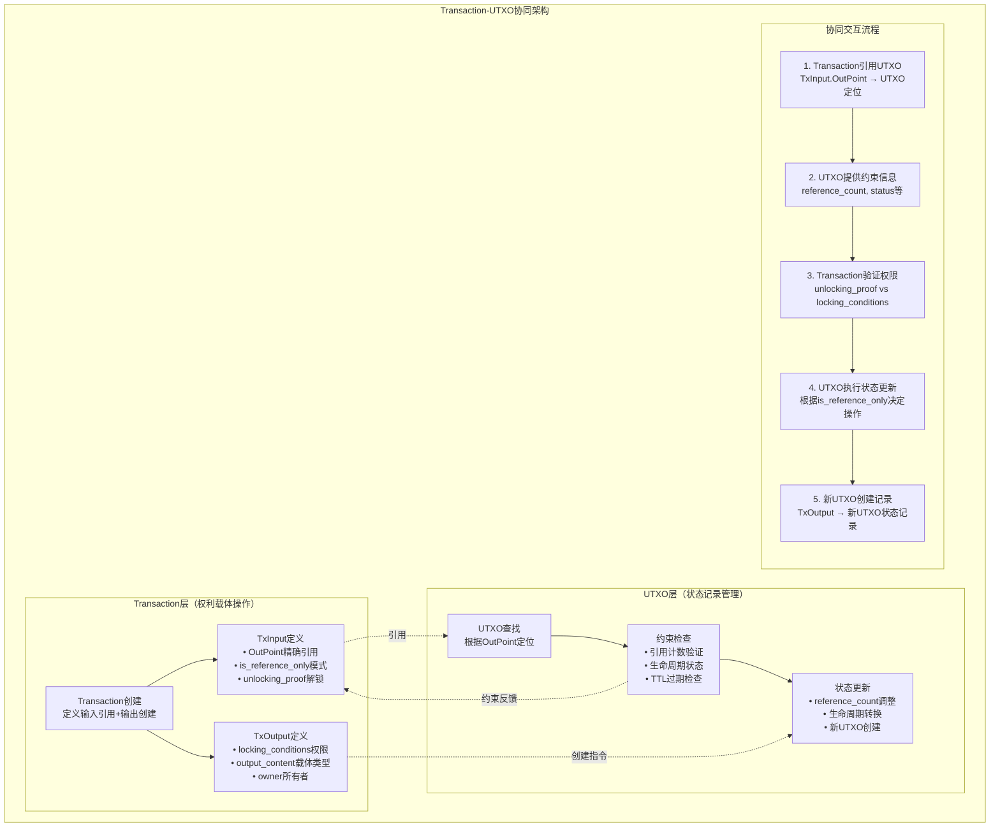
```mermaid
graph TB
    subgraph "Transaction-UTXO协同架构"
        subgraph "Transaction层（权利载体操作）"
            TX_CREATION["Transaction创建<br/>定义输入引用+输出创建"]
            TX_INPUT_DEF["TxInput定义<br/>• OutPoint精确引用<br/>• is_reference_only模式<br/>• unlocking_proof解锁"]
            TX_OUTPUT_DEF["TxOutput定义<br/>• locking_conditions权限<br/>• output_content载体类型<br/>• owner所有者"]
            
            TX_CREATION --> TX_INPUT_DEF
            TX_CREATION --> TX_OUTPUT_DEF
        end
        
        subgraph "UTXO层（状态记录管理）"
            UTXO_LOOKUP["UTXO查找<br/>根据OutPoint定位"]
            UTXO_CONSTRAINT["约束检查<br/>• 引用计数验证<br/>• 生命周期状态<br/>• TTL过期检查"]
            UTXO_UPDATE["状态更新<br/>• reference_count调整<br/>• 生命周期转换<br/>• 新UTXO创建"]
            
            UTXO_LOOKUP --> UTXO_CONSTRAINT
            UTXO_CONSTRAINT --> UTXO_UPDATE
        end
        
        subgraph "协同交互流程"
            STEP1["1. Transaction引用UTXO<br/>TxInput.OutPoint → UTXO定位"]
            STEP2["2. UTXO提供约束信息<br/>reference_count, status等"]
            STEP3["3. Transaction验证权限<br/>unlocking_proof vs locking_conditions"]
            STEP4["4. UTXO执行状态更新<br/>根据is_reference_only决定操作"]
            STEP5["5. 新UTXO创建记录<br/>TxOutput → 新UTXO状态记录"]
        end
        
        TX_INPUT_DEF -.->|"引用"| UTXO_LOOKUP
        UTXO_CONSTRAINT -.->|"约束反馈"| TX_INPUT_DEF
        TX_OUTPUT_DEF -.->|"创建指令"| UTXO_UPDATE
        
        STEP1 --> STEP2
        STEP2 --> STEP3
        STEP3 --> STEP4
        STEP4 --> STEP5
    end
```

### ResourceUTXO访问控制与Transaction锁定系统集成
```mermaid
graph TB
    subgraph "ResourceUTXO访问控制完整流程"
        subgraph "Transaction层锁定定义"
            RESOURCE_CREATE["ResourceOutput创建<br/>部署合约/AI模型"]
            LOCKING_SETUP["locking_conditions设置"]
            
            subgraph "7种锁定条件用于ResourceUTXO"
                SINGLE_LOCK["SingleKeyLock<br/>私有资源（仅所有者）"]
                MULTI_LOCK["MultiKeyLock<br/>团队协作（白名单）"]
                CONTRACT_LOCK["ContractLock<br/>付费使用（智能合约）"]
                DELEGATION_LOCK["DelegationLock<br/>临时授权（代理访问）"]
                THRESHOLD_LOCK["ThresholdLock<br/>高安全资源（企业级）"]
                TIME_LOCK["TimeLock<br/>定时发布资源"]
                HEIGHT_LOCK["HeightLock<br/>阶段性开放资源"]
            end
            
            RESOURCE_CREATE --> LOCKING_SETUP
            LOCKING_SETUP --> SINGLE_LOCK
            LOCKING_SETUP --> MULTI_LOCK
            LOCKING_SETUP --> CONTRACT_LOCK
            LOCKING_SETUP --> DELEGATION_LOCK
            LOCKING_SETUP --> THRESHOLD_LOCK
            LOCKING_SETUP --> TIME_LOCK
            LOCKING_SETUP --> HEIGHT_LOCK
        end
        
        subgraph "UTXO层状态管理"
            UTXO_INHERIT["UTXO继承锁定条件<br/>cached_output保存完整定义"]
            REF_COUNT_CONTROL["引用计数控制<br/>ResourceUTXOConstraints"]
            CONCURRENT_LIMIT["并发限制检查<br/>max_concurrent_references"]
            
            UTXO_INHERIT --> REF_COUNT_CONTROL
            REF_COUNT_CONTROL --> CONCURRENT_LIMIT
        end
        
        subgraph "Transaction层权限验证"
            ACCESS_REQUEST["用户访问请求<br/>TxInput引用ResourceUTXO"]
            UNLOCK_PROOF["提供unlocking_proof<br/>对应锁定条件的解锁证明"]
            PERMISSION_VERIFY["权限验证<br/>proof ↔ conditions匹配"]
            
            ACCESS_REQUEST --> UNLOCK_PROOF
            UNLOCK_PROOF --> PERMISSION_VERIFY
        end
        
        LOCKING_SETUP -.->|"继承"| UTXO_INHERIT
        UTXO_INHERIT -.->|"条件提供"| PERMISSION_VERIFY
        REF_COUNT_CONTROL -.->|"约束检查"| ACCESS_REQUEST
        PERMISSION_VERIFY -.->|"验证结果"| REF_COUNT_CONTROL
    end
```

### 权利载体生命周期
```mermaid
sequenceDiagram
    participant User as 用户
    participant TxEngine as 交易引擎
    participant UTXOSet as UTXO集合
    participant Validator as 验证器
    participant Storage as 存储层
    
    Note over User, Storage: 权利载体创建阶段
    User->>TxEngine: 1. 提交创建交易
    TxEngine->>Validator: 2. 验证交易合法性
    Validator->>TxEngine: 3. 验证通过
    TxEngine->>UTXOSet: 4. 创建新UTXO
    UTXOSet->>Storage: 5. 持久化存储
    Storage-->>User: 6. 权利载体创建成功
    
    Note over User, Storage: 权利载体引用阶段
    User->>TxEngine: 7. 提交引用交易(is_reference_only=true)
    TxEngine->>UTXOSet: 8. 检查UTXO存在性
    UTXOSet-->>TxEngine: 9. UTXO有效
    TxEngine->>Validator: 10. 验证解锁证明
    Validator-->>TxEngine: 11. 权限验证通过
    TxEngine-->>User: 12. 引用操作成功（UTXO保持存在）
    
    Note over User, Storage: 权利载体消费阶段
    User->>TxEngine: 13. 提交消费交易(is_reference_only=false)
    TxEngine->>Validator: 14. 验证权限和价值守恒
    Validator->>TxEngine: 15. 验证通过
    TxEngine->>UTXOSet: 16. 移除消费的UTXO
    TxEngine->>UTXOSet: 17. 创建新的输出UTXO
    UTXOSet->>Storage: 18. 更新存储状态
    Storage-->>User: 19. 权利转换完成
```

## 零知识状态证明

### StateOutput设计理念
```mermaid
graph TB
    subgraph "零知识状态证明系统"
        STATE_OUTPUT["StateOutput<br/>证据载体UTXO创建"]
        
        subgraph "核心价值"
            SINGLE_EXEC["单点执行<br/>业务方执行计算"]
            MULTI_VERIFY["多点验证<br/>网络验证ZK证明"]
            COST_FIXED["验证成本固定<br/>~5ms, ~256字节"]
        end
        
        STATE_OUTPUT --> SINGLE_EXEC
        STATE_OUTPUT --> MULTI_VERIFY
        STATE_OUTPUT --> COST_FIXED
        
        subgraph "解决问题"
            LARGE_AI["2GB AI模型<br/>无需在所有节点部署"]
            BIG_DATA["10GB医疗影像<br/>无需网络复制传输"]
            ENTERPRISE["企业算法<br/>保护核心业务逻辑"]
        end
        
        SINGLE_EXEC --> LARGE_AI
        SINGLE_EXEC --> BIG_DATA
        SINGLE_EXEC --> ENTERPRISE
        
        subgraph "ZK证明内容"
            PROOF_DATA["proof<br/>零知识证明数据"]
            PUBLIC_INPUTS["public_inputs<br/>公开输入参数"]
            CIRCUIT_INFO["circuit_id<br/>电路标识信息"]
            VK_HASH["verification_key_hash<br/>验证密钥哈希"]
        end
        
        STATE_OUTPUT --> PROOF_DATA
        STATE_OUTPUT --> PUBLIC_INPUTS
        STATE_OUTPUT --> CIRCUIT_INFO
        STATE_OUTPUT --> VK_HASH
    end
```

### 应用场景示例
```protobuf
message StateOutput {
  bytes state_id = 1;                      // 状态唯一标识
  uint64 state_version = 2;                // 状态版本号
  ZKStateProof zk_proof = 3;               // 零知识证明
  bytes execution_result_hash = 10;        // 执行结果哈希
  optional bytes parent_state_hash = 20;   // 父状态连接
  optional uint64 ttl_duration_seconds = 30; // 生存时间
  map<string, string> metadata = 40;       // 扩展元数据
}
```

## 使用示例

### 基础资产转账
```go
import (
    "github.com/weisyn/v1/pb/blockchain/block/transaction"
    "google.golang.org/protobuf/proto"
)

// 创建简单转账交易
transferTx := &transaction.Transaction{
    Version: 1,
    Inputs: []*transaction.TxInput{
        {
            PreviousOutput: &transaction.OutPoint{
                TxId: []byte("input_tx_hash"),
                OutputIndex: 0,
            },
            IsReferenceOnly: false, // 消费引用
            Sequence: 0xFFFFFFFF,
            UnlockingProof: &transaction.TxInput_SingleKeyProof{
                SingleKeyProof: &transaction.SingleKeyProof{
                    Signature: &transaction.SignatureData{
                        Value: []byte("alice_signature"),
                    },
                    PublicKey: &transaction.PublicKey{
                        Value: []byte("alice_public_key"),
                    },
                    Algorithm: transaction.SignatureAlgorithm_SIGNATURE_ALGORITHM_ECDSA_SECP256K1,
                    SighashType: transaction.SignatureHashType_SIGHASH_ALL,
                },
            },
        },
    },
    Outputs: []*transaction.TxOutput{
        {
            Owner: []byte("bob_address"),
            LockingConditions: []*transaction.LockingCondition{
                {
                    Condition: &transaction.LockingCondition_SingleKeyLock{
                        SingleKeyLock: &transaction.SingleKeyLock{
                            KeyRequirement: &transaction.SingleKeyLock_RequiredAddressHash{
                                RequiredAddressHash: []byte("bob_address_hash"),
                            },
                            RequiredAlgorithm: transaction.SignatureAlgorithm_SIGNATURE_ALGORITHM_ECDSA_SECP256K1,
                            SighashType: transaction.SignatureHashType_SIGHASH_ALL,
                        },
                    },
                },
            },
            OutputContent: &transaction.TxOutput_Asset{
                Asset: &transaction.AssetOutput{
                    AssetContent: &transaction.AssetOutput_NativeCoin{
                        NativeCoin: &transaction.NativeCoinAsset{
                            Amount: "50000000000", // 500 WES
                        },
                    },
                },
            },
        },
        // 找零输出
        {
            Owner: []byte("alice_address"),
            LockingConditions: []*transaction.LockingCondition{
                {
                    Condition: &transaction.LockingCondition_SingleKeyLock{
                        SingleKeyLock: &transaction.SingleKeyLock{
                            KeyRequirement: &transaction.SingleKeyLock_RequiredAddressHash{
                                RequiredAddressHash: []byte("alice_address_hash"),
                            },
                            RequiredAlgorithm: transaction.SignatureAlgorithm_SIGNATURE_ALGORITHM_ECDSA_SECP256K1,
                            SighashType: transaction.SignatureHashType_SIGHASH_ALL,
                        },
                    },
                },
            },
            OutputContent: &transaction.TxOutput_Asset{
                Asset: &transaction.AssetOutput{
                    AssetContent: &transaction.AssetOutput_NativeCoin{
                        NativeCoin: &transaction.NativeCoinAsset{
                            Amount: "45000000000", // 450 WES (找零)
                        },
                    },
                },
            },
        },
    },
    Nonce: 12345,
    CreationTimestamp: uint64(time.Now().Unix()),
    ChainId: []byte("weisyn-mainnet"),
    FeeMechanism: &transaction.Transaction_SimpleFee{
        SimpleFee: &transaction.SimpleFee{
            Amount: 5000000000, // 50 WES 手续费
        },
    },
}
```

### 企业多签交易
```go
// 创建3-of-5多重签名交易
multiSigTx := &transaction.Transaction{
    Version: 1,
    Inputs: []*transaction.TxInput{
        {
            PreviousOutput: &transaction.OutPoint{
                TxId: []byte("company_utxo_hash"),
                OutputIndex: 0,
            },
            IsReferenceOnly: false,
            UnlockingProof: &transaction.TxInput_MultiKeyProof{
                MultiKeyProof: &transaction.MultiKeyProof{
                    Signatures: []*transaction.MultiKeyProof_SignatureEntry{
                        {
                            KeyIndex: 0, // CEO
                            Signature: &transaction.SignatureData{Value: []byte("ceo_signature")},
                            Algorithm: transaction.SignatureAlgorithm_SIGNATURE_ALGORITHM_ECDSA_SECP256K1,
                            SighashType: transaction.SignatureHashType_SIGHASH_ALL,
                        },
                        {
                            KeyIndex: 1, // CFO
                            Signature: &transaction.SignatureData{Value: []byte("cfo_signature")},
                            Algorithm: transaction.SignatureAlgorithm_SIGNATURE_ALGORITHM_ECDSA_SECP256K1,
                            SighashType: transaction.SignatureHashType_SIGHASH_ALL,
                        },
                        {
                            KeyIndex: 2, // CTO
                            Signature: &transaction.SignatureData{Value: []byte("cto_signature")},
                            Algorithm: transaction.SignatureAlgorithm_SIGNATURE_ALGORITHM_ECDSA_SECP256K1,
                            SighashType: transaction.SignatureHashType_SIGHASH_ALL,
                        },
                    },
                },
            },
        },
    },
    Outputs: []*transaction.TxOutput{
        {
            Owner: []byte("supplier_address"),
            LockingConditions: []*transaction.LockingCondition{
                {
                    Condition: &transaction.LockingCondition_SingleKeyLock{
                        SingleKeyLock: &transaction.SingleKeyLock{
                            KeyRequirement: &transaction.SingleKeyLock_RequiredAddressHash{
                                RequiredAddressHash: []byte("supplier_address_hash"),
                            },
                            RequiredAlgorithm: transaction.SignatureAlgorithm_SIGNATURE_ALGORITHM_ECDSA_SECP256K1,
                            SighashType: transaction.SignatureHashType_SIGHASH_ALL,
                        },
                    },
                },
            },
            OutputContent: &transaction.TxOutput_Asset{
                Asset: &transaction.AssetOutput{
                    AssetContent: &transaction.AssetOutput_NativeCoin{
                        NativeCoin: &transaction.NativeCoinAsset{
                            Amount: "1000000000000", // 10,000 WES 供应商付款
                        },
                    },
                },
            },
        },
    },
}
```

### 智能合约部署
```go
// 创建合约部署交易
contractDeployTx := &transaction.Transaction{
    Version: 1,
    Inputs: []*transaction.TxInput{
        {
            PreviousOutput: &transaction.OutPoint{
                TxId: []byte("developer_utxo"),
                OutputIndex: 0,
            },
            IsReferenceOnly: false,
            UnlockingProof: &transaction.TxInput_SingleKeyProof{
                SingleKeyProof: &transaction.SingleKeyProof{
                    Signature: &transaction.SignatureData{Value: []byte("developer_signature")},
                    PublicKey: &transaction.PublicKey{Value: []byte("developer_public_key")},
                    Algorithm: transaction.SignatureAlgorithm_SIGNATURE_ALGORITHM_ECDSA_SECP256K1,
                    SighashType: transaction.SignatureHashType_SIGHASH_ALL,
                },
            },
        },
    },
    Outputs: []*transaction.TxOutput{
        {
            Owner: []byte("developer_address"),
            LockingConditions: []*transaction.LockingCondition{
                {
                    Condition: &transaction.LockingCondition_SingleKeyLock{
                        SingleKeyLock: &transaction.SingleKeyLock{
                            KeyRequirement: &transaction.SingleKeyLock_RequiredAddressHash{
                                RequiredAddressHash: []byte("developer_address_hash"),
                            },
                            RequiredAlgorithm: transaction.SignatureAlgorithm_SIGNATURE_ALGORITHM_ECDSA_SECP256K1,
                            SighashType: transaction.SignatureHashType_SIGHASH_ALL,
                        },
                    },
                },
            },
            OutputContent: &transaction.TxOutput_Resource{
                Resource: &transaction.ResourceOutput{
                    Resource: &resource.Resource{
                        Category: resource.ResourceCategory_RESOURCE_CATEGORY_EXECUTABLE,
                        ExecutableType: resource.ExecutableType_EXECUTABLE_TYPE_CONTRACT,
                        ContentHash: []byte("contract_content_hash"),
                        MimeType: "application/wasm",
                        Size: 1024*1024, // 1MB 合约
                        Name: "DeFi AMM合约",
                        Version: "v1.0",
                        CreatedTimestamp: uint64(time.Now().Unix()),
                        CreatorAddress: "developer_address",
                        ExecutionConfig: &resource.Resource_Contract{
                            Contract: &resource.ContractExecutionConfig{
                                AbiVersion: "1.0",
                                ExportedFunctions: []string{"swap", "addLiquidity", "removeLiquidity"},
                                ExecutionParams: map[string]string{
                                    "max_执行费用": "1000000",
                                    "memory_limit": "64MB",
                                },
                            },
                        },
                    },
                    CreationTimestamp: uint64(time.Now().Unix()),
                    StorageStrategy: transaction.ResourceOutput_STORAGE_STRATEGY_CONTENT_ADDRESSED,
                    IsImmutable: true,
                },
            },
        },
    },
}
```

### DeFi合约执行
```go
// 创建合约执行交易（引用合约，消费代币）
defiExecuteTx := &transaction.Transaction{
    Version: 1,
    Inputs: []*transaction.TxInput{
        // 引用AMM合约（只读）
        {
            PreviousOutput: &transaction.OutPoint{
                TxId: []byte("amm_contract_utxo"),
                OutputIndex: 0,
            },
            IsReferenceOnly: true, // 只读引用，不消费合约
            UnlockingProof: &transaction.TxInput_ExecutionProof{
                ExecutionProof: &transaction.ExecutionProof{
                    ExecutionResultHash: []byte("swap_execution_result_hash"),
                    StateTransitionProof: []byte("state_merkle_proof"),
                    ExecutionTimeMs: 50000,
                    Context: &transaction.ExecutionProof_ExecutionContext{
                        // ✅ 身份和资源信息（通用，必需）
                        CallerIdentity: &transaction.IdentityProof{
                            PublicKey:     []byte("caller_public_key"),
                            CallerAddress: []byte("user_address"),
                            Signature:     []byte("signature"),
                            Algorithm:     transaction.SignatureAlgorithm_SIGNATURE_ALGORITHM_ECDSA_SECP256K1,
                            SighashType:   transaction.SignatureHashType_SIGHASH_ALL,
                            Nonce:         []byte("nonce_32_bytes"),
                            Timestamp:     1234567890,
                            ContextHash:   []byte("context_hash_32_bytes"),
                        },
                        ResourceAddress: []byte("amm_contract_address"),
                        ExecutionType:   transaction.ExecutionType_EXECUTION_TYPE_CONTRACT,
                        
                        // ✅ 执行信息（通用，隐私保护）
                        InputDataHash:  sha256.Sum256([]byte("swap_params"))[:],
                        OutputDataHash: sha256.Sum256([]byte("swap_result"))[:],
                        
                        // ✅ 扩展元数据（通用，不包含敏感原始数据）
                        Metadata: map[string][]byte{
                            "method_name": []byte("swap"),
                            // ⚠️ 注意：状态哈希存储在metadata中，原始状态不在链上（保护隐私）
                            // "contract_state_before_hash": sha256.Sum256([]byte("state_before"))[:],
                            // "contract_state_after_hash": sha256.Sum256([]byte("state_after"))[:],
                        },
                    },
                },
            },
        },
        // 消费用户代币A
        {
            PreviousOutput: &transaction.OutPoint{
                TxId: []byte("user_token_a_utxo"),
                OutputIndex: 0,
            },
            IsReferenceOnly: false, // 消费代币
            UnlockingProof: &transaction.TxInput_SingleKeyProof{
                SingleKeyProof: &transaction.SingleKeyProof{
                    Signature: &transaction.SignatureData{Value: []byte("user_signature")},
                    PublicKey: &transaction.PublicKey{Value: []byte("user_public_key")},
                    Algorithm: transaction.SignatureAlgorithm_SIGNATURE_ALGORITHM_ECDSA_SECP256K1,
                    SighashType: transaction.SignatureHashType_SIGHASH_ALL,
                },
            },
        },
    },
    Outputs: []*transaction.TxOutput{
        // 用户获得代币B
        {
            Owner: []byte("user_address"),
            OutputContent: &transaction.TxOutput_Asset{
                Asset: &transaction.AssetOutput{
                    AssetContent: &transaction.AssetOutput_ContractToken{
                        ContractToken: &transaction.ContractTokenAsset{
                            ContractAddress: []byte("token_b_contract"),
                            TokenIdentifier: &transaction.ContractTokenAsset_FungibleClassId{
                                FungibleClassId: []byte("token_b_class"),
                            },
                            Amount: "95000000000", // 950 TokenB（扣除滑点）
                        },
                    },
                },
            },
        },
        // 执行状态记录
        {
            Owner: []byte("amm_contract_address"),
            OutputContent: &transaction.TxOutput_State{
                State: &transaction.StateOutput{
                    StateId: []byte("swap_state_id"),
                    StateVersion: 1,
                    ExecutionResultHash: []byte("swap_result_hash"),
                    Metadata: map[string]string{
                        "operation": "swap",
                        "token_pair": "TokenA/TokenB",
                        "amount_in": "100000000000",
                        "amount_out": "95000000000",
                        "price_impact": "0.5%",
                    },
                },
            },
        },
    },
}
```

## 验证机制

### 交易验证流程
```mermaid
graph TB
    subgraph "交易验证引擎"
        TRANSACTION["Transaction"]
        
        subgraph "第一层：结构验证"
            STRUCT_CHECK["结构完整性检查"]
            FIELD_VALIDATION["字段有效性验证"]
            CONSISTENCY["内部一致性验证"]
        end
        
        subgraph "第二层：权限验证"
            AUTH_INPUT["输入权限验证"]
            UNLOCK_VERIFY["解锁证明验证"]
            PERMISSION_CHECK["权限匹配检查"]
        end
        
        subgraph "第三层：价值验证"
            VALUE_CONSERVATION["价值守恒检查"]
            FEE_CALCULATION["费用计算验证"]
            OVERFLOW_CHECK["数值溢出检查"]
        end
        
        subgraph "第四层：条件验证"
            TIME_CONDITION["时间条件检查"]
            HEIGHT_CONDITION["高度条件检查"]
            CONTRACT_CONDITION["合约条件验证"]
        end
        
        TRANSACTION --> STRUCT_CHECK
        STRUCT_CHECK --> FIELD_VALIDATION
        FIELD_VALIDATION --> CONSISTENCY
        
        CONSISTENCY --> AUTH_INPUT
        AUTH_INPUT --> UNLOCK_VERIFY
        UNLOCK_VERIFY --> PERMISSION_CHECK
        
        PERMISSION_CHECK --> VALUE_CONSERVATION
        VALUE_CONSERVATION --> FEE_CALCULATION
        FEE_CALCULATION --> OVERFLOW_CHECK
        
        OVERFLOW_CHECK --> TIME_CONDITION
        TIME_CONDITION --> HEIGHT_CONDITION
        HEIGHT_CONDITION --> CONTRACT_CONDITION
        
        CONTRACT_CONDITION --> VALID["✅ 交易验证通过"]
        
        subgraph "验证失败路径"
            INVALID["❌ 验证失败"]
            ERROR_MSG["错误信息详情"]
        end
        
        STRUCT_CHECK -.-> INVALID
        FIELD_VALIDATION -.-> INVALID
        AUTH_INPUT -.-> INVALID
        VALUE_CONSERVATION -.-> INVALID
        
        INVALID --> ERROR_MSG
    end
```

### 价值守恒验证
```go
func ValidateValueConservation(tx *transaction.Transaction) error {
    var totalInputValue uint64 = 0
    var totalOutputValue uint64 = 0
    var totalFee uint64 = 0
    
    // 计算输入总价值
    for _, input := range tx.Inputs {
        if !input.IsReferenceOnly {
            // 只计算消费引用的UTXO价值，只读引用不影响价值平衡
            utxo, err := GetUTXO(input.PreviousOutput)
            if err != nil {
                return fmt.Errorf("获取输入UTXO失败: %w", err)
            }
            totalInputValue += ExtractValue(utxo)
        }
    }
    
    // 计算输出总价值
    for _, output := range tx.Outputs {
        totalOutputValue += ExtractOutputValue(output)
    }
    
    // 计算费用
    switch fee := tx.FeeMechanism.(type) {
    case *transaction.Transaction_SimpleFee:
        totalFee = fee.SimpleFee.Amount
    case *transaction.Transaction_执行费用Fee:
        totalFee = fee.执行费用Fee.执行费用Limit * fee.执行费用Fee.执行费用Price
    case *transaction.Transaction_DynamicFee:
        totalFee = fee.DynamicFee.MaxFeePer执行费用 * fee.DynamicFee.执行费用Limit
    }
    
    // 价值守恒检查
    if totalInputValue != totalOutputValue + totalFee {
        return fmt.Errorf("价值守恒验证失败: 输入=%d, 输出=%d, 费用=%d", 
            totalInputValue, totalOutputValue, totalFee)
    }
    
    return nil
}
```

## 性能优势

### 结构化验证优势
```mermaid
graph TB
    subgraph "WES结构化验证 vs 传统脚本验证"
        subgraph "WES方案"
            STRUCTURED["结构化解锁证明"]
            PARALLEL["并行验证"]
            HARDWARE["硬件加速"]
            DETERMINISTIC["确定性结果"]
            
            PERFORMANCE1["⚡ 验证速度：10-100x"]
            SECURITY1["🛡️ 安全性：类型安全"]
            COST1["💰 成本：固定执行费用"]
        end
        
        subgraph "传统方案"
            SCRIPT["脚本解释执行"]
            SEQUENTIAL["顺序解释"]
            SOFTWARE["软件执行"]
            UNCERTAIN["结果不确定"]
            
            PERFORMANCE2["🐌 验证速度：基准"]
            SECURITY2["⚠️ 安全性：脚本漏洞"]
            COST2["💸 成本：动态执行费用"]
        end
        
        STRUCTURED --> PERFORMANCE1
        PARALLEL --> SECURITY1
        HARDWARE --> COST1
        
        SCRIPT --> PERFORMANCE2
        SEQUENTIAL --> SECURITY2
        SOFTWARE --> COST2
    end
```

### 异构网络支持
```mermaid
graph TB
    subgraph "异构节点协同工作"
        subgraph "高性能节点"
            HIGH_PERF["高性能服务器"]
            FULL_EXEC["完整执行能力"]
            AI_MODEL["AI模型执行"]
            CONTRACT_EXEC["合约执行"]
        end
        
        subgraph "轻量节点"
            LIGHT_NODE["轻量设备"]
            VERIFY_ONLY["仅验证能力"]
            SIGNATURE_VERIFY["签名验证"]
            HASH_VERIFY["哈希验证"]
        end
        
        subgraph "移动节点"
            MOBILE["移动设备"]
            LIMITED_RESOURCE["资源受限"]
            BASIC_VERIFY["基础验证"]
            REMOTE_CALL["远程调用"]
        end
        
        HIGH_PERF -.->|"生成ZK证明"| LIGHT_NODE
        HIGH_PERF -.->|"提供执行结果"| MOBILE
        
        LIGHT_NODE -.->|"验证ZK证明"| HIGH_PERF
        MOBILE -.->|"请求执行服务"| HIGH_PERF
        
        subgraph "协同原理"
            PRINCIPLE1["✅ 信任密码学证明而非执行过程"]
            PRINCIPLE2["✅ 验证成本固定，与资源大小无关"]
            PRINCIPLE3["✅ 不同节点能力互补协作"]
        end
    end
```

## 扩展指南

### 添加新的解锁类型
```protobuf
// 1. 在LockingCondition中添加新锁定类型
message LockingCondition {
  oneof condition {
    // ... 现有类型
    NewLockType new_lock_type = 8;           // 新增锁定类型
  }
}

// 2. 定义新锁定条件
message NewLockType {
  string new_parameter = 1;                  // 新锁定参数
  bytes verification_data = 2;               // 验证数据
}

// 3. 在UnlockingProof中添加对应解锁证明
message UnlockingProof {
  oneof proof {
    // ... 现有类型
    NewUnlockProof new_unlock_proof = 8;     // 对应解锁证明
  }
}

// 4. 定义新解锁证明
message NewUnlockProof {
  bytes proof_data = 1;                      // 解锁证明数据
  string proof_type = 2;                     // 证明类型
}
```

### 添加新的输出类型
```protobuf
// 1. 在TxOutput中添加新输出类型
message TxOutput {
  // ... 现有字段
  oneof output_content {
    AssetOutput asset = 10;
    StateOutput state = 12;
    ResourceOutput resource = 13;
    NewOutputType new_output = 14;           // 新增输出类型
  }
}

// 2. 定义新输出类型
message NewOutputType {
  bytes type_specific_data = 1;              // 类型特定数据
  map<string, string> type_metadata = 2;    // 类型元数据
}
```

---

## 📚 相关文档

- **上级文档**：`../README.md` - 区块层协议文档
- **下级文档**：`resource/README.md` - 资源层内容载体文档
- **技术规范**：`docs/specs/eutxo/EUTXO_SPEC.md` - EUTXO扩展规范
- **实现指南**：`internal/core/blockchain/domains/transaction/README.md` - 交易处理实现

## 与UTXO系统的协同设计

### 设计边界与职责分工
```
📋 Transaction层核心职责：
✅ 权利载体创建：通过TxOutput创建Asset/Resource/State三种载体UTXO
✅ 权利条件定义：通过locking_conditions定义7种标准访问控制
✅ 权利转换裁决：通过unlocking_proof实现权利验证和状态转换
✅ 价值守恒保证：确保输入价值=输出价值+手续费的经济约束
✅ 引用语义控制：通过is_reference_only控制UTXO使用模式

📋 UTXO层核心职责：
✅ 状态记录管理：忠实记录TxOutput内容，不增删改业务逻辑
✅ 约束条件检查：基于类型特定约束(引用计数、TTL等)进行验证
✅ 生命周期追踪：AVAILABLE→REFERENCED→CONSUMED状态转换
✅ 高效查询支持：提供owner、category、outpoint等多维度索引
✅ 存储优化策略：热数据缓存vs冷数据引用的灵活存储策略

🔗 协同交互机制：
• OutPoint精确引用：Transaction通过OutPoint精确定位目标UTXO
• TxOutput继承转换：TxOutput完整内容传递给新创建的UTXO
• 状态约束反馈：UTXO约束条件影响Transaction的验证逻辑
• 生命周期协同：Transaction操作触发UTXO状态转换
```

### 实际业务协同示例

#### 1. 合约部署与引用的完整流程
```
阶段1：合约部署 (Transaction → UTXO)
• Transaction创建ResourceOutput，包含完整合约定义
• 设置SingleKeyLock（私有合约）或MultiKeyLock（团队合约）
• UTXO系统创建ResourceUTXO，继承所有锁定条件
• reference_count初始化为0，状态为AVAILABLE

阶段2：合约调用 (Transaction ↔ UTXO)
• Transaction创建TxInput，通过OutPoint引用合约UTXO
• 设置is_reference_only=true（引用模式，不消费合约）
• UTXO系统检查reference_count < max_concurrent_references
• 验证通过后，reference_count++，状态保持AVAILABLE

阶段3：合约升级约束 (UTXO → Transaction)
• 用户尝试消费合约UTXO进行升级(is_reference_only=false)
• UTXO系统检查reference_count > 0，拒绝消费操作
• 返回错误："resource is being referenced by N transactions"
• 必须等待所有引用交易完成后才能进行升级
```

#### 2. 多签企业资产的协同管理
```
创建阶段：Transaction定义3-of-5多签AssetUTXO
• locking_conditions设置MultiKeyLock(required_signatures=3)
• authorized_keys包含[CEO, CFO, CTO, COO, 董事长]公钥
• UTXO继承完整多签配置，提供企业级资产安全

使用阶段：Transaction与UTXO协同验证
• TxInput引用多签AssetUTXO，is_reference_only=false（消费）
• unlocking_proof提供MultiKeyProof，包含3个有效签名
• Transaction验证：proof.signatures ↔ utxo.locking_conditions
• 验证成功后，UTXO状态转换为CONSUMED，创建新的输出UTXO
```

### 性能与扩展性协同优化

#### 存储策略协同
```
热数据路径（高频访问UTXO）：
Transaction → UTXO(cached_output) → 直接访问TxOutput内容
• 优势：避免区块链回溯，查询性能最优
• 适用：活跃资产、热门合约、频繁状态更新

冷数据路径（低频访问UTXO）：
Transaction → UTXO(reference_only) → 按需加载TxOutput
• 优势：节省存储空间，减少数据冗余  
• 适用：历史状态、冷门资源、归档数据
```

#### 并发处理协同
```
ResourceUTXO并发安全机制：
• Transaction层：is_reference_only=true支持多个交易同时引用
• UTXO层：reference_count跟踪并发引用数量，提供约束检查
• 验证层：reference_count > 0时禁止消费操作，确保资源稳定性
• 业务层：支持合约并发调用，同时保证升级操作的原子性
```

---

**注意**：交易层作为EUTXO权利载体引擎，负责所有权利相关的概念和操作。与UTXO层通过明确的接口协同工作：Transaction定义权利，UTXO记录状态，共同实现完整的权利载体生命周期管理。这种分层设计确保了高内聚低耦合的架构，同时为复杂的企业级应用场景提供了强大的支撑。
