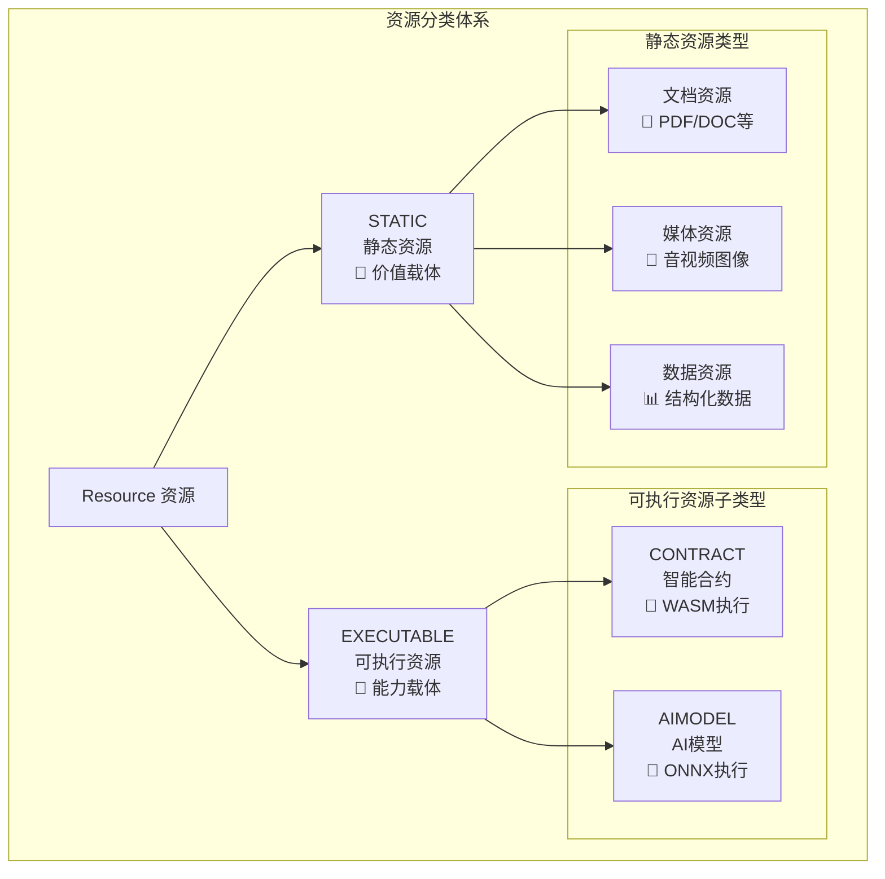
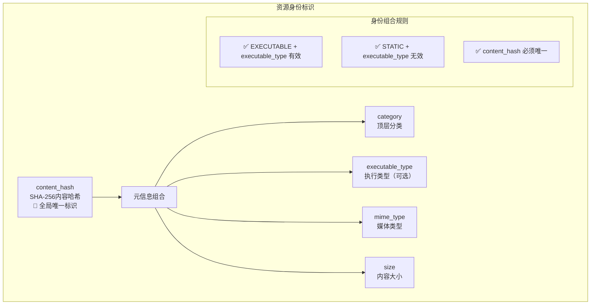
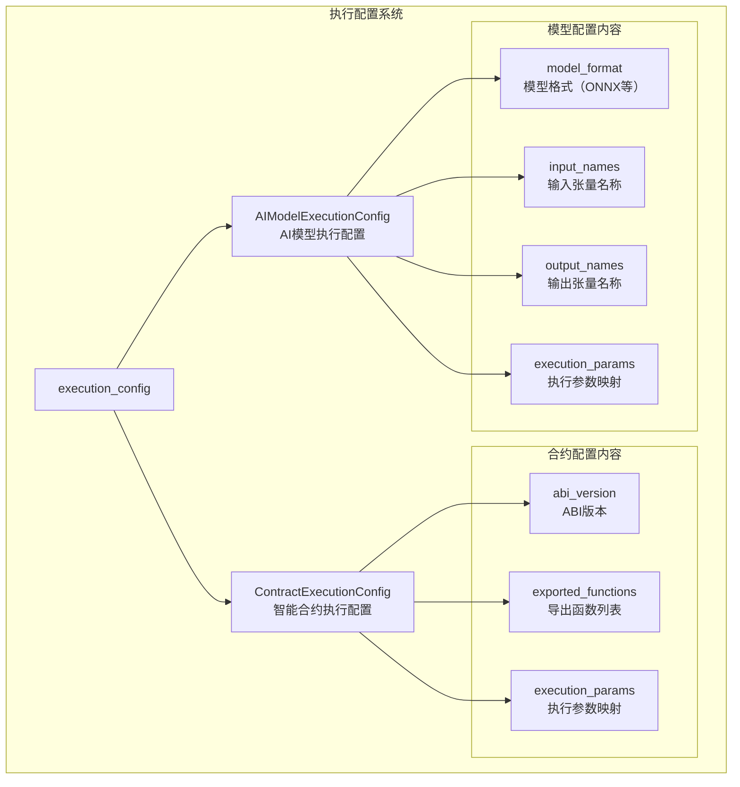
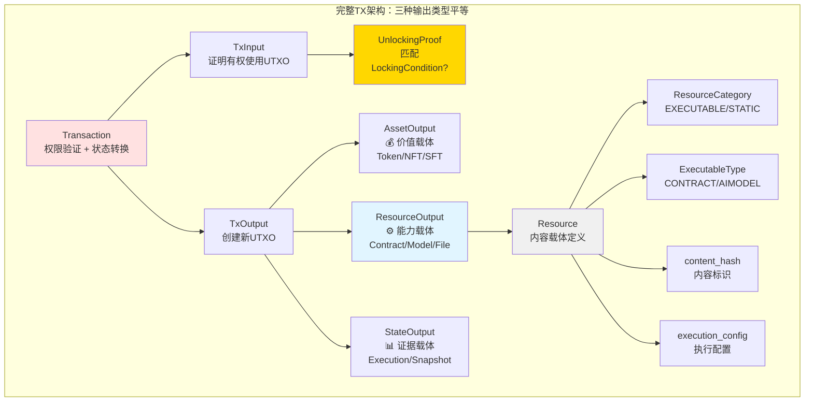
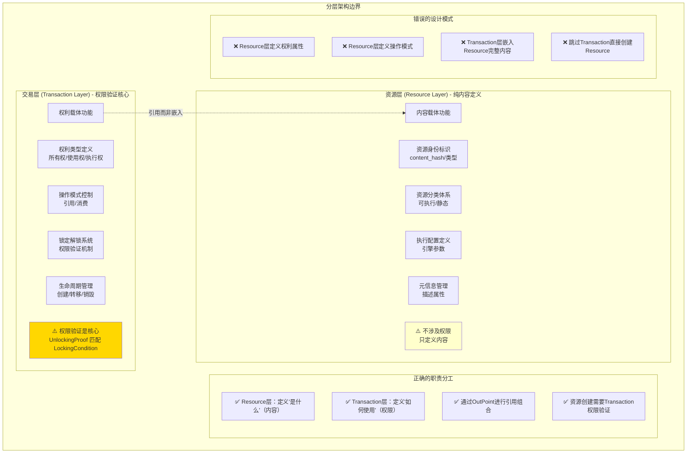
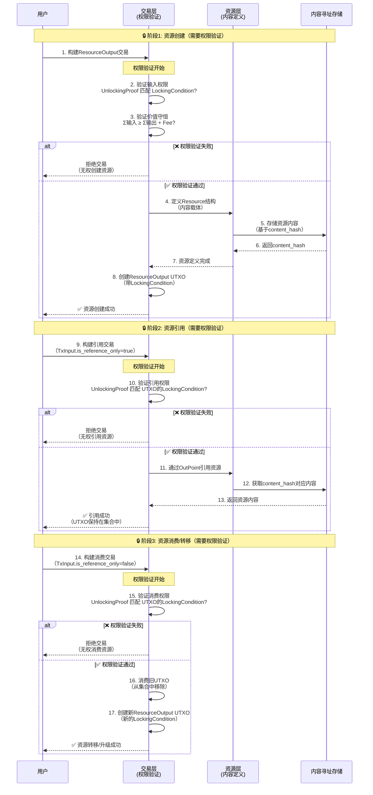
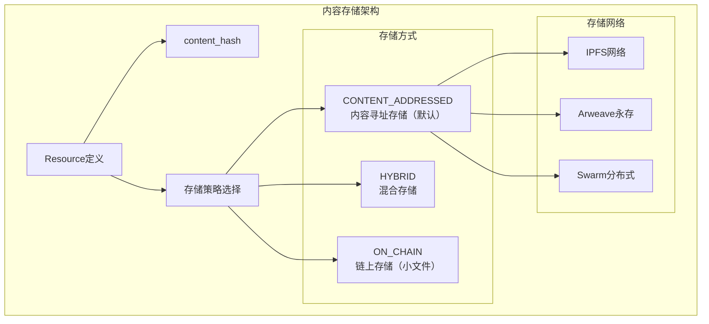

# 资源系统 - 纯粹内容载体定义（pb/blockchain/block/transaction/resource/）

【模块定位】
　　本目录定义了WES区块链系统的资源内容载体规范，专注于资源本身的身份标识、类型定义和执行配置。作为统一权利载体理论中"内容载体"部分的核心实现，与交易层的权利载体功能严格分离，确保高内聚低耦合的架构设计。

【设计原则】
- 高内聚低耦合：专注资源本身，不涉及权限、生命周期等外部关注点
- 强类型安全：为不同资源类型提供具体的强类型配置定义  
- 职责单一：资源即内容，交易层负责权限裁决和生命周期管理
- 内容驱动：content_hash为资源唯一身份标识，内容变化等同新资源
- 存储分离：资源内容通过内容寻址网络存储，协议层仅记录必要引用信息

【核心职责】
1. **资源身份定义**：基于content_hash的唯一资源标识体系
2. **资源分类管理**：可执行资源与静态资源的明确分类定义
3. **执行配置规范**：为不同执行引擎提供标准化的配置接口
4. **元信息管理**：资源的描述性信息和用户自定义属性
5. **协议边界维护**：严格维护与交易层权利功能的边界分离

## 资源分类架构

### 顶层资源分类


### 资源身份系统


## 资源结构设计

### Resource消息定义
```protobuf
message Resource {
  // ========== 资源核心身份 ==========
  ResourceCategory category = 1;           // 顶层分类：EXECUTABLE | STATIC
  ExecutableType executable_type = 2;      // 执行类型（仅EXECUTABLE时有效）
  bytes content_hash = 3;                  // SHA-256内容哈希（唯一标识）
  string mime_type = 4;                    // MIME类型（业务层语义）
  uint64 size = 5;                         // 内容大小（字节）
  
  // ========== 资源元信息 ==========
  string name = 10;                        // 显示名称
  string version = 11;                     // 版本标识  
  uint64 created_timestamp = 12;           // 创建时间
  string creator_address = 13;             // 创建者地址
  string description = 14;                 // 资源描述
  
  // ========== 执行引擎配置 ==========
  oneof execution_config {
    ContractExecutionConfig contract = 100;   // 智能合约配置
    AIModelExecutionConfig aimodel = 101;     // AI模型配置
  }
  
  // ========== 自定义扩展 ==========
  map<string, string> custom_attributes = 30; // 业务层扩展属性
}
```

### 执行引擎配置


## 架构边界设计

### ResourceOutput在完整TX架构中的位置



**关键认知**：
- ✅ ResourceOutput 是三种输出类型之一，与 Asset/State **完全平等**
- ✅ 创建 ResourceOutput **必须**通过 Transaction 进行权限验证
- ✅ Resource 定义内容，Transaction 定义权限和生命周期
- ✅ 资源的使用（引用/消费）通过 TxInput + UnlockingProof 控制

### 资源层与交易层的边界分离



### 资源创建和使用的完整权限验证流程



**关键要点**：
1. **权限验证是核心**：所有操作（创建、引用、消费）都需要通过 Transaction 层的权限验证
2. **Resource层不涉及权限**：只定义内容，不验证权限
3. **三种操作模式**：
   - 创建：需要消费输入UTXO支付费用
   - 引用：需要证明有权引用（`is_reference_only=true`）
   - 消费：需要证明有权消费（`is_reference_only=false`）
4. **UnlockingProof 匹配 LockingCondition**：这是所有权限验证的基础

## 资源类型详解

### 智能合约资源
```protobuf
message ContractExecutionConfig {
  string abi_version = 1;                  // ABI接口版本
  repeated string exported_functions = 2; // 导出函数列表
  map<string, string> execution_params = 10; // 执行引擎特定参数
}
```

**典型使用场景：**
- DeFi协议：去中心化交易、借贷、流动性挖矿
- NFT合约：数字资产铸造、交易、版权管理  
- 治理合约：投票系统、提案管理、社区治理
- 游戏合约：游戏逻辑、道具管理、经济系统

### AI模型资源  
```protobuf
message AIModelExecutionConfig {
  string model_format = 1;                // 模型格式：ONNX、TensorFlow等
  repeated string input_names = 2;        // 输入张量名称列表
  repeated string output_names = 3;       // 输出张量名称列表
  map<string, string> execution_params = 10; // 模型执行参数
}
```

**典型使用场景：**
- 图像识别：医疗影像诊断、安防监控、自动驾驶
- 自然语言：文档理解、智能客服、内容审核
- 推荐系统：个性化推荐、风险评估、用户画像
- 预测分析：市场预测、设备维护、业务优化

### 静态资源
```protobuf
// 静态资源无需特殊执行配置，通过mime_type区分具体类型
message Resource {
  ResourceCategory category = RESOURCE_CATEGORY_STATIC;
  string mime_type = "application/pdf"; // 或其他MIME类型
  // ... 其他字段
}
```

**典型使用场景：**
- 文档存储：合同文件、证书证明、技术文档
- 媒体内容：音视频文件、图片资源、设计素材
- 数据集：机器学习数据、统计分析数据、历史档案
- 配置文件：应用配置、系统参数、模板文件

## 内容寻址存储

### 存储策略


## 使用示例

### 智能合约资源创建
```go
import (
    "crypto/sha256"
    "github.com/weisyn/v1/pb/blockchain/block/transaction/resource"
    "google.golang.org/protobuf/proto"
)

// 创建智能合约资源
contractBytes := []byte("/* WASM合约字节码 */")
contentHash := sha256.Sum256(contractBytes)

contractResource := &resource.Resource{
    Category: resource.ResourceCategory_RESOURCE_CATEGORY_EXECUTABLE,
    ExecutableType: resource.ExecutableType_EXECUTABLE_TYPE_CONTRACT,
    ContentHash: contentHash[:],
    MimeType: "application/wasm",
    Size: uint64(len(contractBytes)),
    
    Name: "DeFi AMM合约",
    Version: "v2.1.0",
    CreatedTimestamp: uint64(time.Now().Unix()),
    CreatorAddress: "WES_creator_address_here",
    Description: "去中心化自动做市商合约",
    
    ExecutionConfig: &resource.Resource_Contract{
        Contract: &resource.ContractExecutionConfig{
            AbiVersion: "1.0",
            ExportedFunctions: []string{
                "initialize", "swap", "addLiquidity", 
                "removeLiquidity", "getPrice",
            },
            ExecutionParams: map[string]string{
                "max_执行费用": "1000000",
                "memory_limit": "64MB",
                "timeout": "30s",
            },
        },
    },
    
    CustomAttributes: map[string]string{
        "protocol": "uniswap-v2",
        "token_pair": "WES/USDC",
        "fee_tier": "0.3%",
    },
}

// 序列化资源定义
resourceBytes, err := proto.Marshal(contractResource)
```

### AI模型资源创建
```go
// 创建AI模型资源
modelBytes := []byte("/* ONNX模型文件 */")
contentHash := sha256.Sum256(modelBytes)

aiResource := &resource.Resource{
    Category: resource.ResourceCategory_RESOURCE_CATEGORY_EXECUTABLE,
    ExecutableType: resource.ExecutableType_EXECUTABLE_TYPE_AIMODEL,
    ContentHash: contentHash[:],
    MimeType: "application/onnx",
    Size: uint64(len(modelBytes)),
    
    Name: "图像分类模型",
    Version: "ResNet-50-v1.5",
    CreatedTimestamp: uint64(time.Now().Unix()),
    CreatorAddress: "WES_ai_researcher_address",
    Description: "基于ResNet-50的高精度图像分类模型",
    
    ExecutionConfig: &resource.Resource_Aimodel{
        Aimodel: &resource.AIModelExecutionConfig{
            ModelFormat: "onnx",
            InputNames: []string{"input_image"},
            OutputNames: []string{"class_probabilities", "predicted_class"},
            ExecutionParams: map[string]string{
                "batch_size": "1",
                "precision": "float32",
                "optimization_level": "all",
                "device": "cpu",
            },
        },
    },
    
    CustomAttributes: map[string]string{
        "model_type": "classification",
        "dataset": "ImageNet",
        "accuracy": "76.15%",
        "framework": "PyTorch",
    },
}
```

### 静态资源创建
```go
// 创建文档资源
documentBytes := []byte("/* PDF文档内容 */")
contentHash := sha256.Sum256(documentBytes)

documentResource := &resource.Resource{
    Category: resource.ResourceCategory_RESOURCE_CATEGORY_STATIC,
    // executable_type 对静态资源无效，无需设置
    ContentHash: contentHash[:],
    MimeType: "application/pdf",
    Size: uint64(len(documentBytes)),
    
    Name: "WES技术白皮书",
    Version: "v3.0",
    CreatedTimestamp: uint64(time.Now().Unix()),
    CreatorAddress: "WES_foundation_address",
    Description: "WES区块链系统完整技术规范文档",
    
    // 静态资源无需执行配置
    // ExecutionConfig 保持为nil
    
    CustomAttributes: map[string]string{
        "document_type": "whitepaper",
        "language": "chinese",
        "page_count": "128",
        "license": "CC-BY-4.0",
    },
}
```

## 验证规则

### 资源完整性验证
```go
func ValidateResource(res *resource.Resource) error {
    // 1. 基础字段验证
    if len(res.ContentHash) != 32 {
        return errors.New("content_hash必须是32字节SHA-256哈希")
    }
    
    if res.Size == 0 {
        return errors.New("资源大小不能为0")
    }
    
    if res.MimeType == "" {
        return errors.New("mime_type不能为空")
    }
    
    // 2. 分类一致性验证
    if res.Category == resource.ResourceCategory_RESOURCE_CATEGORY_EXECUTABLE {
        if res.ExecutableType == resource.ExecutableType_EXECUTABLE_TYPE_UNKNOWN {
            return errors.New("可执行资源必须指定executable_type")
        }
        
        if res.ExecutionConfig == nil {
            return errors.New("可执行资源必须提供execution_config")
        }
    } else if res.Category == resource.ResourceCategory_RESOURCE_CATEGORY_STATIC {
        if res.ExecutableType != resource.ExecutableType_EXECUTABLE_TYPE_UNKNOWN {
            return errors.New("静态资源不应设置executable_type")
        }
        
        if res.ExecutionConfig != nil {
            return errors.New("静态资源不应设置execution_config")
        }
    }
    
    // 3. 执行配置验证
    switch config := res.ExecutionConfig.(type) {
    case *resource.Resource_Contract:
        return validateContractConfig(config.Contract)
    case *resource.Resource_Aimodel:
        return validateAIModelConfig(config.Aimodel)
    }
    
    return nil
}
```

## 扩展指南

### 添加新的执行类型
1. **更新ExecutableType枚举**：
```protobuf
enum ExecutableType {
  EXECUTABLE_TYPE_UNKNOWN = 0;
  EXECUTABLE_TYPE_CONTRACT = 1;
  EXECUTABLE_TYPE_AIMODEL = 2;
  EXECUTABLE_TYPE_NEW_ENGINE = 3;  // 新增执行类型
}
```

2. **定义新的执行配置**：
```protobuf
message NewEngineExecutionConfig {
  string engine_version = 1;
  repeated string required_features = 2;
  map<string, string> engine_params = 10;
}

message Resource {
  // 在execution_config中添加新配置
  oneof execution_config {
    ContractExecutionConfig contract = 100;
    AIModelExecutionConfig aimodel = 101;
    NewEngineExecutionConfig new_engine = 102;
  }
}
```

3. **实现对应的执行引擎**：
在`internal/core/engines/`目录下创建新的执行引擎模块

---

## 📚 相关文档

- **上级文档**：`../README.md` - 交易层协议文档  
- **顶级文档**：`../../README.md` - 区块层协议文档
- **执行引擎**：`internal/core/engines/README.md` - 执行引擎实现
- **技术规范**：`docs/specs/ures/URES_SPEC.md` - URES统一资源规范

---

**注意**：资源层严格维护与交易层的边界分离，专注于内容载体功能。所有权利相关的概念（权限、生命周期、操作模式等）均由交易层负责，确保架构的高内聚低耦合特性。
