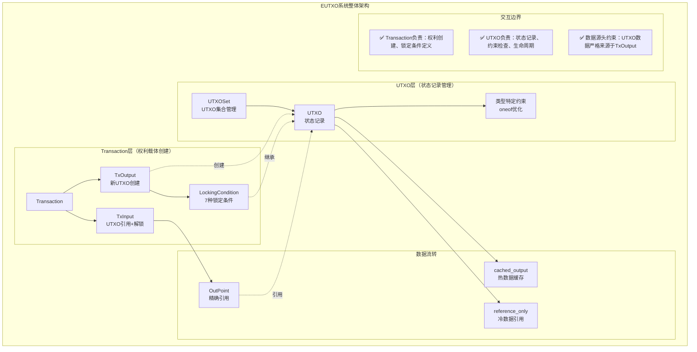
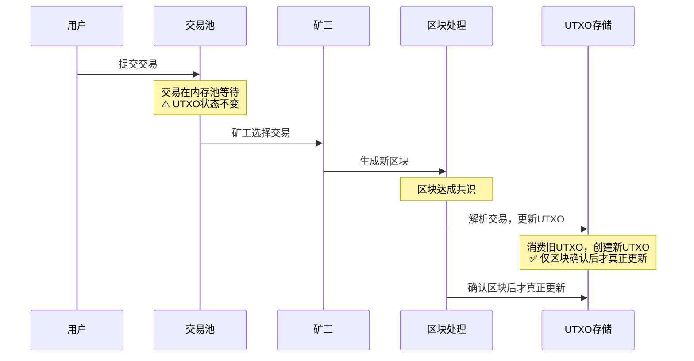
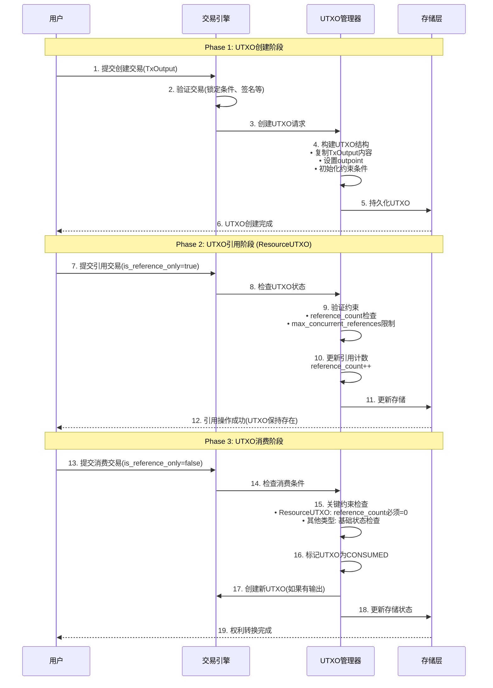
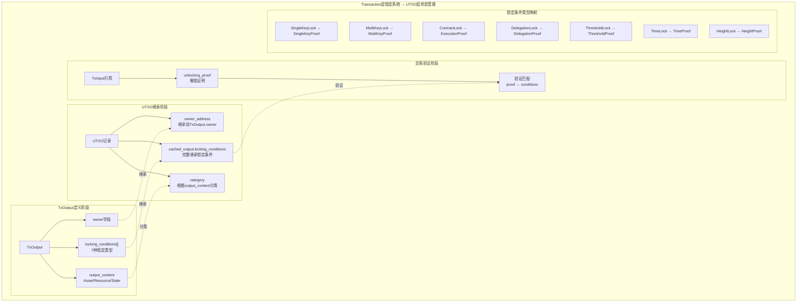
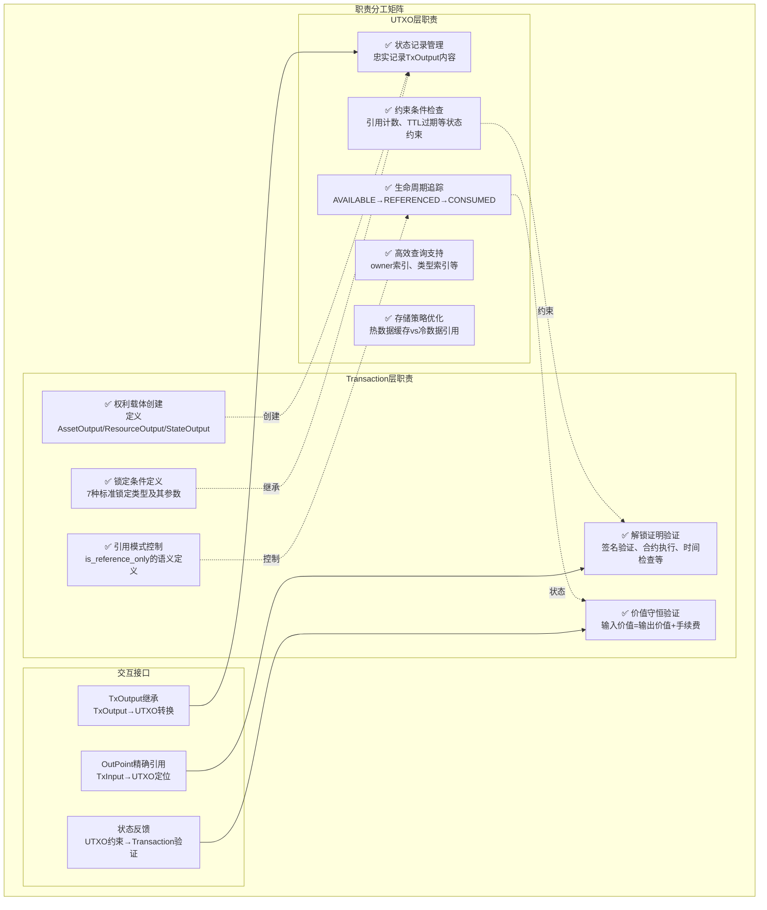
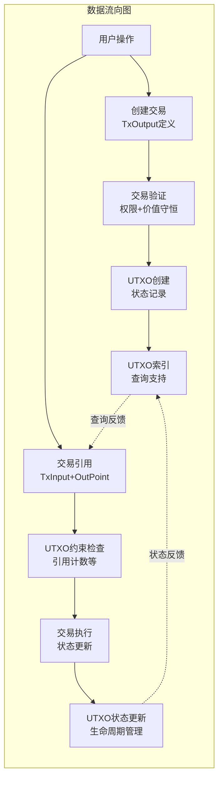

# UTXO系统 Protocol Buffers（pb/blockchain/utxo/）

【模块定位】
　　本目录定义了WES区块链的扩展UTXO（EUTXO）模型，严格遵循"UTXO是交易输出的忠实记录"这一核心原则。UTXO不是统计数据库，不是业务查询层，而是区块链状态的精确反映。专注解决用户的真实业务需求：余额查询、资源管理、状态验证，而非追求设计的"完备性"。

【设计原则】
- **业务导向**：解决用户真实需求（"我有多少钱？""我的资源在哪？"），不做无意义的统计
- **数据源头约束**：所有UTXO数据严格来源于TxOutput，可计算的信息不存储
- **交易驱动**：UTXO只记录交易执行结果，不参与业务逻辑处理
- **约束明确**：只包含影响交易验证的状态信息，删除描述性冗余字段
- **查询支撑**：为业务查询提供必要的基础数据，但查询逻辑在API层实现
- **并发安全**：ResourceUTXO引用计数确保并发访问的安全约束

【核心职责】
1. **状态记录**：忠实记录TxOutput内容，不增加可计算的冗余信息
2. **交易约束**：提供交易验证所需的状态信息（如引用计数约束）
3. **业务数据基础**：为用户查询（余额、资源）提供基础数据支撑
4. **生命周期管理**：追踪UTXO的可用性状态（AVAILABLE/CONSUMED）
5. **并发控制**：通过引用计数确保ResourceUTXO的安全并发访问

## 协议文件说明

### utxo.proto - EUTXO模型协议

**核心消息**：
- `UTXO` - 扩展UTXO数据结构（支持Asset/Resource/State三种类型）
- `UTXOSet` - UTXO集合管理器（支持引用计数和完整性验证）
- `UTXOCategory` - UTXO类型枚举（ASSET/RESOURCE/STATE）
- `UTXOLifecycleStatus` - UTXO生命周期状态（AVAILABLE/REFERENCED/CONSUMED/EXPIRED）

**架构对比**：
```
比特币UTXO模型：
TxOutput → UTXO → 消费销毁

WES EUTXO模型：
TxOutput → UTXO → [引用使用] → [权限演化] → 最终消费
         ↑                    ↓
    忠实记录              交易驱动权限变更
```

## 系统架构设计

### UTXO-Transaction协同架构


### 全局UTXO生命周期时序


### UTXO内部生命周期管理


### 锁定条件继承关系


## 核心创新点

### 1. 业务导向的UTXO设计
```
解决的实际业务问题：
✅ 用户查询："我有多少WES？多少TokenA？"
✅ 资源管理："我部署的合约在哪？状态如何？"  
✅ 并发安全："多人同时调用合约时的安全保证"
✅ 交易验证："这个ResourceUTXO当前可以被消费吗？"

避免的过度设计：
❌ 统计信息：不存储可通过区块链计算的数据
❌ 描述性字段：不存储对交易验证无影响的信息
❌ 复杂查询：不在UTXO层实现用户友好查询
```

### 2. 引用计数约束机制（核心创新）
```
ResourceUTXO并发控制：
- reference_count = 0: 可以被消费（转移/升级/删除）
- reference_count > 0: 禁止消费，只能引用
- 约束意义：确保正在使用的资源不会被意外移除
- 业务价值：支持合约并发调用的安全保证

实际约束逻辑：
if reference_count > 0:
  → 拒绝消费性交易（is_reference_only=false）
  → 允许引用性交易（is_reference_only=true）
else:
  → 允许所有类型的交易
```

### 3. 类型特定约束设计（oneof优化）
```
通用字段（所有类型共享）：
- outpoint: UTXO位置标识
- category: UTXO类型分类  
- owner_address: 所有者地址
- status: 生命周期状态
- 创建信息: block_height, created_timestamp

类型特定约束（oneof分离）：
AssetUTXOConstraints:
- 当前为预留结构，保持AssetUTXO的简洁性
- 未来可扩展：锁定期、冻结状态等

ResourceUTXOConstraints:  
- reference_count: 并发引用计数（核心约束）
- max_concurrent_references: 最大并发限制
- total_reference_count: 历史统计（业务价值）

StateUTXOConstraints:
- ttl_seconds: 状态生存时间
- expires_at_timestamp: 绝对过期时间
- retention_policy: 保留策略控制
```

### 4. Transaction-UTXO锁定条件交互机制
```
锁定条件的完整生命周期：

阶段1：Transaction层定义
• TxOutput.locking_conditions[] 定义访问权限
• 支持7种标准锁定类型的组合
• 每种类型对应特定的业务场景

阶段2：UTXO层继承
• UTXO.cached_output完整保存TxOutput内容  
• 包括所有锁定条件的完整定义
• 不修改，不简化，忠实记录

阶段3：交易验证应用  
• TxInput.unlocking_proof 提供解锁"钥匙"
• 验证器检查 proof ↔ conditions 匹配关系
• 7种锁定条件 ↔ 7种解锁证明一一对应

实际业务价值：
✅ ResourceUTXO访问控制：SingleKeyLock(私有)、MultiKeyLock(团队)、ContractLock(付费)
✅ 企业级多签管理：MultiKeyLock支持3-of-5等复杂治理
✅ 时间控制：TimeLock/HeightLock实现锁仓、定期存款
✅ 委托授权：DelegationLock支持交易所托管服务
✅ 银行级安全：ThresholdLock支持央行数字货币发行
```

### 5. 引用计数并发控制详细机制
```
ResourceUTXO特殊处理流程：

并发引用阶段（is_reference_only=true）：
1. 检查：reference_count < max_concurrent_references
2. 允许：创建引用交易，UTXO保持AVAILABLE状态
3. 更新：reference_count++，记录活跃引用数
4. 约束：当reference_count > 0时，禁止消费操作

消费约束检查（is_reference_only=false）：
1. 强制检查：reference_count 必须等于 0
2. 拒绝原因："resource is being referenced by N transactions"  
3. 业务含义：确保正在使用的资源不会被意外移除
4. 安全保证：合约并发调用时的状态一致性

实际约束场景：
• 合约升级：必须等待所有引用交易完成
• 资源删除：必须确保没有活跃的访问者
• 权限变更：需要先停止所有使用，再进行权限修改
• 所有权转移：确保转移时资源没有被并发访问
```

### 6. 存储策略优化（content_strategy）
```
热数据策略（cached_output）：
- 适用：频繁访问的UTXO
- 优势：避免区块链回溯，提升查询性能
- 成本：增加存储空间占用
- 典型场景：活跃资产、热门资源

冷数据策略（reference_only）：
- 适用：不常访问的UTXO  
- 优势：节省存储空间，减少冗余
- 成本：查询时需要额外的回溯操作
- 典型场景：历史状态、冷门资源
```

## 使用示例

### 1. 用户余额查询（解决实际业务需求）
```go
// 用户关心的问题："我有多少WES？多少TokenA？"

// API层实现（UTXO提供基础数据）
func GetUserBalance(address string) (*UserBalance, error) {
    // 查询用户所有AssetUTXO
    assetUTXOs := utxoRepo.ListUTXOsByOwnerAndCategory(address, UTXO_CATEGORY_ASSET)
    
    balance := &UserBalance{
        NativeCoinBalance: "0",
        TokenBalances: make(map[string]string),
    }
    
    for _, utxo := range assetUTXOs {
        // 从缓存的TxOutput中提取资产信息
        assetOutput := extractAssetOutputFromUTXO(utxo)
        
        if isNativeCoin(assetOutput) {
            balance.NativeCoinBalance = addAmounts(balance.NativeCoinBalance, assetOutput.Amount)
        } else {
            tokenId := assetOutput.TokenId
            balance.TokenBalances[tokenId] = addAmounts(balance.TokenBalances[tokenId], assetOutput.Amount)
        }
    }
    
    return balance, nil
}
```

### 2. ResourceUTXO并发安全控制（基于新的oneof设计）
```go
// 业务场景：多人同时调用合约，确保合约不会被意外删除

// 合约调用（引用模式）
func CallContract(contractOutPoint OutPoint, userInput []byte) error {
    // 1. 检查ResourceUTXO是否可用
    resourceUTXO := utxoRepo.GetUTXO(contractOutPoint)
    if resourceUTXO.Status != UTXO_LIFECYCLE_AVAILABLE {
        return errors.New("resource not available")
    }
    
    // 2. 检查ResourceUTXO特定约束
    if resourceUTXO.Category == UTXO_CATEGORY_RESOURCE {
        if constraints := resourceUTXO.GetResourceConstraints(); constraints != nil {
            // 检查是否超过最大并发限制
            if constraints.MaxConcurrentReferences > 0 && 
               constraints.ReferenceCount >= constraints.MaxConcurrentReferences {
                return errors.New("resource concurrent limit exceeded")
            }
        }
    }
    
    // 3. 构建引用交易
    tx := &Transaction{
        Inputs: []*TxInput{
            {
                PreviousOutput: contractOutPoint,
                IsReferenceOnly: true, // 引用模式，不消费
            },
        },
    }
    
    // 4. 交易执行时，系统会：
    //    - resourceUTXO.ResourceConstraints.reference_count++
    //    - 确保并发安全
    
    return executeTransaction(tx)
}

// 合约升级（消费模式）
func UpgradeContract(oldContractOutPoint OutPoint, newContract Resource) error {
    resourceUTXO := utxoRepo.GetUTXO(oldContractOutPoint)
    
    // 关键约束：如果正在被引用，禁止消费
    if resourceUTXO.Category == UTXO_CATEGORY_RESOURCE {
        if constraints := resourceUTXO.GetResourceConstraints(); constraints != nil {
            if constraints.ReferenceCount > 0 {
                return errors.New("contract is being used, cannot upgrade")
            }
        }
    }
    
    // 构建消费交易（替换旧合约）
    tx := &Transaction{
        Inputs: []*TxInput{
            {
                PreviousOutput: oldContractOutPoint,
                IsReferenceOnly: false, // 消费模式
            },
        },
        Outputs: []*TxOutput{
            {
                // 创建新的ResourceOutput（升级后的合约）
                OutputContent: &TxOutput_Resource{
                    Resource: &ResourceOutput{Resource: newContract},
                },
            },
        },
    }
    
    return executeTransaction(tx)
}
```

### 3. 高效资源查询（支持类型特定约束）
```go
// 用户关心的问题："我部署的合约有哪些？状态如何？"

func GetUserResources(address string) ([]*ResourceInfo, error) {
    // 查询用户所有ResourceUTXO
    resourceUTXOs := utxoRepo.ListUTXOsByOwnerAndCategory(address, UTXO_CATEGORY_RESOURCE)
    
    var resources []*ResourceInfo
    for _, utxo := range resourceUTXOs {
        resourceOutput := extractResourceOutputFromUTXO(utxo)
        
        resourceInfo := &ResourceInfo{
            OutPoint: utxo.Outpoint,
            ResourceHash: resourceOutput.Resource.ContentHash,
            ResourceName: resourceOutput.Resource.Name,
            Category: resourceOutput.Resource.Category,
            Status: utxo.Status,
            CreatedAt: utxo.CreatedTimestamp,
        }
        
        // 提取ResourceUTXO特定约束信息
        if constraints := utxo.GetResourceConstraints(); constraints != nil {
            resourceInfo.ReferenceCount = constraints.ReferenceCount
            resourceInfo.MaxConcurrentReferences = constraints.MaxConcurrentReferences
            resourceInfo.TotalReferenceCount = constraints.TotalReferenceCount
            
            // 根据约束判断资源状态
            if constraints.ReferenceCount > 0 {
                resourceInfo.StatusDescription = fmt.Sprintf("正在被%d个交易使用", constraints.ReferenceCount)
                resourceInfo.CanUpgrade = false
            } else {
                resourceInfo.StatusDescription = "可用，可以升级或转移"
                resourceInfo.CanUpgrade = true
            }
            
            // 检查并发限制
            if constraints.MaxConcurrentReferences > 0 {
                usage := float64(constraints.ReferenceCount) / float64(constraints.MaxConcurrentReferences) * 100
                resourceInfo.UsagePercentage = usage
            }
        }
        
        resources = append(resources, resourceInfo)
    }
    
    return resources, nil
}

// 增强的ResourceInfo结构
type ResourceInfo struct {
    OutPoint                 OutPoint
    ResourceHash            []byte
    ResourceName            string
    Category                ResourceCategory
    Status                  UTXOLifecycleStatus
    CreatedAt               uint64
    
    // ResourceUTXO特定信息
    ReferenceCount          uint64
    MaxConcurrentReferences uint64
    TotalReferenceCount     uint64
    StatusDescription       string
    CanUpgrade              bool
    UsagePercentage         float64
}
```

### 4. 交易验证中的约束检查（支持oneof类型特定约束）
```go
// 交易验证时的UTXO约束检查
func ValidateTransactionInputs(tx *Transaction) error {
    for _, input := range tx.Inputs {
        utxo := utxoRepo.GetUTXO(input.PreviousOutput)
        
        // 基础状态检查
        if utxo.Status != UTXO_LIFECYCLE_AVAILABLE && utxo.Status != UTXO_LIFECYCLE_REFERENCED {
            return errors.New("UTXO not available")
        }
        
        // 类型特定约束检查
        switch utxo.Category {
        case UTXO_CATEGORY_ASSET:
            // AssetUTXO约束检查
            if constraints := utxo.GetAssetConstraints(); constraints != nil {
                // 当前AssetUTXO无特殊约束，预留扩展
                // 未来可能检查：锁定期、冻结状态等
            }
            
        case UTXO_CATEGORY_RESOURCE:
            // ResourceUTXO特殊约束
            if constraints := utxo.GetResourceConstraints(); constraints != nil {
                if !input.IsReferenceOnly {
                    // 消费ResourceUTXO时，必须确保无活跃引用
                    if constraints.ReferenceCount > 0 {
                        return fmt.Errorf("resource is being referenced by %d transactions, cannot consume", 
                                        constraints.ReferenceCount)
                    }
                } else {
                    // 引用ResourceUTXO时，检查并发限制
                    if constraints.MaxConcurrentReferences > 0 && 
                       constraints.ReferenceCount >= constraints.MaxConcurrentReferences {
                        return fmt.Errorf("resource concurrent limit (%d) exceeded, current: %d", 
                                        constraints.MaxConcurrentReferences, constraints.ReferenceCount)
                    }
                }
            }
            
        case UTXO_CATEGORY_STATE:
            // StateUTXO约束检查
            if constraints := utxo.GetStateConstraints(); constraints != nil {
                // 检查TTL过期
                if constraints.ExpiresAtTimestamp > 0 {
                    currentTimestamp := getCurrentTimestamp()
                    if currentTimestamp > constraints.ExpiresAtTimestamp {
                        // 过期的StateUTXO仍可查询，但不能执行某些操作
                        if !input.IsReferenceOnly {
                            return errors.New("state UTXO has expired, cannot consume")
                        }
                    }
                }
            }
        }
    }
    
    return nil
}

// StateUTXO特定的过期检查示例
func CheckStateUTXOExpiry(utxo *UTXO) (*StateExpiryInfo, error) {
    if utxo.Category != UTXO_CATEGORY_STATE {
        return nil, errors.New("not a state UTXO")
    }
    
    constraints := utxo.GetStateConstraints()
    if constraints == nil {
        return &StateExpiryInfo{
            IsExpired: false,
            NeverExpires: true,
        }, nil
    }
    
    info := &StateExpiryInfo{}
    
    if constraints.ExpiresAtTimestamp > 0 {
        currentTimestamp := getCurrentTimestamp()
        info.IsExpired = currentTimestamp > constraints.ExpiresAtTimestamp
        info.ExpiresAtTimestamp = constraints.ExpiresAtTimestamp
        
        if !info.IsExpired {
            info.TimeToExpiry = constraints.ExpiresAtTimestamp - currentTimestamp
        }
    } else {
        info.NeverExpires = true
    }
    
    return info, nil
}

type StateExpiryInfo struct {
    IsExpired           bool
    NeverExpires        bool
    ExpiresAtTimestamp  uint64
    TimeToExpiry        uint64
}
```

## 架构边界与交互说明

### UTXO-Transaction边界职责矩阵


### 数据流向与依赖关系


### UTXO层职责边界（基于实际需求重新定义）
```
✅ 必须承担的职责（影响交易验证或业务查询）：
- 忠实记录TxOutput内容（业务数据基础）
- 管理UTXO可用性状态（交易验证约束）
- 维护ResourceUTXO引用计数（并发安全约束）
- 提供基础数据支撑（用户余额查询、资源列表查询）

❌ 不应承担的职责（可通过其他方式实现）：
- 存储统计信息（可通过区块链计算得出）
- 存储描述性字段（对约束无影响的信息）
- 实现复杂查询逻辑（应在API层实现）
- 定义权限规则（在Transaction.locking_conditions中）
- 缓存价格估值等外部数据（不属于区块链状态）
```

### 设计约束原则
```
1. 约束驱动原则：
   只存储影响交易验证的状态信息
   例如：reference_count影响ResourceUTXO是否可被消费

2. 业务支撑原则：
   为核心业务查询提供必要数据
   例如：支持高效的用户余额聚合查询

3. 可计算排除原则：
   不存储可通过遍历区块链计算的信息
   例如：不存储"历史总引用次数"等统计数据

4. 描述性排除原则：
   不存储纯描述性、对约束无影响的信息
   例如：不存储"是否为挖矿奖励"等标识
```

### 与主流UTXO模型的关系
```
保持的核心兼容性：
✅ UTXO = 交易输出的直接记录
✅ 通过OutPoint精确引用UTXO
✅ 权限控制在locking_conditions中实现
✅ 确定性状态验证

业务导向的合理扩展：
💡 三种UTXO类型（解决不同业务场景）
💡 引用计数约束（解决并发安全问题）
💡 业务查询数据支撑（解决用户查询需求）
💡 存储策略优化（解决性能问题）

避免的过度设计：
❌ 删除无约束意义的统计字段
❌ 删除可计算的冗余信息
❌ 删除纯描述性字段
```

---

## 📚 相关文档

### 核心依赖
- **交易协议**：`../block/transaction/transaction.proto` - 交易结构定义（UTXO数据的唯一来源）
- **资源协议**：`../block/transaction/resource/resource.proto` - 资源内容定义（ResourceUTXO的内容来源）
- **区块协议**：`../block/block.proto` - 区块结构（UTXO的创建上下文）

### 实现参考
- **Repository接口**：`pkg/interfaces/repository/utxo.go` - UTXO存储接口定义
- **核心实现**：`internal/core/repositories/utxo/` - UTXO管理实现

### 理论基础
- **统一权利载体理论**：`docs/architecture/UNIFIED_RIGHT_BEARER_THEORY.md`
- **EUTXO权利具现化理论**：`docs/architecture/EUTXO_RIGHT_MATERIALIZATION_THEORY.md`
- **统一资源管理理论**：`docs/architecture/UNIFIED_RESOURCE_MANAGEMENT_THEORY.md`

### 上级文档
- **区块链协议总览**：`pb/blockchain/README.md`
- **协议规范根目录**：`pb/README.md`