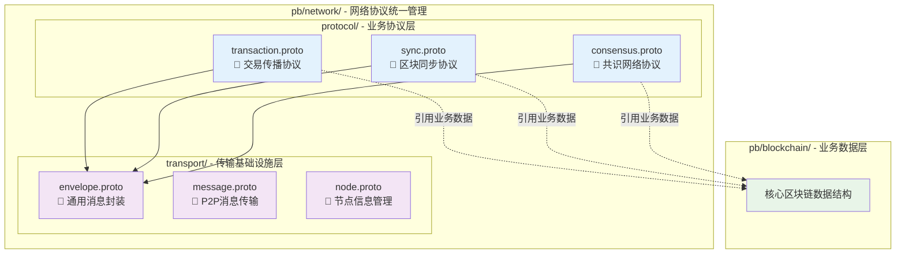

# 网络层协议 Protocol Buffers（pb/network/）

【模块定位】
　　本目录是WES系统网络协议的统一归口管理中心，采用**二级分层架构**，将业务协议与传输基础设施明确分离。通过职责清晰的层次设计，实现高内聚、低耦合的网络协议体系，为WES提供标准化、可扩展、易维护的网络通信基础。

## 🎯 **二级分层架构设计**

### **分层职责清晰分离**


### **分层设计原则**
- **业务协议层（protocol/）**：关注"传输什么业务数据"，定义跨节点业务消息格式
- **传输基础设施层（transport/）**：关注"如何高效传输"，提供通用网络传输能力  
- **清晰依赖**：业务协议引用业务数据，使用传输基础设施，传输层不依赖具体业务

## 📁 **目录结构详解**

### **业务协议层（protocol/）**

| **协议文件** | **Package** | **核心消息** | **协议类型** | **主要用途** |
|-------------|------------|-------------|-------------|-------------|
| **transaction.proto** | `pb.network.protocol` | `TransactionAnnouncement`, `TransactionPropagationRequest` | GossipSub + Stream RPC | 交易双重保障传播 |
| **sync.proto** | `pb.network.protocol` | `KBucketSyncRequest`, `IntelligentPaginationResponse` | Stream RPC | K-bucket智能同步 |
| **consensus.proto** | `pb.network.protocol` | `MinerBlockSubmission`, `ConsensusResultBroadcast` | Stream RPC + GossipSub | 矿工-聚合器共识 |

### **传输基础设施层（transport/）**

| **协议文件** | **Package** | **核心消息** | **协议类型** | **主要用途** |
|-------------|------------|-------------|-------------|-------------|
| **envelope.proto** | `pb.network.transport` | `Envelope`, `RpcRequest`, `RpcResponse` | Stream RPC容器 | 统一网络消息封装 |
| **message.proto** | `pb.network.transport` | `P2PMessage` | P2P基础消息 | P2P网络基础消息包装 |
| **node.proto** | `pb.network.transport` | `NodeInfo`, `NodeStatus` | 节点管理 | 节点信息和状态管理 |

### **协议分类说明**

#### 🔗 **Stream RPC协议**（点对点可靠传输）
```bash
# 使用Envelope封装的Stream RPC协议
/weisyn/transaction/direct/1.0.0      # 交易直连传播
/weisyn/sync/kbucket/1.0.0            # K-bucket智能同步  
/weisyn/consensus/block_submission/1.0.0  # 区块提交
/weisyn/consensus/heartbeat/1.0.0     # 共识心跳
```

#### 📡 **GossipSub协议**（发布订阅广播）
```bash
# 直接序列化业务protobuf的GossipSub主题
weisyn.transaction.announce.v1         # 交易广播通告
weisyn.consensus.latest_block.v1       # 共识结果广播
```

## 🌐 **网络协议映射表**

| **业务场景** | **协议层级** | **协议类型** | **Protocol ID / Topic** | **Request消息** | **Response消息** | **Protobuf文件** |
|-------------|-------------|------------|------------------------|-----------------|------------------|------------------|
| **交易广播** | protocol/ | GossipSub | `weisyn.transaction.announce.v1` | `TransactionAnnouncement` | - | protocol/transaction.proto |
| **交易直连** | protocol/ | Stream RPC | `/weisyn/transaction/direct/1.0.0` | `TransactionPropagationRequest` | `TransactionPropagationResponse` | protocol/transaction.proto |
| **区块同步** | protocol/ | Stream RPC | `/weisyn/sync/kbucket/1.0.0` | `KBucketSyncRequest` | `IntelligentPaginationResponse` | protocol/sync.proto |
| **矿工提交** | protocol/ | Stream RPC | `/weisyn/consensus/block_submission/1.0.0` | `MinerBlockSubmission` | `AggregatorBlockAcceptance` | protocol/consensus.proto |
| **共识广播** | protocol/ | GossipSub | `weisyn.consensus.latest_block.v1` | `ConsensusResultBroadcast` | - | protocol/consensus.proto |
| **共识心跳** | protocol/ | Stream RPC | `/weisyn/consensus/heartbeat/1.0.0` | `ConsensusHeartbeat` | - | protocol/consensus.proto |
| **网络封装** | transport/ | 通用容器 | - | `Envelope`, `RpcRequest` | `RpcResponse` | transport/envelope.proto |
| **P2P通信** | transport/ | 基础传输 | - | `P2PMessage` | - | transport/message.proto |

## 🔧 **使用示例**

### **业务协议层使用**
```go
import (
    protocolpb "github.com/weisyn/v1/pb/network/protocol"
    transportpb "github.com/weisyn/v1/pb/network/transport"
)

// 创建K-bucket同步请求（业务协议层）
syncRequest := &protocolpb.KBucketSyncRequest{
    RequestId:    "sync_001",
    LocalHeight:  12345,
    RoutingKey:   parentBlockHash,
    SyncReason:   protocolpb.KBucketSyncRequest_SYNC_REASON_STARTUP,
}

// 使用Envelope封装（传输基础设施层）
envelope := &transportpb.Envelope{
    Version:       1,
    ProtocolId:    "/weisyn/sync/kbucket/1.0.0",
    ContentType:   "application/pb;type=KBucketSyncRequest",
    Payload:       proto.Marshal(syncRequest),
    CorrelationId: requestID,
    FromPeerId:    localPeerID,
    Timestamp:     uint64(time.Now().UnixMilli()),
}
```

### **传输基础设施层使用**
```go
// P2P消息传输
p2pMessage := &transportpb.P2PMessage{
    Type:        transportpb.P2PMessage_HEARTBEAT,
    NodeId:      nodeID,
    Timestamp:   uint64(time.Now().Unix()),
    Payload:     heartbeatData,
}

// 节点信息管理
nodeInfo := &transportpb.NodeInfo{
    Id:              peerID,
    Version:         "v1.0.0",
    Protocols:       []string{"weisyn/1.0.0"},
    Addresses:       nodeAddresses,
    ConnectedPeers:  connectedCount,
}
```

### **GossipSub消息发布**
```go
// 创建交易广播通告（业务协议层）
announcement := &protocolpb.TransactionAnnouncement{
    MessageId:       generateMessageID(),
    TransactionHash: txHash,
    Transaction:     transaction,
    Timestamp:       uint64(time.Now().UnixMilli()),
    SenderPeerId:    peerID,
    PropagationHop:  1,
}

// 直接序列化发布
serializedData, _ := proto.Marshal(announcement)
pubsub.Publish("weisyn.transaction.announce.v1", serializedData)
```

## 🔄 **协议演进管理**

### **版本管理策略**
```go
// 协议版本常量统一管理
const (
    // 网络协议版本
    TransactionDirectProtocolVersion    = "1.0.0"
    SyncKBucketProtocolVersion         = "1.0.0" 
    ConsensusBlockSubmissionVersion    = "1.0.0"
    ConsensusHeartbeatVersion          = "1.0.0"
    
    // 订阅主题版本
    TransactionTopicVersion = "v1"
    ConsensusTopicVersion   = "v1"
)
```

### **协议兼容性检查**
```go
// 协议消息类型映射
var ProtocolMessageTypes = map[string]string{
    "/weisyn/transaction/direct/1.0.0":         "TransactionPropagationRequest",
    "/weisyn/sync/kbucket/1.0.0":               "KBucketSyncRequest", 
    "/weisyn/consensus/block_submission/1.0.0": "MinerBlockSubmission",
    "/weisyn/consensus/heartbeat/1.0.0":        "ConsensusHeartbeat",
}
```

## 🛡️ **网络安全特性**

### **消息完整性保护**
- **数字签名**：所有消息包含发送者数字签名
- **时间戳验证**：防止重放攻击和消息过期
- **消息ID去重**：防止重复处理和网络拥塞

### **网络优化机制**
- **智能路由**：基于K-bucket距离的最优路径选择
- **分页传输**：接收方控制的智能分页策略
- **压缩传输**：可选的数据压缩减少带宽使用
- **错误重试**：梯度退避和节点切换策略

---

## 📚 **相关文档**

- **上级文档**：`pb/README.md` - Protocol Buffers 总体架构
- **业务定义**：`pb/blockchain/README.md` - 区块链核心数据结构  
- **P2P通信**：`pb/network/transport/` - P2P底层通信协议（已整合）
- **网络规范**：`docs/standards/NETWORK_IMPLEMENTATION_SPECIFICATION.md` - 网络实现规范
- **共识文档**：`internal/core/consensus/README.md` - 共识模块网络集成
