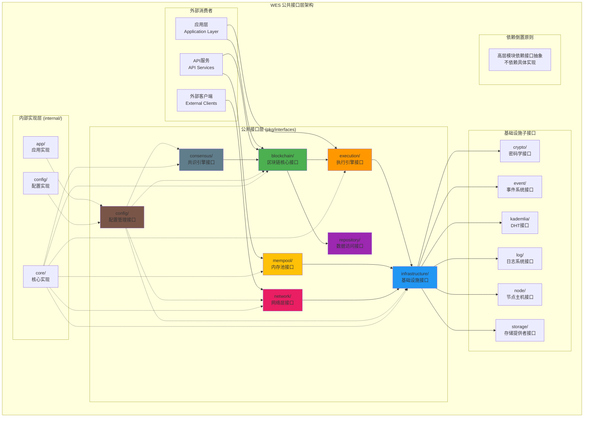
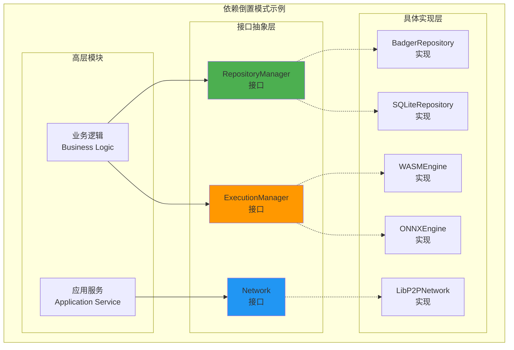

# WES 公共接口层设计（pkg/interfaces）

【模块定位】
　　本目录定义了WES区块链系统的核心公共接口层，作为整个系统的抽象边界和契约规范。通过依赖倒置的设计原则，将接口定义与具体实现完全分离，为上层应用和内部实现提供稳定、清晰、可扩展的接口契约。

【设计原则】
- 依赖倒置：高层模块依赖接口抽象，不依赖具体实现
- 接口分离：每个接口职责单一，避免接口污染
- 稳定性优先：接口一旦发布保持向后兼容
- 契约明确：通过详细的接口文档定义使用契约
- 分层清晰：按功能域组织接口，边界明确

【核心职责】
1. **接口契约定义**：为系统各组件提供标准化的接口规范
2. **依赖倒置实现**：通过接口抽象解耦具体实现依赖
3. **跨模块通信**：定义模块间的标准通信协议
4. **扩展性支持**：为系统扩展提供稳定的接口基础
5. **文档化规范**：为每个接口提供完整的使用文档
6. **版本兼容管理**：确保接口演进的向后兼容性

【接口架构】



【接口目录结构】

## blockchain/ - 区块链核心接口
**定位**：区块链系统的核心业务接口，为上层应用提供完整的区块链功能
**核心接口**：
- `AccountService` - 用户友好的账户抽象和资产管理
- `TransactionService` - 完整的交易生命周期管理
- `BlockService` - 区块的完整生命周期管理  
- `BlockchainService` - 系统状态管理和控制
- `ResourceService` - 统一的资源管理
- `SyncService` - 区块链数据同步

**设计特点**：
- 隐藏底层UTXO复杂性，提供用户友好抽象
- 支持企业级多签、治理、合规功能
- 完整的错误处理和批量操作支持

## config/ - 配置管理接口
**定位**：统一的配置管理公共接口，支持依赖倒置设计
**核心接口**：
- `Provider` - 统一的配置访问接口
- `AppOptions` - 应用级配置选项

**设计特点**：
- 按功能域分组的配置获取方法
- 强类型返回值，避免类型转换错误
- 支持热更新和配置变更通知
- 与fx依赖注入框架无缝集成

## consensus/ - 共识引擎接口
**定位**：PoW挖矿控制的核心接口，职责边界清晰
**核心接口**：
- `ConsensusService` - PoW挖矿控制

**设计特点**：
- 职责单一：专注于PoW挖矿算法和挖矿控制
- 接口极简：只有3个核心方法（StartMining、StopMining、GetMiningStatus）
- 边界清晰：不涉及区块验证、创建、分发等其他职责
- 从834行简化到222行，删除了职责重复的功能

## execution/ - 执行引擎接口
**定位**：执行层的统一抽象接口，支持多种执行引擎
**核心接口**：
- `EngineAdapter` - 执行引擎适配器接口
- `EngineManager` - 执行管理器接口
- `HostCapabilityProvider` - 宿主能力提供者接口
- `HostCapabilityRegistry` - 宿主能力注册接口
- `HostStandardInterface` - 宿主标准接口
- `HostBinding` - 宿主绑定接口
- `ExecutionEnvAdvisor` - 执行环境顾问接口

**设计特点**：
- 支持WASM、ONNX等多种执行引擎
- 依赖倒置设计，执行层依赖接口抽象
- 宿主能力安全隔离和标准化
- 完整的执行环境管理和资源控制

## infrastructure/ - 基础设施接口
**定位**：系统基础设施层的核心公共接口
**核心接口**：统一的底层服务抽象
- `crypto/` - 密码学服务接口
- `storage/` - 存储提供者接口
- `node/` - P2P节点主机接口
- `log/` - 日志系统接口
- `event/` - 事件系统接口
- `kademlia/` - Kademlia DHT接口

**设计特点**：
- 技术无关的接口设计
- 支持可插拔的实现方式
- 按功能域组织相关接口
- 高内聚的基础设施抽象

## mempool/ - 内存池接口
**定位**：内存池系统的核心公共接口，支持双池设计
**核心接口**：
- `TxPoolService` - 交易池管理接口
- `CandidatePool` - 候选区块池管理接口

**设计特点**：
- 职责分离：交易池和候选区块池各司其职
- 场景驱动：支持挖矿、聚合、VRF选择、清理等核心场景
- 并发安全：支持高并发访问和线程安全操作
- 删除了过度的状态监控和复杂统计

## network/ - 网络层接口
**定位**：网络层的核心公共接口，专注消息编解码与分发
**核心接口**：
- `Network` - 统一的网络服务接口

**设计特点**：
- 双范式通信：流式通信和发布订阅
- 协议无关：支持多种通信协议和消息格式
- 边界清晰：专注消息处理，不负责连接管理
- 生命周期分离：不包含启动停止，由实现层管理

## repository/ - 数据访问接口
**定位**：数据访问层的公共接口，实现依赖倒置
**核心接口**：
- `RepositoryManager` - 智能数据协调器接口

**设计特点**：
- 四层架构：Manager、Storage、Index、Coordinator
- 智能数据协调：自动选择最优的存储和检索策略
- 事务支持：提供ACID事务保证
- 缓存优化：多级缓存和智能预加载

【依赖倒置设计模式】

## 接口与实现的分离

通过依赖倒置原则，所有高层模块都依赖接口抽象：



## fx依赖注入集成

所有接口都与fx依赖注入框架无缝集成：

```go
// 模块定义示例
func Module() fx.Option {
    return fx.Module("blockchain",
        fx.Provide(
            // 提供接口实现
            fx.Annotate(
                NewBlockchainService,
                fx.As(new(blockchain.BlockchainService)),
            ),
            fx.Annotate(
                NewTransactionService,
                fx.As(new(blockchain.TransactionService)),
            ),
        ),
    )
}

// 消费接口示例
type APIService struct {
    blockchain blockchain.BlockchainService
    txService  blockchain.TransactionService
}

func NewAPIService(
    bc blockchain.BlockchainService,
    tx blockchain.TransactionService,
) *APIService {
    return &APIService{
        blockchain: bc,
        txService:  tx,
    }
}
```

【接口设计原则】

## 1. 单一职责原则（SRP）

每个接口都专注于单一的业务职责：

```go
// 正确：职责单一
type AccountService interface {
    GetPlatformBalance(ctx context.Context, address []byte) (*types.BalanceInfo, error)
    GetTokenBalance(ctx context.Context, address []byte, tokenID []byte) (*types.BalanceInfo, error)
    GetAllTokenBalances(ctx context.Context, address []byte) (map[string]*types.BalanceInfo, error)
}

type TransactionService interface {
    BuildTransaction(ctx context.Context, params *types.TransactionBuildParams) (*types.Transaction, error)
    SignTransaction(ctx context.Context, tx *types.Transaction, privateKey []byte) (*types.Transaction, error)
    SubmitTransaction(ctx context.Context, tx *types.Transaction) ([]byte, error)
}

// 错误：职责混杂
type BlockchainManager interface {
    GetBalance(address []byte) (*types.BalanceInfo, error)        // 账户职责
    BuildTransaction(params *types.TransactionBuildParams) error  // 交易职责
    ConnectPeer(peerID string) error                             // 网络职责
    StartMining(minerAddr []byte) error                          // 共识职责
}
```

## 2. 接口分离原则（ISP）

客户端不应该依赖它不需要的接口：

```go
// 正确：接口分离
type BlockReader interface {
    GetBlock(ctx context.Context, height uint64) (*types.Block, error)
    GetBlockByHash(ctx context.Context, hash []byte) (*types.Block, error)
}

type BlockValidator interface {
    ValidateBlock(ctx context.Context, block *types.Block) error
    ValidateBlockHeader(ctx context.Context, header *types.BlockHeader) error
}

type BlockWriter interface {
    CreateBlock(ctx context.Context, txs []*types.Transaction) (*types.Block, error)
    ProcessBlock(ctx context.Context, block *types.Block) error
}

// 客户端可以只依赖需要的接口
type BlockExplorer struct {
    reader BlockReader  // 只需要读取功能
}

type Miner struct {
    writer BlockWriter  // 只需要写入功能
}
```

## 3. 依赖倒置原则（DIP）

高层模块不依赖低层模块，都依赖抽象：

```go
// 正确：依赖抽象
type ConsensusEngine struct {
    blockchain blockchain.BlockchainService    // 依赖接口
    mempool    mempool.TxPoolService          // 依赖接口
    network    network.Network                // 依赖接口
}

func NewConsensusEngine(
    bc blockchain.BlockchainService,
    mp mempool.TxPoolService,
    net network.Network,
) *ConsensusEngine {
    return &ConsensusEngine{
        blockchain: bc,
        mempool:    mp,
        network:    net,
    }
}

// 错误：依赖具体实现
type ConsensusEngine struct {
    blockchain *blockchain.DefaultService      // 依赖具体实现
    mempool    *mempool.MemoryTxPool          // 依赖具体实现
}
```

【接口使用示例】

## 典型的业务流程示例

### 1. 区块链交易处理流程

```go
// 完整的交易处理示例
type TransactionProcessor struct {
    accountService blockchain.AccountService
    txService      blockchain.TransactionService
    txPool         mempool.TxPoolService
    network        network.Network
    eventBus       event.EventBus
}

func (tp *TransactionProcessor) ProcessUserTransaction(ctx context.Context, req *TransactionRequest) error {
    // 1. 验证账户余额
    balance, err := tp.accountService.GetPlatformBalance(ctx, req.FromAddress)
    if err != nil {
        return fmt.Errorf("获取账户余额失败: %w", err)
    }
    
    if balance.Available < req.Amount+req.Fee {
        return fmt.Errorf("账户余额不足")
    }
    
    // 2. 构建交易
    txParams := &types.TransactionBuildParams{
        From:   []types.Address{req.FromAddress},
        To:     []types.Address{req.ToAddress},
        Amount: req.Amount,
        Fee:    req.Fee,
    }
    
    tx, err := tp.txService.BuildTransaction(ctx, txParams)
    if err != nil {
        return fmt.Errorf("构建交易失败: %w", err)
    }
    
    // 3. 签名交易
    signedTx, err := tp.txService.SignTransaction(ctx, tx, req.PrivateKey)
    if err != nil {
        return fmt.Errorf("签名交易失败: %w", err)
    }
    
    // 4. 添加到交易池
    err = tp.txPool.AddTransaction(signedTx)
    if err != nil {
        return fmt.Errorf("添加到交易池失败: %w", err)
    }
    
    // 5. 广播交易
    err = tp.network.Publish(ctx, "weisyn.transaction.propagate.v1", signedTx.Bytes(), nil)
    if err != nil {
        return fmt.Errorf("广播交易失败: %w", err)
    }
    
    // 6. 发布事件
    tp.eventBus.PublishEvent(&TransactionSubmittedEvent{
        TxHash:      signedTx.Hash,
        FromAddress: req.FromAddress,
        ToAddress:   req.ToAddress,
        Amount:      req.Amount,
    })
    
    return nil
}
```

### 2. 智能合约部署流程

```go
type ContractDeployer struct {
    resourceService blockchain.ResourceService
    executionMgr    execution.ExecutionManager
    storage         repository.RepositoryManager
}

func (cd *ContractDeployer) DeployWASMContract(ctx context.Context, wasmCode []byte, initArgs []byte) (string, error) {
    // 1. 验证WASM代码
    engine, err := cd.executionMgr.GetEngine(types.EngineTypeWASM)
    if err != nil {
        return "", fmt.Errorf("获取WASM引擎失败: %w", err)
    }
    
    // 2. 创建资源对象
    resource := &types.Resource{
        Type:     types.ResourceTypeWASMContract,
        Content:  wasmCode,
        Metadata: map[string]string{
            "version": "1.0",
            "author":  "developer",
        },
    }
    
    // 3. 部署到执行引擎
    contractID, err := cd.resourceService.DeployResource(ctx, resource)
    if err != nil {
        return "", fmt.Errorf("部署资源失败: %w", err)
    }
    
    // 4. 初始化合约
    result, err := engine.Execute(ctx, types.ExecutionParams{
        ResourceID: contractID,
        Method:     "init",
        Input:      initArgs,
        执行费用Limit:   1000000,
    })
    if err != nil {
        return "", fmt.Errorf("初始化合约失败: %w", err)
    }
    
    // 5. 存储合约状态
    err = cd.storage.SetContractState(ctx, contractID, result.State)
    if err != nil {
        return "", fmt.Errorf("保存合约状态失败: %w", err)
    }
    
    return contractID, nil
}
```

### 3. 配置驱动的模块初始化

```go
type ModuleInitializer struct {
    configProvider config.Provider
}

func (mi *ModuleInitializer) InitializeStorage() (repository.RepositoryManager, error) {
    // 根据配置选择存储引擎
    storageConfig := mi.configProvider.GetStorage()
    
    switch storageConfig.DefaultProvider {
    case "badger":
        badgerConfig := mi.configProvider.GetBadger()
        return repository.NewBadgerRepository(badgerConfig)
    case "sqlite":
        sqliteConfig := mi.configProvider.GetSQLite()
        return repository.NewSQLiteRepository(sqliteConfig)
    default:
        memoryConfig := mi.configProvider.GetMemory()
        return repository.NewMemoryRepository(memoryConfig)
    }
}

func (mi *ModuleInitializer) InitializeNetwork() (network.Network, error) {
    networkConfig := mi.configProvider.GetNetwork()
    nodeConfig := mi.configProvider.GetNode()
    
    return network.NewLibP2PNetwork(&network.Config{
        ListenAddress: nodeConfig.ListenAddress,
        MaxPeers:      networkConfig.MaxPeers,
        BootstrapNodes: networkConfig.BootstrapNodes,
    })
}
```

【最佳实践指南】

## 1. 错误处理规范

所有接口都应遵循统一的错误处理模式：

```go
// 定义标准错误类型
var (
    ErrNotFound          = errors.New("not found")
    ErrInvalidInput      = errors.New("invalid input")
    ErrInsufficientFunds = errors.New("insufficient funds")
    ErrUnauthorized      = errors.New("unauthorized")
    ErrSystemBusy        = errors.New("system busy")
)

// 接口方法应返回具体的错误信息
func (s *AccountService) GetBalance(ctx context.Context, address []byte) (*types.BalanceInfo, error) {
    if len(address) == 0 {
        return nil, fmt.Errorf("地址不能为空: %w", ErrInvalidInput)
    }
    
    balance, err := s.repository.GetAccountBalance(ctx, address)
    if err != nil {
        if errors.Is(err, repository.ErrNotFound) {
            return nil, fmt.Errorf("账户不存在: %w", ErrNotFound)
        }
        return nil, fmt.Errorf("查询余额失败: %w", err)
    }
    
    return balance, nil
}
```

## 2. 上下文使用规范

所有接口方法都应该接受context.Context参数：

```go
// 正确：所有方法都支持context
type BlockchainService interface {
    GetBlock(ctx context.Context, height uint64) (*types.Block, error)
    CreateBlock(ctx context.Context, txs []*types.Transaction) (*types.Block, error)
    ValidateBlock(ctx context.Context, block *types.Block) error
}

// 使用context进行超时控制
func (s *Service) ProcessWithTimeout(data []byte) error {
    ctx, cancel := context.WithTimeout(context.Background(), 30*time.Second)
    defer cancel()
    
    return s.blockchain.ProcessBlock(ctx, block)
}
```

## 3. 接口版本管理

通过接口嵌入实现版本兼容：

```go
// v1版本接口
type AccountServiceV1 interface {
    GetBalance(ctx context.Context, address []byte) (*types.BalanceInfo, error)
}

// v2版本接口（向后兼容）
type AccountServiceV2 interface {
    AccountServiceV1  // 嵌入v1接口
    
    // 新增方法
    GetBalanceHistory(ctx context.Context, address []byte) ([]*types.BalanceRecord, error)
    GetTokenBalances(ctx context.Context, address []byte) (map[string]*types.BalanceInfo, error)
}
```

## 4. 配置注入模式

通过配置接口实现灵活的参数管理：

```go
type ServiceConfig interface {
    GetTimeout() time.Duration
    GetMaxRetries() int
    IsDebugEnabled() bool
}

type Service struct {
    config ServiceConfig
}

func NewService(config ServiceConfig) *Service {
    return &Service{config: config}
}

func (s *Service) ProcessRequest(ctx context.Context, req *Request) error {
    // 使用配置参数
    timeout := s.config.GetTimeout()
    maxRetries := s.config.GetMaxRetries()
    
    // 实现具体逻辑
    return s.processWithRetry(ctx, req, timeout, maxRetries)
}
```

【接口演进策略】

## 接口稳定性保证

1. **接口一旦发布，保持向后兼容**
2. **新增方法通过接口嵌入实现**
3. **废弃的方法标记但不删除**
4. **重大变更通过新版本接口处理**

## 扩展性设计

1. **支持插件化扩展**
2. **配置驱动的行为变更**
3. **事件机制支持自定义处理**
4. **策略模式支持算法替换**

---

## 🎯 总结

　　WES公共接口层通过严格的依赖倒置设计，为整个区块链系统提供了稳定、清晰、可扩展的接口契约。每个接口都遵循单一职责原则，通过详细的文档说明和使用示例，为开发者提供了完整的接口使用指南。

### ✅ 核心特性

- **依赖倒置**：高层模块依赖接口抽象，不依赖具体实现
- **职责分离**：每个接口专注单一业务领域，边界清晰
- **fx集成**：与fx依赖注入框架深度集成，支持自动装配
- **文档完善**：每个接口都有详细的README文档和使用示例
- **版本兼容**：通过接口嵌入实现向后兼容的版本演进

### 🚀 技术优势

- **高可测试性**：接口抽象便于Mock测试和单元测试
- **高可扩展性**：新功能通过实现接口添加，无需修改现有代码
- **高可维护性**：清晰的接口边界降低了系统复杂度
- **高灵活性**：支持运行时的实现切换和配置调整

　　通过这套完整的接口体系，WES实现了真正的模块化设计，为构建可靠、高效、可扩展的区块链系统奠定了坚实的基础。

---

## 🔗 依赖关系

### 数据结构依赖
- **Protocol Buffers**：接口中使用的数据结构主要来自 `pb/` 目录定义的Protocol Buffers
- **Go类型定义**：部分辅助类型和结果类型来自 `pkg/types/` 目录
- **依赖方向**：`pkg/interfaces` → `pb/` & `pkg/types`

### 相关文档
- **数据协议**：`pb/README.md` - Protocol Buffers数据结构定义
- **类型系统**：`pkg/types/README.md` - Go数据类型定义
- **包结构**：`pkg/README.md` - 整体包设计说明