# WES 公共接口层（pkg/interfaces）

> **📌 模块类型**：`[X] 接口定义` `[ ] 实现模块` `[ ] 数据结构` `[ ] 工具/其他`

---

## 📍 **模块定位**

　　本模块是 WES 区块链系统的**核心公共接口层**，定义了整个系统的抽象边界和契约规范。通过依赖倒置的设计原则，将接口定义与具体实现完全分离，为上层应用和内部实现提供稳定、清晰、可扩展的接口契约。

**解决什么问题**：
- **架构分层**：定义清晰的接口边界，实现业务层与实现层的解耦
- **依赖倒置**：高层模块依赖接口抽象，不依赖具体实现
- **契约明确**：通过详细的接口文档定义使用契约和协作关系
- **系统演进**：接口稳定不变，实现可以灵活替换和演进
- **测试友好**：接口抽象便于 Mock 测试和单元测试

**不解决什么问题**（边界）：
- ❌ 不实现具体的业务逻辑（由 `internal/core` 实现）
- ❌ 不定义数据结构（复用 `pb/` 和 `pkg/types`）
- ❌ 不处理跨模块的复杂协调（由业务服务层编排）
- ❌ 不包含性能优化细节（由实现层负责）

---

## 🎯 **设计原则与核心约束**

### **设计原则**

| 原则 | 说明 | 价值 |
|------|------|------|
| **依赖倒置（DIP）** | 高层模块依赖接口抽象，不依赖具体实现 | 实现可替换、可测试、可演进 |
| **接口隔离（ISP）** | 每个接口职责单一，避免接口污染 | 降低耦合，提高复用性 |
| **稳定性优先** | 接口一旦发布保持向后兼容 | 保护已有代码，降低维护成本 |
| **分层清晰** | 按功能域组织接口，边界明确 | 易于理解，便于协作 |
| **复用基础设施** | 不重复定义已有接口，直接复用 | 避免接口泛滥，保持架构清晰 |

### **核心约束** ⭐

**严格遵守**：
- ✅ **单向依赖**：接口之间的依赖必须是单向的，严禁循环依赖
- ✅ **接口稳定**：已发布的接口不得修改签名，只能通过嵌入扩展
- ✅ **职责单一**：每个接口只负责一个核心职责，不混杂多个关注点
- ✅ **复用优先**：优先使用已有接口，避免重复定义相似接口

**严格禁止**：
- ❌ **循环依赖**：接口 A → 接口 B → 接口 A（通过细粒度接口分离解决）
- ❌ **暴露实现**：接口不得暴露内部数据结构、算法选择等实现细节
- ❌ **重复定义**：不得定义与已有接口功能重复的中间层接口
- ❌ **破坏性变更**：不得修改已发布接口的方法签名或语义

---

## 🏗️ **架构设计**

### **整体架构 - WES 系统全局视图**

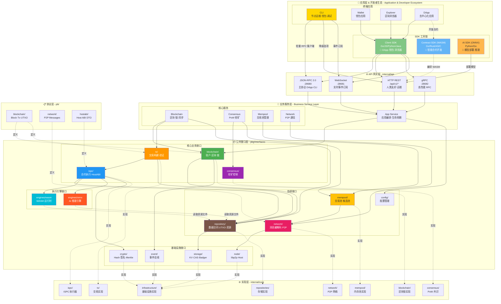

**架构层次说明**：

| 层次 | 定位 | 核心职责 | 典型组件 | 关键特性 |
|------|------|---------|----------|----------|
| **🎨 应用层 & 开发者生态** | 最外层 | 用户交互、开发工具、SDK 封装 | CLI/钱包/浏览器/DApp；Client SDK、Contract SDK (WASM)、AI SDK (ONNX) | 多语言支持、易集成、开发者友好 |
| **🌐 API 网关** | 对外接口 | 协议转换、路由分发、认证鉴权 | JSON-RPC 2.0 `:28680`、HTTP REST `/api/v1`、gRPC `:28682`、WebSocket `:28681` | 多协议、高性能、实时推送 |
| **💼 业务服务层** | 业务编排 | 业务逻辑协调、跨模块编排 | App/Blockchain/Consensus/Network/Mempool Service | 高内聚、松耦合、可扩展 |
| **📦 公共接口层** | 抽象契约 | 接口定义、依赖倒置、版本管理、资源管理 | blockchain/tx/ispc/consensus/mempool/network/repository(含静态+可执行资源)/engines | 接口稳定、向后兼容、可替换实现、内容寻址 |
| **⚙️ 实现层** | 具体实现 | 核心算法、性能优化、持久化、执行引擎 | internal/core/*；WASM/ONNX引擎 | 高性能、可测试、模块化 |
| **📋 协议层** | 数据定义 | 跨语言数据结构、序列化协议 | pb/blockchain、pb/network、pb/hostabi、pb/resource | 平台中立、前后兼容、类型安全 |

**关键设计原则**：

| 原则 | 说明 | 价值 |
|------|------|------|
| **🔄 依赖倒置（DIP）** | 高层模块依赖接口抽象，不依赖具体实现 | 实现可替换、系统可演进 |
| **⬇️ 单向依赖** | 应用层 → API → 业务层 → 接口层 → 实现层，严禁循环依赖 | 架构清晰、易于理解与测试 |
| **🔒 接口稳定** | `pkg/interfaces` 作为稳定契约层，实现可自由演进 | 保护上层应用、降低维护成本 |
| **🧩 职责分离** | 每层职责明确，避免跨层调用和职责泄露 | 高内聚、低耦合 |
| **🚀 多协议支持** | JSON-RPC/HTTP/gRPC/WebSocket 协议并存，适配不同场景 | 灵活集成、性能与易用性平衡 |
| **🛠️ 完整 SDK 生态** | Client SDK（DApp）+ Contract SDK (WASM)（链上）+ AI SDK (ONNX)（模型）+ CLI（轻量） | 开发者友好、覆盖全栈场景 |

### **应用层与 SDK 体系**

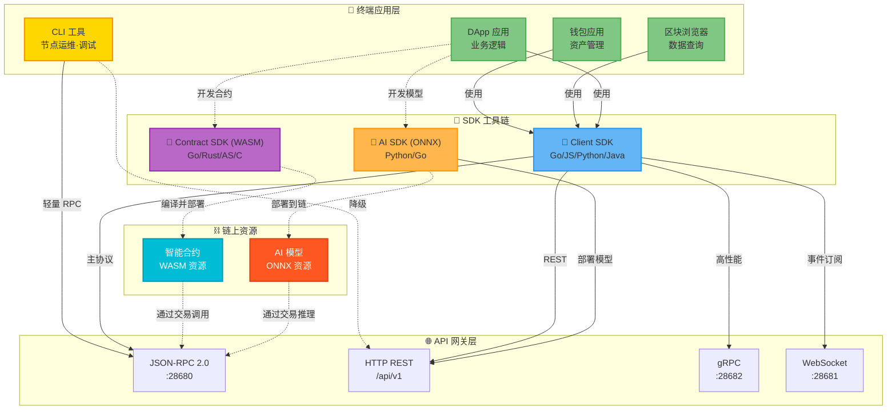

**工具与 SDK 体系说明**：

| 工具/SDK 类型 | 运行环境 | 主要语言 | 用途 | 目标用户 | 当前状态 |
|-------------|---------|---------|------|---------|----------|
| **CLI 工具** | 命令行（链外） | Go | 节点运维、命令行钱包、合约部署调试 | 节点运维者、高级用户、开发者 | ✅ 已实现<br/>📍 `cmd/wes/` |
| **Client SDK** | 链外（应用侧） | Go, JS/TS, Python, Java | DApp 开发、钱包开发、浏览器、交易构建/签名、API 封装 | DApp 开发者、应用开发者 | 📋 规划中 |
| **Contract SDK (WASM)** | 链上（WASM） | Go(TinyGo), Rust, AS, C | 智能合约开发、Host ABI 绑定 | 合约开发者 | ✅ Go 已有<br/>📍 `_sdks/contract-sdk-go/` |
| **AI SDK (ONNX)** | 混合 | Python, Go | AI 模型打包、部署、推理调用 | AI 开发者 | 📋 规划中 |

**关键区别**：

| 对比维度 | CLI 工具 | Client SDK | Contract SDK (WASM) | AI SDK (ONNX) |
|---------|---------|-----------|------------------|----------------|
| **定位** | 命令行工具 | 应用开发库 | 合约开发框架 | AI模型工具链 |
| **使用者** | 运维/高级用户 | DApp 开发者 | 合约开发者 | AI开发者 |
| **通信方式** | 轻量 RPC 客户端 | 完整 SDK 封装 | 编译为 WASM | HTTP API + 部署工具 |
| **运行位置** | 用户终端 | 应用程序中 | 链上（节点内） | 开发环境/链上推理 |
| **典型场景** | `wes account balance` | `web3.eth.getBalance()` | `contract.transfer()` | `wes-ai deploy model.onnx` |
| **参考产品** | bitcoin-cli, geth, solana | web3.js, ethers.js | Solidity, ink! | Hugging Face Hub, ONNX Runtime |

#### **0. CLI 工具（命令行运维工具）**

**定位**: 节点运维工具 + 基础命令行钱包 + 开发者调试工具

**核心职责**：
- 🛠️ 节点运维 - 查询节点状态、同步进度、连接管理
- 💼 命令行钱包 - 本地密钥管理、余额查询、**基础转账**
- 🔧 开发者调试 - 合约部署、简单合约调用、事件查询
- 📊 链状态查询 - 区块、交易、账户、UTXO 查询
- ⛏️ 挖矿控制 - 启动/停止挖矿、查看挖矿状态

**职责边界** (详见 [CLI架构规范](../../_docs/architecture/CLI_ARCHITECTURE_SPECIFICATION.md#114-cli-职责边界矩阵))：

| 功能类型 | CLI实现 | 说明 |
|---------|---------|------|
| ✅ **应该做** | 节点运维、基础查询、**简单转账**(1对1)、合约部署 | CLI专注基础场景，实现简单直接 |
| ✅ **可以做** | 开发辅助工具、挖矿控制 | 提升开发体验 |
| ❌ **不应该做** | 批量转账、复杂质押、治理投票、DeFi操作 | 交给Client SDK实现 |

**业务逻辑层** (`client/core`):
- ✅ **包含基础业务逻辑**: 简单转账、合约部署等基础操作的业务封装
- ✅ **允许合理重复**: 与SDK在基础功能上可重复，但实现更简单（90%场景）
- ❌ **不追求完整语义**: 不实现批量操作、高级策略、复杂编排
- 📍 **代码位置**: `client/core/builder/` - 交易构建，`client/core/wallet/` - 本地签名

**CLI vs Client SDK区别**：
- **CLI**: 轻量工具，基础功能，简化实现，适合命令行操作
- **Client SDK**: 完整功能库，生产级质量，高级特性，适合应用集成

**技术实现**：
- ✅ 完全独立：通过子进程托管或连接远程节点
- ✅ 轻量级 RPC 客户端（不依赖 internal/* 模块）
- ✅ JSON-RPC 2.0（主协议） + REST（降级选项）
- ✅ WebSocket（事件订阅）
- ✅ 本地钱包 Keystore（加密存储私钥）
- ✅ 首次引导流程（自动检测并引导用户）

**运行方式**：
- **独立模式**（推荐）：连接远程节点或自动启动本地测试节点
- **子进程托管**：CLI 自动启动节点子进程（开发/测试）
- **配置位置**：`~/.wes-cli/config.json`

**对标项目**：bitcoin-cli、geth、solana CLI、gaiad

**架构变更**：
- ✅ 已完成：从 `internal/cli` 迁移到 `cmd/wes/`（2025-11-26）
- ✅ 旧代码归档：`_archived/old-internal-cli/`
- ✅ 支持库：`client/`（launcher、pkg/ux、pkg/transport、pkg/wallet）

**代码位置**：
- CLI 入口：`cmd/wes/main.go` → 编译为 `bin/wes`
- 节点入口：`cmd/weisyn-node/main.go` → 编译为 `bin/weisyn-node`
- 支持库：`client/launcher/`（子进程管理）、`client/pkg/`（UI、传输、钱包）

**使用示例**：
```bash
# 编译
go build -o bin/wes ./cmd/wes
go build -o bin/weisyn-node ./cmd/weisyn-node

# 首次运行（自动引导）
./bin/wes

# 自动启动本地测试节点 + CLI
./bin/wes --autostart --env testing

# 连接远程节点
WES_ENDPOINT=https://mainnet.wes.io/jsonrpc ./bin/wes
```

> **📝 架构迁移说明（2025-11-26）**
> 
> CLI 已完成重大架构重构：
> - ✅ 从 `internal/cli` 迁移到 `cmd/wes/`
> - ✅ 完全独立：不再依赖 `internal/*` 模块
> - ✅ 子进程模型：通过 API 与节点交互，支持远程连接
> - ✅ 首次引导：自动检测并引导用户启动节点
> - 📦 旧代码归档：`_archived/old-internal-cli/`（保留3个月）
> 
> 详见：[CLI 重构完成报告](../../docs/CLI_REFACTOR_COMPLETE.md)

---

#### **1. Client SDK（链外应用侧）**

**核心职责**：
- 🔐 交易构建与签名（离线/在线）
- 🌐 封装 HTTP/gRPC/WebSocket/GraphQL 调用
- 📡 事件订阅与实时通知
- 🔑 账户与密钥管理
- 📦 资源上传与查询
- 🔄 重试、缓存、连接池管理

**语言支持**：Go → JS/TS → Python → Java（按优先级）

**版本绑定**：API 版本（REST: `/api/v1`；gRPC: proto 包版本）

**对标项目**：Web3.js、Ethers.js、CosmJS、Fabric SDK

**与 CLI 的区别**：
- Client SDK：完整功能、适合集成到应用、多语言支持
- CLI 工具：轻量级、适合命令行操作、仅 Go 实现

---

#### **2. Contract SDK (WASM)（链上智能合约）**

**核心职责**：
- 🔗 Host ABI 语言绑定（`//go:wasmimport` 等）
- 📝 合约基类与辅助函数（状态管理、事件发出）
- 🛡️ 类型安全封装（Address、Hash、Amount）
- ⚠️ 错误码与异常处理
- 📦 WASM 优化编译（TinyGo、wasm32-wasi）

**语言支持**：
- ✅ Go (TinyGo) - 已完成，位于 `_sdks/contract-sdk-go`
- 🚧 Rust - 骨架规划中
- 🚧 AssemblyScript - 骨架规划中
- 🚧 C/C++ - 骨架规划中

**版本绑定**：Host ABI 版本（v1.x 兼容策略）

**参考文档**：
- [Host ABI v1 规范](../../_docs/specs/contracts/HOST_ABI_V1.md)
- [Contract SDK Go README](../../_sdks/contract-sdk-go/README.md)

---

#### **3. AI SDK (ONNX)（混合场景）**

**核心职责**：
- 📋 模型清单（manifest）生成与校验
- 🔄 ONNX 格式转换与优化
- 🚀 模型部署与版本管理
- 🧠 推理请求构建（输入张量规范）
- 📊 结果解析与后处理
- 🔌 与 `/api/v1/ai/*` 端点协议对接

**语言支持**：Python（优先）、Go

**对应接口**：
- `pkg/interfaces/engines/ONNXEngine` - ONNX 推理引擎
- `ispc/HostABI` - 状态输出与计费/权限

**应用场景**：图像分类、文本分析、预测模型、链上 AI 计算

---

### **架构融合说明**

**✅ 已纳入架构**：
- Contract SDK (WASM) 已存在于 `_sdks/contract-sdk-go`，作为 Host ABI 官方绑定
- API 网关已实现于 `internal/api`（HTTP/gRPC/WebSocket）
- ONNX 引擎接口已定义于 `pkg/interfaces/engines/onnx.go`

**📋 待建设**：
- Client SDK 作为应用层标配（对标主流区块链项目）
- AI SDK (ONNX) 完善模型生命周期工具链
- 多语言 Contract SDK (WASM) 矩阵

---

### **版本与兼容策略**

| 组件 | 版本策略 | 兼容性保证 |
|------|----------|-----------|
| **Host ABI** | 语义化版本 v1.x.y | MAJOR 变更时不兼容；MINOR/PATCH 向后兼容 |
| **Contract SDK (WASM)** | 绑定 Host ABI | 同步 Host ABI MAJOR 版本 |
| **API (REST/gRPC)** | URL 路径/proto 包版本 | `/api/v1` → `/api/v2` 并存；proto v1/v2 独立包 |
| **Client SDK** | 独立语义化版本 | Adapter 适配 API 多版本 |
| **AI SDK (ONNX)** | 独立语义化版本 | 与 ONNX 标准版本对齐 |

**生成策略**：
- 提供 OpenAPI 3.0 与 Protobuf 描述
- 使用工具生成多语言客户端基础层（openapi-generator、protoc-gen-*）
- SDK 仅做最小增强：签名、序列化、重试、订阅、密钥管理

---

### **仓库与发布矩阵**

**现状**：`_sdks/` 为孵化区（暂存于主仓库）

**迁移计划**：

| 仓库名 | 内容 | 首次发布版本 | 状态 |
|--------|------|-------------|------|
| `weisyn/contract-sdk-go` | Contract SDK (WASM) - Go | v1.0.0 | 🚧 孵化中<br/>📍 `_sdks/contract-sdk-go/` |
| `weisyn/contract-sdk-rust` | Contract SDK (WASM) - Rust | v0.1.0 | 📋 规划中 |
| `weisyn/js-sdk` | Client SDK - JS/TS | v1.0.0 | 📋 规划中 |
| `weisyn/go-sdk` | Client SDK - Go | v1.0.0 | 📋 规划中 |
| `weisyn/python-sdk` | Client SDK - Python | v1.0.0 | 📋 规划中 |
| `weisyn/ai-sdk` | AI SDK (ONNX) - Python/Go | v0.1.0 | 📋 规划中 |

**策略说明**：
- 主仓库保留协议与接口文档，不保留语言特定实现
- 按 [SDK_REPOSITORY_MIGRATION_PLAN.md](../../_docs/architecture/SDK_REPOSITORY_MIGRATION_PLAN.md) 执行提取
- 独立仓库发布后，主仓库示例引用外部 SDK

---

### **落地路线图**

**短期（本仓内）**：
- ✅ 完成 Contract SDK (WASM) Go v1.0 功能开发
- 📋 补齐 OpenAPI 3.0 文档（`/api/v1`）
- 📋 生成 JS/Go Client SDK 基础层
- 📋 编写 AI `/api/v1/ai` 契约与示例

**中期（拆库独立）**：
- 📋 提取 `contract-sdk-go` 到独立仓库并发布 v1.0
- 📋 创建 `js-sdk` 与 `go-sdk` 仓库与 CI
- 📋 发布 `ai-sdk` (ONNX) v0.1（beta）
- 📋 创建 Rust/AS/C Contract SDK (WASM) 骨架

**长期（生态完善）**：
- 📋 完成多语言 SDK 矩阵（Client SDK: Go/JS/Python；Contract SDK (WASM): Go/Rust/AS/C）
- 📋 提供官方 DApp 示例与系统合约模板
- 📋 建立 SDK 版本兼容性测试矩阵
- 📋 发布 SDK 开发者文档站点

### **接口分层说明**

| 接口层次 | 核心职责 | 为什么这样设计 | 约束 |
|---------|---------|---------------|------|
| **核心业务接口** | 对外暴露主要业务能力 | 业务场景驱动，用户友好 | 必须保持向后兼容 |
| **协调接口** | 模块间协作和数据访问 | 解耦模块依赖，提供统一访问点 | 避免绕过协调层直接访问 |
| **基础设施接口** | 底层技术抽象 | 技术无关，支持多种实现 | 不包含业务语义 |

---

## 🔄 **核心流程** <sup>*可选*</sup>

### **流程1：完整交易处理流程（Off-chain + Host 双模式）**

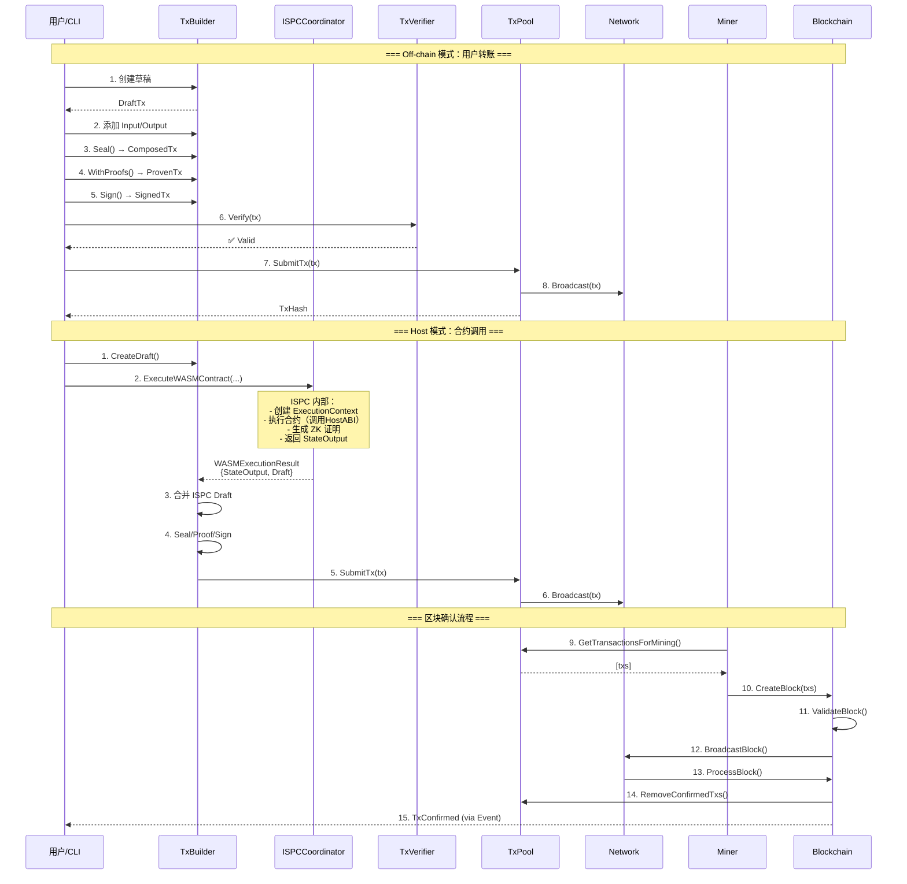

### **流程2：区块生产与验证**

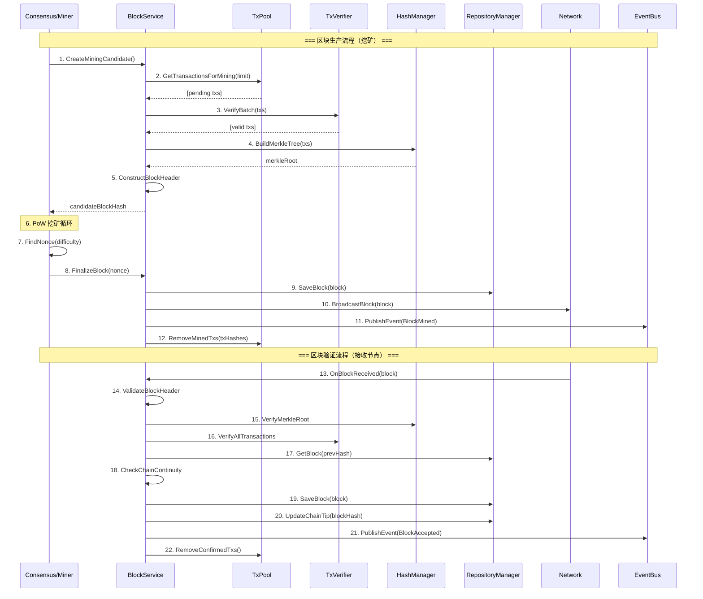

### **流程3：区块同步（新节点/落后节点）**

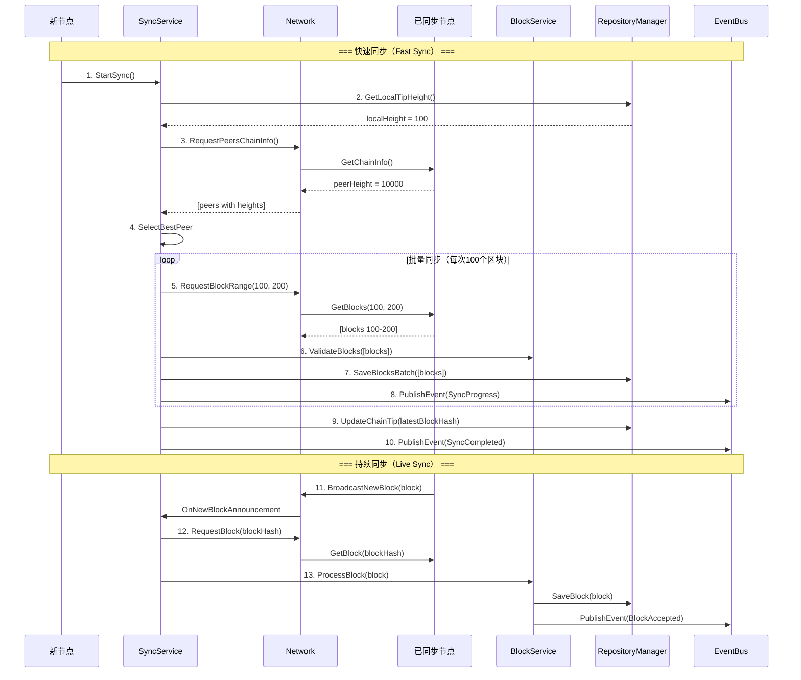

### **流程4：分叉检测与处理**

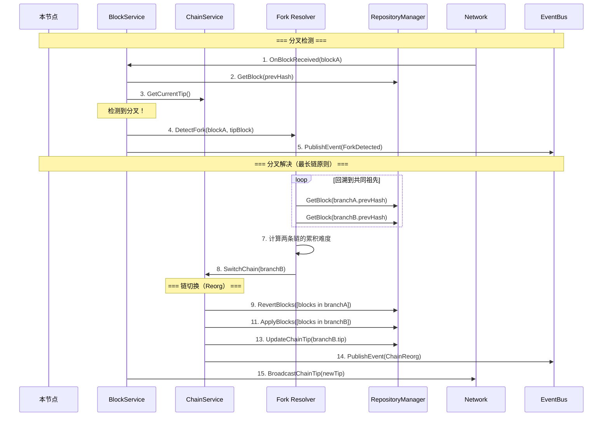

### **关键点**

| 阶段 | 核心逻辑 | 为什么这样做 | 约束条件 |
|------|---------|------------|---------|
| **交易构建** | 通过 TxBuilder 构建，支持 Draft 渐进式构建 | 灵活支持简单转账和复杂合约调用 | Draft 必须 Seal 后才能进入 Type-state |
| **交易验证** | 插件化验证（AuthZ/Conservation/Condition） | 支持 7 种权限验证，易于扩展 | 验证失败不提交，保证池中都是有效交易 |
| **区块生产** | 从 Mempool 选择交易，构建 Merkle 树 | 保证交易顺序和完整性验证 | 必须先验证交易，再构建区块 |
| **区块验证** | 多层验证（Header/Merkle/Transactions） | 保证区块合法性和链连续性 | 验证失败拒绝区块，不保存 |
| **区块同步** | 批量同步 + 持续同步 | 快速追赶 + 实时更新 | 必须验证后才保存 |
| **分叉处理** | 最长链原则 + 链切换（Reorg） | 保证全网共识一致 | Reorg 必须原子性执行 |

---

## 📁 **目录结构**

```
pkg/interfaces/
├── blockchain/                # 区块链核心接口 | 账户/区块/链/同步
│   ├── account.go            # AccountService | 账户抽象和余额查询
│   ├── block.go              # BlockService | 区块生产/验证/处理
│   ├── chain.go              # ChainService | 链管理/分叉处理
│   ├── sync.go               # SyncService | 区块同步
│   └── README.md
│
├── tx/                        # 交易接口 | Type-state 构建 + 插件化验证
│   ├── builder.go            # TxBuilder | 类型安全交易构建
│   ├── processor.go          # TxProcessor | 交易处理协调
│   ├── verifier.go           # TxVerifier | 插件化验证
│   ├── plugins.go            # AuthZ/Conservation/Condition 插件
│   ├── ports.go              # Signer/FeeEstimator/DraftStore 端口
│   └── README.md
│
├── ispc/                      # 执行协调接口 | WASM/ONNX 执行 + ZK 证明
│   ├── coordinator.go        # ISPCCoordinator | 执行协调器
│   ├── hostabi.go            # HostABI | 宿主函数接口
│   └── README.md
│
├── consensus/                 # 共识接口 | PoW 挖矿控制
│   ├── miner.go              # ConsensusService | 挖矿启停控制
│   └── README.md
│
├── mempool/                   # 内存池接口 | 交易池 + 候选池
│   ├── txpool.go             # TxPool | 交易池管理
│   ├── candidatepool.go      # CandidatePool | 候选区块池
│   └── README.md
│
├── network/                   # 网络接口 | 消息编解码 + 发布订阅
│   ├── network.go            # Network | 统一网络服务接口
│   └── README.md
│
├── repository/                # 数据访问接口 | UTXO/Block/Transaction/Resource
│   ├── repository.go         # RepositoryManager | 数据协调器
│   ├── utxo.go               # UTXOManager | UTXO 管理
│   ├── resource.go           # ResourceManager | 资源管理（静态资源+可执行资源）
│   └── README.md
│
├── config/                    # 配置接口 | 统一配置访问
│   ├── provider.go           # Provider | 配置提供者
│   ├── app.go                # AppOptions | 应用配置
│   └── README.md
│
├── infrastructure/            # 基础设施接口 | 底层技术抽象
│   ├── crypto/               # 密码学接口 | Hash/Signature/Key/Address/Merkle/POW
│   ├── storage/              # 存储接口 | Badger/Memory/SQLite/File/Temp/CAS
│   ├── log/                  # 日志接口 | Logger/LogLevel
│   ├── event/                # 事件接口 | EventBus/Subscriber/Publisher
│   ├── node/                 # 节点接口 | Host/PeerID/Stream
│   ├── kademlia/             # DHT 接口 | KBucket/Routing
│   ├── clock/                # 时钟接口 | Clock
│   └── README.md
│
├── engines/                   # 执行引擎接口 | WASM/ONNX
│   ├── wasm.go               # WASMEngine | WASM 执行引擎
│   ├── onnx.go               # ONNXEngine | ONNX 推理引擎
│   └── README.md
│
├── compliance/                # 合规接口 | 企业合规
│   └── compliance.go
│
├── INTERFACE_DESIGN_GUIDE.md  # 接口设计指南
└── README.md                  # 本文档
```

### **组织原则**

| 文件/目录 | 职责 | 为什么这样组织 |
|----------|------|---------------|
| **blockchain/** | 区块链核心业务接口 | 最高层业务抽象，用户友好 |
| **tx/** | 交易处理接口 | 独立的交易生命周期管理 |
| **ispc/** | 执行协调接口 | 合约执行的统一入口 |
| **mempool/** | 内存池接口 | 交易暂存和区块候选管理 |
| **network/** | 网络接口 | 消息传输的统一抽象 |
| **repository/** | 数据访问接口 | 数据操作的统一入口 |
| **infrastructure/** | 基础设施接口 | 技术无关的底层抽象 |
| **engines/** | 执行引擎接口 | WASM/ONNX 执行引擎抽象 |

---

## 📦 **资源管理架构**

### **资源类型体系**

WES 系统支持两大类资源：**静态资源**和**可执行资源**，统一通过内容寻址存储管理。

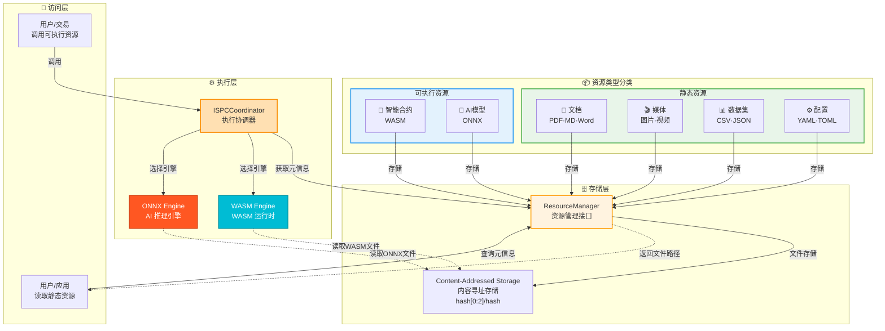

### **资源类型说明**

| 资源类型 | 子类型 | 存储方式 | 执行方式 | 典型用途 |
|---------|--------|---------|---------|---------|
| **静态资源** | 文档 | 内容寻址存储 | 直接读取 | 合同、证书、技术文档 |
| | 媒体 | 内容寻址存储 | 直接读取 | 图片、音视频、设计素材 |
| | 数据集 | 内容寻址存储 | 直接读取 | 机器学习数据、统计数据 |
| | 配置 | 内容寻址存储 | 直接读取 | 应用配置、系统参数 |
| **可执行资源** | 智能合约(WASM) | 内容寻址存储 | ISPC → WASM Engine | 链上业务逻辑、代币合约 |
| | AI推理模型(ONNX) | 内容寻址存储 | ISPC → ONNX Engine | 图像识别、NLP、预测分析 |

### **可执行资源执行流程**

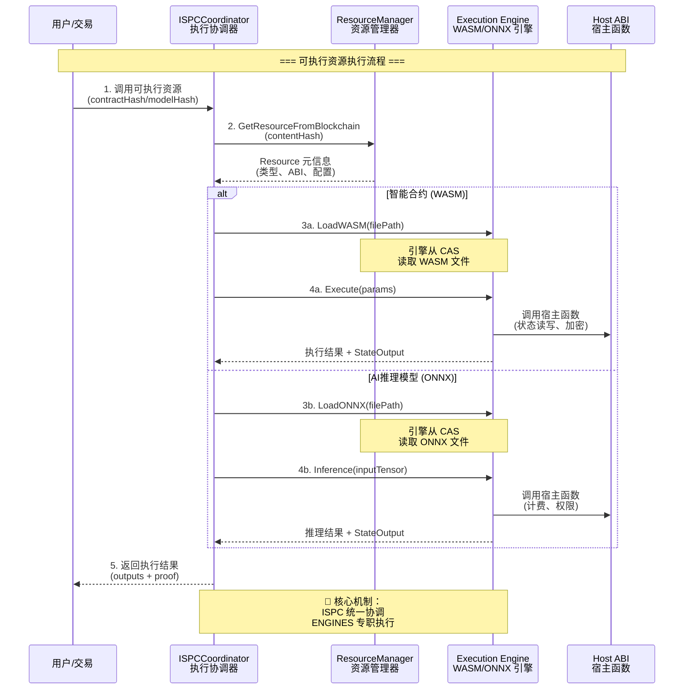

**执行流程说明**：

| 阶段 | 核心逻辑 | 为什么这样做 | 约束条件 |
|------|---------|------------|---------|
| **资源定位** | 通过 contentHash 从区块链查询元信息 | 内容寻址保证资源唯一性和完整性 | contentHash 必须是32字节 SHA-256 |
| **类型识别** | 根据 Resource.category 区分 WASM/ONNX | 不同类型需要不同的执行引擎 | 部署时必须正确设置 category |
| **引擎选择** | ISPC 根据类型选择对应的执行引擎 | 执行引擎专职处理特定类型资源 | 引擎必须在系统启动时注册 |
| **文件加载** | 引擎通过 ResourceManager 读取文件 | 统一的文件访问接口 | 文件必须存在于本地存储 |
| **执行隔离** | 通过 HostABI 限制资源访问权限 | 保证执行安全性和确定性 | 禁止直接系统调用 |
| **状态输出** | 执行结果通过 StateOutput 返回 | 支持状态变更和 ZK 证明 | 必须包含有效的执行证明 |

### **静态资源访问流程**

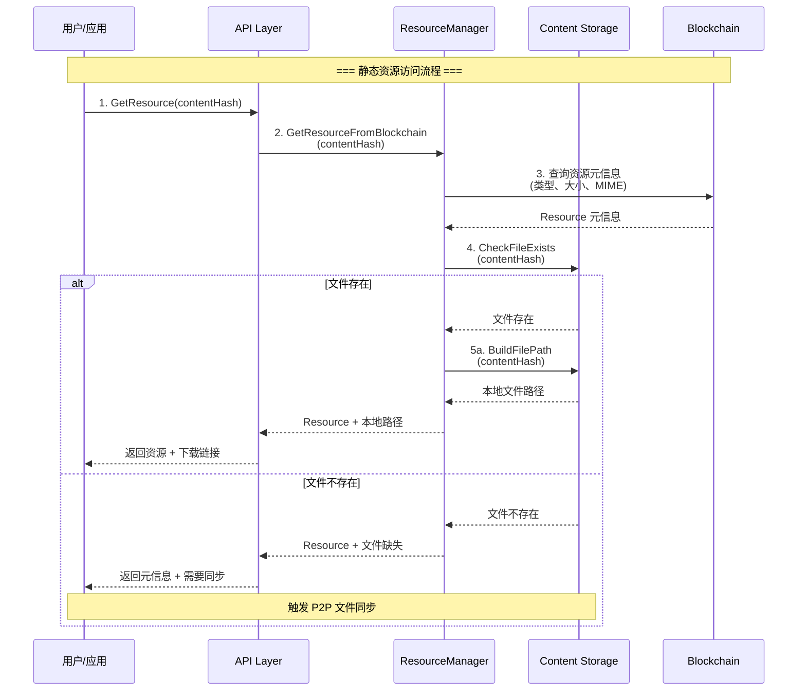

**关键特性**：

| 特性 | 说明 | 价值 |
|-----|------|------|
| **内容寻址** | 基于 SHA-256 内容哈希定位资源 | 天然去重、内容完整性验证 |
| **元信息分离** | 元信息存储在区块链，文件存储在本地 | 轻量级节点只需同步元信息 |
| **按需同步** | 文件可以延迟同步，不阻塞链同步 | 提高同步速度，降低存储需求 |
| **分层目录** | 使用 hash[0:2]/hash 二级目录 | 避免单目录文件过多 |
| **幂等存储** | 相同内容只存储一次 | 节省存储空间 |

---

## 🔗 **依赖与协作**

### **依赖关系图**

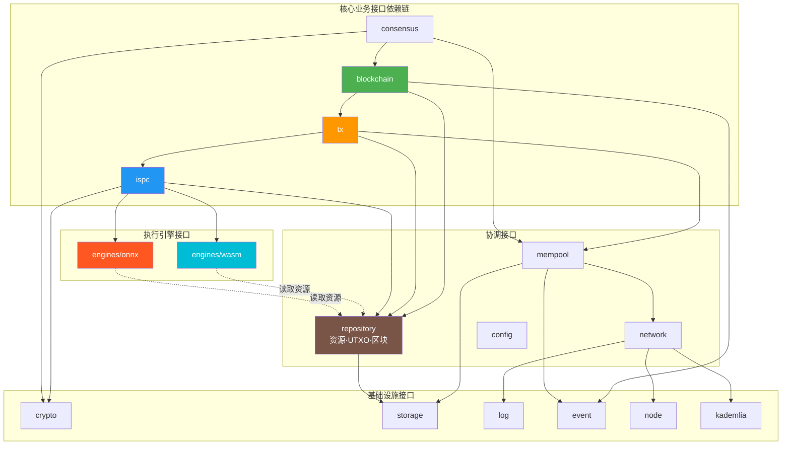

### **依赖说明**

| 依赖模块 | 依赖接口 | 用途 | 约束条件 |
|---------|---------|------|---------|
| **blockchain** | repository.RepositoryManager | 数据访问 | 只能通过 Repository 访问数据 |
| **blockchain** | tx.TxVerifier | 交易验证 | 必须先验证后处理 |
| **tx** | ispc.ISPCCoordinator | 合约执行 | 单向依赖，ISPC 不依赖 TX |
| **tx** | repository.UTXOManager | UTXO 查询 | 不能直接消费 UTXO |
| **ispc** | repository.ResourceManager | 资源文件访问 | 通过内容哈希获取资源元信息和文件 |
| **ispc** | engines.WASMEngine | WASM 执行 | 智能合约执行引擎 |
| **ispc** | engines.ONNXEngine | ONNX 推理 | AI 模型推理引擎 |
| **ispc** | crypto.HashManager | 哈希计算 | 通过 fx 依赖注入 |
| **engines/wasm** | repository.ResourceManager | 读取 WASM 文件 | 从内容寻址存储读取 |
| **engines/onnx** | repository.ResourceManager | 读取 ONNX 文件 | 从内容寻址存储读取 |
| **mempool** | network.Network | 广播交易 | 通过 Network 统一广播 |
| **repository** | storage.BadgerStore | 持久化存储 | 支持多种存储引擎 |
| **network** | node.Host | P2P 通信 | 通过 Host 统一管理连接 |

---

## 🎓 **使用指南**

### **典型场景 1：用户转账（完整流程）**

```mermaid
graph LR
    USER[用户] -->|1. 构建| TXBUILDER[TxBuilder]
    TXBUILDER -->|2. Draft| DRAFT[DraftTx]
    DRAFT -->|3. Seal| COMPOSED[ComposedTx]
    COMPOSED -->|4. WithProofs| PROVEN[ProvenTx]
    PROVEN -->|5. Sign| SIGNED[SignedTx]
    SIGNED -->|6. Verify| VERIFIER[TxVerifier]
    VERIFIER -->|7. Submit| TXPOOL[TxPool]
    TXPOOL -->|8. Broadcast| NETWORK[Network]
```

**关键点**：
- 输入要满足：SignedTx 必须有完整的 proof 和 signature
- 输出保证：SubmittedTx 已在 TxPool 中，网络已自动广播
- 注意事项：Type-state 强制正确顺序，不能跳过

### **典型场景 2：区块生产（挖矿）**

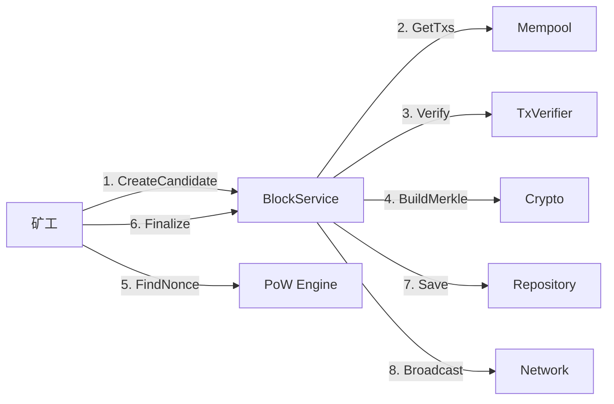

**关键点**：
- 输入要满足：Mempool 中有足够的待打包交易
- 输出保证：区块已保存且广播，交易已从 Mempool 移除
- 注意事项：必须先验证交易，再构建 Merkle 树

### **典型场景 3：合约调用（Host 模式）**

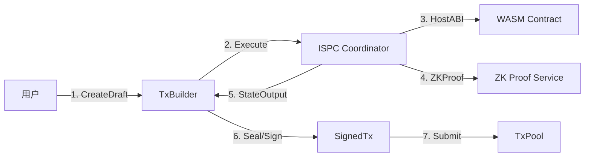

**关键点**：
- 输入要满足：合约已部署，参数格式正确
- 输出保证：StateOutput 包含有效 ZKProof
- 注意事项：ISPC 自包含，不依赖外部 TX 服务

### **常见误用**

| 误用方式 | 为什么错误 | 正确做法 |
|---------|-----------|---------|
| 跳过 Type-state 顺序 | 违反类型约束，编译器会报错 | 按照 Composed→Proven→Signed 顺序 |
| 绕过 Repository 直接访问存储 | 破坏数据一致性 | 通过 Repository 统一访问 |
| ISPC 依赖 TX 服务 | 造成循环依赖 | ISPC 自包含，通过 fx 注入必要服务 |
| 重复定义 UTXO 接口 | 接口泛滥 | 直接使用 repository.UTXOManager |

---

## ⚠️ **已知限制**

| 限制 | 影响 | 规避方法 | 未来计划 |
|------|------|---------|---------|
| 接口不能并发调用 | 某些接口（如 TxBuilder）不是并发安全的 | 每个 goroutine 使用独立实例 | 提供并发安全的 Builder |
| Type-state API 学习曲线 | 新手需要理解类型状态机 | 提供完整示例和文档 | 提供辅助工具简化使用 |
| 接口版本演进慢 | 新功能需要通过嵌入接口扩展 | 提前设计接口扩展点 | 建立接口版本管理机制 |
| Mock 测试复杂 | 某些接口依赖链较长 | 使用接口组合简化 Mock | 提供官方 Mock 实现 |

---

## 🔍 **设计权衡记录**

### **权衡 1：为什么使用 Type-state Pattern？**

**背景**：需要强制交易构建的正确顺序（组合→证明→签名→提交）

**备选方案**：
1. **Type-state Pattern**：通过类型系统强制顺序 - 优势：编译期防错，零运行时成本 - 劣势：API 略复杂
2. **运行时检查**：在每个方法中检查状态 - 优势：API 简单 - 劣势：运行时错误，有性能开销

**选择**：选择了 **Type-state Pattern**

**理由**：
- ✅ 编译期防错比运行时防错价值更高
- ✅ 零运行时成本，符合高性能要求
- ✅ 强制正确使用，减少用户错误

**代价**：
- API 略微复杂（需要 4 个类型状态）
- 用户需要理解 Type-state 概念

---

### **权衡 2：为什么 ISPC 不依赖 TX 接口？**

**背景**：ISPC 需要构建交易草稿，但不应该依赖 TX 层

**备选方案**：
1. **ISPC 调用 TX 服务**：方便复用 TX 逻辑 - 优势：代码复用 - 劣势：循环依赖
2. **ISPC 自包含**：内部维护 Draft - 优势：无循环依赖 - 劣势：需要独立实现

**选择**：选择了 **ISPC 自包含**

**理由**：
- ✅ 依赖方向：TX → ISPC（单向，无循环）
- ✅ ISPC 通过 fx 依赖注入获取必要服务
- ✅ 返回 StateOutput 给 TX 层使用，职责清晰

**代价**：
- ISPC 需要独立实现 Draft 逻辑
- 但这是合理的职责分离

---

### **权衡 3：为什么不在每个接口定义 UTXO 操作？**

**背景**：多个模块都需要访问 UTXO

**备选方案**：
1. **复用 repository.UTXOManager**：统一接口 - 优势：避免重复 - 劣势：依赖 repository
2. **每个模块定义自己的 UTXO 接口**：独立性 - 优势：解耦 - 劣势：接口泛滥

**选择**：选择了 **复用 repository.UTXOManager**

**理由**：
- ✅ Repository 已提供完整的 UTXO 查询能力
- ✅ 避免接口泛滥，保持架构简洁
- ✅ 符合"不重复定义"的设计原则

**代价**：
- 多个模块依赖 repository 模块
- 但这是合理的依赖关系

---

## 📚 **相关文档**

### **架构设计**
- **顶层架构**：[TX_STATE_MACHINE_ARCHITECTURE.md](../../_docs/architecture/TX_STATE_MACHINE_ARCHITECTURE.md) - TX 本质和 EUTXO 模型
- **组件规范**：[COMPONENT_ARCHITECTURE_SPECIFICATION.md](../../_docs/architecture/COMPONENT_ARCHITECTURE_SPECIFICATION.md) - 组件架构标准
- **接口设计指南**：[INTERFACE_DESIGN_GUIDE.md](./INTERFACE_DESIGN_GUIDE.md) - 接口设计最佳实践
 - **SDK 策略**：[NEW_SDK_STRATEGY.md](../../_docs/NEW_SDK_STRATEGY.md) - SDK 开发与孵化策略
 - **SDK 迁移计划**：[SDK_REPOSITORY_MIGRATION_PLAN.md](../../_docs/architecture/SDK_REPOSITORY_MIGRATION_PLAN.md) - 独立仓库与版本策略
 - **语言支持矩阵**：[LANGUAGE_SUPPORT_MATRIX.md](../../_docs/specs/contracts/LANGUAGE_SUPPORT_MATRIX.md) - 合约/客户端语言矩阵
 - **SDK 提取指南**：[SDK_EXTRACTION_GUIDE.md](../../_docs/guides/SDK_EXTRACTION_GUIDE.md) - 从主仓提取 SDK 的流程

### **各接口域文档**
- **blockchain/**：[blockchain/README.md](./blockchain/README.md) - 区块链核心接口
- **tx/**：[tx/README.md](./tx/README.md) - 交易接口
- **ispc/**：[ispc/README.md](./ispc/README.md) - 执行协调接口
- **consensus/**：[consensus/README.md](./consensus/README.md) - 共识接口
- **mempool/**：[mempool/README.md](./mempool/README.md) - 内存池接口
- **network/**：[network/README.md](./network/README.md) - 网络接口
- **repository/**：[repository/README.md](./repository/README.md) - 数据访问接口
- **infrastructure/**：[infrastructure/README.md](./infrastructure/README.md) - 基础设施接口

### **协议定义**
- **Transaction**：`pb/blockchain/block/transaction/transaction.proto` - 交易数据结构
- **Block**：`pb/blockchain/block/block.proto` - 区块数据结构
- **Network**：`pb/network/` - 网络消息定义

---

## 📋 **文档变更记录**

| 日期 | 变更内容 | 原因 |
|------|---------|------|
| 2025-10-27 | 更新CLI工具章节：明确职责边界和业务逻辑范围 | 明确CLI定位为"基础工具",添加职责边界表格和业务逻辑层说明,与CLI架构规范文档保持一致 |
| 2025-10-27 | 强调CLI vs Client SDK的区别 | 明确CLI实现简化版本(90%场景),SDK提供完整功能,允许合理重复 |
| 2025-10-26 | 统一 SDK 命名规范 | 将 "Contract SDK" 和 "AI/ONNX SDK" 统一为 "Contract SDK (WASM)" 和 "AI SDK (ONNX)"，明确标注核心技术标准，保持命名一致性 |
| 2025-10-26 | 更新CLI相关描述 | 反映CLI从 `internal/cli` 迁移到 `cmd/wes/` 的架构变更（2025-11-26完成） |
| 2025-10-26 | 修正所有图形的架构错误 | 修正SDK到引擎的连接、应用层与SDK体系结构、资源管理架构、依赖关系等图形 |
| 2025-10-26 | 新增"资源管理架构"章节 | 补充静态资源和可执行资源的完整描述，明确 ISPC 调用 ENGINES 执行机制 |
| 2025-10-26 | 添加资源类型体系图和执行流程图 | 清晰展示静态资源(文档/媒体/数据集/配置)和可执行资源(WASM合约/ONNX模型)的分类与执行方式 |
| 2025-10-26 | 更新目录结构说明 | 在 repository/resource.go 注释中明确标注静态资源+可执行资源 |
| 2025-10-23 | 新增"应用层与 SDK 体系"章节 | 明确 Client SDK/Contract SDK/AI SDK 定位与边界 |
| 2025-10-23 | 优化全局架构图为纵向布局 | 避免横向过宽，适配常规屏幕宽度 |
| 2025-10-23 | 补充 SDK 版本策略、发布矩阵与路线图 | 完善 SDK 生态建设规划 |
| 2025-10-23 | 增加架构层次表格说明 | 增强图形可读性与层次理解 |
| 2025-10-22 | 完整重构，按模板 v3.0 规范 | 根据架构串联讨论成果重构 |
| 2025-10-22 | 新增全局架构图和核心流程图 | 覆盖完整的区块链系统流程 |
| 2025-10-22 | 新增区块生产、同步、分叉流程 | 补充完整的业务流程说明 |
| 2025-10-22 | 新增设计权衡记录 | 记录关键架构决策 |

---

> 📝 **文档说明**
>
> 本文档遵循 `_docs/templates/README_TEMPLATE.md` v3.0 规范
>
> 🎯 **核心理念**：
> - 以图为主，文字为辅
> - 描述"是什么"和"为什么"，而非"如何实现"
> - 强调约束、权衡、核心机制
> - 覆盖完整的区块链系统流程（交易、区块、共识、同步、网络、分叉等）
>
> 🔄 **维护指南**
>
> 接口应保持稳定，新增功能优先通过接口嵌入扩展。
> 添加新接口时，必须更新本文档的架构图和依赖关系说明。
