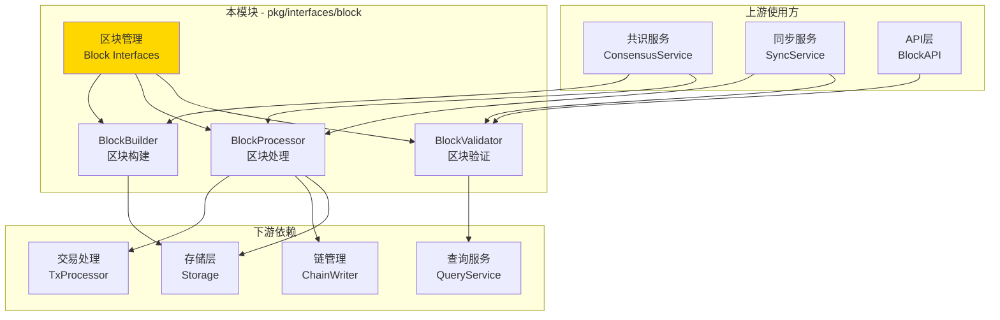
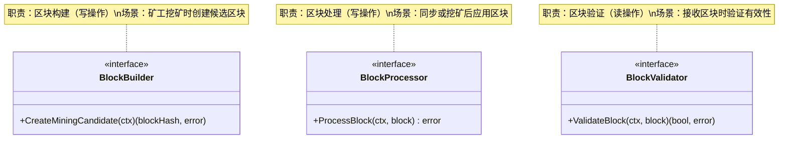

# Block - 公共接口

---

## 📌 版本信息

- **版本**：1.0
- **状态**：stable
- **最后更新**：2025-11-01
- **最后审核**：2025-11-01
- **所有者**：WES Block 开发组
- **适用范围**：WES 系统区块管理的公共接口定义

---

## 🎯 接口定位

**路径**：`pkg/interfaces/block/`

**目的**：定义区块管理的公共接口，提供区块构建、处理和验证能力，供其他组件依赖注入和调用。

**核心原则**：
- ✅ 遵循 CQRS 架构，读写分离
- ✅ 职责单一，接口清晰
- ✅ 直接操作存储层，避免循环依赖
- ✅ 保持接口稳定，向后兼容

**解决什么问题**：
- ✅ 区块的构建和打包（为矿工提供挖矿候选区块）
- ✅ 区块的处理和执行（执行交易、更新状态）
- ✅ 区块的验证（确保区块符合共识规则）

**不解决什么问题**（边界）：
- ❌ 区块查询（由 `pkg/interfaces/query/` 统一提供）
- ❌ 区块同步（由 SyncService 负责）
- ❌ 区块存储（由 infrastructure/storage 负责）

---

## 🏗️ 架构设计

### 整体架构

> **说明**：展示 Block 接口在系统中的位置、上游使用方和下游依赖



**架构说明**：

| 层级 | 组件 | 职责 | 关系 |
|-----|------|------|-----|
| **上游** | ConsensusService | 共识协调 | 使用 BlockBuilder 创建候选区块，使用 BlockProcessor 处理区块 |
| **上游** | SyncService | 区块同步 | 使用 BlockValidator 验证区块，使用 BlockProcessor 应用区块 |
| **本层** | Block Interfaces | 区块管理 | 提供构建、处理、验证能力 |
| **下游** | TxProcessor | 交易处理 | Block 依赖其执行交易 |
| **下游** | ChainWriter | 链状态写入 | Block 依赖其更新链尖 |
| **下游** | Storage | 数据存储 | Block 直接操作存储层 |
| **下游** | QueryService | 统一查询 | BlockValidator 通过其查询数据 |

---

### 接口全景

> **说明**：展示所有公共接口的定义和方法签名



**接口关系说明**：
- `BlockBuilder` 和 `BlockProcessor` 独立使用，不相互依赖
- `BlockValidator` 在 `BlockProcessor` 之前调用，确保区块有效
- 三个接口职责清晰，遵循 CQRS 读写分离原则

---

## 📐 接口列表

### 接口文件 1：`builder.go`

**接口对象**：`BlockBuilder`

**职责**：创建挖矿候选区块，供矿工挖矿使用

**方法列表**：

```go
type BlockBuilder interface {
    // CreateMiningCandidate 创建挖矿候选区块并返回区块哈希
    //
    // 创建挖矿候选区块供矿工挖矿。
    // 候选区块保存在内存缓存中，返回区块哈希作为标识符。
    CreateMiningCandidate(ctx context.Context) ([]byte, error)
}
```

**方法说明**：

| 方法名 | 职责 | 参数 | 返回值 | 备注 |
|-------|------|-----|-------|-----|
| `CreateMiningCandidate` | 创建挖矿候选区块 | `ctx context.Context` | `[]byte, error` | 返回区块哈希（32字节），候选区块在缓存中 |

**设计要点**：
- ✅ CQRS 写路径：构建是写操作
- ✅ 返回哈希减少传输：完整区块在缓存中
- ✅ 支持缓存机制：候选区块保存在内存中

---

### 接口文件 2：`processor.go`

**接口对象**：`BlockProcessor`

**职责**：处理区块，执行交易并更新区块链状态

**方法列表**：

```go
type BlockProcessor interface {
    // ProcessBlock 处理区块
    //
    // 执行区块中的交易，更新区块链状态，将区块添加到区块链中。
    ProcessBlock(ctx context.Context, block *core.Block) error
}
```

**方法说明**：

| 方法名 | 职责 | 参数 | 返回值 | 备注 |
|-------|------|-----|-------|-----|
| `ProcessBlock` | 处理区块 | `ctx context.Context`<br/>`block *core.Block` | `error` | 区块必须已通过验证，处理在事务中执行 |

**设计要点**：
- ✅ CQRS 写路径：处理是写操作
- ✅ 事务保证：处理必须在事务中执行
- ✅ 前置条件：区块必须已通过验证

---

### 接口文件 3：`validator.go`

**接口对象**：`BlockValidator`

**职责**：验证区块有效性，确保符合共识规则

**方法列表**：

```go
type BlockValidator interface {
    // ValidateBlock 验证区块
    //
    // 对区块进行完整验证，确保符合共识规则和协议要求。
    ValidateBlock(ctx context.Context, block *core.Block) (bool, error)
}
```

**方法说明**：

| 方法名 | 职责 | 参数 | 返回值 | 备注 |
|-------|------|-----|-------|-----|
| `ValidateBlock` | 验证区块 | `ctx context.Context`<br/>`block *core.Block` | `bool, error` | 返回验证结果和错误信息 |

**设计要点**：
- ✅ CQRS 读路径：验证是读操作，不修改状态
- ✅ 完整性验证：包括格式、签名、共识等
- ✅ 可调用 QueryService：查询相关数据

---

## 💡 使用示例

### 场景 1：矿工创建候选区块

```go
// 在共识服务中注入
type ConsensusService struct {
    blockBuilder block.BlockBuilder
}

func NewConsensusService(blockBuilder block.BlockBuilder) *ConsensusService {
    return &ConsensusService{
        blockBuilder: blockBuilder,
    }
}

// 创建挖矿候选区块
func (s *ConsensusService) CreateMiningTemplate() ([]byte, error) {
    ctx := context.Background()
    
    // 创建候选区块
    blockHash, err := s.blockBuilder.CreateMiningCandidate(ctx)
    if err != nil {
        return nil, fmt.Errorf("创建候选区块失败: %w", err)
    }
    
    log.Printf("候选区块已创建: %x", blockHash)
    return blockHash, nil
}
```

---

### 场景 2：验证并处理区块

```go
// 在同步服务中注入
type SyncService struct {
    blockValidator block.BlockValidator
    blockProcessor block.BlockProcessor
}

func NewSyncService(
    validator block.BlockValidator,
    processor block.BlockProcessor,
) *SyncService {
    return &SyncService{
        blockValidator: validator,
        blockProcessor: processor,
    }
}

// 同步区块
func (s *SyncService) SyncBlock(block *core.Block) error {
    ctx := context.Background()
    
    // 1. 验证区块
    valid, err := s.blockValidator.ValidateBlock(ctx, block)
    if err != nil {
        return fmt.Errorf("验证区块失败: %w", err)
    }
    if !valid {
        return fmt.Errorf("区块验证失败")
    }
    
    // 2. 处理区块
    if err := s.blockProcessor.ProcessBlock(ctx, block); err != nil {
        return fmt.Errorf("处理区块失败: %w", err)
    }
    
    log.Printf("区块同步成功: %x", block.Hash)
    return nil
}
```

---

### 场景 3：API层验证区块

```go
// 在 API 服务中注入
type BlockAPI struct {
    blockValidator block.BlockValidator
}

func NewBlockAPI(validator block.BlockValidator) *BlockAPI {
    return &BlockAPI{
        blockValidator: validator,
    }
}

// 验证用户提交的区块
func (api *BlockAPI) ValidateSubmittedBlock(
    ctx context.Context,
    block *core.Block,
) (*types.ValidationResult, error) {
    valid, err := api.blockValidator.ValidateBlock(ctx, block)
    if err != nil {
        return nil, err
    }
    
    return &types.ValidationResult{
        IsValid: valid,
        Message: "区块验证完成",
    }, nil
}
```

---

## 🔄 与内部接口的关系

**内部接口层**：`internal/core/block/interfaces/`

**关系说明**：
- 内部接口**嵌入**本公共接口
- 内部接口扩展组件内部运行所需的方法（如性能指标、内部状态等）
- 具体实现**只实现内部接口**，自动满足公共接口

**示意图**：

```
pkg/interfaces/block/              ← 您在这里（公共接口）
    ├── builder.go                 → BlockBuilder
    ├── processor.go               → BlockProcessor
    └── validator.go               → BlockValidator
    ↓ 嵌入/继承
internal/core/block/interfaces/    ← 内部接口（继承公共接口）
    ├── builder.go                 → InternalBlockBuilder (嵌入 BlockBuilder)
    ├── processor.go               → InternalBlockProcessor (嵌入 BlockProcessor)
    └── validator.go               → InternalBlockValidator (嵌入 BlockValidator)
    ↓ 实现
internal/core/block/               ← 具体实现
    ├── builder/                   → 实现 InternalBlockBuilder
    ├── processor/                 → 实现 InternalBlockProcessor
    └── validator/                 → 实现 InternalBlockValidator
```

**继承示例**：

```go
// 公共接口 (pkg/interfaces/block/builder.go)
type BlockBuilder interface {
    CreateMiningCandidate(ctx context.Context) ([]byte, error)
}

// 内部接口 (internal/core/block/interfaces/builder.go)
type InternalBlockBuilder interface {
    BlockBuilder  // 嵌入公共接口
    
    // 内部专用方法
    GetBuilderMetrics(ctx context.Context) (*BuilderMetrics, error)
}

// 具体实现 (internal/core/block/builder/service.go)
type Service struct {
    // ... 依赖
}

// 实现内部接口（自动满足公共接口）
func (s *Service) CreateMiningCandidate(ctx context.Context) ([]byte, error) {
    // 实现逻辑
}

func (s *Service) GetBuilderMetrics(ctx context.Context) (*BuilderMetrics, error) {
    // 内部方法实现
}
```

---

## 📊 接口稳定性

| 版本 | 稳定性 | 说明 |
|-----|-------|------|
| v1.0 | ✅ stable | 当前稳定版本，已在生产环境验证 |

**变更原则**：
- ✅ 新增方法：兼容性变更，次版本号 +1
- ⚠️ 修改方法签名：破坏性变更，主版本号 +1，需提前通知
- ❌ 删除方法：破坏性变更，主版本号 +1，需提供迁移指南

**兼容性承诺**：
- 公共接口保持向后兼容
- 内部接口可以更灵活变更
- 重大变更提前一个版本标记为 deprecated

---

## 📚 相关文档

### 设计文档
- [公共接口设计规范](../../../docs/system/designs/interfaces/public-interface-design.md)
- [代码组织规范](../../../docs/system/standards/principles/code-organization.md)

### 组件文档
- [Block 组件总览](../../../docs/components/core/block/README.md)
- [Block 业务文档](../../../docs/components/core/block/business.md)
- [Block 接口文档](../../../docs/components/core/block/interfaces.md)
- [Block 实现文档](../../../docs/components/core/block/implementation.md)

### 内部实现
- [内部接口目录](../../../internal/core/block/interfaces/README.md)
- [组件实现目录](../../../internal/core/block/README.md)

### 相关接口
- [Chain 接口](../chain/README.md) - 链管理接口
- [TX 接口](../tx/README.md) - 交易处理接口
- [Query 接口](../query/README.md) - 统一查询接口

---

## 📝 变更历史

| 版本 | 日期 | 变更内容 | 作者 |
|-----|------|---------|------|
| 1.0 | 2025-11-01 | 初始版本，定义 BlockBuilder、BlockProcessor、BlockValidator 接口 | WES Block 开发组 |

---

## ✅ 接口设计检查清单

- [x] CQRS 读写分离
- [x] 职责单一
- [x] 接口命名符合规范（*Builder, *Processor, *Validator）
- [x] 方法命名符合规范（Create*, Process*, Validate*）
- [x] 参数设计符合规范（context.Context 作为第一个参数）
- [x] 无循环依赖
- [x] 无 repository 依赖
- [x] 完整的注释文档
- [x] 使用示例完整
- [x] 版本信息完整

---

**维护说明**：
- 📝 保持版本信息和变更历史的及时更新
- 🔄 接口变更需同步更新文档和示例
- ✅ 新增接口需补充到接口列表和架构图
- 📚 重大变更需在相关文档中添加迁移指南

