# 区块链业务接口（pkg/interfaces/blockchain）

【模块定位】
　　本模块定义了WES区块链系统的业务导向公共接口层，为上层应用和组件提供完整的区块链业务操作抽象。通过业务需求驱动的接口设计，建立用户友好的操作入口，实现区块链核心功能的标准化访问，支持钱包、DApp、矿工、API服务等多种使用场景。

【设计原则】
- 业务导向：严格基于真实业务场景设计接口，确保实用性
- 统一架构：采用哈希+内存缓存架构，解决序列化问题
- 自治理念：区块链作为自运行系统，只暴露必要的外部接口
- 依赖注入：遵循fx框架，组件生命周期由框架统一管理
- 分层清晰：公共接口与内部实现严格分离，职责边界明确

【核心职责】
1. **账户管理抽象**：提供用户友好的账户操作和资产查询接口
2. **交易处理抽象**：定义完整的交易生命周期管理接口
3. **区块操作抽象**：为矿工和同步提供区块级操作接口
4. **链状态查询**：提供高效的链数据查询和状态检索接口
5. **资源管理抽象**：定义统一的资源部署和调用接口
6. **架构标准制定**：建立哈希+缓存的统一架构模式

【三层接口架构】

　　WES区块链业务接口采用分层设计，将复杂的区块链功能按使用场景和职责边界组织为三个清晰的层次，确保不同用户群体都能便捷地访问所需功能。

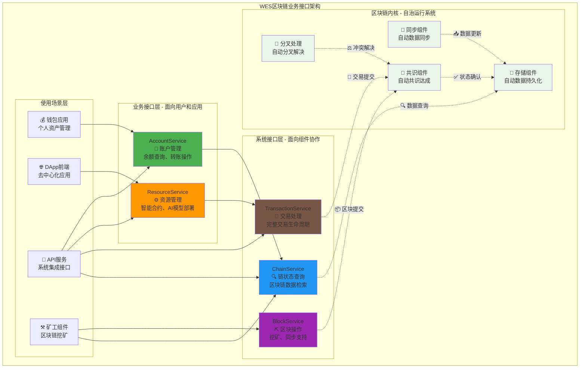
```mermaid
graph TB
    subgraph "WES区块链业务接口架构"
        subgraph "业务接口层 - 面向用户和应用"
            ACCOUNT["AccountService<br/>📱 账户管理<br/>余额查询、转账操作"]
            RESOURCE["ResourceService<br/>⚙️ 资源管理<br/>智能合约、AI模型部署"]
        end
        
        subgraph "系统接口层 - 面向组件协作"
            CHAIN["ChainService<br/>🔍 链状态查询<br/>区块链数据检索"]
            BLOCK["BlockService<br/>⛏️ 区块操作<br/>挖矿、同步支持"]
            TX["TransactionService<br/>💸 交易处理<br/>完整交易生命周期"]
        end
        
        subgraph "使用场景层"
            WALLET["💰 钱包应用<br/>个人资产管理"]
            DAPP["🌐 DApp前端<br/>去中心化应用"] 
            MINER["⚒️ 矿工组件<br/>区块链挖矿"]
            API["🔌 API服务<br/>系统集成接口"]
        end
        
        subgraph "区块链内核 - 自治运行系统"
            SYNC["🔄 同步组件<br/>自动数据同步"]
            FORK["🌿 分叉处理<br/>自动分叉解决"]
            CONSENSUS["🤝 共识组件<br/>自动共识达成"]
            STORAGE["💾 存储组件<br/>自动数据持久化"]
        end
    end
    
    %% 使用场景到业务接口的映射
    WALLET --> ACCOUNT
    DAPP --> RESOURCE
    API --> ACCOUNT
    API --> RESOURCE
    
    %% 组件到系统接口的协作
    MINER --> BLOCK
    MINER --> CHAIN
    API --> TX
    API --> CHAIN
    
    %% 业务接口到系统接口的依赖
    ACCOUNT --> CHAIN
    RESOURCE --> TX
    
    %% 系统接口到内核的交互
    CHAIN -.->|🔍 数据查询| STORAGE
    BLOCK -.->|📦 区块提交| CONSENSUS
    TX -.->|💸 交易提交| CONSENSUS
    
    %% 内核组件的自动协作
    SYNC -.->|📥 数据更新| STORAGE
    FORK -.->|⚖️ 冲突解决| CONSENSUS
    CONSENSUS -.->|✅ 状态确认| STORAGE
    
    style ACCOUNT fill:#4CAF50
    style RESOURCE fill:#FF9800
    style CHAIN fill:#2196F3
    style BLOCK fill:#9C27B0
    style TX fill:#795748
    style SYNC fill:#E8F5E8
    style FORK fill:#E8F5E8
    style CONSENSUS fill:#E8F5E8
    style STORAGE fill:#E8F5E8
```

**架构层次说明：**

1. **业务接口层**：面向最终用户和应用程序，提供高度抽象的业务操作入口
   - `AccountService`：个人和企业的资产管理、转账操作等用户友好功能
   - `ResourceService`：智能合约、AI模型等资源的部署和调用管理

2. **系统接口层**：面向系统组件和高级开发者，提供底层区块链操作能力
   - `ChainService`：区块链数据的高效查询和状态检索服务
   - `BlockService`：矿工挖矿、节点同步等区块级操作支持
   - `TransactionService`：完整的交易构建、签名、提交生命周期管理

3. **内核自治系统**：区块链的自运行核心，无需外部干预的自动化组件
   - 数据同步、分叉处理、共识达成、存储管理等均为内部自动协作
   - 外部接口不暴露内核控制方法，确保系统的稳定性和安全性

【哈希+缓存架构模式】

　　所有接口均采用统一的**哈希+内存缓存**架构，彻底解决protobuf序列化兼容性问题，实现高性能的区块链操作。

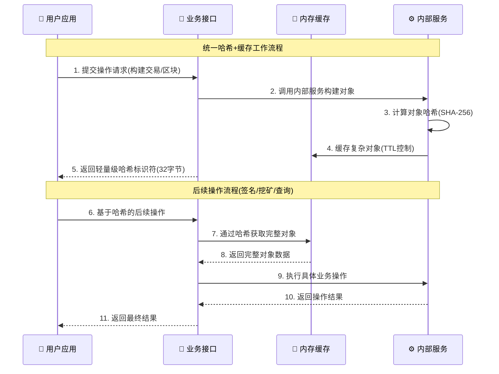
```mermaid
sequenceDiagram
    participant User as 👤 用户应用
    participant API as 🔌 业务接口
    participant Cache as 🧠 内存缓存
    participant Service as ⚙️ 内部服务
    
    Note over User,Service: 统一哈希+缓存工作流程
    
    User->>API: 1. 提交操作请求(构建交易/区块)
    API->>Service: 2. 调用内部服务构建对象
    Service->>Service: 3. 计算对象哈希(SHA-256)
    Service->>Cache: 4. 缓存复杂对象(TTL控制)
    API-->>User: 5. 返回轻量级哈希标识符(32字节)
    
    Note over User,Service: 后续操作流程(签名/挖矿/查询)
    
    User->>API: 6. 基于哈希的后续操作
    API->>Cache: 7. 通过哈希获取完整对象
    Cache-->>API: 8. 返回完整对象数据
    API->>Service: 9. 执行具体业务操作
    Service-->>API: 10. 返回操作结果
    API-->>User: 11. 返回最终结果
```

**架构优势：**
- **性能提升**：减少90%网络传输，避免大对象序列化
- **兼容性**：解决protobuf JSON序列化的oneof字段问题  
- **开发体验**：统一的哈希标识符，一致的操作模式
- **资源管理**：TTL自动清理，防止内存泄漏

【接口分层职责对比】

| **层级** | **接口** | **面向用户** | **核心职责** | **典型场景** | **复杂度** |
|----------|----------|--------------|--------------|--------------|------------|
| **业务层** | `AccountService` | 钱包用户、DApp | 账户抽象、资产管理 | 查余额、转账、多签 | ⭐⭐ |
| **业务层** | `ResourceService` | 开发者、DApp | 资源部署、调用管理 | 部署合约、调用AI模型 | ⭐⭐⭐ |
| **系统层** | `ChainService` | 查询服务、监控 | 区块链数据查询 | 获取区块、查交易状态 | ⭐⭐ |
| **系统层** | `BlockService` | 矿工、同步节点 | 区块级操作支持 | 创建候选区块、验证区块 | ⭐⭐⭐⭐ |
| **系统层** | `TransactionService` | 高级开发者 | 交易完整生命周期 | 构建、签名、提交交易 | ⭐⭐⭐⭐⭐ |

---

## 📁 **公共接口文件详解**

【接口文件架构】

```
pkg/interfaces/blockchain/
├── 📱 account.go          # AccountService - 用户友好的账户资产管理
├── ⚙️ resource.go         # ResourceService - 智能合约和AI模型管理  
├── 🔍 chain.go            # ChainService - 区块链状态查询服务
├── ⛏️ block.go            # BlockService - 矿工区块操作支持
├── 💸 transaction.go      # TransactionService - 交易完整生命周期
└── 📖 README.md          # 架构设计和使用指南

pkg/interfaces/consensus/
└── 🤝 engine.go           # ConsensusService - PoW挖矿协调服务
```

### **🎯 接口设计详解**

#### **1. 📱 AccountService (account.go) - 账户资产管理**

　　**设计理念**：为用户提供最直观的账户操作体验，隐藏复杂的UTXO模型细节。

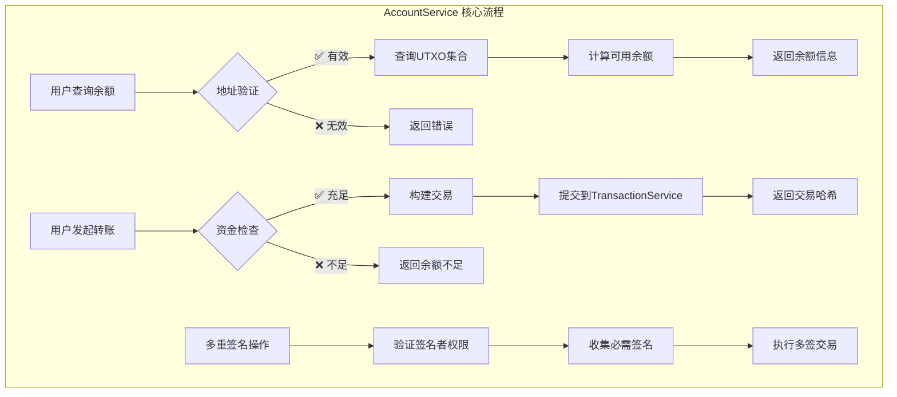
```mermaid  
flowchart TD
    subgraph "AccountService 核心流程"
        A[用户查询余额] --> B{地址验证}
        B -->|✅ 有效| C[查询UTXO集合]
        B -->|❌ 无效| D[返回错误]
        C --> E[计算可用余额]
        E --> F[返回余额信息]
        
        G[用户发起转账] --> H{资金检查}
        H -->|✅ 充足| I[构建交易]
        H -->|❌ 不足| J[返回余额不足]
        I --> K[提交到TransactionService]
        K --> L[返回交易哈希]
        
        M[多重签名操作] --> N[验证签名者权限]
        N --> O[收集必需签名]
        O --> P[执行多签交易]
    end
```

**核心方法流程详解：**

##### `GetPlatformBalance(address)` - 获取平台币余额

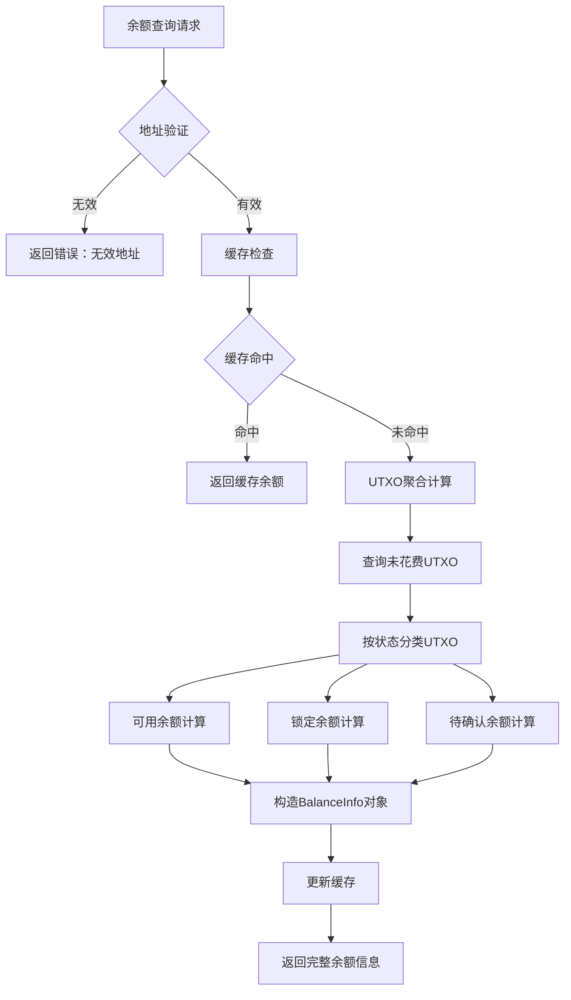
```mermaid
flowchart TD
    A[余额查询请求] --> B{地址验证}
    B -->|无效| C[返回错误：无效地址]
    B -->|有效| D[缓存检查]
    
    D --> E{缓存命中}
    E -->|命中| F[返回缓存余额]
    E -->|未命中| G[UTXO聚合计算]
    
    G --> H[查询未花费UTXO]
    H --> I[按状态分类UTXO]
    
    I --> J[可用余额计算]
    I --> K[锁定余额计算]
    I --> L[待确认余额计算]
    
    J --> M[构造BalanceInfo对象]
    K --> M
    L --> M
    
    M --> N[更新缓存]
    N --> O[返回完整余额信息]
```

##### `GetTransactionHistory(address, options)` - 查询交易历史

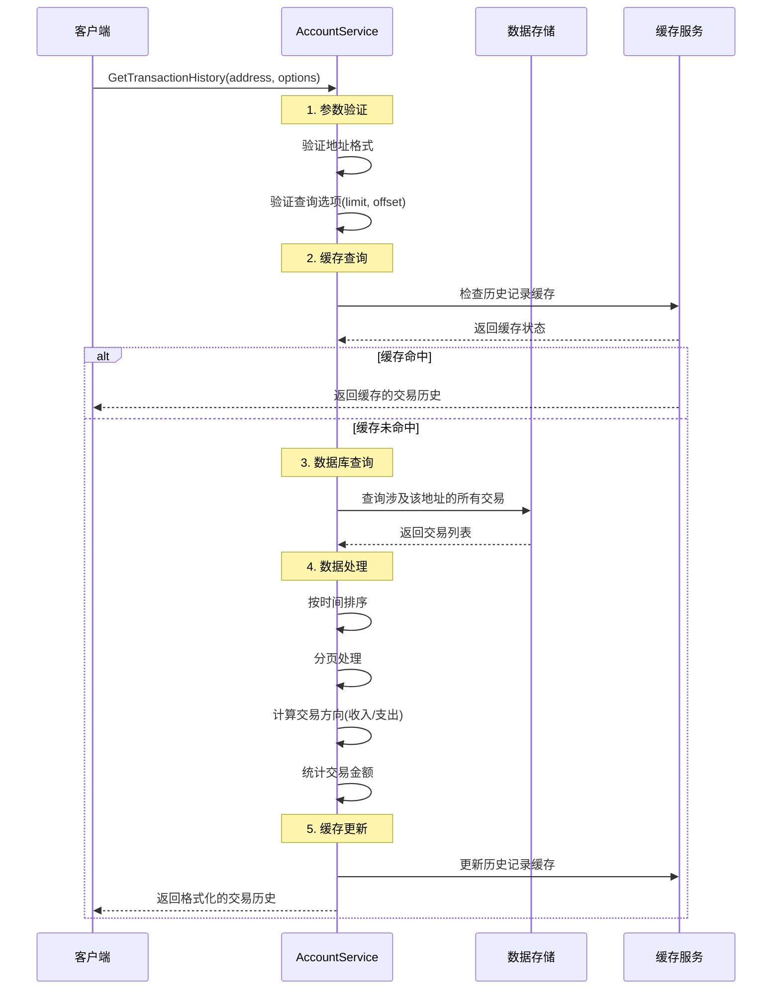
```mermaid
sequenceDiagram
    participant Client as 客户端
    participant AccountService as AccountService
    participant Repository as 数据存储
    participant Cache as 缓存服务
    
    Client->>AccountService: GetTransactionHistory(address, options)
    
    Note over AccountService: 1. 参数验证
    AccountService->>AccountService: 验证地址格式
    AccountService->>AccountService: 验证查询选项(limit, offset)
    
    Note over AccountService: 2. 缓存查询
    AccountService->>Cache: 检查历史记录缓存
    Cache-->>AccountService: 返回缓存状态
    
    alt 缓存命中
        Cache-->>Client: 返回缓存的交易历史
    else 缓存未命中
        Note over AccountService: 3. 数据库查询
        AccountService->>Repository: 查询涉及该地址的所有交易
        Repository-->>AccountService: 返回交易列表
        
        Note over AccountService: 4. 数据处理
        AccountService->>AccountService: 按时间排序
        AccountService->>AccountService: 分页处理
        AccountService->>AccountService: 计算交易方向(收入/支出)
        AccountService->>AccountService: 统计交易金额
        
        Note over AccountService: 5. 缓存更新
        AccountService->>Cache: 更新历史记录缓存
        AccountService-->>Client: 返回格式化的交易历史
    end
```

##### `CreateMultiSigAddress(pubkeys, threshold)` - 创建多签地址

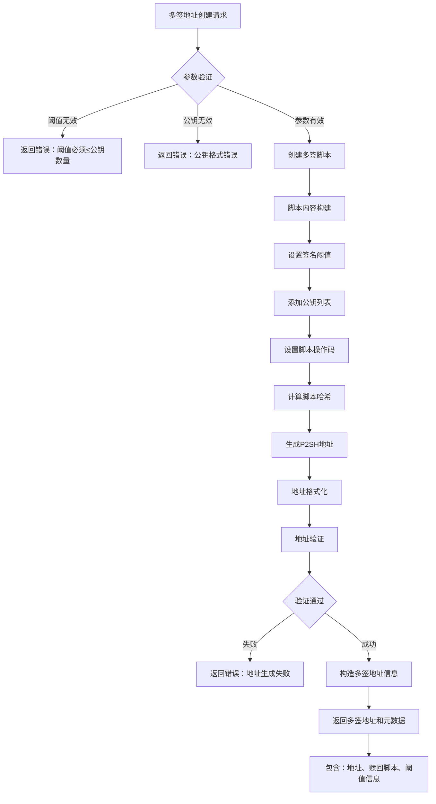
```mermaid
graph TD
    A[多签地址创建请求] --> B{参数验证}
    B -->|阈值无效| C[返回错误：阈值必须≤公钥数量]
    B -->|公钥无效| D[返回错误：公钥格式错误]
    B -->|参数有效| E[创建多签脚本]
    
    E --> F[脚本内容构建]
    F --> G[设置签名阈值]
    G --> H[添加公钥列表]
    H --> I[设置脚本操作码]
    
    I --> J[计算脚本哈希]
    J --> K[生成P2SH地址]
    K --> L[地址格式化]
    
    L --> M[地址验证]
    M --> N{验证通过}
    N -->|失败| O[返回错误：地址生成失败]
    N -->|成功| P[构造多签地址信息]
    
    P --> Q[返回多签地址和元数据]
    Q --> R[包含：地址、赎回脚本、阈值信息]
```

#### **2. ⚙️ ResourceService (resource.go) - 资源管理**

　　**设计理念**：统一管理智能合约、AI模型、数据文件等所有区块链资源。

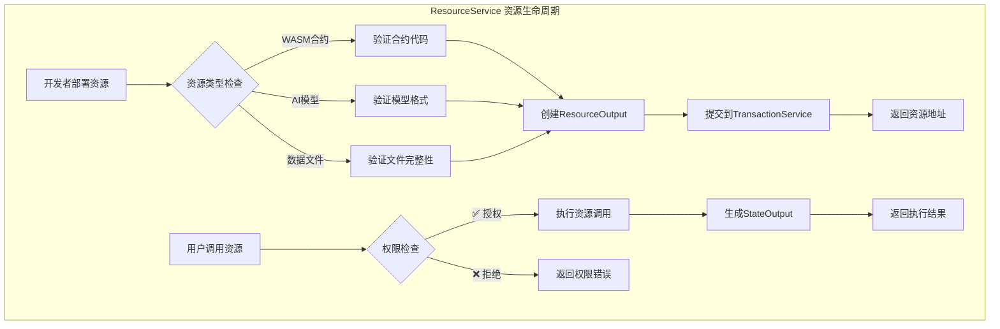
```mermaid
flowchart TD  
    subgraph "ResourceService 资源生命周期"
        A[开发者部署资源] --> B{资源类型检查}
        B -->|WASM合约| C[验证合约代码]
        B -->|AI模型| D[验证模型格式]  
        B -->|数据文件| E[验证文件完整性]
        
        C --> F[创建ResourceOutput]
        D --> F
        E --> F
        F --> G[提交到TransactionService]
        G --> H[返回资源地址]
        
        I[用户调用资源] --> J{权限检查}
        J -->|✅ 授权| K[执行资源调用]
        J -->|❌ 拒绝| L[返回权限错误]
        K --> M[生成StateOutput]
        M --> N[返回执行结果]
    end
```

**核心方法：**
- `DeployContract(wasmCode, config)` - 部署智能合约
- `DeployAIModel(modelData, config)` - 部署AI模型
- `CallContract(address, method, params)` - 调用智能合约
- `QueryResourceInfo(address)` - 查询资源信息

#### **3. 🔍 ChainService (chain.go) - 链状态查询**  

　　**设计理念**：提供高效的只读查询服务，支持监控和API集成。

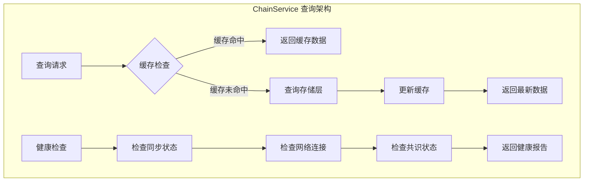
```mermaid
graph TD
    subgraph "ChainService 查询架构"
        A[查询请求] --> B{缓存检查}
        B -->|缓存命中| C[返回缓存数据]
        B -->|缓存未命中| D[查询存储层]
        D --> E[更新缓存]
        E --> F[返回最新数据]
        
        G[健康检查] --> H[检查同步状态]
        H --> I[检查网络连接]
        I --> J[检查共识状态]
        J --> K[返回健康报告]
    end
```

**核心方法：**
- `GetChainInfo()` - 获取链基本信息(高度、哈希等)
- `GetBlock(heightOrHash)` - 获取指定区块
- `GetTransaction(txHash)` - 获取交易详情  
- `GetNetworkStatus()` - 获取网络状态

#### **4. ⛏️ BlockService (block.go) - 区块操作**

　　**设计理念**：为矿工提供专业的区块级操作支持，实现高效挖矿。

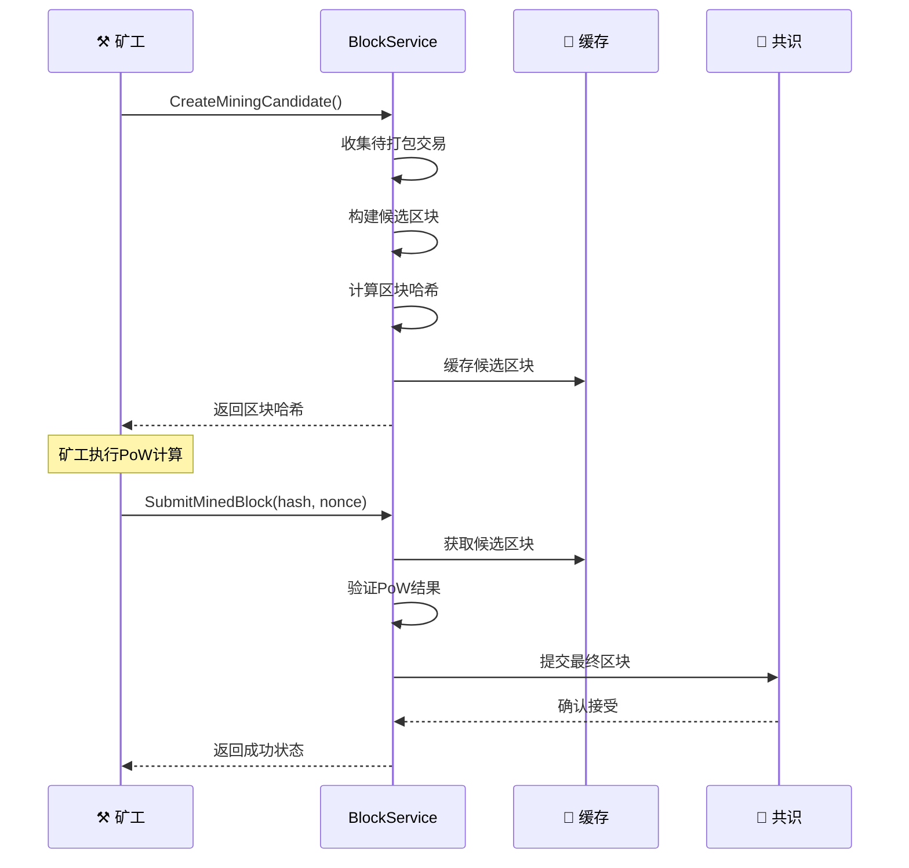
```mermaid
sequenceDiagram
    participant Miner as ⚒️ 矿工
    participant BS as BlockService  
    participant Cache as 🧠 缓存
    participant Consensus as 🤝 共识
    
    Miner->>BS: CreateMiningCandidate()
    BS->>BS: 收集待打包交易
    BS->>BS: 构建候选区块
    BS->>BS: 计算区块哈希
    BS->>Cache: 缓存候选区块
    BS-->>Miner: 返回区块哈希
    
    Note over Miner: 矿工执行PoW计算
    
    Miner->>BS: SubmitMinedBlock(hash, nonce)
    BS->>Cache: 获取候选区块
    BS->>BS: 验证PoW结果
    BS->>Consensus: 提交最终区块
    Consensus-->>BS: 确认接受
    BS-->>Miner: 返回成功状态
```

**核心方法流程详解：**

##### `CreateMiningCandidate(maxTxCount, maxSize)` - 创建挖矿候选区块

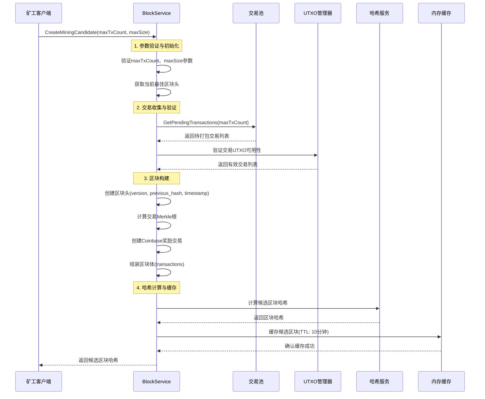
```mermaid
sequenceDiagram
    participant Miner as 矿工客户端
    participant BlockService as BlockService
    participant TxPool as 交易池
    participant UTXOManager as UTXO管理器
    participant HashService as 哈希服务
    participant Cache as 内存缓存
    
    Miner->>BlockService: CreateMiningCandidate(maxTxCount, maxSize)
    
    Note over BlockService: 1. 参数验证与初始化
    BlockService->>BlockService: 验证maxTxCount、maxSize参数
    BlockService->>BlockService: 获取当前最佳区块头
    
    Note over BlockService: 2. 交易收集与验证
    BlockService->>TxPool: GetPendingTransactions(maxTxCount)
    TxPool-->>BlockService: 返回待打包交易列表
    BlockService->>UTXOManager: 验证交易UTXO可用性
    UTXOManager-->>BlockService: 返回有效交易列表
    
    Note over BlockService: 3. 区块构建
    BlockService->>BlockService: 创建区块头(version, previous_hash, timestamp)
    BlockService->>BlockService: 计算交易Merkle根
    BlockService->>BlockService: 创建Coinbase奖励交易
    BlockService->>BlockService: 组装区块体(transactions)
    
    Note over BlockService: 4. 哈希计算与缓存
    BlockService->>HashService: 计算候选区块哈希
    HashService-->>BlockService: 返回区块哈希
    BlockService->>Cache: 缓存候选区块(TTL: 10分钟)
    Cache-->>BlockService: 确认缓存成功
    
    BlockService-->>Miner: 返回候选区块哈希
```

##### `SubmitMinedBlock(blockHash, nonce)` - 提交挖矿结果

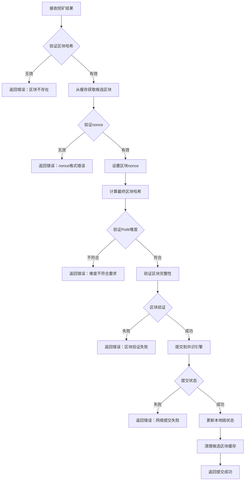
```mermaid
flowchart TD
    A[接收挖矿结果] --> B{验证区块哈希}
    B -->|无效| C[返回错误：区块不存在]
    B -->|有效| D[从缓存获取候选区块]
    
    D --> E{验证nonce}
    E -->|无效| F[返回错误：nonce格式错误]
    E -->|有效| G[设置区块nonce]
    
    G --> H[计算最终区块哈希]
    H --> I{验证PoW难度}
    I -->|不符合| J[返回错误：难度不符合要求]
    I -->|符合| K[验证区块完整性]
    
    K --> L{区块验证}
    L -->|失败| M[返回错误：区块验证失败]
    L -->|成功| N[提交到共识引擎]
    
    N --> O{提交状态}
    O -->|失败| P[返回错误：网络提交失败]
    O -->|成功| Q[更新本地链状态]
    Q --> R[清理候选区块缓存]
    R --> S[返回提交成功]
```

##### `ValidateBlock(block)` - 区块验证

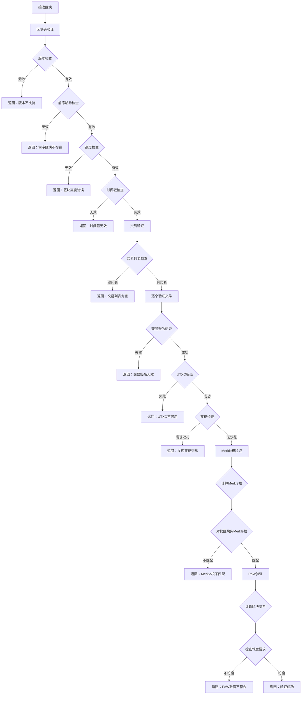
```mermaid
graph TD
    A[接收区块] --> B[区块头验证]
    
    B --> B1{版本检查}
    B1 -->|无效| E1[返回：版本不支持]
    B1 -->|有效| B2{前序哈希检查}
    B2 -->|无效| E2[返回：前序区块不存在]
    B2 -->|有效| B3{高度检查}
    B3 -->|无效| E3[返回：区块高度错误]
    B3 -->|有效| B4{时间戳检查}
    B4 -->|无效| E4[返回：时间戳无效]
    B4 -->|有效| C
    
    C[交易验证] --> C1{交易列表检查}
    C1 -->|空列表| E5[返回：交易列表为空]
    C1 -->|有交易| C2[逐个验证交易]
    
    C2 --> C3{交易签名验证}
    C3 -->|失败| E6[返回：交易签名无效]
    C3 -->|成功| C4{UTXO验证}
    C4 -->|失败| E7[返回：UTXO不可用]
    C4 -->|成功| C5{双花检查}
    C5 -->|发现双花| E8[返回：发现双花交易]
    C5 -->|无双花| D
    
    D[Merkle根验证] --> D1{计算Merkle根}
    D1 --> D2{对比区块头Merkle根}
    D2 -->|不匹配| E9[返回：Merkle根不匹配]
    D2 -->|匹配| F
    
    F[PoW验证] --> F1{计算区块哈希}
    F1 --> F2{检查难度要求}
    F2 -->|不符合| E10[返回：PoW难度不符合]
    F2 -->|符合| G[返回：验证成功]
```

#### **5. 💸 TransactionService (transaction.go) - 交易处理**

　　**设计理念**：管理交易的完整生命周期，从构建到确认的全流程。

> 📖 **详细交易指南**：完整的交易系统使用说明请参考 **[TRANSACTION_GUIDE.md](TRANSACTION_GUIDE.md)**
>
> 包含：
> - 🏗️ 统一交易架构和核心设计理念
> - 🎯 TransactionService、ContractService、AIModelService详细接口说明
> - 🔐 7种高级锁定机制（多签、时间锁、委托等）的业务友好封装
> - 🚀 基础到企业级的完整使用示例和最佳实践
> - 📊 监控运维和故障排查完整指南

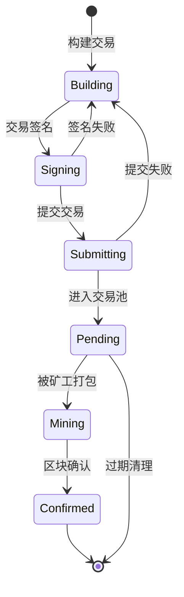
```mermaid
stateDiagram-v2
    [*] --> Building: 构建交易
    Building --> Signing: 交易签名
    Signing --> Submitting: 提交交易  
    Submitting --> Pending: 进入交易池
    Pending --> Mining: 被矿工打包
    Mining --> Confirmed: 区块确认
    Confirmed --> [*]
    
    Signing --> Building: 签名失败
    Submitting --> Building: 提交失败
    Pending --> [*]: 过期清理
```

**核心方法流程详解：**

##### `BuildTransaction(inputs, outputs)` - 构建未签名交易

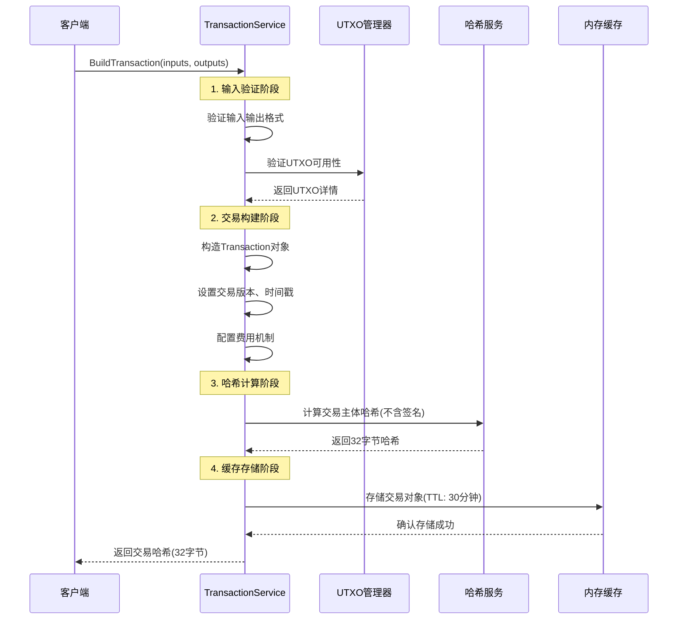
```mermaid
sequenceDiagram
    participant Client as 客户端
    participant TxService as TransactionService
    participant UTXOManager as UTXO管理器
    participant HashService as 哈希服务
    participant Cache as 内存缓存
    
    Client->>TxService: BuildTransaction(inputs, outputs)
    
    Note over TxService: 1. 输入验证阶段
    TxService->>TxService: 验证输入输出格式
    TxService->>UTXOManager: 验证UTXO可用性
    UTXOManager-->>TxService: 返回UTXO详情
    
    Note over TxService: 2. 交易构建阶段
    TxService->>TxService: 构造Transaction对象
    TxService->>TxService: 设置交易版本、时间戳
    TxService->>TxService: 配置费用机制
    
    Note over TxService: 3. 哈希计算阶段
    TxService->>HashService: 计算交易主体哈希(不含签名)
    HashService-->>TxService: 返回32字节哈希
    
    Note over TxService: 4. 缓存存储阶段
    TxService->>Cache: 存储交易对象(TTL: 30分钟)
    Cache-->>TxService: 确认存储成功
    
    TxService-->>Client: 返回交易哈希(32字节)
```

##### `SignTransaction(txHash, signatures)` - 交易签名

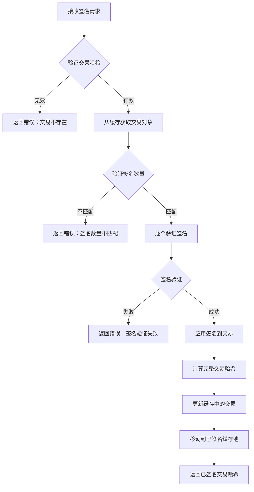
```mermaid
flowchart TD
    A[接收签名请求] --> B{验证交易哈希}
    B -->|无效| C[返回错误：交易不存在]
    B -->|有效| D[从缓存获取交易对象]
    
    D --> E{验证签名数量}
    E -->|不匹配| F[返回错误：签名数量不匹配]
    E -->|匹配| G[逐个验证签名]
    
    G --> H{签名验证}
    H -->|失败| I[返回错误：签名验证失败]
    H -->|成功| J[应用签名到交易]
    
    J --> K[计算完整交易哈希]
    K --> L[更新缓存中的交易]
    L --> M[移动到已签名缓存池]
    M --> N[返回已签名交易哈希]
```

##### `SubmitTransaction(signedTxHash)` - 提交交易

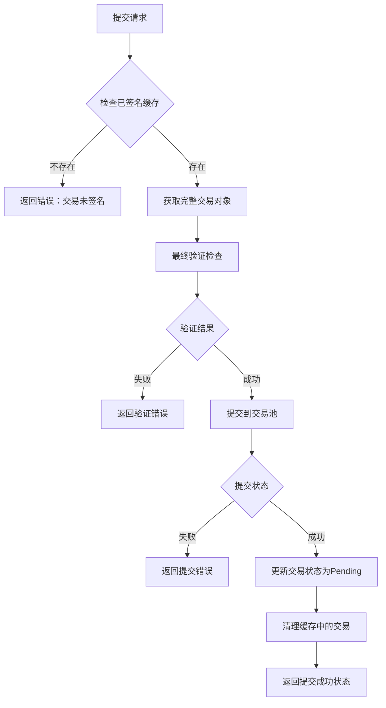
```mermaid
graph TD
    A[提交请求] --> B{检查已签名缓存}
    B -->|不存在| C[返回错误：交易未签名]
    B -->|存在| D[获取完整交易对象]
    
    D --> E[最终验证检查]
    E --> F{验证结果}
    F -->|失败| G[返回验证错误]
    F -->|成功| H[提交到交易池]
    
    H --> I{提交状态}
    I -->|失败| J[返回提交错误]
    I -->|成功| K[更新交易状态为Pending]
    K --> L[清理缓存中的交易]
    L --> M[返回提交成功状态]
```

### **删除的错误接口**
```
❌ 删除 sync.go：
- 同步是区块链内部自动服务，不应暴露公共接口
- GetSyncStatus功能合并到ChainService.GetChainInfo()

❌ 简化生命周期管理：
- 删除所有Start/Stop方法，fx框架自动管理
- 删除复杂的会话管理，简化为直接操作
```

---

## 🎯 **核心业务场景与接口映射**

### **真实业务场景分析**

#### **1. 用户场景**
```
✅ 真实需求："我有多少WES？"
→ AccountService.GetBalance(address) 

✅ 真实需求："转账给朋友"  
→ TransactionService.Transfer(from, to, amount)

✅ 真实需求："部署我的合约"
→ ResourceService.Deploy(contract)

✅ 真实需求："调用智能合约"
→ ResourceService.Call(contractAddr, method, params)
```

#### **2. 矿工场景**
```
✅ 真实需求："启动挖矿"
→ ConsensusService.StartMining(ctx, minerAddress)

✅ 真实需求："获取挖矿候选区块"
→ BlockService.CreateMiningCandidate(ctx, maxTxCount, maxBlockSize)
  内部自动调用：
  - ConsensusService.GetCurrentMinerAddress() 获取矿工地址
  - TxPool.GetTransactionsForMining() 获取优质交易

✅ 真实需求："我挖出了新区块"
→ BlockService.SubmitMinedBlock(ctx, block)

✅ 真实需求："我的链是最新的吗？"  
→ ChainService.GetChainInfo() → {height, hash, isSynced}

✅ 真实需求："网络状态如何？"
→ ChainService.GetNetworkStatus() → {peers, latency}
```

#### **3. API服务场景**
```
✅ 真实需求："用户余额查询准确吗？"
→ ChainService.IsDataFresh() → bool

✅ 真实需求："这个交易状态如何？"  
→ TransactionService.GetTransactionStatus(txHash)

✅ 真实需求："查询指定区块"
→ BlockService.GetBlock(heightOrHash)
```

#### **4. 监控场景**
```
✅ 真实需求："系统健康度如何？"
→ ChainService.GetSystemHealth() → {ready, synced, errors}

✅ 真实需求："网络连接正常吗？"
→ ChainService.GetNetworkStatus() → {connected, peers}
```

### **删除的伪需求**
```
❌ 错误设计："手动触发同步"
- 区块链同步是自动的，无需外部触发

❌ 错误设计："停止同步服务"  
- 区块链必须持续同步，不应允许外部停止

❌ 错误设计："复杂的恢复接口"
- 数据问题的解决方案就是重新同步，不需要复杂恢复逻辑

❌ 错误设计："生命周期管理"
- fx框架管理组件生命周期，接口无需Start/Stop
```

---

## 🔐 **哈希+缓存架构详解**

### **架构统一原则**

　　为了确保系统架构的一致性和可维护性，WES区块链采用统一的**哈希+内存缓存**架构模式。这一设计彻底解决了protobuf序列化问题，大幅提升了系统性能和开发体验。

### **哈希计算分层策略**

#### **交易哈希分层**
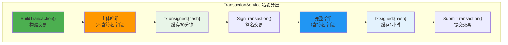
```mermaid
graph TB
    subgraph "TransactionService 哈希分层"
        BUILD["BuildTransaction()<br/>构建交易"]
        MAIN_HASH["主体哈希<br/>（不含签名字段）"]
        CACHE1["tx:unsigned:{hash}<br/>缓存30分钟"]
        SIGN["SignTransaction()<br/>签名交易"]
        FULL_HASH["完整哈希<br/>（含签名字段）"]
        CACHE2["tx:signed:{hash}<br/>缓存1小时"]
        SUBMIT["SubmitTransaction()<br/>提交交易"]
    end
    
    BUILD --> MAIN_HASH
    MAIN_HASH --> CACHE1
    CACHE1 --> SIGN
    SIGN --> FULL_HASH
    FULL_HASH --> CACHE2
    CACHE2 --> SUBMIT
    
    style BUILD fill:#4CAF50
    style MAIN_HASH fill:#FF9800
    style FULL_HASH fill:#2196F3
    style CACHE1 fill:#E8F5E8
    style CACHE2 fill:#E3F2FD
```

#### **区块哈希分层**
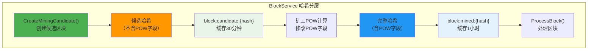
```mermaid
graph TB
    subgraph "BlockService 哈希分层"
        CREATE["CreateMiningCandidate()<br/>创建候选区块"]
        CANDIDATE_HASH["候选哈希<br/>（不含POW字段）"]
        CACHE3["block:candidate:{hash}<br/>缓存30分钟"]
        MINING["矿工POW计算<br/>修改POW字段"]
        MINED_HASH["完整哈希<br/>（含POW字段）"]
        CACHE4["block:mined:{hash}<br/>缓存1小时"]
        PROCESS["ProcessBlock()<br/>处理区块"]
    end
    
    CREATE --> CANDIDATE_HASH
    CANDIDATE_HASH --> CACHE3
    CACHE3 --> MINING
    MINING --> MINED_HASH
    MINED_HASH --> CACHE4
    CACHE4 --> PROCESS
    
    style CREATE fill:#4CAF50
    style CANDIDATE_HASH fill:#FF9800
    style MINED_HASH fill:#2196F3
    style CACHE3 fill:#E8F5E8
    style CACHE4 fill:#E3F2FD
```

### **缓存管理策略**

#### **缓存键命名规范**
- **未签名交易**: `tx:unsigned:{hex(txHash)}` (TTL: 30分钟)
- **已签名交易**: `tx:signed:{hex(txHash)}` (TTL: 1小时)
- **候选区块**: `block:candidate:{hex(blockHash)}` (TTL: 30分钟)
- **完整区块**: `block:mined:{hex(blockHash)}` (TTL: 1小时)
- **多签会话**: `tx:multisig:{sessionID}` (TTL: 可配置)

#### **缓存清理策略**
- **过期自动清理**: 基于TTL的自动过期机制
- **内存压力清理**: 内存使用超过阈值时的LRU清理
- **主动清理接口**: ClearTransactionCache()和ClearBlockCache()方法

### **架构优势总结**

#### **性能优势**
- ✅ **减少90%网络传输**: 只传递32字节哈希而非完整对象
- ✅ **零序列化开销**: 避免protobuf JSON兼容性问题
- ✅ **高效缓存命中**: 基于哈希的O(1)缓存访问

#### **开发体验优势**
- ✅ **统一编程模式**: Transaction和Block采用相同的哈希+缓存模式
- ✅ **降低认知负担**: 开发者只需学习一套架构模式
- ✅ **便于测试**: 缓存分离使单元测试更简单

#### **系统架构优势**
- ✅ **支持修改操作**: 签名和挖矿类似交易的"修改"过程
- ✅ **状态管理清晰**: 哈希变化反映对象状态变化
- ✅ **并发安全**: 不可变哈希确保并发访问安全

---

## ⛏️ **挖矿组件协作架构**

### **挖矿系统设计理念**

　　基于"矿工自己的事"和"统一缓存架构"双重理念，挖矿过程采用哈希+缓存模式，实现高性能的内部协作。各组件职责清晰，协作高效：

- **ConsensusService**: 管理挖矿状态，提供矿工地址
- **BlockService**: 创建区块候选哈希，通过缓存提供完整区块  
- **TxPool**: 提供优质交易供区块打包
- **BlockCache**: 管理候选区块的内存缓存

### **挖矿流程协作图（哈希+缓存模式）**

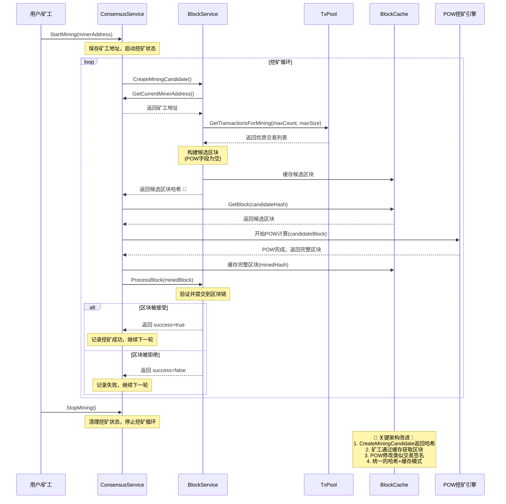
```mermaid
sequenceDiagram
    participant User as 用户/矿工
    participant CS as ConsensusService
    participant BS as BlockService
    participant TP as TxPool
    participant Cache as BlockCache
    participant Mining as POW挖矿引擎
    
    User->>CS: StartMining(minerAddress)
    Note over CS: 保存矿工地址，启动挖矿状态
    
    loop 挖矿循环
        CS->>BS: CreateMiningCandidate()
        BS->>CS: GetCurrentMinerAddress()
        CS-->>BS: 返回矿工地址
        
        BS->>TP: GetTransactionsForMining(maxCount, maxSize)
        TP-->>BS: 返回优质交易列表
        
        Note over BS: 构建候选区块<br/>(POW字段为空)
        BS->>Cache: 缓存候选区块
        BS-->>CS: 返回候选区块哈希 🔑
        
        CS->>Cache: GetBlock(candidateHash) 
        Cache-->>CS: 返回候选区块
        
        CS->>Mining: 开始POW计算(candidateBlock)
        Mining-->>CS: POW完成，返回完整区块
        
        CS->>Cache: 缓存完整区块(minedHash)
        CS->>BS: ProcessBlock(minedBlock)
        Note over BS: 验证并提交到区块链
        
        alt 区块被接受
            BS-->>CS: 返回 success=true
            Note over CS: 记录挖矿成功，继续下一轮
        else 区块被拒绝
            BS-->>CS: 返回 success=false  
            Note over CS: 记录失败，继续下一轮
        end
    end
    
    User->>CS: StopMining()
    Note over CS: 清理挖矿状态，停止挖矿循环
    
    Note over Cache: 🔑 关键架构改进：<br/>1. CreateMiningCandidate返回哈希<br/>2. 矿工通过缓存获取区块<br/>3. POW修改类似交易签名<br/>4. 统一的哈希+缓存模式
```

### **核心接口更新说明**

#### **ConsensusService 新增方法**
```go
// GetCurrentMinerAddress 获取当前挖矿的矿工地址
// 只有在挖矿启动后才能获取到有效地址
GetCurrentMinerAddress(ctx context.Context) ([]byte, error)
```

#### **BlockService 方法更新（哈希+缓存模式）**
```go
// CreateMiningCandidate 创建挖矿候选区块并返回区块哈希
// 🔑 关键变化：返回哈希而非完整区块，采用统一的缓存架构
CreateMiningCandidate(ctx context.Context) ([]byte, error)

// 内部流程：
// 1. 通过 ConsensusService.GetCurrentMinerAddress() 获取矿工地址
// 2. 通过 TxPool.GetTransactionsForMining() 获取优质交易
// 3. 构建候选区块（POW字段为空）
// 4. 计算区块哈希并保存到缓存
// 5. 返回32字节区块哈希作为标识符

// 使用方式：
// blockHash, err := blockService.CreateMiningCandidate(ctx)
// candidateBlock, err := blockCache.GetBlock(blockHash) // 从缓存获取
```

### **挖矿系统架构图**

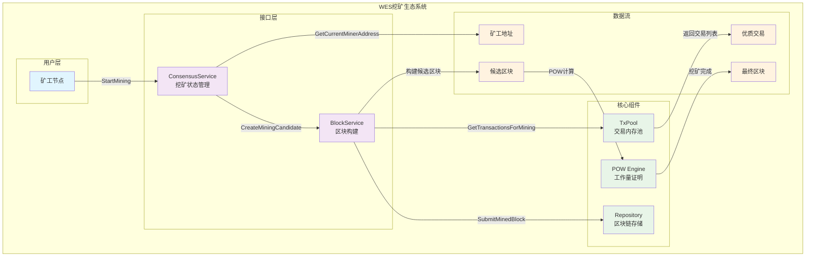
```mermaid
graph TB
    subgraph "WES挖矿生态系统"
        subgraph "用户层"
            MINER[矿工节点]
        end
        
        subgraph "接口层"
            CS[ConsensusService<br/>挖矿状态管理]
            BS[BlockService<br/>区块构建]
        end
        
        subgraph "核心组件"
            TP[TxPool<br/>交易内存池]
            POW[POW Engine<br/>工作量证明]
            REPO[Repository<br/>区块链存储]
        end
        
        subgraph "数据流"
            TX_DATA[优质交易]
            MINER_ADDR[矿工地址]
            CANDIDATE[候选区块]
            FINAL_BLOCK[最终区块]
        end
    end
    
    %% 主要流程
    MINER -->|StartMining| CS
    CS -->|GetCurrentMinerAddress| MINER_ADDR
    CS -->|CreateMiningCandidate| BS
    BS -->|GetTransactionsForMining| TP
    TP -->|返回交易列表| TX_DATA
    BS -->|构建候选区块| CANDIDATE
    CANDIDATE -->|POW计算| POW
    POW -->|挖矿完成| FINAL_BLOCK
    BS -->|SubmitMinedBlock| REPO
    
    %% 样式定义
    classDef userClass fill:#e1f5fe
    classDef interfaceClass fill:#f3e5f5  
    classDef coreClass fill:#e8f5e8
    classDef dataClass fill:#fff3e0
    
    class MINER userClass
    class CS,BS interfaceClass
    class TP,POW,REPO coreClass
    class TX_DATA,MINER_ADDR,CANDIDATE,FINAL_BLOCK dataClass
```

### **组件协作优势**

✅ **职责清晰**: 每个组件专注自己的核心功能  
✅ **自动化程度高**: 启动挖矿后无需外部干预  
✅ **内部协作**: 所有交互都在节点内部，符合自治理念  
✅ **简化接口**: 减少外部参数依赖，提升易用性  

---

## 📋 **接口详细设计**

### **1. AccountService - 账户管理服务**

#### **设计原则**
- **用户友好**: 隐藏UTXO复杂性，提供直观的余额查询
- **多资产支持**: 统一管理原生代币和合约代币
- **实时准确**: 基于最新链状态提供准确的资产信息

#### **核心方法设计**
```go
type AccountService interface {
    // 基础余额查询（90%的用例）
    GetBalance(ctx context.Context, address types.Address) (*types.Balance, error)
    GetTokenBalance(ctx context.Context, address types.Address, tokenID types.TokenID) (*types.TokenBalance, error)
    
    // 资产总览查询（钱包主页用）
    GetAssetSummary(ctx context.Context, address types.Address) (*types.AssetSummary, error)
    
    // 交易历史查询（用户查看历史）
    GetTransactionHistory(ctx context.Context, address types.Address, opts *types.HistoryOptions) (*types.TransactionHistory, error)
}
```

#### **典型使用场景**
- **钱包应用**: 显示用户总资产和各代币余额
- **交易所**: 用户资产查询和充值监控
- **DeFi应用**: 用户资产验证和授权检查

### **2. ResourceService - 资源管理服务**

#### **设计原则**
- **统一管理**: 智能合约、AI模型、文件的统一接口
- **部署简化**: 简化资源部署流程，提供友好的API
- **调用高效**: 高效的资源调用和状态查询

#### **核心方法设计**
```go
type ResourceService interface {
    // 资源部署（开发者核心需求）
    DeployContract(ctx context.Context, contract *types.ContractDeployment) (*types.DeploymentResult, error)
    DeployAIModel(ctx context.Context, model *types.AIModelDeployment) (*types.DeploymentResult, error)
    
    // 资源调用（DApp核心需求）
    CallContract(ctx context.Context, call *types.ContractCall) (*types.CallResult, error)
    QueryContract(ctx context.Context, query *types.ContractQuery) (*types.QueryResult, error)
    
    // 资源查询（状态检查）
    GetResource(ctx context.Context, resourceID types.ResourceID) (*types.ResourceInfo, error)
    ListUserResources(ctx context.Context, address types.Address) ([]*types.ResourceInfo, error)
}
```

#### **典型使用场景**
- **DApp开发**: 部署和调用智能合约
- **AI应用**: 部署和调用AI推理模型  
- **内容平台**: 上传和管理数字资产

### **3. ChainService - 链状态查询服务**

#### **设计原则**
- **状态透明**: 提供清晰的链状态和网络状态信息
- **组件协作**: 为其他组件提供必要的状态查询
- **监控友好**: 支持系统监控和健康检查

#### **核心方法设计**
```go
type ChainService interface {
    // 基础链状态（其他组件常用）
    GetChainInfo(ctx context.Context) (*types.ChainInfo, error)  // height, hash, status
    IsReady(ctx context.Context) bool  // 系统是否就绪
    
    // 网络状态（监控和诊断用）
    GetNetworkStatus(ctx context.Context) (*types.NetworkStatus, error)  // peers, latency
    
    // 数据新鲜度（API查询前检查）
    IsDataFresh(ctx context.Context) bool  // 数据是否是最新的
    
    // 系统健康（监控告警用）
    GetSystemHealth(ctx context.Context) (*types.SystemHealth, error)
}
```

#### **典型使用场景**
- **矿工组件**: 检查链状态决定是否挖矿
- **API服务**: 验证数据新鲜度
- **监控系统**: 健康检查和告警

### **4. BlockService - 区块操作服务**

#### **设计原则**
- **矿工友好**: 为矿工提供区块提交和验证接口
- **查询高效**: 支持多种区块查询方式
- **同步支持**: 为同步组件提供必要的区块操作

#### **核心方法设计**
```go
type BlockService interface {
    // 区块提交（矿工核心需求）
    SubmitBlock(ctx context.Context, block *types.Block) (*types.SubmitResult, error)
    
    // 区块查询（API和同步需求）
    GetBlock(ctx context.Context, identifier types.BlockIdentifier) (*types.Block, error)  // height or hash
    GetBlockRange(ctx context.Context, start, end uint64) ([]*types.Block, error)
    
    // 区块验证（同步时需要）  
    ValidateBlock(ctx context.Context, block *types.Block) (*types.ValidationResult, error)
}
```

#### **典型使用场景**
- **矿工节点**: 提交新挖出的区块
- **API服务**: 查询特定区块信息
- **同步组件**: 验证从网络获取的区块

### **5. TransactionService - 交易处理服务** 

#### **设计原则**
- **简化交易流程**: 隐藏复杂的UTXO构建逻辑
- **业务场景覆盖**: 支持所有常见的交易类型
- **状态跟踪**: 提供完整的交易状态跟踪

#### **核心方法设计**  
```go
type TransactionService interface {
    // 基础交易（80%的用例）
    Transfer(ctx context.Context, transfer *types.TransferRequest) (*types.TransactionResult, error)
    
    // 企业交易（多签、时间锁等）
    CreateMultiSigTransaction(ctx context.Context, multiSig *types.MultiSigRequest) (*types.TransactionResult, error)
    
    // 交易状态查询（用户关心的）
    GetTransactionStatus(ctx context.Context, txHash types.Hash) (*types.TransactionStatus, error)
    GetTransactionReceipt(ctx context.Context, txHash types.Hash) (*types.TransactionReceipt, error)
    
    // 费用估算（交易前必需）
    EstimateFee(ctx context.Context, request types.TransactionRequest) (*types.FeeEstimate, error)
}
```

#### **典型使用场景**
- **用户转账**: 简单的点对点转账
- **企业支付**: 多签授权的企业级转账
- **DApp交互**: 调用智能合约的交易
- **交易查询**: 用户查看交易状态和历史

---

## 🚫 **架构约束和边界**

### **严格的设计边界**

#### **公共接口只包含**
```
✅ 真实的业务需求
- 用户操作: 转账、查余额、部署合约
- 组件协作: 矿工提交区块、API查询状态
- 监控需求: 健康检查、网络状态

✅ 数据查询和操作提交  
- 查询: 余额、状态、历史记录
- 提交: 交易、区块、资源部署
```

#### **公共接口不包含**
```
❌ 内部控制逻辑
- 同步控制: 同步是自动的，不暴露控制接口
- 分叉处理: 分叉处理是内部自动完成
- 恢复操作: 数据问题通过重新同步解决

❌ 生命周期管理
- Start/Stop: fx框架自动管理组件生命周期
- Initialize: 组件启动时自动初始化
- Cleanup: 系统关闭时自动清理

❌ 底层技术细节
- UTXO管理: 隐藏在AccountService后面
- 网络协议: 隐藏在内部实现中  
- 存储细节: 通过repository接口抽象
```

### **fx框架适配原则**

#### **组件启动模式**
```go
// ✅ 正确的fx模式
func NewBlockchainModule() fx.Option {
    return fx.Options(
        // 提供公共接口实现
        fx.Provide(NewAccountService),
        fx.Provide(NewResourceService),
        fx.Provide(NewChainService),
        fx.Provide(NewBlockService),
        fx.Provide(NewTransactionService),
        
        // 组件自动启动（通过lifecycle hooks）
        fx.Invoke(func(lc fx.Lifecycle, services ...Service) {
            lc.Append(fx.Hook{
                OnStart: func(ctx context.Context) error {
                    // 自动初始化，无需手动Start
                    return nil
                },
                OnStop: func(ctx context.Context) error {
                    // 自动清理，无需手动Stop
                    return nil
                },
            })
        }),
    )
}
```

#### **依赖注入模式**
```go  
// ✅ 正确的依赖注入
type accountService struct {
    repository repository.RepositoryManager  // 注入repository
    chain      ChainService                 // 注入chain service
    logger     *zap.Logger                 // 注入logger
}

// 通过fx自动注入，无需手动管理依赖
func NewAccountService(
    repo repository.RepositoryManager,
    chain ChainService, 
    logger *zap.Logger,
) AccountService {
    return &accountService{
        repository: repo,
        chain:      chain,
        logger:     logger,
    }
}
```

---

## 🔄 **业务流程集成**

### **完整的用户操作流程**

#### **转账流程**
```mermaid
sequenceDiagram
    participant User as 用户
    participant Wallet as 钱包
    participant Account as AccountService
    participant Chain as ChainService  
    participant Tx as TransactionService
    participant Blockchain as 区块链系统
    
    User->>Wallet: 发起转账
    Wallet->>Account: GetBalance(用户地址)
    Account-->>Wallet: 返回余额信息
    
    Wallet->>Chain: IsDataFresh()
    Chain-->>Wallet: 确认数据最新
    
    Wallet->>Tx: EstimateFee(转账请求)  
    Tx-->>Wallet: 返回费用估算
    
    Wallet->>Tx: Transfer(转账参数)
    Tx->>Blockchain: 提交到区块链
    Blockchain-->>Tx: 交易哈希
    Tx-->>Wallet: 转账结果
    
    Wallet->>Tx: GetTransactionStatus(txHash)
    Tx-->>Wallet: 交易状态
```

#### **合约部署流程**
```mermaid
sequenceDiagram
    participant Dev as 开发者
    participant DApp as DApp前端
    participant Account as AccountService
    participant Resource as ResourceService
    participant Blockchain as 区块链系统
    
    Dev->>DApp: 部署合约
    DApp->>Account: GetBalance(开发者地址)
    Account-->>DApp: 检查余额充足
    
    DApp->>Resource: DeployContract(合约信息)
    Resource->>Blockchain: 创建资源交易
    Blockchain-->>Resource: 部署结果
    Resource-->>DApp: 合约地址
    
    DApp->>Resource: GetResource(合约ID)
    Resource-->>DApp: 合约状态确认
```

### **矿工和监控流程**

#### **矿工挖矿流程**
```mermaid
sequenceDiagram
    participant Miner as 矿工
    participant Chain as ChainService
    participant Block as BlockService
    participant Blockchain as 区块链系统
    
    loop 挖矿循环
        Miner->>Chain: GetChainInfo()
        Chain-->>Miner: 当前链状态
        
        Miner->>Chain: IsDataFresh()
        Chain-->>Miner: 确认同步最新
        
        Miner->>Miner: 本地挖矿计算
        
        Miner->>Block: SubmitBlock(新区块)
        Block->>Blockchain: 提交区块
        Blockchain-->>Block: 提交结果
        Block-->>Miner: 挖矿成功/失败
    end
```

#### **系统监控流程**  
```mermaid
sequenceDiagram
    participant Monitor as 监控系统
    participant Chain as ChainService
    participant Alert as 告警系统
    
    loop 监控循环
        Monitor->>Chain: GetSystemHealth()
        Chain-->>Monitor: 系统健康状态
        
        Monitor->>Chain: GetNetworkStatus() 
        Chain-->>Monitor: 网络连接状态
        
        alt 系统异常
            Monitor->>Alert: 触发告警
        else 系统正常
            Monitor->>Monitor: 记录指标
        end
    end
```

---

## 📊 **性能和扩展性考虑**

### **接口性能设计**

#### **查询性能优化**
```
缓存策略：
✅ 热点数据缓存（余额、状态）
✅ 批量查询支持（多地址余额）  
✅ 分页查询支持（交易历史）
✅ 结果缓存和失效策略

响应时间目标：
✅ 余额查询: < 100ms
✅ 交易状态: < 50ms  
✅ 区块查询: < 200ms
✅ 系统状态: < 30ms
```

#### **并发处理设计**
```
并发控制：
✅ 接口级别的并发限制
✅ 用户级别的频率限制
✅ 资源隔离和优先级
✅ 超时和断路器机制
```

### **扩展性设计**

#### **接口版本控制**
```go
// 版本兼容性示例
type AccountServiceV1 interface {
    GetBalance(ctx context.Context, address types.Address) (*types.Balance, error)
}

type AccountServiceV2 interface {
    AccountServiceV1  // 继承V1接口
    GetAssetSummary(ctx context.Context, address types.Address) (*types.AssetSummary, error)
}
```

#### **功能扩展预留**
```
预留扩展点：
✅ 新的交易类型支持
✅ 新的资源类型支持
✅ 新的查询维度支持
✅ 新的监控指标支持
```

---

## 🚀 **实施路线图**

### **重构阶段规划**

#### **阶段1: 接口重新设计**
```
目标：基于业务需求重新设计所有公共接口
时间：2周
输出：
- 重新设计的5个核心接口文件
- 详细的接口文档和使用示例
- 与现有业务流程的兼容性分析
```

#### **阶段2: 实现层适配**
```  
目标：适配新接口的内部实现
时间：3周
输出：
- 新接口的完整实现
- 与fx框架的完整集成
- 内部组件的依赖注入改造
```

#### **阶段3: 业务层迁移**
```
目标：迁移现有业务代码到新接口
时间：2周  
输出：
- 所有调用方的接口迁移
- 完整的测试覆盖
- 性能基准测试
```

#### **阶段4: 监控和优化**
```
目标：监控新接口性能并优化
时间：1周
输出：
- 完整的监控指标
- 性能优化报告
- 生产环境稳定运行
```

---

## 📝 **总结**

### **重构核心价值**

#### **业务价值**
- ✅ **用户体验提升**: 简化的接口让钱包和DApp开发更容易
- ✅ **开发效率提升**: 清晰的职责边界减少学习成本  
- ✅ **系统稳定性提升**: 自治系统减少人为干预错误

#### **技术价值**  
- ✅ **架构清晰**: 业务接口与系统接口分离
- ✅ **依赖解耦**: 通过依赖注入实现松耦合
- ✅ **性能优化**: 基于真实使用场景的性能优化

#### **维护价值**
- ✅ **可扩展性**: 预留的扩展点支持未来功能增长
- ✅ **可测试性**: 清晰的接口边界便于单元测试
- ✅ **可监控性**: 完整的监控指标和健康检查

### **设计原则总结**

1. **业务需求驱动**: 每个接口都对应真实的业务场景
2. **自治系统理念**: 区块链内部自动协作，外部最小干预  
3. **fx框架适配**: 充分利用依赖注入的架构优势
4. **职责边界清晰**: 业务接口与系统接口严格分离
5. **性能导向**: 基于真实使用模式的性能优化

　　通过这次深度重构，WES区块链的公共接口将成为**真正实用、高性能、易维护**的企业级接口，为上层应用提供稳定可靠的区块链服务能力。

---

**注意**: 本文档基于深度架构分析的重构设计，具体接口实现请参考对应的接口文件。接口与实现完全解耦，遵循依赖倒置原则。