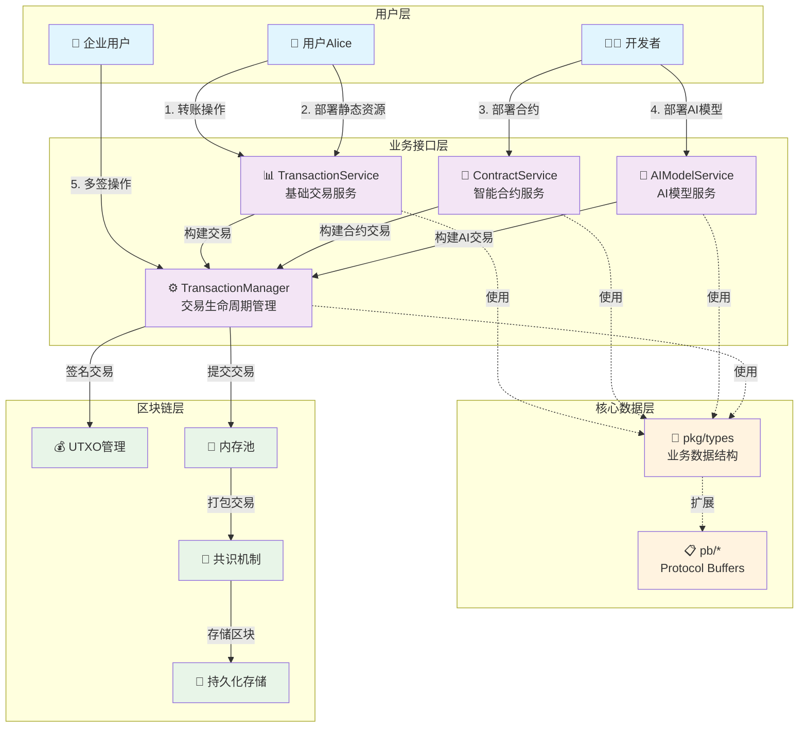
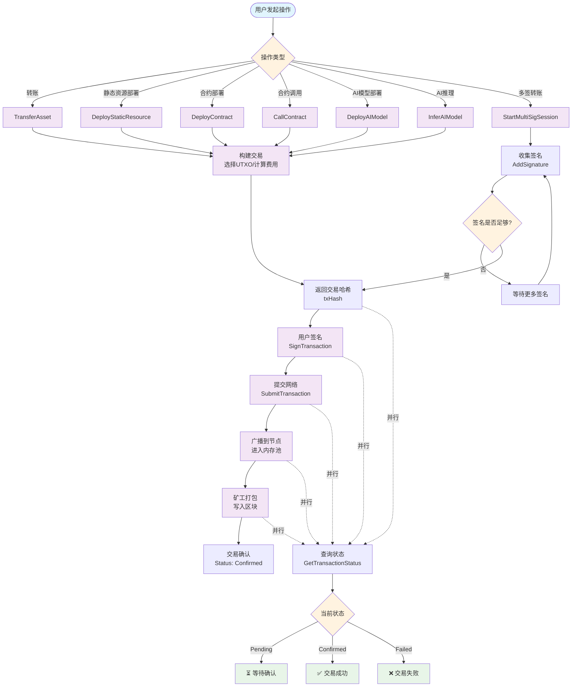
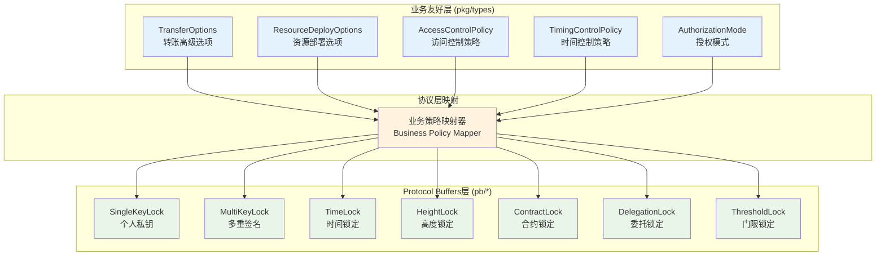

# WES交易系统完整指南

【指南定位】
　　本指南是WES区块链交易系统的权威使用手册，面向钱包开发者、DApp前端工程师、企业级系统集成商提供从入门到精通的完整指导。通过渐进式的学习路径，帮助开发者快速掌握从基础转账到复杂企业级多签的全部交易场景，确保在不同业务需求下都能选择最合适的技术方案。

【核心价值】
- 降低区块链开发门槛：将复杂的UTXO、密码学等底层概念抽象为直观的业务操作
- 统一开发体验：不同类型的交易（转账、合约、AI）使用相同的接口模式和流程  
- 企业级完整支持：涵盖多签、时间锁、访问控制等复杂业务场景的完整解决方案
- 生产就绪：提供监控、故障排查、性能优化等运维级指导

【适用场景】
1. **个人钱包开发**：实现用户转账、资产查询等基础功能
2. **DApp前端集成**：接入智能合约调用、AI模型推理等高级功能
3. **企业系统集成**：实现多签审批、合规检查、风控管理等企业级需求
4. **系统运维监控**：建立交易系统的可观测性和故障处理能力

---

## 🏗️ **统一交易架构设计**

### **核心设计理念**

　　WES交易系统基于"**用户意图 → 业务操作 → 交易构建 → 签名授权 → 网络提交**"的统一流程设计，无论是转账、部署合约，还是执行AI推理，都遵循相同的交易生命周期管理。



### **统一交易流程**



---

## 🎯 **核心服务接口详解**

### **接口分层架构说明**

　　WES交易系统采用分层设计，将复杂的区块链交易功能按业务领域划分为四个核心服务，每个服务专注特定的业务场景，通过统一的设计模式实现高内聚、低耦合的系统架构。

**分层设计原则：**
- **职责单一**：每个服务只负责特定类型的交易业务
- **接口统一**：所有服务采用相同的参数设计模式（基础参数+可选高级选项）  
- **渐进式复杂度**：从简单的日常使用到复杂的企业级需求，用户可按需选择功能层级
- **向后兼容**：新功能通过可选参数扩展，不影响现有代码

### **1. 📊 TransactionService - 统一交易服务**

【服务定位】
　　TransactionService是WES交易系统的核心服务，专注于处理资产转移和静态资源上链业务。它为90%的日常交易场景提供简洁易用的接口，同时通过高级选项支持10%的企业级复杂需求。

【设计理念】
- **用户友好优先**：隐藏复杂的UTXO选择、找零计算等底层逻辑，用户只需关注业务参数
- **渐进式复杂度**：基础功能零门槛使用，高级功能按需引入，避免认知负担
- **智能默认值**：系统自动处理手续费估算、UTXO优化选择等技术细节
- **安全为本**：所有操作都经过完整的验证链，确保资金安全和合规性

【适用场景分析】

| **使用场景** | **目标用户** | **使用方法** | **核心价值** |
|------------|------------|-------------|-------------|
| 个人日常转账 | 钱包用户 | 基础接口调用 | 简单直观，一键完成 |
| 企业多签支付 | 财务系统 | 高级选项配置 | 风险控制，合规审计 |
| 批量工资发放 | HR系统 | 批量转账接口 | 降本增效，原子操作 |
| 证书文件上链 | 教育机构 | 资源部署接口 | 防篡改存证，永久保存 |

【核心接口设计】

```go
// TransactionService 交易服务接口定义
// 
// 设计原则：
// 1. 方法命名遵循业务语义，如TransferAsset而非BuildTransaction
// 2. 参数顺序：必需参数在前，可选参数在后
// 3. 返回值统一：交易哈希([]byte) + 错误信息(error)
// 4. 上下文管理：所有方法都支持context.Context用于超时控制和取消操作
type TransactionService interface {
    // TransferAsset 资产转账操作（基础+高级模式统一接口）
    //
    // 【功能说明】
    // 这是最常用的交易接口，支持原生代币和合约代币的转移操作。
    // 系统会自动处理UTXO选择、找零计算、手续费估算等复杂逻辑。
    //
    // 【调用模式】
    // - 基础模式：省略options参数，系统使用默认配置（90%的使用场景）
    // - 高级模式：传入TransferOptions，支持多签、时间锁等企业级功能
    //
    // 【参数详解】
    // - ctx: 上下文对象，用于超时控制和请求取消
    // - toAddress: 接收方地址，支持个人地址和智能合约地址
    // - amount: 转账金额，字符串格式支持高精度小数（如"1.23456789"）
    // - tokenID: 代币标识符，空字符串表示原生代币，其他值为合约地址
    // - memo: 转账备注，将记录在区块链上，支持UTF-8编码
    // - options: 高级选项，可选参数，支持多签、时间锁、访问控制等
    //
    // 【返回值】
    // - []byte: 未签名交易的哈希值，用于后续签名和提交操作
    // - error: 操作错误，包含详细的错误原因和建议处理方案
    //
    // 【使用示例】
    // 基础转账：TransferAsset(ctx, "0x123...", "100.0", "", "转账给朋友")
    // 高级转账：TransferAsset(ctx, "0x123...", "100.0", "", "转账", &multiSigOptions)
    TransferAsset(ctx context.Context,
        toAddress string,        // 接收方地址（必需）
        amount string,           // 转账金额（必需）
        tokenID string,          // 代币ID，""=原生币（必需）
        memo string,             // 转账备注（必需，可为空）
        options ...*types.TransferOptions, // 高级选项（可选）
    ) ([]byte, error)
    
    // BatchTransfer 批量转账操作
    //
    // 【功能说明】
    // 在单个交易中处理多笔转账，具有原子性保证（全部成功或全部失败）。
    // 相比多次单独转账，批量操作可显著降低手续费成本。
    //
    // 【业务价值】
    // - 成本优化：N笔转账只需支付1笔交易的手续费
    // - 原子性：避免部分成功部分失败的复杂状态处理
    // - 性能提升：减少网络往返次数，提高处理效率
    //
    // 【适用场景】
    // - 企业工资发放：一次性向多个员工发放薪资
    // - 分红派息：向股东批量分配收益
    // - 空投活动：向多个用户同时发送代币
    //
    // 【参数详解】
    // - transfers: 转账参数列表，每个元素包含接收地址、金额等信息
    //
    // 【技术限制】
    // - 单次批量操作建议不超过100笔转账
    // - 总金额不能超过发送方可用余额
    // - 所有转账必须使用相同的代币类型
    BatchTransfer(ctx context.Context,
        senderPrivateKey []byte, // 发送方私钥（必需，每次调用携带）
        transfers []types.TransferParams, // 批量转账参数列表
    ) ([]byte, error)
    
    // DeployStaticResource 静态资源上链部署
    //
    // 【功能说明】
    // 将文件、文档、图片等静态资源上传到区块链网络，实现永久存储和防篡改。
    // 适用于证书存证、版权保护、重要文档备份等场景。
    //
    // 【技术特性】
    // - 内容寻址：基于文件内容生成唯一哈希标识
    // - 去中心化存储：文件分布式存储在网络节点中
    // - 版本控制：支持同一资源的多版本管理
    // - 访问控制：支持公开访问或权限控制
    //
    // 【参数详解】
    // - deployerPrivateKey: 部署者私钥（每次调用携带，实现无状态设计）
    // - filePath: 本地文件路径，系统会读取文件内容上传
    // - name: 资源显示名称，便于用户识别和管理
    // - description: 资源描述信息，支持详细的元数据
    // - isPublic: 访问权限，true=公开访问，false=仅上传者可访问
    // - tags: 分类标签，便于资源检索和管理
    // - options: 高级部署选项，支持商业化配置、访问策略等
    //
    // 【文件类型支持】
    // - 文档：PDF, DOC, TXT, MD等
    // - 图片：JPG, PNG, GIF, SVG等  
    // - 视频：MP4, AVI, MOV等（建议文件大小<100MB）
    // - 数据：JSON, CSV, XML等结构化数据
    //
    // 【文件验证机制】
    // - 文件格式验证：自动检测MIME类型和文件头
    // - 完整性校验：计算文件哈希确保传输完整性
    // - 安全扫描：检查恶意代码和病毒
    // - 大小限制：单个文件最大100MB
    DeployStaticResource(ctx context.Context,
        deployerPrivateKey []byte, // 部署者私钥（必需）
        filePath string,         // 本地文件路径（必需）
        name string,             // 资源显示名称（必需）
        description string,      // 资源描述信息（必需）
        isPublic bool,           // 是否公开访问（必需）
        tags []string,           // 分类标签（必需，可为空数组）
        options ...*types.ResourceDeployOptions, // 高级部署选项（可选）
    ) ([]byte, error)
}
```

#### **基础使用场景详解**

　　基础使用模式面向90%的日常用户，无需了解复杂的区块链技术细节，只需提供必要的业务参数即可完成交易。系统会自动处理所有技术细节，包括UTXO选择、手续费计算、网络提交等。

##### **场景1：个人日常转账**

**业务背景**：用户Alice想要向朋友Bob转账100.5个原生代币，并附上转账说明。

**技术要求**：
- 无需了解UTXO模型或密码学知识
- 系统自动选择最优的UTXO组合
- 自动计算合理的手续费
- 自动处理找零逻辑

```go
// 个人日常转账 - 最简使用方式
func PersonalTransfer(ctx context.Context, transactionService TransactionService) error {
    // 【步骤1】构建转账交易
    // 系统会自动处理以下复杂逻辑：
    // - 查询发送方可用余额
    // - 选择合适的UTXO组合
    // - 计算最优手续费
    // - 生成找零输出
    txHash, err := transactionService.TransferAsset(
        ctx,
        "0x742d35Cc6eba6c8b4fc926e3A2e",  // 朋友Bob的钱包地址
        "100.5",                          // 转账金额：100.5个原生币
        "",                               // 代币ID：空字符串表示原生代币
        "给朋友的转账",                     // 转账备注：会记录在区块链上
        // 省略options参数 → 系统使用默认安全配置
    )
    
    if err != nil {
        // 【错误处理】常见错误和处理建议
        switch {
        case strings.Contains(err.Error(), "insufficient balance"):
            return fmt.Errorf("余额不足，当前余额不足以支付转账金额和手续费")
        case strings.Contains(err.Error(), "invalid address"):
            return fmt.Errorf("接收地址格式错误，请检查地址是否正确")
        case strings.Contains(err.Error(), "amount too small"):
            return fmt.Errorf("转账金额过小，最小转账金额为0.000001原生币")
        default:
            return fmt.Errorf("转账失败: %w", err)
        }
    }
    
    // 【成功响应】txHash为32字节的交易哈希，用于后续签名和查询
    fmt.Printf("转账交易创建成功，交易哈希: %x\n", txHash)
    fmt.Printf("请使用此哈希进行签名和提交操作\n")
    
    return nil
}
```

##### **场景2：重要文档上链存证**

**业务背景**：教育机构需要将学位证书上链，实现防篡改的永久存证。

**技术要求**：
- 文件内容完整性保护
- 支持多种文件格式
- 权限控制（私人文档不公开）
- 便于检索的标签系统

```go
// 重要文档上链存证 - 教育机构使用场景
func DocumentCertification(ctx context.Context, transactionService TransactionService) error {
    // 【步骤1】准备文件路径和元数据
    certificatePath := "/opt/certificates/degree_2024_001.pdf"  // 学位证书文件
    
    // 【步骤2】验证文件是否存在且可读
    if _, err := os.Stat(certificatePath); os.IsNotExist(err) {
        return fmt.Errorf("证书文件不存在: %s", certificatePath)
    }
    
    // 【步骤3】部署文档到区块链网络
    // 系统会自动处理以下技术细节：
    // - 读取文件内容并计算哈希
    // - 将文件分片存储到网络节点
    // - 生成内容寻址的唯一标识
    // - 创建资源索引便于后续查找
    txHash, err := transactionService.DeployStaticResource(
        ctx,
        certificatePath,                    // 本地证书文件路径
        "张三-计算机科学学士学位证书",        // 资源显示名称：便于管理识别
        "清华大学2024年计算机科学与技术专业学士学位证书，学号：2020123456", // 详细描述信息
        false,                              // 访问权限：false=仅上传者可访问，保护隐私
        []string{                           // 分类标签：便于后续检索和管理
            "学位证书",                      // 文档类型
            "计算机科学",                     // 专业领域
            "清华大学",                      // 颁发机构
            "2024年",                       // 颁发年份
            "本科",                         // 学历层次
        },
        // 省略options参数 → 使用默认存证配置
    )
    
    if err != nil {
        // 【错误处理】文档上链常见错误
        switch {
        case strings.Contains(err.Error(), "file too large"):
            return fmt.Errorf("文件过大，单个文件大小不能超过100MB，建议压缩后上传")
        case strings.Contains(err.Error(), "unsupported file type"):
            return fmt.Errorf("不支持的文件类型，支持的格式：PDF、JPG、PNG、TXT等")
        case strings.Contains(err.Error(), "insufficient storage"):
            return fmt.Errorf("存储配额不足，请联系管理员扩容或删除旧文件")
        default:
            return fmt.Errorf("文档上链失败: %w", err)
        }
    }
    
    // 【成功响应】记录存证信息
    fmt.Printf("学位证书上链成功！\n")
    fmt.Printf("存证交易哈希: %x\n", txHash)
    fmt.Printf("证书将获得区块链级别的防篡改保护\n")
    fmt.Printf("可通过交易哈希随时验证证书真实性\n")
    
    return nil
}
```

##### **场景3：企业批量工资发放**

**业务背景**：公司HR系统需要向200名员工批量发放月薪，要求操作高效且具有原子性。

**技术优势**：
- 成本优化：200笔转账只需1笔交易费用
- 原子性保证：全部成功或全部失败，无中间状态
- 操作简化：一次调用完成所有转账

```go
// 企业批量工资发放 - HR系统集成场景
func PayrollBatchTransfer(ctx context.Context, transactionService TransactionService) error {
    // 【步骤1】从HR系统获取员工薪资数据
    // 实际场景中这些数据通常来自数据库查询
    employeePayroll := []struct {
        Name     string  // 员工姓名
        Address  string  // 钱包地址
        Salary   string  // 月薪金额
        Department string // 部门
    }{
        {"张三", "0x1234567890abcdef...", "15000.0", "技术部"},
        {"李四", "0x2345678901bcdef0...", "12000.0", "市场部"},
        {"王五", "0x3456789012cdef01...", "18000.0", "产品部"},
        // ... 更多员工数据
    }
    
    // 【步骤2】构建批量转账参数
    var transfers []types.TransferParams
    var totalAmount float64 = 0
    
    for _, employee := range employeePayroll {
        // 转换员工数据为转账参数
        salary, _ := strconv.ParseFloat(employee.Salary, 64)
        totalAmount += salary
        
        transfers = append(transfers, types.TransferParams{
            ToAddress: employee.Address,                      // 员工钱包地址
            Amount:    employee.Salary,                       // 薪资金额
            TokenID:   "",                                    // 使用原生代币
            Memo:      fmt.Sprintf("%s-2024年3月工资", employee.Name), // 转账备注
        })
    }
    
    // 【步骤3】执行批量转账前的安全检查
    fmt.Printf("准备发放工资，总计%d名员工，总金额: %.2f 原生币\n", 
               len(transfers), totalAmount)
    
    // 验证公司账户余额是否充足（实际系统中应该调用账户服务）
    if totalAmount > getCompanyBalance() {
        return fmt.Errorf("公司账户余额不足，需要 %.2f 原生币，当前余额 %.2f 原生币", 
                          totalAmount, getCompanyBalance())
    }
    
    // 【步骤4】执行批量转账操作
    // 所有转账在单个区块链交易中完成，具有原子性保证
    txHash, err := transactionService.BatchTransfer(ctx, transfers)
    if err != nil {
        // 【错误处理】批量转账特有错误
        switch {
        case strings.Contains(err.Error(), "batch too large"):
            return fmt.Errorf("单次批量转账数量过多，建议分批处理，每批不超过100笔")
        case strings.Contains(err.Error(), "duplicate recipient"):
            return fmt.Errorf("发现重复的接收地址，请检查员工钱包地址数据")
        case strings.Contains(err.Error(), "insufficient balance"):
            return fmt.Errorf("账户余额不足以支付所有工资和手续费")
        default:
            return fmt.Errorf("批量工资发放失败: %w", err)
        }
    }
    
    // 【成功响应】记录发薪日志
    fmt.Printf("✅ 工资发放交易创建成功！\n")
    fmt.Printf("📊 发放统计: %d名员工，总计%.2f 原生币\n", len(transfers), totalAmount)
    fmt.Printf("🔗 交易哈希: %x\n", txHash)
    fmt.Printf("💡 提示: 请使用交易哈希进行签名确认，确认后所有员工将同时收到工资\n")
    
    // 实际系统中还应该：
    // 1. 记录发薪日志到数据库
    // 2. 发送通知给财务部门
    // 3. 更新员工薪资发放状态
    
    return nil
}

// getCompanyBalance 获取公司账户余额（示例函数）
func getCompanyBalance() float64 {
    // 实际实现中应该调用AccountService查询余额
    return 500000.0 // 示例：50万原生币余额
}
```

#### **企业级使用场景详解**

　　企业级使用模式面向10%的复杂业务需求，通过高级选项配置实现多签审批、合规检查、风险控制等企业级功能。这些功能在保持接口简洁的同时，提供了银行级的安全保障和合规要求支持。

##### **场景4：企业多签大额支付**

**业务背景**：上市公司需要向主要供应商支付100万原生币的Q4货款，按照公司治理要求需要CEO、CFO、CTO中至少3人签名确认。

**企业级要求**：
- 风险控制：大额支付必须多人签名确认
- 合规审计：支付需要完整的审批流程记录
- 时限管理：72小时内完成签名，过期自动取消
- 隐私保护：交易信息标记为机密级别

```go
// 企业多签大额支付 - 上市公司治理场景
func EnterpriseMultiSigPayment(ctx context.Context, transactionService TransactionService) error {
    // 【步骤1】配置企业级多签授权模式
    // 这个配置体现了现代企业治理的最佳实践
    enterpriseOptions := &types.TransferOptions{
        // 授权模式配置 - 实现企业级权限控制
        AuthMode: &types.AuthorizationMode{
            ModeType: "multi",                    // 多重签名模式
            MultiSigConfig: &types.MultiSigConfig{
                RequiredSignatures: 3,            // 至少需要3个签名（风险控制要求）
                AuthorizedSigners: []string{      // 授权签名者列表（公司高管）
                    "0xCEO1234...",               // 首席执行官（CEO）
                    "0xCFO5678...",               // 首席财务官（CFO） 
                    "0xCTO9012...",               // 首席技术官（CTO）
                    "0xLegal3456...",             // 法务总监（可选签名者）
                    "0xFinance7890...",           // 财务总监（可选签名者）
                },
                Description: "Q4供应商货款支付审批", // 业务描述（审计需要）
                SigningTimeout: 72 * time.Hour,   // 72小时签名期限（防止无限期挂起）
            },
        },
        
        // 合规要求配置 - 满足监管和审计要求
        Compliance: &types.ComplianceOptions{
            KYCRequired: true,                    // 需要KYC身份验证
            AMLCheck: true,                       // 反洗钱检查
            TaxReporting: true,                   // 税务申报标记
            PrivacyLevel: "confidential",         // 机密级别（限制信息披露范围）
            JurisdictionRules: []string{          // 适用的法律管辖区
                "US_SOX",                         // 萨班斯-奥克斯利法案
                "EU_GDPR",                        // 欧盟通用数据保护条例
                "CN_CBRC",                        // 中国银保监会规定
            },
        },
        
        // 企业级控制选项 - 额外的企业治理控制
        Enterprise: &types.EnterpriseOptions{
            ComplianceCheck: true,                // 启用合规检查
            AuditTrail: "detailed",               // 详细审计追踪
            EmployeeVesting: false,               // 非员工股权相关
            ComplianceLevel: "public_company",    // 上市公司级合规要求
            RegulatoryZone: "US",                 // 监管区域
        },
    }
    
    // 【步骤2】执行企业级多签转账
    // 系统会自动处理企业级的复杂验证逻辑
    txHash, err := transactionService.TransferAsset(
        ctx,
        "0x890123456789abcdef...",              // 供应商公司的企业钱包地址
        "1000000.0",                            // 支付金额：100万原生币（大额支付）
        "",                                     // 使用原生代币
        "致远科技有限公司Q4季度货款结算支付",     // 详细的业务备注（审计需要）
        enterpriseOptions,                      // 企业级高级选项配置
    )
    
    if err != nil {
        // 【错误处理】企业级交易特有错误
        switch {
        case strings.Contains(err.Error(), "compliance check failed"):
            return fmt.Errorf("合规检查失败，可能涉及反洗钱或制裁名单，请联系合规部门")
        case strings.Contains(err.Error(), "insufficient authorization"):
            return fmt.Errorf("授权不足，大额支付需要董事会额外批准")
        case strings.Contains(err.Error(), "regulatory violation"):
            return fmt.Errorf("违反监管规定，请确认支付是否符合当地法律法规")
        case strings.Contains(err.Error(), "audit trail required"):
            return fmt.Errorf("缺少必要的审计信息，请补充完整的业务流程记录")
        default:
            return fmt.Errorf("企业级支付失败: %w", err)
        }
    }
    
    // 【成功响应】企业级交易创建成功
    fmt.Printf("🏢 企业多签支付交易创建成功！\n")
    fmt.Printf("💰 支付金额: 1,000,000.00 原生币\n")
    fmt.Printf("🏭 收款方: 致远科技有限公司\n")
    fmt.Printf("📝 业务用途: Q4季度供应商货款结算\n")
    fmt.Printf("🔗 交易哈希: %x\n", txHash)
    fmt.Printf("📋 签名要求: 需要CEO、CFO、CTO中任意3人签名确认\n")
    fmt.Printf("⏰ 签名期限: 72小时内完成，过期自动取消\n")
    fmt.Printf("🔒 合规级别: 上市公司级，包含完整审计追踪\n")
    
    return nil
}
```

##### **场景5：商业化资源部署**

**业务背景**：AI公司希望将训练好的GPT模型部署到区块链上，提供按次付费的推理服务，实现模型的商业化运营。

**商业模式要求**：
- 分层定价：根据使用量提供不同价格
- 收益分成：AI开发者获得70%收入分成
- 服务保障：99.9%可用性和5秒响应时间SLA
- 免费试用：新用户可免费试用100次

```go
// 商业化AI模型部署 - AI服务商业化场景
func CommercialAIModelDeployment(ctx context.Context, transactionService TransactionService) error {
    // 【步骤1】配置商业化资源部署选项
    // 这个配置实现了完整的数字经济商业模式
    commercialOptions := &types.ResourceDeployOptions{
        // 访问控制策略 - 实现商业化访问模式
        AccessPolicy: &types.AccessControlPolicy{
            PolicyType: "commercial",             // 商业化访问策略
            Commercial: &types.CommercialAccessConfig{
                PriceModel: "tiered_pricing",     // 分层定价模式
                SubscriptionFee: "99.0",          // 基础订阅费：99 原生币/月
                PaymentToken: "",                 // 使用原生币作为支付代币
                QuotaLimit: 10000,                // 月度使用配额：10000次
                QuotaPeriod: "monthly",           // 配额周期：月度
                FreeTrialQuota: 100,              // 免费试用：100次
                
                // 分层价格策略 - 鼓励大量使用
                TierPricing: []types.TierPricing{
                    {
                        TierName: "个人开发者",        // 面向个人用户
                        MinUsage: 1,                 // 最小使用量
                        PricePerUnit: "0.01",        // 1分钱/次（基础价格）
                        Description: "适合个人开发者和小规模项目",
                    },
                    {
                        TierName: "创业公司",          // 面向初创企业
                        MinUsage: 1000,              // 1000次以上
                        PricePerUnit: "0.008",       // 0.8分/次（20%折扣）
                        Description: "适合创业公司和中等规模应用",
                    },
                    {
                        TierName: "企业客户",          // 面向大企业
                        MinUsage: 10000,             // 10000次以上
                        PricePerUnit: "0.005",       // 0.5分/次（50%折扣）
                        Description: "适合大企业和高频使用场景",
                    },
                },
                
                DiscountPolicy: "volume_based",      // 基于使用量的折扣策略
            },
        },
        
        // 商业模式配置 - 定义收益分配和服务承诺
        BusinessModel: &types.BusinessModelOptions{
            RevenueSharing: "0.7",                   // AI开发者获得70%收入分成
            PlatformFee: "0.3",                      // 平台获得30%服务费
            QualityAssurance: true,                  // 启用质量保证服务
            
            // 服务级别协议(SLA) - 商业化服务的质量承诺
            SLA: &types.SLAConfig{
                ResponseTime: 5 * time.Second,       // 承诺5秒内响应
                Availability: 99.9,                  // 承诺99.9%可用性
                ErrorRate: 0.1,                      // 承诺错误率低于0.1%
                CompensationPolicy: "credit_refund", // 服务不达标时信用退款
            },
        },
    }
    
    // 【步骤2】准备AI模型文件和配置
    modelFilePath := "/models/gpt4o_commercial_v1.onnx"  // 商业化GPT模型文件
    
    // 验证模型文件是否存在
    if _, err := os.Stat(modelFilePath); os.IsNotExist(err) {
        return fmt.Errorf("AI模型文件不存在: %s", modelFilePath)
    }
    
    // 读取模型文件字节数据
    gptModelBytes, err := os.ReadFile(modelFilePath)
    if err != nil {
        return fmt.Errorf("读取AI模型文件失败: %w", err)
    }
    
    // 配置GPT模型执行参数
    gptModelConfig := &resource.AIModelExecutionConfig{
        ModelFormat: "ONNX",                        // 模型格式：ONNX
        InputNames: []string{"input_ids", "attention_mask"}, // 输入张量名称
        OutputNames: []string{"logits"},             // 输出张量名称
        ExecutionParams: map[string]string{         // 执行参数
            "max_sequence_length": "2048",           // 最大序列长度
            "batch_size": "1",                       // 批处理大小
            "precision": "fp16",                     // 精度：半精度浮点
        },
    }
    
    // 【步骤3】执行商业化AI模型部署
    // 系统会自动处理商业化部署的复杂逻辑
    txHash, err := aiModelService.DeployAIModel(
        ctx,
        gptModelBytes,                              // GPT模型文件字节数据
        gptModelConfig,                             // GPT模型执行配置
        "GPT-4o企业级对话模型",                      // 商业化模型名称
        "支持中英文对话的大语言模型，适用于客服、咨询、内容生成等企业级场景。经过安全训练，支持企业隐私保护。", // 商业描述
        commercialOptions,                          // 商业化部署选项
    )
    
    if err != nil {
        // 【错误处理】商业化部署特有错误
        switch {
        case strings.Contains(err.Error(), "commercial license required"):
            return fmt.Errorf("需要商业许可证，请先申请AI服务提供商资质")
        case strings.Contains(err.Error(), "model validation failed"):
            return fmt.Errorf("模型验证失败，请确认模型符合安全和质量标准")
        case strings.Contains(err.Error(), "pricing configuration invalid"):
            return fmt.Errorf("定价配置无效，请检查价格设置是否合理")
        case strings.Contains(err.Error(), "sla commitment too high"):
            return fmt.Errorf("SLA承诺过高，请调整至可实现的服务水平")
        default:
            return fmt.Errorf("商业化模型部署失败: %w", err)
        }
    }
    
    // 【成功响应】商业化部署完成
    fmt.Printf("🤖 AI模型商业化部署成功！\n")
    fmt.Printf("📊 服务模式: 按次付费 + 订阅制混合模式\n")
    fmt.Printf("💎 定价策略: 个人0.01/次，企业0.005/次（批量优惠）\n")
    fmt.Printf("📈 收益分成: 开发者70%，平台30%\n")
    fmt.Printf("🎯 服务承诺: 99.9%可用性，5秒响应时间\n")
    fmt.Printf("🎁 用户福利: 新用户免费试用100次\n")
    fmt.Printf("🔗 部署哈希: %x\n", txHash)
    fmt.Printf("💡 提示: 部署确认后即可开始商业化运营，接受付费推理请求\n")
    
    // 实际系统中还需要：
    // 1. 配置支付处理系统
    // 2. 建立用户管理和配额追踪
    // 3. 部署监控和告警系统
    // 4. 建立客户服务体系
    
    return nil
}
```

### **2. 🔧 ContractService - 智能合约服务**

#### **核心接口**
```go
type ContractService interface {
    // 智能合约部署（支持基础和高级模式）
    DeployContract(ctx context.Context,
        contractBytes []byte,
        config *resource.ContractExecutionConfig,
        name string,
        description string,
        options ...*types.ResourceDeployOptions,
    ) ([]byte, error)
    
    // 智能合约调用（支持基础和高级模式）
    CallContract(ctx context.Context,
        contractAddress string,
        methodName string,
        parameters map[string]interface{},
        执行费用Limit uint64,
        value string,
        options ...*types.TransferOptions,
    ) ([]byte, error)
}
```

#### **基础使用示例**
```go
// 🎯 开发者部署DeFi合约
wasmBytes, _ := os.ReadFile("./uniswap_v3.wasm")
config := &resource.ContractExecutionConfig{
    执行费用Limit: 10000000,
    MemoryLimit: 512 * 1024 * 1024, // 512MB
}

txHash, err := contractService.DeployContract(
    ctx,
    wasmBytes,                      // WASM字节码
    config,                         // 执行配置
    "UniswapV3去中心化交易所",        // 合约名称
    "去中心化AMM交易协议",           // 功能描述
    // 省略options = 基础部署，公开可调用
)

// 🎯 用户调用DeFi合约进行代币交换
txHash, err := contractService.CallContract(
    ctx,
    "0xdAC17F958D2ee523a2206206994597C13D831ec7", // USDT合约地址
    "swap",                                         // swap方法
    map[string]interface{}{
        "amountIn": "1000.0",                       // 输入1000 原生币
        "tokenOut": "0xA0b86a33E6417d4e1E...",     // 输出USDT
        "minAmountOut": "990.0",                    // 最少输出990 USDT
        "slippage": "1.0",                          // 1%滑点
    },
    500000,    // 执行费用限制
    "1000.0",  // 发送1000 原生币
    // 省略options = 基础调用
)
```

#### **企业级使用示例**
```go
// 🏢 企业级合约部署（需要多方签名和合规检查）
enterpriseDeployOptions := &types.ResourceDeployOptions{
    AccessPolicy: &types.AccessControlPolicy{
        PolicyType: "enterprise",
        Enterprise: &types.EnterpriseAccessConfig{
            SecurityLevel: "critical",
            RequiredSigners: 3,                     // 需要3个签名
            AuthorizedRoles: []string{
                "技术总监", "法务总监", "合规官",
            },
            ApprovalFlow: []string{
                "技术审查", "法务审查", "合规审查", "最终批准",
            },
            ComplianceRules: []string{
                "SOX合规", "GDPR合规", "金融监管合规",
            },
            RiskAssessment: true,
            AuditTrailLevel: "detailed",
        },
    },
    Enterprise: &types.EnterpriseResourceOptions{
        SecurityClassification: "机密",
        DataEncryption: true,
        AccessLogging: true,
        BackupPolicy: "daily_encrypted_backup",
        DisasterRecovery: true,
        ComplianceTags: []string{
            "SOX", "GDPR", "PCI-DSS",
        },
    },
}

txHash, err := contractService.DeployContract(
    ctx,
    criticalContractWasm,                          // 关键业务合约
    enterpriseConfig,                              // 企业级执行配置
    "核心支付清算系统V2.0",                        // 关键业务合约名称
    "处理银行间清算的核心智能合约系统",             // 企业描述
    enterpriseDeployOptions,                       // 企业级部署选项
)

// 🏢 企业级合约调用（委托调用，自动合规检查）
enterpriseCallOptions := &types.TransferOptions{
    AuthMode: &types.AuthorizationMode{
        ModeType: "delegation",
        DelegationConfig: &types.DelegationConfig{
            AllowedDelegates: []string{
                "0xFinanceBot...",  // 财务机器人
            },
            Operations: []string{"payment", "settlement"},
            ExpiryDuration: 24 * time.Hour,         // 24小时内有效
            MaxValuePerOp: "10000.0",               // 单次最大1万
            DelegationPolicy: "limited_scope",
        },
    },
    Compliance: &types.ComplianceOptions{
        KYCRequired: true,
        AMLCheck: true,
        TaxReporting: true,
        JurisdictionRules: []string{
            "US_FINRA", "EU_MIFID", "CN_PBOC",
        },
        PrivacyLevel: "confidential",
    },
}

txHash, err := contractService.CallContract(
    ctx,
    "0xCriticalPaymentContract...",                // 关键支付合约
    "processLargePayment",                         // 大额支付方法
    map[string]interface{}{
        "fromAccount": "企业账户A",
        "toAccount": "企业账户B", 
        "amount": "5000000.0",                     // 500万大额支付
        "currency": "原生币",
        "businessType": "supplier_payment",
        "approvalID": "APR-2024-001234",
    },
    2000000,                                       // 更高执行费用限制
    "5000000.0",                                   // 发送500万原生币
    enterpriseCallOptions,                         // 企业级调用选项
)
```

### **3. 🤖 AIModelService - AI模型服务**

#### **核心接口**
```go
type AIModelService interface {
    // AI模型部署（支持基础和商业化模式）
    DeployAIModel(ctx context.Context,
        modelBytes []byte,
        config *resource.AIModelExecutionConfig,
        name string,
        description string,
        options ...*types.ResourceDeployOptions,
    ) ([]byte, error)
    
    // AI推理执行（支持基础和高级模式）
    InferAIModel(ctx context.Context,
        modelAddress string,
        inputData interface{},
        parameters map[string]interface{},
        options ...*types.TransferOptions,
    ) ([]byte, error)
}
```

#### **基础使用示例**
```go
// 🎯 研究者部署开源AI模型
modelBytes, _ := os.ReadFile("./resnet50.onnx")
config := &resource.AIModelExecutionConfig{
    ModelFormat: "ONNX",
    RuntimeType: "CPU",
    MemoryLimit: 2 * 1024 * 1024 * 1024,  // 2GB内存
    TimeoutSeconds: 30,
    BatchSize: 1,
}

txHash, err := aiModelService.DeployAIModel(
    ctx,
    modelBytes,                            // 模型文件
    config,                                // AI执行配置
    "ResNet50图像分类器",                   // 模型名称
    "经典的深度学习图像分类模型，支持1000类物体识别", // 功能描述
    // 省略options = 基础部署，公开可用
)

// 🎯 用户使用AI模型进行图像识别
imageBase64 := "iVBORw0KGgoAAAANSUhEUgAAAAEAAAAB..." // 图像base64数据

txHash, err := aiModelService.InferAIModel(
    ctx,
    "0xModelAddress123...",                // 模型地址
    map[string]interface{}{
        "image": imageBase64,
        "format": "jpeg",
    },
    map[string]interface{}{
        "top_k": 5,                        // 返回前5个预测结果
        "confidence_threshold": 0.1,       // 置信度阈值
    },
    // 省略options = 基础推理
)
```

#### **商业化使用示例**
```go
// 💰 企业部署商业AI模型（按使用付费）
commercialAIOptions := &types.ResourceDeployOptions{
    AccessPolicy: &types.AccessControlPolicy{
        PolicyType: "commercial",
        Commercial: &types.CommercialAccessConfig{
            PriceModel: "tiered_pricing",           // 分层定价
            SubscriptionFee: "99.0",                // 月费99 原生币
            PaymentToken: "",                       // 使用原生币支付
            QuotaLimit: 10000,                      // 月度10000次调用
            QuotaPeriod: "monthly",
            FreeTrialQuota: 100,                    // 免费试用100次
            TierPricing: []types.TierPricing{
                {
                    TierName: "基础套餐",
                    MinUsage: 1,
                    PricePerUnit: "0.01",           // 1分钱/次
                    Description: "适合个人和小团队",
                },
                {
                    TierName: "企业套餐", 
                    MinUsage: 1000,
                    PricePerUnit: "0.005",          // 5毫/次，50%折扣
                    Description: "适合企业批量使用",
                },
                {
                    TierName: "旗舰套餐",
                    MinUsage: 10000, 
                    PricePerUnit: "0.002",          // 2毫/次，80%折扣
                    Description: "适合大规模生产环境",
                },
            },
            DiscountPolicy: "volume_based",
        },
    },
    BusinessModel: &types.BusinessModelOptions{
        RevenueSharing: "0.7",                      // AI开发者70%分成
        PlatformFee: "0.3",                         // 平台30%手续费
        QualityAssurance: true,
        SLA: &types.SLAConfig{
            ResponseTime: 5 * time.Second,           // 5秒响应保证
            Availability: 99.9,                      // 99.9%可用性
            ErrorRate: 0.1,                          // 0.1%错误率
            CompensationPolicy: "credit_refund",     // 信用退款
        },
    },
}

// 部署商业化GPT模型
txHash, err := aiModelService.DeployAIModel(
    ctx,
    gptModelBytes,                                  // GPT模型文件
    gptConfig,                                      // GPT执行配置
    "GPT-4o企业级对话模型",                         // 商业化模型名称
    "支持多语言、多轮对话的企业级AI助手，适合客服、咨询等场景", // 商业描述
    commercialAIOptions,                            // 商业化选项
)

// 💼 企业批量AI推理（成本优化）
batchInferOptions := &types.TransferOptions{
    FeeControl: &types.FeeControlOptions{
        FeeStrategy: "minimize",                    // 最小化费用策略
        执行费用Optimization: true,                      // 开启执行费用优化
        FeeScheduling: &types.FeeSchedule{
            ScheduleType: "optimal",                // 选择最优时段
            OptimalWindow: 2 * time.Hour,           // 2小时内找最优时段
        },
    },
    Enterprise: &types.EnterpriseOptions{
        ComplianceCheck: true,
        AuditTrail: "detailed",
        EmployeeVesting: false,                     // 非股权相关
        ComplianceLevel: "standard",
        RegulatoryZone: "US",
    },
}

// 批量处理1000张图片
batchImages := []map[string]interface{}{
    {"image": imageBase64_1, "id": "IMG_001"},
    {"image": imageBase64_2, "id": "IMG_002"},
    // ... 1000张图片
}

txHash, err := aiModelService.InferAIModel(
    ctx,
    "0xCommercialVisionModel...",                  // 商业图像识别模型
    batchImages,                                   // 批量输入数据
    map[string]interface{}{
        "batch_mode": true,                        // 批量模式
        "batch_size": 50,                          // 每批50张
        "parallel_workers": 4,                     // 4个并行工作器
        "result_format": "structured_json",        // 结构化JSON结果
        "quality_level": "high",                   // 高质量推理
    },
    batchInferOptions,                             // 批量推理选项
)
```

### **4. ⚙️ TransactionManager - 交易生命周期管理**

#### **核心接口**
```go
type TransactionManager interface {
    // 交易签名和提交
    SignTransaction(ctx context.Context, txHash []byte, privateKey []byte) ([]byte, error)
    SubmitTransaction(ctx context.Context, signedTxHash []byte) error
    
    // 交易状态查询
    GetTransactionStatus(ctx context.Context, txHash []byte) (*types.TransactionStatus, error)
    GetTransaction(ctx context.Context, txHash []byte) (*transaction.Transaction, error)
    
    // 费用估算和验证
    EstimateTransactionFee(ctx context.Context, txHash []byte, priority types.FeePriority) (*types.FeeEstimate, error)
    ValidateTransaction(ctx context.Context, txHash []byte) (*types.TransactionValidationResult, error)
    
    // 企业级多签协作
    StartMultiSigSession(ctx context.Context, requiredSignatures uint32, authorizedSigners []string, expiryDuration time.Duration, description string) (string, error)
    AddSignatureToMultiSigSession(ctx context.Context, sessionID string, signature *types.MultiSigSignature) error
    GetMultiSigSessionStatus(ctx context.Context, sessionID string) (*types.MultiSigSession, error)
    FinalizeMultiSigSession(ctx context.Context, sessionID string) ([]byte, error)
}
```

#### **基础使用示例**
```go
// 🎯 个人用户完整的转账流程
func PersonalTransferExample(ctx context.Context) {
    // 1. 构建转账交易
    txHash, err := transactionService.TransferAsset(
        ctx, "0x742d35Cc...", "100.0", "", "朋友转账",
    )
    if err != nil {
        log.Fatal("构建交易失败:", err)
    }
    
    // 2. 估算费用（可选）
    feeEstimate, err := transactionManager.EstimateTransactionFee(
        ctx, txHash, types.FeePriorityMedium,
    )
    if err != nil {
        log.Fatal("费用估算失败:", err)
    }
    fmt.Printf("预估费用: %s 原生币\n", feeEstimate.TotalFee)
    
    // 3. 用户签名
    privateKey := loadPrivateKey() // 加载用户私钥
    signedTxHash, err := transactionManager.SignTransaction(
        ctx, txHash, privateKey,
    )
    if err != nil {
        log.Fatal("交易签名失败:", err)
    }
    
    // 4. 提交到网络
    err = transactionManager.SubmitTransaction(ctx, signedTxHash)
    if err != nil {
        log.Fatal("交易提交失败:", err)
    }
    
    // 5. 查询交易状态
    for {
        status, err := transactionManager.GetTransactionStatus(ctx, signedTxHash)
        if err != nil {
            log.Fatal("状态查询失败:", err)
        }
        
        fmt.Printf("交易状态: %s\n", status.Status)
        
        if status.Status == "confirmed" {
            fmt.Printf("交易确认成功！区块高度: %d\n", status.BlockHeight)
            break
        } else if status.Status == "failed" {
            fmt.Printf("交易失败: %s\n", status.FailureReason)
            break
        }
        
        time.Sleep(10 * time.Second) // 10秒后重新查询
    }
}
```

#### **企业级多签使用示例**
```go
// 🏢 企业级多签转账流程
func EnterpriseMultiSigExample(ctx context.Context) {
    // 1. CEO发起多签会话
    sessionID, err := transactionManager.StartMultiSigSession(
        ctx,
        3, // 需要3个签名
        []string{
            "0xCEO123...",    // CEO
            "0xCFO456...",    // CFO
            "0xCTO789...",    // CTO
            "0xLegal012...",  // 法务总监
            "0xFinance345...", // 财务总监
        },
        72 * time.Hour, // 72小时内完成
        "Q4供应商付款审批 - 1000万原生币",
    )
    if err != nil {
        log.Fatal("创建多签会话失败:", err)
    }
    
    fmt.Printf("多签会话创建成功，会话ID: %s\n", sessionID)
    
    // 2. 构建需要多签的交易
    txHash, err := transactionService.TransferAsset(
        ctx,
        "0xSupplier789...", // 供应商地址
        "10000000.0",       // 1000万原生币
        "",                 // 原生币
        "Q4供应商货款结算",
        &types.TransferOptions{
            AuthMode: &types.AuthorizationMode{
                ModeType: "multi",
                MultiSigConfig: &types.MultiSigConfig{
                    RequiredSignatures: 3,
                    SessionID: sessionID, // 关联多签会话
                },
            },
        },
    )
    if err != nil {
        log.Fatal("构建多签交易失败:", err)
    }
    
    // 3. CEO首先签名
    ceoPrivateKey := loadCEOPrivateKey()
    ceoSignature := signWithPrivateKey(txHash, ceoPrivateKey)
    
    err = transactionManager.AddSignatureToMultiSigSession(
        ctx, sessionID, &types.MultiSigSignature{
            SignerAddress: "0xCEO123...",
            Signature: ceoSignature,
            SignedAt: time.Now(),
            SignerRole: "CEO",
        },
    )
    if err != nil {
        log.Fatal("CEO签名添加失败:", err)
    }
    
    // 4. CFO签名
    cfoPrivateKey := loadCFOPrivateKey() 
    cfoSignature := signWithPrivateKey(txHash, cfoPrivateKey)
    
    err = transactionManager.AddSignatureToMultiSigSession(
        ctx, sessionID, &types.MultiSigSignature{
            SignerAddress: "0xCFO456...",
            Signature: cfoSignature,
            SignedAt: time.Now(),
            SignerRole: "CFO",
        },
    )
    if err != nil {
        log.Fatal("CFO签名添加失败:", err)
    }
    
    // 5. 法务总监签名
    legalPrivateKey := loadLegalPrivateKey()
    legalSignature := signWithPrivateKey(txHash, legalPrivateKey)
    
    err = transactionManager.AddSignatureToMultiSigSession(
        ctx, sessionID, &types.MultiSigSignature{
            SignerAddress: "0xLegal012...",
            Signature: legalSignature,
            SignedAt: time.Now(),
            SignerRole: "法务总监",
        },
    )
    if err != nil {
        log.Fatal("法务签名添加失败:", err)
    }
    
    // 6. 检查多签状态
    session, err := transactionManager.GetMultiSigSessionStatus(ctx, sessionID)
    if err != nil {
        log.Fatal("查询多签状态失败:", err)
    }
    
    fmt.Printf("多签进度: %d/%d\n", session.CollectedSignatures, session.RequiredSignatures)
    
    if session.CollectedSignatures >= session.RequiredSignatures {
        // 7. 完成多签，生成最终交易
        finalTxHash, err := transactionManager.FinalizeMultiSigSession(ctx, sessionID)
        if err != nil {
            log.Fatal("多签完成失败:", err)
        }
        
        // 8. 提交最终交易
        err = transactionManager.SubmitTransaction(ctx, finalTxHash)
        if err != nil {
            log.Fatal("多签交易提交失败:", err)
        }
        
        fmt.Printf("企业多签交易提交成功！交易哈希: %x\n", finalTxHash)
        
        // 9. 监控交易确认
        for {
            status, err := transactionManager.GetTransactionStatus(ctx, finalTxHash)
            if err != nil {
                log.Fatal("状态查询失败:", err)
            }
            
            if status.Status == "confirmed" {
                fmt.Printf("企业多签转账确认成功！1000万原生币已支付给供应商\n")
                break
            }
            
            time.Sleep(30 * time.Second) // 30秒查询一次
        }
    }
}
```

---

## 🔐 **高级锁定机制详解**

### **7种标准锁定条件**

　　基于`pb/blockchain/block/transaction/transaction.proto`中定义的标准锁定机制，WES支持7种锁定条件，通过业务友好的Options参数自动映射。

#### **1. SingleKeyLock - 个人私钥锁定**
```go
// 自动映射场景：基础转账（options=nil时默认使用）
txHash, err := transactionService.TransferAsset(
    ctx, toAddress, amount, tokenID, memo,
    // 无options参数 → 自动使用SingleKeyLock
)
```

#### **2. MultiKeyLock - 多重签名锁定**  
```go
// 业务配置 → 自动映射到MultiKeyLock
options := &types.TransferOptions{
    AuthMode: &types.AuthorizationMode{
        ModeType: "multi",
        MultiSigConfig: &types.MultiSigConfig{
            RequiredSignatures: 3,  // 需要3个签名
            AuthorizedSigners: []string{
                "0xAddress1...", "0xAddress2...", "0xAddress3...",
                "0xAddress4...", "0xAddress5...", // 5个授权签名者
            },
            SigningTimeout: 48 * time.Hour,
        },
    },
}
// 系统自动生成对应的MultiKeyLock结构
```

#### **3. TimeLock - 时间锁定**
```go
// 业务配置：延迟转账
options := &types.TransferOptions{
    TimingControl: &types.TimingControlPolicy{
        ControlType: "delay",
        DelayedRelease: &types.DelayedReleaseConfig{
            ReleaseTime: time.Now().Add(7 * 24 * time.Hour), // 7天后释放
            TimeSource: "block_time",
            Description: "年终奖延迟发放",
            AllowEarly: false, // 不允许提前释放
        },
    },
}
// 自动映射到TimeLock with unlock_time
```

#### **4. HeightLock - 区块高度锁定**
```go
// 业务配置：分阶段释放（如员工期权）
options := &types.TransferOptions{
    TimingControl: &types.TimingControlPolicy{
        ControlType: "staged",
        StagedRelease: &types.StagedReleaseConfig{
            Stages: []types.ReleaseStage{
                {
                    ReleaseHeight: currentHeight + 100000, // 约3个月后
                    ReleaseRatio: "0.25",                  // 释放25%
                    Description: "第一期期权释放",
                },
                {
                    ReleaseHeight: currentHeight + 200000, // 约6个月后
                    ReleaseRatio: "0.25",                  // 再释放25%
                    Description: "第二期期权释放",
                },
                // ... 更多阶段
            },
            AutoExecute: true,
        },
    },
}
// 自动映射到多个HeightLock条件
```

#### **5. ContractLock - 智能合约锁定**
```go
// 业务配置：付费使用锁定
options := &types.TransferOptions{
    AccessPolicy: &types.AccessControlPolicy{
        PolicyType: "commercial",
        Commercial: &types.CommercialAccessConfig{
            PriceModel: "per_use",
            AccessContract: "0xPaymentContract...", // 支付验证合约
            PricePerUse: "0.1",
        },
    },
}
// 自动映射到ContractLock，条件：支付验证通过才能使用
```

#### **6. DelegationLock - 委托授权锁定**
```go
// 业务配置：财务代理转账
options := &types.TransferOptions{
    AuthMode: &types.AuthorizationMode{
        ModeType: "delegation",
        DelegationConfig: &types.DelegationConfig{
            AllowedDelegates: []string{
                "0xFinanceBot...",  // 财务机器人
            },
            Operations: []string{"payment", "settlement"},
            ExpiryDuration: 24 * time.Hour,
            MaxValuePerOp: "50000.0", // 单次最大5万
            DelegationPolicy: "limited_scope",
        },
    },
}
// 自动映射到DelegationLock，允许指定代理人在限定范围内操作
```

#### **7. ThresholdLock - 门限签名锁定**
```go
// 业务配置：银行级安全（门限签名）
options := &types.TransferOptions{
    AuthMode: &types.AuthorizationMode{
        ModeType: "threshold",
        ThresholdConfig: &types.ThresholdConfig{
            Threshold: 3,      // 门限值：至少3个
            TotalParties: 5,   // 总参与方：5个
            PartyRoles: []string{
                "主签名方", "备份签名方1", "备份签名方2",
                "监管签名方", "审计签名方",
            },
            SecurityLevel: 4,   // 安全级别4
            SignatureScheme: "BLS_THRESHOLD",
            CeremonyID: "BANK_PAYMENT_2024",
        },
    },
}
// 自动映射到ThresholdLock，使用高级密码学门限签名
```

---

## 📊 **业务数据结构详解**

### **核心数据结构关系图**



### **业务策略到技术实现的映射**

#### **个人场景映射**
```
用户业务意图: "给朋友转账"
    ↓ (options = nil)
业务策略: personal.default
    ↓ (自动映射)
技术实现: SingleKeyLock{owner_public_key: userPubKey}
```

#### **企业多签映射**
```
用户业务意图: "需要3个高管签名的大额支付" 
    ↓ (AuthMode.ModeType = "multi")
业务策略: enterprise.multi_signature
    ↓ (自动映射)
技术实现: MultiKeyLock{
    required_signatures: 3,
    authorized_keys: [CEO_key, CFO_key, CTO_key, Legal_key, Finance_key],
    signature_timeout: 72h
}
```

#### **商业付费映射**
```
用户业务意图: "按次付费的AI推理服务"
    ↓ (AccessPolicy.PolicyType = "commercial")  
业务策略: commercial.pay_per_use
    ↓ (自动映射)
技术实现: ContractLock{
    contract_address: PaymentVerificationContract,
    required_conditions: ["payment_received", "quota_available"],
    unlock_parameters: {price_per_use: "0.1", payment_token: "native"}
}
```

#### **时间控制映射**
```
用户业务意图: "年终奖12月31日后发放"
    ↓ (TimingControl.ControlType = "delay")
业务策略: timing.delayed_release  
    ↓ (自动映射)
技术实现: TimeLock{
    unlock_time: 1735689600, // 2024-12-31 UTC时间戳
    time_source: "block_time",
    allow_early_unlock: false
}
```

---

## 🚀 **最佳实践和使用模式**

### **1. 渐进式使用模式**

#### **第一阶段：基础功能使用**
```go
// 90%的用户：直接使用简化接口
func BasicUsage() {
    // 转账
    txHash, _ := transactionService.TransferAsset(ctx, addr, "100", "", "转账")
    
    // 部署资源
    txHash, _ := transactionService.DeployStaticResource(
        ctx, path, name, desc, true, tags,
    )
    
    // 调用合约
    txHash, _ := contractService.CallContract(
        ctx, contractAddr, "method", params, 执行费用Limit, value,
    )
}
```

#### **第二阶段：引入高级控制**
```go
// 10%的企业用户：逐步引入高级功能
func AdvancedUsage() {
    // 首先引入简单的高级选项
    basicOptions := &types.TransferOptions{
        FeeControl: &types.FeeControlOptions{
            FeeStrategy: "minimize",  // 先从费用优化开始
        },
    }
    
    txHash, _ := transactionService.TransferAsset(
        ctx, addr, "100", "", "转账", basicOptions,
    )
}
```

#### **第三阶段：企业级完整功能**
```go
// 1%的企业用户：使用完整的企业级功能
func EnterpriseUsage() {
    fullEnterpriseOptions := &types.TransferOptions{
        AccessPolicy: &types.AccessControlPolicy{...},    // 访问控制
        TimingControl: &types.TimingControlPolicy{...},   // 时间控制  
        AuthMode: &types.AuthorizationMode{...},          // 授权模式
        Enterprise: &types.EnterpriseOptions{...},        // 企业选项
        FeeControl: &types.FeeControlOptions{...},        // 费用控制
        Compliance: &types.ComplianceOptions{...},        // 合规选项
    }
    
    txHash, _ := transactionService.TransferAsset(
        ctx, addr, amount, tokenID, memo, fullEnterpriseOptions,
    )
}
```

### **2. 错误处理最佳实践**

#### **分层错误处理**
```go
func TransactionWithProperErrorHandling(ctx context.Context) {
    // 1. 构建交易阶段的错误处理
    txHash, err := transactionService.TransferAsset(ctx, addr, amount, "", "")
    if err != nil {
        switch {
        case strings.Contains(err.Error(), "insufficient balance"):
            return fmt.Errorf("余额不足，请检查账户余额")
        case strings.Contains(err.Error(), "invalid address"):
            return fmt.Errorf("接收地址格式错误，请检查地址")
        default:
            return fmt.Errorf("交易构建失败: %w", err)
        }
    }
    
    // 2. 签名阶段的错误处理
    signedHash, err := transactionManager.SignTransaction(ctx, txHash, privateKey)
    if err != nil {
        switch {
        case strings.Contains(err.Error(), "invalid private key"):
            return fmt.Errorf("私钥格式错误或已损坏")
        case strings.Contains(err.Error(), "transaction expired"):
            return fmt.Errorf("交易已过期，请重新创建交易")
        default:
            return fmt.Errorf("交易签名失败: %w", err)
        }
    }
    
    // 3. 提交阶段的错误处理
    err = transactionManager.SubmitTransaction(ctx, signedHash)
    if err != nil {
        switch {
        case strings.Contains(err.Error(), "network error"):
            return fmt.Errorf("网络连接异常，请稍后重试")
        case strings.Contains(err.Error(), "nonce too low"):
            return fmt.Errorf("交易序号过低，可能存在重复提交")
        default:
            return fmt.Errorf("交易提交失败: %w", err)
        }
    }
    
    // 4. 状态监控阶段
    return monitorTransactionStatus(ctx, signedHash)
}

func monitorTransactionStatus(ctx context.Context, txHash []byte) error {
    timeout := time.After(5 * time.Minute) // 5分钟超时
    ticker := time.NewTicker(10 * time.Second) // 10秒查询一次
    defer ticker.Stop()
    
    for {
        select {
        case <-timeout:
            return fmt.Errorf("交易确认超时，请手动查询交易状态")
            
        case <-ticker.C:
            status, err := transactionManager.GetTransactionStatus(ctx, txHash)
            if err != nil {
                log.Printf("状态查询失败，继续重试: %v", err)
                continue
            }
            
            switch status.Status {
            case "confirmed":
                fmt.Printf("交易确认成功！区块高度: %d\n", status.BlockHeight)
                return nil
            case "failed":
                return fmt.Errorf("交易执行失败: %s", status.FailureReason)
            case "pending":
                fmt.Printf("交易确认中，已等待 %v\n", time.Since(status.SubmittedAt))
                continue
            default:
                fmt.Printf("交易状态: %s\n", status.Status)
                continue
            }
        }
    }
}
```

### **3. 性能优化最佳实践**

#### **批量操作优化**
```go
// ✅ 推荐：使用批量操作
func BatchTransferOptimized(ctx context.Context, recipients []Recipient) error {
    transfers := make([]types.TransferParams, len(recipients))
    for i, recipient := range recipients {
        transfers[i] = types.TransferParams{
            ToAddress: recipient.Address,
            Amount:    recipient.Amount,
            TokenID:   "",
            Memo:      fmt.Sprintf("批量转账 %d/%d", i+1, len(recipients)),
        }
    }
    
    // 单个批量交易 vs 多个单独交易
    txHash, err := transactionService.BatchTransfer(ctx, transfers)
    if err != nil {
        return fmt.Errorf("批量转账失败: %w", err)
    }
    
    // 批量操作的优势：
    // 1. 降低网络费用（单次交易费用 vs N次交易费用）
    // 2. 原子性保证（全部成功或全部失败）
    // 3. 减少网络往返（1次 vs N次）
    
    return monitorTransactionStatus(ctx, txHash)
}

// ❌ 不推荐：循环单独操作
func IndividualTransferNotRecommended(recipients []Recipient) error {
    for _, recipient := range recipients {
        // N次网络调用，N倍费用，无原子性保证
        _, err := transactionService.TransferAsset(
            ctx, recipient.Address, recipient.Amount, "", "",
        )
        if err != nil {
            // 部分成功，部分失败，难以处理
            return err
        }
    }
    return nil
}
```

#### **费用优化策略**
```go
// 智能费用控制
func CostOptimizedTransfer(ctx context.Context) {
    // 1. 非紧急转账：选择最优时段
    options := &types.TransferOptions{
        FeeControl: &types.FeeControlOptions{
            FeeStrategy: "minimize",               // 最小化费用
            执行费用Optimization: true,                 // 启用执行费用优化
            FeeScheduling: &types.FeeSchedule{
                ScheduleType: "optimal",           // 自动选择最优时段
                OptimalWindow: 4 * time.Hour,      // 4小时内寻找最优时段
            },
        },
    }
    
    // 2. 紧急转账：优先速度
    urgentOptions := &types.TransferOptions{
        FeeControl: &types.FeeControlOptions{
            FeeStrategy: "priority",               // 优先处理
            MaxFee: "10.0",                       // 最大费用限制
        },
    }
    
    // 根据业务场景选择合适的费用策略
    selectedOptions := options // 或 urgentOptions
    
    txHash, err := transactionService.TransferAsset(
        ctx, addr, amount, "", memo, selectedOptions,
    )
    
    // 3. 实时费用监控
    if err == nil {
        estimate, _ := transactionManager.EstimateTransactionFee(
            ctx, txHash, types.FeePriorityMedium,
        )
        fmt.Printf("实际费用: %s 原生币 (预估: %s 原生币)\n", 
            estimate.ActualFee, estimate.EstimatedFee)
    }
}
```

### **4. 安全最佳实践**

#### **私钥安全管理**
```go
// ✅ 安全的私钥处理
func SecurePrivateKeyHandling() {
    // 1. 从安全存储加载私钥
    privateKey, err := loadPrivateKeyFromSecureVault()
    if err != nil {
        log.Fatal("私钥加载失败")
    }
    
    // 2. 使用完立即清零内存
    defer func() {
        for i := range privateKey {
            privateKey[i] = 0  // 清零敏感数据
        }
    }()
    
    // 3. 限制私钥作用域
    signedHash, err := transactionManager.SignTransaction(ctx, txHash, privateKey)
    if err != nil {
        return fmt.Errorf("签名失败: %w", err)
    }
    
    // 4. 验证签名结果
    validation, err := transactionManager.ValidateTransaction(ctx, signedHash)
    if err != nil || !validation.IsValid {
        return fmt.Errorf("签名验证失败")
    }
}

// ❌ 不安全的做法
func InsecureHandling() {
    // 不要：将私钥硬编码在代码中
    privateKey := "0x1234567890abcdef..." 
    
    // 不要：将私钥记录到日志中
    log.Printf("使用私钥: %s", privateKey)
    
    // 不要：在网络上传输明文私钥
    http.Post("https://api.example.com", "application/json", 
        bytes.NewBuffer([]byte(privateKey)))
}
```

#### **多签安全流程**
```go
// ✅ 安全的多签流程
func SecureMultiSigProcess(ctx context.Context) {
    // 1. 创建多签会话时验证参与者身份
    authorizedSigners := []string{
        verifySignerIdentity("CEO"),      // 验证CEO身份
        verifySignerIdentity("CFO"),      // 验证CFO身份  
        verifySignerIdentity("CTO"),      // 验证CTO身份
    }
    
    sessionID, err := transactionManager.StartMultiSigSession(
        ctx,
        2, // 2-of-3多签
        authorizedSigners,
        24 * time.Hour, // 24小时过期
        "重要资金转移需要多重授权",
    )
    
    // 2. 每次签名都要验证签名者权限
    for _, signer := range authorizedSigners {
        if !verifySignerPermission(signer, "large_payment") {
            continue // 跳过无权限的签名者
        }
        
        signature := getSignatureFromSigner(signer)
        err = transactionManager.AddSignatureToMultiSigSession(
            ctx, sessionID, signature,
        )
        if err != nil {
            log.Printf("签名者 %s 签名失败: %v", signer, err)
        }
    }
    
    // 3. 完成前再次验证所有签名
    session, err := transactionManager.GetMultiSigSessionStatus(ctx, sessionID)
    if err != nil {
        return fmt.Errorf("多签状态获取失败: %w", err)
    }
    
    if session.CollectedSignatures < session.RequiredSignatures {
        return fmt.Errorf("签名数量不足: %d/%d", 
            session.CollectedSignatures, session.RequiredSignatures)
    }
    
    // 4. 完成多签并审计日志
    finalTxHash, err := transactionManager.FinalizeMultiSigSession(ctx, sessionID)
    if err != nil {
        return fmt.Errorf("多签完成失败: %w", err)
    }
    
    // 5. 记录审计日志
    auditLog := AuditLog{
        SessionID: sessionID,
        TxHash: finalTxHash,
        Signers: session.Signers,
        CompletedAt: time.Now(),
        AuditTrail: "multi_sig_large_payment_completed",
    }
    recordAuditLog(auditLog)
    
    return nil
}
```

---

## 📈 **监控和运维指南**

### **交易系统关键指标**

#### **性能指标监控**
```go
// 交易处理性能监控
type TransactionMetrics struct {
    // 吞吐量指标
    TransactionsPerSecond    float64   // TPS
    AverageProcessingTime    time.Duration // 平均处理时间
    P95ProcessingTime        time.Duration // 95%分位处理时间
    
    // 成功率指标  
    SuccessRate             float64   // 成功率
    ErrorRate               float64   // 错误率
    TimeoutRate             float64   // 超时率
    
    // 资源使用指标
    MemoryUsage             int64     // 内存使用量
    CPUUsage                float64   // CPU使用率
    NetworkBandwidth        int64     // 网络带宽
    
    // 业务指标
    TotalVolume             string    // 交易总量
    AverageFee              string    // 平均手续费
    PeakHourTPS             float64   // 峰值TPS
}

// 监控数据收集
func CollectTransactionMetrics(ctx context.Context) *TransactionMetrics {
    return &TransactionMetrics{
        TransactionsPerSecond: getCurrentTPS(),
        AverageProcessingTime: getAverageProcessingTime(), 
        SuccessRate: getSuccessRate(),
        // ... 更多指标收集
    }
}
```

#### **告警规则配置**
```yaml
# 交易系统告警规则
alerts:
  - name: "交易成功率过低"
    condition: "success_rate < 95%"
    severity: "critical"
    action: "immediate_notification"
    
  - name: "交易处理时间过长"  
    condition: "p95_processing_time > 30s"
    severity: "warning"
    action: "performance_investigation"
    
  - name: "TPS异常下降"
    condition: "current_tps < avg_tps * 0.5"
    severity: "critical"
    action: "system_health_check"
    
  - name: "手续费异常上涨"
    condition: "average_fee > baseline_fee * 2"
    severity: "warning" 
    action: "fee_analysis"
```

### **故障排查指南**

#### **常见问题和解决方案**
```go
// 交易故障诊断工具
func DiagnoseTransactionIssue(ctx context.Context, txHash []byte) (*DiagnosisResult, error) {
    result := &DiagnosisResult{TxHash: txHash}
    
    // 1. 检查交易基本信息
    tx, err := transactionManager.GetTransaction(ctx, txHash)
    if err != nil {
        result.Issues = append(result.Issues, "交易不存在或已被清理")
        return result, nil
    }
    result.Transaction = tx
    
    // 2. 检查交易状态
    status, err := transactionManager.GetTransactionStatus(ctx, txHash)
    if err != nil {
        result.Issues = append(result.Issues, "无法获取交易状态")
        return result, err
    }
    result.Status = status
    
    // 3. 根据状态进行诊断
    switch status.Status {
    case "pending":
        result.Diagnosis = diagnosePendingTransaction(ctx, tx, status)
    case "failed":
        result.Diagnosis = diagnoseFailedTransaction(ctx, tx, status)
    case "confirmed":
        result.Diagnosis = "交易正常确认"
    default:
        result.Diagnosis = fmt.Sprintf("未知状态: %s", status.Status)
    }
    
    // 4. 性能分析
    result.PerformanceMetrics = analyzeTransactionPerformance(ctx, txHash)
    
    return result, nil
}

func diagnosePendingTransaction(ctx context.Context, tx *transaction.Transaction, status *types.TransactionStatus) string {
    pendingDuration := time.Since(status.SubmittedAt)
    
    // 检查待确认时间
    if pendingDuration > 30 * time.Minute {
        return fmt.Sprintf("交易待确认时间过长(%v)，可能原因：1)手续费过低 2)网络拥堵 3)节点同步问题", pendingDuration)
    }
    
    // 检查执行费用费用
    if tx.Fee != nil && tx.Fee.Amount < getRecommendedMinFee() {
        return "手续费可能过低，建议提高手续费或等待网络空闲时段"
    }
    
    // 检查网络状态
    networkHealth := checkNetworkHealth(ctx)
    if !networkHealth.Healthy {
        return fmt.Sprintf("网络状态异常：%s", networkHealth.Issues)
    }
    
    return "交易正在正常确认中，请继续等待"
}

func diagnoseFailedTransaction(ctx context.Context, tx *transaction.Transaction, status *types.TransactionStatus) string {
    failureReason := status.FailureReason
    
    // 常见失败原因分析
    commonFailures := map[string]string{
        "insufficient_执行费用": "执行费用限制不足，请增加执行费用限制后重试",
        "nonce_too_low": "交易序号过低，可能存在重复提交",
        "insufficient_balance": "账户余额不足以支付转账金额和手续费",
        "invalid_signature": "签名验证失败，请检查私钥是否正确",
        "contract_execution_failed": "智能合约执行失败，请检查合约逻辑和参数",
        "utxo_not_found": "UTXO不存在或已被使用，请刷新账户状态后重试",
    }
    
    if diagnosis, exists := commonFailures[failureReason]; exists {
        return diagnosis
    }
    
    return fmt.Sprintf("交易失败，原因：%s", failureReason)
}
```

---

## 🎓 **总结与最佳实践**

### **设计理念总结**

1. **用户体验优先**：90%的用户使用简单接口，10%的企业用户使用高级功能
2. **无状态设计**：每次接口调用携带必要参数，实现"即调即用"的区块链操作
3. **文件路径优化**：大文件使用路径传递，提高传输效率和内存使用
4. **薄管理器实现**：Manager层只做参数透传，具体业务逻辑由专门服务处理
5. **文件验证保障**：完整的文件格式验证和安全检查机制
6. **业务友好抽象**：将复杂的区块链技术抽象为直观的业务操作
7. **统一流程管理**：所有交易类型遵循相同的生命周期流程
8. **企业级完整性**：支持多签、时间控制、访问控制等企业级需求

### **核心价值**

- ✅ **降低使用门槛**：开发者无需深度理解UTXO或密码学细节
- ✅ **提升开发效率**：统一的接口减少学习成本和集成工作量
- ✅ **保证企业级需求**：完整支持复杂业务场景和合规要求
- ✅ **确保系统可扩展**：模块化设计便于功能扩展和版本演进
- ✅ **优化性能表现**：批量操作、费用优化、智能调度等提升效率

### **使用建议**

#### **对于个人开发者**
- 优先使用简单接口（省略options参数）
- 关注错误处理和状态监控
- 利用批量操作降低费用

#### **对于企业开发者**  
- 根据业务需求逐步引入高级功能
- 重视安全实践和审计追踪
- 建立完善的监控和告警体系

#### **对于系统集成商**
- 深入理解业务策略到技术实现的映射关系
- 建立标准化的错误处理和重试机制  
- 考虑系统的可观测性和运维友好性

---

## 📚 **参考文档**

- [整体架构文档](README.md) - WES区块链业务接口完整架构  
- [Protocol Buffers定义](../../pb/) - 底层数据结构定义
- [业务数据类型](../../types/) - 业务友好的数据结构定义
- [接口实现示例](../../../examples/) - 完整的使用示例代码

---

**注意**：本指南基于WES v0.0.1设计，具体API可能随版本更新而变化。使用前请确认版本兼容性，并参考最新的接口文档。
