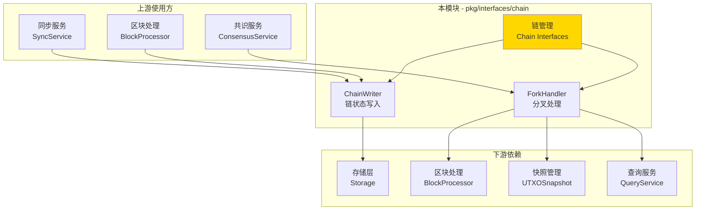
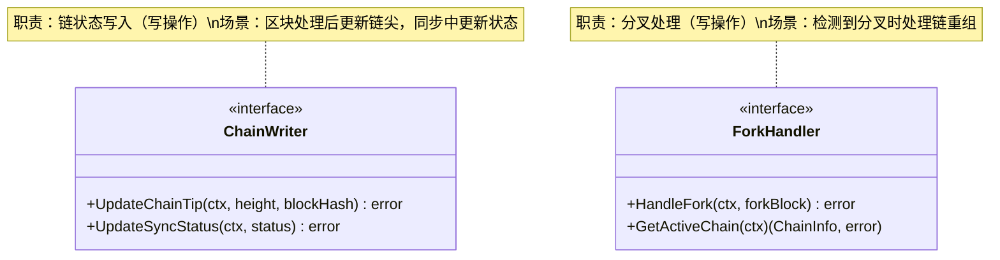

# Chain - 公共接口

---

## 📌 版本信息

- **版本**：1.0
- **状态**：stable
- **最后更新**：2025-11-01
- **最后审核**：2025-11-01
- **所有者**：WES Chain 开发组
- **适用范围**：WES 系统链管理的公共接口定义

---

## 🎯 接口定位

**路径**：`pkg/interfaces/chain/`

**目的**：定义链管理的公共接口，提供链状态写入和分叉处理能力，供其他组件依赖注入和调用。

**核心原则**：
- ✅ 遵循 CQRS 架构，读写分离
- ✅ 职责单一，接口清晰
- ✅ 直接操作存储层，避免循环依赖
- ✅ 保持接口稳定，向后兼容

**解决什么问题**：
- ✅ 链尖状态管理（记录最新区块高度和哈希）
- ✅ 同步状态管理（跟踪同步进度）
- ✅ 分叉处理（检测和解决分叉，维护最长链原则）

**不解决什么问题**（边界）：
- ❌ 链状态查询（由 `pkg/interfaces/query/` 统一提供）
- ❌ 区块存储（由 infrastructure/storage 负责）
- ❌ 区块同步逻辑（由 SyncService 负责）

---

## 🏗️ 架构设计

### 整体架构

> **说明**：展示 Chain 接口在系统中的位置、上游使用方和下游依赖



**架构说明**：

| 层级 | 组件 | 职责 | 关系 |
|-----|------|------|-----|
| **上游** | BlockProcessor | 区块处理 | 处理完成后调用 ChainWriter 更新链尖 |
| **上游** | SyncService | 区块同步 | 同步过程中调用 ChainWriter 更新同步状态 |
| **上游** | ConsensusService | 共识协调 | 检测分叉时调用 ForkHandler |
| **本层** | Chain Interfaces | 链管理 | 提供链状态写入和分叉处理能力 |
| **下游** | Storage | 数据存储 | Chain 直接操作存储层 |
| **下游** | BlockProcessor | 区块处理 | ForkHandler 依赖其重新应用区块 |
| **下游** | UTXOSnapshot | 快照管理 | ForkHandler 依赖其创建和恢复快照 |
| **下游** | QueryService | 统一查询 | ForkHandler 通过其查询链状态 |

---

### 接口全景

> **说明**：展示所有公共接口的定义和方法签名



**接口关系说明**：
- `ChainWriter` 和 `ForkHandler` 独立使用，不相互依赖
- `ChainWriter` 用于正常链状态更新
- `ForkHandler` 用于异常情况下的分叉处理
- 两个接口都遵循 CQRS 写路径原则

---

## 📐 接口列表

### 接口文件 1：`writer.go`

**接口对象**：`ChainWriter`

**职责**：链状态写入，更新链尖和同步状态

**方法列表**：

```go
type ChainWriter interface {
    // UpdateChainTip 更新链尖状态
    //
    // 更新当前区块链的链尖（最新区块的高度和哈希）。
    UpdateChainTip(ctx context.Context, height uint64, blockHash []byte) error
    
    // UpdateSyncStatus 更新同步状态
    //
    // 更新链的同步状态信息。
    UpdateSyncStatus(ctx context.Context, status *types.SystemSyncStatus) error
}
```

**方法说明**：

| 方法名 | 职责 | 参数 | 返回值 | 备注 |
|-------|------|-----|-------|-----|
| `UpdateChainTip` | 更新链尖状态 | `ctx context.Context`<br/>`height uint64`<br/>`blockHash []byte` | `error` | 区块处理完成后调用 |
| `UpdateSyncStatus` | 更新同步状态 | `ctx context.Context`<br/>`status *types.SystemSyncStatus` | `error` | 同步过程中更新进度 |

**设计要点**：
- ✅ CQRS 写路径：状态更新是写操作
- ✅ 事务保证：状态更新在事务中执行
- ✅ 幂等性：重复调用结果一致

---

### 接口文件 2：`fork.go`

**接口对象**：`ForkHandler`

**职责**：分叉处理，处理区块链分叉和链重组

**方法列表**：

```go
type ForkHandler interface {
    // HandleFork 处理分叉情况
    //
    // 当检测到分叉时，处理分叉情况。
    // 根据最长链原则决定是否切换链。
    HandleFork(ctx context.Context, forkBlock *core.Block) error
    
    // GetActiveChain 获取当前活跃链
    //
    // 返回当前活跃链的信息。
    GetActiveChain(ctx context.Context) (*types.ChainInfo, error)
}
```

**方法说明**：

| 方法名 | 职责 | 参数 | 返回值 | 备注 |
|-------|------|-----|-------|-----|
| `HandleFork` | 处理分叉 | `ctx context.Context`<br/>`forkBlock *core.Block` | `error` | 根据最长链原则处理 |
| `GetActiveChain` | 获取活跃链 | `ctx context.Context` | `*types.ChainInfo, error` | 返回当前活跃链信息 |

**设计要点**：
- ✅ CQRS 写路径：分叉处理涉及状态修改
- ✅ 事务保证：分叉处理在事务中执行
- ✅ 原子性：链重组必须原子性完成

---

## 💡 使用示例

### 场景 1：区块处理后更新链尖

```go
// 在区块处理服务中注入
type BlockProcessor struct {
    chainWriter chain.ChainWriter
}

func NewBlockProcessor(chainWriter chain.ChainWriter) *BlockProcessor {
    return &BlockProcessor{
        chainWriter: chainWriter,
    }
}

// 处理区块并更新链尖
func (p *BlockProcessor) ProcessBlock(ctx context.Context, block *core.Block) error {
    // 1. 执行区块中的交易
    if err := p.executeTransactions(ctx, block); err != nil {
        return fmt.Errorf("执行交易失败: %w", err)
    }
    
    // 2. 更新链尖状态
    if err := p.chainWriter.UpdateChainTip(ctx, block.Height, block.Hash); err != nil {
        return fmt.Errorf("更新链尖失败: %w", err)
    }
    
    log.Printf("区块处理完成，链尖已更新: 高度=%d, 哈希=%x", block.Height, block.Hash)
    return nil
}
```

---

### 场景 2：同步过程中更新状态

```go
// 在同步服务中注入
type SyncService struct {
    chainWriter chain.ChainWriter
}

func NewSyncService(chainWriter chain.ChainWriter) *SyncService {
    return &SyncService{
        chainWriter: chainWriter,
    }
}

// 同步进度更新
func (s *SyncService) UpdateSyncProgress(ctx context.Context, currentHeight, targetHeight uint64) error {
    syncStatus := &types.SystemSyncStatus{
        IsSyncing:     true,
        CurrentHeight: currentHeight,
        TargetHeight:  targetHeight,
        Progress:      float64(currentHeight) / float64(targetHeight) * 100,
        UpdatedAt:     time.Now(),
    }
    
    if err := s.chainWriter.UpdateSyncStatus(ctx, syncStatus); err != nil {
        return fmt.Errorf("更新同步状态失败: %w", err)
    }
    
    log.Printf("同步进度: %d/%d (%.2f%%)", currentHeight, targetHeight, syncStatus.Progress)
    return nil
}
```

---

### 场景 3：处理分叉

```go
// 在共识服务中注入
type ConsensusService struct {
    forkHandler chain.ForkHandler
}

func NewConsensusService(forkHandler chain.ForkHandler) *ConsensusService {
    return &ConsensusService{
        forkHandler: forkHandler,
    }
}

// 检测并处理分叉
func (s *ConsensusService) HandleIncomingBlock(ctx context.Context, block *core.Block) error {
    // 检测是否为分叉区块
    isFork, err := s.detectFork(ctx, block)
    if err != nil {
        return err
    }
    
    if isFork {
        log.Printf("检测到分叉: 高度=%d, 哈希=%x", block.Height, block.Hash)
        
        // 处理分叉
        if err := s.forkHandler.HandleFork(ctx, block); err != nil {
            return fmt.Errorf("处理分叉失败: %w", err)
        }
        
        // 获取处理后的活跃链
        activeChain, err := s.forkHandler.GetActiveChain(ctx)
        if err != nil {
            return err
        }
        
        log.Printf("分叉已处理，当前活跃链: 高度=%d, 哈希=%x", 
            activeChain.Height, activeChain.BestBlockHash)
    }
    
    return nil
}
```

---

### 场景 4：多接口组合使用

```go
// 在应用服务中同时注入两个接口
type ChainService struct {
    chainWriter chain.ChainWriter
    forkHandler chain.ForkHandler
}

func NewChainService(
    writer chain.ChainWriter,
    handler chain.ForkHandler,
) *ChainService {
    return &ChainService{
        chainWriter: writer,
        forkHandler: handler,
    }
}

// 智能区块应用（自动检测和处理分叉）
func (s *ChainService) ApplyBlock(ctx context.Context, block *core.Block) error {
    // 1. 检测分叉
    activeChain, err := s.forkHandler.GetActiveChain(ctx)
    if err != nil {
        return err
    }
    
    if block.PreviousHash != activeChain.BestBlockHash {
        // 分叉情况
        if err := s.forkHandler.HandleFork(ctx, block); err != nil {
            return fmt.Errorf("分叉处理失败: %w", err)
        }
    } else {
        // 正常情况，直接更新链尖
        if err := s.chainWriter.UpdateChainTip(ctx, block.Height, block.Hash); err != nil {
            return fmt.Errorf("更新链尖失败: %w", err)
        }
    }
    
    return nil
}
```

---

## 🔄 与内部接口的关系

**内部接口层**：`internal/core/chain/interfaces/`

**关系说明**：
- 内部接口**嵌入**本公共接口
- 内部接口扩展组件内部运行所需的方法（如性能指标、内部状态等）
- 具体实现**只实现内部接口**，自动满足公共接口

**示意图**：

```
pkg/interfaces/chain/              ← 您在这里（公共接口）
    ├── writer.go                  → ChainWriter
    └── fork.go                    → ForkHandler
    ↓ 嵌入/继承
internal/core/chain/interfaces/    ← 内部接口（继承公共接口）
    ├── writer.go                  → InternalChainWriter (嵌入 ChainWriter)
    └── fork.go                    → InternalForkHandler (嵌入 ForkHandler)
    ↓ 实现
internal/core/chain/               ← 具体实现
    ├── writer/                    → 实现 InternalChainWriter
    └── fork/                      → 实现 InternalForkHandler
```

**继承示例**：

```go
// 公共接口 (pkg/interfaces/chain/writer.go)
type ChainWriter interface {
    UpdateChainTip(ctx context.Context, height uint64, blockHash []byte) error
    UpdateSyncStatus(ctx context.Context, status *types.SystemSyncStatus) error
}

// 内部接口 (internal/core/chain/interfaces/writer.go)
type InternalChainWriter interface {
    ChainWriter  // 嵌入公共接口
    
    // 内部专用方法
    GetWriterMetrics(ctx context.Context) (*WriterMetrics, error)
}

// 具体实现 (internal/core/chain/writer/service.go)
type Service struct {
    storage storage.Storage
}

// 实现内部接口（自动满足公共接口）
func (s *Service) UpdateChainTip(ctx context.Context, height uint64, blockHash []byte) error {
    // 实现逻辑
}

func (s *Service) UpdateSyncStatus(ctx context.Context, status *types.SystemSyncStatus) error {
    // 实现逻辑
}

func (s *Service) GetWriterMetrics(ctx context.Context) (*WriterMetrics, error) {
    // 内部方法实现
}
```

---

## 📊 接口稳定性

| 版本 | 稳定性 | 说明 |
|-----|-------|------|
| v1.0 | ✅ stable | 当前稳定版本，已在生产环境验证 |

**变更原则**：
- ✅ 新增方法：兼容性变更，次版本号 +1
- ⚠️ 修改方法签名：破坏性变更，主版本号 +1，需提前通知
- ❌ 删除方法：破坏性变更，主版本号 +1，需提供迁移指南

**兼容性承诺**：
- 公共接口保持向后兼容
- 内部接口可以更灵活变更
- 重大变更提前一个版本标记为 deprecated

---

## 📚 相关文档

### 设计文档
- [公共接口设计规范](../../../docs/system/designs/interfaces/public-interface-design.md)
- [代码组织规范](../../../docs/system/standards/principles/code-organization.md)

### 组件文档
- [Chain 组件总览](../../../docs/components/core/chain/README.md)
- [Chain 业务文档](../../../docs/components/core/chain/business.md)
- [Chain 接口文档](../../../docs/components/core/chain/interfaces.md)
- [Chain 实现文档](../../../docs/components/core/chain/implementation.md)

### 内部实现
- [内部接口目录](../../../internal/core/chain/interfaces/README.md)
- [组件实现目录](../../../internal/core/chain/README.md)

### 相关接口
- [Block 接口](../block/README.md) - 区块管理接口
- [EUTXO 接口](../eutxo/README.md) - UTXO管理接口
- [Query 接口](../query/README.md) - 统一查询接口

---

## 📝 变更历史

| 版本 | 日期 | 变更内容 | 作者 |
|-----|------|---------|------|
| 1.0 | 2025-11-01 | 初始版本，定义 ChainWriter、ForkHandler 接口 | WES Chain 开发组 |

---

## ✅ 接口设计检查清单

- [x] CQRS 读写分离
- [x] 职责单一
- [x] 接口命名符合规范（*Writer, *Handler）
- [x] 方法命名符合规范（Update*, Handle*, Get*）
- [x] 参数设计符合规范（context.Context 作为第一个参数）
- [x] 无循环依赖
- [x] 无 repository 依赖
- [x] 完整的注释文档
- [x] 使用示例完整
- [x] 版本信息完整

---

**维护说明**：
- 📝 保持版本信息和变更历史的及时更新
- 🔄 接口变更需同步更新文档和示例
- ✅ 新增接口需补充到接口列表和架构图
- 📚 重大变更需在相关文档中添加迁移指南
- ⚠️ UpdateSyncStatus 的参数类型已统一为 types.SystemSyncStatus

